## Update log
- 2/11/2026: 24 hour extension on due date due to large number of students who did not activate GitHub Student Pack before Monday
- 2/10/2026: Removed the line "You only receive implementation points if you also have tests that detect bugs in that component" - we relaxed this after HW1/HW2
- 2/8/2026: Note error in handout test `MarkdownExporterTest.java` line 57: `assertTrue(markdown.contains("- 2 cup flour"));` should be `assertTrue(markdown.contains("- 2 cups flour"));`

---

## Overview

In this assignment, you'll expand the CookYourBooks application in two major directions: **domain modeling** and **persistence architecture**. You will:

- Model the different sources recipes can come from (published cookbooks, personal collections, websites) and a user's library that organizes them
- Implement JSON file storage so the application can save and load collections between sessions
- Export recipes and collections to Markdown

This assignment emphasizes **separating concerns** between your core domain logic and external concerns like storage and file formats. By defining clear **repository interfaces** (what your application needs) and **concrete implementations** (how those needs are fulfilled), you create a system that's easier to test, maintain, and extend.

**This is the first assignment where AI assistants are encouraged.** The domain modeling and serialization work includes plenty of design decisions and boilerplate code—perfect for practicing effective AI collaboration. See the [AI Workflow Guide](/assignments/Appendices/cyb3-ai-workflow) for structured guidance on using AI effectively throughout this assignment.

**Due:** Thursday, February 13, 2026 at 11:59 PM Boston Time

**Prerequisites:** This assignment builds on the A2 sample implementation (provided). You should be familiar with `Recipe`, `Quantity`, `Ingredient`, and the conversion system from Assignments 1 and 2.

**Starter Code:** We provide all interface definitions and supporting types so you can focus on implementation and design decisions rather than transcription. See [What's Implemented For You](#whats-implemented-for-you) for details.

:::tip How to Succeed on This Assignment

This assignment has more moving parts than previous ones. Here's a pacing strategy that works:

1. **Read this handout when it's released.** Skim the whole thing to understand the scope. You don't need to understand every detail yet—just get the big picture.
2. **Look at the starter code on Friday.** Open the files, read through `CookbookImpl` (the reference implementation), and start connecting the handout to actual code.
3. **Post questions on the discussion board.** If something in the handout or starter code doesn't make sense, ask early—it helps everyone.
4. **Work incrementally over several days.** Don't try to do everything in one session. Let ideas settle and come back with fresh eyes.
5. **If you're stuck for more than 30 minutes on an error: STOP.** Post on the discussion board, then step away for a few hours. Banging your head against an error rarely helps.
6. **Submit early and often.** The limit is 15 per rolling 24 hours—use early submissions as free feedback from the autograder.

**The discussion board is your best resource.** Course staff can click your name to see your latest submission. Post publicly (anonymously or not)—your question helps future students too.

:::

---

## Learning Objectives

By completing this assignment, you will demonstrate proficiency in:

- **Separating concerns** by defining interfaces for persistence and implementing them independently ([L16: Design for Testability](/lecture-notes/l16-testing2))
- **Designing repository interfaces** that abstract persistence concerns from domain logic
- **Implementing JSON serialization** with Jackson, including polymorphic type handling
- **Using AI coding assistants effectively** for boilerplate generation and design exploration
- **Evaluating AI-generated code** for design quality and alignment with specifications
- **Writing comprehensive tests** that validate behavior and detect faults in complex systems

---

## Assignment Context and Concepts

### Where Recipes Come From

Recipes come from many sources, and CookYourBooks needs to handle them all:

- **Published cookbooks**: Physical or digital books with ISBN, author, publisher, and publication year.
- **Personal collections**: A family recipe binder, a folder of index cards, grandmother's handwritten notes—has a title and maybe some organization, but no formal publication metadata.
- **Websites**: Recipes scraped or imported from cooking websites—has a URL, possibly a site name, and maybe a date accessed.

Your challenge is to implement concrete classes that fulfill interface contracts for each of these. The interfaces define an inheritance hierarchy (`Cookbook`, `PersonalCollection`, `WebCollection` each extending `RecipeCollection`), and `CookbookImpl` is provided as a complete reference implementation for you to study and apply.

### Architecture: Layers and Interfaces

This assignment separates your application into three layers:

1. **Model**: Your core business logic—`Recipe`, `Ingredient`, `Cookbook`, etc. No dependencies on external systems like files or databases.
2. **Repository Interfaces**: Contracts that define what your application needs (e.g., `save()`, `findById()`) without specifying how they're implemented.
3. **Concrete Implementations**: Classes that fulfill those contracts (e.g., `JsonRecipeRepository` implements `RecipeRepository` using JSON file storage).

This separation enables:
- **Testability:** Test domain logic with mock repositories
- **Flexibility:** Swap JSON storage for a database without changing domain code
- **Clarity:** Each component has a single, clear responsibility

The diagram below shows the complete architecture. Blue dashed classes are provided interfaces; yellow classes are what you implement.

```mermaid
classDiagram
    direction TB

    class Recipe { <<from A2>> }
    class Ingredient { <<abstract, from A1>> }
    class Quantity { <<abstract, from A1>> }

    class RecipeCollection {
        <<interface, provided>>
        +getId() String
        +getTitle() String
        +getSourceType() SourceType
        +getRecipes() List~Recipe~
        +findRecipeById(String) Optional~Recipe~
        +containsRecipe(String) boolean
        +addRecipe(Recipe) RecipeCollection
        +removeRecipe(String) RecipeCollection
    }

    class Cookbook {
        <<interface, provided>>
        +getAuthor() Optional~String~
        +getIsbn() Optional~String~
        +getPublisher() Optional~String~
        +getPublicationYear() OptionalInt
    }

    class PersonalCollection {
        <<interface, provided>>
        +getDescription() Optional~String~
        +getNotes() Optional~String~
    }

    class WebCollection {
        <<interface, provided>>
        +getSourceUrl() URI
        +getDateAccessed() Optional~LocalDate~
        +getSiteName() Optional~String~
    }

    class SourceType {
        <<enum, provided>>
        PUBLISHED_BOOK
        PERSONAL
        WEBSITE
    }

    class CookbookImpl { <<provided reference>> }
    class PersonalCollectionImpl { <<you implement>> }
    class WebCollectionImpl { <<you implement>> }

    class UserLibrary {
        <<interface, provided>>
        +getCollections() List~RecipeCollection~
        +addCollection(RecipeCollection) UserLibrary
        +removeCollection(String) UserLibrary
        +findRecipesByTitle(String) List~Recipe~
        +findCollectionById(String) Optional~RecipeCollection~
        +findCollectionByTitle(String) Optional~RecipeCollection~
        +findAllCollectionsByTitle(String) List~RecipeCollection~
        +findRecipeById(String) Optional~Recipe~
    }

    class UserLibraryImpl { <<you implement>> }

    class RecipeRepository {
        <<interface, provided>>
        +save(Recipe) void
        +findById(String) Optional~Recipe~
        +findByTitle(String) Optional~Recipe~
        +findAll() List~Recipe~
        +delete(String) void
    }

    class RecipeCollectionRepository {
        <<interface, provided>>
        +save(RecipeCollection) void
        +findById(String) Optional~RecipeCollection~
        +findByTitle(String) Optional~RecipeCollection~
        +findAll() List~RecipeCollection~
        +delete(String) void
    }

    class JsonRecipeRepository {
        <<you implement>>
        +JsonRecipeRepository(Path storageDirectory)
    }

    class JsonRecipeCollectionRepository {
        <<you implement>>
        +JsonRecipeCollectionRepository(Path storageDirectory)
    }

    class MarkdownExporter {
        <<you implement>>
        +exportRecipe(Recipe) String
        +exportCollection(RecipeCollection) String
        +exportToFile(Recipe, Path) void
        +exportToFile(RecipeCollection, Path) void
    }

    RecipeCollection <|-- Cookbook
    RecipeCollection <|-- PersonalCollection
    RecipeCollection <|-- WebCollection
    Cookbook <|.. CookbookImpl
    PersonalCollection <|.. PersonalCollectionImpl
    WebCollection <|.. WebCollectionImpl
    RecipeCollection --> Recipe
    RecipeCollection --> SourceType
    UserLibrary --> RecipeCollection
    UserLibrary <|.. UserLibraryImpl
    RecipeRepository <|.. JsonRecipeRepository
    RecipeCollectionRepository <|.. JsonRecipeCollectionRepository

    style Recipe fill:#e0e0e0,stroke:#999
    style Ingredient fill:#e0e0e0,stroke:#999
    style Quantity fill:#e0e0e0,stroke:#999
    style RecipeCollection fill:#90D5FF,stroke:#4ac,stroke-width:2px,stroke-dasharray: 5 5
    style Cookbook fill:#90D5FF,stroke:#4ac,stroke-width:2px,stroke-dasharray: 5 5
    style PersonalCollection fill:#90D5FF,stroke:#4ac,stroke-width:2px,stroke-dasharray: 5 5
    style WebCollection fill:#90D5FF,stroke:#4ac,stroke-width:2px,stroke-dasharray: 5 5
    style RecipeRepository fill:#90D5FF,stroke:#4ac,stroke-width:2px,stroke-dasharray: 5 5
    style RecipeCollectionRepository fill:#90D5FF,stroke:#4ac,stroke-width:2px,stroke-dasharray: 5 5
    style SourceType fill:#90D5FF,stroke:#4ac,stroke-width:2px,stroke-dasharray: 5 5
    style UserLibrary fill:#90D5FF,stroke:#4ac,stroke-width:2px,stroke-dasharray: 5 5
    style CookbookImpl fill:#d4edda,stroke:#28a745
    style PersonalCollectionImpl fill:#fff3cd,stroke:#856404
    style WebCollectionImpl fill:#fff3cd,stroke:#856404
    style UserLibraryImpl fill:#fff3cd,stroke:#856404
    style JsonRecipeRepository fill:#fff3cd,stroke:#856404
    style JsonRecipeCollectionRepository fill:#fff3cd,stroke:#856404
    style MarkdownExporter fill:#fff3cd,stroke:#856404
```



**Legend:** Gray = from A1/A2 · Blue dashed = provided interfaces · Green = provided reference implementation · Yellow = you implement

### Polymorphic Serialization

The `Quantity` and `Ingredient` class hierarchies require special handling during JSON serialization because Jackson needs to know which subclass to instantiate during deserialization.

**We have already added all necessary Jackson annotations to the A2 starter code.** This includes `@JsonTypeInfo` and `@JsonSubTypes` on abstract base classes, and `@JsonCreator` / `@JsonProperty` on all constructors. Records (`IngredientRef`, `ConversionRule`) work automatically with Jackson 2.12+.

For example, the `Quantity` hierarchy produces JSON like:

```json
{ "type": "exact",       "amount": 2.5, "unit": "CUP" }
{ "type": "fractional",  "numerator": 1, "denominator": 2, "unit": "CUP" }
{ "type": "range",       "min": 2, "max": 3, "unit": "CUP" }
```

Your collection classes will need similar annotations. Use `CookbookImpl` as a guide for how to apply those annotations.

**JSON in 30 seconds:** JSON is a lightweight, human-readable text format for storing and exchanging data. It represents objects as key-value pairs (`{"title": "Cookies", "servings": 24}`), and supports strings, numbers, booleans, nulls, arrays, and nested objects. If you haven't worked with JSON before, don't worry—[this JSON and Jackson Primer](/assignments/Appendices/cyb3-jackson-primer) has everything you need to get up to speed.

**Jackson in 30 seconds:** Jackson's `ObjectMapper` converts Java objects to JSON strings and back. For immutable classes (no setters), you annotate the constructor with `@JsonCreator` and each parameter with `@JsonProperty("fieldName")` so Jackson knows how to build instances from JSON. For class hierarchies, `@JsonTypeInfo` adds a `"type"` discriminator field to the JSON, and `@JsonSubTypes` maps each type name to its concrete class—that's how Jackson knows to instantiate `ExactQuantity` vs. `FractionalQuantity` on the way back in. The [Jackson Primer](/assignments/Appendices/cyb3-jackson-primer) covers this in full with examples if you haven't worked with JSON serialization before.


### Repository Structure

```
src/
├── main/java/app/cookyourbooks/
│   ├── model/
│   │   ├── RecipeCollection.java          (PROVIDED - interface)
│   │   ├── Cookbook.java                  (PROVIDED - interface)
│   │   ├── PersonalCollection.java        (PROVIDED - interface)
│   │   ├── WebCollection.java             (PROVIDED - interface)
│   │   ├── SourceType.java                (PROVIDED - enum)
│   │   ├── UserLibrary.java               (PROVIDED - interface)
│   │   ├── CookbookImpl.java              (PROVIDED - reference, study this)
│   │   ├── PersonalCollectionImpl.java    (YOU COMPLETE)
│   │   ├── WebCollectionImpl.java         (YOU COMPLETE)
│   │   ├── UserLibraryImpl.java           (YOU COMPLETE)
│   │   └── ... (A1/A2 classes, provided)
│   ├── repository/
│   │   ├── RecipeRepository.java          (PROVIDED - interface)
│   │   ├── RecipeCollectionRepository.java (PROVIDED - interface)
│   │   └── RepositoryException.java       (PROVIDED)
│   └── adapters/
│       ├── JsonRecipeRepository.java      (YOU COMPLETE)
│       ├── JsonRecipeCollectionRepository.java (YOU COMPLETE)
│       └── MarkdownExporter.java          (YOU COMPLETE)
└── test/java/app/cookyourbooks/
    ├── model/
    │   ├── RecipeCollectionTest.java      (YOU EXPAND)
    │   └── UserLibraryTest.java           (YOU EXPAND)
    └── adapters/
        ├── JsonRecipeRepositoryTest.java  (PROVIDED - reference tests)
        ├── JsonRecipeCollectionRepositoryTest.java (YOU EXPAND)
        └── MarkdownExporterTest.java      (YOU EXPAND)
```

### What's Implemented For You

| File | Description |
|---|---|
| `RecipeCollection.java` | Base interface for all collections (with Jackson annotations) |
| `Cookbook.java` | Interface for published cookbooks |
| `PersonalCollection.java` | Interface for personal collections |
| `WebCollection.java` | Interface for web-sourced collections |
| `SourceType.java` | Enum with `PUBLISHED_BOOK`, `PERSONAL`, `WEBSITE` |
| `UserLibrary.java` | Interface for user's recipe library |
| `RecipeRepository.java` | Interface for recipe persistence |
| `RecipeCollectionRepository.java` | Interface for collection persistence |
| `RepositoryException.java` | Unchecked exception for persistence failures |
| `Recipe.java` (updated) | Now includes `id` field with auto-generation |
| **`CookbookImpl.java`** | **Complete reference implementation—study this first** |

**Test files:**

| File | Description |
|---|---|
| **`JsonRecipeRepositoryTest.java`** | **Comprehensive tests—use as a reference for testing patterns** |
| `RecipeCollectionTest.java` | Starter test file (you expand) |
| `UserLibraryTest.java` | Starter test file (you expand) |
| `JsonRecipeCollectionRepositoryTest.java` | Starter test file (you expand) |
| `MarkdownExporterTest.java` | Starter test file (you expand) |

### AI Policy for This Assignment

**You may (and should!) use tools like GitHub Copilot or Cursor throughout this assignment.**

We specifically recommend **IDE-integrated assistants** over alternatives:

- **Not Claude Code or similar agentic tools.** These work autonomously with minimal human oversight. Our course values keeping you at the center of the development process—you should be reviewing, understanding, and directing every change.
- **Not ChatGPT, Claude.ai, or other web interfaces.** Manually copying code between a browser and your IDE loses your codebase context and wastes cognitive effort on mechanics rather than design.

The goal is **AI as a collaborative partner**, not as a replacement for thinking. Simply copy-pasting the assignment into an AI and submitting its output typically results in poor design that loses manual grading points, and leaves you unable to complete future assignments.

**Document your AI usage** in the [Reflection](#reflection) section.

#### Setup: Re-Enable AI Features

In Lab 1 you disabled AI features to build foundational skills. Now turn them back on:

1. Open VS Code Settings (`⌘+,` on Mac, `Ctrl+,` on Windows/Linux)
2. Search for `chat.disableAIFeatures`
3. **Uncheck** the box

Or use this link: [vscode://settings/chat.disableAIFeatures](vscode://settings/chat.disableAIFeatures)

:::danger AI Resource Consumption — Use "Auto" Mode Only

**Do not manually select expensive AI models** (like Claude Opus, GPT-4, or other premium models) for coursework in this class. The course provides access to AI tools through Cursor, but resources are shared and limited.

**Always use "Auto" mode** in Cursor, which selects an appropriate model for your task. Auto mode balances capability with cost and is sufficient for all coursework in this class. Manually selecting premium models:
- Consumes shared resources faster, potentially affecting availability for everyone
- Provides no meaningful benefit for the tasks in this course
- May result in you being asked to pay out of pocket if you exhaust shared quotas

The default models are capable of helping with parsing, test generation, debugging, and all other tasks in this assignment. If you find yourself thinking "maybe a smarter model would help" — that's usually a sign to step back and think through the problem yourself, not to reach for a more expensive model.

:::

---

## Design Task

Before writing implementation code, you need to make and document the following design decisions. Your choices here affect your entire codebase—think first, then use AI to explore tradeoffs or validate your approach.

### Recipe ID Field

The `RecipeRepository` interface requires recipes to have unique identifiers. The starter code already includes an `id` field in `Recipe`:

```java
public Recipe(
    @Nullable String id,  // null = auto-generate UUID
    String title,
    @Nullable Quantity servings,
    List<Ingredient> ingredients,
    List<Instruction> instructions,
    List<ConversionRule> conversionRules)
```

IDs are auto-generated as UUIDs (universally unique identifiers) when `null` is passed. Repository implementations assume IDs contain no characters that are invalid in filenames. Auto-generated UUIDs satisfy this and guarantee a unique id for the entirety of the program's run.

### Collection Class Design

Each collection type must have a named implementation class with a Builder:

| Interface | Implementation Class | How to create a Builder |
|---|---|---|
| `Cookbook` | `CookbookImpl` | `CookbookImpl.builder()` |
| `PersonalCollection` | `PersonalCollectionImpl` | `PersonalCollectionImpl.builder()` |
| `WebCollection` | `WebCollectionImpl` | `WebCollectionImpl.builder()` |

Furthermore, each class has different optional data it can hold onto:

**Your primary design task** is deciding how to structure `PersonalCollectionImpl` and `WebCollectionImpl`. Study `CookbookImpl` carefully—it is a complete reference that shows the immutability pattern, Builder construction, and Jackson annotations you must follow. Then decide:

- How to store optional fields (`Optional<String>` as the field type, or nullable with conversion in the getter?)
- How to handle blank string normalization for optional String fields (blank → `Optional.empty()`)
- Where validation logic lives (builder vs. constructor)

Document your approach and rationale in `REFLECTION.md`.

**Builder Contract (all three collection types):**

All the collection types have the following methods in their builder.

| Builder method | Behavior |
|---|---|
| `id(String)` | Optional; auto-generates UUID if not called |
| `title(String)` | Required; calling with a blank string throws `IllegalArgumentException` immediately |
| `recipes(List<Recipe>)` | Optional; defaults to empty list; throws `IllegalArgumentException` if list contains duplicate IDs |
| `build()` | Throws `IllegalStateException` if `title` was not set |
| `sourceUrl(URI)` — WebCollection only | Required; `build()` throws `IllegalStateException` if not set |

Each class's builder also has methods for optional fields that only belong in that class (e.g. authors for `CookbookImpl`). The optional fields are listed below and unless specified next to the name, is considered a `String`.

| Class | Optional Fields |
|---|---|
| `CookbookImpl` | author, ISBN, publisher, publication year |
| `PersonalCollectionImpl`  description, notes |
| `WebCollectionImpl` | date accessed(`LocalDate`), site name |

Below is an example for how we would use the builder to create a `Cookbook` object.

```java
Cookbook cookbook = CookbookImpl.builder()
    .title("The Joy of Cooking")
    .author("Irma S. Rombauer")
    .publicationYear(1931)
    .build();
```

### Required Design Properties

Regardless of the structural decisions you make, all implementations must satisfy:

- **Immutability.** All domain objects must be immutable. Transformation methods return new instances.
- **Separation of concerns.** Domain classes must not depend on Jackson, file I/O, or persistence implementations.
- **Interface abstraction.** Code using repositories must depend on the interface, not the concrete class.
- **Null safety.** Use `@NonNull` / `@Nullable` from JSpecify. NullAway enforces this statically—you do not need runtime null checks for parameters.
- **Documentation.** Javadoc on all public classes and methods, including design decisions.

---

## Implementation Task

You have four concrete implementation areas. Work through them in order—each builds on the previous. During these tasks, you may (and should) refer to the [AI workflow](/assignments/Appendices/cyb3-ai-workflow) for assistance on how to use AI to assist with your design and implementation.

### What You Implement

| Your Code | Description |
|---|---|
| `PersonalCollectionImpl` | Implement following `CookbookImpl` pattern |
| `WebCollectionImpl` | Implement following `CookbookImpl` pattern |
| `UserLibraryImpl` (4 methods) | Complete the search methods |
| `JsonRecipeRepository` | Complete the provided stub |
| `JsonRecipeCollectionRepository` | Complete the provided stub |
| `MarkdownExporter` | Complete the provided stub |
| Test files | Expand all starter tests except `JsonRecipeRepositoryTest` |

---

### Part 0: Grasping the JSON

Before writing any repository code, make sure you understand what code you are inheriting. We have added new interfaces and classes. We also modified existing classes to support JSON serialization and deserialization. Make sure you read through everything provided. AI can assist here. The first two checkpoints in the [AI workflow guide](/assignments/Appendices/cyb3-ai-workflow#development-checkpoints) provide details on how you can use AI to assist with understanding.

After that, write a small test that serializes a `Recipe` to JSON, prints it, deserializes it, and checks equality. We have attached such a test below. Seeing the JSON structure first makes debugging much easier later. For how AI can assist with this as well, see the JSON Serialization Setup section in the [AI workflow guide](/assignments/Appendices/cyb3-ai-workflow#json-serialization-setup)

```java
ObjectMapper mapper = new ObjectMapper();
mapper.registerModule(new Jdk8Module());

Recipe recipe = new Recipe(...);  // Create a test recipe
String json = mapper.writeValueAsString(recipe);
System.out.println(json);  // See the JSON structure

Recipe restored = mapper.readValue(json, Recipe.class);
assertEquals(recipe, restored);  // Verify round-trip
```


### Part 1: Collection Classes

Implement `PersonalCollectionImpl` and `WebCollectionImpl` following the design in `CookbookImpl`.

See the [Collection Class Design](#collection-class-design) for information on the design.

#### Behavioral specifications for all collection types

Refer to the Javadoc on `RecipeCollection` for the full method-level specifications. In addition, the following behaviors must also be satisfied:

- Recipe order is preserved and significant for equality comparisons
- Two collections are equal if they have the same ID, title, source type, type-specific metadata, and recipes in the same order
- Blank optional String fields (empty or whitespace-only) are treated as absent and must return `Optional.empty()`

**Jackson requirement:** Your implementations must include `@JsonCreator` / `@JsonProperty` on a constructor for deserialization to work. Study how `CookbookImpl` does this—the stub files provide method signatures, but you must add the constructor and annotations. See [Jackson in 30 seconds](#polymorphic-serialization) for more information on Jackson itself as well as a link to the primer.


#### Builder specifications

All collection classes must have builders to create instances. Use the provided `CookbookImpl` to help implement the behaviors for these builders. We have provided stubs for them in the starter code, but their behaviors are specified in the builder subsection of the [Collection Class Design](#collection-class-design) section. Do not forget to provide appropriate documentation!

**What we test:**
- `save()` followed by `findById()` returns an equal collection
- `getSourceType()` is correct after a round-trip
- Type-specific methods (e.g., `getAuthor()`) return correct values after a round-trip
- Polymorphism is preserved: saving a `Cookbook` and loading it returns a `Cookbook`, not a generic `RecipeCollection`

---

### Part 2: UserLibraryImpl

`UserLibraryImpl` is a user's in-memory collection of recipe collections. A partial implementation is provided—you must implement the four search methods.

Before diving into implementation, read the Javadoc on `UserLibraryImpl`. Each method you need to complete is documented with its full behavioral specification.

**Persistence note:** `UserLibrary` is an in-memory convenience wrapper. There is no `UserLibraryRepository`—persist by saving each collection individually via `RecipeCollectionRepository`. To restore, call `findAll()` and pass the result to the constructor.

---

### Part 3: JSON Repositories

`JsonRecipeRepository` is a `RecipeRepository` and `JsonRecipeCollectionRepository` is a `RecipeCollectionRepository`—your task is to implement all methods defined in those interfaces in each respective class, adhering to their contracts as documented in the interface Javadoc. Both classes share the same design decisions—make these once and apply them consistently across both:

- How to structure your JSON and name fields
- How to encode type information for polymorphic classes (`Quantity`, `Ingredient`)

### Part 3a: JsonRecipeRepository

Implement `public JsonRecipeRepository(@NonNull Path storageDirectory)` to create the storage directory if it doesn't exist. Throw `RepositoryException` if directory creation fails, if the path exists but is not a directory, or if corrupt/invalid JSON files are encountered during access.

**Note on delete:** Repository `delete()` is idempotent to support safe retries. This is intentionally different from `RecipeCollection.removeRecipe()` and `UserLibrary.removeCollection()`, which throw `IllegalArgumentException` on missing items to catch programming errors early.

### Part 3b: JsonRecipeCollectionRepository

Implement `public JsonRecipeCollectionRepository(@NonNull Path storageDirectory)` to create the storage directory if it doesn't exist. Throw `RepositoryException` if directory creation fails, if the path exists but is not a directory, or if corrupt/invalid JSON files are encountered during access.

**Note on delete:** Same idempotent behavior as `JsonRecipeRepository`—see above.

**Additional requirements beyond `RecipeCollectionRepository`:**

1. **Polymorphic collections:** Saving a `Cookbook` and loading it back must return a `Cookbook`, not a generic `RecipeCollection`.
2. **Nested recipes:** Collections contain recipes. Embedding recipes directly in the collection JSON is the simplest approach and is already supported by the provided Jackson annotations.

---

### Part 4: MarkdownExporter

Implement the missing methods in `MarkdownExporter`, carefully reading the documentation of each method before implementing.

### Part 4a: Recipe Exporter Methods

Implement `exportRecipe` and its corresponding `exportToFile` overload. Their output must conform to the following format:

```markdown
# {Recipe Title}

_Serves: {servings}_

## Ingredients

- {ingredient1.toString()}
- {ingredient2.toString()}

## Instructions

{instruction1.toString()}
{instruction2.toString()}

---

_Exported from CookYourBooks, learn more at https://www.cookyourbooks.app_
```

**Example:**

```markdown
# Arepa

_Serves: 8 whole_

## Ingredients

- 2 cups fine cornmeal
- 2.5 cups coconut milk

## Instructions

1. Preheat oven to 350°F
2. Mix ingredients in a pot over medium heat.

---

_Exported from CookYourBooks, learn more at https://www.cookyourbooks.app_
```

**Format rules:**
- If the recipe has no servings, omit the `_Serves: ..._` line entirely (no extra blank line)
- Use `Ingredient.toString()` and `Instruction.toString()` (the latter includes the step number, e.g., "1. Mix ingredients")
- Include `## Ingredients` and `## Instructions` headers even if lists are empty
- Footer (`---` and the exported-from line) is always required
- Titles and ingredient names are included as-is (no Markdown escaping)
- Unix line endings (`\n`)

### Part 4b: Collection Exporter Methods

Implement `exportCollection` and its corresponding `exportToFile` overload. Their output must conform to the following format:

```markdown
## {Collection Title}

{metadata line}

---

# {Recipe 1 Title}

...recipe content without individual footer...

---

# {Recipe 2 Title}

...

---

_Exported from CookYourBooks, learn more at https://www.cookyourbooks.app_
```

**Metadata line by collection type:**

| Type | Format | Example |
|---|---|---|
| `Cookbook` | `_By: {author}_` (omit if no author) | `_By: Julia Child_` |
| `PersonalCollection` | `_{description}_` (omit if no description) | `_Family recipes passed down for generations_` |
| `WebCollection` | `_Source: {url}_` (always present) | `_Source: https://example.com/recipes_` |

**Example: Cookbook with one recipe:**

```markdown
## The Joy of Cooking

_By: Irma Rombauer_

---

# Chocolate Cake

_Serves: 8 whole_

## Ingredients

- 2 cups flour
- 1 cup sugar

## Instructions

1. Preheat oven to 350°F
2. Mix dry ingredients

---

_Exported from CookYourBooks, learn more at https://www.cookyourbooks.app_
```

**Format rules:**
- Collection title uses H2 (`##`); recipe titles use H1 (`#`)
- Metadata line is omitted entirely if the optional field is not present
- Recipes within a collection use the recipe format **without** the individual recipe footer
- Only the final recipe includes the CookYourBooks footer
- If a collection has no recipes, include only the header and metadata (no `---` separators)
- Unix line endings (`\n`)

---

### Testing Requirements

Testing follows the same model as Assignments 1 and 2.

- Write tests for all components you implement
- **Tests must be written to the interface, not your implementation**
- Your tests must pass on the instructor's reference implementation
- Your tests are run against intentionally buggy implementations (mutation testing)

**Required test files:**

| Test File | Focus |
|---|---|
| `model/RecipeCollectionTest.java` | Construction, immutable transformations, equals/hashCode |
| `model/UserLibraryTest.java` | Library operations, search across collections |
| `adapters/JsonRecipeCollectionRepositoryTest.java` | Collection persistence, polymorphic types, nested recipes |
| `adapters/MarkdownExporterTest.java` | Recipe format correctness; collection round-trip properties |

`JsonRecipeRepositoryTest.java` is provided with comprehensive tests and does not require expansion.

**Testing guidance:**

- **Round-trip tests:** `save(obj)` then `findById(id)` should return an equal object
- **Polymorphism tests:** Verify all collection types deserialize to the correct concrete type
- **Format tests:** For `exportRecipe`, test exact string matches against expected Markdown
- **Edge cases:** Empty collections, absent optional fields, special characters in names
- **Error cases:** Invalid input throws appropriate exceptions

:::warning Avoid Order-Dependent Tests

Several methods have unspecified ordering: `findAll()`, `findAllByTitle()`, `UserLibrary.getCollections()`, and `UserLibrary.findRecipesByTitle()` do not guarantee any particular order.
Below is an example of a test that assumes an order and another that does not assume order (or is order-independent).

```java
// BAD: assumes specific order
List<Recipe> results = repository.findAll();
assertEquals("Chocolate Cake", results.get(0).getTitle());

// GOOD: order-independent
List<Recipe> results = repository.findAll();
assertEquals(2, results.size());
assertTrue(results.stream().anyMatch(r -> r.getTitle().equals("Chocolate Cake")));
```

Tests that fail on correct implementations due to ordering assumptions will not receive credit.

:::


:::warning Testing with different JSON configurations

The reference implementation may use different JSON fields that your own. As a result, your JSON serialization and deserialization tests may pass on your implementation, but **fail** on the reference.
For example,

- Your implementation may ignore a field by annotating a getter with @JsonIgnore, whereas the reference implementation includes that field

To fix this, configure your ObjectMapper to ignore unknown properties with the following line

```java
mapper.configure(DeserializationFeature.FAIL_ON_UNKNOWN_PROPERTIES, false);
```

Rather than adding this configuration to every single test method, use JUnit 5's @BeforeEach to set up a properly configured ObjectMapper once as shown below:

```java
public class WebCollectionSerializationTest {

    private ObjectMapper mapper;

    @BeforeEach
    void setUp() {
        mapper = new ObjectMapper();
        mapper.registerModule(new Jdk8Module());
        mapper.registerModule(new JavaTimeModule());
        mapper.configure(DeserializationFeature.FAIL_ON_UNKNOWN_PROPERTIES, false);
    }

    @Test
    void myFirstTest() {
        // Just use 'mapper' directly — it's already configured!
        String json = mapper.writeValueAsString(myCollection);
        // ...
    }

    @Test
    void mySecondTest() {
        // Same mapper, same configuration, no duplication
        // ...
    }
}
```

This approach:

- Eliminates code duplication across your test methods
- Ensures consistent configuration for all tests
- Makes your tests robust to any valid implementation, not just your own

:::tip MarkdownExporter Tests Are Ideal for AI Assistance

The format is fully specified, making this excellent for AI-generated test cases. Provide the format specification to your AI assistant and ask it to generate tests covering: recipe with all fields, recipe without servings, empty ingredients/instructions, multiple ingredients, and special characters. **Verify each generated test has correct expected values—AI may produce plausible-looking tests with wrong expectations.**

:::

---

## Reflection

Complete the **6 reflection questions** in `REFLECTION.md`. Each question is worth 4 points (24 points total).

1. **AI-Assisted Pattern Replication** — Describe how you used AI to understand `CookbookImpl` and apply its patterns to your other collection implementations. What prompts were effective? What did you figure out yourself?
2. **Architecture and Testability** — Give specific examples of how interface abstraction benefited your work.
3. **JSON Serialization** — Explain how polymorphic serialization works with Jackson annotations.
4. **AI Effectiveness** — Which tasks did AI help most/least with, and why?
5. **AI for Understanding Code** — How did you use AI to understand the provided starter code?
6. **AI Iteration** — Describe a specific case where AI-generated code needed refinement.

See `REFLECTION.md` for the full question prompts and grading rubric.

---

## Grading

### Automated Grading (76 points)

#### Implementation Correctness (40 points)

| Component | Points |
|---|---|
| `RecipeCollection` domain model (tested via repository) | 10 |
| `UserLibrary` | 4 |
| `RecipeRepository` interface compliance | 2 |
| `RecipeCollectionRepository` interface compliance | 2 |
| `JsonRecipeRepository` (round-trip correctness) | 6 |
| `JsonRecipeCollectionRepository` (round-trip correctness) | 8 |
| `MarkdownExporter` (`exportRecipe` format correctness) | 4 |
| `MarkdownExporter` (`exportCollection` format) | 2 |
| `MarkdownExporter` (`exportToFile` file I/O) | 2 |

#### Test Suite Quality (36 points)

| Test File | Points | Notes |
|---|---|---|
| `RecipeCollectionTest.java` | 10 | Key focus: your collection implementations |
| `UserLibraryTest.java` | 4 | Test the search methods you implement |
| `JsonRecipeCollectionRepositoryTest.java` | 12 | Main challenge: polymorphic collections |
| `MarkdownExporterTest.java` | 10 | AI-recommended task |

### Manual Grading (Subtractive, max −30 points)

| Category | Max Deduction | Criteria |
|---|---|---|
| **Architecture** | −16 | Domain depends on persistence implementations; missing interface abstractions; tight coupling |
| **Immutability** | −6 | Mutable domain objects; exposed internal collections |
| **Documentation** | −4 | Missing Javadoc; undocumented design decisions |
| **Test Quality** | −6 | Trivial tests; tests don't verify meaningful behavior |
| **Code Style** | −10 | Poor naming; overly complex logic; inconsistent style |

### Reflection (24 points)

6 questions × 4 points each. See `REFLECTION.md` for rubric.
