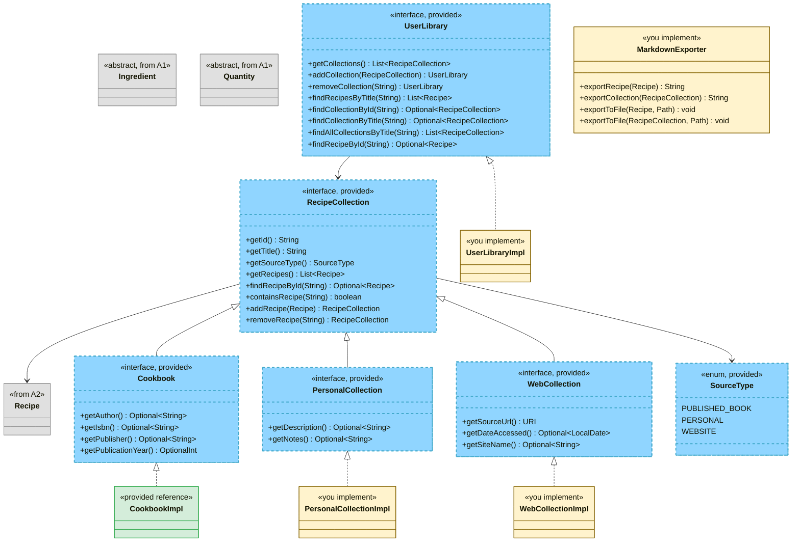

## Overview

In this assignment, you'll expand the CookYourBooks application in two major directions: **domain modeling** and **persistence architecture**. You will:

- Model the different sources recipes can come from (published cookbooks, personal collections, websites) and a user's library that organizes them
- Export recipes and collections to Markdown

This assignment emphasizes **separating concerns** between your core domain logic and external concerns like storage and file formats. 

**Due:** Thursday, May 28, 2026 at 9:00 PM Boston Time

**Prerequisites:** This assignment builds on the A2 sample implementation (provided). You should be familiar with `Recipe`, `Quantity`, `Ingredient`, and the conversion system from Assignment 2.

**Starter Code:** We provide all interface definitions and supporting types so you can focus on implementation and design decisions rather than transcription. See [What's Implemented For You](#whats-implemented-for-you) for details.

:::tip How to Succeed on This Assignment

This assignment has more moving parts than previous ones. Here's a pacing strategy that works:

1. **Read this handout when it's released.** Skim the whole thing to understand the scope. You don't need to understand every detail yet—just get the big picture.
2. **Look at the starter code on Friday.** Open the files, read through `CookbookImpl` (the reference implementation), and start connecting the handout to actual code.
3. **Post questions on the discussion board.** If something in the handout or starter code doesn't make sense, ask early—it helps everyone.
4. **Work incrementally over several days.** Don't try to do everything in one session. Let ideas settle and come back with fresh eyes.
5. **If you're stuck for more than 30 minutes on an error: STOP.** Post on the discussion board, then step away for a few hours. Banging your head against an error rarely helps.
6. **Submit early and often.** The limit is 15 per rolling 24 hours—use early submissions as free feedback from the autograder.

**The discussion board is your best resource.** Course staff can click your name to see your latest submission. Post publicly (anonymously or not)—your question helps future students too.

:::

---

## Learning Objectives

By completing this assignment, you will demonstrate proficiency in:

- **Separating concerns** by defining interfaces and implementing them independently
- **Writing comprehensive tests** that validate behavior and detect faults in complex systems

---

## Assignment Context and Concepts

### Where Recipes Come From

Recipes come from many sources, and CookYourBooks needs to handle them all:

- **Published cookbooks**: Physical or digital books with ISBN, author, publisher, and publication year.
- **Personal collections**: A family recipe binder, a folder of index cards, grandmother's handwritten notes—has a title and maybe some organization, but no formal publication metadata.
- **Websites**: Recipes scraped or imported from cooking websites—has a URL, possibly a site name, and maybe a date accessed.

Your challenge is to implement concrete classes that fulfill interface contracts for each of these. The interfaces define an inheritance hierarchy (`Cookbook`, `PersonalCollection`, `WebCollection` each extending `RecipeCollection`), and `CookbookImpl` is provided as a complete reference implementation for you to study and apply.

### Architecture: Layers and Interfaces

This assignment expands the model to hold collections of recipes and enable persistence by saving recipes and collections to Markdown files.

The diagram below shows the complete architecture. Blue dashed classes are provided interfaces; yellow classes are what you implement. We will start including these diagrams when relevant as our codebase increases in size and complexity.


```mermaid
classDiagram
    direction TB

    class Recipe { <<from A2>> }
    class Ingredient { <<abstract, from A1>> }
    class Quantity { <<abstract, from A1>> }

    class RecipeCollection {
        <<interface, provided>>
        +getId() String
        +getTitle() String
        +getSourceType() SourceType
        +getRecipes() List~Recipe~
        +findRecipeById(String) Optional~Recipe~
        +containsRecipe(String) boolean
        +addRecipe(Recipe) RecipeCollection
        +removeRecipe(String) RecipeCollection
    }

    class Cookbook {
        <<interface, provided>>
        +getAuthor() Optional~String~
        +getIsbn() Optional~String~
        +getPublisher() Optional~String~
        +getPublicationYear() OptionalInt
    }

    class PersonalCollection {
        <<interface, provided>>
        +getDescription() Optional~String~
        +getNotes() Optional~String~
    }

    class WebCollection {
        <<interface, provided>>
        +getSourceUrl() URI
        +getDateAccessed() Optional~LocalDate~
        +getSiteName() Optional~String~
    }

    class SourceType {
        <<enum, provided>>
        PUBLISHED_BOOK
        PERSONAL
        WEBSITE
    }

    class CookbookImpl { <<provided reference>> }
    class PersonalCollectionImpl { <<you implement>> }
    class WebCollectionImpl { <<you implement>> }

    class UserLibrary {
        <<interface, provided>>
        +getCollections() List~RecipeCollection~
        +addCollection(RecipeCollection) UserLibrary
        +removeCollection(String) UserLibrary
        +findRecipesByTitle(String) List~Recipe~
        +findCollectionById(String) Optional~RecipeCollection~
        +findCollectionByTitle(String) Optional~RecipeCollection~
        +findAllCollectionsByTitle(String) List~RecipeCollection~
        +findRecipeById(String) Optional~Recipe~
    }

    class UserLibraryImpl { <<you implement>> }

    class MarkdownExporter {
        <<you implement>>
        +exportRecipe(Recipe) String
        +exportCollection(RecipeCollection) String
        +exportToFile(Recipe, Path) void
        +exportToFile(RecipeCollection, Path) void
    }

    RecipeCollection <|-- Cookbook
    RecipeCollection <|-- PersonalCollection
    RecipeCollection <|-- WebCollection
    Cookbook <|.. CookbookImpl
    PersonalCollection <|.. PersonalCollectionImpl
    WebCollection <|.. WebCollectionImpl
    RecipeCollection --> Recipe
    RecipeCollection --> SourceType
    UserLibrary --> RecipeCollection
    UserLibrary <|.. UserLibraryImpl

    style Recipe fill:#e0e0e0,stroke:#999
    style Ingredient fill:#e0e0e0,stroke:#999
    style Quantity fill:#e0e0e0,stroke:#999
    style RecipeCollection fill:#90D5FF,stroke:#4ac,stroke-width:2px,stroke-dasharray: 5 5
    style Cookbook fill:#90D5FF,stroke:#4ac,stroke-width:2px,stroke-dasharray: 5 5
    style PersonalCollection fill:#90D5FF,stroke:#4ac,stroke-width:2px,stroke-dasharray: 5 5
    style WebCollection fill:#90D5FF,stroke:#4ac,stroke-width:2px,stroke-dasharray: 5 5
    style SourceType fill:#90D5FF,stroke:#4ac,stroke-width:2px,stroke-dasharray: 5 5
    style UserLibrary fill:#90D5FF,stroke:#4ac,stroke-width:2px,stroke-dasharray: 5 5
    style CookbookImpl fill:#d4edda,stroke:#28a745
    style PersonalCollectionImpl fill:#fff3cd,stroke:#856404
    style WebCollectionImpl fill:#fff3cd,stroke:#856404
    style UserLibraryImpl fill:#fff3cd,stroke:#856404
    style MarkdownExporter fill:#fff3cd,stroke:#856404
```

**Legend:** Gray = from A1/A2 · Blue dashed = provided interfaces · Green = provided reference implementation · Yellow = you implement

### Repository Structure

```
src/
├── main/java/app/cookyourbooks/
│   ├── model/
│   │   ├── RecipeCollection.java          (PROVIDED - interface)
│   │   ├── Cookbook.java                  (PROVIDED - interface)
│   │   ├── PersonalCollection.java        (PROVIDED - interface)
│   │   ├── WebCollection.java             (PROVIDED - interface)
│   │   ├── SourceType.java                (PROVIDED - enum)
│   │   ├── UserLibrary.java               (PROVIDED - interface)
│   │   ├── CookbookImpl.java              (PROVIDED - reference, study this)
│   │   ├── PersonalCollectionImpl.java    (YOU COMPLETE)
│   │   ├── WebCollectionImpl.java         (YOU COMPLETE)
│   │   ├── UserLibraryImpl.java           (YOU COMPLETE)
│   │   └── ... (A1/A2 classes, provided)
│   └── adapters/
│       └── MarkdownExporter.java          (YOU COMPLETE)
└── test/java/app/cookyourbooks/
    ├── model/
    │   ├── RecipeCollectionTest.java      (YOU EXPAND)
    │   └── UserLibraryTest.java           (YOU EXPAND)
    └── adapters/
        └── MarkdownExporterTest.java      (YOU EXPAND)
```

### What's Implemented For You

| File | Description |
|---|---|
| `RecipeCollection.java` | Base interface for all collections |
| `Cookbook.java` | Interface for published cookbooks |
| `PersonalCollection.java` | Interface for personal collections |
| `WebCollection.java` | Interface for web-sourced collections |
| `SourceType.java` | Enum with `PUBLISHED_BOOK`, `PERSONAL`, `WEBSITE` |
| `UserLibrary.java` | Interface for user's recipe library |
| `Recipe.java` (updated) | Now includes `id` field with auto-generation |
| **`CookbookImpl.java`** | **Complete reference implementation—study this first** |

**Test files:**

| File | Description |
|---|---|
| `RecipeCollectionTest.java` | Starter test file (you expand) |
| `UserLibraryTest.java` | Starter test file (you expand) |
| `MarkdownExporterTest.java` | Starter test file (you expand) |

### AI Policy for This Assignment

**AI coding assistants (such as GitHub Copilot, ChatGPT, Claude, etc.) should NOT be used for this assignment.**

This assignment focuses on learning from sample code, working with a new package, and understanding how to test against file formats. You may:
- Use official Java documentation
- Consult your textbook and course materials
- Ask questions in office hours or on the course discussion board
- Discuss high-level approaches with classmates (but write your own code)

As always, planning your design and writing tests before diving into implementation allows you to check understanding, catch bugs during development,
and saves overall time in the long run.
---

## Design Task

Before writing implementation code, you need to make and document the following design decisions. Your choices here affect your entire codebase—think first, then implement.

### Recipe ID Field

For true persistence in future assignments, recipes will need unique identifiers. The starter code already includes an `id` field in `Recipe`:

```java
public Recipe(
    @Nullable String id,  // null = auto-generate UUID
    String title,
    @Nullable Quantity servings,
    List<Ingredient> ingredients,
    List<Instruction> instructions,
    List<ConversionRule> conversionRules)
```

IDs are auto-generated as UUIDs (universally unique identifiers) when `null` is passed. Our programs will assume IDs contain no characters that are invalid in filenames. Auto-generated UUIDs satisfy this and guarantee a unique id for the entirety of the program's run.

### Collection Class Design

Each collection type must have a named implementation class:

| Interface | Implementation Class |
|---|---|
| `Cookbook` | `CookbookImpl` |
| `PersonalCollection` | `PersonalCollectionImpl` |
| `WebCollection` | `WebCollectionImpl` |

Furthermore, each class has different optional data it can hold onto:

**Your primary design task** is deciding how to structure `PersonalCollectionImpl` and `WebCollectionImpl`. Study `CookbookImpl` carefully—it is a complete reference that shows the immutability pattern you must follow. Then decide:

- How to store optional fields (`Optional<String>` as the field type, or nullable with conversion in the getter?)

Document your approach and rationale in `REFLECTION.md`.

### Required Design Properties

Regardless of the structural decisions you make, all implementations must satisfy:

- **Immutability.** All domain objects must be immutable. Transformation methods return new instances.
- **Separation of concerns.** Domain classes must not depend on file I/O or persistence implementations (e.g. the `MarkdownExporter`).
- **Interface abstraction.** Code using other objects must depend on their interfaces, not the concrete class.
- **Null safety.** Use `@NonNull` / `@Nullable` from JSpecify. NullAway enforces this statically—you do not need runtime null checks for parameters.
- **Documentation.** Javadoc on all public classes and methods, including design decisions.

---

## Implementation Task

You have four concrete implementation areas. Work through them in order—each builds on the previous. 

### What You Implement

| Your Code | Description |
|---|---|
| `PersonalCollectionImpl` | Implement following `CookbookImpl` pattern |
| `WebCollectionImpl` | Implement following `CookbookImpl` pattern |
| `UserLibraryImpl` (4 methods) | Complete the search methods |
| `MarkdownExporter` | Complete the provided stub |
| Test files | Expand all starter tests |

---


### Phase 1: Collection Classes

Implement `PersonalCollectionImpl` and `WebCollectionImpl` following the design in `CookbookImpl`.

See the [Collection Class Design](#collection-class-design) for information on the design.

#### Behavioral specifications for all collection types

Refer to the Javadoc on `RecipeCollection` for the full method-level specifications. In addition, the following behaviors must also be satisfied:

- Recipe order is preserved and significant for equality comparisons
- Two collections are equal if they have the same ID, title, source type, type-specific metadata, and recipes in the same order
- Blank optional String fields (empty or whitespace-only) are treated as absent and must return `Optional.empty()`


**What we test:**
- `save()` followed by `findById()` returns an equal collection
- `getSourceType()` is correct after a round-trip
- Type-specific methods (e.g., `getAuthor()`) return correct values after a round-trip
- Polymorphism is preserved: saving a `Cookbook` and loading it returns a `Cookbook`, not a generic `RecipeCollection`

---

### Part 2: UserLibraryImpl

`UserLibraryImpl` is a user's in-memory collection of recipe collections. A partial implementation is provided—you must implement the four search methods.

Before diving into implementation, read the Javadoc on `UserLibraryImpl`. Each method you need to complete is documented with its full behavioral specification.

**Persistence note:** `UserLibrary` is an in-memory convenience wrapper. For now, the only way to guarantee persistence is to export it to Markdown using the `MarkdownExporter`. Later in the project, you will enable true persistence by parsing files containing recipes and collections.

---

### Part 3: MarkdownExporter

Implement the missing methods in `MarkdownExporter`, carefully reading the documentation of each method before implementing.

### Part 3a: Recipe Exporter Methods

Implement `exportRecipe` and its corresponding `exportToFile` overload. Their output must conform to the following format:

```markdown
# {Recipe Title}

_Serves: {servings}_

## Ingredients

- {ingredient1.toString()}
- {ingredient2.toString()}

## Instructions

{instruction1.toString()}
{instruction2.toString()}

---

_Exported from CookYourBooks, learn more at https://www.cookyourbooks.app_
```

**Example:**

```markdown
# Arepa

_Serves: 8 whole_

## Ingredients

- 2 cups fine cornmeal
- 2.5 cups coconut milk

## Instructions

1. Preheat oven to 350°F
2. Mix ingredients in a pot over medium heat.

---

_Exported from CookYourBooks, learn more at https://www.cookyourbooks.app_
```

**Format rules:**
- If the recipe has no servings, omit the `_Serves: ..._` line entirely (no extra blank line)
- Use `Ingredient.toString()` and `Instruction.toString()` (the latter includes the step number, e.g., "1. Mix ingredients")
- Include `## Ingredients` and `## Instructions` headers even if lists are empty
- Footer (`---` and the exported-from line) is always required
- Titles and ingredient names are included as-is (no Markdown escaping)
- Unix line endings (`\n`)

### Part 3b: Collection Exporter Methods

Implement `exportCollection` and its corresponding `exportToFile` overload. Their output must conform to the following format:

```markdown
## {Collection Title}

{metadata line}

---

# {Recipe 1 Title}

...recipe content without individual footer...

---

# {Recipe 2 Title}

...

---

_Exported from CookYourBooks, learn more at https://www.cookyourbooks.app_
```

**Metadata line by collection type:**

| Type | Format | Example |
|---|---|---|
| `Cookbook` | `_By: {author}_` (omit if no author) | `_By: Julia Child_` |
| `PersonalCollection` | `_{description}_` (omit if no description) | `_Family recipes passed down for generations_` |
| `WebCollection` | `_Source: {url}_` (always present) | `_Source: https://example.com/recipes_` |

**Example: Cookbook with one recipe:**

```markdown
## The Joy of Cooking

_By: Irma Rombauer_

---

# Chocolate Cake

_Serves: 8 whole_

## Ingredients

- 2 cups flour
- 1 cup sugar

## Instructions

1. Preheat oven to 350°F
2. Mix dry ingredients

---

_Exported from CookYourBooks, learn more at https://www.cookyourbooks.app_
```

**Format rules:**
- Collection title uses H2 (`##`); recipe titles use H1 (`#`)
- Metadata line is omitted entirely if the optional field is not present
- Recipes within a collection use the recipe format **without** the individual recipe footer
- Only the final recipe includes the CookYourBooks footer
- If a collection has no recipes, include only the header and metadata (no `---` separators)
- Unix line endings (`\n`)

---

### Testing Requirements

Testing follows the same model as Assignment 2.

- Write tests for all components you implement
- **Tests must be written to the interface, not your implementation**
- Your tests must pass on the instructor's reference implementation
- Your tests are run against intentionally buggy implementations (mutation testing)

**Required test files:**

| Test File | Focus |
|---|---|
| `model/RecipeCollectionTest.java` | Construction, immutable transformations, equals/hashCode |
| `model/UserLibraryTest.java` | Library operations, search across collections |
| `adapters/MarkdownExporterTest.java` | Recipe format correctness |

**Testing guidance:**

- **Format tests:** For `exportRecipe`, test exact string matches against expected Markdown
- **Edge cases:** Empty collections, absent optional fields, special characters in names
- **Error cases:** Invalid input throws appropriate exceptions

:::warning Avoid Order-Dependent Tests

Several methods have unspecified ordering: `findAll()`, `findAllByTitle()`, `UserLibrary.getCollections()`, and `UserLibrary.findRecipesByTitle()` do not guarantee any particular order.
Below is an example of a test that assumes an order and another that does not assume order (or is order-independent).

```java
//OBJECTIVE: verify that there is a recipe for Chocolate Cake in the repository

// BAD: assumes specific order
List<Recipe> results = repository.findAll();
assertEquals("Chocolate Cake", results.get(0).getTitle());

// GOOD: order-independent
List<Recipe> results = repository.findAll();
assertEquals(2, results.size());
assertTrue(results.stream().anyMatch(r -> r.getTitle().equals("Chocolate Cake")));
```

Tests that fail on correct implementations due to ordering assumptions will not receive credit.

:::


:::tip MarkdownExporter Tests Benefits from Planning

When testing the `MarkdownExporter`, consider the cases of recipes you would see For example, we could consider recipes with all fields, recipe without servings, empty ingredients/instructions, multiple ingredients, special characters, and so on. Take a moment to write down the different types of recipe objects that could be created
and manually write what the expected Markdown would be. **Remember you are allowed to share and collaborate on ideas with others**. Meet up and compare lists to see if you are missing any edge cases.
Software engineering improves when we introduce more perspectives and its a great way to learn new edge cases.

:::

---

## Reflection

Complete the **6 reflection questions** in `REFLECTION.md`. Each question is worth 4 points (24 points total).

1. **Learning from Samples** — Describe how you studied `CookbookImpl` and applied its patterns to your other collection implementations. What questions arose as you explore and how did you find answers to them?
2. **Architecture and Testability** — Give specific examples of how interface abstraction benefited your work.
3. **Recipe Search** — What techniques or algorithms did you consider when implementing the search methods for recipe collections? Why did you choose what you did?
4. **Selecting tasks for AI Effectiveness** — Some tasks here have very low complexity. Which tasks would you have AI assist you with and how? What about those specific tasks would make an AI assistant valuable or beneficial?
5. **AI for Understanding Code** — In the future, you will have explicit permission to use an AI-assistant on an assignment. Given your experiences with jumping into unknown code, what are some prompts you would (or maybe have) used to understand this given starter code?
6. **Test Planning** — How did you think about various testing situations for the recipe collections and markdown exporter? What was your process?

See `REFLECTION.md` for the full question prompts and grading rubric.

---

## Grading

### Automated Grading (76 points)

#### Implementation Correctness (40 points)

| Component | Points |
|---|---|
| `RecipeCollection` domain model (tested via repository) | 12 |
| `UserLibrary` | 6 |
| `RecipeRepository` interface compliance | 4 |
| `RecipeCollectionRepository` interface compliance | 4 |
| `MarkdownExporter` (`exportRecipe` format correctness) | 6 |
| `MarkdownExporter` (`exportCollection` format) | 4 |
| `MarkdownExporter` (`exportToFile` file I/O) | 4 |

#### Test Suite Quality (36 points)

| Test File | Points | Notes |
|---|---|---|
| `RecipeCollectionTest.java` | 14 | Key focus: your collection implementations |
| `UserLibraryTest.java` | 8 | Test the search methods you implement |
| `MarkdownExporterTest.java` | 14 | Main challenge: Identifying all the needed cases for testing |

### Manual Grading (Subtractive, max −30 points)

| Category | Max Deduction | Criteria |
|---|---|---|
| **Architecture** | −16 | Domain depends on persistence implementations; missing interface abstractions; tight coupling |
| **Immutability** | −6 | Mutable domain objects; exposed internal collections |
| **Documentation** | −4 | Missing Javadoc; undocumented design decisions |
| **Test Quality** | −6 | Trivial tests; tests don't verify meaningful behavior |
| **Code Style** | −10 | Poor naming; overly complex logic; inconsistent style |

### Reflection (24 points)

6 questions × 4 points each. See `REFLECTION.md` for rubric.
