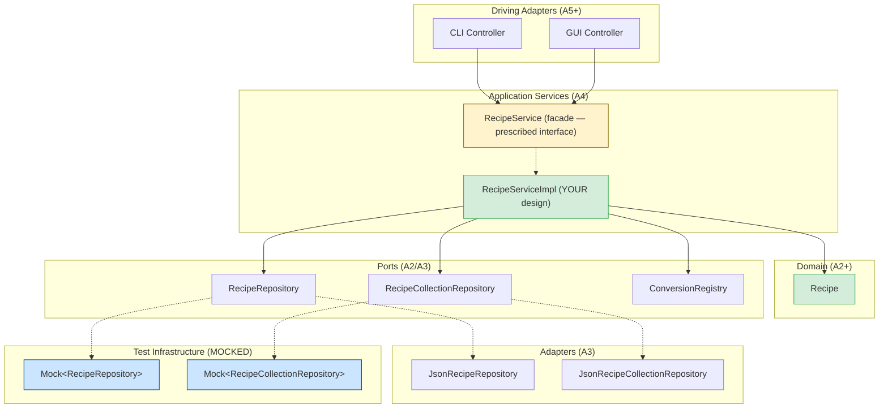

# TODO: Move the updated RecipeService.java documentation into the starter code

## Update log
- 2/19/2026: Note error in handout: the documentation on the `RecipeService` interface is incomplete compared to the handout, in particular, this page explains exactly the effects of `importFromJson` and `importFromText`, please rely on this over the documentation on the handout.
- 2/19/2026: Clarified that `findByIngredient` searches only `RecipeRepository`, not recipes embedded in collections via `RecipeCollectionRepository`. See [Shopping List Requirements](#shopping-list-requirements).

---

## Overview

In this assignment, you'll build **`RecipeService`** — the application layer that sits between user interfaces (CLI, GUI) and your domain model. This facade coordinates everything: parsing recipe text, transforming quantities, persisting to repositories, and aggregating shopping lists.

:::caution RecipeService is NOT Ideal Design

The `RecipeService` interface is **intentionally not an example of good API design**. It's an arbitrary specification you've been given — the kind of "convenient but problematic" facade you might inherit on a real project. Your job is to implement it correctly while keeping your internal design clean.

Don't use this as a model for your own API designs. Instead, recognize the patterns that make it hard to test and maintain — and practice building clean implementations behind messy interfaces.

:::

**How do you verify a service like this works?** You'll learn to use **mocks** — test doubles that stand in for real dependencies during testing. Using Mockito, you'll mock the repository interfaces to test your service in isolation, verifying both the outcomes and the interactions with dependencies.

**Due:** Thursday, February 26, 2026 at 11:59 PM Boston Time

**Prerequisites:** This assignment builds on the A3 sample implementation (provided). You should be familiar with the hexagonal architecture established in A3: `RecipeRepository`, `RecipeCollectionRepository`, and their JSON adapters. You'll also use `ConversionRegistry` from A2.

:::tip How to Succeed on This Assignment

1. **Read the `RecipeService` interface carefully.** Understand what each method must accomplish before you start coding. The interface is your specification.
2. **Start simple, build up.** Implement `findByIngredient` and `importFromJson` first — they're straightforward. Then tackle parsing (`importFromText`) and aggregation (`generateShoppingList`).
3. **Parsing is the core challenge.** Invest time understanding the ingredient parsing requirements. Break down `"2 1/2 cups flour, sifted"` into quantity type, amount, unit, name, and preparation.
4. **Test with mocks.** Use Mockito to mock repository dependencies. Verify your service calls the right methods with the right arguments and returns expected results.
5. **Submit early and often.** The autograder tests your facade. Early feedback helps you catch issues before the deadline.

:::

:::danger Start Early — This Is About Learning, Not Just Coding

**Starting early isn't about needing more hours to code** — it's about giving yourself time to think, get stuck productively, and get help when you need it.

This assignment involves design decisions and tricky parsing logic. You'll hit moments where something doesn't work and you're not sure why. That's normal and valuable — **if** you have time to step back, sleep on it, and come to office hours.

**Early Bird Bonus (+10 points):** Complete through **Part 1** (simple service methods working with tests) by **Friday, February 20 at 11:59 PM** and earn +10 bonus points. The bonus is added to the numerator of your final score after all other adjustments (your final score can be up to 110/100). This gets you to office hours *before* the hard parts.

**Submission limits:** You can submit up to **15 times per rolling 24-hour period**.

:::

---

## Learning Objectives

By completing this assignment, you will demonstrate proficiency in:

- **Building an application service layer** — implementing a facade that coordinates domain operations, parsing, and persistence ([L17: From Code Patterns to Architecture Patterns](/lecture-notes/l17-creation-patterns))
- **Implementing behind an arbitrary interface** — building clean internals despite an externally-imposed API ([L16: Designing for Testability](/lecture-notes/l16-testing2))
- **Parsing unstructured text** — transforming recipe and ingredient strings into structured domain objects
- **Using dependency injection** to wire services with their dependencies ([L17](/lecture-notes/l17-creation-patterns))
- **Unit testing with mocks** — using Mockito to test service logic in isolation ([L15: Test Doubles and Isolation](/lecture-notes/l15-testing))

---

## Assignment Context and Concepts

### Architecture Overview

This assignment adds a **`RecipeService`** facade that sits between driving adapters (like the CLI you'll build in A5) and your domain/ports.



**Legend:** Yellow = facade interface (prescribed). Green = your implementation (design freedom). Blue = mocked dependencies (for your unit tests).

**Key principle:** `RecipeService` depends only on **port interfaces**, never on concrete adapters. In tests, you mock these interfaces using Mockito.

### The Facade Problem

The `RecipeService` interface is designed for **CLI convenience**. Each method does everything the CLI needs in one call — but this convenience has implications for testing.

This interface represents an arbitrary specification you've been given, not a design you should emulate. In practice, you'll often inherit interfaces like this from legacy code, external contracts, or team decisions made before testability was a priority. The skill is implementing them cleanly internally, even when the external API is suboptimal.

:::info Testing with Mocks

Consider `importFromText(recipeText, collectionId)`. This single method:

1. Parses the recipe text (title, servings, ingredients, instructions)
2. Parses each individual ingredient string
3. Creates domain objects
4. Looks up the collection from `RecipeCollectionRepository`
5. Saves the recipe to `RecipeRepository`
6. Adds the recipe to the collection and saves the updated collection

To test this in isolation, you'll mock the repository interfaces. This lets you:
- **Control inputs:** Use `when(repo.findById(...)).thenReturn(...)` to set up the test scenario
- **Verify interactions:** Use `verify(repo).save(...)` to confirm the service called the right methods
- **Test edge cases:** Mock exceptions to test error handling without real I/O

The key is testing that your service **correctly coordinates** the parsing, lookup, and save operations.

:::

### The `RecipeService` Interface

This is the facade the CLI will call. **We test your implementation through this interface.** How you structure the implementation behind it is your design decision.

The full interface is provided in `RecipeService.java`.

### Domain Types

#### `Servings` (Provided)

```java
public class Servings {
    public Servings(int amount, @Nullable String description)
    public Servings(int amount) // description = null

    public int getAmount()
    public @Nullable String getDescription()

    public Servings scale(double factor)
}
```

Examples:
- `"Makes 24 cookies"` → `new Servings(24, "cookies")`
- `"Serves 4"` → `new Servings(4)`
- `"Serves: 8"` → `new Servings(8)`

`Recipe.getServings()` returns `@Nullable Servings` — null if the recipe has no servings information.

#### `ShoppingList` and `ShoppingItem` (Provided)

The `ShoppingList` and `ShoppingItem` interfaces are provided, along with stub implementations (`ShoppingListImpl` and `ShoppingItemImpl`) that throw `UnsupportedOperationException`. You must complete these implementations:

```java
public interface ShoppingList {
    @NonNull List<ShoppingItem> getItems();
    @NonNull List<String> getUncountableItems();
}

public interface ShoppingItem {
    @NonNull String getName();
    @NonNull Quantity getQuantity();
}
```

These are immutable data containers returned by `generateShoppingList()`. `ShoppingItem` represents `MeasuredIngredient`s with concrete quantities. `VagueIngredient`s appear in the `uncountableItems` list instead. See [Shopping List Requirements](#shopping-list-requirements).

### Exception Classes (Provided)

The following are already provided in `app.cookyourbooks.services` — you do not need to create them:

```java
/** Thrown when an import operation fails. */
public class ImportException extends RuntimeException {
    public ImportException(String message) { super(message); }
    public ImportException(String message, Throwable cause) { super(message, cause); }
}

/** Thrown when a requested collection is not found. */
public class CollectionNotFoundException extends RuntimeException {
    public CollectionNotFoundException(String collectionId) {
        super("Collection not found: " + collectionId);
    }
}

/** Thrown when a requested recipe is not found. */
public class RecipeNotFoundException extends RuntimeException {
    public RecipeNotFoundException(String recipeId) {
        super("Recipe not found: " + recipeId);
    }
}

/** Thrown when parsing fails. */
public class ParseException extends Exception {
    public ParseException(String message) { super(message); }
    public ParseException(String message, Throwable cause) { super(message, cause); }
}
```

**Note:** `ParseException` is a **checked exception** because parsing failures are expected and callers should handle them explicitly. The other exceptions are **unchecked** because they represent programming errors or environmental failures.

### AI Policy for This Assignment

AI coding assistants continue to be encouraged. Building on A3's introduction, this assignment provides more opportunities for effective AI collaboration:

| Task Type | AI Value | Strategy |
|-----------|----------|----------|
| **Service implementation** | High | AI can help translate interface contracts into working code |
| **Mock setup boilerplate** | High | AI excels at Mockito `when`/`thenReturn` patterns |
| **Parsing logic** | Moderate | Think through cases first, then use AI for implementation |
| **Test generation** | Moderate | AI for structure/ideas, you verify tests are meaningful |
| **Debugging** | High | Use scientific debugging, supported by AI |

For boilerplate (mock setup, test structure), AI saves time — but always verify expected values are correct. For parsing and aggregation logic, think through the cases yourself first, then use AI to help with implementation details.

**Document your AI usage** in the [Reflection](#reflection) section.

:::danger AI Resource Consumption — Use "Auto" Mode Only

**Do not manually select expensive AI models** (like Claude Opus, GPT-4, or other premium models). Always use **"Auto" mode** in Cursor, which selects an appropriate model for your task. Manually selecting premium models consumes shared resources and provides no meaningful benefit for the tasks in this course.

:::

---

## Design Task

Before writing implementation code, you need to make and document the following design decisions.

### Injected Dependencies

Your `RecipeService` implementation must accept these dependencies through its constructor:

```java
public RecipeServiceImpl(
    RecipeRepository recipeRepository,
    RecipeCollectionRepository collectionRepository,
    ConversionRegistry conversionRegistry
) { ... }
```

| Dependency | Purpose |
|------------|---------|
| `RecipeRepository` | Save/retrieve individual recipes |
| `RecipeCollectionRepository` | Save/retrieve collections |
| `ConversionRegistry` | Find unit conversion rules |

### Internal Structure

The `RecipeService` facade is prescribed, but how you structure the implementation is your decision. Before coding, sketch out your approach:

**Questions to answer:**
- Will you put all logic in `RecipeServiceImpl`, or extract helper classes?
- How will you structure parsing? A separate `RecipeParser` class? `IngredientParser`?
- What about scaling and shopping list aggregation — separate classes or inline?

**Recommended approach:** Extract at least a parser class. Parsing is complex enough that mixing it with service coordination makes both harder to understand and test.

```
RecipeServiceImpl
├── RecipeParser (or RecipeTextParser)
│   └── IngredientParser
├── ShoppingListAggregator (optional)
└── ... other helpers as needed
```

You don't need to submit a design document, but spending 15-30 minutes planning will save hours of refactoring later. This is a good use case for AI: describe your plan and ask for feedback before implementing.

### Required Design Properties

Regardless of structural decisions you make, your implementation must satisfy:

- **Dependency Injection:** `RecipeServiceImpl` must receive all dependencies through its constructor
- **Port Abstraction:** Depend on interfaces (`RecipeRepository`, `ConversionRegistry`), not concrete classes
- **Immutability:** Transformations (scaling, conversion) return new objects; don't mutate originals
- **Null Safety:** Use `@NonNull` and `@Nullable` annotations from JSpecify
- **Documentation:** Javadoc for all public classes and methods

---

## Implementation Task

Before writing any code, read through the `RecipeService` interface carefully — what does each method need to do, what exceptions should be thrown and when, and what are the edge cases? Understand how to use Mockito to mock repository interfaces for testing.

Then sketch out your internal structure before coding. You don't need to submit a design document, but 15–30 minutes of planning will save hours of refactoring. Revisit the [Internal Structure](#internal-structure) design decisions before proceeding.

You have six facade methods to implement, plus `ShoppingListImpl` and `ShoppingItemImpl`. Work through them in the order below.

### Part 1: Import Methods

Start here — these are the most straightforward facade methods and will build confidence before tackling parsing and aggregation. Write mock-based tests as you go.

For each method, add the required [INFO completion log message and ERROR failure log messages](#logging-requirements).  `importFromText` additionally requires DEBUG messages for parsing progress.

**Checkpoint:** Tests pass for both methods. **Submit by Friday 2/20 11:59 PM for the +10 early bird bonus.**

#### Implement `importFromJson`

Read a JSON file, deserialize it into a `Recipe`, save it to the recipe repository, and add it to the specified collection.

**Behavior:**
- Validate the collection exists **before** reading the file. If not found, throw `CollectionNotFoundException` immediately.
- If the collection exists but the file cannot be read or parsed, throw `ImportException`.
- The JSON file contains a recipe serialized in Jackson's polymorphic JSON format — the same format used by the repository adapters. Use Jackson's `ObjectMapper` to deserialize it directly, since `Recipe` and its nested types already have `@JsonCreator` and `@JsonTypeInfo` annotations.
- The imported recipe **retains its original ID** from the JSON file (unlike `scaleRecipe`/`convertRecipe`, which generate new IDs).

#### Implement `importFromText`

Parse plain text into a `Recipe`, save it to the recipe repository, and add it to the specified collection.

**Behavior:**
- Validate the collection exists **before** parsing. If not found, throw `CollectionNotFoundException` immediately.
- If the collection exists but parsing fails, throw `ParseException`.

See [Recipe Text Parsing Requirements](#recipe-text-parsing-requirements) and [Ingredient Parsing Requirements](#ingredient-parsing-requirements) for the full parsing specification.

---

### Part 2: Transformation Methods

With the import methods working, tackle the transformation methods next. Try edge cases as you go — missing recipes, invalid servings.

For each method, add the required [INFO completion log message](#logging-requirements). `scaleRecipe` additionally requires a DEBUG message for the scaling factor.

**Checkpoint:** Tests pass for both methods.

#### Implement `scaleRecipe`

Look up a recipe by ID, scale all measured ingredients proportionally, save the result as a **new recipe** (new auto-generated ID), and return it. The original recipe is not modified or overwritten.

```java
// Original recipe "rec-1" serves 4, with 2 cups flour, 1 cup sugar
Recipe scaled = service.scaleRecipe("rec-1", 8);
// scaled has a NEW ID, 4 cups flour, 2 cups sugar, and is saved to the repository
// The original recipe "rec-1" still exists unchanged
```

**Exception precedence** — validate in this order:

| Priority | Scenario | Required Behavior |
|----------|----------|-------------------|
| 1 | Target servings ≤ 0 | Throw `IllegalArgumentException` |
| 2 | Recipe ID not found | Throw `RecipeNotFoundException` |
| 3 | Recipe has no servings | Throw `IllegalArgumentException` |
| — | `VagueIngredient` | Leave unchanged (can't scale "salt to taste") |

#### Implement `convertRecipe`

Look up a recipe by ID, convert all measured ingredients to the target unit, save the result as a **new recipe** (new auto-generated ID), and return it. The original recipe is not modified or overwritten.

Delegate to `Recipe.convert(targetUnit, conversionRegistry)`, which converts each `MeasuredIngredient` to the target unit and automatically enhances the conversion registry with recipe-specific conversion rules. `VagueIngredient`s are left unchanged. If any `MeasuredIngredient` cannot be converted, `Recipe.convert` throws `UnsupportedConversionException` — let this propagate to the caller.

**Exception precedence:**

| Priority | Scenario | Required Behavior |
|----------|----------|-------------------|
| 1 | Recipe ID not found | Throw `RecipeNotFoundException` |
| 2 | Conversion not supported | Throw `UnsupportedConversionException` (from `Recipe.convert()`) |

---

### Part 3: Aggregation and Search

Implement these last. Once all tests pass, run `./gradlew build` and submit to the autograder — if mutants are surviving, add more targeted tests.

For each method, add the required [INFO completion log message](#logging-requirements). `generateShoppingList` additionally requires a DEBUG message for each recipe it aggregates.

**Checkpoint:** All tests pass and `./gradlew build` succeeds.

#### Implement `generateShoppingList`

Look up recipes by ID and aggregate their ingredients into a `ShoppingList`. You must also complete the `ShoppingListImpl` and `ShoppingItemImpl` stubs.

See [Shopping List Requirements](#shopping-list-requirements) for the full specification.

#### Implement `findByIngredient`

Search all recipes in `RecipeRepository` (via `findAll()`) by ingredient name using case-insensitive substring matching. For example, searching for `"chicken"` would match recipes containing `"chicken breast"`, `"ground chicken"`, or `"Chicken Thighs"`.

This method searches `RecipeRepository` only — it does not search recipes embedded within collections in `RecipeCollectionRepository`. Any recipe imported through the service will be findable; recipes that exist only inside a collection and were never individually saved to `RecipeRepository` will not appear in results.

---

### Parsing Specifications

#### Ingredient Parsing Requirements

Your ingredient parsing logic must handle these formats:

| Input | Expected Result |
|-------|-----------------|
| `"2 cups flour"` | MeasuredIngredient: ExactQuantity(2, CUP), name="flour" |
| `"1 cup milk"` | MeasuredIngredient: ExactQuantity(1, CUP), name="milk" |
| `"1/2 cup sugar"` | MeasuredIngredient: FractionalQuantity(0, 1, 2, CUP), name="sugar" |
| `"2 1/2 tbsp butter"` | MeasuredIngredient: FractionalQuantity(2, 1, 2, TABLESPOON), name="butter" |
| `"1.5 cups water"` | MeasuredIngredient: ExactQuantity(1.5, CUP), name="water" |
| `"100 g chocolate"` | MeasuredIngredient: ExactQuantity(100, GRAM), name="chocolate" |
| `"1 lb ground beef"` | MeasuredIngredient: ExactQuantity(1, POUND), name="ground beef" |
| `"2 cups brown sugar"` | MeasuredIngredient: ExactQuantity(2, CUP), name="brown sugar" |
| `"1 cup semi-sweet chocolate chips"` | MeasuredIngredient: ExactQuantity(1, CUP), name="semi-sweet chocolate chips" |
| `"salt to taste"` | VagueIngredient: name="salt", description="to taste" |
| `"fresh herbs"` | VagueIngredient: name="fresh herbs" |
| `"a pinch of nutmeg"` | MeasuredIngredient: ExactQuantity(1, PINCH), name="nutmeg" |
| `"2 cups flour, sifted"` | MeasuredIngredient: name="flour", preparation="sifted" |
| `"1/4 cup onion, finely diced"` | MeasuredIngredient: FractionalQuantity(0, 1, 4, CUP), name="onion", preparation="finely diced" |
| `"3 eggs"` | MeasuredIngredient: ExactQuantity(3, WHOLE), name="eggs" |
| `"1 large egg"` | MeasuredIngredient: ExactQuantity(1, WHOLE), name="large egg" |
| `"1 tsp vanilla extract"` | MeasuredIngredient: ExactQuantity(1, TEASPOON), name="vanilla extract" |
| `"2 Tbsp olive oil"` | MeasuredIngredient: ExactQuantity(2, TABLESPOON), name="olive oil" |
| `"500 mL chicken broth"` | MeasuredIngredient: ExactQuantity(500, MILLILITER), name="chicken broth" |
| `"2 fl oz vanilla extract"` | MeasuredIngredient: ExactQuantity(2, FLUID_OUNCE), name="vanilla extract" |
| `"2-3 cloves garlic"` | MeasuredIngredient: RangeQuantity(2, 3, WHOLE), name="cloves garlic" |
| `"1-2 cups water"` | MeasuredIngredient: RangeQuantity(1, 2, CUP), name="water" |
| `"1/2 cup butter or margarine"` | MeasuredIngredient: FractionalQuantity(0, 1, 2, CUP), name="butter or margarine" |
| `"2 cups all-purpose or bread flour"` | MeasuredIngredient: ExactQuantity(2, CUP), name="all-purpose or bread flour" |
| `"a large egg"` | MeasuredIngredient: ExactQuantity(1, WHOLE), name="large egg" |
| `"an onion"` | MeasuredIngredient: ExactQuantity(1, WHOLE), name="onion" |

**Parsing clarifications:**

- **`"a"` / `"an"` as a quantity:** Treated as quantity 1. When followed by a recognized unit, that unit is used (e.g., `"a pinch of nutmeg"` → quantity 1, unit `PINCH`, name `"nutmeg"`). When followed by a word that is *not* a recognized unit, use `WHOLE` (e.g., `"a large egg"` → quantity 1, unit `WHOLE`, name `"large egg"`).
- **`"of"` is a connecting word:** Strip `"of"` appearing between a unit and the ingredient name. `"a pinch of nutmeg"` → name `"nutmeg"`, `"1 cup of flour"` → name `"flour"`.
- **Implicit `WHOLE` unit:** When a number is followed by text that is *not* a recognized unit, use `WHOLE` and treat all remaining text as the name. `"3 eggs"` → quantity 3, unit `WHOLE`, name `"eggs"`.
- **Multi-word unit aliases:** Some units have multi-word aliases (e.g., `"fl oz"` for `FLUID_OUNCE`). Check two-word combinations before falling back to single-word lookup. Use `Unit.fromString()` for all unit matching.
- **Unrecognized words become part of the name:** `"cloves"` is not a recognized unit, so `"2-3 cloves garlic"` parses as range 2–3, unit `WHOLE`, name `"cloves garlic"`.
- **`TO_TASTE` unit is not produced by text parsing.** The pattern `"X to taste"` is parsed as a `VagueIngredient`. The `TO_TASTE` unit exists for programmatic use and JSON-imported recipes only.
- **`VagueIngredient` parsing:** Only the patterns shown in the table above: `"salt to taste"` (name + "to taste" description) and `"fresh herbs"` (name only, no leading number or recognized unit). Any line starting with a number or `"a"`/`"an"` produces a `MeasuredIngredient`.
- **Recipe-specific conversion rules:** Recipes parsed from text have no recipe-specific conversion rules — use an empty list for the `conversionRules` constructor parameter.

:::warning Test Scope: Only Test Specified Behaviors

Your **implementation** may support additional input formats beyond those listed above — that's fine and often unavoidable. However, your **tests** must only verify the behaviors explicitly specified in this document.

If a format isn't in the table above, don't write a test that depends on it parsing a specific way. The autograder runs your tests against the reference implementation — tests that go beyond the specification may fail against our implementation even if your code is correct.

:::

**Unit recognition:** Use `Unit.fromString(text)` to look up units by name or abbreviation (case-insensitive). Note that some units have multi-word aliases (e.g., `"fl oz"` → `FLUID_OUNCE`). See the `Unit` enum for the complete list.

**Formats NOT required (do not test for these):**
- Unicode fraction characters (`½`, `¼`, `⅓`, etc.)
- Spelled-out ranges (`1 to 2 cups`)
- Spelled-out numbers (`two cups flour`, `one dozen eggs`)
- Parenthetical notes (`2 cups flour (sifted)`)
- Temperature or time specifications embedded in ingredients

:::tip Consider Using AI for Text Parsing Implementation

Text parsing is likely unfamiliar territory — most CS students haven't written parsers before this course. This is a **great opportunity for AI-assisted implementation** using GitHub Copilot in your IDE.

**A quick primer on regular expressions:**

Regular expressions (regex) are patterns for matching text:

| Pattern | Matches | Example |
|---------|---------|---------|
| `\d+` | One or more digits | `"123"` in `"123 cups"` |
| `\d+/\d+` | A fraction | `"1/2"` in `"1/2 cup"` |
| `[a-zA-Z]+` | One or more letters | `"cups"` in `"2 cups"` |
| `\w+` | One or more word characters (letters, digits, underscore) | `"flour"` in `"2 cups flour"` |
| `\s+` | One or more whitespace | Spaces, tabs |
| `(\d+)\s+(\w+)` | Groups to capture | Captures `"2"` and `"cups"` separately |

In Java, regex patterns are written as strings, so backslashes must be escaped — `\d` in regex becomes `\\d` in a Java string. Use the [`Pattern`](https://docs.oracle.com/en/java/docs/api/java.base/java/util/regex/Pattern.html) class to compile a regular expression into a reusable pattern object. Call `pattern.matcher(input)` with the string you want to search to get a [`Matcher`](https://docs.oracle.com/en/java/docs/api/java.base/java/util/regex/Matcher.html) object, then use the `Matcher` to find and extract matches. Below is an example of using those classes to get the quantity and unit from `"2 cups of flour"`.
```java
Pattern pattern = Pattern.compile("(\\d+)\\s+(\\w+)");
Matcher matcher = pattern.matcher("2 cups flour");
if (matcher.find()) {
    String quantity = matcher.group(1);  // "2"
    String unit = matcher.group(2);      // "cups"
}
```

**Recommended AI workflow:**

1. **Identify** — What information does Copilot need? The input formats, the output types (`MeasuredIngredient`, `VagueIngredient`), and the edge cases.
2. **Engage** — Copy/paste the specification tables directly from this assignment into your Copilot chat. Don't paraphrase — concrete input/output examples are exactly what AI needs.
3. **Evaluate** — Does the generated code handle all the formats? Test a few inputs manually.
4. **Calibrate** — Steer Copilot toward correct behavior: "This fails to extract the preparation 'finely diced' — the comma-separated preparation isn't being captured."
5. **Tweak** — Refine to match quality and design standards (separation of concerns, immutability).
6. **Finalize** — Add Javadoc explaining the supported formats and any limitations.

**Remember:** AI can draft parsing logic quickly, but *you* are responsible for verifying it handles all specified formats. If you can't evaluate whether Copilot's output is correct, that's a sign you need to slow down and understand the parsing logic yourself first.

:::

#### Recipe Text Parsing Requirements

The `importFromText` method must parse plain text recipes in this format:

```
Chocolate Chip Cookies

Makes 24 cookies

Ingredients:
2 cups flour
1 cup sugar
1/2 cup butter, softened
2 eggs
1 tsp vanilla extract
chocolate chips to taste

Instructions:
1. Preheat oven to 350F
2. Mix dry ingredients
3. Cream butter and sugar
4. Combine and fold in chocolate chips
5. Bake for 12 minutes
```

**Required behaviors:**

- **Title:** First non-blank line becomes the recipe title.
- **Servings:** Lines matching `"Makes N"`, `"Makes: N"`, `"Serves N"`, or `"Serves: N"` set the servings. The number `N` becomes `Servings.amount`. Any text after the number becomes `Servings.description` (e.g., `"Makes 24 cookies"` → `Servings(24, "cookies")`; `"Serves 4"` → `Servings(4, null)`).
- **Ingredients section:** Lines after an `"Ingredients:"` header until the instructions header. The header is recognized by the word "Ingredients" (case-insensitive) optionally followed by a colon.
- **Instructions section:** Lines after an `"Instructions:"`, `"Directions:"`, or `"Steps:"` header (case-insensitive, optionally followed by a colon). Strip any leading number prefix (e.g., `"1. "`, `"2) "`). Number `Instruction` objects sequentially starting from 1. `ingredientRefs` may be an empty list.
- **Minimum valid recipe:** A recipe must have at least a non-blank title. Missing servings, empty ingredient lists, and empty instruction lists are all valid. Throw `ParseException` when the input is empty, entirely blank, or otherwise cannot produce even a title.

**What you don't need to handle:**
- Multiple recipes in one text block
- Nested sections or complex formatting
- Non-English recipes

**Exception precedence for `importFromText`:** Validate the collection exists **before** parsing. If the collection is not found, throw `CollectionNotFoundException` immediately. If the collection exists but parsing fails, throw `ParseException`.

**Exception precedence for `importFromJson`:** Validate the collection exists **before** reading the file. If not found, throw `CollectionNotFoundException` immediately. If the collection exists but the file cannot be read or parsed, throw `ImportException`.

---

### Shopping List Requirements

```java
// "rec-cookies" has 2 cups flour, 1 cup sugar, and VagueIngredient "salt" (to taste)
// "rec-cake" has 3 cups flour, 2 cups sugar, and VagueIngredient "salt" (to taste)

ShoppingList list = service.generateShoppingList(List.of("rec-cookies", "rec-cake"));

// list.getItems():            5 cups flour, 3 cups sugar
// list.getUncountableItems(): ["salt"]  (deduplicated)
```

**Required behaviors:**

- Combine `MeasuredIngredient`s with the same name (case-insensitive exact match) **and** the same unit by summing their quantities using `toDecimal()` — the result should be an `ExactQuantity` with the summed total.
- If two ingredients share a name but have different units, list them as **separate** shopping items (do not attempt unit conversion).
- `VagueIngredient`s are collected into `uncountableItems`. Deduplicate by name (case-insensitive); use the name from the first occurrence.
- **Item ordering (`getItems`):** Items appear in the order their unique name+unit combination is first encountered, iterating through recipes in `recipeIds` order and each recipe's ingredients in list order.
- **Uncountable ordering (`getUncountableItems`):** Names appear in the order their unique name (case-insensitive) is first encountered, same iteration order as above.
- If `recipeIds` is empty, return an empty `ShoppingList`.
- Throw `RecipeNotFoundException` if any recipe ID is not found.
- `findByIngredient` searches `RecipeRepository` only (via `findAll()`). Do not search recipes embedded within `RecipeCollectionRepository`.

**Ingredient matching:** Two `MeasuredIngredient`s are "the same" if they have the same name (case-insensitive exact match) **and** the same unit. When combining, use the **name from the first occurrence**.

**Quantity combining:** Always produce an `ExactQuantity` using the `toDecimal()` value from each ingredient's quantity. Don't preserve `FractionalQuantity` or `RangeQuantity` representations — `1/2 cup + 1 cup` should produce `ExactQuantity(1.5, CUP)`.

---

### Logging Requirements

Your service must implement logging using **SLF4J**. This section introduces logging concepts you'll use throughout your career.

#### Why Logging Matters

`System.out.println()` works for quick debugging, but it has serious limitations — no severity levels, no way to turn off debug messages without removing code, and no context like timestamps or class names. Professional applications use **logging frameworks** that solve these problems.

#### SLF4J: The Logging Facade

**SLF4J** is a *facade* (interface) for logging — it defines what you can do, but not how it's done. The actual logging is handled by a *backend* like Logback, Log4j, or java.util.logging. The starter code includes **Logback** as the SLF4J backend. You don't need to configure it — just use the SLF4J API.

#### Basic Usage

```java
import org.slf4j.Logger;
import org.slf4j.LoggerFactory;

public class RecipeServiceImpl implements RecipeService {
    private static final Logger logger = LoggerFactory.getLogger(RecipeServiceImpl.class);

    public Recipe importFromText(String recipeText, String collectionId) {
        logger.info("Importing recipe to collection {}", collectionId);
        logger.debug("Parsed {} ingredients", ingredients.size());
        logger.info("Successfully imported recipe '{}' with ID {}", recipe.getTitle(), recipe.getId());
        return recipe;
    }
}
```

#### Log Levels

| Level | When to Use | Example |
|-------|-------------|---------|
| **ERROR** | Something failed and needs attention | `logger.error("Failed to parse recipe", exception)` |
| **WARN** | Something unexpected but recoverable | `logger.warn("Skipping vague ingredient: {}", name)` |
| **INFO** | Major operations completing successfully | `logger.info("Imported recipe '{}' to collection", title)` |
| **DEBUG** | Detailed information for troubleshooting | `logger.debug("Parsing {} ingredient lines", count)` |
| **TRACE** | Very detailed, usually too verbose | `logger.trace("Checking unit alias: {}", alias)` |

#### Parameterized Messages

Always use **placeholders** (`{}`) instead of string concatenation:

```java
// GOOD: string formatting only happens if DEBUG is enabled
logger.debug("Scaling recipe from {} to {} servings", original, target);

// BAD: string concatenation happens even if DEBUG is disabled
logger.debug("Scaling recipe from " + original + " to " + target + " servings");
```

#### Logging Exceptions

Pass the exception as the last argument — SLF4J logs the full stack trace:

```java
try {
    // ... risky operation ...
} catch (IOException e) {
    logger.error("Failed to read file: {}", filename, e);
    throw new ImportException("Could not import from " + filename, e);
}
```

#### Required Logging (Auto-Graded)

Your logging will be automatically graded. You must use the exact logger names and message formats specified below.

**Required logger** (create in `RecipeServiceImpl`):

```java
private static final Logger logger = LoggerFactory.getLogger(RecipeServiceImpl.class);
```

The autograder checks for a logger named `app.cookyourbooks.services.RecipeServiceImpl`.

**INFO level — method completion:**

| Method | Message Pattern | Example |
|--------|-----------------|---------|
| `importFromJson` | `Imported recipe '{}' from JSON to collection '{}'` | `Imported recipe 'Chocolate Cake' from JSON to collection 'desserts'` |
| `importFromText` | `Imported recipe '{}' from text to collection '{}'` | `Imported recipe 'Pancakes' from text to collection 'breakfast'` |
| `scaleRecipe` | `Scaled recipe '{}' from {} to {} servings` | `Scaled recipe 'Cookies' from 12 to 24 servings` |
| `convertRecipe` | `Converted recipe '{}' to {}` | `Converted recipe 'Bread' to GRAM` |
| `generateShoppingList` | `Generated shopping list from {} recipes` | `Generated shopping list from 3 recipes` |
| `findByIngredient` | `Found {} recipes containing '{}'` | `Found 5 recipes containing 'flour'` |

**DEBUG level — implementation details:**

| Situation | Message Pattern | Example |
|-----------|-----------------|---------|
| Starting parse | `Parsing recipe text ({} characters)` | `Parsing recipe text (523 characters)` |
| Parsed ingredients | `Parsed {} ingredients` | `Parsed 8 ingredients` |
| Parsed instructions | `Parsed {} instructions` | `Parsed 5 instructions` |
| Scaling calculation | `Scaling factor: {}` | `Scaling factor: 2.0` |
| Shopping list aggregation | `Aggregating ingredients from recipe '{}'` | `Aggregating ingredients from recipe 'Cookies'` |

**ERROR level — failures:**

| Situation | Message Pattern | Example |
|-----------|-----------------|---------|
| File read failure | `Failed to read file: {}` | `Failed to read file: /path/to/recipe.json` |
| Parse failure | `Failed to parse recipe text` | `Failed to parse recipe text` |

Always include the exception object in ERROR logs:

```java
logger.error("Failed to read file: {}", jsonFile, e);
logger.error("Failed to parse recipe text", e);
```

:::tip Logging Output

By default, logs are written to `logs/cookyourbooks.log` rather than the console. To see logs in the console while debugging, adjust `src/main/resources/logback.xml`:

```xml
<root level="DEBUG">
    <appender-ref ref="FILE" />
    <appender-ref ref="STDOUT" />
</root>
```

The autograder uses its own logging configuration, so your `logback.xml` settings won't affect grading.

:::

---


---

## Testing Requirements

You'll write **unit tests** for your `RecipeService` implementation using **Mockito** to mock dependencies.

### Unit Tests with Mockito

#### Basic Mock Setup

```java
@ExtendWith(MockitoExtension.class)
class RecipeServiceTest {

    @Mock private RecipeRepository recipeRepository;
    @Mock private RecipeCollectionRepository collectionRepository;
    @Mock private ConversionRegistry conversionRegistry;

    private RecipeService service;

    @BeforeEach
    void setUp() {
        service = new RecipeServiceImpl(recipeRepository, collectionRepository, conversionRegistry);
    }
}
```

#### Stubbing Return Values

```java
@Test
void scaleRecipe_looksUpRecipeAndSavesScaledVersion() {
    Recipe original = createRecipeWithServings(4);
    when(recipeRepository.findById("rec-1")).thenReturn(Optional.of(original));

    Recipe scaled = service.scaleRecipe("rec-1", 8);

    assertThat(scaled.getServings().getAmount()).isEqualTo(8);
    verify(recipeRepository).save(any(Recipe.class));
}
```

#### Verifying Interactions

```java
@Test
void importFromText_savesRecipeAndUpdatesCollection() {
    RecipeCollection collection = createCollection("col-1");
    when(collectionRepository.findById("col-1")).thenReturn(Optional.of(collection));

    Recipe result = service.importFromText(recipeText, "col-1");

    verify(recipeRepository).save(any(Recipe.class));
    verify(collectionRepository).save(any(RecipeCollection.class));
}
```

#### Using Argument Captors

When you need to inspect *what* was passed to a mocked method:

```java
@Test
void scaleRecipe_savesRecipeWithCorrectScaledQuantities() {
    Recipe original = createRecipeWith(ingredient("flour", 2, CUP));
    when(recipeRepository.findById("rec-1")).thenReturn(Optional.of(original));

    service.scaleRecipe("rec-1", 8); // Scale from 4 to 8 servings (2x)

    ArgumentCaptor<Recipe> captor = ArgumentCaptor.forClass(Recipe.class);
    verify(recipeRepository).save(captor.capture());

    Recipe saved = captor.getValue();
    MeasuredIngredient flour = (MeasuredIngredient) saved.getIngredients().get(0);
    assertThat(flour.getQuantity().toDecimal()).isEqualTo(4.0); // 2 cups * 2 = 4 cups
}
```

### Testing `importFromJson` with Temporary Files

The `importFromJson` method reads from the file system — file I/O is **not** a mocked dependency, so you'll need to create actual temporary files in your tests:

```java
@Test
void importFromJson_savesRecipeAndUpdatesCollection() throws Exception {
    Path tempFile = Files.createTempFile("recipe-", ".json");
    Files.writeString(tempFile, """
        {
            "id": "rec-1",
            "title": "Test Recipe",
            "ingredients": [],
            "instructions": [],
            "conversionRules": []
        }
        """);

    RecipeCollection collection = createCollection("col-1");
    when(collectionRepository.findById("col-1")).thenReturn(Optional.of(collection));

    Recipe result = service.importFromJson(tempFile, "col-1");

    assertThat(result.getTitle()).isEqualTo("Test Recipe");
    verify(recipeRepository).save(any(Recipe.class));
    verify(collectionRepository).save(any(RecipeCollection.class));

    Files.deleteIfExists(tempFile);
}
```

Use JUnit's `@TempDir` for cleaner temporary file management:

```java
@TempDir Path tempDir;

@Test
void importFromJson_throwsImportExceptionOnBadFile() {
    Path nonexistent = tempDir.resolve("does-not-exist.json");
    RecipeCollection collection = createCollection("col-1");
    when(collectionRepository.findById("col-1")).thenReturn(Optional.of(collection));

    assertThatThrownBy(() -> service.importFromJson(nonexistent, "col-1"))
        .isInstanceOf(ImportException.class);
}
```

:::info Why Can't We Mock File I/O?

`importFromJson` takes a `Path` and directly performs file I/O rather than going through an injected dependency. A more testable design might accept an `InputStream` or a `RecipeLoader` interface that could be mocked. You'll reflect on this design tradeoff in the [Reflection](#reflection) section.

:::

:::tip Generating Test JSON with Jackson Serialization

Don't guess at the Jackson polymorphic JSON format — **generate it programmatically**:

```java
ObjectMapper mapper = new ObjectMapper();
Recipe testRecipe = new Recipe("rec-test", "Test Recipe",
    new Servings(4),
    List.of(new MeasuredIngredient("flour", new ExactQuantity(2, Unit.CUP), null, null)),
    List.of(), List.of());
String json = mapper.writerWithDefaultPrettyPrinter().writeValueAsString(testRecipe);
Files.writeString(tempFile, json);
```

This guarantees the JSON includes the correct type discriminator fields (e.g., `"type": "measured"`) that Jackson requires for polymorphic deserialization.

:::

### Test Quality via Mutation Testing

Your `RecipeService` tests are graded via **mutation testing**. We run your tests against our reference implementation with bugs introduced. If your tests catch the bugs, you score well.

:::info How This Works

1. We have a reference implementation of `RecipeService`
2. We introduce mutations (bugs) into our implementation
3. We run YOUR tests against our buggy versions
4. If your tests fail (catch the bug), the mutant is "killed" — good!
5. If your tests pass (miss the bug), the mutant "survives" — bad!

:::

### What Your Tests Should Verify

| Method | Test Cases |
|--------|-----------|
| `importFromJson` | Saves recipe, updates collection; throws `ImportException` on bad file; throws `CollectionNotFoundException` |
| `importFromText` | Parses correctly, saves, updates collection; throws on missing collection |
| `scaleRecipe` | Saves new recipe (new ID) with scaled quantities; throws `RecipeNotFoundException`; throws `IllegalArgumentException` on invalid servings |
| `convertRecipe` | Saves new recipe (new ID) with converted units; throws `UnsupportedConversionException`; throws `RecipeNotFoundException` |
| `generateShoppingList` | Combines like ingredients; collects vague ingredients into uncountable items; throws `RecipeNotFoundException` if any not found |
| `findByIngredient` | Case-insensitive substring match; returns empty list when none found |

### Required Test Files

```
src/test/java/app/cookyourbooks/
└── services/
    └── RecipeServiceTest.java     (REQUIRED)
```

All tests for the `RecipeService` specification must go in `src/test/java/app/cookyourbooks/services/`. You can organize across multiple files (e.g., `RecipeServiceParsingTest.java`, `RecipeServiceScalingTest.java`).

:::caution Test Location Matters for Grading

The autograder runs tests from `app.cookyourbooks.services` against **our reference implementation**, not yours.

If you want to write additional tests for your own helper classes (e.g., `IngredientParser`), put them in a **different package** (e.g., `app.cookyourbooks.parsing`). Tests outside the `services` package won't run against our reference implementation and won't fail unexpectedly.

- `app.cookyourbooks.services.*` → Tests the **spec** (runs against our implementation)
- Any other package → Tests **your implementation** (won't affect grading)

:::

---

## Reflection

Update `REFLECTION.md` to address:

1. **Parsing Design:** How did you structure your parsing logic? Did you create separate classes (e.g., `IngredientParser`, `RecipeTextParser`) or keep it inline? What tradeoffs did you consider? If you were explaining your design choice to a skeptical teammate who preferred a different approach, what arguments would you use to advocate for your decision?

2. **What Are Your Tests Actually Testing?** Look at your `RecipeServiceTest` suite. Are your tests primarily verifying *coordination* (the service calls the right methods in the right order) or *computation* (the service produces correct results)? Which type of bug would your tests catch? Which might they miss? Is that the right balance for a service layer?

3. **Implementing a Non-Ideal Interface:** The `RecipeService` facade bundles multiple responsibilities into single methods. How did you keep your *internal* implementation clean despite this external constraint? What would you change about the interface if you could redesign it?

4. **Mocks, Fakes, and Untestable Designs:** Compare the two testing approaches you used: (a) mocking `RecipeRepository` for methods like `scaleRecipe`, and (b) creating temp files for `importFromJson`. What bugs does each approach catch? What bugs might each miss? If you could redesign the `importFromJson` method signature to make it more testable, what would you change? What interface or abstraction would you introduce so that file reading could be mocked?

5. **What the Struggle Taught You:** Describe a moment where you were stuck on this assignment. What was confusing? How did you get unstuck? What did this experience reveal about how you work best?

6. **AI Collaboration:** Which tasks benefited most from AI assistance? Where did you need to think independently? Did the AI teach you anything new? What's one thing you learned about working effectively with AI on this assignment?

---

## Grading

### Automated Grading (76 points)

#### Implementation Correctness (40 points)

| Component | Points |
|-----------|--------|
| `importFromJson` | 6 |
| `importFromText` (recipe parsing) | 16 |
| `scaleRecipe` | 2 |
| `convertRecipe` | 2 |
| `generateShoppingList` | 4 |
| `findByIngredient` | 4 |
| Exception handling (not found, parse errors) | 2 |
| Logging (required messages at correct levels) | 4 |

#### Test Suite Quality (36 points)

| Component | Points | What We Mutate |
|-----------|--------|----------------|
| `importFromJson` | 4 | File reading, deserialization, save/update logic |
| `importFromText` | 10 | Parsing logic, ingredient extraction, section detection |
| `scaleRecipe` | 6 | Scaling calculations, vague ingredient handling |
| `convertRecipe` | 6 | Conversion delegation, exception propagation, vague ingredient handling |
| `generateShoppingList` | 6 | Aggregation logic, quantity combining, uncountable item collection |
| `findByIngredient` | 4 | Search logic, case-insensitivity |

### Manual Grading (Subtractive, max −36 points)

#### Service Architecture (max −20)

| Issue | Max Deduction | Description |
|-------|-----------|-------------|
| **Monolithic service** | −8 | All logic in `RecipeServiceImpl` with no delegation to helper classes |
| **No or weak parser extraction** | −6 | Parsing logic mixed into service methods instead of dedicated parser classes |
| **Tight coupling** | −6 | Service depends on concrete classes instead of interfaces; hard-coded dependencies instead of constructor injection |
| **Missing immutability** | −4 | Transformations mutate existing objects instead of returning new ones |

:::info Design Guidance

Review the lectures on good design before implementing:
- [L16: Designing for Testability](/lecture-notes/l16-testing2) — why facades with many responsibilities are hard to test
- [L17: From Code Patterns to Architecture Patterns](/lecture-notes/l17-creation-patterns) — service layers, dependency injection, and separating coordination from computation

The principle: each class should have one job. Services coordinate; parsers parse; aggregators aggregate.

:::

#### Test Architecture (max −28)

| Issue | Deduction | Description |
|-------|-----------|-------------|
| **Over-mocking** | −4 | Mocking domain objects or simple value objects that don't need mocking |
| **Copy/paste tests** | −8 | Same setup code duplicated across tests instead of `@BeforeEach` and helper methods |
| **Does not use mocks** | −16 | Service methods are not tested using mocks |

:::tip Test Quality Expectations

```java
// GOOD: Reusable setup and helpers with mocks
@Mock private RecipeRepository recipeRepository;
@Mock private RecipeCollectionRepository collectionRepository;

@BeforeEach
void setUp() {
    service = new RecipeServiceImpl(recipeRepository, collectionRepository, registry);
}

private Recipe createRecipeWithIngredients(String title, Ingredient... ingredients) { ... }
private void givenCollectionExists(String id) {
    when(collectionRepository.findById(id)).thenReturn(Optional.of(createCollection(id)));
}
```

```java
// BAD: Copy/paste setup in every test
@Test void test1() {
    RecipeRepository repo = mock(RecipeRepository.class);
    RecipeCollectionRepository collRepo = mock(RecipeCollectionRepository.class);
    RecipeService service = new RecipeServiceImpl(repo, collRepo, registry);
    when(collRepo.findById("col-1")).thenReturn(Optional.of(collection));
    // ... all repeated in test2, test3, test4 ...
}
```

:::

#### Code Quality (max −8)

| Issue | Deduction | Description |
|-------|-----------|-------------|
| **Missing Javadoc** | −4 | Public classes and methods lack documentation |
| **Poor naming/style** | −4 | Unclear variable names; methods doing multiple things; inconsistent formatting |

### Reflection (24 points)

6 questions × 4 points each. See [Reflection](#reflection) for full prompts.
