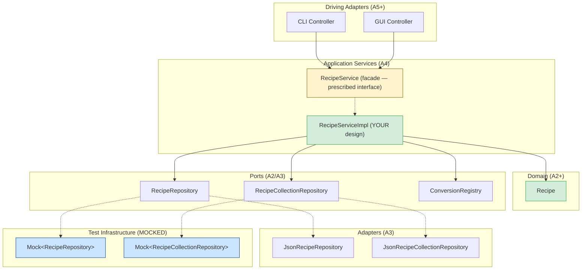

## Overview

In this assignment, you'll build **`RecipeService`** — the application layer that sits between user interfaces (CLI, GUI) and your domain model. This facade coordinates everything: transforming quantities, persisting to repositories, and aggregating shopping lists.

:::caution RecipeService is NOT Ideal Design

The `RecipeService` interface is **intentionally not an example of good API design**. It's an arbitrary specification you've been given — the kind of "convenient but problematic" facade you might inherit on a real project. Your job is to implement it correctly while keeping your internal design clean.

Don't use this as a model for your own API designs. Instead, recognize the patterns that make it hard to test and maintain — and practice building clean implementations behind messy interfaces.

:::

**How do you verify a service like this works?** You'll learn to use **mocks** — test doubles that stand in for real dependencies during testing. Using Mockito, you'll mock the repository interfaces to test your service in isolation, verifying both the outcomes and the interactions with dependencies.

**Due:** Thursday, June 4, 2026 at 8:59 PM Boston Time

**Prerequisites:** This assignment builds on the A3 sample implementation (provided) that has been extended with persitence ports: `RecipeRepository`, `RecipeCollectionRepository`, and their JSON adapters. You'll also use `ConversionRegistry` from A2.

:::tip How to Succeed on This Assignment

1. **Read the `RecipeService` interface carefully.** Understand what each method must accomplish before you start coding. The interface is your specification.
2. **Start simple, build up.** Implement `findByIngredient` and `importFromJson` first — they're more straightforward than the others. Then tackle aggregation (`generateShoppingList`).
3. **Test with mocks.** Use Mockito to mock repository dependencies. Verify your service calls the right methods with the right arguments and returns expected results.
4. **Submit early and often.** The autograder tests your facade. Early feedback helps you catch issues before the deadline.

:::

:::danger Start Early — This Is About Learning, Not Just Coding

**Starting early isn't about needing more hours to code** — it's about giving yourself time to think, get stuck productively, and get help when you need it.

This assignment involves design decisions. You'll hit moments where something doesn't work and you're not sure why. That's normal and valuable — **if** you have time to step back, sleep on it, and come to office hours.

**Submission limits:** You can submit up to **15 times per rolling 24-hour period**.

:::

---

## Learning Objectives

By completing this assignment, you will demonstrate proficiency in:

- **Building an application service layer** — implementing a facade that coordinates domain operations and persistence 
- **Implementing behind an arbitrary interface** — building clean internals despite an externally-imposed API 
- **Using dependency injection** to wire services with their dependencies
- **Unit testing with mocks** — using Mockito to test service logic in isolation ([L15: Test Doubles and Isolation](/lecture-notes/l15-testing))

---

## Assignment Context and Concepts

### Architecture Overview

This assignment adds a **`RecipeService`** facade that sits between driving adapters (like the CLI you'll build in A5) and your domain/ports.


```mermaid
flowchart TB
    subgraph "Driving Adapters (A5+)"
        CLI[CLI Controller]
        GUI[GUI Controller]
    end

    subgraph "Application Services (A4)"
        RS["RecipeService (facade — prescribed interface)"]
        RSI["RecipeServiceImpl (YOUR design)"]
    end

    subgraph "Domain (A2+)"
        R[Recipe]
    end

    subgraph "Ports (A2/A3)"
        RR[RecipeRepository]
        RCR[RecipeCollectionRepository]
        CR[ConversionRegistry]
    end

    subgraph "Adapters (A3)"
        JRR[JsonRecipeRepository]
        JRCR[JsonRecipeCollectionRepository]
    end

    subgraph "Test Infrastructure (MOCKED)"
        MRR["Mock&lt;RecipeRepository&gt;"]
        MRCR["Mock&lt;RecipeCollectionRepository&gt;"]
    end

    CLI --> RS
    GUI --> RS
    RS -.-> RSI

    RSI --> RR
    RSI --> RCR
    RSI --> CR
    RSI --> R

    RR -.-> JRR
    RR -.-> MRR
    RCR -.-> JRCR
    RCR -.-> MRCR

    style RS fill:#fff3cd,stroke:#856404
    style RSI fill:#d4edda,stroke:#28a745
    style R fill:#d4edda,stroke:#28a745
    style MRR fill:#cce5ff,stroke:#004085
    style MRCR fill:#cce5ff,stroke:#004085
```

**Legend:** Yellow = facade interface (prescribed). Green = your implementation (design freedom). Blue = mocked dependencies (for your unit tests).

**Key principle:** `RecipeService` depends only on **port interfaces**, never on concrete adapters. In tests, you mock these interfaces using Mockito.

### The Facade Problem

The `RecipeService` interface is designed for **CLI convenience**. Each method does everything the CLI needs in one call — but this convenience has implications for testing.

This interface represents an arbitrary specification you've been given, not a design you should emulate. In practice, you'll often inherit interfaces like this from legacy code, external contracts, or team decisions made before testability was a priority. The skill is implementing them cleanly internally, even when the external API is suboptimal.

:::info Testing with Mocks

Each method interacts with at least one port, like `RecipeRepository`.

To test these methods in isolation, you'll mock the repository interfaces. This lets you:
- **Control inputs:** Use `when(repo.findById(...)).thenReturn(...)` to set up the test scenario
- **Verify interactions:** Use `verify(repo).save(...)` to confirm the service called the right methods
- **Test edge cases:** Mock exceptions to test error handling without real I/O

The key is testing that your service **correctly coordinates** the lookup, save, and aggregation operations.

:::

### The `RecipeService` Interface

This is the facade the CLI will call. **We test your implementation through this interface.** How you structure the implementation behind it is your design decision.

The full interface is provided in `RecipeService.java`.

### Domain Types

#### `Servings` (Provided)

```java
public class Servings {
    public Servings(int amount, @Nullable String description)
    public Servings(int amount) // description = null

    public int getAmount()
    public @Nullable String getDescription()

    public Servings scale(double factor)
}
```

Examples:
- `"Makes 24 cookies"` → `new Servings(24, "cookies")`
- `"Serves 4"` → `new Servings(4)`
- `"Serves: 8"` → `new Servings(8)`

`Recipe.getServings()` returns `@Nullable Servings` — null if the recipe has no servings information.

#### `ShoppingList` and `ShoppingItem` (Provided)

The `ShoppingList` and `ShoppingItem` interfaces are provided, along with stub implementations (`ShoppingListImpl` and `ShoppingItemImpl`) that throw `UnsupportedOperationException`. You must complete these implementations:

```java
public interface ShoppingList {
    @NonNull List<ShoppingItem> getItems();
    @NonNull List<String> getUncountableItems();
}

public interface ShoppingItem {
    @NonNull String getName();
    @NonNull Quantity getQuantity();
}
```

These are immutable data containers returned by `generateShoppingList()`. `ShoppingItem` represents `MeasuredIngredient`s with concrete quantities. `VagueIngredient`s appear in the `uncountableItems` list instead. See [Shopping List Requirements](#shopping-list-requirements).

### Repository Classes (Provided)

To allow persistence (saving and loading of program state) in our system, we exposed two ports in the `reposirory` package: `RecipeRepository` and `RecipeCollectionRepository`. Both add functionality to save recipes and collections (respectively) to and from the outside world. We have provided two adapters to save to and load from JSON (JavaScript Object Notation), `JsonRecipeRepository` and `JsonRecipeCollectionRepository`.

We use the Jackson Annotation Libary to annotate domain objects and allow easy serialization of our domain objects to JSON. We have provided [a primer on JSON and Jackson](/assignments/Appendices/cyb3-jackson-primer). Read through this as needed for how to work with JSON, focusing on the "Serializing and deserializing" portion.

:::tip Ask Your AI Assistant

Jackson configuration can be tricky and working with a new library can be daunting. This is a great place to use your AI assistant:

"My deserialization is failing with [error]. What's wrong?"
"How do I handle a field that might be missing in the JSON?"
Just remember to understand what the generated code does before using it.

:::

### Exception Classes (Provided)

The following are already provided in `app.cookyourbooks.services` — you do not need to create them:

```java
/** Thrown when an import operation fails. */
public class ImportException extends RuntimeException {
    public ImportException(String message) { super(message); }
    public ImportException(String message, Throwable cause) { super(message, cause); }
}

/** Thrown when a requested collection is not found. */
public class CollectionNotFoundException extends RuntimeException {
    public CollectionNotFoundException(String collectionId) {
        super("Collection not found: " + collectionId);
    }
}

/** Thrown when a requested recipe is not found. */
public class RecipeNotFoundException extends RuntimeException {
    public RecipeNotFoundException(String recipeId) {
        super("Recipe not found: " + recipeId);
    }
}
```

**Note:** All exceptions here are **unchecked** because they represent programming errors or environmental failures.

### AI Policy for This Assignment

AI coding assistants are now **allowed**, but are not necessary for this assignment. This assignment provides opportunities for effective AI collaboration:

| Task Type | AI Value | Strategy |
|-----------|----------|----------|
| **Service implementation** | High | AI can help translate interface contracts into working code |
| **Mock setup boilerplate** | High | AI excels at Mockito `when`/`thenReturn` patterns |
| **Test generation** | Moderate | AI for structure/ideas, you verify tests are meaningful |
| **Debugging** | High | Use scientific debugging, supported by AI |

For boilerplate (mock setup, test structure), AI saves time — but always verify expected values are correct. For aggregation logic, think through the cases yourself first, then use AI to help with implementation details.

**Document your AI usage** in the [Reflection](#reflection) section.

:::danger AI Resource Consumption — Use "Auto" Mode Only

**Do not manually select expensive AI models** (like Claude Opus, GPT-4, or other premium models). Always use **"Auto" mode** in Cursor, which selects an appropriate model for your task. Manually selecting premium models consumes shared resources and provides no meaningful benefit for the tasks in this course.

:::

---

## Design Task

Before writing implementation code, you need to make and document the following design decisions.

### Injected Dependencies

We can **inject dependencies** into services by accepting them in the constructor. Your `RecipeService` implementation must accept these dependencies through its constructor:

```java
public RecipeServiceImpl(
    RecipeRepository recipeRepository,
    RecipeCollectionRepository collectionRepository,
    ConversionRegistry conversionRegistry
) { ... }
```

| Dependency | Purpose |
|------------|---------|
| `RecipeRepository` | Save/retrieve individual recipes |
| `RecipeCollectionRepository` | Save/retrieve collections |
| `ConversionRegistry` | Find unit conversion rules |

### Internal Structure

The `RecipeService` facade is prescribed, but how you structure the implementation is your decision. Before coding, sketch out your approach:

**Questions to answer:**
- Will you put all logic in `RecipeServiceImpl`, or extract helper classes?
- What about scaling and shopping list aggregation — separate classes or inline?

**Recommended approach:** Extract at least a single meaningful class for aggregation.

```
RecipeServiceImpl
├── ShoppingListAggregator
└── ... other helpers as needed
```

You don't need to submit a design document, but spending 15-30 minutes planning will save hours of refactoring later. This is a good use case for AI: describe your plan and ask for feedback before implementing.

### Required Design Properties

Regardless of structural decisions you make, your implementation must satisfy:

- **Dependency Injection:** `RecipeServiceImpl` must receive all dependencies through its constructor
- **Port Abstraction:** Depend on interfaces (`RecipeRepository`, `ConversionRegistry`), not concrete classes
- **Immutability:** Transformations (scaling, conversion) return new objects; don't mutate originals
- **Null Safety:** Use `@NonNull` and `@Nullable` annotations from JSpecify
- **Documentation:** Javadoc for all public classes and methods

---

## Implementation Task

Before writing any code, read through the `RecipeService` interface carefully — what does each method need to do, what exceptions should be thrown and when, and what are the edge cases? Understand how to use Mockito to mock repository interfaces for testing.

Then sketch out your internal structure before coding. You don't need to submit a design document, but 15–30 minutes of planning will save hours of refactoring. Revisit the [Internal Structure](#internal-structure) design decisions before proceeding.

You have six facade methods to implement, plus `ShoppingListImpl` and `ShoppingItemImpl`. Work through them in the order below.

### Part 1: Searching and Importing from JSON

Start here — these are the most straightforward facade methods and will build confidence before tackling aggregation. Write mock-based tests as you go. See [Unit Test With Mockito](#unit-tests-with-mockito) and [Testing `importFromJson` with Temporary Files](#testing-importfromjson-with-temporary-files) for more information on mock-based tests.

#### Implement `importFromJson`

Read a JSON file, deserialize it into a `Recipe`, save it to the recipe repository, and add it to the specified collection.

**Behavior:**
- Validate the collection exists **before** reading the file. If not found, throw `CollectionNotFoundException` immediately.
- If the collection exists but the file cannot be read or parsed, throw `ImportException`.
- The JSON file contains a recipe serialized in Jackson's polymorphic JSON format — the same format used by the repository adapters. Use Jackson's `ObjectMapper` to deserialize it directly, since `Recipe` and its nested types already have `@JsonCreator` and `@JsonTypeInfo` annotations.
- The imported recipe **retains its original ID** from the JSON file (unlike `scaleRecipe`/`convertRecipe`, which generate new IDs).

**Exception precedence for `importFromJson`:** Validate the collection exists **before** reading the file. If not found, throw `CollectionNotFoundException` immediately. If the collection exists but the file cannot be read or parsed, throw `ImportException`.

#### Implement `findByIngredient`

Search all recipes in `RecipeRepository` (via `findAll()`) by ingredient name using case-insensitive substring matching. For example, searching for `"chicken"` would match recipes containing `"chicken breast"`, `"ground chicken"`, or `"Chicken Thighs"`.

This method searches `RecipeRepository` only — it does not search recipes embedded within collections in `RecipeCollectionRepository`. Any recipe imported through the service will be findable; recipes that exist only inside a collection and were never individually saved to `RecipeRepository` will not appear in results.

---

### Part 2: Transformation Methods

With the import methods working, tackle the transformation methods next. Try edge cases as you go — missing recipes, invalid servings.

**Checkpoint:** Tests pass for both methods.

#### Implement `scaleRecipe`

Look up a recipe by ID, scale all measured ingredients proportionally, save the result as a **new recipe** (new auto-generated ID), and return it. The original recipe is not modified or overwritten.

```java
// Original recipe "rec-1" serves 4, with 2 cups flour, 1 cup sugar
Recipe scaled = service.scaleRecipe("rec-1", 8);
// scaled has a NEW ID, 4 cups flour, 2 cups sugar, and is saved to the repository
// The original recipe "rec-1" still exists unchanged
```

**Exception precedence** — validate in this order:

| Priority | Scenario | Required Behavior |
|----------|----------|-------------------|
| 1 | Target servings ≤ 0 | Throw `IllegalArgumentException` |
| 2 | Recipe ID not found | Throw `RecipeNotFoundException` |
| 3 | Recipe has no servings | Throw `IllegalArgumentException` |
| — | `VagueIngredient` | Leave unchanged (can't scale "salt to taste") |

#### Implement `convertRecipe`

Look up a recipe by ID, convert all measured ingredients to the target unit, save the result as a **new recipe** (new auto-generated ID), and return it. The original recipe is not modified or overwritten.

Delegate to `Recipe.convert(targetUnit, conversionRegistry)`, which converts each `MeasuredIngredient` to the target unit and automatically enhances the conversion registry with recipe-specific conversion rules. `VagueIngredient`s are left unchanged. If any `MeasuredIngredient` cannot be converted, `Recipe.convert` throws `UnsupportedConversionException` — let this propagate to the caller.

**Exception precedence:**

| Priority | Scenario | Required Behavior |
|----------|----------|-------------------|
| 1 | Recipe ID not found | Throw `RecipeNotFoundException` |
| 2 | Conversion not supported | Throw `UnsupportedConversionException` (from `Recipe.convert()`) |

---

### Part 3: Aggregation

Implement this last. Once all tests pass, run `./gradlew build` and submit to the autograder — if mutants are surviving, add more targeted tests.


**Checkpoint:** All tests pass and `./gradlew build` succeeds.

#### Implement `generateShoppingList`

Look up recipes by ID and aggregate their ingredients into a `ShoppingList`. You must also complete the `ShoppingListImpl` and `ShoppingItemImpl` stubs.

See [Shopping List Requirements](#shopping-list-requirements) for the full specification.

---

### Shopping List Requirements

```java
// "rec-cookies" has 2 cups flour, 1 cup sugar, and VagueIngredient "salt" (to taste)
// "rec-cake" has 3 cups flour, 2 cups sugar, and VagueIngredient "salt" (to taste)

ShoppingList list = service.generateShoppingList(List.of("rec-cookies", "rec-cake"));

// list.getItems():            5 cups flour, 3 cups sugar
// list.getUncountableItems(): ["salt"]  (deduplicated)
```

**Required behaviors:**

- Combine `MeasuredIngredient`s with the same name (case-insensitive exact match) **and** the same unit by summing their quantities using `toDecimal()` — the result should be an `ExactQuantity` with the summed total.
- If two ingredients share a name but have different units, list them as **separate** shopping items (do not attempt unit conversion).
- `VagueIngredient`s are collected into `uncountableItems`. Deduplicate by name (case-insensitive); use the name from the first occurrence.
- **Item ordering (`getItems`):** Items appear in the order their unique name+unit combination is first encountered, iterating through recipes in `recipeIds` order and each recipe's ingredients in list order.
- **Uncountable ordering (`getUncountableItems`):** Names appear in the order their unique name (case-insensitive) is first encountered, same iteration order as above.
- If `recipeIds` is empty, return an empty `ShoppingList`.
- Throw `RecipeNotFoundException` if any recipe ID is not found.
- `findByIngredient` searches `RecipeRepository` only (via `findAll()`). Do not search recipes embedded within `RecipeCollectionRepository`.

**Ingredient matching:** Two `MeasuredIngredient`s are "the same" if they have the same name (case-insensitive exact match) **and** the same unit. When combining, use the **name from the first occurrence**.

**Quantity combining:** Always produce an `ExactQuantity` using the `toDecimal()` value from each ingredient's quantity. Don't preserve `FractionalQuantity` or `RangeQuantity` representations — `1/2 cup + 1 cup` should produce `ExactQuantity(1.5, CUP)`.

---


## Testing Requirements

You'll write **unit tests** for your `RecipeService` implementation using **Mockito** to mock dependencies.

### Unit Tests with Mockito

#### Basic Mock Setup

```java
@ExtendWith(MockitoExtension.class)
class RecipeServiceTest {

    @Mock private RecipeRepository recipeRepository;
    @Mock private RecipeCollectionRepository collectionRepository;
    @Mock private ConversionRegistry conversionRegistry;

    private RecipeService service;

    @BeforeEach
    void setUp() {
        service = new RecipeServiceImpl(recipeRepository, collectionRepository, conversionRegistry);
    }
}
```

#### Stubbing Return Values

```java
@Test
void scaleRecipe_looksUpRecipeAndSavesScaledVersion() {
    Recipe original = createRecipeWithServings(4);
    when(recipeRepository.findById("rec-1")).thenReturn(Optional.of(original));

    Recipe scaled = service.scaleRecipe("rec-1", 8);

    assertThat(scaled.getServings().getAmount()).isEqualTo(8);
    verify(recipeRepository).save(any(Recipe.class));
}
```

#### Verifying Interactions

```java
@Test
void importFromText_savesRecipeAndUpdatesCollection() {
    RecipeCollection collection = createCollection("col-1");
    when(collectionRepository.findById("col-1")).thenReturn(Optional.of(collection));

    Recipe result = service.importFromText(recipeText, "col-1");

    verify(recipeRepository).save(any(Recipe.class));
    verify(collectionRepository).save(any(RecipeCollection.class));
}
```

#### Using Argument Captors

When you need to inspect *what* was passed to a mocked method:

```java
@Test
void scaleRecipe_savesRecipeWithCorrectScaledQuantities() {
    Recipe original = createRecipeWith(ingredient("flour", 2, CUP));
    when(recipeRepository.findById("rec-1")).thenReturn(Optional.of(original));

    service.scaleRecipe("rec-1", 8); // Scale from 4 to 8 servings (2x)

    ArgumentCaptor<Recipe> captor = ArgumentCaptor.forClass(Recipe.class);
    verify(recipeRepository).save(captor.capture());

    Recipe saved = captor.getValue();
    MeasuredIngredient flour = (MeasuredIngredient) saved.getIngredients().get(0);
    assertThat(flour.getQuantity().toDecimal()).isEqualTo(4.0); // 2 cups * 2 = 4 cups
}
```

### Testing `importFromJson` with Temporary Files

The `importFromJson` method reads from the file system — file I/O is **not** a mocked dependency, so you'll need to create actual temporary files in your tests:

```java
@Test
void importFromJson_savesRecipeAndUpdatesCollection() throws Exception {
    Path tempFile = Files.createTempFile("recipe-", ".json");
    Files.writeString(tempFile, """
        {
            "id": "rec-1",
            "title": "Test Recipe",
            "ingredients": [],
            "instructions": [],
            "conversionRules": []
        }
        """);

    RecipeCollection collection = createCollection("col-1");
    when(collectionRepository.findById("col-1")).thenReturn(Optional.of(collection));

    Recipe result = service.importFromJson(tempFile, "col-1");

    assertThat(result.getTitle()).isEqualTo("Test Recipe");
    verify(recipeRepository).save(any(Recipe.class));
    verify(collectionRepository).save(any(RecipeCollection.class));

    Files.deleteIfExists(tempFile);
}
```

Use JUnit's `@TempDir` for cleaner temporary file management:

```java
@TempDir Path tempDir;

@Test
void importFromJson_throwsImportExceptionOnBadFile() {
    Path nonexistent = tempDir.resolve("does-not-exist.json");
    RecipeCollection collection = createCollection("col-1");
    when(collectionRepository.findById("col-1")).thenReturn(Optional.of(collection));

    assertThatThrownBy(() -> service.importFromJson(nonexistent, "col-1"))
        .isInstanceOf(ImportException.class);
}
```

:::info Why Can't We Mock File I/O?

`importFromJson` takes a `Path` and directly performs file I/O rather than going through an injected dependency. A more testable design might accept an `InputStream` or a `RecipeLoader` interface that could be mocked. You'll reflect on this design tradeoff in the [Reflection](#reflection) section.

:::

:::tip Generating Test JSON with Jackson Serialization

Don't guess at the Jackson polymorphic JSON format — **generate it programmatically**:

```java
ObjectMapper mapper = new ObjectMapper();
Recipe testRecipe = new Recipe("rec-test", "Test Recipe",
    new Servings(4),
    List.of(new MeasuredIngredient("flour", new ExactQuantity(2, Unit.CUP), null, null)),
    List.of(), List.of());
String json = mapper.writerWithDefaultPrettyPrinter().writeValueAsString(testRecipe);
Files.writeString(tempFile, json);
```

This guarantees the JSON includes the correct type discriminator fields (e.g., `"type": "measured"`) that Jackson requires for polymorphic deserialization.

:::

### Test Quality via Mutation Testing

Your `RecipeService` tests are graded via **mutation testing**. We run your tests against our reference implementation with bugs introduced. If your tests catch the bugs, you score well.

:::info How This Works

1. We have a reference implementation of `RecipeService`
2. We introduce mutations (bugs) into our implementation
3. We run YOUR tests against our buggy versions
4. If your tests fail (catch the bug), the mutant is "killed" — good!
5. If your tests pass (miss the bug), the mutant "survives" — bad!

:::

### What Your Tests Should Verify

| Method | Test Cases |
|--------|-----------|
| `importFromJson` | Saves recipe, updates collection; throws `ImportException` on bad file; throws `CollectionNotFoundException` |
| `scaleRecipe` | Saves new recipe (new ID) with scaled quantities; throws `RecipeNotFoundException`; throws `IllegalArgumentException` on invalid servings |
| `convertRecipe` | Saves new recipe (new ID) with converted units; throws `UnsupportedConversionException`; throws `RecipeNotFoundException` |
| `generateShoppingList` | Combines like ingredients; collects vague ingredients into uncountable items; throws `RecipeNotFoundException` if any not found |
| `findByIngredient` | Case-insensitive substring match; returns empty list when none found |

### Required Test Files

```
src/test/java/app/cookyourbooks/
└── services/
    └── RecipeServiceTest.java     (REQUIRED)
```

All tests for the `RecipeService` specification must go in `src/test/java/app/cookyourbooks/services/`. You can organize across multiple files (e.g., `RecipeServiceScalingTest.java`, `RecipeServiceShoppingAggregation.java`).

:::caution Test Location Matters for Grading

The autograder runs tests from `app.cookyourbooks.services` against **our reference implementation**, not yours.

If you want to write additional tests for your own helper classes (e.g., `ShoppingListAggregator`), put them in a **different package** (e.g., `app.cookyourbooks.aggregator`). Tests outside the `services` package won't run against our reference implementation and won't fail unexpectedly.

- `app.cookyourbooks.services.*` → Tests the **spec** (runs against our implementation)
- Any other package → Tests **your implementation** (won't affect grading)

:::

---

## Reflection

Update `REFLECTION.md` to address:

1. **Aggregator Design:** How did you structure your aggregation logic? Did you create separate classes or keep it inline? What tradeoffs did you consider? If you were explaining your design choice to a skeptical teammate who preferred a different approach, what arguments would you use to advocate for your decision?

2. **What Are Your Tests Actually Testing?** Look at your `RecipeServiceTest` suite. Are your tests primarily verifying *coordination* (the service calls the right methods in the right order) or *computation* (the service produces correct results)? Which type of bug would your tests catch? Which might they miss? Is that the right balance for a service layer?

3. **Implementing a Non-Ideal Interface:** The `RecipeService` facade bundles multiple responsibilities into single methods. How did you keep your *internal* implementation clean despite this external constraint? What would you change about the interface if you could redesign it?

4. **Mocks, Fakes, and Untestable Designs:** Compare the two testing approaches you used: (a) mocking `RecipeRepository` for methods like `scaleRecipe`, and (b) creating temp files for `importFromJson`. What bugs does each approach catch? What bugs might each miss? If you could redesign the `importFromJson` method signature to make it more testable, what would you change? What interface or abstraction would you introduce so that file reading could be mocked?

5. **What the Struggle Taught You:** Describe a moment where you were stuck on this assignment. What was confusing? How did you get unstuck? What did this experience reveal about how you work best?

6. **AI Collaboration:** Which tasks benefited most from AI assistance? Where did you need to think independently? Did the AI teach you anything new? What's one thing you learned about working effectively with AI on this assignment?

---

## Grading

### Automated Grading (76 points)

#### Implementation Correctness (40 points) (missing 20)

| Component | Points |
|-----------|--------|
| `importFromJson` | 6 |
| `scaleRecipe` | 2 |
| `convertRecipe` | 2 |
| `generateShoppingList` | 4 |
| `findByIngredient` | 4 |
| Exception handling (not found, JSON parse errors) | 2 |

#### Test Suite Quality (36 points) (missing 10)

| Component | Points | What We Mutate | 
|-----------|--------|----------------|
| `importFromJson` | 4 | File reading, deserialization, save/update logic |
| `scaleRecipe` | 6 | Scaling calculations, vague ingredient handling |
| `convertRecipe` | 6 | Conversion delegation, exception propagation, vague ingredient handling |
| `generateShoppingList` | 6 | Aggregation logic, quantity combining, uncountable item collection |
| `findByIngredient` | 4 | Search logic, case-insensitivity |

### Manual Grading (Subtractive, max −36 points)

#### Service Architecture (max −20) (missing 6)

| Issue | Max Deduction | Description | 
|-------|-----------|-------------|
| **Monolithic service** | −8 | All logic in `RecipeServiceImpl` with no delegation to helper classes |
| **Tight coupling** | −6 | Service depends on concrete classes instead of interfaces; hard-coded dependencies instead of constructor injection |
| **Missing immutability** | −4 | Transformations mutate existing objects instead of returning new ones |

:::info Design Guidance

Review the lectures on good design before implementing:
- [L16: Designing for Testability](/lecture-notes/l16-testability) — why facades with many responsibilities are hard to test, and how to structure code for testability
- [L17: From Code Patterns to Architecture Patterns](/lecture-notes/l17-creation-patterns) — service layers, dependency injection, and separating coordination from computation

The principle: each class should have one job. Services coordinate; aggregators aggregate.

:::

#### Test Architecture (max −28)

| Issue | Deduction | Description |
|-------|-----------|-------------|
| **Over-mocking** | −4 | Mocking domain objects or simple value objects that don't need mocking |
| **Copy/paste tests** | −8 | Same setup code duplicated across tests instead of `@BeforeEach` and helper methods |
| **Does not use mocks** | −16 | Service methods are not tested using mocks |

:::tip Test Quality Expectations

```java
// GOOD: Reusable setup and helpers with mocks
@Mock private RecipeRepository recipeRepository;
@Mock private RecipeCollectionRepository collectionRepository;

@BeforeEach
void setUp() {
    service = new RecipeServiceImpl(recipeRepository, collectionRepository, registry);
}

private Recipe createRecipeWithIngredients(String title, Ingredient... ingredients) { ... }
private void givenCollectionExists(String id) {
    when(collectionRepository.findById(id)).thenReturn(Optional.of(createCollection(id)));
}
```

```java
// BAD: Copy/paste setup in every test
@Test void test1() {
    RecipeRepository repo = mock(RecipeRepository.class);
    RecipeCollectionRepository collRepo = mock(RecipeCollectionRepository.class);
    RecipeService service = new RecipeServiceImpl(repo, collRepo, registry);
    when(collRepo.findById("col-1")).thenReturn(Optional.of(collection));
    // ... all repeated in test2, test3, test4 ...
}
```

:::

#### Code Quality (max −8)

| Issue | Deduction | Description |
|-------|-----------|-------------|
| **Missing Javadoc** | −4 | Public classes and methods lack documentation |
| **Poor naming/style** | −4 | Unclear variable names; methods doing multiple things; inconsistent formatting |

### Reflection (24 points)

6 questions × 4 points each. See [Reflection](#reflection) for full prompts.
