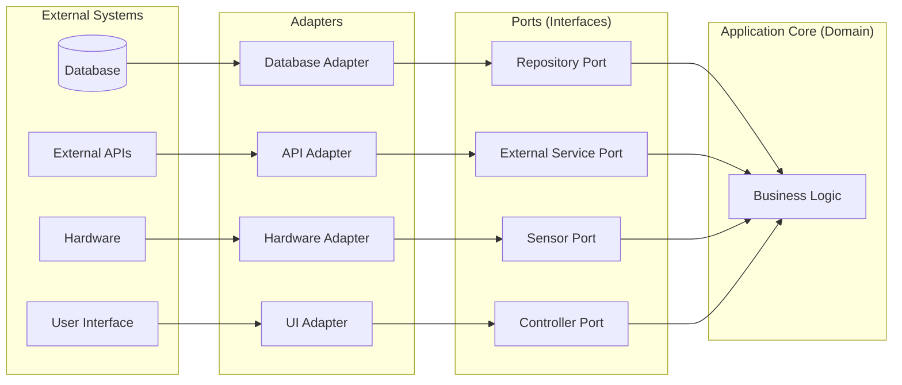

# 1 From Correct Code to Engineering Software: Scaling up
 
A correctly-working program is undoubtedly useful, but is not enough. It is a fact of software development that systems are repaired, enhanced, debugged and otherwise grown. Each one of these activities require changes to the code, and any change necessitates review and testing which costs time and money.

*Software engineering is the integral of programming over time*. 

Therefore the objective of writing software should not only be a program that (somehow) spits out the correct answer, but also one that can stand inevitable changes in the future. Thus whatever we design needs *changeability*, and this is inherently a design and engineering problem. When we change something, we must also have ways to inspect if the changes work, and the things that have changed have not broken. Thus whatever we design also needs *testability*. The two must go hand-in-hand.

## 1.1 Design by composition
 
One can witness a common phenomenon in virtually any software organization: many people with varying expertise work with each other, in and across teams, towards building a single product. How is it that the work of so many developers comes together without resulting in a spectacular disaster (sometimes that does happen!)? Conversely how is it possible for a developer or designer understand the ins-and-outs of the product well enough to meaningfully contribute? The answer lies in the main rule of taming complexity and size: composition. We naturally compose complex systems out of simpler parts, whether it be software or physical manufacturing. However each contributor is able to meaningfully contribute to the final product without fully understanding how it works. 

This statement seems contradictory to everything we have learned: aren't we supposed to know how a program/system works if we are to build it? The crucial insight is that we need to know *what* all the parts of our system do, but need to understand *how* only certain parts work. Our software design must follow a similar, clear demarcation between *what* and *how*. 

We already know the simplest manifestation of this concept: interface vs. implementation. The interface of a class lists only the method signatures (or in general, the list of publicly available functions in a component). The implementation provides the details of *how* it implements these methods. Any client needs to know how to use the functions, not how the implementation actually provides that functionality. In other words, a client only needs the interface information in order to use the implementing object. But how does one scale up such characteristics with the size and complexity of software? 

## 1.2 Characteristics of a *well-designed* system
 
A well-designed system not only works correctly, but supports making changes to it *with less effort*. It is not possible to quantify this in an absolute manner, and the problem becomes more difficult when we realize that we don't know what changes will be proposed in the future at the time of designing it. A broad characteristic is for the design to allow changes to be made in an *isolated* manner, i.e. a new requirement shouldn't require extensive changes to the current design or a significant re-implementation. But how do we actually (try to) ensure this?

Some object-oriented ideas give us broad guidelines. However these ideas are not limited to OO at all: they can be applied to virtually any type of design. OO just facilitates this better because the notion of a component is clearly defined as an encapsulation of data and operations.

   * Cohesion: this means designing components (classes, packages, modules with well-defined boundaries.

   * Coupling: coupling creates dependencies which causes cascading changes. Coupling must be minimized, but only those that are more likely to cause cascading changes.

   * Information hiding: at the class level we use access modifiers. At the module level we can expose only some components to other modules
 

We have seen several *simple* examples of good design facilitating these above goals: 

   * Design/program by interface: Use interface names instead of implementation names. Thus the coupling is to ''any class that implements this interface" rather than ''this specific implementation". This makes it easier to swap implementations of the same interface.

   * Use `private` as much as possible, and `public` judiciously: An object cannot use any `private` data or methods of another object, so it cannot depend on they being present.

   * Distribute methods well: If a method is using data only from a particular class, the method likely belongs to that class. This makes the class more cohesive.
 
But how does one *create* a design that has all these characteristics? How would one know that the design is good, without knowing specifically what must be changed? There is no foolproof answer to this, but several design practices and principles have been shown to work well in practice. The realistic objective of good design is not eliminate the possibility of major re-design and re-implementation (this is not possible) but to *delay* the inevitable. 

# 2  The SOLID principles
 
Many good practices in design and coding have been distilled into the SOLID principles. They are: 

   1. **S**ingle Responsibility: Each component (class) should have a single purpose. 

      Effect: a class should have only one reason to change, and that reason is easy to find given the new requirement.

   2. **O**pen for extension, closed for modification: Each component (class) should be open to extending its functionality, but without modifying its source code. 

      Effect: adding functionality to a tested class by modifying it is a recipe for disaster. Design that follows this principle allows such addition without modification. ''Extension" does not refer merely to extending a class (inheritance) but is used here as an umbrella term "reuse as-is".

   3. **L**iskov's substitution principle: If `S` is a subtype of `T`, then objects of `T` can be substituted with objects of `S` without altering any expected functionality. 

      Effect: a newer version of a class is *backward-compatible* with its older self. For example, if you extend a class and override its methods, they should not be inconsistent with their original versions.

   4. **I**nterface segregation: No client should be forced to depends on methods it does not use. 

      Effect: a client is only offered functionality that is useful. If a client needs to use only part of an existing interface, this interface should be decomposed into smaller ones. 

   5. **D**ependency inversion: Details should depend on abstractions, not the other way around. 

      Effect: a high-level class does not depend on specific low-level classes. Rather they depend on their abstractions (i.e. interfaces) 
 

While it is more obvious *why* the SOLID principles lead to good design, it may not be as obvious as to *how* to follow them. We will understand this further when we see different design recipes, patterns and practices. 

# 3 Model-view-controller
 
Usually the desire of a software program is expressed in terms of what it is expected to do. This list of requirements is likely both long and vague. While we can envision what the overall program will look like, how do we proceed to decompose it? A popular way to start the decomposition is to break it into three parts: the model, the view and the controller. 

 

The model-view-controller (MVC) is a composition of an entire program into three broad categories by what part of the program they implement (hence it is also referred to as the MVC "architecture") . The model implements the actual functionalities offered by the program. The view is the part of the program that shows results to the user. The controller takes inputs from the user and tells the model what to do and the view what to show. Take the IDE you are using to write programs as an example (IntelliJ). The view shows the source code, the project structure and the console output. The controller is the part that decides what to do when you select ''Run" or ''File->Open" and tells others parts of the program to actually carry out the operations. The model is the part that you cannot see, but one that actually compiles your program, runs it and keeps track of all the data needed for the program to function. 

 

The MVC architecture allows you to isolate the entire behavior of your program into categories: actual functionality, user display and user interaction and delegation. Practically each class you will design for the program should fall in exactly one of the model, view or controller. A badly implemented MVC architecture would be if a class mixes operations (e.g. a class that implements a functionality and prints the result, a class that shows a menu and implements some of its offered operations, etc.). This is illustrated in the figure above. Thus the MVC architecture, when used correctly, promotes *cohesion*. 

 

The MVC architecture also mandates which components can directly use other components. Since the model, view and controller have separate functions, access to each other is also restricted. Typically the model and the view cannot directly access each other, and the controller communicates with both. In many programs the view cannot *ask* the controller for data: the controller decides when to *provide* data to it. This is illustrated in the figure above. In doing so, the MVC architecture promotes *low coupling* between groups of classes. 


# 4 The Hexagonal Architecture

 

The MVC architecture was traditionally proposed for applications that have a well-defined, often singular way to interact with users (e.g. desktop applications that have a single well-defined user interface). Many applications are more complex. For example we could have a singular component that offers functionality and stores relevant data, which is accessed through different desktop applications, web applications and mobile apps. The basic principles and objectives of *changeability* remain the same, but a more general-purpose architecture is desirable.

The principle of separating infrastructure from domain code is formalized in an architectural pattern called **Hexagonal Architecture** (also known as **Ports and Adapters**), proposed by [Alistair Cockburn in 2005](https://alistair.cockburn.us/hexagonal-architecture).

## 4.1 The Core Idea



The architecture has three layers:

1. **Application Core (the hexagon)**: Contains all business logic and domain rules. It knows nothing about databases, web services, or hardware — only about the problem domain.

2. **Ports**: Interfaces that define what the application needs from the outside world. A port is technology-agnostic — it describes *what* the application needs, not *how* to get it.

3. **Adapters**: Implementations of ports that know how to talk to specific external systems. An adapter translates between the port's abstract interface and the concrete technology.

## 4.2 Examples

### 4.2.1 A simple Thermostat Manager: Comparing designs

[Code](/code/lectures/l18-architecture-design-mvc-hexagonal/HexArchitectureExample.zip)

Consider an application that maintains thermostats within a home. The application allows the following operations:

1. Create a new thermostat with a unique id and a starting temperature.
2. Increment the temperature of a thermostat by 1 degree, given its id.
3. Decrement the temperature of a thermostat by 1 degree, given its id.
4. Get the current temperature of a thermostat, given its id.
5. Monitor a thermostat given its id. Any subsequent changes to its temperature will automatically print a notification.
6. Save thermostats into a single text file.

The accompanying code linked above creates a simple Java application with the above features, in three ways. 

* A "monolith" architecture: this example is functional and classes are reasonably defined, but there is no overall structure to the application. 
* MVC architecture: this example is not only functional but redistributes the code from the monolith variant into model, view and controller. Note how these layers are separated from each other cleanly, and communicate through interfaces.
* Hexagonal architecture: this example is not only functional but redistributes the code from the monolith variant into ports and adapters.


### 4.2.2 A More Elaborate IoT Example Using Hexagonal Architecture: Smart Home Energy Manager

Now we design a smart home energy management system using Hexagonal Architecture.

**The Domain Problem**: When energy prices are high, automatically reduce power consumption by dimming lights and adjusting thermostats. When prices are low, pre-heat or pre-cool the house.

First, we define **ports** — interfaces that describe what we need:

```java
// Port: How we get energy prices (technology-agnostic)
public interface EnergyPricePort {
    double getCurrentPricePerKWh();
    List<PriceForecast> getForecast(Duration window);
}

// Port: How we control devices (technology-agnostic)
public interface DeviceControlPort {
    List<ControllableDevice> getDevices();
    void setDevicePower(String deviceId, int powerPercent);
}

// Port: How we persist settings (technology-agnostic)
public interface UserPreferencesPort {
    EnergyPreferences getPreferences(String homeId);
}
```

The **application core** contains pure business logic:

```java
public class EnergyOptimizer {
    private final EnergyPricePort priceService;
    private final DeviceControlPort deviceControl;
    private final UserPreferencesPort preferences;
    
    public EnergyOptimizer(EnergyPricePort priceService, 
                           DeviceControlPort deviceControl,
                           UserPreferencesPort preferences) {
        this.priceService = priceService;
        this.deviceControl = deviceControl;
        this.preferences = preferences;
    }
    
    public void optimizeForPrice(String homeId) {
        double currentPrice = priceService.getCurrentPricePerKWh();
        EnergyPreferences prefs = preferences.getPreferences(homeId);
        
        if (currentPrice > prefs.highPriceThreshold()) {
            // Reduce consumption
            for (ControllableDevice device : deviceControl.getDevices()) {
                if (device.isNonEssential()) {
                    int reducedPower = (int)(device.currentPower() * 0.5);
                    deviceControl.setDevicePower(device.id(), reducedPower);
                }
            }
        } else if (currentPrice < prefs.lowPriceThreshold()) {
            // Pre-condition the home
            for (ControllableDevice device : deviceControl.getDevices()) {
                deviceControl.setDevicePower(device.id(), 100);
            }
        }
    }
}
```

**Adapters** implement the ports for specific technologies:

```java
// Adapter: Gets prices from a real API
public class GridPriceApiAdapter implements EnergyPricePort {
    private final HttpClient httpClient;
    private final String apiKey;
    
    @Override
    public double getCurrentPricePerKWh() {
        // HTTP calls to real pricing API
    }
}

// Adapter: Controls devices via Zigbee protocol  
public class ZigbeeDeviceAdapter implements DeviceControlPort {
    private final ZigbeeGateway gateway;
    
    @Override
    public void setDevicePower(String deviceId, int powerPercent) {
        // Zigbee protocol commands
    }
}

// Adapter: Stores preferences in PostgreSQL
public class PostgresPreferencesAdapter implements UserPreferencesPort {
    private final DataSource dataSource;
    
    @Override
    public EnergyPreferences getPreferences(String homeId) {
        // SQL queries
    }
}
```

## 4.3 Design Advantages of the Hexagonal Architecture

### 4.3.1 Ports as a Design Technique

When developing with Hexagonal Architecture, you can use ports as a design technique. Whenever you notice that your domain logic needs something from the outside world, let an interface (port) emerge. Define the contract that makes sense for your domain, then implement the adapter later.

This approach keeps you focused on the business problem without getting distracted by infrastructure details. It also forces you to think about what your domain *really* needs, rather than being constrained by what a particular API happens to offer.

### 4.3.2 Modularity

Hexagonal Architecture promotes modularity and minimizes or streamlines coupling.

**Ports are modules with well-defined interfaces.** Recall that a well-designed module has three characteristics: 

- A well-defined interface that specifies its behavior
- An implementation that is hidden from other modules
- Independence from implementation details of other modules

Ports satisfy all three criteria. The `EnergyPricePort` interface specifies *what* the domain needs (current price, forecasts) without revealing *how* that information is obtained. The domain code depends only on this interface, not on HTTP clients, API keys, or JSON parsing.

### 4.3.3 Coupling

The Hexagonal Architecture minimizes coupling, specifically those kinds that are more detrimental to changeability.

1. Ports pass only the data needed. For example `getCurrentPricePerKWh()` returns a `double`, not a `GridApiResponse`.
2. Domain types are controlled by the domain, not external APIs.
3. Domain classes are walled off, and decide what to do with the data. This behavior cannot be controlled from outside because the ports do not offer any such functionality. 
4. Because of the well-defined boundaries established by the ports, there is no shared global state between domain classes and external classes.

### 4.3.4 Cohesion

Ports promote functional cohesion. Each port has a single, well-defined responsibility. `EnergyPricePort` is about getting prices. `DeviceControlPort` is about controlling devices. 

The key insight is that **low coupling and high cohesion don't just make code easier to change — they make it easier to test**. When each module has a single responsibility and maintains proper isolation from others, we can test it in isolation.

### 4.3.5 Testability

Another advantage of segregating parts of an application into layers (model-view-controller or ports-adapters) is that it facilitates testing components in isolation (unit testing) and with each other (integration testing). 

Consider the above IoT example that uses a hexagonal architecture. For unit tests, we can substitute simple test implementations:

```java
@Test
void reducesNonEssentialDevicesWhenPriceIsHigh() {
    // Simple in-memory implementations — no real infrastructure!
    EnergyPricePort stubPrices = () -> 0.35;  // High price
    
    List<ControllableDevice> devices = List.of(
        new ControllableDevice("light-1", true, 100),   // non-essential
        new ControllableDevice("fridge", false, 100)    // essential
    );
    SpyDeviceControl spyDevices = new SpyDeviceControl(devices);
    
    UserPreferencesPort stubPrefs = (homeId) -> 
        new EnergyPreferences(0.25, 0.10);  // high=0.25, low=0.10
    
    EnergyOptimizer optimizer = new EnergyOptimizer(
        stubPrices, spyDevices, stubPrefs);
    
    optimizer.optimizeForPrice("home-123");
    
    // Verify only non-essential devices were reduced
    assertEquals(50, spyDevices.getPowerLevel("light-1"));
    assertEquals(100, spyDevices.getPowerLevel("fridge"));  // unchanged
}
```

For integration tests, we can use real adapters with test instances (e.g., an in-memory database). For end-to-end tests, we use production adapters. The core business logic remains the same across all test types.

The magic happens in testing. For unit tests, we can substitute simple test implementations:

```java
@Test
void reducesNonEssentialDevicesWhenPriceIsHigh() {
    // Simple in-memory implementations — no real infrastructure!
    EnergyPricePort stubPrices = () -> 0.35;  // High price
    
    List<ControllableDevice> devices = List.of(
        new ControllableDevice("light-1", true, 100),   // non-essential
        new ControllableDevice("fridge", false, 100)    // essential
    );
    SpyDeviceControl spyDevices = new SpyDeviceControl(devices);
    
    UserPreferencesPort stubPrefs = (homeId) -> 
        new EnergyPreferences(0.25, 0.10);  // high=0.25, low=0.10
    
    EnergyOptimizer optimizer = new EnergyOptimizer(
        stubPrices, spyDevices, stubPrefs);
    
    optimizer.optimizeForPrice("home-123");
    
    // Verify only non-essential devices were reduced
    assertEquals(50, spyDevices.getPowerLevel("light-1"));
    assertEquals(100, spyDevices.getPowerLevel("fridge"));  // unchanged
}
```

For integration tests, we can use real adapters with test instances (e.g., an in-memory database). For end-to-end tests, we use production adapters. The core business logic remains the same across all test types.

