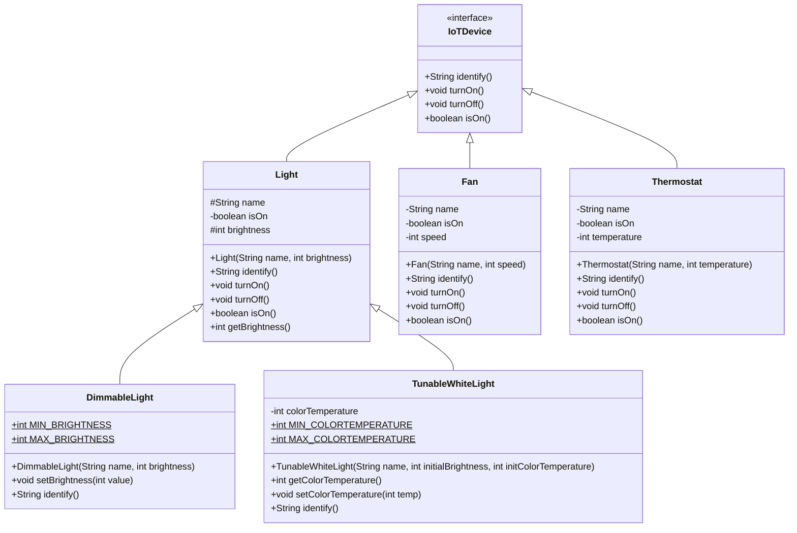
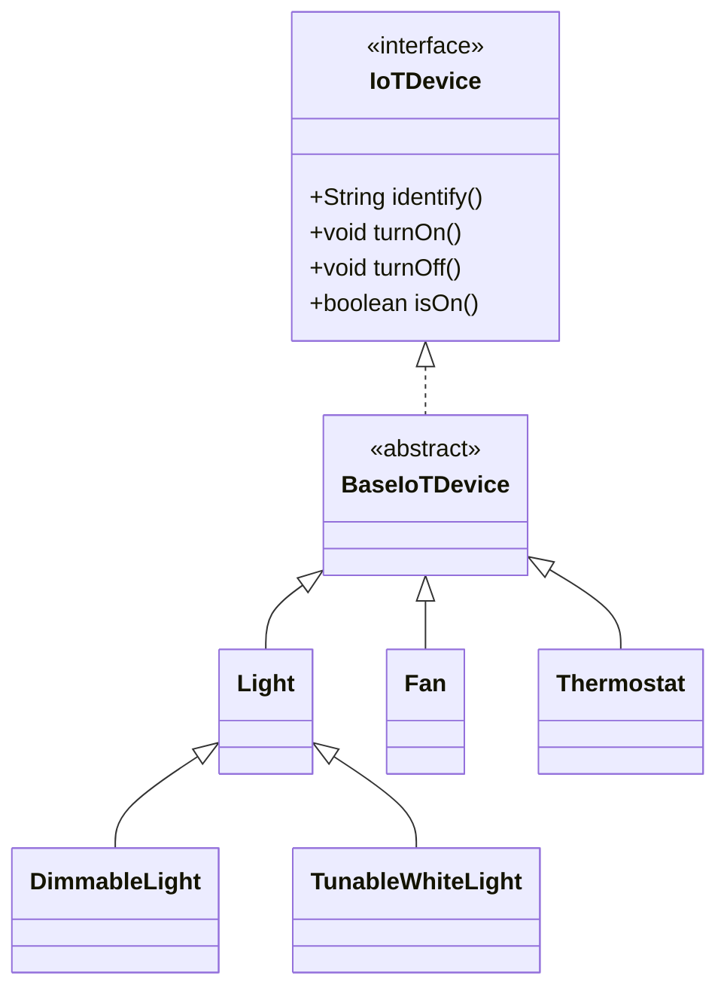
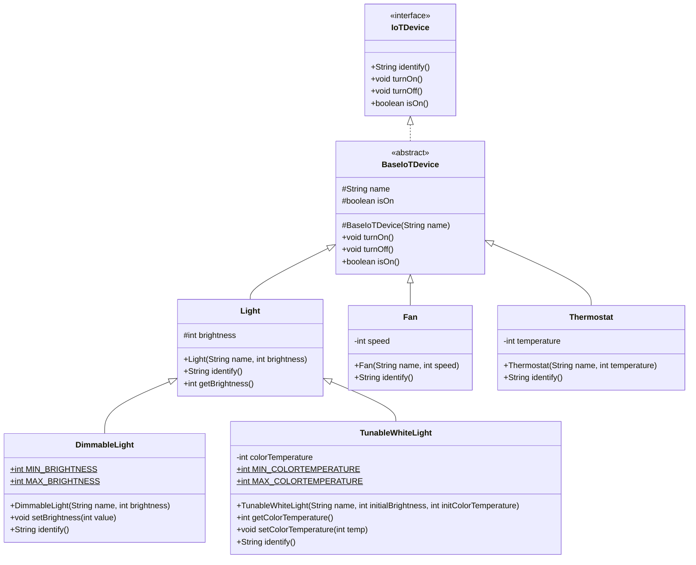

[Accompanying Java code](/code/lectures/l2-java-new/code.zip)

# 1 Deep(er) Dive into Java

Before we add more code to our `IoTDevice` program, let us try to understand how a Java program works.

In order to run our program written in the previous lecture, we followed these two steps:

```bash

> javac DeviceMain.java
> java DeviceMain

```

The first step *compiles* the Java source code, while the second step *runs* it. The reality is more nuanced.

## 1.1 From Source Code to Machine Instructions

Irrespective of the programming language used, all code written in a "high-level" (human-readable and human-understandable) language must be translated into low-level instructions that can be executed on the CPU. Java performs this in two steps:

### Step 1

The Java source code (*.java) files are converted into *bytecode*. Specifically each class or interface produces a single .class file. The program that performs this translation is *javac*.

*Bytecode* is simply a set of instructions for a fictitious machine, called the *Java Virtual Machine* (JVM). It looks like low-level assembly language code (given a file *Fan.class*, one can see this code by using another program: `javap -c Fan.class`. Try it!). In this way, this translation does not depend on different CPUs and operating systems that currently exist or may be created in the future. In that sense, the *bytecode* is platform-independent. The JVM can be thought as simply a specification for a machine, detailing which instructions it supports.

### Step 2

The *bytecode* is then executed chunk-by-chunk by giving it to the second program *java*. This program translates the bytecode into CPU instructions. One way to think about this step is that the program *java* represents the JVM, on which the bytecode is run. 

The remarkable result of this process is that one can produce *.class* files by running *javac* on one platform, copy them over to another platform and run it using *java* on it! This is the "write once, run anywhere" promise that the founders of Java made. Since its inception, other programming languages have also implemented this idea. There are other languages that run on the JVM, like Clojure, Kotlin, Scala, and Groovy. These languages, like Java, are compiled into bytecode.

Processing the entire source code allows the translator to consider the entire context and perform more optimizations. Once translated, the code is ready to be executed. This way of translation is called *compilation* and the program that performs this is called a *compiler*. In contrast, processing the source code a chunk at a time allows the translator to work more quickly and simply but not understand the full context. This way of translation is called *interpreting*, and the program that performs this is called an *interpreter*. Thus Python (and many other scripting languages) are *interpreted*, languages like C++ are *compiled* and languages like Java are both *compiled* (*javac*) and *interpreted* (*java*).

## 1.2 The Java Ecosystem

Java (like Python) offers a vast library of classes and frameworks developed by many over a long period of time. This libraries are basically the compiled bytecode files, bundled as *jar* files. These files are typically stored in Maven repositories, available for download and use by Java developers. 

When we install Java on our computers, we installed two distinct things:

1. The Java Development Toolkit (JDK): this is what is needed to *write* or *develop* Java programs. Programmers need this. This includes tools like *javac* and *javap*, among others.

2. The Java Runtime Environment (JRE): this is what is needed to *run* Java programs. This is needed not just by programmers but also end-users. Most operating systems come with the JRE pre-installed. 

It is possible to install several versions of the JDK and JRE simultaneously on a single computer. When we write Java programs we must specify which JDK version we will use to compile it. When we run Java programs we must specify which JRE version to use.

Any Java program you have written likely uses existing Java class (e.g. `String`). To understand your code, the compiler must know the locations of all the Java libraries that it uses. This information is provided by a sequence of folder paths known as the *Java classpath*. When you develop Java programs using an IDE, it takes care of adding these locations to the classpath before it compiles and runs your code. If you do not use an IDE, then you must add them to the classpath yourself. This is important to know when you plan to use external libraries (i.e. the ones that are not part of the JDK). 

## 1.3 Unit Tests in Java

Similar to `pytest` in Python, the JUnit library is used to write and run Java unit tests. The JUnit library is an external library: it does not come installed with the JDK. Here is some JUnit tests for our IoTDevices.

```java

//import statements specify where the classes used in a file can be found.
import static org.junit.jupiter.api.Assertions.*;

import org.junit.jupiter.api.BeforeEach;
import org.junit.jupiter.api.Test;

public class DeviceTest {
    //the variables used in tests
    private IoTDevice livingRoomLight,fan,thermostat;

    //this method will be run before each test. Use this method to initialize objects that are useful in most/all tests
    @BeforeEach
    public void setup() {
        livingRoomLight = new Light("livingRoomLight", 100);
        fan = new Fan("fan", 50);
        thermostat = new Thermostat("bedroom thermostat",70);
    }

    //each test is annotated with @Test. Such methods must be public, accept no arguments and return nothing
    @Test
    public void testIdentifyDevice() {
        //use an assert statement to verify whether an actual value matches an expected value
        //an assert statement is like a hurdle. If the test crosses all hurdles and reaches its end, it passes.
        assertEquals("Light blinks at 100% power", livingRoomLight.identify());
        assertEquals("Fan spins at 50% speed", fan.identify());
        assertEquals("Thermostat display on, currently at 70% temperature",thermostat.identify());
    }

    @Test
    public void testTurnOn() {
        livingRoomLight.turnOn();
        assertTrue(livingRoomLight.isOn());
    }

    @Test
    public void testTurnOff() {
        fan.turnOff();
        assertFalse(fan.isOn());
    }

}

```

## 1.4 Java Documentation

The JDK comes with a useful program called *javadoc* that converts the comments written in Java code into HTML documentation. A Javadoc-style comment begins with `/**` and ends with `*/` (see examples in the previous lecture). In addition to plain text, it supports several annotations like `@param`, `@return`, etc. 

# 2 Building at scale: A Build System

In general, the process of converting all the source files into a form that can be executed is called *building*. As we write larger programs, there is a lot of background work that needs to be done in order to build a program:

1. Identify which libraries are needed (dependencies). Identify which versions of those libraries are to be used.

2. Download dependencies if needed and wire them with the code so that they can be found when building.

3. Support various things you can do with the code (build into an application, run an application, run only tests, verify the code style, etc.)

4. Specify where the produced files (build artifacts) should be stored. Build artifacts for Java programs may include bytecode files, packaged *jar* files that can be executed like an application, documentation, etc.

To manage all this and more, we use a build system. A build system comprises of one or more files where we specify relevant settings, and a program that interprets these files to accomplish all the above tasks. One popular example is Gradle, which we will use in this course.

## 2.1 Gradle Projects

Most modern IDEs provide a way to create Gradle projects. A Gradle project may comprise of the following:

1. *settings.gradle*: often auto-generated, this specifies the root folder inside which other files relevant to this project reside. Once generated, this file changes infrequently.

2. *build.gradle*: this is the main configuration file. This stores information such as tasks, dependencies, versions, etc. This file changes as more libraries are used in the project, the location of the libraries changes, etc. For a Java project, this file stores the JDK version, JUnit version, application starting point, location of source files, etc.

3. "Sources root": although not an official term, this is the root folder that contains all the Java source code files. When the project is built, Gradle looks within this folder. For Java projects, this is usually in "project-root/src/main/java". 

4. "Test Sources root": although not an official term, this is the root folder that contains all the tests for a project. It promotes the practice of maintaining code and tests in separate places within the project. When tests are to be run, Gradle looks within this folder. For Java projects, this is usually in "project-root/src/main/test".

5. *gradlew*: this is the script or batch program that "runs" Gradle. This file is produced once and rarely changes. This file is used to run specific tasks defined in the *build.gradle*. For example, to build and run a project from the terminal, we use `> gradlew run`.

# 3 Inheritance as a Core Concept

A core principle of program design is: make your data mean something. We write software that manipulates data in some way, and oftentimes this data is related to some real-world concept. When it comes to designing our program, we can leverage our domain knowledge of that real world concept to design a program that is both easy to understand and easy to maintain. Putting it simply: a program whose elements (IoTDevice classes and interfaces) match their counterparts in the actual, real system (fans, different types of lights) is highly desirable. 

Inheritance is a core concept of object-oriented programming that allows us to model real-world "is-a" relationships between types. Some examples are "Light is an IoT device", "Queue is a list", "Dog is a Pet", etc. Inheritance sets up a hierarchy. If class B extends A, then A is called the "parent" or "superclass" while B is called the "child" or "subclass". Classes that directly or indirectly inherit from A are its "descendants" while any classes that A inherits from are its "ancestors".

In Java the following artifacts are relevant to inheritance:

## 3.1 Interface

An interface contains signatures of methods that will be `public` in classes that implement it. It represents a minimalistic view of an object: *if I have an object, which operations can I call on it?*. An interface merely specifies a signature, not an implementation. Thus each method specified in an interface is *abstract*. Interfaces cannot contain fields: they merely specify what an object *does*, not what an object *has*.

## 3.2 Abstract class

An abstract class is simply a class that has at least one abstract method (i.e. a method that is specified but not implemented). Abstract methods may be specified directly in this class, or may be inherited from an interface it implements. An abstract class may or may not have fields. 

Any class that extends an abstract class or implements an interface but does not provide an implementation of its methods itself becomes an abstract class. Abstract classes cannot be instantiated. They are useful primarily to specify functionality in descendant classes, and capture attributes common to them. 

An abstract class that contains *only* public method signatures is conceptually equivalent to an interface, but with one restriction: Java does not allow a class to extend multiple classes but does allow it to implement multiple interfaces.

## 3.3 Concrete class

A concrete class provides implementations of all the methods it promises. Concrete classes can be instantiated.

In Java, classes (abstract or concrete)

- Can extend exactly one superclass (which may itself extend another class)

- Can implement multiple interfaces

- Inherit fields and methods from its superclass, can also *override* methods

## 3.4 Access Modifiers

`private`: cannot be accessed (field) or called (method) from outside the class.
`protected`: can be accessed (field) or called (method) from within the class and any descendants, nowhere else.
`public`: can be accessed (field) or called (method) from anywhere.

## 3.5 Best Design Practices: First Cut

The following are some best-practice rules to think about when designing classes and interfaces:

* Each interface and class should represent one thing (single responsibility). 

* Use access modifiers judiciously: only provide access where you need. Make fields `private`, or if necessary, `protected`, never `public`. Make as many methods non-public as possible. The more things you hide about a class, the simpler it is to use.

* Avoid duplication of code: duplication is not only redundant but also makes maintenance difficult. Capture common aspects higher up in the inheritance hierarchy.

* Do not lose meaning: don't be tempted to "optimize" your design at the cost of diluting what a class or interface represents.

# 4 A More Elaborate IoTDevice System

We now add more functionality to our IoT device system from the previous lecture. There are three kinds of lights: "normal" lights with no changeable properties, lights that can be dimmed and lights that can change temperature.

## 4.1 First Cut

We start by modifying the design as follows:
    
- `DimmableLight` extends `Light` and adds `setBrightness` and `getBrightness`.
- `TunableWhiteLight` extends `Light`. It stores the color temperature as a single number, and adds `setColorTemperature` and `getColorTemperature`.



Note the use of access modifiers: all fields are marked as `private` in their respective classes. However different types of light may need to access their own brightness, as well as their names. So those fields are marked as `protected` in the `Light` class.

## 4.2 Abstraction

We notice that some things are duplicated across multiple classes:

* `Light`, `Fan` and `Thermostat` all have a name and an on-off status. This makes sense since all devices should have them.

* `Light`, `Fan` and `Thermostat` all implement the `isOn()`, `turnOn()` and `turnOff()` methods in the same way.

* Constructors of all different types of light initialize their names and brightness levels.

Since all types of devices have some things in common, we introduce a basic type of device between the `IoTDevice` interface and all the classes that implement it.



`BaseIoTDevice` claims to implement `IoTDevice` it does not implement all its methods. Methods are exist but not implemented are called abstract methods. This makes `BaseIoTDevice` an abstract class. Abstract classes are essentially *incomplete* and therefore, one cannot instantiate them (i.e. one cannot create an object of an abstract class)

We now move the common fields (name, isOn) to `BaseIoTDevice`. It is good practice to initialize fields of a class in a constructor of the same class, so we add a constructor to `BaseIoTDevice`. This seems odd, since a class that cannot be instantiated has a *constructor*. However, other concrete classes extend it and this constructor is called as part of instantiating those classes.

The constructor of the `Light` class receives a name and a brightness value. It delegates the name initialization to the `BaseIoTDevice` class by calling its constructor as follows: `super(name);`. Such a call must be the first line inside the constructor of `Light`. In general, `this` refers to *this object*, while `super` refers to *this object's parent*.

`BaseIoTDevice` can now fully implement `turnOn()`, `turnOff()` and `isOn()` methods, so we *move* them from the `Light`, `Fan` and `Thermostat` into the `BaseIoTDevice` class. In this way, code is not duplicated across multiple classes. This activity is called *abstraction*. Similarly we abstract common aspects of various lights as appropriate. This creates the following design:



Note the relationships: `class Light extends BaseIoTDevice` depicts that *Light is a BaseIoTDevice*. Correspondingly, the `Light` class inherits several fields and methods from `BaseIoTDevice`. Methods such as `identify()` that work differently for each concrete class are implemented separately. In this way each class contains only aspects unique to it. Thus proper use of inheritance not only models the domain effectively, but also tangible benefits in code.


# 5 Interfaces vs abstract classes

It seems like interfaces and abstract classes are somewhat redundant. This is true in the sense that an abstract classes that contains *only* `public` abstract methods is functionally equivalent to an interface. Indeed many programming languages do not have a separate "interface": abstract classes in those languages suffice.

However interfaces in Java have some unique aspects. An interface

- Can extend one or more interfaces.

- Can provide a default implementation for some methods. This can make the code messy, so it is not recommended.

- Declares methods that can only be `public` in implementing classes.

In contrast, an abstract class

- Can contain fields.

- Can extend up to one superclass and multiple interfaces.

- Can contain methods having any access modifier (`private`, `public`, `protected` or package-private)

- Can provide a default implementation for some methods

A common pattern in Java is to pair an interface with a **skeletal implementation** (also called an "abstract base class"). We have done this above with `IoTDevice` and `BaseIoTDevice`. This gives callers flexibility: they can extend the abstract class for convenience, or implement the interface directly if they need different behavior. This pattern can be seen throughout the Java standard library with classes like `AbstractList`, `AbstractMap`, and `AbstractCollection`.

### Multiple Inheritance

Some objects legitimately belong to multiple categories (e.g., a ceiling fan with a built-in light is both a Light and a Fan). However, multiple *class* inheritance creates ambiguity when both parent classes implement the same method differently:

This is called the "diamond problem." Java avoids it by restricting multiple inheritance to interfaces:

- Interfaces don't provide implementations (usually), so there's no ambiguity

- The implementing class must provide the implementation

- This forces explicit design decisions rather than implicit (and potentially confusing) behavior

# 6 How Java Works: Some Important Concepts

## 6.1 Dynamic Dispatch

Consider the following code:

```java
Light livingRoomLight = new Light("livingRoomLight", 100);
Fan fan = new Fan("fan", 50);
assertEquals("Light blinks at 100% brightness", livingRoomLight.identify());
assertEquals("Fan spins at 50% speed", fan.identify());

```

It is clear that `livingRoomLight.identify()` calls the implementation of the `identify()` method in the `Light` class, where `fan.identify()` calls the implementation of the `identify()` method in the `Fan` class. But Java also allows this:

```java
IoTDevice livingRoomLight = new Light("livingRoomLight", 100);
IoTDevice fan = new Fan("fan", 50);
assertEquals("Light blinks at 100% brightness", livingRoomLight.identify());
assertEquals("Fan spins at 50% speed", fan.identify());

```

Note the type of the variables `livingRoomLight` and `fan`. Doing this is in fact beneficial: these variables can now be used to refer to object of *any* class that implements `IoTDevice`. Thus these variables are *reusable*. However it is not clear which implementations of the `identify()` method it will call on the last two lines. 

"Dynamic dispatch" is the process by which the JVM determines which method to call at runtime. Specifically the JVM delays *deciding* which implementation to use (*dispatch*) until the last minute (*dynamic*) when the program is run and it comes to that line. At that time, it pays attention to the object it is referring to, rather than the type of the variable. 

Here is how the JVM implements dynamic dispatch to call method $m$ on object $o$ of type $T$:

1. If $T$ contains a declaration of $m$, use that.

2. If $T$ has a superclass $S$ that contains a declaration of $m$, use that. If not, continue recursively with $S$'s superclass.

Consider the following example:

```java
Light l = new TunableWhiteLight("living-room", 2700, 100);
l.turnOn(); // This will call the turnOn method of the actual type of l, which is TunableWhiteLight.
((DimmableLight) l).turnOn(); // Still calls turnOn method of TunableWhiteLight, because when it runs, that's the type of l.
```

Regardless of the type of the variable in our code, the actual type at runtime is used to determine which method to call.

This allows us to store and operate upon several devices at once:

```java
IoTDevice[] devices = new IoTDevice[] {
    new TunableWhiteLight("light-1", 2700, 100),
    new DimmableLight("light-2", 100)
};

for (IoTDevice d : devices) {
    d.turnOn(); // This will call the turnOn method of the actual type of d, which may be TunableWhiteLight, DimmableLight, or some other subclass.
}

```

## 6.2 `static`

When we create a new `Light` object, it gets its *own copy* of the `name` and `brightness` fields, along with its own implementation of methods. This is the reason why we must say `lightObj.turnOn()` and not just `turnOn()`. However in some cases we want all objects of a class to share the same data or methods. 

An example can be seen in the `TunableWhiteLight` class:

```java

public class TunableWhiteLight extends Light {

    private int colorTemperature;
    public static final int MIN_COLORTEMPERATURE = 2000;
    public static final int MAX_COLORTEMPERATURE = 8000;

    ...
    
    public void setColorTemperature(int temp) throws IllegalArgumentException {
        if ((temp<MIN_COLORTEMPERATURE) || (temp>MAX_COLORTEMPERATURE)) {
            throw new IllegalArgumentException("Color temperature must be in the range "+MIN_COLORTEMPERATURE + " to "+MAX_COLORTEMPERATURE);
        }
        this.colorTemperature = temp;
    }

    ...

}


```

All tunable white lights use the same minimum and maximum ranges for color temperature, so these objects *share* these two values. The `static` keyword allows this: a `static` field or method is shared among all objects (i.e. belongs to the class and not its objects). If the access modifiers allow, these fields or methods are accessed by using the class name. For example one can access the minimum brightness above from outside this class as `TunableWhiteLight.MIN_COLORTEMPERATURE`.

Because `static` methods do not belong to individual objects, they are bound/dispatched at compile time (i.e. static methods do not use dynamic dispatch because they don't need to).

## 6.3 Exceptions 

Let us look at the constructor of the `DimmableLight` class. What would happen if we used it as follows: 

```java

DimmableLight bedroomLight = new DimmableLight("Bedroom light",-10);

```

We have attempted to create a `DimmableLight` object with a negative brightness, which makes no sense. However Java is not able to catch this error, because the constructor declares the second argument's type as `int`. Ideally the constructor should inform its caller "thou shall not pass me a negative number for the initial brightness," instead of using the number and creating an object that has an invalid brightness. Exceptions allow us to do that. 

An exception occurs when something unexpected happens, whether it be invalid input, an operation that cannot be completed (e.g. the square root of a negative number) or even something that is beyond our control (e.g. attempting to read from a file that no longer exists). Exceptions offer us a dignified way of aborting a method and sending a message to its caller that something went wrong. 

## Writing a method with exceptions
 
In the constructor, an exception should occur if a negative number is passed as the year of publication of the book. We can change its signature to the following: 

```java

public class DimmableLight extends Light {

    public static final int MIN_BRIGHTNESS = 0;
    public static final int MAX_BRIGHTNESS = 100;

    /**
     * Create a new dimmable light with the specified name and brightness
     * @param name the name of this light
     * @param brightness the initial brightness value of this light
     * @throws IllegalArgumentException if the initial brightness value is not within the 
     * range of the MIN_BRIGHTNESS and MAX_BRIGHTNESS defined in this class
     */
    public DimmableLight(String name,int brightness) throws IllegalArgumentException {
        super(name,1);
        if ((value<MIN_BRIGHTNESS) || (value>MAX_BRIGHTNESS)) {
            throw new IllegalArgumentException("Brightness value should be between "+MIN_BRIGHTNESS + " and "+MAX_BRIGHTNESS );
        }
        this.brightness = value;
    }
    ...
}
```

Java has many kinds of exceptions. Since our problem here is an invalid argument, we use the `IllegalArgumentException` class. 

Before initializing the fields we check if the year passed to the constructor is negative and if so, we throw an exception. This involves creating an `IllegalArgumentException` object with a helpful message in it and throwing it. 

This method now works as follows: 

   * If the brightness is within range, the constructor does not throw an exception and initializes the object, as before.

   * If the brightness is outside the allowed range, the method aborts on the line `throw new IllegalArgumentException(...);`. It will not return anything.
 
A method may throw multiple types of exceptions, and it may declare some or all of them in its method signature. 

## Calling methods that may throw exceptions
 
Let us test this constructor, specifically by passing it a negative brightness. Whenever a method is called that may throw one or more exceptions we can enclose it in a try-catch block as follows: 

```java

    IoTDevice bedroomLight;
    
    try {
      bedroomLight = new DimmableLight("Bedroom light",-10);
    }
    catch (IllegalArgumentException e) {
        //This will be executed only if an IllegalArgumentException is 
        //thrown by the above method call
    }

```

Thus we try to call such a method, and if an exception is thrown we catch it. If no exception is thrown then the catch block is ignored. 

All exceptions in Java are instances of the `Throwable` class. It is important to note that, since Java is a statically typed language, we can distinguish between different kinds of exceptions.

## Exception types in Java

There are two subclasses of `Throwable`: `Exception` and `Error`. 

An `Error` is an exception that is typically fatal, and detected by the JVM itself, although you can also throw them explicitly. For example, the JVM throws an `OutOfMemoryError` if it runs out of memory, or a `StackOverflowError` if the stack overflows (too much recursive function calling). These are not expected to be caught by application code. It is generally bad practice to throw an `Error` in your code.

Exceptions are further divided into two categories: `checked` and `unchecked`.

- `unchecked` exceptions are those that are *not* required to be caught by calling code (all subclasses of `RuntimeException`)
- `checked` exceptions are those that are *required* to be caught by calling code (all subclasses of `Exception` that are not subclasses of `RuntimeException`)

This is different than Python, where all exceptions are unchecked.

By making this distinction, an API can *require* that certain exceptions are caught, and the compiler will enforce that requirement. 


## Testing methods with exceptions
 
We can test whether a method throws exceptions when expected using the try-catch blocks as above: 

```java

    @Test
    public void testInvalidBrightness() {
        IoTDevice bedroomLight;

        try {
            bedroomLight = new DimmableLight("Bedroom light",10);
            
        }
        catch (IllegalArgumentException e) {
            fail("There should have been no exception thrown");
        }
        ...

        try {
            bedroomLight = new DimmableLight("Bedroom light",-10);
            fail("The above line should have thrown an exception");
        }
        catch (IllegalArgumentException e) {
            //do not do anything except catch the exception and let the test continue
        }
        ...
  }

```

We expect the first constructor call to work correctly. If an exception is thrown the catch block will fail this test case. We expect the second constructor call to throw an exception. If an exception was indeed thrown then the try block will abort and the statement `fail("The above line should have thrown an exception");` will not be executed. Catching the (expected) exception allows this test to pass. If an exception was not thrown then the `fail("The above line should have thrown an exception");` fails the test case. 

JUnit allows us to test for exceptions in a more concise way. We must divide the above test case into two. 

```java
     
    @Test(expected = IllegalArgumentException.class)
    public void testInvalidBrightness) {
        bedroomLight = new DimmableLight("Bedroom light",-10);
    }

```

This test has the annotation: `@Test(expected = IllegalArgumentException.class)`. This declares that this test expects the `IllegalArgumentException` to be thrown, and thus will abort and pass when it encounters this exception for the first time during its execution. If this method ends without an `IllegalArgumentException` thrown even once, this test fails.

JUnit 5 supports a third way:

```java
     
    @Test
    public void testInvalidBrightness) {
        assertThrows(IllegalArgumentException.class, () -> new DimmableLight("Bedroom light",-10);
    }

```

[ More information about exceptions is available in the Java documentation](https://docs.oracle.com/javase/tutorial/essential/exceptions/). 


## Using exceptions in general
 
Java has several inbuilt exception types, which are all classes. Exceptions provide us with a way to handle errors. Follow this procedure when you write a new method: 

   * Write the purpose statement (i.e. what the purpose of the method in comments above the method).

   * Write a method signature.

   * Write the method body so that it works correctly under ideal circumstances.

   * Carefully think about all situations that can occur, other than ideal circumstances. This includes possibly invalid inputs, invalid computations or results. These are possible errors.

   * For each error: 

      * If there is a way to prevent the error from happening, do it. This is the best kind of error handling. Else go to the next step.

      * If there is a way to recover from the error in this method itself, do it. There is no need to use exceptions as the recovery happens in the same method as the error. Else go to the next step.

      * Choose an appropriate exception type for the error. Declare that this method throws this exception in its signature, and throw this exception appropriately.


