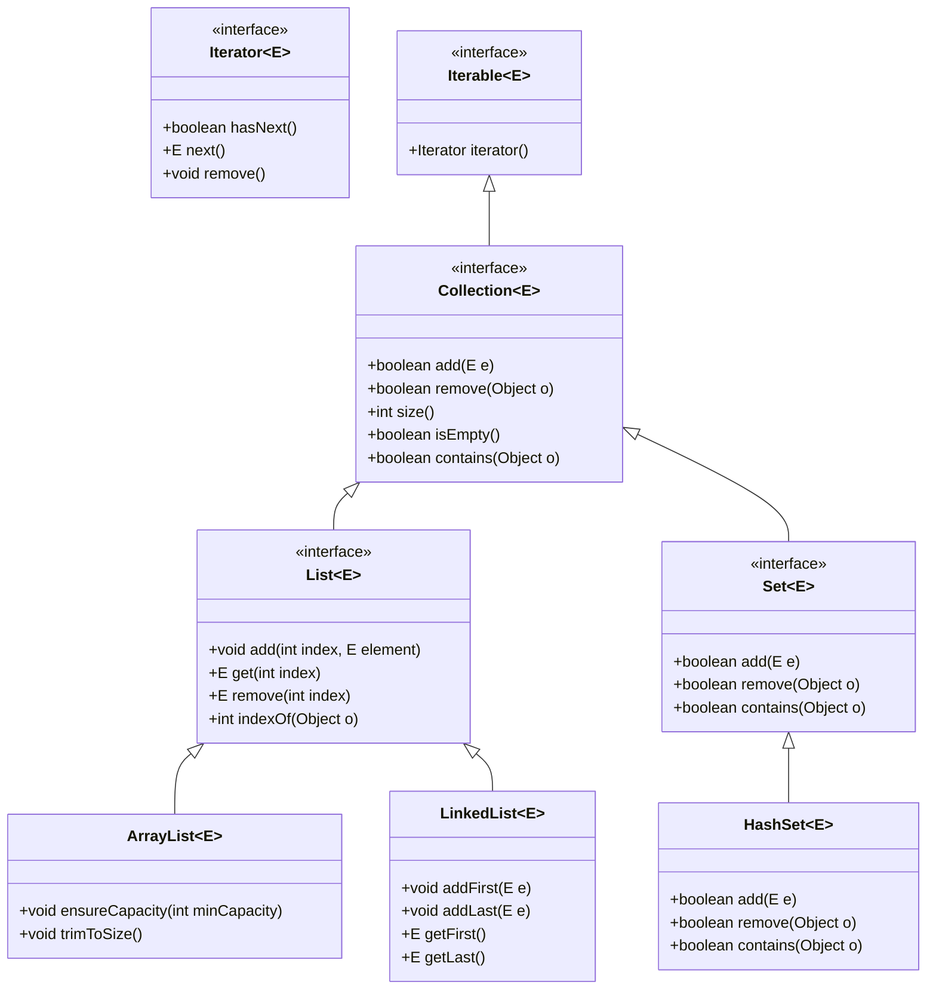
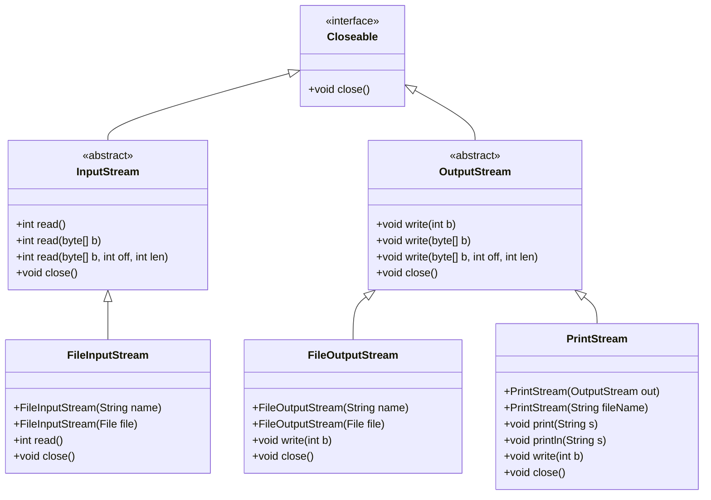
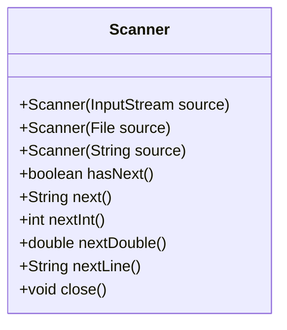

# 1 Java Generics

Generics allow us to write code that is reusable *and* type-safe, without knowing in advance what type of data we will be working with. For example, consider the following interface for a list in Java:

```java
public interface List {
    /**
     * Adds an element to the list.
     * @param o the element to add
     */
    void add(Object o);

    /**
     * Returns the element at the given index.
     * @param index the index of the element to return
     * @return the element at the given index
     */
    Object get(int index);
}
```
Operations on a list do not depend on what the list actually stores. Therefore we attempted to make the interface general-purpose by working with `Object`-type objects. Because the `Object` class is the superclass of all other classes in Java, this generalizes the above interface so that it may morph into a list of *anything*. 
This is useful, but it also means that we can put any type of object in the list, which can lead to runtime errors. For example, this code will compile, but throw a `ClassCastException` at runtime:

```java
List list = ...;
list.add(new TunableWhiteLight(2700));
list.add(new Fan());

// This will throw a ClassCastException at runtime
TunableWhiteLight light = (TunableWhiteLight) list.get(1);
```

This happens because the result of `list.get(0)` is indistinguishable from the result of `list.get(1)` even though the above code shows what those objects are. This code is *type-unsafe*. In order to overcome this we have to *remember* the actual type of each `list.get(i)` and cast to it *before* we use it. This significantly dilutes the otherwise general purpose of a list.  

Generics allow us to write type-safe code by allowing us to specify the type of object that a list can hold. For example, here is the same list interface using generics (this is a snippet of the actual interface that exists in the JDK):

```java
/**
 * A list
 * @param <ElementType> the type of elements in the list
 */
public interface List<ElementType> {
    /**
     * Adds an element to the list.
     * @param o the element to add
     */
    void add(ElementType o);

    /**
     * Returns the element at the given index.
     * @param index the index of the element to return
     * @return the element at the given index
     */
    ElementType get(int index);
}
```

Note the syntax of `<ElementType>` in the interface declaration. This is called a *type parameter*. When we use the `List` interface, we can specify the type of object that the list can hold. For example, here is how we might use this interface to create a list of only `Light` objects:

```java
List<Light> lights = new ArrayList<Light>();
lights.add(new TunableWhiteLight(2700));
lights.add(new Fan()); // This will not compile
```

Specifically the type of object at the time of declaring the variable (`List<Light>`) enforces that all the objects added to the list must be of `Light` type. This is why the second line now catches our mistake at compile-time. 

**Detecting errors when you write them is invaluable.** This is the main benefit of using strongly-typed languages like Java over dynamically typed languages like Python. The role of static typing is to help you catch errors as you type them, when it is very easy to fix them. 

When a type has a parameter (like `List<ElementType>`), we refer to the type as a *parameterized type*.

For backwards compatibility reasons (this feature was not introduced until Java 5, 8 years after Java 1.0!), it is still possible to use the `List` interface without specifying a type parameter, like this:

```java
List list = new ArrayList();
list.add(new TunableWhiteLight(2700));
list.add(new Fan());
```

This is called *raw typing*, and it is *not* type-safe. [Don't use raw types!](https://learning.oreilly.com/library/view/effective-java-3rd/9780134686097/ch5.xhtml#lev26).

As you program with generics, in addition to *errors*, you may see "unchecked" warnings. These are warnings that the compiler is not able to check for type safety. The only reason they are not errors is to maintain backwards compatibility with older code. These warnings constitute errors in this course: you must [eliminate unchecked warnings](https://learning.oreilly.com/library/view/effective-java-3rd/9780134686097/ch5.xhtml#lev27). For example, the following code will produce an unchecked warning:

```java
List<Light> list = new ArrayList();
list.add(new TunableWhiteLight(2700));
```

In this case, the compiler is not able to check that the `ArrayList` is storing `Light` objects, so it issues a warning. It is easily fixed by specifying the type parameter when creating the `ArrayList`:

```java
List<Light> list = new ArrayList<Light>();
list.add(new TunableWhiteLight(2700));
```

You should [favor generic types](https://learning.oreilly.com/library/view/effective-java-3rd/9780134686097/ch5.xhtml#lev29) and [favor generic methods](https://learning.oreilly.com/library/view/effective-java-3rd/9780134686097/ch5.xhtml#lev30) when designing your own classes. 

Please refer to [this tutorial](https://docs.oracle.com/javase/tutorial/java/generics/index.html) to learn more about use of generics.


# 2 Java's core data structures 

Arrays in Java are the most basic data structure. Arrays are:
- Of a fixed size, once created
- Zero-indexed (first element is at index 0)
- Stored contiguously in memory, enabling efficient access of any element (this property is called *random access*)

The Java API also provides a number of core data structures that are useful for programming. Collectively, these are called the *Collections API*. They are implemented as classes in the `java.util` package.

Here is a brief overview of the core data structures in the Collections API:


The `Collection` interface defines methods that we would want any data structure that stores a collection of elements to support (e.g. `add`, `remove`, `contains`, `size`). Note that `Collection` extends `Iterable`, which means that any `Collection` can be iterated over using a `for-each` loop, which uses the `iterator` method to access the elements.

The two most common sub-types of `Collection` are `List` and `Set`.

## 2.1 Lists

A `List` is an ordered collection of elements. Lists are typically used to store elements in a sequence. Common operations include adding, removing, modifying and looking for elements. A list may have duplicates. 

The [`List` interface](https://docs.oracle.com/en/java/javase/21/docs/api/java.base/java/util/List.html) adds methods beyond those of `Collection`, and also specializes the behavior of `Collection` methods. Lists are *ordered* collections, which means that the elements have a defined order. Adding an element to the list will place it at the end by default. 

There are two implementations of `List`: 

1. [`ArrayList`](https://docs.oracle.com/javase/8/docs/api/java/util/ArrayList.html): An `ArrayList` is a list that is backed by an array. Due to this it stores its element in a contiguous block of memory and therefore inherits arrays' random access property. But unlike arrays, an `ArrayList` is resizable. When it needs to grow, it creates a new, larger array and copies the elements over. When it needs to shrink, it creates a new, smaller array and copies the elements over.

2. [`LinkedList`](https://docs.oracle.com/javase/8/docs/api/java/util/LinkedList.html): A `LinkedList` is implemented as a doubly-linked list. Each node in the list remembers where its previous and next nodes are, although nodes may not stored contiguously in memory. This allows for efficient insertion and removal of elements at either ends of the list, but at the cost of more memory usage per element.


### Sets

A `Set` is an unordered collection of *unique* elements. They are similar to mathematical sets. Typical operations include adding, removing and searching for elements. Set implementations are usually efficient at searching for elements in it.

The [`Set` interface](https://docs.oracle.com/en/java/javase/21/docs/api/java.base/java/util/Set.html) adds methods beyond those of `Collection`, and also specializes the behavior of `Collection` methods. Sets are *unordered* collections, which means that the elements do not have a defined order. As sets cannot store duplicates, attempting to add an element that is already in the set has no effect.

Other interfaces add to the above basic set of operations:

* [`SortedSet`](https://docs.oracle.com/en/java/javase/11/docs/api/java.base/java/util/SortedSet.html) supports retrieving the contents of a set according to an imposed ordering.

* [`NavigableSet`](https://docs.oracle.com/en/java/javase/11/docs/api/java.base/java/util/NavigableSet.html) supports operations that *navigate* the set, such as finding the *largest item smaller than* a given item, etc.

There are three implementations of sets in Java.

1. [`TreeSet`](https://docs.oracle.com/en/java/javase/11/docs/api/java.base/java/util/TreeSet.html) is an ordered, navigable set implemented using a balanced binary search tree implementation. As such it promises a worst-case logarithmic time for addition, removal and searching. Ordering is imposed through natural ordering (i.e. if the data objects added to it implement the `Comparable` interface) or through explicitly provided objects (i.e. `Comparator`). Items in a tree set can be iterated in ascending order.

2. [`HashSet`](https://docs.oracle.com/en/java/javase/11/docs/api/java.base/java/util/HashSet.html) is an unordered set using a hash table. This implementation uses the `hashCode()` method implemented by the objects added to it. Items in a hash set can be iterated but no specific ordering is promised.

3. [`LinkedHashSet`](https://docs.oracle.com/en/java/javase/11/docs/api/java.base/java/util/LinkedHashSet.html) is a hashset implementation that uses a linked list that can be used to iterate through the data items in the order they were added.


### Maps

All of the above implementations store data items. In contrast, each entry in a map is a pair of items called "key" and "value". One may think of a map conceptually as a table of two columns (although typically it is not implemented that way). The value is the actual data to be stored, whereas the key is something that uniquely identifies a value. Typically maps are used to efficiently retrieve data when provided a key (e.g. retrieving account details given the account number, identify course data given a student ID, etc.). 

Two real-world examples are handy to remember the concept of a map. A dictionary contains meanings of words. We use a dictionary by looking for a word (key) to retrieve its meaning (value). An actual dictionary is alphabetized so that we can find a word quickly (or conclude that its not there). A geographical map contains names (and other geographical data like terrain) of geo-locations. Given a geographical position (latitude, longitude) one can efficiently look up the data for it on a printed map.

The [`Map` interface](https://docs.oracle.com/en/java/javase/11/docs/api/java.base/java/util/Map.html) represents the *Map* or *Dictionary* ADT. Note that as a map cannot contain multiple entries with the same key, the collection of keys in a map behaves like a set. Therefore maps, like sets, exist in two flavors: unordered and ordered. 

1. [`TreeMap`](https://docs.oracle.com/en/java/javase/11/docs/api/java.base/java/util/TreeMap.html) stores key-value pairs in a balanced binary search tree ordered by the keys. As such it offers the same advantages and limitations as a `TreeSet`.

2. [`HashMap`](https://docs.oracle.com/en/java/javase/11/docs/api/java.base/java/util/HashMap.html) stores key-value pairs in a hash table based on hash values generated by the keys. As such it offers the same advantages and limitations as a `HashSet`.


# 3 Primitive and Reference Types

Java supports 8 basic types, each of which represent a singular piece of data:

  * Boolean values: `boolean`
  * Whole numbers: `byte`, `short`, `int`, `long`
  * Floating-point numbers: `float`, `double`
  * Characters: `char`

These are called *primitive* types. All other types (classes, enums, even arrays) are called *reference* types. 

Consider the following code:

```java

    int number;
    
    number = 10;

```

When we define a new variable `int number`, a chunk of memory of 4 bytes is allocated. When we assign the value `10` to it, this number is written directly to that memory. In other words, the variable `number` is a placeholder for where this integer's value is actually stored. 

Now consider the following code: 

```java

    IoTDevice livingRoomLight = new Light("livingRoomLight", 100);

```

 
Similar to the above, when we define a new variable `IoTDevice livingRoomLight`, a chunk of memory is allocated. Next, the `Light` object is created, but at another memory location. Finally the object (its memory location) is assigned to `livingRoomLight`. Thus, unlike primitive types, the variable `livingRoomLight` stores a *reference* to the actual `Light` object instead of the object itself. 

Although simple to understand, this representation has a profound effect on how reference type variables can be used. Here are some examples: 
 
   * A statement `IoTDevice other = livingRoomLight;` would simply make the two variables `other` and `livingRoomLight` refer to the same object. 

   * Given two objects `a` and `b`, the statement `a==b` simply checks if they both refer to the same object. Using the `==` operator with reference types is not wrong, but often it does not do what we want (e.g. it *does not* work if `a` and `b` are referring to different objects that represent the same thing).

## 3.1 Method Arguments

When a method has an argument, what gets passed is the contents of the memory location of that variable (i.e. its value). In this way, Java *always passes by value*. 

When the argument is a primitive type (e.g. `int`) the contents of its memory location is the actual value of that argument. This is copied over to the corresponding local variable argument of the method. Due to this any changes made by the method to this local variable does not affect the value of the variable used as a parameter in the method call.

When the argument is a reference type the contents of its memory location is the address of another memory location where the object is actually stored. This location is copied over to the corresponding local variable argument of the method. Due to this, if the method uses the local variable to change something about the object, the change is reflected in the variables used as a parameter in the method call (because both refer to the same object). But if the method re-assigns the local variable to another object, the variable used as a parameter in the method call remains unchanged (so the object it refers to is also unchanged). 

Overall, much of the behavior of objects in Java can be understood by remembering the nature of a reference type. 

## 3.2 Type Parameters

Type parameters (e.g the `T` in `List<T>`) can only be substituted by reference types. So how can one put integers in a `List`? Java provides *primitive wrapper types* that are the objects that correspond to the primitive types. These include:

- `java.lang.Integer` for `int`
- `java.lang.Double` for `double`
- `java.lang.Boolean` for `boolean`
- `java.lang.Character` for `char`
(and so on for all primitive types)

Java will do some automated conversions between primitive and wrapper types. For example, the following code will work:

```java
List<Integer> list = new ArrayList<>(); //Diamond operator will infer Integer
list.add(1); //This will 'autobox' the int 1 to an Integer
int x = list.get(0); //This will 'autounbox' the Integer to a primitive int
```

Unfortunately, this will not work:
```java
int x = 128;
int y = 128;
System.out.println(x == y); //This will print true
Integer xWrapped = x;
Integer yWrapped = y;
System.out.println(xWrapped == yWrapped); //This will print false because of caching behavior
```

Even more confusing, this **will** work:
```java
Integer q = 1;
Integer r = 1;
System.out.println(q == r); //This will print true
```

This is a somewhat bizarre effect of the language design and evolution, and can be a source of confusion. [Prefer primitive types to wrapper types](https://learning.oreilly.com/library/view/effective-java-3rd/9780134686097/ch9.xhtml#lev61) - they are faster and more memory-efficient.


# 4 I/O

In order to do anything useful, we probably need to be able to read input from the outside world (user, file, etc.) and write output to the outside world (user, file, etc.).

In Java we can write output to the console using `System.out.println`. `System.out` is an instance of `PrintStream`, which is a type that represents a stream of characters to a specific destination (in this case, the "standard output" stream).

The notion of "standard input", "standard output", and "standard error" is a historical artifact of the original Unix operating system, and is a convenient way for any application to read/write to the console.

The Java runtime provides three special streams: `System.in`, `System.out`, and `System.err`.

- `System.in` is the standard input stream, which is the source of input for the program.
- `System.out` is the standard output stream, which is the destination of output for the program.
- `System.err` is the standard error stream, which is the destination of error messages for the program.

Here is an overview of the relevant types in the `java.io` package for reading input and writing output to streams:




- [`Closeable`](https://docs.oracle.com/en/java/javase/21/docs/api/java.base/java/io/Closeable.html) is an interface that defines a `close` method. This is useful for any class that needs to clean up resources when it is no longer needed. Input and output often requires some sort of cleanup (e.g. telling the operating system that we are done with a file), so both `InputStream` and `OutputStream` extend `Closeable`.


- [`InputStream`](https://docs.oracle.com/en/java/javase/21/docs/api/java.base/java/io/InputStream.html) and [`OutputStream`](https://docs.oracle.com/en/java/javase/21/docs/api/java.base/java/io/OutputStream.html) are abstract classes that define a `read` and `write` method. This is useful for any class that needs to read input from a source (e.g. a file) or write output to a destination (e.g. a file).
    - Note that they only define operations to read/write a single byte (`read()` and `write()`), or a byte array (`read(byte[] b)` and `write(byte[] b)`), or a portion of a byte array (`read(byte[] b, int off, int len)` and `write(byte[] b, int off, int len)`).
    - **Java syntax note**: Note that there are multiple methods with the same name, but different signatures. This is called *method overloading*, and is a way to define multiple methods with the same name but different parameters. The compiler decides **at compile time** which method to call based on the types of the arguments.
- [`FileInputStream`](https://docs.oracle.com/en/java/javase/21/docs/api/java.base/java/io/FileInputStream.html) and [`FileOutputStream`](https://docs.oracle.com/en/java/javase/21/docs/api/java.base/java/io/FileOutputStream.html) are concrete classes that extend `InputStream` and `OutputStream`, respectively. They are useful for reading and writing to files. Note that they both have constructors that take a `String` or a `File` object, which allows us to open a stream to a file.
- We often want to write some kind of formatted data, like a string or an integer. For this, we can use the [`PrintStream`](https://docs.oracle.com/en/java/javase/21/docs/api/java.base/java/io/PrintStream.html) class, which extends `OutputStream` and adds methods to write formatted data. A `PrintStream` can be connected to a file (by specifying the filename in the constructor), or it can *wrap* an existing `OutputStream` (by passing it to the constructor). This is what `System.out` and `System.err` are: wrapped `PrintStream`s that write to the console.

In order to *read* structured data, like a line of text or an integer, we can use the [`Scanner`](https://docs.oracle.com/en/java/javase/21/docs/api/java.base/java/util/Scanner.html) class. 

Here is a small class diagram showing some of the most relevant methods in the `Scanner` class:



Here is an example of how to use a `Scanner` to read input from a file line-by-line, printing each line to the console:

```java
try (Scanner scanner = new Scanner(new File("input.txt"))) {
    while (scanner.hasNextLine()) {
        String line = scanner.nextLine();
        System.out.println(line);
    }
} catch (FileNotFoundException e) {
    System.err.println("Error: " + e.getMessage());
}
```

**Java syntax note**: Note that we are using a `try-with-resources` statement to ensure that the `Scanner` is closed after we are done with it. This is a good practice because it ensures that the resources are released even if an exception is thrown. This is equivalent to:

```java
try {
    Scanner scanner = new Scanner(new File("input.txt"));
    try {
        while (scanner.hasNext()) {
            String line = scanner.nextLine();
            System.out.println(line);
        }
    } finally {
        scanner.close();
    }
} catch (FileNotFoundException e) {
    System.err.println("Error: " + e.getMessage());
}
```
