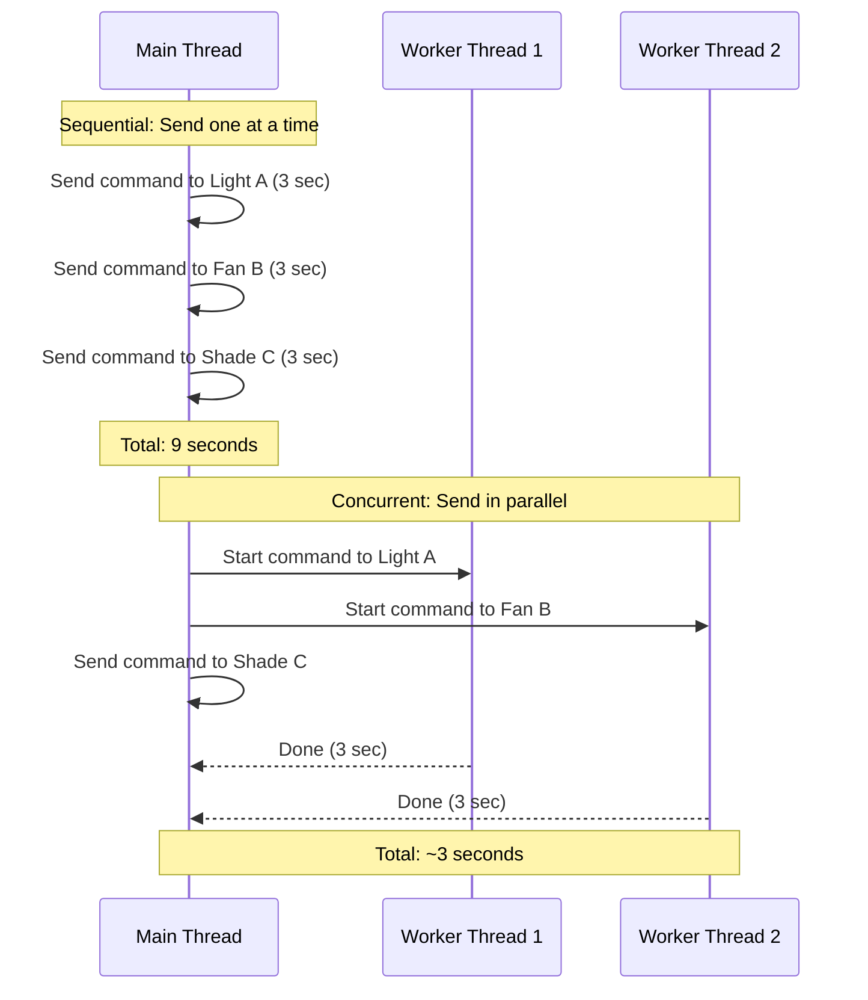
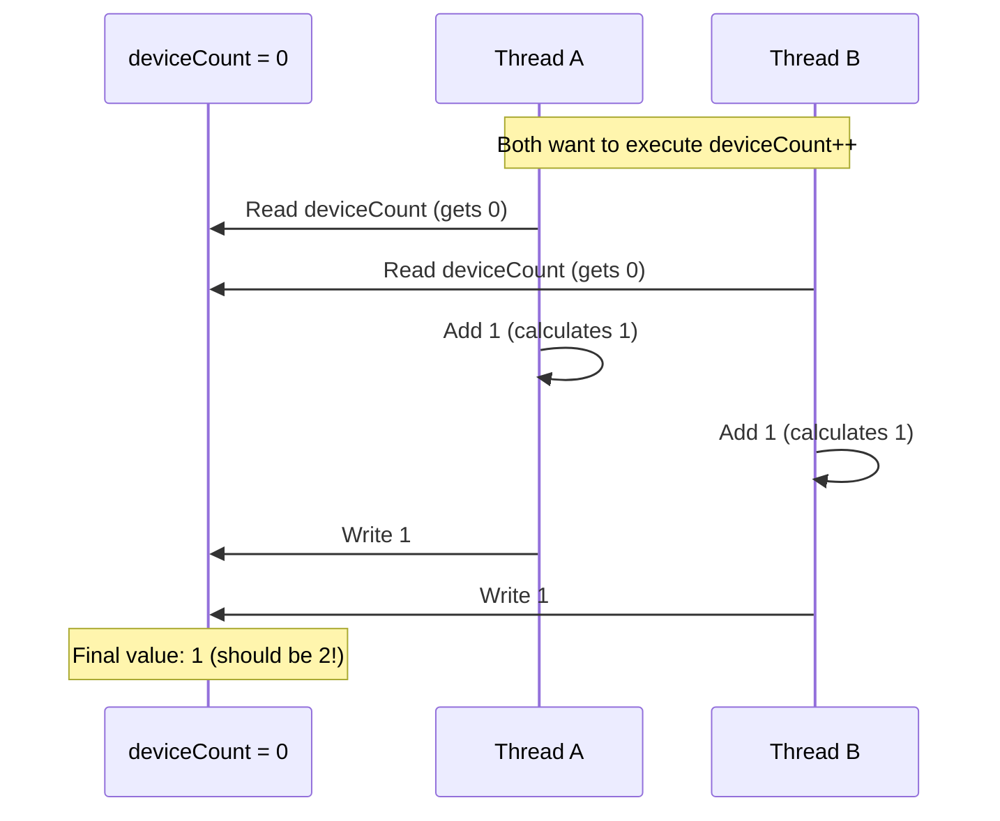
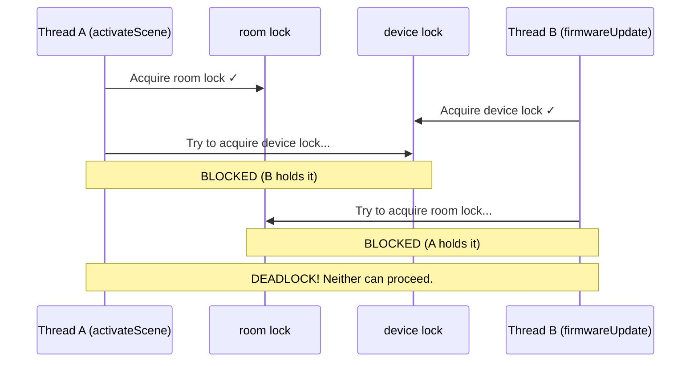

Software systems rarely do just one thing at a time. A web server handles multiple requests simultaneously. A desktop application keeps its UI responsive while loading data in the background. A smart home hub processes device commands from multiple users at the same time as everyone arrives home in the evening.

This lecture introduces **concurrency**—the ability to manage multiple tasks that overlap in time—and its primary mechanism in Java: **threads**. We'll use SceneItAll as our running example, exploring both the power of concurrent execution and the subtle bugs it can introduce.

SceneItAll is a smart home control application that manages IoT devices—lights (switched, dimmable, RGBW), fans (on/off, speeds 1–4), shades (0–100%), organized into areas (rooms, which can be nested). Users define **scenes**—preset conditions across multiple devices (e.g., "Evening" dims lights to 30% and closes shades). The hub communicates with devices over Zigbee and must handle commands from multiple users simultaneously.

## Describe the role of threads as a concurrency mechanism and understand the concept of "interrupts" (15 minutes)

Consider what happens when SceneItAll's hub receives a burst of commands. Multiple family members arrive home and activate their preferred scenes from their phones. If the hub processes device commands sequentially—one at a time—activating a scene that controls 15 devices could block all other commands for seconds. But if the hub can send commands to multiple devices *concurrently*, it can keep the whole house responsive.

### What Is a Thread?

A **thread** is an independent path of execution within a program. Every Java program starts with at least one thread—the main thread that executes `main()`. But programs can create additional threads that run simultaneously.

Think of threads like lanes on a highway. A single-lane road (one thread) handles traffic sequentially—each car waits for the one ahead. A multi-lane highway (multiple threads) allows cars to travel in parallel.



### Creating Threads in Java

Java provides two primary ways to create threads:

**Option 1: Extend the Thread class**

```java
public class DeviceCommandSender extends Thread {
    private final DeviceCommand command;

    public DeviceCommandSender(DeviceCommand command) {
        this.command = command;
    }

    @Override
    public void run() {
        // This code runs in a separate thread
        DeviceResponse response = sendViaZigbee(command);
        command.setResponse(response);
    }
}

// Usage
DeviceCommandSender sender = new DeviceCommandSender(command);
sender.start();  // Starts the new thread
```

**Option 2: Implement the Runnable interface**

```java
public class DeviceCommandTask implements Runnable {
    private final DeviceCommand command;

    public DeviceCommandTask(DeviceCommand command) {
        this.command = command;
    }

    @Override
    public void run() {
        DeviceResponse response = sendViaZigbee(command);
        command.setResponse(response);
    }
}

// Usage
Thread thread = new Thread(new DeviceCommandTask(command));
thread.start();
```

The `Runnable` approach is generally preferred because Java doesn't support multiple inheritance. If your class already extends another class, you can't also extend `Thread`, but you can always implement `Runnable`.

### Thread Pools: Managing Many Threads

Creating a new thread for every task has overhead—memory allocation, OS scheduling, etc. For systems like SceneItAll that send many device commands over Zigbee, we use **thread pools**: a collection of reusable worker threads.

```java
public class HubCommandService {
    // A pool of 10 command worker threads
    private final ExecutorService executor = Executors.newFixedThreadPool(10);

    public void sendDeviceCommand(DeviceCommand command) {
        executor.submit(() -> {
            DeviceResponse response = sendViaZigbee(command);
            DeviceStatus status = parseResponse(response);
            command.getDevice().updateStatus(status);
        });
    }

    public void shutdown() {
        executor.shutdown();
    }
}
```

The `ExecutorService` manages the threads for us. When we `submit()` a task, it queues the work and assigns it to an available worker thread. If all 10 threads are busy, the task waits until one becomes free.

### Interrupts: Canceling Long-Running Work

What happens when a device stops responding during a firmware update? Without intervention, the command thread would block forever waiting for a Zigbee response. Java provides **interrupts** as a cooperative mechanism for canceling threads.

```java
public class TimedCommandSender {
    private final ExecutorService executor = Executors.newSingleThreadExecutor();

    public DeviceResponse sendWithTimeout(DeviceCommand command, Duration timeout) {
        Future<DeviceResponse> future = executor.submit(() -> sendViaZigbee(command));

        try {
            // Wait at most 'timeout' for the response
            return future.get(timeout.toMillis(), TimeUnit.MILLISECONDS);
        } catch (TimeoutException e) {
            // Device took too long—interrupt the thread
            future.cancel(true);  // 'true' means interrupt if running
            return DeviceResponse.timeout("Device exceeded " + timeout.toSeconds() + " seconds");
        } catch (InterruptedException | ExecutionException e) {
            return DeviceResponse.error(e.getMessage());
        }
    }
}
```

When `cancel(true)` is called, Java sets the thread's **interrupt flag**. Well-behaved code checks this flag periodically:

```java
public void applyFirmwareUpdate(Device device, FirmwarePackage firmware) {
    for (FirmwareChunk chunk : firmware.getChunks()) {
        // Check if we've been interrupted
        if (Thread.currentThread().isInterrupted()) {
            throw new InterruptedException("Firmware update cancelled");
        }
        sendChunkToDevice(device, chunk);
    }
}
```

Interrupts are *cooperative*—the running code must check for and respond to them. Code that ignores interrupts (or catches `InterruptedException` without acting on it) can't be reliably cancelled.

:::tip History of Programming
Java's interrupt mechanism reflects a deliberate design choice. Early versions of Java included `Thread.stop()`, which forcibly terminated threads. This turned out to be dangerous—stopping a thread mid-operation could leave shared data in an inconsistent state (imagine stopping a thread halfway through updating a device's firmware). The method was deprecated in Java 1.2 (1998), and cooperative interruption became the standard approach.
:::

## Recognize the need for synchronization in concurrent programs and understand the concept of "atomicity" (15 minutes)

Threads introduce a subtle but critical problem: when multiple threads access shared data, things can go wrong in surprising ways.

### The Problem: A Race to Control Devices

Consider this scenario in SceneItAll: two users—Alice and Bob—both activate different scenes at the same time on the same room. Alice activates "Evening" (dims lights to 30%, closes shades) while Bob activates "Movie Night" (turns lights off, closes shades to 80%).

```java
public class SceneService {

    public boolean activateScene(Scene scene, Area room) {
        // Check current device states in the room
        for (Device device : room.getDevices()) {
            DeviceState targetState = scene.getTargetState(device);
            if (targetState != null) {
                // Read current state, then set new state
                device.setState(targetState);
            }
        }
        return true;
    }
}
```

This code looks correct. It iterates through devices and sets each to the scene's target state. But when two threads execute this method simultaneously on the same room, something unexpected can happen:

```
Time    Thread A (Alice: "Evening")         Thread B (Bob: "Movie Night")
────    ────────────────────────────────    ────────────────────────────────
 1      Read light state (on, 100%)
 2          → set brightness to 30%         Read light state (on, 100%)
 3                                              → set brightness to 0% (off)
 4      Read shade state (open, 0%)
 5                                          Read shade state (open, 0%)
 6      Set shade to 100% (closed)
 7                                          Set shade to 80%
 8      return true                         return true
```

The light ends up off (Bob's command wins), and the shades end up at 80% (Bob's command also wins). Alice's "Evening" scene reports success, but the room is actually in "Movie Night" state. Worse, the devices could end up in a mixed state that matches *neither* scene—imagine if the timing were slightly different and Alice's shade command landed after Bob's.

This is a **race condition**: the program's behavior depends on the relative timing of operations, which is unpredictable.

:::note Recall
In [Lecture 12 (Domain Modeling)](/lecture-notes/l12-domain-modeling), we encountered a similar scenario: competing actions that affect the same domain objects. That was a domain modeling challenge—how do we represent these competing actions? Here we see the technical challenge: even with a good domain model, concurrent access to shared state can corrupt our data.
:::

### Atomicity: Indivisible Operations

The problem with `activateScene` is that reading and writing device state across multiple devices is not **atomic**—it's not a single indivisible operation. Reading a device's current state and writing the new state are separate steps, and another thread can intervene between them.

An operation is **atomic** if it appears to happen instantaneously from the perspective of all other threads. No other thread can see a partial result or intermediate state.

Some operations are naturally atomic. In Java, reading or writing a single primitive variable (except `long` and `double`) is atomic. But compound operations—like check-then-act, read-modify-write, or updating multiple fields—are not.

```java
// NOT atomic: read-modify-write
deviceCount++;  // Actually: read deviceCount, add 1, write deviceCount

// NOT atomic: check-then-act
if (registry.get(deviceId) == null) {
    registry.put(deviceId, device);
}

// NOT atomic: updating multiple fields
light.setBrightness(30);
light.setColorTemp(2700);
```

### Visualizing the Race

Here's what happens when two threads increment a shared device counter during device registration:



This is called a **lost update**—Thread B's increment overwrote Thread A's because they both read the same initial value.

### The Java Memory Model

The situation is actually more complex than interleaved execution. Modern CPUs have caches, and threads running on different CPUs may see different values for the same variable. The **Java Memory Model** (JMM) defines rules for when changes made by one thread become visible to other threads.

Without proper synchronization, there's no guarantee that Thread B will ever see Thread A's writes. Thread B might read a stale value from its CPU's cache indefinitely. This is called a **visibility** problem.

```java
public class StaleDataExample {
    private boolean ready = false;
    private int brightness = 0;

    // Thread A
    public void writer() {
        brightness = 30;
        ready = true;
    }

    // Thread B
    public void reader() {
        while (!ready) {
            // spin-wait
        }
        System.out.println(brightness);  // Might print 0!
    }
}
```

Without synchronization, Thread B might see `ready = true` but still read `brightness = 0`, because the writes might be reordered or cached differently across CPUs.

## Utilize locks and concurrent collections to implement basic thread-safe code (15 minutes)

Java provides several mechanisms for ensuring thread safety. Let's start with the most fundamental: locks.

### The `synchronized` Keyword

The simplest way to make code thread-safe is the `synchronized` keyword. It ensures that only one thread can execute the synchronized code at a time.

```java
public class SceneService {

    public synchronized boolean activateScene(Scene scene, Area room) {
        for (Device device : room.getDevices()) {
            DeviceState targetState = scene.getTargetState(device);
            if (targetState != null) {
                device.setState(targetState);
            }
        }
        return true;
    }
}
```

When a method is `synchronized`, Java acquires a **lock** (also called a **monitor**) on the object before executing the method. If another thread already holds the lock, the calling thread waits.

```
Time    Thread A (Alice: "Evening")         Thread B (Bob: "Movie Night")
────    ────────────────────────────────    ────────────────────────────────
 1      Acquire lock on service
 2      Set light brightness to 30%         Try to acquire lock → BLOCKED
 3      Set shade to 100%                   (waiting...)
 4      return true                         (waiting...)
 5      Release lock                        Acquire lock
 6                                          Set light brightness to 0%
 7                                          Set shade to 80%
 8                                          return true
 9                                          Release lock
```

Now the scene activation is atomic. Bob's thread can't start modifying devices until Alice's thread has finished applying her entire scene. The room will be in a consistent state—either fully "Evening" then fully "Movie Night", never a mix.

### Synchronizing on Specific Objects

Instance methods synchronize on `this`. But sometimes we need finer-grained control:

```java
public class DeviceRegistryService {
    private final Map<String, Device> devices = new HashMap<>();
    private final Object registryLock = new Object();

    public void registerDevice(Device device) {
        synchronized (registryLock) {
            devices.put(device.getId(), device);
        }
    }

    public Device getDevice(String id) {
        synchronized (registryLock) {
            return devices.get(id);
        }
    }
}
```

Using a dedicated lock object has several advantages:
- It's explicit about what's being protected
- Different data structures can have different locks, allowing more concurrency
- The lock object can be `private`, preventing external code from interfering

### ReentrantLock: More Flexible Locking

Java's `ReentrantLock` class provides more features than `synchronized`:

```java
public class SceneActivationManager {
    private final ReentrantLock lock = new ReentrantLock();
    private final Map<String, Scene> activeScenes = new HashMap<>();

    public boolean activateScene(Scene scene, Area room) {
        lock.lock();
        try {
            if (!activeScenes.containsKey(room.getId())) {
                activeScenes.put(room.getId(), scene);
                applySceneToDevices(scene, room);
                return true;
            }
            return false;
        } finally {
            lock.unlock();  // Always unlock, even if an exception is thrown
        }
    }

    public boolean tryActivateScene(Scene scene, Area room, Duration timeout) {
        try {
            // Try to acquire lock, but don't wait forever
            if (lock.tryLock(timeout.toMillis(), TimeUnit.MILLISECONDS)) {
                try {
                    // ... same logic as above
                } finally {
                    lock.unlock();
                }
            } else {
                return false;  // Couldn't acquire lock in time
            }
        } catch (InterruptedException e) {
            Thread.currentThread().interrupt();
            return false;
        }
        return false;
    }
}
```

`ReentrantLock` offers `tryLock()` with a timeout (useful when you don't want to wait indefinitely) and explicit lock/unlock (useful for complex control flow).

### Concurrent Collections

Java's `java.util.concurrent` package provides thread-safe collections that handle synchronization internally:

```java
public class DeviceRegistry {
    // Thread-safe map without external synchronization
    private final ConcurrentHashMap<String, Device> devices =
        new ConcurrentHashMap<>();

    public void registerDevice(Device device) {
        // putIfAbsent is atomic: check and put in one operation
        Device existing = devices.putIfAbsent(
            device.getId(),
            device
        );

        if (existing != null) {
            throw new DeviceAlreadyRegisteredException(
                "Device " + device.getId() + " is already registered"
            );
        }
    }

    public void removeDevice(String deviceId) {
        devices.remove(deviceId);
    }

    public boolean isRegistered(String deviceId) {
        return devices.containsKey(deviceId);
    }
}
```

Key concurrent collections include:
- `ConcurrentHashMap`: Thread-safe map with fine-grained locking for better performance
- `CopyOnWriteArrayList`: Thread-safe list optimized for read-heavy workloads
- `BlockingQueue`: Thread-safe queue with blocking operations for producer-consumer patterns
- `ConcurrentLinkedQueue`: Non-blocking thread-safe queue

:::tip History of Programming
Java's concurrent collections were added in Java 5 (2004) as part of JSR-166, led by Doug Lea. Before this, developers had to either synchronize all access to standard collections or use the legacy `Vector` and `Hashtable` classes, which synchronized every operation (often more than necessary). The `java.util.concurrent` package represented a major advance in making concurrent programming practical.
:::

### Atomic Variables

For simple counters and flags, `java.util.concurrent.atomic` provides atomic wrapper classes:

```java
public class HubStatistics {
    private final AtomicInteger deviceCount = new AtomicInteger(0);
    private final AtomicInteger commandsSent = new AtomicInteger(0);
    private final AtomicLong totalResponseTimeMs = new AtomicLong(0);

    public void recordDeviceRegistered() {
        deviceCount.incrementAndGet();  // Atomic increment
    }

    public void recordCommandSent(long responseTimeMs) {
        commandsSent.incrementAndGet();
        totalResponseTimeMs.addAndGet(responseTimeMs);
    }

    public double getAverageResponseTime() {
        int count = commandsSent.get();
        return count == 0 ? 0 : (double) totalResponseTimeMs.get() / count;
    }
}
```

Atomic classes use hardware-level atomic operations (like compare-and-swap) that are faster than locks for simple updates.

## Understand the concept of "deadlocks" and "race conditions" (15 minutes)

We've seen race conditions—bugs where behavior depends on timing. Now let's examine **deadlock**, an equally insidious concurrency problem where threads get stuck waiting for each other forever.

### What Is Deadlock?

Deadlock occurs when two or more threads are each waiting for resources held by the others, creating a cycle of dependencies that can never be resolved.

Consider this scenario in SceneItAll: `activateScene` locks the room first, then locks individual devices to apply state changes. Meanwhile, a `firmwareUpdate` operation locks the device first, then locks the room to update the room's device manifest.

```java
public class SmartHomeService {

    public void activateScene(Scene scene, Area room) {
        synchronized (room) {
            for (Device device : room.getDevices()) {
                synchronized (device) {
                    device.setState(scene.getTargetState(device));
                }
            }
        }
    }

    public void firmwareUpdate(Device device, Area room, FirmwarePackage firmware) {
        synchronized (device) {
            synchronized (room) {
                device.applyFirmware(firmware);
                room.updateDeviceManifest(device);
            }
        }
    }
}
```

Can you spot the problem? `activateScene()` acquires locks in the order `room → device`, while `firmwareUpdate()` acquires them in the order `device → room`. If two threads call these methods simultaneously:



Both threads are now stuck forever. Thread A holds `room` and waits for `device`. Thread B holds `device` and waits for `room`. Neither will ever release their lock because they're both waiting.

### Preventing Deadlock: Break the Circular Wait

The core of deadlock is a **circular wait**: Thread A holds lock X and waits for lock Y, while Thread B holds lock Y and waits for lock X. The simplest and most reliable prevention is to eliminate the cycle by **always acquiring locks in the same order**.

In our example, `activateScene()` acquires room then device, but `firmwareUpdate()` acquires device then room. The fix: make both methods acquire room first:

```java
// BEFORE: different lock orders → deadlock possible
public void activateScene(Scene scene, Area room, Device device) {
    synchronized (room) {          // room first
        synchronized (device) {    // device second
            device.setState(scene.getTargetState(device));
        }
    }
}

public void firmwareUpdate(Device device, Area room, FirmwarePackage firmware) {
    synchronized (device) {        // device first — WRONG ORDER
        synchronized (room) {      // room second
            device.applyFirmware(firmware);
            room.updateDeviceManifest(device);
        }
    }
}

// AFTER: same lock order → no circular wait → no deadlock
public void firmwareUpdate(Device device, Area room, FirmwarePackage firmware) {
    synchronized (room) {          // room first — SAME ORDER
        synchronized (device) {    // device second
            device.applyFirmware(firmware);
            room.updateDeviceManifest(device);
        }
    }
}
```

Consistent lock ordering is a convention, not a language mechanism — you enforce it through code review and documentation. "In this codebase, we always lock rooms before devices." Simple rule, prevents an entire class of bugs.

### Race Conditions Revisited

We've seen one type of race condition (check-then-act), but there are others:

**Read-Modify-Write**:
```java
// Two threads incrementing a counter when registering devices
deviceCount++;  // Not atomic: read, add, write
```

**Compound Actions**:
```java
// Check and update must be atomic
if (!registry.containsKey(deviceId)) {
    registry.put(deviceId, newDevice);  // Another thread might put first
}
```

**Time-of-Check to Time-of-Use (TOCTOU)**:
```java
// The file might be deleted between check and read
if (file.exists()) {
    return Files.readString(file.toPath());  // Might fail!
}
```

### Detecting Concurrency Bugs

Concurrency bugs are notoriously hard to find because they depend on timing:

- They might not appear in testing but occur in production under load
- They might occur only on certain hardware (more CPU cores)
- They're often not reproducible—running the same test twice might give different results

Some strategies for detection:

1. **Code review**: Look for shared mutable state accessed without synchronization
2. **Static analysis tools**: Tools like SpotBugs can detect common patterns
3. **Stress testing**: Run many threads doing concurrent operations
4. **Thread sanitizers**: Some JVM options can detect race conditions at runtime

In the next lecture, we'll explore an alternative to threads—**asynchronous programming**—which can simplify concurrent code for certain types of work, particularly I/O-bound operations.

### Want to go deeper?

This lecture covers the fundamentals of concurrent programming, but there's much more to explore:

- **[CS 3650: Computer Systems](https://course.khoury.northeastern.edu/cs3650/)** — How the operating system manages processes, threads, virtual memory, and scheduling. The low-level mental model for what happens when you call `Thread.start()`.
- **[CS 4730: Distributed Systems](https://4730.network/)** — Concurrency across machines, not just threads. Consensus algorithms, fault tolerance, distributed transactions.

