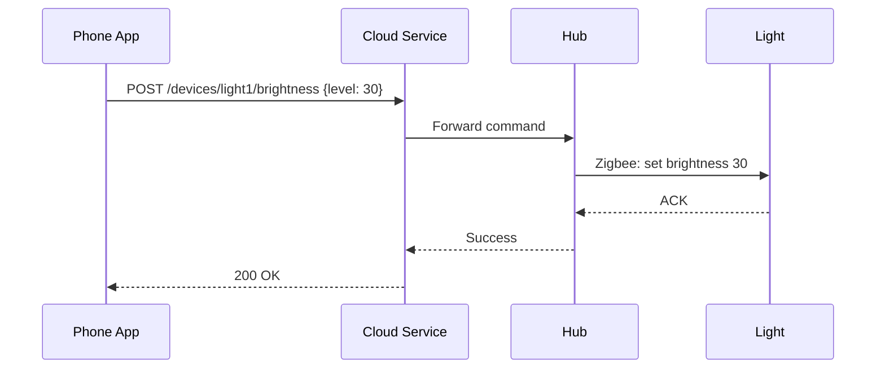

In [Lecture 31](/lecture-notes/l31-concurrency1) and [Lecture 32](/lecture-notes/l32-concurrency2), we explored concurrency within a single program — threads sharing memory, locks protecting shared state, async operations avoiding wasted threads. This lecture zooms out: what happens when the components that need to coordinate aren't in the same program, or even on the same machine?

We'll formalize ideas you've encountered throughout the course — event handlers, property binding, message queues, caching — into a coherent architectural pattern called **event-driven architecture (EDA)**. We'll use SceneItAll as our running example, expanding from the single-hub model of L31-32 to the full system: a hub, mobile apps, a cloud service, and device firmware that all need to stay in sync.

## Describe the Observer pattern and how it reduces coupling (5 minutes)

Before we go distributed, let's name a pattern that has been quietly running through the last several lectures.

In [L29](/lecture-notes/l29-gui1), you registered event handlers on buttons: `button.setOnAction(e -> ...)`. The button doesn't know what your handler does — it just calls it when clicked. In [L30](/lecture-notes/l30-gui2), you bound a Label to a ViewModel property: `label.textProperty().bind(viewModel.nameProperty())`. When the property changes, the label updates automatically — the ViewModel doesn't know labels exist.

This is the **Observer pattern**: an object (the **subject**) maintains a list of dependents (the **observers**) and notifies them automatically when its state changes. The subject doesn't know or care what the observers do with the notification.

```java
// The pattern in its general form
public class Subject<T> {
    private final List<Consumer<T>> observers = new ArrayList<>();
    private T value;

    public void addObserver(Consumer<T> observer) {
        observers.add(observer);
    }

    public void setValue(T newValue) {
        this.value = newValue;
        // Notify all observers — subject doesn't know who they are
        for (Consumer<T> observer : observers) {
            observer.accept(newValue);
        }
    }
}
```

You've seen this pattern at several scales:

| Where you saw it | Subject | Observer | Notification |
|------------------|---------|----------|--------------|
| **L29: JavaFX events** | Button | Your `onAction` handler | "I was clicked" |
| **L30: Property binding** | `IntegerProperty` | Bound Label, bound Slider | "My value changed to 30" |
| **L30: ObservableList** | `ObservableList` | Bound ListView | "An item was added/removed" |

Notice that in every case, the subject doesn't depend on any specific observer. In [Lecture 7 (Coupling and Cohesion)](/lecture-notes/l7-design-for-change), we learned that high coupling makes code hard to change. Observer directly reduces coupling: adding or removing an observer requires zero changes to the subject. The only shared dependency is the notification type itself — *data coupling* at most.

This matters because EDA is the Observer pattern **scaled across process and network boundaries**. The subject becomes a service publishing events. The observers become other services subscribing. The notification travels over a network through a broker instead of through a method call. The decoupling payoff is the same — but the stakes are much higher.

## Define and describe the event-driven architecture (12 minutes)

In L31 and L32, we treated SceneItAll as a single Java application — one program running on the hub. In reality, SceneItAll has several independent components:

- **The hub**: processes device commands over Zigbee, maintains local device state
- **The mobile app**: runs on the user's phone, displays device status, sends commands
- **The cloud service**: enables remote access, stores analytics, manages firmware updates
- **Device firmware**: runs on each individual light, fan, or shade

These components run on different hardware, communicate over different networks, and operate on different timelines.

### Synchronous Communication: Simple but Fragile

The most straightforward approach is for each component to call the next one directly:



This works when everything is healthy. But when the hub is rebooting during a firmware update, the cloud service blocks waiting for it. If many users send commands simultaneously, threads pile up. The cloud service itself becomes slow, and *all* functionality degrades — not just commands to the offline hub. One slow or failed component makes everything slow or failed. This is exactly the scenario the [Fallacies of Distributed Computing](/lecture-notes/l20-networks#the-fallacies-of-distributed-computing) from L20 warn about.

### Events: Publish Facts, Don't Send Commands

Event-driven architecture takes a different approach. Instead of services calling each other directly, they publish **events** — immutable records of things that happened. An event is a fact described in the **past tense**:

```java
public record BrightnessChanged(
    String eventId,           // unique identifier for deduplication
    Instant timestamp,        // when it happened
    String source,            // who published it ("hub-01")
    String deviceId,          // which device
    int previousBrightness,   // what it was
    int newBrightness         // what it is now
) {}
```

Note the naming: `BrightnessChanged`, not `ChangeBrightness`. Events are facts about the past, not commands about the future. A command implies the sender expects the receiver to act. An event simply states what happened — the receiver decides whether and how to react.

| Event | What happened |
|-------|---------------|
| `DeviceDiscovered` | A new device appeared on the Zigbee network |
| `SceneActivated` | A user activated a scene in a room |
| `DeviceOffline` | A device stopped responding |
| `FirmwareUpdateAvailable` | New firmware is available for a device type |

### The Decoupling Payoff

This is the Observer pattern at system scale. When the hub publishes `SceneActivated { scene: "Evening", room: "Living Room" }`, it doesn't know or care that the mobile app updates its UI, the cloud service logs it for analytics, and the automation engine checks if any rules should trigger. Adding a new consumer — say, an energy monitoring service — requires zero changes to the hub. Removing one requires zero changes either.

In [L7](/lecture-notes/l7-design-for-change), we said high coupling means a change in one module forces changes in others. Without EDA, the hub would directly call `mobileApp.updateUI()`, `analytics.logActivation()`, and `automationEngine.checkRules()` — coupled to every downstream system. With EDA, the hub publishes one event and doesn't know who's listening. That's the same principle from [L30](/lecture-notes/l30-gui2) where the ViewModel exposes properties and the View binds to them — neither knows the other's implementation. Observer is the general pattern; MVVM is one application; EDA is the distributed version.

## Describe the role of event brokers and evaluate delivery guarantees (8 minutes)

Events don't travel directly from producer to consumer. They flow through a **broker** — a dedicated service that receives events, stores them durably, and delivers them to subscribers.

:::note Recall
In [Lecture 21 (Serverless)](/lecture-notes/l21-serverless#message-queues-asynchronous-communication), we introduced **message queues** as an infrastructure building block — Bottlenose uses a queue to decouple submission receipt from grading, and Pawtograder uses pgmq to rate-limit GitHub repository creation. An event broker generalizes that concept: many producers and many consumers sharing an event bus, with the broker managing subscriptions and delivery.
:::

Without a broker, if a consumer is offline when an event fires, it misses it. With a broker, the event is stored and delivered when the consumer reconnects. Brokers exist at every scale — Apache Kafka handles millions of events per second at Netflix; Zigbee mesh networks route device events between SceneItAll's hub and individual lights.

### Delivery Guarantees: A Practical Problem

When the broker delivers a `BrightnessChanged` event to the mobile app, how do we know the app actually processed it? This is a practical engineering problem with three possible answers:

- **At-most-once**: Fire and forget. If the message is lost, it's lost. Fine for analytics pings where a dropped sample doesn't matter.
- **At-least-once**: The broker retries until the consumer acknowledges receipt. But if the ACK is lost, the broker retries and the consumer processes the event *again*. Guaranteed delivery — but you might get duplicates.
- **Exactly-once**: Each event processed exactly one time. Everyone wants this. It is extremely hard to achieve because the consumer's processing and its ACK would need to be atomic.

The practical answer: **at-least-once delivery with idempotent consumers**. Accept that duplicates will happen, and design your handlers so that processing the same event twice produces the same result as processing it once.

### Idempotency: Making Duplicates Harmless

An operation is **idempotent** if applying it multiple times has the same effect as applying it once:

| Operation | Idempotent? | Why? |
|-----------|-------------|------|
| `light.setBrightness(30)` | ✅ Yes | Setting to 30 twice = setting to 30 once |
| `light.togglePower()` | ❌ No | Toggling twice reverts to original state |
| `counter.increment()` | ❌ No | Incrementing twice adds 2 instead of 1 |
| `database.upsert(id, record)` | ✅ Yes | Upserting the same record twice = one record |

The design rule is simple: **prefer "set to X" over "change by Y."** `setBrightness(30)` is safe to retry; `adjustBrightness(-70)` is not. Include event IDs so consumers can deduplicate if needed.

## Define "consistency models" and determine the appropriate consistency model for a given software requirement (10 minutes)

Because services process events independently and at different speeds, they may temporarily disagree about the state of the world.

### The Scenario

You set the living room brightness to 30% from your phone. The hub applies it. Your roommate's phone gets the `BrightnessChanged` event 2 seconds later. The wall panel gets it 5 seconds later. During those 5 seconds, three different views of the same room disagree about the brightness.

Is the system broken? That depends on your **consistency model**.

### Strong Consistency

All observers see the same state at the same time. When you set 30%, every screen reflects 30% before any of them show the change. Nothing moves forward until everyone agrees.

Think of it like a group text where nobody can send a new message until everyone has read the last one. Simple to reason about — but painfully slow, and if one person's phone is off, everyone is stuck.

Strong consistency is essential for **safety-critical operations**: locking a smart door lock, disarming a security alarm, controlling medical devices. You *must* know the operation completed everywhere before proceeding.

### Eventual Consistency

Services process events at their own pace. At any given moment, different services may have different views. But given enough time without new events, all services converge to the same state.

Think of it like posting on social media: you post a photo, you see it immediately, but your friend in another city might not see it for a few seconds. The photo isn't "missing" — it just hasn't arrived everywhere yet. Given enough time, everyone sees it. Your browser cache works the same way — eventually consistent with the server.

Eventual consistency is appropriate for most of SceneItAll's operations: display state, analytics, scene history. The cost of your roommate seeing stale data for 5 seconds is negligible.

### Choosing a Consistency Model

The question to ask is: **what is the cost of a user seeing stale data for N seconds?**

| Scenario | Cost of staleness | Consistency model |
|----------|-------------------|-------------------|
| Door lock state | Someone enters who shouldn't | **Strong** |
| Security alarm | Alarm doesn't trigger | **Strong** |
| Brightness display | Roommate sees old value for 5 seconds | **Eventual** |
| Scene history log | Last scene shown is 10 seconds behind | **Eventual** |
| Energy usage dashboard | Power numbers lag by 30 seconds | **Eventual** |

Most real-world systems use eventual consistency for the vast majority of operations. Strong consistency is reserved for the small number of cases where someone could get hurt or something irreversible could go wrong.

In [Lecture 21 (Serverless)](/lecture-notes/l21-serverless), we encountered caching and asked: "What happens when multiple sources of truth diverge?" That was an eventual consistency question — we just didn't have the name for it yet. CDN caches, browser caches, and your phone's copy of the SceneItAll device list are all eventually consistent. It's the default model of how information spreads. Strong consistency is the expensive special case.

## Describe common patterns in event-driven architecture (8 minutes)

The resilience patterns from [Lecture 20 (Networks)](/lecture-notes/l20-networks#designing-for-an-unreliable-world) — **retry with exponential backoff**, **circuit breakers**, and **rate limiting** — apply directly in event-driven systems and compose with idempotent consumers and broker delivery guarantees.

Beyond resilience, event brokers support several architectural patterns that solve different coordination problems:

### Work Queue (Point-to-Point)

Each event is delivered to exactly one consumer. If multiple consumers subscribe, the broker distributes events among them.

```
Producer → [Queue] → Consumer A processes event 1
                   → Consumer B processes event 2
                   → Consumer A processes event 3
```

SceneItAll example: the hub receives 50 device status updates per second. A pool of 5 workers pull from a shared queue — the queue distributes the load evenly. Use this for **parallelizing work**.

### Publish-Subscribe (Fan-Out)

Each event is delivered to *every* subscriber. The broker copies the event to each consumer's subscription.

```
Producer → [Topic] → Consumer A sees event 1
                   → Consumer B sees event 1
                   → Consumer C sees event 1
```

SceneItAll example: when the hub publishes `SceneActivated`, the mobile app, analytics service, and automation engine all receive the same event. Use this for **broadcasting events** that multiple services care about independently.

### Fan-In (Event Aggregation)

Multiple producers publish to the same topic. A single consumer processes the combined stream.

```
Hub             --> [Topic]
Device Firmware --> [Topic]
App             --> [Topic]  --> Single Consumer
```

SceneItAll example: the cloud service aggregates events from all sources into a single activity log. Use this for **centralized logging, monitoring, or analytics**.

### Dead Letter Queue

When a consumer repeatedly fails to process an event, the broker moves it to a **dead letter queue (DLQ)** instead of dropping it. Events in the DLQ can be inspected, debugged, and reprocessed.

SceneItAll example: a firmware update event for a discontinued device keeps failing. After 5 retries, it lands in the DLQ. An engineer adds support for the device type and replays the event. Without a DLQ, that event is silently lost.

| Pattern | When to use | SceneItAll example |
|---------|------------|-------------------|
| **Work queue** | Parallelize processing across workers | Device status updates distributed to worker pool |
| **Pub-sub** | Multiple services react to same event | Scene activation notifies app, analytics, automation |
| **Fan-in** | Aggregate events from many sources | Cloud collects activity from all components |
| **Dead letter queue** | Don't lose events that can't be processed | Failed firmware updates queued for review |

These patterns compose. A real system typically uses pub-sub (broadcasting), work queues (parallelizing), fan-in (aggregation), and DLQs (resilience) — all running through the same broker infrastructure.

---

We started with Observer — a pattern for decoupling components within a process. EDA applies the same idea across network boundaries, with brokers handling delivery and consumers handling duplicates. The hard part isn't sending events; it's deciding what consistency you need and designing your consumers to be idempotent.

### Want to go deeper?

These ideas are explored further in [CS 3700: Networks and Distributed Systems](https://3700.network/), [CS 4730: Distributed Systems](https://4730.network/) (formal consistency models, CAP theorem, Paxos/Raft), and [CS 6620: Fundamentals of Cloud Computing](https://catalog.northeastern.edu/search/?P=CS+6620) (cloud-native event systems at scale).
