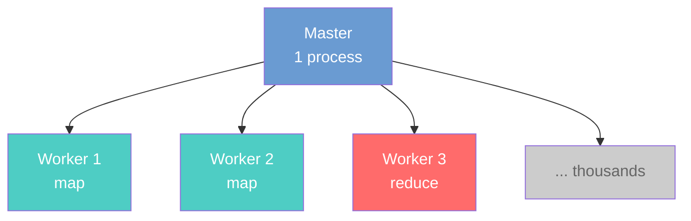
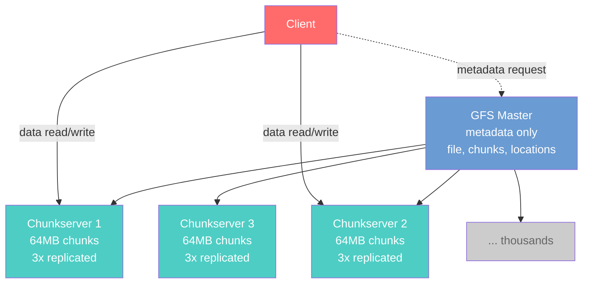

In [L36](/lecture-notes/l36-sustainability), we asked "what happens when this succeeds — at scale, over years, across stakeholders you haven't met yet?" Today we take every design concept from the semester and apply them to a single real system: Google's **MapReduce** framework and the **Google File System (GFS)** that underlies it.

This is not a distributed systems lecture. You will not implement MapReduce. The goal is different: **use MapReduce and GFS as a lens to see how every design concept you've learned this semester shows up in one real system.** Information hiding, coupling, hexagonal architecture, concurrency, fault tolerance, consistency, performance, blast radius, sustainability — all of them are visible in the design decisions Google's engineers made.

## Describe the MapReduce programming model and the Google File System at the level needed to analyze their design decisions (10 minutes)

### The Problem: SceneItAll at Scale

SceneItAll has grown. 100,000 homes generate device telemetry — temperature readings, energy usage, device status changes, scene activations — streaming into a cloud service. The analytics team needs to process this data daily: detect anomalies (is a thermostat stuck?), compute energy reports per household, and generate efficiency recommendations.

A single machine can process about 1,000 homes' data per hour. At 100,000 homes, that is 100 hours — more than four days of continuous computation for a daily report. Adding more machines helps, but now you have a coordination problem: how do you split the work, distribute it, collect the results, and handle machines that fail mid-computation?

This is the problem MapReduce solves.

### MapReduce: The Programming Model

MapReduce, described in the [2004 paper by Jeffrey Dean and Sanjay Ghemawat](https://research.google/pubs/mapreduce-simplified-data-processing-on-large-clusters/), provides a programming model with two user-defined functions:

**Map:** Takes a key-value pair and emits zero or more intermediate key-value pairs.

```text
map(homeId, telemetryData) →
    emit("high-energy", {homeId, dailyKWh})
    emit("normal", {homeId, dailyKWh})
```

For SceneItAll: the map function reads one home's telemetry, computes its daily energy usage, and emits a classification.

**Reduce:** Takes an intermediate key and all values associated with it, and combines them into a final result.

```text
reduce("high-energy", [{home1, 45kWh}, {home2, 52kWh}, ...]) →
    emit("high-energy", {count: 12400, avgKWh: 48.3, recommendations: [...]})
```

For SceneItAll: the reduce function aggregates all high-energy homes, computes statistics, and generates recommendations.

Between map and reduce, the framework performs a **shuffle** — it groups all intermediate values by key and routes them to the appropriate reducer. The programmer writes only the map and reduce functions; the framework handles distribution, parallelism, and fault tolerance.

### MapReduce: The Execution Model

The framework uses a **master/worker** architecture:



1. The **master** splits the input data into chunks (typically 16-64 MB each), assigns map tasks to workers, tracks progress, and coordinates the shuffle.
2. **Map workers** read their assigned input chunk, apply the map function, and write intermediate results to local disk.
3. The **shuffle** phase routes intermediate data to reduce workers based on key.
4. **Reduce workers** read intermediate data for their assigned keys, apply the reduce function, and write final output to the distributed file system.

### The Google File System: Where the Data Lives

MapReduce processes data stored in GFS, described in a [2003 paper by Ghemawat, Gobioff, and Leung](https://research.google/pubs/the-google-file-system/). GFS is a distributed file system designed for Google's specific workload: large files (multi-GB), append-heavy writes, and sequential reads.

GFS has three components:

- **A single GFS master:** Maintains metadata — which chunks belong to which file, where each chunk is stored. Does not store file data itself.
- **Many chunkservers:** Store the actual data. Files are divided into 64 MB chunks, and each chunk is replicated across 3 chunkservers by default.
- **Clients:** Read and write data. Clients contact the master for metadata, then communicate directly with chunkservers for data.



Together, MapReduce and GFS form a system where programmers write simple sequential functions (map and reduce), and the framework distributes execution across thousands of machines, handles failures, and manages data storage transparently.

## Analyze MapReduce and GFS architectural decisions using quality attributes from the course (15 minutes)

Every design decision in MapReduce and GFS reflects trade-offs you have studied this semester. Let's examine them systematically.

### The Map Function Is a Pure Function

The map function takes an input, produces output, and has no side effects. It does not read from or write to shared mutable state. Two map workers processing different input chunks never interact with each other.

:::note Recall
In [L5 (Functional Programming)](/lecture-notes/l5-fp-readability-reusability), we discussed pure functions: given the same input, they always produce the same output and have no side effects. In [L31 (Concurrency)](/lecture-notes/l31-concurrency1), we saw that shared mutable state is the root cause of race conditions. MapReduce eliminates shared mutable state by design — each map task operates on its own input chunk and writes to its own local output. No locks, no synchronization, no race conditions between map workers.
:::

For SceneItAll: the map function that computes one home's energy usage never sees another home's data. If two workers process homes #47 and #48 simultaneously, there is zero risk of interference. This is not an accident — it is a deliberate architectural choice that trades flexibility (you cannot write a map function that compares two homes) for safe parallelism.

### Master/Worker as Hexagonal Architecture

The master is an orchestrator: it assigns tasks, tracks progress, and coordinates data flow. Workers are interchangeable executors: they receive a task, do computation, and report results. The master does not know or care what the map function does — it only knows "run this function on this chunk."

:::note Recall
In [L16 (Designing for Testability)](/lecture-notes/l16-testing2), we introduced Hexagonal Architecture: the application core (domain logic) is surrounded by ports (interfaces) and adapters (implementations). The core does not know about infrastructure details.
:::

MapReduce's master is like the application core — it handles coordination logic. Workers are adapters — they execute user-defined computation in whatever way suits the hardware. The user-defined map and reduce functions are the domain logic, isolated from the distributed infrastructure that runs them. A programmer writing a map function does not need to know about network protocols, chunk replication, or failure recovery. This separation is what makes MapReduce usable by thousands of Google engineers who are not distributed systems experts.

The testability benefit is direct: you can test your map and reduce functions on a single machine with a small input file. The functions are pure; the infrastructure is injected by the framework. This is the same principle from L16 — separate domain logic from infrastructure to make testing trivial.

### GFS's Single Master: A Coupling Decision

GFS uses a single master for all metadata operations. Every client contacts the master to learn which chunkservers hold the data it needs. This is a **centralization** decision with clear coupling implications.

:::note Recall
In [L7 (Coupling and Cohesion)](/lecture-notes/l7-design-for-change), we defined coupling as a measure of how much one module is affected by changes in another. High coupling means changes propagate; low coupling means modules are independent.
:::

**Benefits of the single master:**
- **Simplicity:** One process holds all metadata. No distributed consensus, no conflicting views of which chunk is where. The master can make globally optimal placement decisions (e.g., put chunks near the machines that will read them).
- **Cohesion:** All metadata logic lives in one place — functionally cohesive ([L7](/lecture-notes/l7-design-for-change)).

**Costs of the single master:**
- **Coupling:** Every client depends on the master. If the master is slow, the entire file system is slow. If the master is down, the entire file system is unavailable.
- **Single point of failure:** The master is a blast radius concern — its failure affects every client and every chunkserver.

GFS mitigates this by keeping the master out of the data path. Clients contact the master for metadata (which chunkserver has my chunk?), then read data directly from chunkservers. The master handles small metadata lookups; the chunkservers handle large data transfers. This is information hiding ([L6](/lecture-notes/l6-immutability-abstraction)) at the system level — the master hides the mapping from files to chunks, and clients never need to know the physical layout of data.

### Fault Tolerance: Worker Failure

MapReduce assumes machines will fail. With thousands of workers, the probability that at least one fails during a multi-hour computation is nearly 100%.

**Worker failure detection:** The master pings workers periodically. If a worker does not respond, the master marks it as failed.

**Map worker failure:** The master reassigns the failed worker's map tasks to another worker. The new worker re-reads the input chunk from GFS (which stores it on multiple chunkservers) and re-executes the map function. Because the map function is pure, re-execution produces the same output. This is idempotency by design.

**Reduce worker failure:** Similar — the master reassigns the reduce task. Intermediate map output is stored on each map worker's local disk (the framework does not replicate it for redundancy). The new reducer reads the partition files it needs from those workers over the network; if a map worker's intermediate files are unavailable, the master reassigns and re-executes the corresponding map tasks to regenerate them before running the reduce. The reduce function is then re-executed on that input—safe because it is deterministic.

:::note Recall
In [L33 (Event-Driven Architecture)](/lecture-notes/l33-event-architecture), we discussed idempotent operations: applying an operation multiple times produces the same result as applying it once. MapReduce's retry strategy depends on this — re-executing a map or reduce task is safe because the functions are deterministic and side-effect-free. In [L20 (Networks)](/lecture-notes/l20-networks), we discussed retry with exponential backoff as a resilience pattern. MapReduce applies the same principle at the task level: if a task fails, retry it on a different machine.
:::

**GFS chunkserver failure:** Each chunk is replicated across 3 chunkservers. If one fails, clients read from a surviving replica. The master detects the under-replication and schedules a new copy on a healthy chunkserver. This is the same redundancy principle from [L35 (Safety and Reliability)](/lecture-notes/l35-safety-reliability) — no single point of failure for data.

### Swiss Cheese Analysis: What Happens When a Chunkserver Fails Mid-Write?

A client is appending telemetry data to a GFS file. The write is in progress when one of the three chunkservers storing that chunk crashes.

| Layer | Defense | Hole? |
|-------|---------|-------|
| **Chunk replication** | Data written to 3 chunkservers; 2 survive | Catches single-server failure |
| **Write protocol** | Client sends data to the primary replica, which forwards to secondaries; write is acknowledged only when all replicas confirm | If one secondary fails mid-write, the primary detects the failure |
| **Master re-replication** | Master detects under-replicated chunk and schedules a new copy | Restores redundancy, but not instant |
| **Client retry** | If write fails, client retries with a new set of replicas | Catches transient network failures |
| **Append semantics** | GFS guarantees at-least-once append — a retried append may produce a duplicate record | Consumers must handle duplicates (idempotency again) |

Notice the bottom layer: GFS's relaxed consistency means a retried append may result in duplicate data in the file. This is a deliberate trade-off — GFS chooses availability and simplicity over strong consistency. The same trade-off from [L33](/lecture-notes/l33-event-architecture): eventual consistency is cheaper and more available than strong consistency, but consumers must handle duplicates.

### Consistency: GFS's Relaxed Model

GFS does not provide the strong consistency that a traditional file system offers. After a write, different clients may temporarily see different versions of a file region. After an append, the data is guaranteed to be written at least once, but the exact offset is chosen by the primary replica, not the client.

:::note Recall
In [L33 (Event-Driven Architecture)](/lecture-notes/l33-event-architecture), we defined consistency models. Strong consistency means all observers see the same state at the same time. Eventual consistency means observers may temporarily disagree, but will converge. GFS uses a relaxed consistency model closer to eventual — and for the same reason: strong consistency requires coordination that slows writes and reduces availability.
:::

For SceneItAll analytics, this is acceptable. If a telemetry record is written twice or if two readers momentarily see different file contents, the map function will process whatever it reads and the reduce function will aggregate the results. The final analytics report is not invalidated by a duplicate temperature reading from home #47. The cost of staleness ([L33](/lecture-notes/l33-event-architecture)) is low.

For SceneItAll's door lock state, this would be unacceptable. Different systems require different consistency models depending on the blast radius of inconsistency.

## Identify how MapReduce and GFS apply patterns learned throughout the semester (15 minutes)

### The Design Decisions Table

| MapReduce/GFS Decision | Course Concept | Lecture | Why This Trade-off? |
|------------------------|---------------|---------|---------------------|
| Map function is pure — no shared mutable state | Pure functions eliminate race conditions | [L5](/lecture-notes/l5-fp-readability-reusability), [L31](/lecture-notes/l31-concurrency1) | Enables safe parallelism across thousands of workers without locks |
| Programmer writes only map/reduce; framework handles distribution | Information hiding | [L6](/lecture-notes/l6-immutability-abstraction) | Hides distributed systems complexity behind a simple interface |
| Master assigns tasks; workers execute | Hexagonal architecture (ports and adapters) | [L16](/lecture-notes/l16-testing2) | Domain logic (map/reduce) is separated from infrastructure (scheduling, networking) |
| Single GFS master for metadata | Centralized coordination (coupling trade-off) | [L7](/lecture-notes/l7-design-for-change) | Simplicity and global optimization vs. single point of failure |
| Data path bypasses the master | Separation of concerns (metadata vs. data) | [L6](/lecture-notes/l6-immutability-abstraction), [L19](/lecture-notes/l19-monoliths) | Keeps the master small and fast; chunkservers handle bulk I/O |
| Failed map tasks are re-executed on other workers | Retry + idempotency | [L20](/lecture-notes/l20-networks), [L33](/lecture-notes/l33-event-architecture) | Pure functions make re-execution safe; GFS replication provides data |
| Chunks replicated across 3 servers | Redundancy (no single point of failure) | [L35](/lecture-notes/l35-safety-reliability) | Tolerates individual machine failures without data loss |
| GFS uses relaxed consistency (at-least-once appends) | Eventual consistency | [L33](/lecture-notes/l33-event-architecture) | Strong consistency is too expensive for append-heavy, high-throughput workloads |
| MapReduce processes data where it is stored (locality) | Performance: data location matters | [L34](/lecture-notes/l34-performance) | Network bandwidth is scarce; moving computation to data avoids moving terabytes |
| Input split into 16-64 MB chunks | Batching: amortize fixed costs | [L34](/lecture-notes/l34-performance) | Each task has scheduling overhead; too-small chunks waste time on overhead |
| Thread pool of workers reused across tasks | Pooling: reuse expensive resources | [L34](/lecture-notes/l34-performance) | Avoids per-task startup costs for thousands of tasks |
| Programmers test map/reduce locally, then deploy on cluster | Testability via separation | [L16](/lecture-notes/l16-testing2) | Pure functions with injected input are trivially testable |

### Locality: The Performance Insight

MapReduce does not move data to computation — it moves computation to data. The master knows (from GFS metadata) which chunkservers hold each input chunk. It preferentially assigns map tasks to workers running on the same machine as the data, or at least in the same network rack.

:::note Recall
In [L34 (Performance)](/lecture-notes/l34-performance), we saw the memory hierarchy: CPU cache access takes nanoseconds, RAM takes hundreds of nanoseconds, SSD takes microseconds, and network takes milliseconds. The same hierarchy applies at data-center scale: reading from local disk is fast; reading across the network rack is slower; reading across the data center is much slower. MapReduce's locality optimization is the data-center equivalent of cache-friendly data access — keep the data close to the processor that needs it.
:::

For SceneItAll: if home #47's telemetry is stored on chunkserver X, the master assigns the map task for home #47 to a worker on chunkserver X (or a nearby machine). The worker reads from local disk instead of pulling data across the network. With 100,000 homes generating gigabytes of telemetry, this optimization avoids saturating the network.

### Blast Radius Analysis

MapReduce and GFS have different blast radius profiles for different failure types:

| Failure | Blast Radius | Mitigation | Course Concept |
|---------|-------------|------------|----------------|
| One map worker dies | One task is delayed (re-executed) | Master reassigns to another worker | [L35](/lecture-notes/l35-safety-reliability): redundancy limits blast radius |
| One chunkserver dies | Data on that server temporarily under-replicated | 3x replication means 2 copies survive; master schedules re-replication | [L35](/lecture-notes/l35-safety-reliability): Swiss cheese model |
| Network partition isolates a rack | Workers in that rack are unreachable; their tasks are reassigned | Stale map outputs are discarded; tasks re-executed elsewhere | [L20](/lecture-notes/l20-networks): network is not reliable |
| **MapReduce master dies** | **Entire MapReduce job fails** | Job must be restarted from scratch (original paper); later versions added checkpointing | [L35](/lecture-notes/l35-safety-reliability): single point of failure |
| **GFS master dies** | **Entire file system is unavailable** | Shadow masters provide read-only access; master state is checkpointed and recoverable | [L35](/lecture-notes/l35-safety-reliability): blast radius determines layers needed |

The master is the single point of failure in both systems. This is the cost of the simplicity that centralization provides. A worker failure costs minutes (one task re-execution). A master failure costs the entire job or the entire file system. The blast radius difference is orders of magnitude — and it drove Google to eventually replace GFS's single master with more distributed successors.

:::note Recall
In [L35 (Safety and Reliability)](/lecture-notes/l35-safety-reliability), we said "blast radius determines how many Swiss cheese layers you need." MapReduce workers have small blast radius (one task), so one layer of defense (re-execution) suffices. The master has enormous blast radius (entire job), so it needs more layers: checkpointing, shadow copies, and eventually, architectural redesign.
:::

### Requirements: What Google Optimized For

The original MapReduce and GFS papers explicitly state the requirements that drove the design:

| Requirement | Design Decision | Requirements Concept ([L9](/lecture-notes/l9-requirements)) |
|-------------|----------------|------|
| Process petabytes of web data | Distributed across thousands of machines | Scale requirement — shapes entire architecture |
| Hardware fails frequently (commodity machines) | Fault tolerance built into the framework, not the application | Operational requirement — failure is the common case, not the exception |
| Most access is sequential reads and appends | GFS optimized for large sequential I/O, not random access | Workload assumption — explicitly not a general-purpose file system |
| Engineers who are not distributed systems experts must use it | Simple programming model (just write map and reduce) | Usability requirement — information hiding enables adoption |
| Process the entire web index daily | Throughput over latency; batch processing, not real-time | Performance requirement — optimized for total throughput, not individual query speed |

Notice the fourth requirement. MapReduce's most important design decision might be the simplest: hide the distributed system behind two functions. Thousands of Google engineers wrote MapReduce jobs without understanding the network protocols, replication strategies, or scheduling algorithms underneath. This is information hiding ([L6](/lecture-notes/l6-immutability-abstraction)) serving adoption — and it is why MapReduce succeeded as an internal platform even though its technical design had significant limitations.

## Evaluate sustainability and trade-off dimensions of MapReduce and GFS design decisions (10 minutes)

### The Four Dimensions of Sustainability

In [L36 (Sustainability)](/lecture-notes/l36-sustainability), we introduced four dimensions of sustainability: technical, economic, environmental, and social. MapReduce and GFS provide a compelling case study for all four.

| Dimension | Assessment |
|-----------|-----------|
| **Technical** | High — the simple programming model meant thousands of engineers could write data processing jobs without distributed systems expertise. The framework handled failures, scheduling, and data distribution. Code was maintainable because user-written functions were small and pure. |
| **Economic** | High initially — Google used commodity hardware (cheap machines that fail often) instead of expensive fault-tolerant servers. The framework absorbed the failures, making unreliable hardware economically viable at scale. Over time, economic sustainability decreased as workloads outgrew the batch-only model. |
| **Environmental** | Mixed — MapReduce processes data where it is stored (locality), reducing network energy. But it also enabled processing at a scale that was previously impossible, consuming enormous total resources. |
| **Social** | Mixed — MapReduce democratized large-scale data processing within Google, enabling teams to analyze data that was previously inaccessible. But it also enabled mass-scale data collection and analysis that raises privacy concerns — the web index that MapReduce processes contains data about everyone. |

### Jevons' Paradox: MapReduce Enabled the Modern Web

:::note Recall
In [L36 (Sustainability)](/lecture-notes/l36-sustainability), we discussed Jevons' paradox: when a technology makes a resource cheaper to use, total consumption often increases rather than decreases.
:::

Before MapReduce (early 2000s), processing the entire web index was a bespoke engineering effort — custom code for each analysis job, manual failure handling, weeks of engineering time per pipeline. MapReduce made it cheap: write two functions, submit a job, get results. The per-job engineering cost dropped dramatically.

What happened to total resource consumption? It exploded. MapReduce made large-scale data processing accessible to thousands of engineers. Google ran thousands of MapReduce jobs daily by 2004. The efficiency gain per job was overwhelmed by the increase in total jobs. By the time Google published the original paper, MapReduce was consuming a significant fraction of Google's total compute resources.

For SceneItAll: if the analytics team builds an efficient MapReduce pipeline for daily energy reports, the product team will immediately want hourly reports, per-room breakdowns, anomaly detection, recommendation engines, and A/B test analysis. Each job is efficient. The total compute grows with each new use case. This is the same pattern we saw with Pawtograder in L36 — per-submission grading cost dropped, but unlimited submissions dramatically increased total compute.

### Trade-off Visibility: Who Benefits, Who Bears the Cost?

MapReduce, as an internal Google technology, made trade-offs that were visible to a small group of engineers but had far-reaching consequences:

| Decision | Who benefits | Who bears the cost |
|----------|-------------|-------------------|
| Simple programming model (hide distributed complexity) | Thousands of Google engineers | Google's infrastructure team (must maintain the framework and the massive clusters it runs on) |
| Commodity hardware (cheap, unreliable) | Google's budget (lower capital cost) | The environment (more total machines running, more energy, more e-waste) |
| Process the entire web index | Google's search quality, ad targeting | Everyone whose data is in the index (often without explicit consent) |
| Batch-only model (high throughput, high latency) | Large-scale analytics workloads | Interactive use cases (forced to build separate systems for real-time queries) |

This is the same distributional analysis from [L35](/lecture-notes/l35-safety-reliability) and [L36](/lecture-notes/l36-sustainability): the people making the design decision (Google's infrastructure engineers) are not always the same people bearing the consequences (the environment, the public, the teams needing real-time processing).

### What Came After: The Design Evolved

MapReduce's limitations eventually drove Google to build successors:

- **Batch-only processing** could not serve interactive queries. Google built Dremel (interactive SQL queries over large datasets) and later BigQuery.
- **The two-function programming model** was too restrictive for iterative algorithms (machine learning requires running the same computation many times on evolving data). Google built systems that support iterative computation natively.
- **GFS's single master** became a bottleneck as the file system grew. Google built Colossus, which distributes metadata across multiple servers.

This evolution illustrates a sustainability theme from [L36](/lecture-notes/l36-sustainability): the same design decisions that enable initial success can become obstacles as the context changes. MapReduce's simplicity was its greatest strength (it enabled massive adoption) and its greatest weakness (it could not evolve to support new workloads without being replaced). Low coupling and information hiding ([L6](/lecture-notes/l6-immutability-abstraction), [L7](/lecture-notes/l7-design-for-change)) delayed this reckoning — because the programming model was clean, many jobs could be migrated to successor systems without rewriting their map and reduce functions.

### The Course Arc, Through One System

We started [L1](/lecture-notes/l1-intro) by saying software engineering is "the integral of programming over time." MapReduce and GFS embody every term in that integral:

| Semester concept | Where it appears in MapReduce/GFS |
|-----------------|-----------------------------------|
| Information hiding ([L6](/lecture-notes/l6-immutability-abstraction)) | Framework hides distributed complexity behind two functions |
| Coupling and cohesion ([L7](/lecture-notes/l7-design-for-change)) | Single GFS master: high cohesion, high coupling — an explicit trade-off |
| Requirements ([L9](/lecture-notes/l9-requirements)) | Designed for sequential reads, commodity hardware, non-expert programmers |
| Hexagonal architecture ([L16](/lecture-notes/l16-testing2)) | Master = coordinator; workers = adapters; map/reduce = domain logic |
| Monolith vs. distributed ([L19](/lecture-notes/l19-monoliths), [L20](/lecture-notes/l20-networks)) | Started with a distributed architecture because no single machine could hold the web |
| Concurrency ([L31](/lecture-notes/l31-concurrency1)) | Pure map functions eliminate shared mutable state — no locks needed |
| Event-driven patterns ([L33](/lecture-notes/l33-event-architecture)) | Idempotent re-execution, eventual consistency, at-least-once delivery |
| Performance ([L34](/lecture-notes/l34-performance)) | Locality optimization, batching, pooling workers |
| Safety and reliability ([L35](/lecture-notes/l35-safety-reliability)) | Swiss cheese layers: replication, re-execution, checkpointing; blast radius analysis of master failure |
| Sustainability ([L36](/lecture-notes/l36-sustainability)) | Jevons' paradox; who benefits vs. who bears the cost; technical sustainability through simple APIs |

Every lecture was preparation for reading a system like this. The concepts are not separate tools — they are overlapping lenses that illuminate different aspects of the same design. A well-designed system is one where the lenses align: information hiding supports testability, which supports sustainability. A poorly-designed system is one where the lenses conflict: performance optimizations that increase coupling, which undermines changeability, which erodes sustainability.

### Want to go deeper?

- **[Jeffrey Dean and Sanjay Ghemawat, "MapReduce: Simplified Data Processing on Large Clusters" (2004)](https://research.google/pubs/mapreduce-simplified-data-processing-on-large-clusters/)** — The original paper. Readable and well-written; you have the background to understand all of it.
- **[Sanjay Ghemawat, Howard Gobioff, and Shun-Tak Leung, "The Google File System" (2003)](https://research.google/pubs/the-google-file-system/)** — The companion paper on GFS. Focus on Sections 2 (Design Overview) and 5 (Fault Tolerance).
- **[CS 4730: Distributed Systems](https://catalog.northeastern.edu/course-descriptions/cs/)** — Formal treatment of consensus, replication, and fault tolerance. If MapReduce interests you, this is the next course.
- **[CS 6620: Fundamentals of Cloud Computing](https://catalog.northeastern.edu/course-descriptions/cs/)** — MapReduce's descendants (Spark, BigQuery, Dataflow) and the cloud platforms that run them.
- **[Apache Hadoop](https://hadoop.apache.org/)** — The open-source implementation of MapReduce and HDFS (a GFS clone). Hadoop made MapReduce available outside Google and was the foundation of the "big data" ecosystem.
