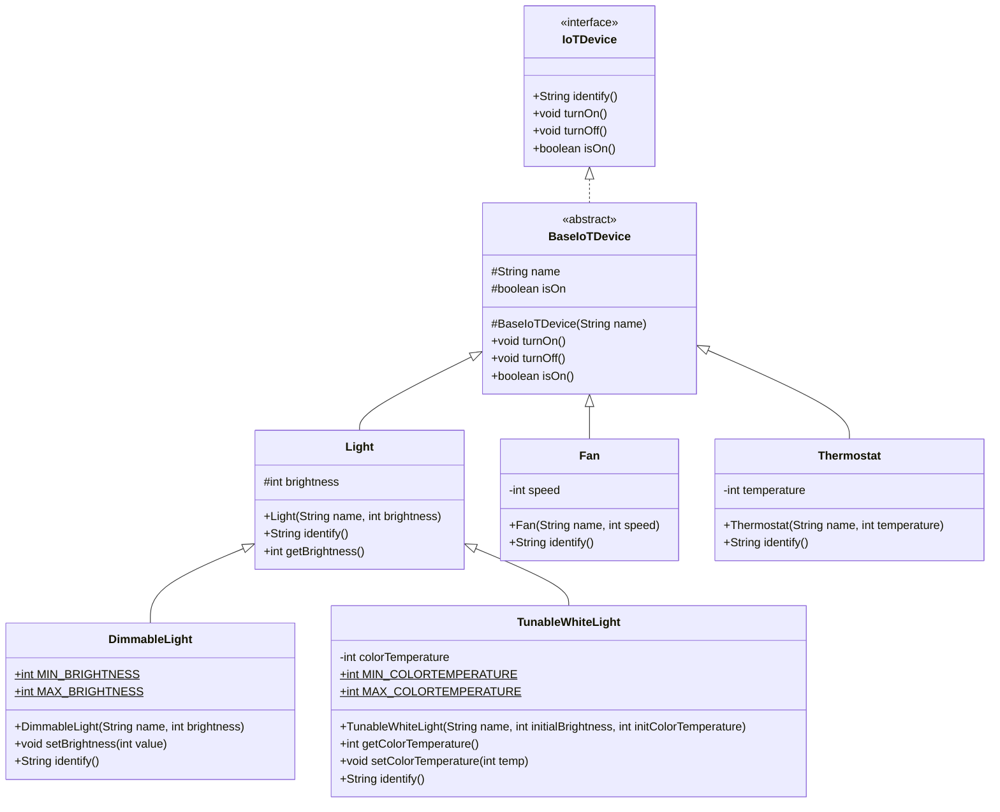
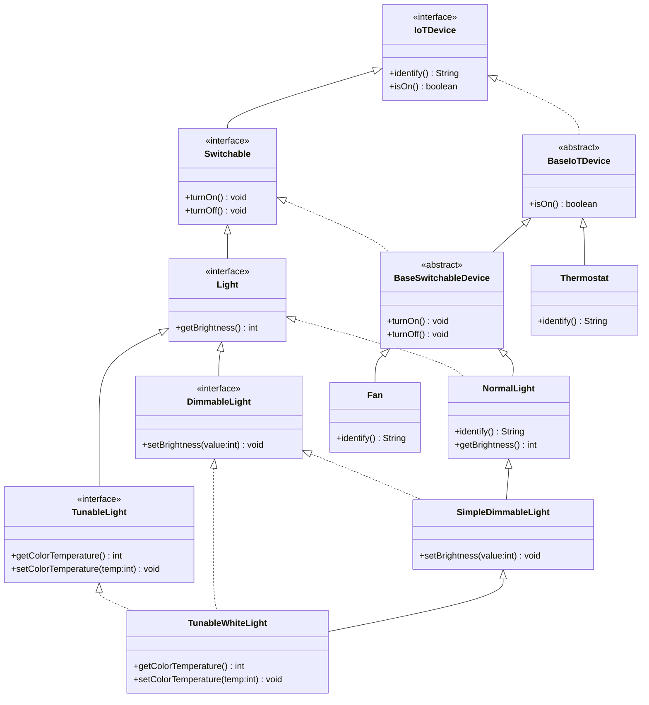

[Redesigned IoTDevice code for Section 4](/code/lectures/l4-specs-contracts-new/code.zip)

# 1 Introduction

Since the dawn of programming, software engineers have been looking for ways to make it easier to write large programs. One of the most important tools in the software engineer's toolbox has been the ability to *modularize* programs.

:::info 
Psychology sidebar: A common rule of thumb is that humans can only hold 7±2 items in their short-term memory ([Miller's Law](https://en.wikipedia.org/wiki/The_Magical_Number_Seven,_Plus_or_Minus_Two)). However, the "item" that we remember can be of variable size. For example, which is easier to remember:
- A lock combination with 8 numbers in order (10, 20, 30, 40, 50, 60, 70, 80)
- A lock combination with 8 numbers in random order (50, 30, 60, 20, 80, 10, 40, 70)

The second is easier to remember because it is a *chunk* ("multiples of 10 from 10 to 80").

:::

When we write a program, our goal is to make it easy to understand. When we break that program down into smaller pieces (e.g. modules, classes, methods), our goal is to provide a sufficiently clear specification for each piece so that we can keep several of those pieces in our short-term memory at once in order to reason about a greater whole. When reading a program, we want to enable a developer to quickly understand the behavior of a method *without* having to read and understand the implementation of that method. The added benefit of this process is that a programmer can focus on designing and implementing one chunk at a time without thinking through the details of the other chunks.

Making a program easier to understand is a multi-faceted problem, that we will tackle in several steps.

# 2 What makes a good specification?

Let us start with the smallest chunk there is: a method.

A good method specification is one that a developer can understand quickly and easily. We desire the following consequences of a good specification:

1. *Generality*: Any implementation of that method that satisfies the specification should be correct
    
2. *Restrictiveness*: Any implementation that does not satisfy the specification is incorrect
    
3. *Clarity*: The specification is clear, umambiguous and easy to understand.

## 2.1 Restrictiveness

When writing a method specification, we must consider all possible inputs that the method could receive. We should be *restrictive* in our specification of a method to rule out any implementations of a method that would be unacceptable to clients of that method.

 - A dramatic casino/game-show style illustration showing the danger of under-specified behavior. CENTER - THE ROULETTE WHEEL: A large spinning wheel divided into wedges, each showing a different possible outcome for 'sum(null)'. The wheel is labeled 'What happens when arr is null?' and is being spun by an ominous figure labeled 'Undefined Behavior'. The wedges include: 'Throw NullPointerException' (reasonable), 'Return 0' (maybe intended?), 'Return -1' (huh?), 'Crash the JVM' (disaster), 'Hang forever' (worse), 'Corrupt data silently' (technically allowed!), 'Work fine... sometimes' (worst—intermittent bugs). A small annotation: 'All of these satisfy the spec! The spec is silent on null.'")

Here is an example of a specification:
```java
/**
 * Returns the sum of the elements in the array.
 * @param arr the array to sum
 * @return the sum of the elements in the array
 */
public int sum(int[] arr) {
    int sum = 0;
    for (int i = 0; i < arr.length; i++) {
        sum += arr[i];
    }
    return sum;
}
```

This specification is not restrictive because it does not specify the behavior of this method in the case where the array is `null`. Thus according to the specification, the behavior of the method is "undefined" when the array is `null`. This is problematic because implementations of this method that throw an exception, return a wrong answer, or even crash the program technically satisfy this specification.

A more restrictive specification would be:
```java
/**
 * Returns the sum of the elements in the array.
 * @param arr the array to sum
 * @return the sum of the elements in the array
 * @throws NullPointerException if the array is null
 */
public int sum(int[] arr) {
    int sum = 0;
    for (int i = 0; i < arr.length; i++) {
        sum += arr[i];
    }
    return sum;
}
```

This specification is more restrictive because it explicitly describes the expected behavior in the case where the array is `null`.

Here is another example of a specification, coming from the `Set` interface:

```java
/**
 * Returns an iterator over the elements in this set.
 * @return an Iterator over the elements in this set
 */
public Iterator<E> iterator()
```

This specification is not restrictive because it does not specify the ordering of the elements in the set. A client of the `Set` interface could reasonably expect the elements to be in a certain order, but the specification does not guarantee this. As it turns out, the `Set` is an unordered collection. Therefore its iterator could return elements in any order, and this is documented in the [ctual documentation for the `Set` interface](https://docs.oracle.com/javase/8/docs/api/java/util/Set.html#iterator--):

```java
/**
 * Returns an iterator over the elements in this set. The elements are returned in no particular order.
 * @return an Iterator over the elements in this set
 */
public Iterator<E> iterator()
```


## 2.2 Generality

Good specifications must strike a balance between being too general and too restrictive. A good specification is general if it does not rule out any implementations that are correct. It is not necessary for a specification to ensure that all possibilities are allowed. This is why good judgment is needed to strike the appropriate balance.

One way to ensure that a specification is general is to specify the *definition* of the method's behavior, rather than its *operational* steps. For example, consider the following specification for a `search` method:

```java
/**
 * If `arr` is null, throw a `NullPointerException`.
 * Else:
 *      Examines each element of `arr` in order.
 *      If the current element is equal to `searchTarget`, return the current index.
 *      If it reaches the end of the array without finding `searchTarget`, throw a `NoSuchElementException`.
 * @param arr the array to search
 * @param searchTarget the element to search for
 */
public int search(int[] arr, int searchTarget)
```

This specifies *how to implement* the method, rather than *what* the method should do. This specification might inadvertently rule out *other* implementations of the method that are semantically correct, but do not match the specification's definition. In particular, it might not matter that we return the *first* occurrence of `searchTarget` in `arr`: if it suffices to simply return *any* occurrence of `searchTarget` in `arr`, then such implementations would be correct, but this is not allowed by the specification.

A more general specification would be:
```java
/**
 * Returns an index of `arr` that contains `searchTarget`.
 * @param arr the array to search
 * @param searchTarget the element to search for
 * @return an index of `arr` that contains `searchTarget`
 * @throws NullPointerException if `arr` is null
 * @throws NoSuchElementException if `arr` does not contain `searchTarget`
 */
public int search(int[] arr, int searchTarget)
```

This specification is more general because it permits implementations that do not return the *first* occurrence of `searchTarget` in `arr`. Note also that it is shorter and more concise. We should write behavior-based specifications, not operational-based specifications.

Note that, of course, if it really is necessary to get the *first* occurrence of the target, this specification is not sufficiently restrictive. In other words both of the above variants may be acceptable depending upon their context (of their intended implementation).

A good way to check for generality is to examine every requirement of the specification. If you can think of a case where the specification does not permit an implementation that is correct, then it is not sufficiently general.

Determining the balance between generality and restrictiveness requires a thorough understanding of the problem domain and the method's clients. For the scope of the next few weeks, we will explicitly specify the domain constraints, but once we begin to discuss requirements gathering and domain modeling, you will need to use your own judgement to balance these constraints.

## 2.3 Clarity

Having a specification that strikes a balance between generality and restrictiveness ensures that a developer can predict the behavior of a method without having to read its implementation. However, this does not necessarily mean that the specification is easy to understand. Hence, our third criterion for a good specification is *clarity*.

The most dangerous specifications are those that allow a developer to think that they understand the method's behavior, but then find that they are incorrect. Clear specifications try to avoid this problem.

Clear specifications tend to be concise and to the point. The most concise specification *might not be the clearest*, but it is a good starting point. Overly long specifications might take longer to read and understand, be more difficult to remember, and be more prone to errors of understanding. Note also that just because a specification is long, it doesn't mean that it is complete.

Clear specifications also avoid unnecessary redundancy. Here is an example of a specification that is not clear because it is redundant:

```java
/**
 * Returns the sum of the elements in the array.
 * The sum is computed by adding each element of the array.
 * It is the total of all the elements in the array.
 * 
 * @param arr the array to sum
 * @return the sum of the elements in the array
 */
public int sum(int[] arr) {
    int sum = 0;
    for (int i = 0; i < arr.length; i++) {
        sum += arr[i];
    }
    return sum;
}
```
It is redundant to say how the sum is computed, and to restate that the sum is the total of all the elements in the array. A reader of this specification may likely know this already, so it is unnecessary. But a reader may also wonder if "sum" and "total" are two different concepts since both are mentioned explicitly, so redundancy may not be benign.

In some cases clear specifications might *purposely* include redundancy if that helps to clarify the specification. Here is an example of a specification:

```java
/**
 * Computes the present value of an income stream.
 * @param income the annual income
 * @param interestRate the risk-free interest rate
 * @param years the number of years
 * @return the present value of the income stream
 */
public float presentValue(float income, float interestRate, int years) 
```

If you know what present value is, you can probably understand this specification without reading the implementation. However, if you do not know what present value is, this specification is not clear.

A more clear specification may define terms that are domain-specific in order to make it more understandable:

```java
/**
 * Computes the present value of an income stream.
 * The present value of an income stream is the amount of money that, if invested at the given interest rate, would grow to the total income over the given number of years.
 * @param income the annual income
 * @param interestRate the risk-free interest rate
 * @param years the number of years
 * @return the present value of the income stream
 */
public float presentValue(float income, float interestRate, int years) 
```

Determining the balance between clarity and conciseness is a matter of good judgement, and is dependent on the problem domain and the method's clients.

## 2.4 Clarity and Long-Term Consequences: When Ambiguity Creates Maintenance Burden

 - A warm, inviting three-panel illustration showing that recipe-writing principles remain constant whether you're cooking for yourself, running a restaurant, or programming a robot baker. LEFT PANEL - 'HOME KITCHEN' (You as Implementer): A cozy home kitchen with a handwritten recipe card: 'Chocolate Chip Cookies - Mix ingredients, bake until golden.' The cookies come out perfect because YOUR context matches YOUR intent. CENTER PANEL - 'RESTAURANT KITCHEN' (Team of Humans): A bustling professional kitchen with multiple cooks at different stations, all reading the SAME recipe card. Different cooks have different thought bubbles showing their interpretations. RIGHT PANEL - 'ROBOT BAKER' (AI/Automated System): A gleaming automated bakery line with a robot arm and conveyor belt. The robot executes EXACTLY what's specified—no more, no less. THE TWIST: Shows the home cook returning to their kitchen 6 months later, following their own vague recipe... and the cookies come out wrong. Caption: 'Plot twist: Even YOUR context changes over time. Future-you is also a different implementer.'")

Ambiguous specifications not only cause immediate problems but also accrue hidden costs over time. When a specification is unclear, different developers make different interpretation choices. These inconsistencies become bugs, cause user complaints, and expensive refactoring.

**Example:** A grading system spec says "submissions should be processed promptly." What does "promptly" mean? One developer implements alphabetical processing; students named "Zhang" consistently wait longer than students named "Adams." Perhaps there was also a "fairness" requirement.

**The general principle:** Unclear specifications delegate decisions to implementers who may not realize they're making consequential choices. These hidden decisions become "specification debt" - they work fine initially but create liability over time as the system scales and reaches more diverse users.

 - An illustrated factory scene showing how ambiguous specifications lead to hidden, consequential decisions being made by implementers. THE AMBIGUOUS SPEC: A vague specification document enters the factory on a conveyor belt. It reads: 'Process submissions promptly.' A magnifying glass hovers over it showing NO details about: ordering, fairness, priority, timing. THE DECISION FACTORY: Inside the factory, a developer stands at a workstation with multiple levers and buttons—each representing a DECISION the spec didn't make. THE UNINTENDED CONSEQUENCE: The factory output shows a queue of student submissions being processed. Students named 'Adams', 'Baker', 'Chen' get processed quickly. Students named 'Williams', 'Young', 'Zhang' wait much longer. Caption: 'Alphabetical ordering = systematic disadvantage for names late in alphabet. Developer didn't intend this. Spec didn't prevent it.' THE HIDDEN COST: A timeline showing: 'SPEC PHASE: Fix ambiguity for $100', 'DEV PHASE: Fix ambiguity for $1,000', 'PRODUCTION: Fix ambiguity for $100,000'.")

**Cost-saving practice:** When specifying systems that affect people, ask: "Could different reasonable interpretations of this spec lead to different outcomes for different groups?" Resolving this ambiguity in the spec is far cheaper than resolving it in deployed code. Even if the decision at present time is to allow for different outcomes for different groups, a central goal of software architecture is to try to eliminate all "too expensive to change" decisions through effective design.

# 3 Specifying Constraints and Conditions

 - A detailed factory floor illustration in a clean industrial design style, showing two parallel assembly lines for 'Method Calls' being quality-checked before shipping to production. LEFT LINE - 'HONOR SYSTEM QUALITY CONTROL' (Comment-Only Specs): A conveyor belt carrying method calls. A laminated sign hangs above: 'PLEASE CHECK: arr should not be null - Javadoc says so!' A tired human inspector sits on a stool, barely glancing at packages as they roll by. Behind the inspection point: CHAOS. Packages explode on contact with the 'Production' area, a NullPointerException alarm blares. RIGHT LINE - 'AUTOMATED QUALITY GATE' (Type Annotations): The same conveyor belt, but now it passes through an imposing automated scanner. The scanner display shows: '@NonNull int[] arr — SCANNING...' Valid packages get a green checkmark stamp. The 'null' package hits an invisible force field—red lights flash, the package is automatically diverted to a 'Fix Before Shipping' chute. Caption: 'Moving specs from comments (that humans ignore) to types (that compilers enforce).'")

When we design a component (method, class, package) we have things in mind that should always hold true. For example if we write a class that represents a date, we want its fields to always represent a valid date. Such conditions that must hold true about a component are called *invariants*. When we design a component that has invariants, they must be clearly specified. 

The best way to specify an invariant would be such that it is not only easily readable by a human, but is actually enforced by the language. A simple example is when a numeric value to be represented must be a whole number (e.g. number of devices). In Python, we would have to write extra code to ensure that such a quantity is never fractional. But in Java we can use one of the four integer types (`byte`, `short`, `int` or `long`) as the data type of this variable. Java would then enforce that these variables never store a fractional amount (by producing a compiler error if one tried, or automatically truncating at runtime). Ideally there would be *enforceable support* for all kinds of invariants for a method or a class. Unfortunately most languages are not built that way, and designing such language is a broad research area within software engineering and programming languages.

## 3.1 Null-ness

One such invariant is surprisingly simple but important enough that when ignored, has the potential of producing many, difficult-to-find bugs. This is when the parameter of a method is non-null. One can imagine how often we write methods that *simply assume* that when called, its parameters will always exist. However in practice, each reference-type parameter in a Java method *can be* null at runtime.

While Java was not designed with this in mind, [two researchers from the University of Washington led an effort to add support for "Type Annotations" to Java](https://citeseerx.ist.psu.edu/document?repid=rep1&type=pdf&doi=b0a3c566dce1092150fff7b886d369cc90dfbd76), which is a feature that allows programmers to express invariants about their code in a way that is both clear and concise. This feature was added in Java 8 (2014), which feels like a long time ago, but given the huge amount of legacy code written in Java, you may not find it widely used in codebases that you encounter.

Here is an example of a type annotation:
```java
public int sum(@NonNull int[] arr) {
    int sum = 0;
    for (int i = 0; i < arr.length; i++) {
        sum += arr[i];
    }
    return sum;
}
```

With this annotation, the compiler will enforce that `arr` is not `null` when the `sum` method is called. If it is `null`, the compiler will generate an error. However, in order to automatically check for nullness, the compiler will require that we add nullness annotations to all of the parameters and fields of all classes in our program. The benefit of this is that we can catch nullness errors at compile time, rather than at runtime. When starting with a legacy codebase, this can be a lot of work. But, when you are starting with a new codebase, it is a great way to ensure that your code avoids this very common source of bugs.

However while type annotations are supported in Java, not all of them are enforced by the Java compiler. This is because the intended behavior of `@NonNull` is not standardized (a strong proposal to introduce a standard `@NonNull` annotation in the language was rejected). Thus there are several possible definitions of `@NonNull`. A coalition of organizations who are frustrated by this (including Google, JetBrains, Microsoft, Uber, and even  Oracle?) have proposed a standard library of type annotations, [JSpecify](https://jspecify.dev/docs/start-here/). In this class, we will use the JSpecify annotations.

While nullness is the most common type annotation to find, this is an active topic of research, and some day you might also be able to specify other properties with type annotations, such as [the immutability of a type](https://dl.acm.org/doi/10.1109/ICSE.2017.52).

## 3.2 Suggested Usage of Nullness Annotations

It is good practice to follow this approach to nullness annotation for new projects:

1. **Mark the package as `@NullMarked`**: Place a `@NullMarked` annotation at the package level (in `package-info.java`). This tells the nullness checker that all types in this package are assumed to be non-null by default.

2. **Explicitly annotate nullable types with `@Nullable`**: When a parameter, return type, or field *can* be null, explicitly mark it with `@Nullable`. This makes the nullability visible in the code.

Here is an example of a `package-info.java` file:
```java
@NullMarked
package edu.neu.cs3100.myproject;

import org.jspecify.annotations.NullMarked;
```

With this setup, you only need to add annotations where something *is* nullable, keeping your code cleaner:
```java
// In a @NullMarked package, arr is assumed non-null
public int sum(int[] arr) { ... }

// Explicitly mark nullable parameters
public String format(@Nullable String prefix, String value) { ... }
```

**Alternative approach for gradual migration**: If you are migrating a legacy codebase, it may be easier to assume everything is nullable by default and explicitly mark non-null types with `@NonNull`. This allows you to incrementally add annotations as you verify each type's nullability. However, for new projects, the `@NullMarked` approach is preferred because it results in fewer annotations overall (since most types are non-null in practice).

## 3.3 Working with Unannotated Libraries

Even when your code is fully annotated with `@NullMarked`, one frequently calls methods from libraries that aren't annotated—including parts of the Java standard library itself! The nullness checker doesn't know whether these methods can return null, so it treats them as having "unknown" nullness.

For example, consider `List.of()`:
```java
String name = "Alice";
List<String> names = List.of(name); // Checker doesn't know if this returns null!
System.out.println(names.size()); // Warning: names might be null
```

Even though `List.of()` *never* returns null, the checker can't verify this because the Java standard library isn't annotated with `@NonNull` (even though the documentation of this method says it never returns null). We have two options:

1. **Check for null explicitly** (unnecessary but satisfies checker):
```java
List<String> names = List.of(name);
if (names != null) {
    System.out.println(names.size());
}
```

2. **Use `Objects.requireNonNull`** (asserts non-null, documents your reasoning):
```java
List<String> names = Objects.requireNonNull(List.of(name));
System.out.println(names.size()); // No warning—checker knows names is non-null
```

`Objects.requireNonNull` serves two purposes:
- At compile time and runtime, it tells the nullness checker "I guarantee this value is non-null"
- At runtime it fails fast with a clear `NullPointerException` if you're wrong, rather than failing later with a confusing error

**When to use it:** Use `Objects.requireNonNull` when you have domain knowledge that a value won't be null, but the checker can't verify this. Common cases include:
- Calling standard library methods like `List.of()`, `Set.of()`, `Map.of()` that never return null
- Using library methods whose documentation guarantees non-null returns
- Receiving values from unannotated third-party libraries

**Caution:** Don't use `Objects.requireNonNull` to silence warnings you don't understand. If you're not sure whether a value can be null, add a proper null check instead. And don't use it for methods like `Map.get()` that genuinely can return null—that's a case where you need actual null handling.

# 4 Specification at the Object Level

Much like a method, the specification of an object describes how the object may be used by others. It is a good idea to think of objects in terms of *an object is what an object does*, and not *an object is what an object has*. The distinction between the two is that the former describes the behavior (the `public` methods it offers) and the latter describes the state (its fields). 

Consider our `IoTDevice` design:

Consider our previous `IoTDevice` design.




## 4.1 Interface for Every Object

From the above definition, it follows that the specification of an object is its list of `public` methods, which is succinctly represented by an interface that the object implements.

This leads to our first rule regarding specification of an object: *each public method offered by an object should emanate from an interface it implements*. In other words an object should not create `public` method out of thin air, but rather implement them as part of a specification that is defined by its interface. When we are designing an object, we must begin by defining an interface for that object.

The consequence of this rule is a developer can understand all the capabilities offered by an object by *only* reading the interfaces that it implements. The only exceptions to this are the constructors, which are class-specific and therefore cannot be included in an interface.

Looking at our above design, we see instances where this rule is broken:

* `Light` class defines a new `getBrightness` method.
* `DimmableLight` class defines a new `setBrightness` method.
* `TunableWhiteLight` class defines `getColorTemperature` and `setColorTemperature` methods. 

We will address this after discussing the next rule.

## 4.2 Interface Segregation

Thermostats usually do not have on/off switches. They are "on" so long as they are powered. Yet our `Thermostat` class above extends `BaseIoTDevice` and therefore has the (unnecessary) `turnOn` and `turnOff` methods.

This has two undesirable consequences:

* The `Thermostat` class has methods that do not belong there. So `Thermostat` class does not faithfully represent an actual thermostat. This is called a *representational gap* which we will revisit.

* If the `turnOn` or `turnOff` methods are modified in the `BaseIoTDevice` class, the `Thermostat` class also changes even though these methods are not relevant to it. In other words there is an unnecessary dependency.

In order to address this, we need to distinguish between devices that are switchable and others that are not. In this way we can ensure that the `turnOn` and `turnOff` methods are only offered by the `Fan` and `Light`devices but not others. In order to do this, we must divide the `IoTDevice` interface into two parts. All devices are `IoTDevice` but not all are "switchable". 

Generalizing this concept leads us to another rule: *Objects should only offer methods that are relevant to it*. From the point of view of the clients that use these objects: *clients should only be exposed to methods it needs*. This principle is called the Interface Segregation Principle.

## 4.3 An Improved `IoTDevice` design

The following design addresses both of the above problems:



The salient features of this refactoring are:

* `IoTDevice` does not offer `turnOn` and `turnOff` methods. They are separated into another `Switchable` interface.
* `BaseIoTDevice` continues to contain code that is common to all IoTDevices. 
* `BaseSwitchableDevice` is a new class that contains code that is common to all switchable IoTDevices.
* `Light` is an interface that only specifies the methods that are applicable to all lights
* `NormalLight` is the implementation of a simple switchable light (this was the `Light` class in the previous design)
* `Fan` is a switchable IoTDevice
* `Thermostat` is merely a IoTDevice, not a switchable one. Hence it does not contain the `turnOn` and `turnOff` methods
* `DimmableLight` is an interface that specifies methods that apply only to dimmable lights
* `SimpleDimmableLight` class represents a dimmable light (this was the `DimmableLight` class in the previous design)
* `TunableLight` is an interface that specifies methods that apply only to lights whose color temperature can be modified
* `TunableWhiteLight` class represents a dimmable light whose color temperature can change (this existed in the previous design, but now does not define new public methods directly)

# 5 Commonly Useful Specifications

## 5.1 "Default Specifications" of all Java classes

Every Java class (directly or transitively) extends the `java.lang.Object` class. This design masterstroke allows all Java code to assume that all objects have specific methods, as they are defined in the `Object` class. Three of these methods are frequently useful, that one should (consider to) override. This is because not only can these methods be called *explicitly* by other code we write, but also used *implicitly* by classes within the JDK and other Java libraries.

## 5.1.1 [`toString`](https://docs.oracle.com/en/java/javase/21/docs/api/java.base/java/lang/Object.html#toString()) 

Here is the specification for the `toString` method:

> In general, the toString method returns a string that "textually represents" this object. The result should be a concise but informative representation that is easy for a person to read. It is recommended that all subclasses override this method. The string output is not necessarily stable over time or across JVM invocations.

If you do not override `toString`, the default implementation will return a string that includes the object's class name and its "hashcode" (for example, `DimmableLight@abdfd`). The `toString` method is automatically called when an object is passed to `println`, `printf`, or `assert`, so it is a good idea to override it to return a string that is useful for debugging.

One should [always override `toString`](https://learning.oreilly.com/library/view/effective-java-3rd/9780134686097/ch3.xhtml#lev12) to provide a string representation of the object. The contract is quite flexible, because there is no specified restriction on the content of the string it returns. A good implementation should be a concise but informative representation that is easy for a person to read. It is OK for the string to change over time, and repeatedly calling it could return the same or different strings.

Sidebar on generality: Note that the last sentence on stability was added in Java 17, and represents an improvement in the generality of the specification. Before that, the specification implied that `toString` should return a stable string, but some implementations did not actually do that, causing unexpected bugs.

Example: With the default implementation, the line `System.out.println("Created new light: " + new DimmableLight(2700));` will print `Created new light: DimmableLight@abdfd` if `toString` is not overridden. This is not very useful for debugging. A more helpful representation might be `Created new light: DimmableLight(color=2700K, brightness=100, on=true)`.

## 5.1.2 [`equals`](https://docs.oracle.com/en/java/javase/21/docs/api/java.base/java/lang/Object.html#equals(java.lang.Object))
The `equals` method is used to compare two objects for equality (compare to Python's `__eq__` method). It is an important method that is used widely. For example, it is used by each `Set` to determine if two objects are the same and by each `List` to support the `contains` method.

`equals` has a somewhat lengthy specification, but one that is hopefully clear:

> Indicates whether some other object is "equal to" this one.
> The equals method implements an equivalence relation on non-null object references:
>
> - It is reflexive: for any non-null reference value `x`, `x.equals(x)` should return `true`.
> - It is symmetric: for any non-null reference values `x` and `y`, `x.equals(y)` should return `true` if and only if `y.equals(x)` returns `true`.
> - It is transitive: for any non-null reference values `x`, `y`, and `z`, if `x.equals(y)` returns `true` and `y.equals(z)` returns `true`, then `x.equals(z)` should return true.
> - It is consistent: for any non-null reference values `x` and `y`, multiple invocations of `x.equals(y)` consistently return `true` or consistently return `false`, provided no information used in equals comparisons on the objects is modified.
> - For any non-null reference value `x`, `x.equals(null)` should return `false`.
>
> An equivalence relation partitions the elements it operates on into equivalence classes; all the members of an equivalence class are equal to each other. Members of an equivalence class are substitutable for each other, at least for some purposes.

`java.lang.Object`'s `equals` method satisfies this contract by using *reference equality*. That is, two objects are equal if and only if they are the same object. In such cases, they are called each other's *aliases*.

You should override `equals` when you want to change this behavior, but it is crucial to still follow the contract.

Here is a recipe for overriding `equals`:
1. Use `==` to check if the other object is the same as "this". If so, return true. This is a performance optimization.
2. Use `instanceof` to check if the other object is of the same type as "this". If not, return false.
3. Cast the other object to the correct type and compare the fields that you care about.
4. Return false if any of the fields are not equal.

Here is an example implementation:
```java
@Override
public boolean equals(@Nullable Object obj) {
    if (this == obj) return true;
    if (!(obj instanceof DimmableLight other)) return false;
    return this.color == other.color 
        && this.brightness == other.brightness 
        && this.on == other.on;
}
```

**Why `@Nullable` on the parameter?** Notice that the `equals` method's parameter must be annotated with `@Nullable`. The contract of `equals` explicitly states that `x.equals(null)` should return `false` (not throw an exception), which means null is a valid input. In a `@NullMarked` package, all types are assumed non-null by default, so we must explicitly mark this parameter as `@Nullable`. If you are using NullAway, the compiler will produce an error if you omit this annotation.

It might be tempting to try to define two objects as equal if they have similar fields but are different types (e.g. `TunableWhiteLight` and `DimmableLight`). However, it is generally not possible to do so without breaking the symmetry or transitivity of `equals`. So, we should not do this.

## 5.1.3 [`hashCode`](https://docs.oracle.com/en/java/javase/21/docs/api/java.base/java/lang/Object.html#hashCode())

 - A detailed post office / mail sorting facility illustration showing how HashMap finds objects in O(1) time. THE MAIL SORTING FACILITY: A bird's-eye view of a mail sorting center with numbered bins (0-15, representing hash buckets). Each bin can hold multiple packages (objects). STEP 1 - COMPUTING THE HASH: A package (DimmableLight object) arrives at the 'Hash Calculator' station—a machine that examines the object's fields and produces a number. The machine display shows: 'hashCode() → 234789234 → mod 16 → Bucket 7'. STEP 2 - FINDING THE BUCKET: Bucket 7 is highlighted, showing it contains 3 packages (objects with the same hash). STEP 3 - THE EQUALS CHECK: The postal worker compares the incoming package against each package in the bucket using equals(). KEY INSIGHT: 'hashCode = fast, approximate (which bucket?)', 'equals = slow, exact (is this the one?)', 'BOTH are needed. hashCode narrows the search; equals confirms the match.' THE CONTRACT WARNING: Shows what happens when equals and hashCode disagree—two 'equal' objects with different hashCodes go to different buckets, and one 'disappears' because the search looks in the wrong bucket.")

In Python, classes that are not Hashable do not need to implement a `__hash__` method. However, in Java, **all** objects have a `hashCode` method, just like they all have an `equals` method.
[If you override `equals`, you *must* also override `hashCode`](https://learning.oreilly.com/library/view/effective-java-3rd/9780134686097/ch3.xhtml#lev11), which has the following contract:
> * Whenever it is invoked on the same object more than once during an execution of a Java application, the hashCode method must consistently return the same integer, provided no information used in equals comparisons on the object is modified. This integer need not remain consistent from one execution of an application to another execution of the same application.
> * If two objects are equal according to the equals method, then calling the hashCode method on each of the two objects must produce the same integer result.
> * It is not required that if two objects are unequal according to the equals method, then calling the hashCode method on each of the two objects must produce distinct integer results. However, the programmer should be aware that producing distinct integer results for unequal objects may improve the performance of hash tables.

The `hashCode` method is used by `HashMap` and `HashSet` to determine if two objects are the same. If two objects are equal according to `equals`, then they must have the same `hashCode`. However, if two objects have the same `hashCode`, they may or may not be equal according to `equals`.

Good hash functions should be fast to compute and produce unequal values for unequal objects.

Here is a recipe for overriding `hashCode`:
1. Declare an `int` field called `result`, initialized to the `hashCode` of the first field that affects equality.
2. Compute a `hashCode` for each field that affects equality.
3. Combine the hash codes using a bitwise operation. We can also consider using `Objects.hash(...)` method to combine several hash values, or even compute a hash value from the objects themselves.
4. Return the result.

(See [Effective Java](https://learning.oreilly.com/library/view/effective-java-3rd/9780134686097/ch3.xhtml#lev11) for more details.)

## 5.2 Ordering

There are many cases in a program where we might want to compare the order of two objects. For example, we might want to sort a list of objects, or find the smallest or largest object in a collection. However unlike equality, ordering does not make sense for all objects (e.g. one can compare two strings, but comparing two devices does not make sense in most contexts). Hence, although this operation is common, it is not part of the default specifications of every class. Java provides two standard ways to define comparison.

## 5.2.1 [`Comparable.compareTo`](https://docs.oracle.com/en/java/javase/21/docs/api/java.base/java/lang/Comparable.html#compareTo(java.lang.Object))

One way to compare two objects of the same class is to have that class implement the `Comparable` interface. By doing so, objects of this class can interoperate with all of the many existing algorithms and data structures that expect this behavior. This makes most sense if there is an obvious natural ordering (e.g. two strings can be lexicographically ordered). 

This interface specifies a single method, `compareTo` with the following specification:

> Compares this object with the specified object for order. Returns a negative integer, zero, or a positive integer as this object is less than, equal to, or greater than the specified object.
>
> The implementation must be reversible (i.e. if `x.compareTo(y)>0` then `y.compareTo(x)<0`). This implies that `x.compareTo(y)` must throw an exception if and only if `y.compareTo(x)` throws an exception.
>
> The implementation must be transitive: (`x.compareTo(y) > 0` && `y.compareTo(z) > 0`) implies `x.compareTo(z) > 0`.
>
> The implementation must ensure that x.compareTo(y)==0 implies that signum(x.compareTo(z)) == signum(y.compareTo(z)), for all z.

Unlike `equals`, `compareTo` specifies exceptional behavior: if the specified object is `null`, a `NullPointerException` is thrown, and if the specified object's type is unexpected, a `ClassCastException` is thrown.

It is also important that `compareTo` is consistent with `equals`: if `x.equals(y)`, then `x.compareTo(y) == 0`. While this last part is not required by the specification, it is a good idea to follow it, and is required for this course.

## 5.2.2 [`Comparator.compare`](https://docs.oracle.com/en/java/javase/21/docs/api/java.base/java/util/Comparator.html#compare(T,T))

The `Comparable` interface is not useful in two contexts:

1. A class has already been written to not implement the `Comparable` interface. It may be risky to modify the class after-the-fact.
2. There may be several viable ways to compare two objects of a class. For example, two books can be compared based on their titles, years of publication or even price. The `Book` class can implement `Comparable.compareTo` only once.

In these situations, the `Comparator` interface may be used to compare two objects of a class. Its implementation is outside the class whose objects are being compared. Several comparators can be written that compare two objects of the same class using different criteria. For example, given a `Book` class, we may write all of the following:

```java

class BookComparatorByTitle implements Comparator<Book> {...}
class BookComparatorByYear implements Comparator<Book> {...}
class BookComparatorByPrice implements Comparator<Book> {...}
...
```

The contract of the `Comparator.compare` method is consistent with that in `Comparable.compareTo`: both return an integer with the same interpretation. 

There are several existing methods and classes that use ordering provided by one of these ways. Some examples are:

* [`Collections.sort` using natural ordering](https://docs.oracle.com/javase/8/docs/api/java/util/Collections.html#sort-java.util.List-)
* [`Collections.sort` using `Comparator`](https://docs.oracle.com/javase/8/docs/api/java/util/Collections.html#sort-java.util.List-java.util.Comparator-)
* [`TreeSet`](https://docs.oracle.com/javase/8/docs/api/java/util/TreeSet.html#TreeSet--)