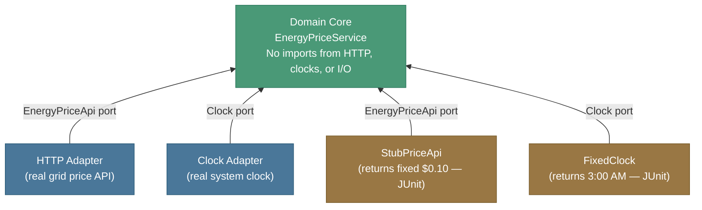

import RevealJS, { Slide } from '@site/src/components/RevealJS';
import Img from '@site/src/components/Img';

<RevealJS transition="slide">

{/* ============================================ */}
{/* COVER IMAGE */}
{/* ============================================ */}

<Slide>
  

<aside className="notes">
**Lecture overview:**
- **Date:** March 16, 2026 — Exam is Wednesday March 18
- **Total time:** ~60 minutes
- **Structure:**
  - Section 1: Debugging a codebase you don't own — HW4 focus (~18 min)
  - Section 2: Architecture tradeoffs — HW5 focus (~22 min)
  - Section 3: Testing concepts students get wrong (~10 min)
  - Section 4: Rapid-fire topic wrap (~8 min)

**Scope of Exam 2:** L9 (Requirements) through L23 (Open Source). Everything since Exam 1.

**Key message today:** The exam won't ask you to recite definitions. It will ask you to reason about tradeoffs and explain what code is doing. That's exactly what we'll practice today.

**Timing note:** This deck is ~70 min of material. If time is tight, the safest cuts are: Exercise 2 (skip live work, debrief verbally) and the Usability rapid-fire slide (point students to the study guide instead).

> **Transition:** Let's look at what's on the agenda...
</aside>

</Slide>

{/* ============================================ */}
{/* TITLE SLIDE */}
{/* ============================================ */}

<Slide>

# CS 3100: Program Design and Implementation II

## Lecture 25: Exam 2 Review

<p style={{marginTop: '2em', fontSize: '0.8em', color: '#666'}}>
  &copy;2026 Jonathan Bell, CC-BY-SA
</p>

<p style={{marginTop: '0.8em', fontSize: '0.75em', color: '#999', fontStyle: 'italic'}}>
  Press <kbd>S</kbd> to see speaker notes
</p>

<aside className="notes">
**Exam logistics reminder:**
- Exam 2 is **Wednesday, March 18** — same room, same format as Exam 1
- More questions than Exam 1 (you won't finish in 25 minutes)
- No headphones — earplugs available if you need focus help
- One cover sheet you can bring — same as Exam 1

**What the exam tests:**
- Conceptual understanding: "what is this pattern doing and why?"
- Apply to code: "what's wrong with this design? what would you change?"
- Tradeoff reasoning: "what quality attribute does this decision prioritize?"
- It will NOT ask you to label test doubles by exact name

> **Transition:** Here's today's agenda...
</aside>

</Slide>

{/* ============================================ */}
{/* AGENDA */}
{/* ============================================ */}

<Slide>

## Today's Agenda

<ol style={{fontSize: '0.8em', textAlign: 'left', lineHeight: '1.9em'}}>
  <li><strong>Debugging</strong> — four approaches, HW4 design issues (~15 min)</li>
  <li><strong>Architecture</strong> — HW5 decisions, hexagonal, ADRs, monolith, serverless (~18 min)</li>
  <li><strong>Poll</strong> — 5 MC questions, 5 min to answer + 5 min discussion (~10 min)</li>
  <li><strong>Testing</strong> — test double concepts, testability best practices, anti-patterns (~8 min)</li>
  <li><strong>Rapid-fire</strong> — requirements, GRASP, networks, teams/AI/OSS (~12 min)</li>
  <li><strong>Exam logistics + Q&A</strong> (~2 min)</li>
</ol>

<p style={{fontSize: '0.82em', marginTop: '1.2em', fontStyle: 'italic', color: '#666'}}>
  Exam scope: L9-L23.
</p>

<aside className="notes">
**Goal for today:** Practice reasoning, not memorization. Every exercise is a format you'll see on Wednesday.

**65-minute budget:**
- Section 1: 15 min (debugging approaches + HW4 design issues; Exercise 1 is a quick 2-min verbal, not written)
- Section 2: 18 min (architecture slides; Exercise 2 is a verbal debrief only — show the code, ask students to call out issues, don't wait for written answers)
- Poll: 10 min (5 run + 5 discuss)
- Section 3: 8 min (testing concepts)
- Section 4: 12 min (rapid-fire — 7 slides at ~90 sec each)
- Exam logistics + Q&A: 2 min
- Total: 65 min

**If running short:** cut the usability rapid-fire slide entirely (students can review Nielsen heuristics from the study guide) and skip the testability anti-patterns slide (it's reinforced by the poll discussion).

> **Transition:** Let's start with debugging.
</aside>

</Slide>

{/* ============================================ */}
{/* SECTION 1: DEBUGGING / HW4 */}
{/* ============================================ */}

<Slide>

## Section 1: Debugging a Codebase You Don't Own

<p style={{fontSize: '1.1em', fontWeight: 'bold', marginTop: '0.5em', color: '#4a9'}}>
  HW4 focus — the skills that separate debugging from guessing
</p>

<aside className="notes">
**Framing for students:**
HW4 asked you to build a test suite for a recipe management library — code you didn't write, with behavior you had to infer from the spec. Many students hit walls: errors they couldn't explain, tests that didn't reflect the spec, AI-generated code they couldn't read.

This section is about the habits that get you out of those walls.

> **Transition:** What does it actually look like to understand code before you change it?
</aside>

</Slide>

<Slide>

## "I Don't Understand This Code" Is the Starting Point, Not the Problem

<div style={{display: 'grid', gridTemplateColumns: '1fr 1fr', gap: '1.5em', fontSize: '0.8em', marginTop: '1em'}}>

<div style={{backgroundColor: 'rgba(200,50,50,0.12)', padding: '0.8em', borderRadius: '8px', border: '1px solid rgba(200,50,50,0.3)'}}>

**Unproductive path** ✗

1. See error
2. Ask AI: "fix this"
3. Get new code
4. See different error
5. Repeat until deadline

*Result: you can't explain your code in a TA meeting — or on the exam*

</div>

<div style={{backgroundColor: 'rgba(50,180,100,0.12)', padding: '0.8em', borderRadius: '8px', border: '1px solid rgba(50,180,100,0.3)'}}>

**Productive path** ✓

1. See error
2. Ask: *"what should this code do?"*
3. Trace: control flow → data flow
4. Identify the gap between expected and actual
5. Fix with understanding

*Result: you understand the code you submit*

</div>

</div>

<p style={{fontSize: '0.8em', marginTop: '1em', fontStyle: 'italic', color: '#9370DB'}}>
  The rubber duck principle: if you can't explain it out loud, you don't understand it yet.
</p>

<aside className="notes">
**This directly connects to HW4 office hours patterns:**
- Many students came in with AI-generated tests that were failing, but couldn't explain what the test was checking
- Others had code that passed locally but failed the autograder — often because the AI wrote a test that used an incorrect input format (a red herring)
- The root issue: accepting AI output without reading it

**Ask students:** "How many of you have seen an error you couldn't explain?" (Hands up.) "How many asked AI to fix it without fully understanding the fix?" (More hands.)

**Rubber duck debugging** — from the program understanding lecture. Force yourself to explain every line before touching it.

> **Transition:** What does tracing control flow actually look like in practice?
</aside>

</Slide>

<Slide>

## Reading Unfamiliar Code: Three Steps Before You Touch Anything

<ol style={{fontSize: '0.82em', textAlign: 'left', lineHeight: '1.8em'}}>
  <li><strong>Read the public interface first.</strong> What can callers do? What does this class promise? The internals follow from the contract.</li>
  <li><strong>Trace the call chain.</strong> Pick one method. Follow it: what does it call? What does it return? What are the preconditions it assumes?</li>
  <li><strong>Ask: what would break this?</strong> Null input? Empty collection? Duplicate entries? These are your test cases — and your debugging suspects.</li>
</ol>

<p style={{fontSize: '0.8em', marginTop: '1em', color: '#9370DB', fontWeight: 'bold'}}>
  For HW4: before writing a test, you must be able to state what the method is supposed to do — in your own words.
</p>

<aside className="notes">
**Concrete for HW4:**
The autograder tested specific behaviors against the spec. Students who failed tests were usually either:
1. Testing behavior that wasn't specified (AI-generated tests that added their own assumptions)
2. Not testing the specified behavior at all (missed a case in the spec)

Both failures trace back to not reading the interface carefully before writing tests.

**Useful technique from the program understanding lecture:**
- Ask AI: "Generate a data flow diagram for this method"
- Ask AI: "Explain what this method does line by line" — then verify it's correct
- Don't ask: "Fix this" — ask: "What is this doing and why does it fail?"

> **Transition:** Let's look at the design issues that came up most in HW4 grading.
</aside>

</Slide>

<Slide>

## Four Debugging Approaches — Know When to Use Which

<div style={{display: 'grid', gridTemplateColumns: '1fr 1fr', gap: '1em', fontSize: '0.76em', marginTop: '0.5em'}}>

<div style={{backgroundColor: 'rgba(74,153,153,0.12)', padding: '0.7em', borderRadius: '8px'}}>

**Rubber Duck Debugging**

Explain the code out loud to an imaginary listener, line by line. Forces you to articulate what you *think* the code does — the gap between your explanation and reality is the bug.

*Best for:* logic errors you can't see by staring; understanding code you didn't write.

</div>

<div style={{backgroundColor: 'rgba(153,100,74,0.12)', padding: '0.7em', borderRadius: '8px'}}>

**Print-Statement Debugging**

Insert `System.out.println` (or logging) at key points to observe actual runtime values. Answers: "what is this actually holding at this moment?"

*Best for:* confirming or refuting assumptions about data flow; quick feedback when a debugger is inconvenient.

</div>

<div style={{backgroundColor: 'rgba(100,74,153,0.12)', padding: '0.7em', borderRadius: '8px'}}>

**Scientific Method**

1. Observe the failure
2. Form a hypothesis ("I think X causes Y")
3. Predict what you'd see if the hypothesis is true
4. Run an experiment (one change at a time)
5. Conclude: hypothesis confirmed or falsified → repeat

*Best for:* complex, non-obvious bugs where you need to rule out causes systematically.

</div>

<div style={{backgroundColor: 'rgba(74,100,153,0.12)', padding: '0.7em', borderRadius: '8px'}}>

**Trial-and-Error Debugging**

Make a change, run, observe. Repeat until it works.

*Risk:* you may fix the symptom without understanding the cause — the bug returns in a different form, or you introduce a new one.

*When acceptable:* known, well-understood environment with fast feedback loops.

</div>

</div>

<aside className="notes">
**Why all four are on the exam:**
The study guide explicitly asks students to describe the methodology behind each. The exam question type: "You observe [failure]. Describe how you would apply the scientific method to diagnose it." or "Which debugging approach is least appropriate here and why?"

**The key contrast:**
- Rubber duck: forces *understanding*
- Print statements: reveals *actual state*
- Scientific method: rules out *causes*
- Trial-and-error: changes things without *understanding*

**Connection to HW4:**
Many HW4 struggles were students doing trial-and-error with AI — changing code until it passes without understanding why. That's the unproductive path from the previous slide.

**Key point to make verbally:**
Trial-and-error is not inherently wrong — experienced engineers do it for well-understood problems with fast feedback. The problem is applying it to code you don't understand yet.

> **Transition:** Now let's look at the specific design issues that appeared most in HW4 grading.
</aside>

</Slide>

<Slide>

## Two Design Issues That Appeared Frequently in HW4

<div style={{display: 'grid', gridTemplateColumns: '1fr 1fr', gap: '1.5em', fontSize: '0.78em', marginTop: '0.5em'}}>

<div style={{backgroundColor: 'rgba(220,140,0,0.12)', padding: '0.8em', borderRadius: '8px', border: '1px solid rgba(220,140,0,0.3)'}}>

**God Class** — class-level issue

One class that knows and does too much. It owns data that belongs in other classes, contains logic for multiple concerns, and becomes the bottleneck for any change.

```java
class RecipeLibrary {
  // parses JSON
  // manages ingredients
  // handles scaling
  // persists to disk
  // formats output
}
```

*Symptom: methods 30+ lines long; adding any feature requires touching this class.*

</div>

<div style={{backgroundColor: 'rgba(80,120,220,0.12)', padding: '0.8em', borderRadius: '8px', border: '1px solid rgba(80,120,220,0.3)'}}>

**Under-decomposed Methods** — method-level issue

A method that does three things should be three methods. Long methods with multiple steps, comments separating logical phases, or deeply nested logic are the tell.

```java
public void addRecipe(Recipe r) {
  // step 1: validate
  if (r == null) throw ...
  if (r.name.isEmpty()) throw ...
  // step 2: normalize
  r.name = r.name.trim().toLowerCase();
  // step 3: store
  recipes.put(r.name, r);
}
```

*Each "step" is a candidate for its own private method.*

</div>

</div>

<aside className="notes">
**Grading clarification that came from HW4:**
The "no double jeopardy" policy means: within a single method, we won't penalize the same logical error more than once. But a class-level design problem (god class) and a method-level design problem (under-decomposed) are fundamentally different issues — even if they stem from the same root cause. Both are deductible.

**Exam connection:**
You may see code on the exam and be asked to identify design issues. Know how to distinguish:
- Class-level: what responsibilities does this class have? How many reasons to change?
- Method-level: what does this method do? Can it be decomposed?

> **Transition:** Let's do a quick exercise.
</aside>

</Slide>

<Slide>

## Exercise 1: Identify the Issue (3 min)

```java
public class CookbookManager {
    private Map<String, List<Recipe>> categories = new HashMap<>();
    private ObjectMapper mapper = new ObjectMapper();

    public void loadFromFile(String path) throws IOException {
        JsonNode root = mapper.readTree(new File(path));
        for (JsonNode cat : root.get("categories")) {
            String name = cat.get("name").asText();
            List<Recipe> recipes = new ArrayList<>();
            for (JsonNode r : cat.get("recipes")) {
                Recipe recipe = new Recipe(
                    r.get("title").asText(),
                    r.get("servings").asInt()
                );
                for (JsonNode ing : r.get("ingredients")) {
                    recipe.addIngredient(ing.get("name").asText(),
                        ing.get("qty").asDouble(), ing.get("unit").asText());
                }
                recipes.add(recipe);
            }
            categories.put(name, recipes);
        }
    }

    public List<Recipe> getByCategory(String cat) { ... }
    public void saveToFile(String path) throws IOException { ... }
    public Recipe scale(Recipe r, double factor) { ... }
    public String formatRecipe(Recipe r) { ... }
}
```

<p style={{fontSize: '0.85em', marginTop: '0.8em', fontWeight: 'bold'}}>
  Identify: (1) a class-level design issue, and (2) a method-level design issue. Are they the same issue or separate?
</p>

<aside className="notes">
**Answers:**

**Class-level:** `CookbookManager` is a god class. It handles:
- JSON deserialization (parsing)
- Data storage/retrieval (categories map)
- Business logic (scaling)
- Formatting (output)
- Persistence (save/load)
Five separate concerns. This class has at least 4 reasons to change: change JSON format, change storage, change scaling logic, change output format.

**Method-level:** `loadFromFile` does three things: reads the file, parses JSON structure, and populates domain objects. These could be decomposed into `parseCategories(JsonNode)`, `parseRecipe(JsonNode)`, etc.

**Are they separate?** Yes. The class-level issue is about responsibility allocation. The method-level issue is about method decomposition. Both are real design problems even though they're in the same code.

**Time:** Give 3 minutes for individual/pair work, then debrief quickly.

> **Transition:** Now let's turn to HW5 — the architecture section.
</aside>

</Slide>

{/* ============================================ */}
{/* SECTION 2: ARCHITECTURE / HW5 */}
{/* ============================================ */}

<Slide>

## Section 2: Architecture Tradeoffs for HW5

<p style={{fontSize: '1.1em', fontWeight: 'bold', marginTop: '0.5em', color: '#4a9'}}>
  The skill: make a design decision and justify the tradeoff
</p>

<aside className="notes">
**Framing for students:**
HW5 asked you to design a service layer and CLI for CookYourBooks. The key word is *design* — unlike HW4, there was no single correct structure. You had to make architectural decisions and live with their consequences.

The exam will ask you to:
1. Recognize architectural patterns in code you're shown
2. Evaluate tradeoffs between alternatives
3. Justify a design decision given a quality attribute goal

> **Transition:** What makes a decision "architectural" rather than just a design choice?
</aside>

</Slide>

<Slide>

## What Makes a Decision Architectural?

<p style={{fontSize: '0.9em', marginTop: '0.5em'}}>
  The heuristic: <strong>will this be expensive to change later?</strong>
</p>

<div style={{display: 'grid', gridTemplateColumns: '1fr 1fr', gap: '1.5em', fontSize: '0.8em', marginTop: '0.8em'}}>

<div style={{backgroundColor: 'rgba(200,80,80,0.12)', padding: '0.8em', borderRadius: '8px', border: '1px solid rgba(200,80,80,0.3)'}}>

**Architectural** — expensive to change

- Does your domain model depend on your CLI?
- Is business logic in your service layer or in your command handlers?
- Does your service layer expose a single registry or separate adapters?
- Where do you draw the port boundary?

*Affect multiple components. Hard to reverse once you have callers.*

</div>

<div style={{backgroundColor: 'rgba(80,160,80,0.12)', padding: '0.8em', borderRadius: '8px', border: '1px solid rgba(80,160,80,0.3)'}}>

**Design** — cheap to change

- Method names in your service class
- Whether `RecipeService` or `CookbookService` is the right name
- Whether you use a `for` loop or `stream().filter()`
- Field ordering within a class

*Local to one class. Easy to refactor with IDE support.*

</div>

</div>

<p style={{fontSize: '0.8em', marginTop: '1em', color: '#9370DB', fontStyle: 'italic'}}>
  Architectural decisions shape how components communicate and what they depend on. Once callers exist, reversing them means changing callers too.
</p>

<aside className="notes">
**The key framing from L18:**
"When we're putting together the design for our system, there are gonna be some decisions that will be relatively cheap for us to change later. And there are others that are gonna become much more expensive."

**The Pawtograder example:**
- Choosing to put language-specific logic in the grading action (not the API) is architectural — reversing it would require changing both components and all their callers
- Naming a method `submitFeedback` vs `sendFeedback` is not architectural

**Exam tip:** When you see a question about design decisions, ask yourself first: is this about *what components exist and how they communicate*, or *what a single class does internally*?

> **Transition:** The most-asked HW5 question was about a specific architectural decision...
</aside>

</Slide>

<Slide>

## The Most-Asked HW5 Design Question

<p style={{fontSize: '0.9em', textAlign: 'center', fontStyle: 'italic', margin: '0.5em 0 1em 0'}}>
  "Should I have a single service registry, or separate service adapters?"
</p>

<div style={{display: 'grid', gridTemplateColumns: '1fr 1fr', gap: '1.5em', fontSize: '0.78em'}}>

<div style={{backgroundColor: 'rgba(74,153,200,0.12)', padding: '0.8em', borderRadius: '8px'}}>

**Option A: Single Registry**

```java
// CLI gets one object
ServiceRegistry services = ...;
services.getRecipeService().scale(...);
services.getLibraryService().add(...);
```

- CLI only needs one dependency
- All services discoverable in one place
- Registry interface grows over time (Hyrum's Law risk)

<p style={{marginTop: '0.6em', fontSize: '0.92em', fontWeight: 'bold', color: '#4a9'}}>
  Prefer when: entry points are many (GUI + CLI + API all need services) and you want a single wiring point. Simplicity of wiring outweighs coupling risk.
</p>

</div>

<div style={{backgroundColor: 'rgba(153,100,200,0.12)', padding: '0.8em', borderRadius: '8px'}}>

**Option B: Separate Adapters**

```java
// CLI gets what it needs
RecipeService recipeOps = ...;
LibraryService libraryOps = ...;
recipeOps.scale(...);
libraryOps.add(...);
```

- CLI is explicit about what it depends on
- Each service can evolve independently
- More constructor parameters / wiring

<p style={{marginTop: '0.6em', fontSize: '0.92em', fontWeight: 'bold', color: '#9370DB'}}>
  Prefer when: testability matters (each command can inject only what it uses) or services evolve at different rates and you want to limit what each caller can see.
</p>

</div>

</div>

<p style={{fontSize: '0.82em', marginTop: '1em', fontStyle: 'italic', color: '#666'}}>
  Neither is universally right. The exam will give you a goal ("prioritize testability" / "minimize wiring complexity") and ask you to choose and justify.
</p>

<aside className="notes">
**How to answer a tradeoff question like this:**
1. Name the quality attribute at stake (coupling, changeability, testability)
2. Explain how each option performs on that attribute
3. Make a recommendation given the stated context

**Example answer:**
"If the priority is testability — being able to test each command in isolation — Option B is preferable because the CLI's dependencies are explicit and can each be replaced with a test double independently. With Option A, you'd need to stub a registry that exposes all services, even for commands that only use one."

**Key point:** "Go with your gut, write code that uses it, then evaluate. Change if it doesn't work." That's the right engineering process.

> **Transition:** The foundational pattern behind both options is hexagonal architecture.
</aside>

</Slide>

<Slide>

## Hexagonal Architecture: The Mental Model for HW5



<p style={{fontSize: '0.82em', marginTop: '0.8em', color: '#9370DB', fontWeight: 'bold'}}>
  Key question: does your domain core import anything from the HTTP layer or the real clock? If yes, the dependencies are backwards.
</p>

<aside className="notes">
**The critical direction check:**
- ✓ `EnergyPriceService(EnergyPriceApi api, Clock clock)` — domain depends on *ports* (interfaces), not adapters
- ✗ `new HttpClient()` inside `EnergyPriceService` — domain depends on infrastructure; can't test without real network

**Why this enables testability:**
To test "does the service recommend charging at 3 AM when prices are low?", you inject `FixedClock` (returns 3 AM) and `StubPriceApi` (returns $0.05). No HTTP call, no real clock. Test runs in milliseconds.

**Student self-check:**
Can I test `shouldCharge()` without making a real HTTP call or waiting for a specific time of day? If no, dependencies are backwards.

> **Transition:** How do we choose between architectural options? Quality attributes.
</aside>

</Slide>

<Slide>

## Quality Attribute Tradeoffs: The Three That Matter Most for HW5

<div style={{fontSize: '0.8em', marginTop: '0.5em'}}>

| Attribute | What it means for HW5 | In tension with |
|-----------|----------------------|-----------------|
| **Changeability** | Can I swap CLI for GUI without touching domain logic? | Simplicity (more indirection) |
| **Testability** | Can I test domain logic without a real CLI or real files? | Simplicity (more interfaces) |
| **Simplicity** | Is the codebase easy to understand and navigate? | Changeability + Testability |

</div>

<p style={{fontSize: '0.82em', marginTop: '1em', fontStyle: 'italic'}}>
  Adding ports and adapters increases changeability and testability — but adds indirection. That tradeoff is worth making when you have a real reason: multiple entry points, testability requirements, or known future change.
</p>

<p style={{fontSize: '0.82em', marginTop: '0.8em', fontWeight: 'bold', color: '#9370DB'}}>
  The flexibility trap: adding interfaces you'll never swap is the worst of both worlds — complexity without benefit.
</p>

<aside className="notes">
**The flexibility trap (from L19 poll discussion):**
"We added an interface to swap databases but never swapped databases." If you add a port for something that will never change, you've added complexity for no benefit.

**How to detect the flexibility trap:**
- Look at your interface. Is there more than one likely implementation?
- If the answer is "well, theoretically..." — that's a warning sign.
- If the answer is "yes: a real implementation and a test double" — that's a legitimate reason.

**Exam framing:**
If given a system with excessive abstraction, you should be able to say: "This adds complexity without changeability benefit because there is only ever one implementation of this interface."

> **Transition:** Four heuristics help identify where to draw service boundaries.
</aside>

</Slide>

<Slide>

## Finding Service Boundaries: Four Heuristics Applied to HW5

<ol style={{fontSize: '0.8em', lineHeight: '2em', textAlign: 'left'}}>
  <li><strong>Rate of change:</strong> What changes weekly (CLI commands, output format)? What changes rarely (recipe scaling logic)? Separate things that change at different rates.</li>
  <li><strong>Actor ownership:</strong> Who interacts with what? The user interacts with the CLI. The domain model is owned by the business logic. Different actors → different components.</li>
  <li><strong>Interface segregation:</strong> Don't expose methods to components that don't use them. A `RecipeScalingService` that also has `persistToFile()` is giving CLI callers access to storage concerns they shouldn't touch.</li>
  <li><strong>Testability:</strong> Can each component be tested without deploying the others? If testing your service requires a running CLI, you've broken this heuristic.</li>
</ol>

<p style={{fontSize: '0.8em', marginTop: '0.8em', color: '#9370DB', fontStyle: 'italic'}}>
  When multiple heuristics point to the same boundary, that's a strong signal you've found a natural seam.
</p>

<aside className="notes">
**Exam question type:**
"Here is a component diagram. Identify one boundary that violates a service boundary heuristic and explain which heuristic it violates."

**Common wrong answer:** Students say "it violates single responsibility" — that's a class-level principle, not an architecture heuristic. At the architectural level, use the four heuristics.

**The convergence insight:**
From L18: when rate-of-change, actor ownership, interface segregation, and testability all point to the same boundary, that's how you know you've found a natural seam. Architecture is discovered, not chosen.

> **Transition:** Let's do a quick exercise on this.
</aside>

</Slide>

<Slide>

## Exercise 2: Identify the Architectural Issue (3 min)

```java
public class RecipeCommandHandler {
    // Handles CLI command: "scale <recipe> <factor>"
    public void handleScale(String[] args) {
        String recipeName = args[1];
        double factor = Double.parseDouble(args[2]);

        // Load from file
        Recipe r = new ObjectMapper()
            .readValue(new File("recipes/" + recipeName + ".json"), Recipe.class);

        // Scale the recipe
        Recipe scaled = new Recipe(r.name + " (x" + factor + ")");
        for (Ingredient ing : r.ingredients) {
            scaled.addIngredient(ing.name, ing.quantity * factor, ing.unit);
        }

        // Print result
        System.out.println(scaled.name);
        for (Ingredient ing : scaled.ingredients) {
            System.out.printf("  %s: %.2f %s%n", ing.name, ing.quantity, ing.unit);
        }
    }
}
```

<p style={{fontSize: '0.85em', marginTop: '0.8em', fontWeight: 'bold'}}>
  Which heuristic does this violate? What quality attribute does that affect? How would you fix it?
</p>

<aside className="notes">
**Answers:**

**Heuristic violated:** Rate of change + Actor ownership + Testability (multiple violations)
- File loading logic (changes if storage changes) lives in the CLI handler
- Scaling logic (domain logic) lives in the CLI handler
- Formatting/output logic lives in the CLI handler
- All three change for different reasons and are owned by different concerns

**Quality attribute affected:**
- Testability: you cannot test the scaling logic without providing a real file on disk and capturing stdout
- Changeability: if you want to add a GUI, you'd have to duplicate the scaling logic

**How to fix:**
- `RecipeService.scale(Recipe, double)` — pure domain logic, no I/O
- `RecipeRepository.findByName(String)` — handles file loading
- `CommandHandler` calls both, formats output only
- Now you can test `RecipeService.scale()` with in-memory objects, no file required

**Time:** 3 minutes, then debrief.

> **Transition:** Let's now cover the testing concepts that were most commonly confused.
</aside>

</Slide>

{/* ============================================ */}
{/* MONOLITH + SERVERLESS */}
{/* ============================================ */}

<Slide>

## Monolith, Partitioning, and Serverless: The Architectural Spectrum

<div style={{display: 'grid', gridTemplateColumns: '1fr 1fr 1fr', gap: '1em', fontSize: '0.75em', marginTop: '0.5em'}}>

<div style={{backgroundColor: 'rgba(74,153,153,0.12)', padding: '0.7em', borderRadius: '8px'}}>

**Monolith**

Single deployment unit, shared memory, unified codebase.

*Strengths:* simplicity ★★★, responsiveness ★★★, easy debugging

*Weaknesses:* scalability ★☆☆, deployability ★☆☆, fault tolerance ★☆☆

Fix a typo → redeploy everything. Crash in one module → whole system down.

**Modular monolith:** same operational simplicity, but enforced internal boundaries (modules with public APIs). Probably what you've been building.

</div>

<div style={{backgroundColor: 'rgba(153,100,74,0.12)', padding: '0.7em', borderRadius: '8px'}}>

**Technical vs. Domain Partitioning**

```
Technical:          Domain:
controllers/        grading/
services/             GradeController
repositories/         GradeService
models/             submissions/
                      SubmissionController
```

**Technical:** group by role. Makes sense when teams own technical layers (frontend/backend/DBA).

**Domain:** group by business capability. Changes to a feature stay in one folder. Generally preferred.

*Conway's Law:* architecture mirrors team structure — teams that own technical layers produce technical partitions.

</div>

<div style={{backgroundColor: 'rgba(100,74,153,0.12)', padding: '0.7em', borderRadius: '8px'}}>

**Serverless / FaaS**

"Technical partitioning with a vendor."

**You manage:** your function code, event triggers, environment variables

**Provider manages:** servers, OS, runtime, scaling, networking, redundancy

```java
// Your whole "server" is:
public class ScaleHandler implements
    RequestHandler<S3Event, String> {
  public String handleRequest(
      S3Event event, Context ctx) {
    // 15 lines of business logic
  }
}
```

*Best for:* event-driven, stateless, bursty load.
*Not for:* long-running, sustained high load, real-time.

</div>

</div>

<aside className="notes">
**Exam question types for this slide:**

Monolith:
- "What is the defining characteristic of a monolith?" (single deployment unit, shared memory, unified codebase)
- "What is the main downside of a monolith as it scales?" (deployability, fault tolerance — one crash takes everything down)
- "What's the difference between a monolith and a modular monolith?" (enforced internal boundaries)

Partitioning:
- "Given this directory structure, is it technical or domain partitioning?" (recognize from structure)
- "A team has a frontend team and a backend team. Which partitioning style would Conway's Law predict?" (technical)

Serverless:
- "What is a developer's responsibility in a serverless architecture vs. a traditional server?" (code + config, not infrastructure)
- "Why is serverless a poor fit for a live trading platform?" (latency requirements, cold starts, 15-min execution limit)

> **Transition:** ADRs — the tool for capturing *why* you made architectural decisions.
</aside>

</Slide>

{/* ============================================ */}
{/* ADRS */}
{/* ============================================ */}

<Slide>

## Architecture Decision Records (ADRs): Capturing the Why

<p style={{fontSize: '0.9em', marginTop: '0.3em'}}>
  Diagrams show <em>what</em> the architecture is. ADRs capture <em>why</em> it is that way — and what you gave up.
</p>

<div style={{display: 'grid', gridTemplateColumns: '1fr 1fr', gap: '1.5em', fontSize: '0.8em', marginTop: '0.8em'}}>

<div>

**Three required elements:**

1. **Context** — what situation drove this decision? What constraints or forces were in play?
2. **Decision** — what did you choose, and what alternatives did you consider?
3. **Consequences** — what do you gain? What do you lose? What becomes harder?

*An ADR that only lists benefits isn't doing its job.*

</div>

<div style={{backgroundColor: 'rgba(74,153,153,0.1)', padding: '0.8em', borderRadius: '8px', fontSize: '0.9em'}}>

**Example (Pawtograder security):**

**Context:** Grading scripts contain instructor solutions. Student code runs on the same infrastructure. Students could potentially exfiltrate them.

**Decision:** Download grading scripts at runtime over an authenticated channel rather than bundling them in the runner image.

**Consequences:**
- ✓ Students can't inspect the runner image for secrets
- ✓ Scripts can be updated without rebuilding the runner
- ✗ Adds a network dependency that can fail (reliability risk)
- ✗ Requires authenticated download infrastructure

</div>

</div>

<aside className="notes">
**Why we write ADRs:**
Three years from now, when a developer asks "why is it done this way?", the ADR gives them the context to evaluate whether the original decision still makes sense. If the context has changed (e.g., the reliability risk is now unacceptable), the ADR tells you *why* the decision was made so you can revisit it intelligently.

**Exam question type:**
"Given this architectural decision, write a brief ADR. Make sure to include context, decision, and consequences (including downsides)."

The most common mistake: students write ADRs that only describe benefits. A good ADR makes the tradeoff explicit — if there were no downsides, you wouldn't need to record the decision.

> **Transition:** Now let's cover the testing section.
</aside>

</Slide>

{/* ============================================ */}
{/* MID-LECTURE POLL */}
{/* ============================================ */}

<Slide>

## Mid-Lecture Poll — 5 minutes

<p style={{fontSize: '0.9em', marginTop: '0.5em', fontStyle: 'italic'}}>
  Answer at <strong>pollev.com/jbell</strong>
</p>

<aside className="notes">
**Poll placement:** After the heavy architecture section, before testing — students need a break and a chance to consolidate.

**Run PollEverywhere for 5 minutes, then spend 5 minutes on discussion.**

**The 5 questions:**

---

**Q1 (GRASP — Information Expert):**
`CookbookManager` calls `Recipe` for ingredients and sums calories. A colleague suggests moving the calorie calculation into `CookbookManager`. Per Information Expert, which is better?

A) CookbookManager — it's calling the method anyway
B) Recipe — it has the ingredient data needed to calculate calories ✓
C) Neither — a separate CalorieCalculator service should own this
D) It doesn't matter; either works

---

**Q2 (Architectural decision):**
`EnergyPriceService` constructs `new HttpClient()` inside `shouldCharge()` and calls the live grid API directly. Which quality attribute does this hurt most?

A) Simplicity
B) Testability ✓
C) Responsiveness
D) Deployability

---

**Q3 (Distributed systems):**
A grading service crashes mid-processing. On restart, it processes the same submission again — student gets double-graded. Which pattern prevents this?

A) Circuit breaker
B) Exponential backoff
C) Idempotency key ✓
D) Graceful degradation

---

**Q4 (Monolith vs. distributed):**
A one-line bug fix in the notification module requires redeploying the entire monolith — 20 minutes, app offline. Which monolith characteristic explains this?

A) Shared memory
B) Unified codebase
C) Single deployment unit ✓
D) Technical partitioning

---

**Q5 (Test doubles — conceptual):**
`OrderService.placeOrder()` calls `EmailService.sendConfirmation()` as a side effect. You can't infer from the return value whether the email was sent. What should your test do?

A) Provide a fake `EmailService` that returns a predictable value
B) Verify that `EmailService.sendConfirmation()` was called with the right arguments ✓
C) Use a real `EmailService` to check the actual email
D) Skip testing this behavior — side effects are hard to test

---

**Discussion focus after poll:**
- Q2: connect to the anti-patterns slide coming up next
- Q5: this is the key test doubles concept — calling into a dependency IS the observable behavior; you must verify the call

**If short on time:** run Q1, Q3, Q5 only (the three highest-value questions).
</aside>

</Slide>

{/* ============================================ */}
{/* SECTION 3: TESTING */}
{/* ============================================ */}

<Slide>

## Section 3: Testing — The Question That Matters

<p style={{fontSize: '1.1em', fontWeight: 'bold', marginTop: '0.5em', color: '#4a9'}}>
  Not: "is this a spy or a fake?" — But: "what is this test double doing?"
</p>

<aside className="notes">
**From the study session:**
The most common student question was "what's the difference between a mock, fake, spy, and stub?" The exam will NOT ask you to label a test double by exact name. It will ask you to reason about what the test is doing.

> **Transition:** Here's the right question to ask.
</aside>

</Slide>

<Slide>

## Test Doubles: Two Questions That Actually Matter

<p style={{fontSize: '0.88em', marginTop: '0.3em', fontStyle: 'italic'}}>
  The exam won't ask you to label a test double. It will ask you to reason about what a test is doing.
</p>

<div style={{display: 'grid', gridTemplateColumns: '1fr 1fr', gap: '1.5em', fontSize: '0.8em', marginTop: '0.8em'}}>

<div style={{backgroundColor: 'rgba(74,153,153,0.15)', padding: '0.8em', borderRadius: '8px'}}>

**Question 1: Should this test provide fake data to the SUT?**

Use a fake/controlled dependency when the real one is unpredictable, slow, or unavailable — and the test's goal is to verify what the *system under test* does with that input.

```java
// Real question: "does service recommend
//   charging when price is low?"
// We don't care about the real API —
// just make it return something predictable.
EnergyPriceApi stubApi = () -> 0.05; // cheap!
Clock fixedClock = Clock.fixed(
    Instant.parse("2026-03-16T03:00:00Z"),
    ZoneId.of("UTC"));

EnergyPriceService svc =
    new EnergyPriceService(stubApi, fixedClock);

// Assert on the SUT's output:
assertThat(svc.shouldCharge()).isTrue();
```

</div>

<div style={{backgroundColor: 'rgba(153,100,200,0.15)', padding: '0.8em', borderRadius: '8px'}}>

**Question 2: Should this test verify the SUT made specific calls?**

Use a verifying double when the correctness of the code is *that it called a collaborator correctly*, not just what value it returned. The dependency IS the observable behavior.

```java
// Real question: "does service send an alert?"
// The return value tells us nothing —
// we need to know the notifier was called.
AlertService mockAlerts =
    mock(AlertService.class);

EnergyPriceService svc =
    new EnergyPriceService(stubApi, fixedClock,
                           mockAlerts);
svc.checkAndAlert();

// Assert the SUT's BEHAVIOR, not output:
verify(mockAlerts)
    .sendAlert(argThat(a -> a.level == HIGH));
```

</div>

</div>

<aside className="notes">
**What to emphasize — from Jon's explicit direction:**
The exam is NOT about labeling a double as "stub" vs "mock" vs "spy." It's about these two conceptual questions:
1. "Does this test need to control what comes INTO the SUT?" → provide fake data
2. "Does this test need to verify what the SUT DID to a collaborator?" → verify calls

**How to identify which is happening in test code you're shown:**
- If the test stubs a return value and then asserts on the result of the method → Question 1 (fake inputs)
- If the test calls `verify(...)` or otherwise inspects what the dependency received → Question 2 (verify calls)
- Both can happen in the same test

**The key teaching point:**
When *should* you verify calls? When the observable effect of the system under test IS the call — for example, "did the notification service get called when an order was placed?" The only way to test that is to verify the call happened. You can't check the return value of a void method.

When *should* you provide fake data? When the real dependency is slow (real database), non-deterministic (time, random), or unavailable (external API) — and you want to isolate the SUT's logic.

> **Transition:** All of this only works if the architecture supports swapping dependencies...
</aside>

</Slide>

<Slide>

## Ports and Adapters → Testability

<p style={{fontSize: '0.9em'}}>
  The whole point: at each port, you can swap the real adapter for a test adapter.
</p>

```
Production:
  EnergyPriceService → EnergyPriceApi (port)
                              ↓
                        HttpPriceAdapter (adapter — real HTTP call)

Test:
  EnergyPriceService → EnergyPriceApi (same port)
                              ↓
                        StubPriceApi (test adapter — returns fixed $0.05)
```

<p style={{fontSize: '0.82em', marginTop: '1em'}}>
  This only works if <code>EnergyPriceService</code> depends on the <strong>port</strong> (interface), not the <strong>adapter</strong> (concrete class). If it has <code>new HttpClient()</code> inside it, you cannot swap it.
</p>

<p style={{fontSize: '0.82em', marginTop: '0.8em', color: '#9370DB', fontWeight: 'bold'}}>
  Exam question type: "Here's a class that's hard to test. What architectural change makes it testable?"
</p>

<aside className="notes">
**The answer to that exam question is almost always:**
"Inject the dependency through the constructor (or a setter) rather than constructing it inside the method. The dependency should be typed as the interface (port), not the concrete class (adapter)."

**The key antipattern:**
```java
public class EnergyPriceService {
    // WRONG — hardwired; can't substitute in tests
    private EnergyPriceApi api = new HttpPriceAdapter();
}
```
vs.
```java
public class EnergyPriceService {
    private final EnergyPriceApi api;
    // RIGHT — injected; callers can swap the adapter
    public EnergyPriceService(EnergyPriceApi api) {
        this.api = api;
    }
}
```

**Why:** When the service constructs `HttpPriceAdapter` internally, callers cannot substitute a stub. The dependency is hidden and hardwired.

> **Transition:** Let's do a rapid-fire wrap on the remaining topics.
</aside>

</Slide>

{/* ============================================ */}
{/* TESTABILITY PRACTICES + ANTI-PATTERNS */}
{/* ============================================ */}

<Slide>

## Designing for Testability: Best Practices and Anti-Patterns

<div style={{display: 'grid', gridTemplateColumns: '1fr 1fr', gap: '1.5em', fontSize: '0.8em', marginTop: '0.5em'}}>

<div style={{backgroundColor: 'rgba(50,180,100,0.12)', padding: '0.8em', borderRadius: '8px', border: '1px solid rgba(50,180,100,0.3)'}}>

**Best practices ✓**

- **Inject dependencies** through the constructor — type them as interfaces, not concrete classes
- **One responsibility per class** — small classes with clear purposes are easy to test in isolation
- **Pure functions where possible** — no side effects, same output for same input; trivial to test
- **Ports and adapters** — keep I/O at the boundary; domain logic has no filesystem or network calls
- **Avoid global state** — static fields and singletons make test order matter

</div>

<div style={{backgroundColor: 'rgba(200,50,50,0.12)', padding: '0.8em', borderRadius: '8px', border: '1px solid rgba(200,50,50,0.3)'}}>

**Anti-patterns ✗**

```java
public class EnergyPriceService {
  // Anti-pattern 1: hardwired concrete dependency
  private EnergyPriceApi api =
      new HttpPriceAdapter(); // can't swap

  public boolean shouldCharge() {
    // Anti-pattern 2: new inside method
    HttpClient client = HttpClient.newHttpClient();

    // Anti-pattern 3: direct System.out
    System.out.println("Checking price...");

    // Anti-pattern 4: static/global state
    return GlobalConfig.get("threshold") > 0.10;
  }
}
```

Each makes it impossible to test without a live HTTP server or capturing stdout.

</div>

</div>

<aside className="notes">
**Exam question type:**
"This class is difficult to unit test. Identify two specific anti-patterns and explain how to fix each."

**The common fixes:**
1. `new JsonFileRepository()` → `RecipeService(RecipeRepository repo)` constructor injection
2. `new ObjectMapper()` inside method → inject as a dependency or use a static factory (acceptable if ObjectMapper is stateless and cheap)
3. `System.out.println` → inject a `Logger` interface or use SLF4J (which can be mocked)
4. `Logger.global()` → inject an SLF4J `Logger` via constructor

**The underlying principle in all four cases:** testable code has *explicit* dependencies that can be substituted. Hidden dependencies (constructed inside, static, global) are untestable by definition.

**Connection to HW4:**
Students who wrote tests that relied on specific file paths or who couldn't test individual methods without the whole system running were likely hitting these anti-patterns in their own test subjects.

> **Transition:** Rapid-fire — let's cover the remaining exam topics.
</aside>

</Slide>

{/* ============================================ */}
{/* SECTION 4: RAPID-FIRE */}
{/* ============================================ */}

<Slide>

## Section 4: Rapid-Fire Wrap

<p style={{fontSize: '1.1em', fontWeight: 'bold', marginTop: '0.5em', color: '#4a9'}}>
  L12, L13, L20, L22–24 — key concepts, exam-relevant framing
</p>

<aside className="notes">
**Pacing:** ~2 minutes per topic. These are "know the concept, recognize it in context" topics — not deep dives.

> **Transition:** Domain modeling first.
</aside>

</Slide>

<Slide>

## Requirements Analysis and Domain Modeling (L9, L12)

<div style={{display: 'grid', gridTemplateColumns: '1fr 1fr', gap: '1.2em', fontSize: '0.78em', marginTop: '0.5em'}}>

<div style={{backgroundColor: 'rgba(74,153,153,0.12)', padding: '0.7em', borderRadius: '8px'}}>

**Extractive vs. Participatory Requirements**

| | Extractive | Participatory |
|--|------------|---------------|
| Design power | Analyst | Shared with stakeholders |
| Stakeholder role | Subject (interviewed) | Partner (co-designs) |
| Risk | Analyst misunderstands domain | Slower; conflicting views |

*When participatory matters:* complex domains where analysts lack expertise, or where user buy-in affects adoption.

**Domain Modeling:** captures real-world entities, relationships, and constraints. Vocabulary should match what stakeholders say — not `RecipeDTO`, just `Recipe`.

</div>

<div style={{backgroundColor: 'rgba(153,100,74,0.12)', padding: '0.7em', borderRadius: '8px'}}>

**Representational Gap**

The distance between how the domain looks in reality and how it's modeled in code.

*Small gap → good:* `Recipe` has `ingredients`, mirroring the real world. Changes to domain thinking translate naturally to code changes.

*Large gap → bad:* `DataRecord` with a `String type` field — domain structure lost in abstraction.

**Goal:** keep the gap small. Design choices that create unnecessary layers between the real domain and the code make the system harder to reason about and change.

</div>

</div>

<aside className="notes">
**Exam question types:**
- "A requirements team interviews chefs but makes all design decisions themselves. Is this extractive or participatory? What's the risk?"
- "This class is `RecipeDataRecord` with a `String type` field. What does this tell you about the representational gap?"
- "Why should domain model vocabulary match the stakeholder's language?"

> **Transition:** GRASP — assigning responsibilities to the right classes.
</aside>

</Slide>

<Slide>

## GRASP Patterns: Assigning Responsibilities (L12, L17)

<div style={{display: 'grid', gridTemplateColumns: '1fr 1fr 1fr', gap: '0.9em', fontSize: '0.74em', marginTop: '0.5em'}}>

<div style={{backgroundColor: 'rgba(74,100,200,0.12)', padding: '0.7em', borderRadius: '8px'}}>

**Information Expert**

Give a responsibility to the class that has the information needed to fulfill it.

```java
// Who calculates total calories?
// → Recipe has the ingredients
class Recipe {
  List<Ingredient> ingredients;

  // ✓ Recipe IS the expert
  public int totalCalories() {
    return ingredients.stream()
      .mapToInt(Ingredient::calories).sum();
  }
}
// ✗ Not RecipeService — it would
//   need to reach into Recipe's data
```

</div>

<div style={{backgroundColor: 'rgba(200,100,74,0.12)', padding: '0.7em', borderRadius: '8px'}}>

**Creator**

B should create A when B: **aggregates** A, **closely uses** A, or **has the initializing data** for A.

```java
// Who creates Ingredient instances?
// Recipe aggregates Ingredients
class Recipe {
  public void addIngredient(
      String name, double qty, String unit) {
    ingredients.add(
      new Ingredient(name, qty, unit)); // ✓
  }
}
// ✗ Not RecipeService — it doesn't
//   aggregate Ingredients
```

</div>

<div style={{backgroundColor: 'rgba(100,200,74,0.12)', padding: '0.7em', borderRadius: '8px'}}>

**Controller**

Sits between UI and domain. Receives system events, delegates to domain objects. Contains **no business logic**.

```java
class ScaleCommand implements Command {
  private final RecipeService service;

  public void execute(String[] args) {
    String name = args[1];
    double factor = Double.parseDouble(args[2]);

    // Just delegates — no logic here
    Recipe r = service.scale(name, factor);
    System.out.println(format(r));
  }
}
```

*Thin controller: translate, delegate, done.*

</div>

</div>

<aside className="notes">
**Exam question types:**
- "Which class should own `totalCalories()`? Apply Information Expert."
- "`Cookbook` contains a list of `Recipe` objects. Who creates `Recipe` instances?" (Creator: Cookbook)
- "This command handler has 30 lines of business logic. Which GRASP principle does it violate?" (Controller — should delegate, not compute)

**Connection to Exercise 2:**
The `RecipeCommandHandler` that students analyzed violated the Controller pattern — it contained scaling logic and file loading that belonged in domain objects/services.

> **Transition:** Networks and distributed systems.
</aside>

</Slide>

<Slide>

## Networks and Distributed Systems (L20): The Eight Fallacies

<div style={{fontSize: '0.78em', display: 'grid', gridTemplateColumns: '1fr 1fr', gap: '1em', marginTop: '0.5em'}}>

<div>

**The fallacies (what you assume wrongly):**
1. The network is reliable
2. Latency is zero ← *the chatty API killer*
3. Bandwidth is infinite
4. The network is secure ← *CIA triad*
5. Topology doesn't change
6. There is one administrator ← *Palo Alto Networks*
7. Transport cost is zero
8. The network is homogeneous

</div>

<div>

**Patterns that address them:**

| Problem | Pattern |
|---------|---------|
| Unreliable network | Retry + exponential backoff + jitter |
| Retry idempotency | Idempotency key |
| Cascading failure | Circuit breaker |
| Partial success | Graceful degradation |
| Too many calls | Chunky vs. chatty APIs |

</div>

</div>

<p style={{fontSize: '0.8em', marginTop: '0.8em', color: '#9370DB', fontWeight: 'bold'}}>
  The visceral number: 100 API calls × 100ms latency = 10 seconds. Chatty APIs don't scale.
</p>

<aside className="notes">
**Exam question types:**
- "This code makes N calls to the service in a loop. What fallacy does it violate? How would you fix it?"
- "A user's grade submission shows as pending, and the server confirms receiving it, but the grade was applied twice. Which pattern prevents this?"
- "After a service restart, clients continue hammering it with retries and it crashes again. Which pattern prevents this?" (Circuit breaker)

**The CIA triad:**
- Confidentiality: student grades not visible to other students
- Integrity: grades reflect real autograder results (not tampered)
- Availability: students can submit before deadlines

**Authentication vs. Authorization:**
- 401 = not authenticated (prove who you are)
- 403 = authenticated but not authorized (you're not allowed)

> **Transition:** Teams, OSS, and Usability.
</aside>

</Slide>

<Slide>

## Teams, AI and OSS 

<div style={{display: 'grid', gridTemplateColumns: '1fr 1fr', gap: '1em', fontSize: '0.76em', marginTop: '0.5em'}}>

<div style={{backgroundColor: 'rgba(74,153,153,0.12)', padding: '0.7em', borderRadius: '8px'}}>

**Teams (L22)**

- **Brooks' Law:** Adding people to a late project makes it later — each new person adds O(n) communication paths
- **Conway's Law:** Systems mirror team structure — teams that own technical layers produce technical partitions; teams that own features produce domain partitions
- **HRT:** Humility, Respect, Trust — the behavioral foundation; team project failures are almost always collaboration, not technical skill

</div>

<div style={{backgroundColor: 'rgba(153,100,74,0.12)', padding: '0.7em', borderRadius: '8px'}}>

**AI Best Practices (L13, syllabus)**

AI is *appropriate* when: generating boilerplate you understand, exploring unfamiliar APIs, asking for explanations, speeding up tasks you could do yourself.

AI *crosses the line* when: you submit code you cannot explain, you let AI make architectural decisions without understanding them, or you use it to bypass the learning the assignment targets.

**The test:** Can you walk a TA through every line of your submission and explain why it's there? If not, you've used AI in a way that undermines your own learning — and that will show on the exam.

</div>

<div style={{backgroundColor: 'rgba(153,100,74,0.12)', padding: '0.7em', borderRadius: '8px'}}>

**OSS (L23)**

- **Dependency risk:** One `implementation` line → 10 JARs from 4 organizations you're now trusting
- **Licensing:** GPL propagates (copyleft) — including a GPL library may require your project to become GPL. MIT/Apache do not propagate.
- **Log4Shell:** A *logging* library turned log messages into `Runtime.exec()`. Transitive dependencies carry full security risk.

</div>

</div>

<aside className="notes">
**Exam question types:**
- "Two teams own overlapping parts of the codebase. What principle predicts what happens to the architecture?" (Conway's Law)
- "A GPL-licensed library is added as a dependency to a project with a permissive license. What's the risk?" (GPL propagates)
- "A user tries to delete a device scene but there's no undo. Which Nielsen heuristic does this violate?" (H3: User control and freedom)
- "A student asks AI to write an implementation, submits it, and cannot explain it in a code walk. What does the course policy say about this use?"

**For AI practices — this is on the exam:**
The study guide explicitly calls out "AI best practices for 3100: review the syllabus policies." Make sure students know the line is about understanding, not about using AI at all. Using AI productively (as a tool to learn faster) is encouraged. Using AI to avoid understanding is the problem.

> **Transition:** Exam logistics.
</aside>

</Slide>

{/* ============================================ */}
{/* EXAM LOGISTICS + Q&A */}
{/* ============================================ */}

<Slide>

## Exam 2: What to Expect Wednesday

<div style={{fontSize: '0.82em', marginTop: '0.5em'}}>

| | Details |
|---|---|
| **Date** | Wednesday, March 18 — class time, same room |
| **Format** | Written; one cover sheet (same as Exam 1) |
| **Length** | More questions than Exam 1 — budget your time |
| **Scope** | L9–L23 (Domain Modeling through Open Source) |
| **Question style** | Conceptual reasoning, identify issues in code, evaluate tradeoffs |
| **Not on the exam** | Labeling test doubles by exact name (spy/fake/stub/mock) |
| **Headphones** | Not permitted — earplugs available on request |

</div>

<aside className="notes">
**Final messaging:**
- The exam rewards students who can reason — not students who memorized definitions
- If you can explain your HW4 code and your HW5 design decisions, you're prepared
- The study guide (posted to discussion board) maps topics to lecture numbers — use it to fill gaps

**Questions to watch for:**
- Students asking about specific labs — L9 (requirements), L14 (debugging), L16 (testability) labs are all fair game
- Students asking "will X be on the exam?" — the answer is: if it was in L9–L23, it may appear
- Students asking about AI tools on the exam — no, closed book except the cover sheet

**Remind them:** Study session was earlier this week; practice exam is posted; office hours are available.

> Open for questions.
</aside>

</Slide>

</RevealJS>
