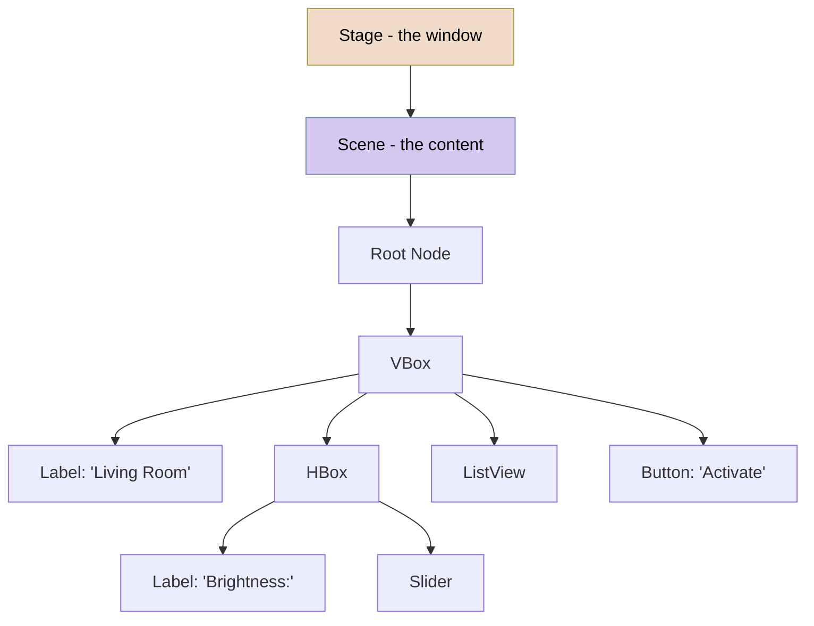
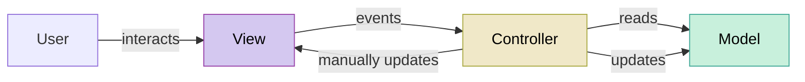
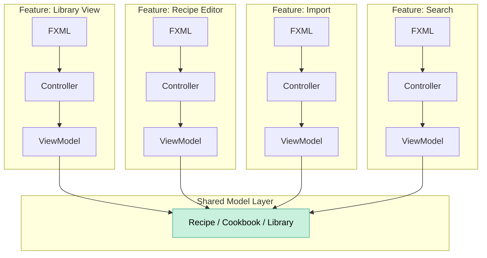

import RevealJS, { Slide } from '@site/src/components/RevealJS';
import Img from '@site/src/components/Img';
import PollSlide from '@site/src/components/PollSlide';

<RevealJS transition="slide">

{/* ============================================ */}
{/* COVER IMAGE */}
{/* ============================================ */}

<Slide>
  

<aside className="notes">
**Lecture overview:**
- **Total time:** ~55 minutes
- **Prerequisites:** L6/L7 (Information hiding, design for change), L28 (Accessibility)
- **Connects to:** GA1 (Core Features), L30 (MVVM and TestFX)

**Structure (~23 slides):**
- Arc 1: From CLI to GUI (~10 min) — event-driven programming, event loop, Java GUI history
- Arc 2: MVC (~15 min) — separation of concerns applied to UIs, Model/View/Controller with code
- Arc 3: Building It (~15 min) — JavaFX components, layout, live coding, properties, CSS
- Arc 4: Accessibility from the Start (~8 min) — accessible text, keyboard nav, focus management
- Arc 5: What's Next (~5 min) — MVVM preview, GA1 architecture, takeaways

**Running example:** SceneItAll device dashboard — the IoT/smarthome control app from L2, L13, and Lab 11. We build a panel that shows devices in a room and lets you control them. By slide 14, students have a complete working app.

> **Transition:** Let's start with the learning objectives...
</aside>

</Slide>

{/* ============================================ */}
{/* TITLE SLIDE */}
{/* ============================================ */}

<Slide>

# CS 3100: Program Design and Implementation II

## Lecture 29: GUIs in Java

<p style={{marginTop: '2em', fontSize: '0.8em', color: '#666'}}>
  &copy;2026 Jonathan Bell & Ellen Spertus, CC-BY-SA
</p>

<aside className="notes">
**Context from previous lectures:**
- L6/L7: Information hiding, coupling, cohesion — we'll apply these to UI architecture
- L28: Accessibility — standard components, keyboard navigation, POUR framework
- L2/L13: SceneItAll domain — students already know lights, fans, shades, areas, scenes
- Today: we build our first GUI, using the principles we've learned all semester

> **Transition:** Here's what you'll be able to do after today...
</aside>

</Slide>

{/* ============================================ */}
{/* LEARNING OBJECTIVES */}
{/* ============================================ */}

<Slide>

## Learning Objectives

<p style={{fontSize: '0.85em', textAlign: 'left'}}>
After this lecture, you will be able to:
</p>

<ol style={{fontSize: '0.75em', textAlign: 'left'}}>
  <li>Explain the difference between sequential and event-driven programming</li>
  <li>Apply the Model-View-Controller pattern to separate UI from business logic</li>
  <li>Build a simple JavaFX interface using FXML, controllers, and standard components</li>
  <li>Use JavaFX properties and binding to keep the View synchronized with the Model</li>
  <li>Apply accessibility practices (accessible text, keyboard navigation, focus management) in JavaFX</li>
</ol>

<aside className="notes">
**Time allocation:**
- Objective 1: Event-driven programming (~10 min)
- Objective 2: MVC (~15 min)
- Objectives 3-4: JavaFX components, layout, properties, CSS (~15 min)
- Objective 5: Accessibility in JavaFX (~8 min)

**Connection to GA1:** Students will implement one of four core CookYourBooks features using these exact patterns. We use SceneItAll today so they arrive at GA1 with fresh eyes for their own project.

> **Transition:** Let's start with a fundamental shift in how your code runs...
</aside>

</Slide>

{/* ============================================ */}
{/* ARC 1: FROM CLI TO GUI (~10 min) */}
{/* ============================================ */}

<Slide>

## Your Code Has Been Telling Users What to Do — Now They Tell You

<div style={{display: 'grid', gridTemplateColumns: '1fr 1fr', gap: '1.5em', fontSize: '0.75em'}}>

<div style={{backgroundColor: 'rgba(200,74,74,0.15)', padding: '0.8em', borderRadius: '8px'}}>

**Sequential (CLI) — you're in control**

```java
System.out.println("Enter room name:");
String room = scanner.nextLine(); // blocks here
System.out.println("Enter brightness (0-100):");
int brightness = scanner.nextInt(); // blocks here
light.setBrightness(brightness);
System.out.println("Set to " + brightness + "%");
```

Your code decides the order. The user waits for you.

</div>

<div style={{backgroundColor: 'rgba(74,153,74,0.15)', padding: '0.8em', borderRadius: '8px'}}>

**Event-driven (GUI) — the user is in control**

```java
brightnessSlider.setOnMouseReleased(e -> {
    // runs when user releases the slider
});
sceneButton.setOnAction(e -> {
    // runs when user clicks "Activate Scene"
});
// code continues immediately
// doesn't wait for any interaction
```

The user decides the order. Your code waits for them.

</div>

</div>

<p style={{fontSize: '0.85em', marginTop: '0.8em', fontWeight: 'bold', color: '#9370DB'}}>
This is called <strong>inversion of control</strong>. You don't call the framework — the framework calls you.
</p>

<aside className="notes">
**This is the single biggest mental model shift in the lecture.** Students have written sequential code for their entire programming education. Now the user — not their code — decides what happens next.

**Analogy:** CLI is like a phone tree ("Press 1 for lights, press 2 for shades"). GUI is like a smart home dashboard — the user can tap any device, in any order, at any time.

**Connection to prior concepts:** Students have already used callbacks — in `list.forEach(item -> ...)`, in `list.sort((a, b) -> ...)`, in JUnit's `@Test` methods. GUI callbacks are the same pattern, just with user events instead of list elements.

> **Transition:** How does the framework know when to call your code?
</aside>

</Slide>

<Slide>

## The Event Loop: Your Code Is a Guest in Someone Else's House

<p style={{fontSize: '0.85em'}}>
Every GUI framework has an event loop at its core:
</p>

```java
// Pseudocode - what the framework does
while (applicationIsRunning) {
    Event event = waitForNextEvent();     // block until click, keypress, timer...
    EventHandler handler = findHandler(event); // look up your registered callback
    handler.handle(event);                // call YOUR code
}
```

<div style={{fontSize: '0.8em', marginTop: '0.5em'}}>

**What this means for you:**
- Your code runs *inside* the framework's loop — you are a guest
- If your handler takes too long, the entire UI freezes (no events can be processed)
- In JavaFX, this loop runs on the **JavaFX Application Thread** — all UI updates must happen here

</div>

<aside className="notes">
**"Your code is a guest"** is the key metaphor. Students need to understand that they don't own the `main()` function anymore. The framework does.

**Freezing demo idea:** If you have time, show a button handler with `Thread.sleep(5000)` — the entire UI becomes unresponsive for 5 seconds. This viscerally demonstrates why long-running handlers are a problem. (We'll solve this properly in L31-32 with concurrency.)

**SceneItAll connection:** "Imagine a user dims the living room lights and then immediately tries to close the shades. If your light-dimming handler takes 5 seconds to talk to the physical device, the shade button is frozen. The user thinks the app crashed."

> **Transition:** Java has gone through three generations of GUI toolkits. Let's see the evolution...
</aside>

</Slide>

<Slide>

## Java's Three GUI Toolkits Tell the Story of UI Evolution

<div style={{fontSize: '0.75em'}}>

| | **AWT (1995)** | **Swing (1997)** | **JavaFX (2008/2014)** |
|---|---|---|---|
| **Approach** | Wraps native OS widgets | Draws its own widgets in Java | Scene graph + CSS + FXML |
| **Consistency** | Looks different on each OS | Identical everywhere | Styleable, consistent |
| **Code** | `Button b = new Button("Go");` | `JButton b = new JButton("Go");` | `Button b = new Button("Go");` |
| **Strength** | Native look and feel | Cross-platform consistency | Modern architecture |
| **Weakness** | Lowest common denominator | Looks dated, no CSS/FXML | Unbundled from JDK since Java 11 |

</div>

<p style={{fontSize: '0.85em', marginTop: '0.8em'}}>
We'll use <strong>JavaFX</strong> because its architecture — scene graphs, declarative UI, CSS styling, property binding — reflects patterns used in modern frameworks (React, SwiftUI, Flutter).
</p>

<aside className="notes">
**Don't dwell here — this is context, not content.** 2-3 minutes max. The point is: JavaFX isn't arbitrary. Its patterns transfer to whatever UI framework students use next.

**AWT's problem:** A button was 80px on Windows, 95px on Mac. Layouts broke across platforms. Only features available on *all* platforms could be used.

**Swing's legacy:** Still widely used in IDEs (IntelliJ is partly Swing), enterprise tools, and legacy apps. Students may encounter it in industry.

**JavaFX's status:** Unbundled from the JDK in Java 11 into OpenJFX. Still actively developed by the community. For learning GUI concepts, it's excellent.

> **Transition:** Now let's talk about how to organize GUI code so it doesn't become an unmaintainable mess...
</aside>

</Slide>

<Slide>

## Poll: Have you ever created a Java GUI?

<PollSlide username='espertus'
  choices={["I've used Swing", "I've used JavaFX", "I've used a different Java framework", "I don't know which Java framework I used", "I've modified Java GUIs", "No", "I created all the code myself", "I used Scene Builder", "I used AI"]}
/>

<div style={{ fontSize: '.8em' }}>
Choose all that apply.
</div>
<aside className="notes">
- Multiple answer
</aside>
</Slide>

{/* ============================================ */}
{/* JAVAFX API CONCEPTS */}
{/* ============================================ */}


{/* This slide uses overlays in a brittle manner but looks good in light presentation mode.*/}

<Slide>

## The JavaFX API: Stage, Scene, and Scene Graph

<div style={{display: 'flex', gap: '2.5rem', alignItems: 'flex-start', marginTop: '1rem'}}>

<div style={{flex: '0 0 52%', position: 'relative'}}>


<div className="fragment fade-out diagram-overlay" data-fragment-index="1" style={{position: 'absolute', top: '59px', left: 0, width: '100%', height: '100%', background: '#ffffff'}} />
<div className="fragment fade-out diagram-overlay" data-fragment-index="2" style={{position: 'absolute', top: '156px', left: 0, width: '100%', height: '100%', background: '#ffffff'}} />

</div>

<div style={{flex: 1, fontSize: '0.6em', display: 'flex', flexDirection: 'column', gap: '0.6rem', paddingTop: '0rem'}}>

<div className="fragment visible" data-fragment-index="0">

**Stage** is the OS-managed application window — title bar, minimize, maximize, close.

</div>
<div className="fragment" data-fragment-index="1">

**Scene** is the content inside the window. A Stage holds one active Scene at a time. You can swap Scenes at runtime — like a browser tab loading a different page.

</div>

<div className="fragment" data-fragment-index="2">

The **Scene Graph** is a tree of *nodes* — every widget and layout container is a node. You build the tree; the framework walks it to render, handle focus, and dispatch events.

</div>

</div>
</div>

<div className="fragment" data-fragment-index="3" style={{fontSize: '0.6em'}}>

**Leaf nodes** are widgets (Labels, Buttons, Sliders). **Container nodes** (VBox, HBox) control layout. *Analogy:* FXML is to JavaFX what HTML is to the browser.

</div>

<aside className="notes">
**The scene graph is the key concept** — a GUI is a tree of objects, not a canvas you paint on.

**Transition:** Let's see this in code...
</aside>

</Slide>

<Slide>

## Your First JavaFX Application

<div style={{display: 'flex', gap: '2rem', alignItems: 'flex-start'}}>

<div style={{flex: 1, fontSize: '.7em'}}>

```java
public class SceneItAllApp extends Application {

    @Override
    public void start(Stage stage) {
        // Build the scene graph — a tree of nodes
        Label title = new Label("Living Room");
        title.setStyle("-fx-font-size: 20px; -fx-font-weight: bold;");

        Slider brightness = new Slider(0, 100, 70);
        Button activate = new Button("Activate Scene");
        activate.setOnAction(e -> System.out.println("Scene activated!"));

        ListView<String> devices = new ListView<>();
        devices.getItems().addAll("Ceiling Light: 70%", "Shades: Open", "Fan: Speed 2");

        VBox root = new VBox(10, title, brightness, devices, activate);

        // Wrap the tree in a Scene, put the Scene in a Stage
        Scene scene = new Scene(root, 400, 300);
        stage.setTitle("SceneItAll");
        stage.setScene(scene);
        stage.show();
    }

    public static void main(String[] args) { launch(args); }
}
```

</div>

<div style={{flex: '0 0 40%'}}>


</div>
</div>

<div style={{ fontSize: '.8em' }}>
This works — but all the UI construction, event handling, and data are declared programmatically in one method. That won't scale.


https://github.com/cs3100-spertus-s26/javafx-examples/blob/slide9/app/src/main/java/org/example/demo/SceneItAllApp.java
</div>

<aside className="notes">
**This is the "everything in one place" starting point.** Students see a complete, runnable JavaFX app in 20 lines. The `start()` method builds the tree, wires an event, and shows the window.

**Key API concepts to point out:**
- `Application` is the base class — JavaFX calls `start()` for you (inversion of control!)
- `Stage` is the window, `Scene` is the content, `VBox` is a layout container
- `new Button("Activate Scene")` creates a node; `setOnAction()` registers a callback
- `VBox(10, title, brightness, devices, activate)` — 10px spacing, children in order

**The problem:** Everything is in `start()`. UI construction, event handling, styling, data. As the app grows, this method grows. We need to separate concerns.

**Don't skip this slide.** Students need to see the raw API before FXML abstracts it away. FXML is just a different way to build the same tree — XML instead of Java constructor calls.

> **Transition:** This works for 20 lines. But real apps have thousands of nodes and dozens of event handlers. We need a way to organize this code...
</aside>

</Slide>

<Slide>

## FXML: Building the Same Tree Declaratively

<div style={{display: 'grid', gridTemplateColumns: '1fr 1fr', gap: '1em', fontSize: '0.7em'}}>

<div style={{backgroundColor: 'rgba(200,74,74,0.15)', padding: '0.8em', borderRadius: '8px'}}>

**Java (imperative)**

```java
Label title = new Label("Living Room");
title.setStyle("-fx-font-size: 20px;");

Slider brightness = new Slider(0, 100, 70);

ListView<String> devices = new ListView<>();

Button activate = new Button("Activate");
activate.setOnAction(e -> { ... });

VBox root = new VBox(10,
    title, brightness, devices, activate);
```

Build the tree with constructor calls. Mix structure with behavior.

</div>

<div style={{backgroundColor: 'rgba(74,153,74,0.15)', padding: '0.8em', borderRadius: '8px'}}>

**FXML (declarative)**

```xml
<VBox spacing="10">
    <Label text="Living Room"
           style="-fx-font-size: 20px;"/>

    <Slider min="0" max="100" value="70"/>

    <ListView fx:id="deviceList"/>

    <Button text="Activate"
            onAction="#handleActivate"/>
</VBox>
```

Declare what exists. Behavior lives elsewhere (Controller).

https://github.com/cs3100-spertus-s26/javafx-examples/blob/slide10/app/src/main/resources/sceneitall/areadashboard.fxml

</div>

</div>

<p style={{fontSize: '0.8em', marginTop: '0.5em', color: '#9370DB'}}>
Same scene graph tree. Different way to define it. FXML separates <strong>structure</strong> (what exists) from <strong>behavior</strong> (what happens).
</p>

<aside className="notes">
**The key insight:** Both approaches build the exact same tree of objects. FXML is not a different technology — it's a different notation for the same thing. The JavaFX runtime reads the FXML and calls the same constructors and setters you'd call in Java.

**Why FXML wins for larger apps:**
1. Structure is easier to read as XML than as nested constructor calls
2. Behavior is separated into a Controller class
3. Visual tools (Scene Builder) can generate and edit FXML
4. Designers can work on FXML while developers work on Controllers

**`fx:id` and `onAction`:** These are the bridge between FXML and Java. `fx:id="deviceList"` means "make this node available to the Controller as a field." `onAction="#handleActivate"` means "when this button is clicked, call the Controller's `handleActivate()` method."

> **Transition:** Now that we know what the API gives us, let's talk about how to organize our code around it...
</aside>

</Slide>

<Slide>
## Poll: Which of these are part of the model?

<PollSlide username='espertus'
  choices={["the list of devices", "the names of the devices", "the brightness of the ceiling light", "the slider", "the text on the button"]}
/>

<aside className="notes">
- multiple answers
- all but the last two are part of the model
- the view also has access to them
- they are made visible through the view
</aside>

</Slide>

{/* ============================================ */}
{/* ARC 2: MVC (~15 min) */}
{/* ============================================ */}

<Slide>

## MVC Is Hexagonal Architecture for User Interfaces

<p style={{fontSize: '0.85em'}}>
In <a href="/lecture-notes/l16-testing2">L16</a> we learned to separate domain logic from infrastructure so code is testable. MVC applies that principle to GUIs:
</p>



<p style={{fontSize: '0.8em', color: '#9370DB'}}>
The Model is cleanly domain-side — no UI imports, fully testable. But the Controller does <em>everything else</em>: it reads from the Model, makes decisions, AND manually pushes updates to View widgets. It straddles the hexagonal boundary. We'll fix this in L30.
</p>

<div style={{display: 'grid', gridTemplateColumns: '1fr 1fr 1fr', gap: '1em', fontSize: '0.75em', marginTop: '0.5em'}}>

<div style={{backgroundColor: 'rgba(74,153,153,0.15)', padding: '0.6em', borderRadius: '8px'}}>

**Model**

Data + business logic. Knows nothing about the UI.

</div>

<div style={{backgroundColor: 'rgba(148,74,170,0.15)', padding: '0.6em', borderRadius: '8px'}}>

**View**

What the user sees. Widgets, layout, styling. No business logic.

</div>

<div style={{backgroundColor: 'rgba(169,148,74,0.15)', padding: '0.6em', borderRadius: '8px'}}>

**Controller**

Translates user actions into model updates. The thin middleman.

</div>

</div>

<aside className="notes">
**Frame through hexagonal architecture:** "In L16 we drew a hexagon with domain code in the middle and infrastructure on the outside. MVC is that same picture for GUIs. The Model is your domain core — pure business logic, no UI imports. The View is infrastructure — JavaFX widgets, FXML, rendering."

**But flag the leak:** "The Controller is supposed to be the port between them. But look at what it imports — `@FXML` widgets, JavaFX types. It straddles the boundary. It has domain-level decisions (what to do when the user clicks) mixed with infrastructure dependencies (which widget to update). That's a leaky hexagonal boundary. MVC gets you 80% of the way; in L30 we'll fix the last 20%."

**SceneItAll example:** The Model knows about lights, fans, and scenes. The View knows about sliders, buttons, and labels. The Model doesn't know sliders exist. The View doesn't know how dimming works. The Controller translates "slider moved to 75" into "set brightness to 75%."

**Why this matters for testing:** "In L16 we said: domain code is easy to test, infrastructure code is hard to test. The Model is domain code — you can unit test `light.setBrightness(150)` without any UI. That's the payoff of separation. The Controller? Not so easy — and we'll see why at the end of this lecture."

> **Transition:** Let's see what happens when you don't separate these concerns...
</aside>

</Slide>

<Slide>

## What Goes Wrong Without MVC

<p style={{fontSize: '0.85em'}}>
This is what code looks like when UI and business logic are tangled together:
</p>

```java
// Everything in one place — the "Big Ball of Mud"
dimButton.setOnAction(event -> {
    // Assume there is a single brightness text field that sets
    // the brightness of all lights.
    int brightness = Integer.parseInt(brightnessField.getText());
    // Business logic mixed into the click handler
    if (brightness < 0) brightness = 0;
    if (brightness > 100) brightness = 100;
    for (SmartDevice device : deviceList) {
        if (device instanceof Light) {
            // Network call in the UI handler
            zigbeeController.sendCommand(device.getId(), "brightness", brightness);
        }
    }
    // Logging in the UI handler
    auditLog.record("Brightness set to " + brightness + " by " + currentUser);
});
```

<p style={{fontSize: '0.8em', marginTop: '0.5em', color: '#9370DB'}}>
How do you unit test the brightness validation logic? You can't — it's trapped inside a button click handler.
</p>

<aside className="notes">
**Ask students to identify the problems:**
- What happens when you want to control brightness from a voice command? Rewrite everything.
- What happens when you change from a list to a grid layout? Business logic breaks.
- We shouldn't make network calls from the UI thread.
- How do you test the brightness clamping? You can't — you'd need to simulate a button click.
- How many reasons does this method have to change? At least four (UI, brightness logic, networking, logging).

**Connection to L7:** This is high coupling and low cohesion in action. The click handler has *logical cohesion* at best — things that happen at the same time but for different reasons.

> **Transition:** Let's fix this by separating the Model...
</aside>

</Slide>

<Slide>

## The Model: Business Logic with No UI Dependencies

```java
// Model: Light.java — pure business logic, fully testable
public class Light extends SmartDevice {
    private int brightness;  // 0-100
    private boolean isOn;

    public void setBrightness(int level) {
        this.brightness = Math.clamp(level, 0, 100);
        this.isOn = brightness > 0;
    }

    public void toggle() {
        this.isOn = !this.isOn;
    }

    public int getBrightness() { return brightness; }
    public boolean isOn() { return isOn; }
    public String getStatus() {
        return isOn ? getName() + ": " + brightness + "%" : getName() + ": Off";
    }
}
```

```java
// You can test this right now — no GUI required
@Test
void brightnessClampedToValidRange() {
    Light light = new Light("Desk Lamp");
    light.setBrightness(150);
    assertEquals(100, light.getBrightness());
}

@Test
void settingBrightnessToZeroTurnsOff() {
    Light light = new Light("Desk Lamp");
    light.setBrightness(0);
    assertFalse(light.isOn());
}
```

<aside className="notes">
**Key point:** The Model has *zero* imports from `javafx.*`. It's a plain Java class. You can test it in isolation, use it from a CLI, expose it via a REST API — the Model doesn't care how it's displayed.

**Connection to course arc:** Students have been writing domain model classes all semester (HW1-HW5). Those classes *are* Models in MVC. They've been building the M without knowing it.

> **Transition:** Now let's define what the user sees...
</aside>

</Slide>

<Slide>

## The View: What the User Sees (FXML)

<p style={{fontSize: '0.85em'}}>
JavaFX separates UI structure into FXML — an XML file that declares what widgets exist and how they're arranged:
</p>

```xml
<!-- View: area-dashboard.fxml -->
<?xml version="1.0" encoding="UTF-8"?>
<?import javafx.scene.control.*?>
<?import javafx.scene.layout.*?>

<VBox spacing="10" xmlns:fx="http://javafx.com/fxml"
      fx:controller="sceneitall.AreaDashboardController">

    <Label fx:id="areaNameLabel" style="-fx-font-size: 18px;"/>

    <HBox spacing="5" alignment="CENTER_LEFT">
        <Label text="Brightness:"/>
        <Slider fx:id="brightnessSlider" min="0" max="100"/>
        <Label fx:id="brightnessValueLabel" text="50%"/>
    </HBox>

    <ListView fx:id="deviceList"/>

    <Button fx:id="sceneButton" text="Activate Scene"
            onAction="#handleActivateScene"/>
</VBox>
```

<p style={{fontSize: '0.8em', marginTop: '0.3em', color: '#9370DB'}}>
No business logic here. The View defines <strong>what</strong> appears — not <strong>what it means.</strong>
</p>

<aside className="notes">
**Key FXML concepts to point out:**
- `fx:controller` links this FXML to a Java class that handles events
- `fx:id` gives each widget a name the Controller can reference
- `onAction="#handleActivateScene"` wires the button click to a Controller method
- `spacing`, `alignment` — layout properties, not logic

**Scene Builder:** This FXML can be created visually by dragging and dropping in Scene Builder. Show a screenshot if you have one. Students will use Scene Builder for GA1.

**Analogy:** FXML is to JavaFX what HTML is to the web. Structure and layout, not behavior.

> **Transition:** The Controller connects the View to the Model...
</aside>

</Slide>

<Slide>

## How FXML and Java Find Each Other: @FXML Wiring (Image)


<p style={{fontSize: '0.8em', marginTop: '0.3em', color: '#9370DB'}}>
The framework does the wiring — you just make the names match.
</p>

<aside className="notes">
**This is the "how does it work" slide.** Students will be confused by `@FXML` if they think it's just a decorator. Explain the runtime mechanism:

1. When you load an FXML file with `FXMLLoader`, JavaFX reads the `fx:controller` attribute and creates an instance of that class using reflection.
2. For each `fx:id` in the FXML, JavaFX looks for a field in the Controller with the same name and the `@FXML` annotation. It assigns the widget to that field (again via reflection).
3. For each `onAction="#methodName"`, JavaFX looks for a method with that name and `@FXML`, and registers it as the event handler.

**The names must match exactly.** `fx:id="brightnessSlider"` must correspond to a field named `brightnessSlider` (not `slider` or `brightness`). This is a common source of "null pointer" bugs — if the names don't match, the field stays null.

**Why @FXML?** It tells the JavaFX runtime "this field/method should be accessible for injection, even though it's private." Without `@FXML`, JavaFX can't see private members via reflection.

**Common student mistake:** Renaming a field in Java but not updating the `fx:id` in FXML (or vice versa). The app compiles fine but crashes at runtime with a null pointer.

> **Transition:** But before we see the full Controller, let's understand *when* each piece of code runs...
</aside>

</Slide>


<Slide>


## How FXML and Java Find Each Other: @FXML Wiring (Code)

<div style={{display: 'flex', gap: '1.5rem', fontSize: '.8em', alignItems: 'flex-start'}}>

<div style={{flex: 1}}>
```xml
<?xml version="1.0" encoding="UTF-8"?>
<!-- areadashboard.fxml -->

<?import javafx.scene.control.*?>
<?import javafx.scene.layout.*?>

<VBox spacing="10" xmlns:fx="http://javafx.com/fxml"
      fx:controller="sceneitall.AreaDashboardController">

    <Label fx:id="areaNameLabel" style="-fx-font-size: 18px;"/>

    <HBox spacing="5" alignment="CENTER_LEFT">
        <Label text="Brightness:"/>
        <Slider fx:id="brightnessSlider" min="0" max="100"/>
        <Label fx:id="brightnessValueLabel" text="50%"/>
    </HBox>

    <ListView fx:id="deviceList"/>

    <Button fx:id="sceneButton" text="Activate Scene"
            onAction="#handleActivateScene"/>
</VBox>
```

</div>

<div style={{flex: 1}}>
```java
public class AreaDashboardController {

    @FXML
    private Label areaNameLabel;

    @FXML
    private Slider brightnessSlider;

    @FXML
    private ListView<String> deviceList;

    @FXML
    public void handleActivateScene() {
        System.out.println("Scene activated!");
    }

    public void initialize() {
        deviceList.getItems().addAll(
            "Ceiling Light: 70%",
            "Shades: Open",
            "Fan: Speed 2");
    }
}
```

</div>

</div>

<div style={{ fontSize: '.75em' }}>
https://github.com/cs3100-spertus-s26/javafx-examples/blob/slide17/app/src/main/resources/sceneitall/areadashboard.fxml

https://github.com/cs3100-spertus-s26/javafx-examples/blob/slide17/app/src/main/java/sceneitall/AreaDashboardController.java
</div>
<aside className="notes">

</aside>

</Slide>

<Slide>

## The JavaFX Component Lifecycle: What Runs When


<aside className="notes">
**This is the mental model students need.** The most common bug in GA1 will be trying to use `@FXML` fields in the constructor — they're null until step 3.

**Walk through each step:**

1. **`start(Stage stage)`** — JavaFX calls this for you (inversion of control). You create the stage, load FXML, and show the window. This is the only code you write in `Application`.

2. **`FXMLLoader.load()`** — reads the XML, calls constructors for every widget. The `VBox`, `Label`, `Slider`, `Button` — all created here. The Controller class is also instantiated here (via `fx:controller`).

3. **`@FXML` injection** — the loader looks at each `fx:id` in the FXML, finds the matching `@FXML` field in the Controller, and assigns the widget to that field. Before this step, all `@FXML` fields are `null`.

4. **`initialize()`** — called automatically *after* injection completes. This is the safe place to set up listeners, bind properties, and configure widgets that depend on other widgets. The constructor runs *before* injection, so `@FXML` fields are null there.

5. **Event handlers** — once setup is done, the event loop takes over. Your `setOnAction`, `addListener`, and `onAction="#method"` callbacks fire whenever the user interacts. This phase runs indefinitely until the window closes.

**The warning is critical:** Every semester, students write code like `areaNameLabel.setText("Hello")` in the constructor and get a `NullPointerException`. The label doesn't exist yet — it won't be injected until step 3. Use `initialize()` instead.

> **Transition:** Now let's see the full Controller with this lifecycle in mind...
</aside>

</Slide>

<Slide>

## The Controller: The Translator Between User Actions and Business Logic

<div style={{ marginTop: '-1em', marginBottom: '-1.5em', fontSize: '.6em' }}>
```java
public class AreaDashboardController {
    @FXML private Label areaNameLabel;
    @FXML private Slider brightnessSlider;
    @FXML private Label brightnessValueLabel;
    @FXML private ListView<String> deviceList;
    private Area model;  // the Controller creates and depends on the Model

    @FXML
    private void initialize() {
        Area livingRoom = new Area("Living Room", List.of(new Light("Ceiling Light", 50), new Shades("Shades",true), new Fan("Fan", 2)));
        setModel(livingRoom);

        // Update label as slider moves
        brightnessSlider.valueProperty().addListener((obs, oldVal, newVal) -> {
            brightnessValueLabel.setText(newVal.intValue() + "%");
            model.setAllLightsBrightness(newVal.intValue()); // delegate to Model
            updateDeviceList();
        });
    }

    public void setModel(Area model) {
        this.model = model;
        areaNameLabel.setText(model.getName());
        updateDeviceList();
    }

    @FXML
    private void handleActivateScene() {
        model.activateScene("Evening");  // delegate to Model
        updateDeviceList();
    }

    private void updateDeviceList() {
        deviceList.getItems().setAll( model.getDevices().stream().map(SmartDevice::getStatus).toList());
    }
}
```

</div>
<div style={{ fontSize: '.6em' }}>
https://github.com/cs3100-spertus-s26/javafx-examples/blob/slide19/app/src/main/java/sceneitall/AreaDashboardController.java
</div>

<aside className="notes">
**The Controller is thin.** It does three things:
1. Receives events from the View (slider change, button click)
2. Delegates to the Model (`model.setAllLightsBrightness()`, `model.activateScene()`)
3. Updates the View (`updateDeviceList()`)

**`@FXML` annotation:** This is how JavaFX connects the FXML file to the Java class. When the FXML is loaded, JavaFX finds the fields and methods with `@FXML` and wires them to the widgets with matching `fx:id` values.

**`initialize()` method:** Called automatically by JavaFX after the FXML is loaded and all `@FXML` fields are injected. This is where you set up listeners that aren't simple one-line handlers.

**Compare to the anti-pattern:** The handleActivateScene method is 2 lines. The tangled version was 10+ lines with networking and logging. That's the power of separation.

> **Transition:** Let's trace a complete user interaction through all three layers...
</aside>

</Slide>

<Slide>

## Adding Scene Selection

<div style={{display: 'flex', gap: '1.5rem', fontSize: '.8em', alignItems: 'flex-start'}}>
<div style={{flex: 1}}>


</div>

<div style={{flex: 1, fontSize: '.6em'}}>
```xml
<!-- areadashboard.fxml -->

<VBox spacing="10" xmlns:fx="http://javafx.com/fxml"
      fx:controller="sceneitall.AreaDashboardController">

    <Label fx:id="areaNameLabel" style="-fx-font-size: 18px;"/>

    <HBox spacing="5" alignment="CENTER_LEFT">
        <Label text="Brightness:"/>
        <Slider fx:id="brightnessSlider" min="0" max="100" value="50"/>
        <Label fx:id="brightnessValueLabel" text="50%"/>
    </HBox>

    <ListView fx:id="deviceList"/>

    <HBox spacing="10" alignment="CENTER_LEFT">
        <ComboBox fx:id="sceneSelector" promptText="Choose scene..."/>
        <Button fx:id="sceneButton" text="Activate Scene"
            onAction="#handleActivateScene"/>
    </HBox>
</VBox>
```

</div>

</div>
<div style={{ fontSize: '.6em' }}>
https://github.com/cs3100-spertus-s26/javafx-examples/blob/slide20/app/src/main/resources/sceneitall/areadashboard.fxml
</div>

<aside className="notes">

</aside>

</Slide>

<Slide>

## Following a Click Through All Three Layers

<p style={{fontSize: '0.85em', marginTop: '-1em' }}>
User clicks "Activate Scene" for the "Evening" scene. Trace the code:
</p>

<div style={{fontSize: '0.75em', marginTop: '-1em', marginBottom: '-1.5em' }}>

```java
// 1. VIEW (FXML) — button wired to Controller method
<Button text="Activate" onAction="#handleActivateScene"/>

// 2. CONTROLLER — receives the event, delegates to Model
@FXML private void handleActivateScene() {
    String scene = sceneSelector.getValue();    // read from View
    model.activateScene(scene);                 // delegate to Model
    updateDeviceList();                         // refresh the View
}

// 3. MODEL — pure business logic, no UI
public void activateScene(String name) {
    Scene scene = scenes.get(name);             // "Evening" → dim to 30%, close shades
    for (SmartDevice device : devices) {
        scene.applyTo(device);                  // sets brightness, shade position, fan state
    }
}

// 4. Back in CONTROLLER — View shows updated state
private void updateDeviceList() {
    deviceList.getItems().setAll(                // "Ceiling Light: 30%", "Shades: 80%", "Fan: Off"
        model.getDevices().stream().map(SmartDevice::getStatus).toList());
}
```

</div>

<div style={{fontSize: '0.8em', marginTop: '0.3em', color: '#9370DB'}}>
The Model never imports <code>javafx</code>. The View never calls <code>activateScene()</code>. Each layer does one job.

https://github.com/cs3100-spertus-s26/javafx-examples/tree/slide20/app/src/main
</div>

<aside className="notes">
**Walk through each numbered section.** This is real code students can trace — not a diagram.

**Ask:** "Which sections could run without a GUI at all?" Answer: section 3. You could call `activateScene("Evening")` from a unit test, a CLI, or a REST endpoint. That's the point of MVC.

**Ask:** "Which section is the one we'd like to eliminate?" Answer: section 4 — the manual refresh. Every time you change the model, you have to remember to call `updateDeviceList()`. That's the problem MVVM will solve in L30.
> **Transition:** Let's check your understanding before we start building...
</aside>

</Slide>

{/* ============================================ */}
{/* COMPREHENSION CHECK */}
{/* ============================================ */}

<Slide>

## Poll: What if a handler is slow?

<div style={{ fontSize: '.7em' }}>
A user clicks 'Activate Scene' and then immediately drags the brightness slider.
 The `handleActivateScene()` handler takes 3 seconds to run. What happens to the slider drag?
</div>

<PollSlide
  username="espertus"
  choices={[
    "The slider moves smoothly — the framework handles both events in parallel",
    "The slider drag is queued and processed after handleActivateScene() finishes",
    "The slider drag is silently dropped — the event is lost",
    "The app throws a ConcurrentModificationException",
  ]}/>

<aside className="notes">
The event loop is single-threaded. While `handleActivateScene()` is running, no other events can be processed — the slider drag is queued. The UI appears frozen for 3 seconds. This is why long-running handlers are a problem (and why we'll cover concurrency in L31-32). B and C are both plausible — discuss why it's B: the OS buffers input events in a queue. The event loop isn't ignoring them — it's busy and can't drain the queue yet. Once the handler returns, queued events are processed (the slider may "jump" to the final position). Intermediate move events may get coalesced, but the user's final intent is preserved.
</aside>

</Slide>

<Slide>
## Poll: Where should code to turn out all lights live?

<div style={{ fontSize: '.7em' }}>
You need to add a 'turn off all lights' feature. Which MVC component should contain the logic for iterating through devices and setting brightness to 0?
</div>

<PollSlide
  username="espertus"
  choices={[
    "The View (FXML file)",
    "The Controller",
    "The Model",
    "The CSS stylesheet",
  ]}
  />

<aside className="notes">
The Model contains all business logic. The Controller would call `model.turnOffAllLights()`, and the View would have a button wired to the Controller — but the logic itself (iterating devices, setting brightness) belongs in the Model where it's testable without the UI.
</aside>

</Slide>

<Slide>
## Poll: Controller construction

<div style={{ fontSize: '.7em' }}>
Given a DashboardController where the constructor and `initialize()` both call `areaNameLabel.setText('Living Room')`, what happens when the FXML is loaded?

<div style={{display: 'grid', gridTemplateColumns: '2fr 1fr', gap: '1.5em', alignItems: 'start'}}>

<div>
```java
public class DashboardController {

    @FXML
    private Label areaNameLabel;

    public DashboardController() {
        areaNameLabel.setText("Living Room"); 
    }

    @FXML
    private void initialize() {
        areaNameLabel.setText("Living Room");
    }
}
```

</div>

<div style={{textAlign: 'center'}}>
  
  <p style={{fontSize: '0.9em', marginTop: '0.5em'}}>
    Text <strong>espertus</strong> to 22333 if the<br />URL isn't working for you.
  </p>
</div>

</div>

<ol>
  <li>The constructor sets the text; initialize() overwrites it with the same value</li>
  <li>The constructor crashes with a NullPointerException; initialize() would have worked</li>
  <li>Both fail — you can only set text from FXML, not from Java</li>
  <li>The constructor works; initialize() is never called because the text is already set</li>
</ol>

</div>

<aside className="notes">
JavaFX creates the Controller (constructor runs) *before* injecting @FXML fields. In the constructor, `areaNameLabel` is still null → NPE. The `initialize()` method runs *after* injection, so the field is populated. This is the #1 lifecycle bug — use `initialize()`, not the constructor, for anything that touches @FXML fields.
</aside>

</Slide>

<Slide>
## Poll: Unit testing

<div style={{ fontSize: '.7em' }}>
You want to write a unit test that verifies that
* if the user selects the 'Evening' scene
* then the device list will show 'Ceiling light: 30%'

How does this work with our MVC architecture?
</div>
<PollSlide
  username="espertus"
  choices={[
    "The Model doesn't have an activateScene method — you'd need to add one",
    "The Controller's handleActivateScene() depends on @FXML widgets, so you can't call it without starting the full JavaFX runtime",
    "Unit tests can't verify String values in lists — you'd need an E2E test",
    "There's no problem — you can test the Controller the same way you test any Java class",
  ]}
/>
<aside className="notes">

*Discussion:* B is the key insight that motivates the entire next lecture (L30). The Controller contains the logic we want to test, but it also depends on Slider, Label, ListView, ComboBox — all of which need the JavaFX runtime to instantiate. You can't just `new AreaDashboardController()` and call methods on it. D is what students *want* to be true — and it's exactly what MVVM will make true by extracting the logic into a ViewModel with no widget dependencies. "What if there was a class that had the Controller's logic but none of its widget dependencies? That's next lecture."
</aside>
</Slide>

{/* ============================================ */}
{/* ARC 3: BUILDING IT (~15 min) */}
{/* ============================================ */}

<Slide>

## JavaFX Components Are the Standard Components from L28

<p style={{fontSize: '0.85em'}}>
Remember from <a href="/lecture-notes/l28-accessibility">L28</a>: standard components get accessibility for free. These are the real buttons, not the fakes:
</p>

<div style={{fontSize: '0.75em'}}>

| Component | What it does | SceneItAll use case | Accessibility |
|-----------|-------------|---------------------|---------------|
| `Button` | Clickable action | "Activate Scene" | Screen reader: *"Activate Scene, button"* |
| `Label` | Display-only text | "Living Room" | Screen reader reads the text |
| `Slider` | Continuous value | Brightness control | Arrow keys adjust, announced as *"Brightness, slider, 75%"* |
| `ComboBox` | Dropdown selection | Choose a scene | Arrow keys navigate options |
| `ListView` | Scrollable list | Device list | Arrow keys navigate, Enter selects |
| `CheckBox` | Toggle on/off | Device power | Space to toggle |
| `TextField` | Text input | Rename a device | Screen reader: *"Device name, text field"* |
| `Spinner` | Numeric up/down | Fan speed (1-4) | Arrow keys increment/decrement |

</div>

<p style={{fontSize: '0.8em', marginTop: '0.3em', color: '#9370DB'}}>
All of these support Tab navigation, Enter/Space activation, and screen reader announcements — automatically.
</p>

<aside className="notes">
**Connection to L28:** "Remember the side-by-side? A real button announces itself to a screen reader. A fake button is invisible. These are the real buttons."

**Practical tip:** If students find themselves styling a `Label` to look like a button and adding a click handler, they should use a `Button` instead. Always use the component that semantically matches what the user is doing.

> **Transition:** Components need to be arranged on screen. That's what layout containers do...
</aside>

</Slide>

<Slide>

## Layout Containers: How Components Arrange Themselves


<aside className="notes">
**Nesting is the key insight:** You combine these. A `BorderPane` with a `TreeView` of areas on the left and an area dashboard `VBox` in the center containing `HBox` rows for each device control. Students will figure this out quickly once they see the pattern.

**Scene Builder makes this visual:** Drag a VBox, drop an HBox inside it, drop a Slider inside that. The FXML writes itself.

**Tab order follows document order:** The order components appear in FXML is the order Tab visits them. This is why layout structure matters for accessibility.

> **Transition:** Let's put this together and build our area dashboard...
</aside>

</Slide>

<Slide>
## Can We Make it Look Better?

<div style={{display: 'flex', gap: '1.5rem', alignItems: 'flex-start'}}>


<div className='fragment'>


</div>
</div>

</Slide>

<Slide>
## Styling with CSS

<div style={{display: 'flex', gap: '0rem', alignItems: 'flex-start'}}>

<div style={{flex: 1}}>
```css
/* styles.css */

.root {
    -fx-font-family: "Inter", sans-serif;
    -fx-base: #1a1a2e;
    -fx-accent: #0f3460;
    -fx-padding: 16px;
}

.button {
    -fx-background-color: #0f3460;
    -fx-text-fill: white;
    -fx-padding: 8px 16px;
    -fx-cursor: hand;
}
.button:hover {
    -fx-background-color: #16213e;
}

```

</div>

<div style={{flex: 1}}>
```css
.combo-box,
.combo-box .arrow-button,
.combo-box .list-cell {
    -fx-background-color: #0f3460;
    -fx-text-fill: white;
}
.combo-box .arrow { -fx-background-color: white; }
.combo-box:focused {
    -fx-border-color: #888;
    -fx-border-width: 1px;
    -fx-border-radius: 3px;
}

.list-cell { -fx-text-fill: white; -fx-background-color: transparent; }
.list-cell:selected { -fx-background-color: #e94560; }

.slider .track { -fx-background-color: #666; }
.slider .thumb { -fx-background-color: #e94560; }

```

</div>

</div>

```xml
<!-- Link the stylesheet in FXML -->
<VBox stylesheets="@styles.css">
```

<div style={{ fontSize: '.7em' }}>
https://github.com/cs3100-spertus-s26/javafx-examples/tree/slide29/app/src/main/resources/sceneitall
</div>

<aside className="notes">
**Keep this brief — 2 minutes.** Students will learn CSS by doing in GA1. The point here is: styling is separate from structure and behavior. That's the third separation (after Model from View and View from Controller).

**Dark theme for SceneItAll** makes sense — smart home dashboards often use dark themes for ambient use. This also shows students that CSS can dramatically change the look without touching any Java code.

**Key JavaFX CSS differences from web CSS:**
- Properties are prefixed with `-fx-` (e.g., `-fx-background-color` not `background-color`)
- Selectors use JavaFX class names (`.button` not `button`)
- No flexbox/grid — layout is done with containers, not CSS

> **Transition:** Now let's connect this to what we learned about accessibility in L28...
</aside>

</Slide>

<Slide>

## Properties and Binding: When the Model Changes, the View Updates Automatically

<p style={{fontSize: '0.85em'}}>
JavaFX <strong>properties</strong> are observable values. When they change, anything bound to them updates automatically:
</p>

```java
// Model with JavaFX properties
public class Light extends SmartDevice {
    private final IntegerProperty brightness = new SimpleIntegerProperty();
    private final BooleanProperty on = new SimpleBooleanProperty();
    private final StringProperty status = new SimpleStringProperty();

    public IntegerProperty brightnessProperty() { return brightness; }
    public BooleanProperty onProperty() { return on; }
    public StringProperty statusProperty() { return status; }

    public void setBrightness(int level) {
        brightness.set(Math.clamp(level, 0, 100));
        on.set(brightness.get() > 0);
        status.set(on.get() ? getName() + ": " + brightness.get() + "%" : getName() + ": Off");
    }
}
```

```java
// Controller: bind once, never manually refresh
brightnessSlider.valueProperty().bindBidirectional(light.brightnessProperty());
brightnessValueLabel.textProperty().bind(
    light.brightnessProperty().asString("%d%%")
);
// When light.setBrightness(30) is called anywhere, the slider and label update automatically.
```

<p style={{fontSize: '0.8em', marginTop: '0.3em', color: '#9370DB'}}>
Bind once. Never call <code>updateUI()</code> again. The View and Model stay in sync automatically.
</p>

<aside className="notes">
**This is the "magic" moment.** Students will find this powerful once they see it work.

**Explain the pattern:**
- `SimpleIntegerProperty` wraps an int and fires change events when it's modified
- `bind()` is one-way: Label always shows whatever the property contains
- `bindBidirectional()` is two-way: moving the slider changes the model AND vice versa

**SceneItAll payoff:** When the user activates the "Evening" scene, the model sets brightness to 30%. The slider *physically moves* to 30% without the Controller telling it to. That's binding.

**When to use properties vs. plain fields:**
- Use properties for data that the UI displays or edits
- Use plain fields for internal state the UI doesn't need to see
- In L30 (MVVM), we'll formalize this with ViewModel classes

> **Transition:** Let's make it look good...
</aside>

</Slide>


{/* ============================================ */}
{/* ARC 4: ACCESSIBILITY FROM THE START (~8 min) */}
{/* ============================================ */}

<Slide>

## Every Widget Needs a Name: Accessible Text in JavaFX

<p style={{fontSize: '0.85em'}}>
From <a href="/lecture-notes/l28-accessibility">L28</a>: if a screen reader can't announce it, it doesn't exist. In JavaFX:
</p>

```xml
<!-- Accessible: screen reader says "Living room brightness, slider, 75 percent" -->
<Slider fx:id="brightnessSlider" min="0" max="100"
        accessibleText="Living room brightness"
        accessibleHelp="Use arrow keys to adjust brightness from 0 to 100 percent"/>

<!-- Accessible: screen reader says "Activate scene, button" -->
<Button text="Activate Scene" onAction="#handleActivateScene"/>

<!-- NOT accessible: screen reader says "button" (no label!) -->
<Button onAction="#handleToggleLight">
    <graphic><ImageView image="@lightbulb-icon.png"/></graphic>
</Button>

<!-- Fixed: icon button WITH accessible text -->
<Button onAction="#handleToggleLight"
        accessibleText="Toggle desk lamp on or off">
    <graphic><ImageView image="@lightbulb-icon.png"/></graphic>
</Button>
```

<aside className="notes">
**The icon-only button** is the most common accessibility mistake students will make. A lightbulb icon makes visual sense, but is unnamed to assistive technology.

**Rule of thumb:** If your button has text, you're fine — the text *is* the accessible text. If your button has only an icon or graphic, you *must* add `accessibleText`.

**`accessibleHelp`** provides additional context read after the main announcement. Use it for widgets where the purpose isn't obvious from the label alone (e.g., sliders, spinners).

> **Transition:** Keyboard navigation...
</aside>

</Slide>

<Slide>

## Keyboard Navigation and Focus Management

<div style={{display: 'grid', gridTemplateColumns: '2fr 1fr', gap: '1em'}}>

<div style={{fontSize: '0.8em'}}>

**Focus** is which widget is currently "selected" for keyboard input — the one that will respond when you press Enter, type text, or press arrow keys. Only one widget has focus at a time.

- **Standard components get keyboard navigation for free.** Tab moves focus between widgets in FXML document order. Enter activates buttons. Arrow keys adjust sliders. No extra code.
- **Tab order = FXML document order.** Arrange your FXML so Tab visits elements in a logical sequence.
- **Focus must be visible.** The focused widget shows a highlight ring so keyboard users know where they are. Never remove this with CSS.
- **Dialogs trap focus.** Use JavaFX's built-in `Dialog` and `Alert` — they handle focus trapping and return automatically.

</div>


</div>

<aside className="notes">
**Define focus first** — students may not have a mental model for this. "Focus is the cursor for keyboard users. In a text editor, the cursor shows where your typing goes. In a GUI, focus shows which widget your keypresses go to."

**Demo option:** Tab through your slides or the course website right now. Show students the focus ring moving between elements. This is more effective than any diagram.

**GA1 tips:**
- If you're tempted to paint something clickable on a Canvas, use a Button with CSS styling instead — Canvas elements can't receive focus
- Use `Alert` for confirmations, `Dialog` for forms — don't build custom popups
- If you must use a custom popup, call `requestFocus()` when it opens
- Never remove focus outlines with CSS — keyboard users need them to navigate

> **Transition:** Let's look ahead at what comes next...
</aside>

</Slide>

{/* ============================================ */}
{/* ARC 5: WHAT'S NEXT (~5 min) */}
{/* ============================================ */}

<Slide>

## The Problem MVC Doesn't Solve: Testability of the View

<p style={{fontSize: '0.85em'}}>
We can unit test the Model — it's pure Java. But the Controller has a problem:
</p>

```java
// Can we unit test this?
public class AreaDashboardController {
    @FXML private Label areaNameLabel;     // needs JavaFX runtime
    @FXML private Slider brightnessSlider; // needs JavaFX runtime
    @FXML private ListView<String> list;   // needs JavaFX runtime

    // To test handleActivateScene(), we'd need to:
    // 1. Start the JavaFX runtime
    // 2. Load the FXML
    // 3. Create all the widgets
    // 4. Simulate a button click
    // That's an integration test, not a unit test.
}
```

<p style={{fontSize: '0.85em'}}>
The Controller is tangled with JavaFX widgets. We can't test the <em>logic</em> without the <em>framework</em>.

Could JavaFX solve this by providing a testing library that mocks all your FXML components? Sure — but that's a <em>lot</em> of software just to help you test software. There's a simpler answer.

<strong>Next lecture (L30):</strong> The Model-View-ViewModel (MVVM) pattern solves this by extracting testable logic into a ViewModel that has no UI dependencies. No mock framework needed.
</p>

<aside className="notes">
**Set up the cliffhanger.** Students now understand MVC and can see its limitation. L30 will introduce MVVM as the natural evolution — and TestFX for end-to-end GUI testing.

**The mock framework point:** This is worth dwelling on. The instinct is "just mock the widgets." But that means building and maintaining fake versions of Label, Slider, ListView, Button, ComboBox... and keeping them in sync with the real ones across JavaFX versions. It's a massive maintenance burden. The better answer is architectural: move the logic out of the class that depends on widgets, so you don't need to mock anything.

**This is hexagonal architecture again:** In L16 we said "don't mock your domain — separate it from infrastructure." The Controller *is* infrastructure (it depends on JavaFX). The fix isn't to mock JavaFX — it's to pull the logic into a plain Java class (the ViewModel) that doesn't depend on JavaFX at all.

**The key insight to plant:** "What if the Controller's logic — reading the slider value, deciding to activate a scene, deciding what to display — lived in a plain Java class with no `@FXML` annotations? Then we could unit test it just like the Model."

That's the ViewModel. Next lecture.

> **Transition:** Here's how your GA1 architecture looks...
</aside>

</Slide>

<Slide>

## Your GA1 Architecture at a Glance



<div style={{fontSize: '0.8em'}}>

- Each team member **owns one feature** (View + Controller + ViewModel)
- All features share the **same Model layer** (your domain classes from HW1-HW5)
- **ViewModel interfaces** are provided — they define the contract between features
- Today we used SceneItAll; in GA1 you'll apply the same patterns to **CookYourBooks**

</div>

<aside className="notes">
**This is the GA1 architecture.** Each student owns one vertical slice — their own FXML, Controller, and ViewModel — but they all plug into the shared Model.

**Why SceneItAll today:** We used a different domain so you'd arrive at GA1 with fresh eyes for CookYourBooks. The patterns — MVC, FXML, properties, accessibility — are identical regardless of domain.

**The ViewModel interfaces** serve the same role as the interfaces from earlier assignments: they define what your feature must do without prescribing how. Your TA will evaluate your ViewModel implementation independently.

> **Transition:** Key takeaways...
</aside>

</Slide>

<Slide>

## Key Takeaways

<ol style={{fontSize: '0.8em'}}>
  <li><strong>GUI programming inverts control.</strong> The framework runs the event loop; your code responds to events via callbacks.</li>
  <li><strong>MVC separates concerns.</strong> Model = business logic (testable). View = presentation (FXML). Controller = translation (thin).</li>
  <li><strong>Use standard components.</strong> Button, Slider, ComboBox, ListView — they get accessibility, keyboard navigation, and screen reader support for free.</li>
  <li><strong>FXML separates structure from behavior.</strong> Layout in XML, logic in Java, styling in CSS — three files, three concerns.</li>
  <li><strong>Properties and binding keep the View in sync.</strong> Bind once, never manually refresh. The Model and View stay connected automatically.</li>
  <li><strong>Accessibility is not extra work — it's using the right components.</strong> Standard components + accessible text + focus management covers the baseline.</li>
</ol>

<aside className="notes">
**Reinforce #3 and #6:** These are the most common mistakes in GA1. Students who use standard components and add accessible text will save themselves debugging time AND score higher on the accessibility criteria.

> **Transition:** Looking ahead...
</aside>

</Slide>

<Slide>

## Looking Ahead

<div style={{fontSize: '0.85em'}}>

**Lab 12 (next Tuesday): Hands-on GUI practice**
- You all get full credit. Have a good holiday!
- But I'll be adjusting Lab 7 credit to match Lab 6.5.

**Next up: GUI Patterns and Testing (L30)**
- Model-View-ViewModel (MVVM) — the testable evolution of MVC
- Data binding deep dive — observable lists, computed properties
- TestFX — automated end-to-end GUI testing

**Your group project:**
- GA0 (due Mar 26): Design Sprint — wireframes, personas, accessibility plan
- GA1 (due Apr 9): Core Features — each person owns one feature (Library, Editor, Import, or Search)
- Start exploring Scene Builder and the [OpenJFX documentation](https://openjfx.io/)

</div>

<p style={{fontSize: '0.85em', marginTop: '1em', color: '#9370DB'}}>
Today you learned the architecture. Next, you learn to test it. Then you build it for real.
</p>

<aside className="notes">
**Encourage early exploration:** Students should download Scene Builder and try dragging components around before GA1 starts. The learning curve is in the tooling, not the concepts.

**AI policy reminder:** AI is encouraged for GA1. It's great for generating FXML boilerplate and wiring up property bindings. Students must understand the code well enough to debug and explain it in code walks.

> That's it for today. Questions?
</aside>

</Slide>

<Slide>
## Bonus Slide


</Slide>

</RevealJS>
