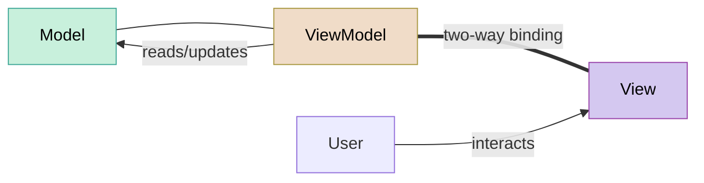
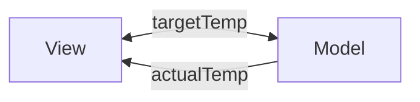
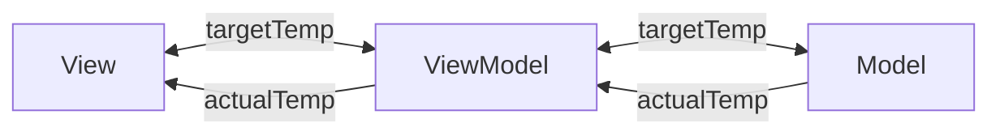

import RevealJS, { Slide } from '@site/src/components/RevealJS';
import Img from '@site/src/components/Img';
import PollSlide from '@site/src/components/PollSlide';

<RevealJS transition="slide">

{/* ============================================ */}
{/* COVER IMAGE */}
{/* ============================================ */}

<Slide>
  

<aside className="notes">
**Lecture overview:**
- **Total time:** ~55 minutes
- **Prerequisites:** L29 (GUIs in Java, MVC), L16 (Testing, Hexagonal Architecture), L28 (Accessibility)
- **Connects to:** GA1 (Core Features — students implement ViewModels), L31-32 (Concurrency)

**Structure (~23 slides):**
- Arc 1: The Problem with MVC (~8 min) — manual sync bugs, untestable controllers
- Arc 2: MVVM (~15 min) — ViewModel, data binding, ObservableList, MVC vs MVVM comparison
- Arc 3: Testing the ViewModel (~12 min) — unit tests, hexagonal architecture connection, what to test
- Arc 4: E2E Testing with TestFX (~12 min) — testing pyramid, locators, accessibility labels as locators
- Arc 5: Putting It All Together (~5 min) — GA1 strategy, takeaways

**Running example:** SceneItAll area dashboard from L29, refactored from MVC to MVVM, then tested at both ViewModel and E2E levels.

> **Transition:** Let's start with the learning objectives...
</aside>

</Slide>

{/* ============================================ */}
{/* TITLE SLIDE */}
{/* ============================================ */}

<Slide>

# CS 3100: Program Design and Implementation II

## Lecture 30: GUI Patterns and Testing

<p style={{marginTop: '2em', fontSize: '0.8em', color: '#666'}}>
  &copy;2026 Jonathan Bell & Ellen Spertus, CC-BY-SA
</p>

<aside className="notes">
**Context from previous lectures:**
- L29: Built a SceneItAll area dashboard with MVC — Model, View (FXML), Controller. Also introduced JavaFX properties/binding and the component lifecycle (start → load → inject → initialize → event loop)
- L16: Testing pyramid, observability/controllability, hexagonal architecture
- L28: Accessibility — standard components, accessible text
- Today: we fix MVC's limitations with MVVM, then test everything. Students already saw basic binding in L29 — today we formalize it as a pattern and go deeper (ObservableList, ViewModel as testable unit)

> **Transition:** Here's what you'll be able to do after today...
</aside>

</Slide>

{/* ============================================ */}
{/* LEARNING OBJECTIVES */}
{/* ============================================ */}

<Slide>

## Learning Objectives

<p style={{fontSize: '0.85em', textAlign: 'left'}}>
After this lecture, you will be able to:
</p>

<ol style={{fontSize: '0.75em', textAlign: 'left'}}>
  <li>Explain the limitations of MVC that motivated MVVM</li>
  <li>Implement the Model-View-ViewModel pattern with JavaFX properties and data binding</li>
  <li>Compare MVC and MVVM in terms of coupling, synchronization, and testability</li>
  <li>Write unit tests for a ViewModel without starting the JavaFX runtime</li>
  <li>Write end-to-end GUI tests using TestFX with accessibility-based locators</li>
</ol>

<aside className="notes">
**Time allocation:**
- Objective 1: MVC limitations (~8 min)
- Objective 2-3: MVVM pattern and comparison (~15 min)
- Objective 4: ViewModel testing (~12 min)
- Objective 5: TestFX and E2E tests (~12 min)

**Connection to GA1:** Students will implement ViewModel interfaces for their core features. Today teaches them the pattern and how to test it.

> **Transition:** Let's start by revisiting what we built last time...
</aside>

</Slide>

<Slide>

## Corrections

<div style={{marginTop: '2em', fontSize: '0.8em'}}>
* Wednesday morning, I said that slider drags during a long handler were lost. That was wrong. They are queued.

* In both sections, I said the model does not have any `javafx` imports. That was not true on slide 29, which had observable properties (`BooleanProperty`, `SimpleBooleanProperty`, etc.),
which we will discuss today.
</div>

<aside className="notes">
I sometimes don't get Prof. Bell's slides until the day before lecture so am not as well prepared as I'd like.
</aside>

</Slide>

{/* ============================================ */}
{/* ARC 1: THE PROBLEM WITH MVC (~8 min) */}
{/* ============================================ */}

<Slide>

## Last Lecture We Built an MVC App — Now Let's Break It

<p style={{fontSize: '0.85em'}}>
Our SceneItAll area dashboard from L29. Spot the bug:
</p>

```java
// Controller from L29
@FXML private void initialize() {
    brightnessSlider.valueProperty().addListener((obs, old, val) -> {
        int level = val.intValue();
        brightnessValueLabel.setText(level + "%");
        model.setAllLightsBrightness(level);
        updateDeviceList();  // ✅ remembered to update
    });
}

@FXML private void handleActivateScene() {
    String scene = sceneSelector.getValue();
    if (scene != null) {
        model.activateScene(scene);
        // ❌ BUG: forgot to call updateDeviceList()!
        // User activates "Evening" but the device list still shows old values
    }
}
```

<p style={{fontSize: '0.8em', marginTop: '0.5em', color: '#9370DB'}}>
Every time the Model changes, you must <strong>remember</strong> to update the View. Forget once → stale UI. This doesn't scale.
</p>

<aside className="notes">
The @FXML annotation is required for non-public methods referenced from fxml. It's good practice to require it.

**This is a real bug pattern.** As the app grows, the number of places where "update the view" must be called grows linearly. Miss one and the UI shows stale data. Students will hit this immediately in GA1 if they use pure MVC.

-> This is one of two problems. The other is testability...
</aside>

</Slide>

<Slide>

## MVC's Two Problems: Manual Sync and Untestable Controllers

<div style={{display: 'grid', gridTemplateColumns: '1fr 1fr', gap: '1.5em', fontSize: '0.8em'}}>

<div style={{backgroundColor: 'rgba(200,74,74,0.15)', padding: '0.8em', borderRadius: '8px'}}>

**Problem 1: Manual synchronization**

Every Model change requires a manual View update. Forget one → stale UI.

As the app grows, the number of sync points grows linearly. Each one is a potential bug.

</div>

<div className='fragment' style={{backgroundColor: 'rgba(200,74,74,0.15)', padding: '0.8em', borderRadius: '8px'}}>

**Problem 2: Untestable Controller**

```java
public class AreaDashboardController {
    @FXML private Slider brightnessSlider;
    @FXML private ListView<String> deviceList;
    // ...
}
```

To test `handleActivateScene()`, you need to start the JavaFX runtime, load FXML, create widgets, and simulate clicks.

That's an integration test, not a unit test.

</div>

</div>

<p className='fragment' style={{fontSize: '0.85em', marginTop: '0.8em'}}>
Recall from <a href="/lecture-notes/l16-testing2">L16</a>: testable code has high <strong>observability</strong> (can inspect state) and high <strong>controllability</strong> (can set state directly). MVC Controllers have neither.
</p>

<aside className="notes">
**Connect to L16 explicitly:** "In L16 we said the key to testable code is separating domain logic from infrastructure. The Controller mixes both — it contains decision-making logic (what to do when the user clicks) AND infrastructure dependencies (JavaFX widgets). MVVM separates these."

> **Transition:** MVVM solves both problems with one idea...
</aside>

</Slide>

{/* ============================================ */}
{/* ARC 2: MVVM (~15 min) */}
{/* ============================================ */}

<Slide>

## MVVM Adds One Layer to Solve Both Problems



<div style={{display: 'grid', gridTemplateColumns: '1fr 1fr 1fr', gap: '1em', fontSize: '0.75em', marginTop: '0.5em'}}>

<div style={{backgroundColor: 'rgba(74,153,153,0.15)', padding: '0.6em', borderRadius: '8px'}}>

**Model**

Same as MVC. Business logic, no UI.

</div>

<div style={{backgroundColor: 'rgba(169,148,74,0.15)', padding: '0.6em', borderRadius: '8px'}}>

**ViewModel** *(new)*

UI state as bindable properties. No reference to the View. Fully testable.

</div>

<div style={{backgroundColor: 'rgba(148,74,170,0.15)', padding: '0.6em', borderRadius: '8px'}}>

**View**

Declaratively binds to ViewModel properties. Contains no logic.

</div>

</div>

<p style={{fontSize: '0.8em', marginTop: '0.8em'}}>

**The key innovation:** The ViewModel exposes everything the View needs as <strong>observable properties</strong>. The View binds to them. When a property changes, the View updates automatically. No manual sync. No forgotten <code>updateDeviceList()</code> calls.

</p>

<aside className="notes">
**The double-line arrow (===) is data binding** — automatic, two-way synchronization. This is what makes MVVM different from MVC. In MVC, the Controller manually pushes data to the View. In MVVM, the View *pulls* data from the ViewModel via binding, and pushes user changes back the same way.

**The ViewModel has no reference to the View.** It doesn't know if it's being displayed in a GUI, a CLI, or a test harness. This is what makes it testable.

**History:** MVVM was developed at Microsoft in 2005 for Windows Presentation Foundation (WPF). The pattern has since spread to React (hooks/state), SwiftUI (@State/@Binding), Flutter (ChangeNotifier), and Angular (two-way binding). The names differ; the idea is the same.

> **Transition:** Let's see what a ViewModel looks like in code...
</aside>

</Slide>

<Slide>

## Introducing the Thermostat App

A thermostat has an **actual temperature** and a **target temperature**.

<div style={{display: 'flex', gap: '2em', alignItems: 'flex-start', fontSize: '.8em'}}>
<div>

We want the view to:
* show the actual temperature
* show the target temperature
* change the target temperature

We want the model to:
* own the actual and target temperatures
* validate them
* communicate with devices

</div>


</div>

<aside className="notes">

</aside>

</Slide>

<Slide>

## Data Flow

<div style={{ fontSize: '.8em' }}>
Logically, we want something like this:



<div className='fragment'>

We achieve this with a ViewModel:

</div>
</div>

<aside className="notes">

</aside>

</Slide>
<Slide>

## MVVM Responsibilities

<div style={{display: 'flex', flexDirection: 'column', gap: '0.5em', fontSize: '0.8em'}}>

<div className='fragment' style={{backgroundColor: 'rgba(74,153,153,0.15)', padding: '0.4em 0.8em', borderRadius: '8px'}}>

<p style={{margin: '0'}}>**Model** owns and validates the</p>
<ul style={{margin: '0.2em 0'}}>
<li>actual temperature, which it gets from a device</li>
<li>target temperature</li>
</ul>
</div>

<div className='fragment' style={{backgroundColor: 'rgba(148,74,170,0.15)', padding: '0.4em 0.8em', borderRadius: '8px'}}>

<p style={{margin: '0'}}>**View**</p>
<ul style={{margin: '0.2em 0'}}>
<li>displays the actual temperature</li>
<li>sets and displays the target temperature</li>
</ul>
</div>

<div className='fragment' style={{backgroundColor: 'rgba(169,148,74,0.15)', padding: '0.4em 0.8em', borderRadius: '8px'}}>

<p style={{margin: '0'}}>**ViewModel**</p>
<ul style={{margin: '0.2em 0'}}>
<li>exposes targetTemp as a DoubleProperty (read/write)</li>
<li>exposes actualTemp as a DoubleProperty (conventionally read-only)</li>
<li>listens for changes to targetTemp and forwards them to the model</li>
</ul>
</div>

<div className='fragment' style={{backgroundColor: 'rgba(74,100,170,0.15)', padding: '0.4em 0.8em', borderRadius: '8px'}}>

<p style={{margin: '0'}}>**Controller**</p>
<ul style={{margin: '0.2em 0'}}>
<li>creates and connects the Model and ViewModel</li>
<li>binds the UI elements to the ViewModel's properties</li>
</ul>
</div>

</div>

<aside className="notes">
- Model has no references to View
- Do we still need a controller? Yes, but it has less in it.

</aside>

</Slide>

<Slide>

## The View

<div style={{display: 'flex', gap: '2em', alignItems: 'flex-start'}}>
```xml
<!-- thermostat.fxml -->
<?xml version="1.0" encoding="UTF-8"?>

<?import javafx.scene.control.Label?>
<?import javafx.scene.control.Slider?>
<?import javafx.scene.layout.VBox?>

<VBox spacing="10" xmlns:fx="http://javafx.com/fxml"
      stylesheets="@styles.css"
      fx:controller="thermostat.ThermostatController">
    <Label fx:id="actualLabel"/>
    <Label fx:id="targetLabel"/>
    <Slider fx:id="targetSlider" min="10" max="35" value="20"/>
</VBox>
```


</div>

<div style={{fontSize: '0.6em'}}>
https://github.com/cs3100-spertus-s26/javafx-examples/blob/l30/app/src/main/resources/thermostat/thermostat.fxml
</div>

<aside className="notes">

</aside>

</Slide>

<Slide>
## The Model

<div style={{ fontSize: '.8em' }}>
```java
public class ThermostatModel {
  public static final int MIN_TEMP = 10;
  public static final int MAX_TEMP = 35;
  private double targetTemp = 20.0;
  private double actualTemp = 18.0;

  public double getTargetTemp() {
    return targetTemp;
  }

  public void setTargetTemp(double temp) {
    this.targetTemp = Math.clamp(temp, MIN_TEMP, MAX_TEMP);
    System.out.println("Target temperature set to: " + this.targetTemp);

    // Occasionally simulate updating the actual temperature.
    if (Math.random() < 0.05) {
      updateActualTemp();
    }
  }

  public double getActualTemp() {
    return actualTemp;
  }

  public void setActualTemp(double temp) {
    this.actualTemp = temp;
  }

  public void updateActualTemp() {
    // Simulate the actual temperature moving towards the target temperature.
    if (actualTemp < targetTemp) {
      actualTemp += 0.5;
    } else if (actualTemp > targetTemp) {
      actualTemp -= 0.5;
    }
    System.out.println("Actual temperature updated to: " + this.actualTemp);
  }
}
```
</div>

<div style={{fontSize: '0.6em'}}>
https://github.com/cs3100-spertus-s26/javafx-examples/blob/l30/app/src/main/java/thermostat/ThermostatModel.java
</div>

<aside className="notes">
Note that updating the targetTemp could cause the actualTemp to be updated.
</aside>

</Slide>

<Slide>

## Observable Properties

<div style={{ fontSize: '.65em' }}>
To connect the View and Model, JavaFX provides **observable properties** —
values that notify listeners when they change.

```mermaid
classDiagram
    class ObservableValue {
        <<interface>>
        +addListener(ChangeListener)
        +getValue() Object
    }
    class DoubleProperty {
        <<abstract>>
        +get() double
        +set(double)
        +bind(ObservableValue)
        +bindBidirectional(Property)
        +addListener(ChangeListener)
    }
    class SimpleDoubleProperty {
        +SimpleDoubleProperty(double initialValue)
    }

    ObservableValue <|-- DoubleProperty
    DoubleProperty <|-- SimpleDoubleProperty
    style ObservableValue fill:#2d4a5a,stroke:#4ac,stroke-width:2px,stroke-dasharray: 5 5
```



The ViewModel is the bridge between the View and the Model, so each can
react to changes caused by the other.
</div>

</Slide>

<Slide>

## The ViewModel
<div style={{fontSize: '0.6em'}}>

```java
public class ThermostatViewModel {
    private final DoubleProperty targetTemp = new SimpleDoubleProperty();
    private final DoubleProperty actualTemp = new SimpleDoubleProperty();

    private ThermostatModel model;

    public void setModel(ThermostatModel model) {
        this.model = model;
        targetTemp.set(model.getTargetTemp());  // initialize from model
        actualTemp.set(model.getActualTemp());  // initialize from model

        // When the user changes targetTemp, forward the new value to the model
        targetTemp.addListener((obs, oldVal, newVal) -> {
            model.setTargetTemp(newVal.doubleValue());
            // Check for other changes in the model.
            refresh();
        });
    }

    private void refresh() {
        actualTemp.set(model.getActualTemp());
    }

    public DoubleProperty targetTempProperty() { return targetTemp; }
    public DoubleProperty actualTempProperty() { return actualTemp; }
}

```
</div>

<div style={{fontSize: '0.6em'}}>
https://github.com/cs3100-spertus-s26/javafx-examples/blob/l30/app/src/main/java/thermostat/ThermostatViewModel.java
</div>

<aside className="notes">
- ObservableValues like DoubleProperty can have listeners.
- setModel() is called from the application, which we'll get to later.
- the getters are called by the controller...
</aside>

</Slide>

<Slide>

## The Controller

```java
public class ThermostatController {
    @FXML private Slider targetSlider;
    @FXML private Label targetLabel;
    @FXML private Label actualLabel;

    private ThermostatViewModel viewModel;

    public void setViewModel(ThermostatViewModel viewModel) {
        this.viewModel = viewModel;

        // bidirectional: slider and targetTemp stay in sync
        targetSlider.valueProperty().bindBidirectional(viewModel.targetTempProperty());

        // one-way: labels just display the values
        targetLabel.textProperty().bind(
            viewModel.targetTempProperty().asString("Target: %.1f °C"));
        actualLabel.textProperty().bind(
            viewModel.actualTempProperty().asString("Actual: %.1f °C"));
    }
}
```

<div style={{fontSize: '0.6em'}}>
https://github.com/cs3100-spertus-s26/javafx-examples/blob/l30/app/src/main/java/thermostat/ThermostatController.java
</div>


<aside className="notes">
bidirectional binding
* targetSlider.valueProperty() — gets the observable property representing the slider's current position
* bindBidirectional(...) — links two properties so that when either one changes, the other updates automatically
* viewModel.targetTempProperty() — the ViewModel's observable property for the target temperature

one-way binding
* targetLabel.textProperty() — gets the observable property representing the label's displayed text
* bind(...) — one-way: whenever the right-hand side changes, the label updates automatically
* viewModel.targetTempProperty() — the ViewModel's observable double property
* .asString("Target: %.1f °C") — converts the double to a formatted string, e.g. "Target: 22.5 °C". The %.1f is standard Java format syntax meaning one decimal place.

</aside>

</Slide>

<Slide>

## Listening vs. Binding

<div style={{display: 'flex', flexDirection: 'column', gap: '0.5em', fontSize: '0.8em'}}>

<div style={{backgroundColor: 'rgba(148,74,170,0.15)', padding: '0.4em 0.8em', borderRadius: '8px'}}>

<p style={{margin: '0'}}>**Listening** — imperative: "when this changes, do something"</p>
<ul style={{margin: '0.2em 0'}}>
<li>You provide code to run when the value changes</li>
<li>Used when a change requires an action, not just a value update</li>
</ul>
```java
// when targetTemp changes, forward the new value to the model
targetTemp.addListener((obs, oldVal, newVal) -> {
    model.setTargetTemp(newVal.doubleValue());
    refresh();
});
```

</div>

<div className='fragment' style={{backgroundColor: 'rgba(74,153,153,0.15)', padding: '0.4em 0.8em', borderRadius: '8px'}}>

<p style={{margin: '0'}}>**Binding** — declarative: "always reflect this value"</p>
<ul style={{margin: '0.2em 0'}}>
<li>JavaFX maintains the relationship automatically</li>
<li>Used to keep UI elements in sync with ViewModel properties</li>
</ul>
```java
// one-way: label always shows the current actualTemp
actualLabel.textProperty().bind(
    viewModel.actualTempProperty().asString("Actual: %.1f °C"));

// bidirectional: slider and targetTemp stay in sync
targetSlider.valueProperty().bindBidirectional(viewModel.targetTempProperty());
```

</div>

</div>

<aside className="notes">

</aside>

</Slide>

<Slide>

## The Application
```java
public class ThermostatApp extends Application {

    @Override
    public void start(Stage stage) throws Exception {
        FXMLLoader loader = new FXMLLoader(getClass().getResource("thermostat.fxml"));
        Parent root = loader.load();

        ThermostatModel model = new ThermostatModel();
        ThermostatViewModel viewModel = new ThermostatViewModel();
        viewModel.setModel(model);

        ThermostatController controller = loader.getController();
        controller.setViewModel(viewModel);

        stage.setScene(new Scene(root, 300, 200));
        stage.setTitle("Thermostat");
        stage.show();
    }

    public static void main(String[] args) {
        launch(args);
    }
}
```
<div style={{fontSize: '0.6em'}}>
https://github.com/cs3100-spertus-s26/javafx-examples/blob/l30/app/src/main/java/thermostat/ThermostatApp.java
</div>

<aside className="notes">

</aside>

</Slide>

<Slide>
## Transition to Prof. Bell's Slides

* Prof. Bell has a bigger example with SceneItAll.
* You can always go through his lectures and notes.
* The main difference is his contains ObservableLists.
* Let's now go back to his slides...
</Slide>

<Slide>

## MVC vs. MVVM: Same Feature, Two Architectures

<p style={{fontSize: '0.85em'}}>
The same "Activate Scene" feature. Look at what each class <strong>depends on</strong>:
</p>

<div style={{display: 'grid', gridTemplateColumns: '1fr 1fr', gap: '1em', fontSize: '0.68em'}}>

<div className='fragment' style={{backgroundColor: 'rgba(200,74,74,0.15)', padding: '0.8em', borderRadius: '8px'}}>

**MVC — logic lives in the Controller**

```java
public class AreaDashboardController {
  // Depends on View widgets ↓
  @FXML private Slider brightnessSlider;
  @FXML private Label brightnessValueLabel;
  @FXML private ListView<String> deviceList;
  @FXML private ComboBox<String> sceneSelector;

  // AND depends on the Model ↓
  private Area model;

  @FXML private void handleActivateScene() {
    model.activateScene(sceneSelector.getValue());
    // Must know about EVERY widget to update
    brightnessSlider.setValue(model.getAvgBrightness());
    brightnessValueLabel.setText(model.getAvgBrightness() + "%");
    deviceList.getItems().setAll(/* ... */);
  }
}
```

**Depends on:** Model + Slider + Label + ListView + ComboBox

</div>

<div className='fragment' style={{backgroundColor: 'rgba(74,153,74,0.15)', padding: '0.8em', borderRadius: '8px'}}>

**MVVM — logic lives in the ViewModel**

```java
public class AreaDashboardViewModel {
  // Depends on the Model only ↓
  private Area model;

  // Exposes observable properties (no widgets!)
  private final IntegerProperty brightness = ...;
  private final ObservableList<String> statuses = ...;

  public void activateScene(String name) {
    model.activateScene(name);
    brightness.set(model.getAvgBrightness());
    statuses.setAll(/* ... */);
    // View updates automatically via binding
  }
}
```

**Depends on:** Model only

</div>

</div>

<aside className="notes">
**The punchline is the dependency arrows.** MVC Controller depends on both Model AND View widgets. ViewModel depends on Model only. That's the entire difference — and it's what makes one testable and the other not.

**Draw it on the board if you can:**
- MVC: Controller → Model, Controller → View (two dependencies, one is infrastructure)
- MVVM: ViewModel → Model (one dependency, pure domain). Controller → ViewModel + View (thin wiring, infrastructure side)

**When is MVC still fine?** For trivial UIs with 2-3 widgets where testability of the controller isn't a concern.

**When does MVVM pay for itself?** When you need to test UI logic — which is always in a production app. GA1 features are in this category.

> **Transition:** Now let's see why testability is the biggest payoff...
</aside>

</Slide>

{/* ============================================ */}
{/* ARC 3: TESTING THE VIEWMODEL (~12 min) */}
{/* ============================================ */}
<Slide>

## MVC Controller Test — Needs Full UI

<div style={{backgroundColor: 'rgba(200,74,74,0.15)', padding: '0.8em', borderRadius: '8px', fontSize: '0.7em'}}>
```java
@Test
void activateScene_updatesDeviceStatuses() {
  // Arrange — need JavaFX runtime!
  Platform.startup(() -> {});
  FXMLLoader loader = new FXMLLoader(getClass().getResource("/area-dashboard.fxml"));
  Parent root = loader.load();
  Stage stage = new Stage();
  stage.setScene(new Scene(root));
  stage.show();
  // ... set up model, find widgets ...

  // Act — simulate button click
  clickOn("#sceneButton");

  // Assert — inspect widget state
  ListView list = lookup("#deviceList").query();
  // ... check list items ...
}
```

**Runs in: ~2000 ms** (if it doesn't flake)

</div>

<aside className="notes">
**Needs a display to run at all.** Platform.startup() requires a real or virtual display — CI servers without one will fail entirely.

**Low observability:** you can't inspect your domain objects directly. You have to find a ListView widget and parse its rendered text.

**Low controllability:** you can't call your logic directly. You have to find a ComboBox, select an item, then click a button — hoping your CSS selectors don't break.

**The hexagonal architecture story across the arc:**
- L29: "MVC does this, but the Controller leaks — it depends on both Model and View widgets"
- L30: "MVVM fixes the leak — the ViewModel depends on Model only, the Controller shrinks to thin infrastructure"
</aside>

</Slide>

<Slide>

## ViewModel Test — Pure Java, No UI

<div style={{backgroundColor: 'rgba(74,153,74,0.15)', padding: '0.8em', borderRadius: '8px', fontSize: '0.7em'}}>
```java
@Test
void activateScene_updatesDeviceStatuses() {
  // Arrange
  AreaDashboardViewModel vm = new AreaDashboardViewModel();
  Area area = new Area("Living Room");
  area.addDevice(new Light("Ceiling", 100));
  area.addDevice(new Fan("Floor Fan", true));
  area.addScene("Evening", Map.of("Ceiling", 30));
  vm.setModel(area);

  // Act
  vm.activateScene("Evening");

  // Assert
  assertEquals(30, vm.brightnessProperty().get());
  assertTrue(vm.getDeviceStatuses().contains("Ceiling: 30%"));
}
```

**Runs in: ~5 ms**

</div>

<aside className="notes">
**High observability:** you can directly inspect `brightnessProperty().get()` and `getDeviceStatuses()`. No widget scraping.

**High controllability:** you call `activateScene("Evening")` directly. No UI interaction needed.

**To be precise about imports:** The ViewModel does import from JavaFX — `javafx.beans` for properties and `javafx.collections` for ObservableList. But it never imports `javafx.scene` — no widgets, no FXML, no rendering. The practical test: can you `new AreaDashboardViewModel()` in a plain JUnit test without starting the JavaFX Application Thread? Yes. Can you do that with the MVC Controller? No.

> **Transition:** So what should ViewModel tests actually check?
</aside>

</Slide>

<Slide>

## Thermostat Tests (1/2)
```java
class ThermostatViewModelTest {

    private ThermostatViewModel vm;
    private ThermostatModel model;

    @BeforeEach
    void setUp() {
        vm = new ThermostatViewModel();
        model = new ThermostatModel();
        vm.setModel(model);
    }

    // 1. State initialization
    @Test
    void setModel_populatesTargetTemp() {
            assertEquals(model.getTargetTemp(), vm.targetTempProperty().get());
      }

    @Test
    void setModel_populatesActualTemp() {
        assertEquals(model.getActualTemp(), vm.actualTempProperty().get());
    }

    // 2. User action → model update
    @Test
    void setTargetTemp_updatesModel() {
        vm.targetTempProperty().set(25.0);
        assertEquals(25.0, model.getTargetTemp());
    }

    // 3. Edge cases
    @Test
    void setTargetTemp_belowMinimum_clampsToMin() {
        vm.targetTempProperty().set(ThermostatModel.MIN_TEMP - 1);
        assertEquals(ThermostatModel.MIN_TEMP, model.getTargetTemp());
    }

    @Test
    void setTargetTemp_aboveMaximum_clampsToMax() {
        vm.targetTempProperty().set(ThermostatModel.MAX_TEMP + 1);
        assertEquals(ThermostatModel.MAX_TEMP, model.getTargetTemp());
    }
}
```

<div style={{fontSize: '0.6em'}}>
https://github.com/cs3100-spertus-s26/javafx-examples/blob/l30/app/src/test/java/thermostat/ThermostatViewModelTest.java
</div>

<aside className="notes">
**Four categories of ViewModel tests:**

1. **State initialization** — when you set the model, do all properties reflect the model's state?
2. **User action → model** — when a property changes (simulating user input), does the model update correctly?
</aside>

</Slide>

<Slide>

## Thermostat Tests (2/2)
```java
    // 3. Model change → UI property update
    @Test
    void setTargetTemp_belowActual_triggersRefresh() {
        model.setActualTemp(25.0);
        vm.targetTempProperty().set(22.0);
        assertEquals(model.getActualTemp(), vm.actualTempProperty().get());
    }

    // 4. Edge cases
    @Test
    void setTargetTemp_belowMinimum_clampsToMin() {
        vm.targetTempProperty().set(ThermostatModel.MIN_TEMP - 1);
        assertEquals(ThermostatModel.MIN_TEMP, model.getTargetTemp());
    }

    @Test
    void setTargetTemp_aboveMaximum_clampsToMax() {
        vm.targetTempProperty().set(ThermostatModel.MAX_TEMP + 1);
        assertEquals(ThermostatModel.MAX_TEMP, model.getTargetTemp());
    }
}
```

<div style={{fontSize: '0.6em'}}>
https://github.com/cs3100-spertus-s26/javafx-examples/blob/l30/app/src/test/java/thermostat/ThermostatViewModelTest.java
</div>

<aside className="notes">

3. **Model → properties** — when the model changes (via a command), do the properties reflect the new state?
4. **Edge cases** — null inputs, empty lists, boundary values, error states

**Rule of thumb for GA1:** If your ViewModel has N properties and M commands, you should have at least N initialization tests, M command tests, and a handful of edge case tests. That's usually 10-20 tests per ViewModel.

> **Transition:** And what should they NOT cover?
</aside>

</Slide>
<Slide>

## What ViewModel Tests Should and Should NOT Cover

<div style={{fontSize: '0.8em'}}>

<div style={{backgroundColor: 'rgba(74,153,74,0.15)', padding: '0.8em', borderRadius: '8px', marginBottom: '1em'}}>

**Do test ViewModel logic:**

- Does setting target temp to 100 clamp to `MAX_TEMP`?
- Does setting target temp below actual trigger a property refresh?
- Does a null model get handled gracefully?
- Does initializing with a model populate all properties correctly?

These are decisions the ViewModel makes, independent of how the View displays them.

</div>

<div className='fragment' style={{backgroundColor: 'rgba(200,74,74,0.15)', padding: '0.8em', borderRadius: '8px'}}>

**Don't test View concerns in ViewModel tests:**

- Pixel positions or layout dimensions
- CSS styling or colors
- Animation timing or transitions
- Which specific widget type displays a temperature
- Focus order or tab behavior

These are View responsibilities. Test them in E2E tests (sparingly) or manual testing.

</div>

</div>

<p style={{fontSize: '0.8em', marginTop: '0.3em', color: '#9370DB'}}>
If your test imports <code>javafx.scene</code>, it's probably testing the wrong layer.
</p>

<aside className="notes">
**The litmus test:** "Could this test pass even if the View didn't exist?" If yes, it's a good ViewModel test. If no, it belongs in an E2E test.

**Common mistake:** Testing that a temperature value appears in a specific label at a specific pixel position. That's a View concern — the ViewModel doesn't know labels exist.

> **Transition:** Let's check your understanding before we move to E2E testing...
</aside>

</Slide>


{/* ============================================ */}
{/* ARC 4: E2E TESTING WITH TESTFX (~12 min) */}
{/* ============================================ */}

<Slide>

## ViewModel Tests Cover Logic — But Who Tests the Wiring?

<p style={{fontSize: '0.85em'}}>
Your ViewModel is perfect. Your tests all pass. But:
</p>

<ul style={{fontSize: '0.8em'}}>
  <li>What if the FXML binds to the <strong>wrong property</strong>?</li>
  <li>What if the Controller wires <strong>one-way</strong> instead of <strong>bidirectional</strong>?</li>
  <li>What if the button's <code>onAction</code> references a method that <strong>doesn't exist</strong>?</li>
  <li>What if two features <strong>work individually</strong> but break when integrated?</li>
</ul>

<p style={{fontSize: '0.85em', marginTop: '0.8em'}}>
You need <em>some</em> tests that exercise the full stack: View → Controller → ViewModel → Model. That's what <strong>end-to-end (E2E) tests</strong> are for.
</p>

<p style={{fontSize: '0.8em', color: '#9370DB'}}>
But E2E tests are expensive. Use them sparingly — only for critical user journeys.
</p>

<aside className="notes">
**Set the expectation:** E2E tests are not the primary testing strategy. ViewModel tests are. E2E tests are the safety net that catches wiring mistakes the ViewModel tests can't see.

**Analogy:** ViewModel tests are like testing each instrument in isolation — does the trumpet play the right notes? E2E tests are like a dress rehearsal — do all the instruments play together?

> **Transition:** This is where the testing pyramid comes back...
</aside>

</Slide>

<Slide>

## The Testing Pyramid, Revisited


<aside className="notes">
**Recall from L16:** The testing pyramid is the same principle. Bottom = fast, cheap, reliable tests. Top = slow, expensive, flaky tests. Push tests down whenever possible.

**For GA1, this means:**
- **Many** Model unit tests (you've been writing these all semester)
- **Many** ViewModel unit tests (new this assignment — this is the primary new testing skill)
- **Few** E2E tests (1-2 per feature, covering the critical user journey)

**The bottom two layers don't need JavaFX running.** Only the E2E tests at the top need the full UI. This is why MVVM matters — it lets you test 90% of your logic without touching the UI framework.

> **Transition:** Let's set up TestFX...
</aside>

</Slide>

<Slide>

## TestFX: Simulating a Real User

<p style={{fontSize: '0.85em'}}>
TestFX launches your real JavaFX application and simulates clicks, typing, and navigation:
</p>
```java
public class ThermostatE2ETest extends ApplicationTest {

    private ThermostatModel model;
    private ThermostatViewModel vm;

    @Override
    public void start(Stage stage) throws Exception {
        FXMLLoader loader = new FXMLLoader(
            getClass().getResource("/thermostat/thermostat.fxml"));
        stage.setScene(new Scene(loader.load(), 300, 200));

        model = new ThermostatModel();
        model.setActualTemp(18.0);

        vm = new ThermostatViewModel();
        vm.setModel(model);

        loader.<ThermostatController>getController().setViewModel(vm);

        stage.show();
    }

    // Tests go here — next slides...
}
```

<aside className="notes">
**`extends ApplicationTest`** is the key. TestFX provides a base class that manages the JavaFX lifecycle — starting the runtime, creating a stage, and cleaning up between tests.

**`start(Stage stage)`** is where you set up your application. This runs before each test. You load real FXML, create real ViewModels with test data, and show the stage.

**This is a real application.** TestFX doesn't mock anything — it creates actual widgets and renders them. That's why it's slow but high-confidence.

> **Transition:** The hardest part of E2E testing is finding the right element to interact with...
</aside>

</Slide>

<Slide>

## The Locator Problem: How Do You Find a Slider?

<div style={{fontSize: '0.8em'}}>

| Strategy | Code | Problem |
|----------|------|---------|
| **By fx:id** | `lookup("#targetSlider")` | Breaks if developer renames the ID |
| **By CSS class** | `lookup(".slider")` | Matches ALL sliders — which one? |
| **By position** | `lookup(".slider").nth(0)` | Breaks if layout changes |
| **By text** | `clickOn("Target")` | Breaks if label text changes; non-unique |

</div>

<p style={{fontSize: '0.85em', marginTop: '0.8em'}}>
All of these describe <em>how the element is implemented</em>, not <em>what it does</em>. Refactor the UI → tests break.
</p>

<p style={{fontSize: '0.85em', marginTop: '0.5em', fontWeight: 'bold', color: '#9370DB'}}>
Is there an identifier that describes what an element <em>does</em> rather than how it's built?
</p>

<aside className="notes">
**Let students think about this.** They've seen the answer — in L28. The accessibility label describes what an element *is for*, not how it's implemented.

> **Transition:** You already have the answer...
</aside>

</Slide>

<Slide>

## The Solution: Locate by Accessibility Label

<p style={{fontSize: '0.85em'}}>
The <code>accessibleText</code> you added in L28 and L29 describes <strong>what the element does</strong> — not how it's implemented:
</p>
```java
// Helper: find elements by accessible text
private <T extends Node> T findByAccessibleText(String text) {
    return lookup(node ->
        text.equals(node.getAccessibleText())
    ).query();
}

// Test uses purpose-based locators
@Test
void userCanSetTargetTemperature() {
    Slider slider = findByAccessibleText("Target temperature slider");
    interact(() -> slider.setValue(25.0));

    FxAssert.verifyThat(
        findByAccessibleText("Target temperature display"),
        LabeledMatchers.hasText("Target: 25.0 °C"));
}
```

<div style={{fontSize: '0.8em', marginTop: '0.5em'}}>

| Refactoring | ID-based test | Accessibility-based test |
|-------------|---------------|--------------------------|
| Rename `fx:id` from `targetSlider` to `tempSlider` | **Breaks** ❌ | **Still passes** ✅ |
| Change label format from `Target: 25.0 °C` to `Set: 25.0°` | **Breaks** ❌ | **Breaks** unless assertion avoids exact UI text ⚠️ |
| Move slider from bottom to top of layout | **Breaks** (position) ❌ | **Still passes** ✅ |

</div>

<p style={{fontSize: '0.8em', marginTop: '0.5em', color: '#9370DB'}}>
Your accessibility work from L28 makes your tests more stable. Accessibility and testability reinforce each other.
</p>

<aside className="notes">
**THIS IS THE PAYOFF.** Students might have wondered why we spent time on accessible text. Now they see: it's not just for screen readers — it's the most stable way to locate elements in tests.

**Why it works:** The accessibility label describes the element's *purpose*. Purposes don't change when you refactor. IDs, classes, positions, and label text all change during normal development.

**The virtuous cycle:** Writing accessible UIs makes tests more stable. Writing stable tests incentivizes accessible UIs. You get better code AND better accessibility from the same practice.

> **Transition:** Let's see a complete E2E test...
</aside>

</Slide>

<Slide>

## Thermostat E2E Test Setup
```java
public class ThermostatE2ETest extends ApplicationTest {

    private ThermostatModel model;
    private ThermostatViewModel vm;

    @Override
    public void start(Stage stage) throws Exception {
        FXMLLoader loader = new FXMLLoader(
            getClass().getResource("/thermostat/thermostat.fxml"));
        stage.setScene(new Scene(loader.load(), 300, 200));

        model = new ThermostatModel();
        model.setActualTemp(18.0);

        vm = new ThermostatViewModel();
        vm.setModel(model);

        loader.<ThermostatController>getController().setViewModel(vm);

        stage.show();
    }
}
```

<div style={{fontSize: '0.6em'}}>
https://github.com/cs3100-spertus-s26/javafx-examples/blob/l30/app/src/test/java/thermostat/ThermostatE2ETest.java
</div>

<aside className="notes">
**`start()` replaces `@BeforeEach`** — TestFX calls it once per test with a real Stage. This is where you wire up the full MVVM stack: model → viewModel → controller, exactly as `ThermostatApp` does.

**Why keep `model` and `vm` as fields?** So test methods can reference them directly for assertions — the same reason `testArea` was a field in the SceneItAll version.
</aside>

</Slide>

<Slide>

## Thermostat E2E Tests
```java
@Test
void labels_reflectInitialModelState() {
    FxAssert.verifyThat("#targetLabel",
        LabeledMatchers.hasText("Target: 20.0 °C"));
    FxAssert.verifyThat("#actualLabel",
        LabeledMatchers.hasText("Actual: 18.0 °C"));
}

@Test
void settingSlider_updatesTargetLabel() {
    Slider slider = lookup("#targetSlider").query();
    interact(() -> slider.setValue(25.0));

    FxAssert.verifyThat("#targetLabel",
        LabeledMatchers.hasText("Target: 25.0 °C"));
}

@Test
void settingSlider_updatesModel() {
    Slider slider = lookup("#targetSlider").query();
    interact(() -> slider.setValue(25.0));

    assertEquals(25.0, model.getTargetTemp(), 0.01);
}
```

<div style={{fontSize: '0.6em'}}>
https://github.com/cs3100-spertus-s26/javafx-examples/blob/l30/app/src/test/java/thermostat/ThermostatE2ETest.java
</div>

<aside className="notes">
**`verifyThat("#targetLabel", ...)` looks up a widget by fx:id** — this is the View concern that ViewModel tests deliberately avoid. Here it's appropriate because we're testing the full stack.

**`interact()`** runs the lambda on the JavaFX Application Thread and waits for completion. It's more reliable than simulating mouse drags, which depend on pixel positions and can hang.

**`slider_reflectsInitialTargetTemp()`** was omitted here for space — it looks up `#targetSlider` and asserts `getValue() == 20.0`.

**Runs in: ~2000 ms** per test, needs a display (or Monocle for headless CI).

> **Transition:** And what should they NOT cover?
</aside>

</Slide>
{/* ============================================ */}
{/* ARC 5: PUTTING IT ALL TOGETHER (~5 min) */}
{/* ============================================ */}

<Slide>

## Your GA1 Testing Strategy

<div style={{fontSize: '0.8em'}}>

| Layer | What you test | How many | Speed |
|-------|--------------|----------|-------|
| **Model unit tests** | Business logic (scaling, conversion, search) | Many (10-20) | ~5 ms each |
| **ViewModel unit tests** | UI state, commands, property updates | Many (10-20) | ~5 ms each |
| **E2E tests (TestFX)** | Critical user journey, end-to-end wiring | Few (1-2) | ~2 sec each |

</div>

<p style={{fontSize: '0.85em', marginTop: '0.8em'}}>
In GA1 you'll apply these patterns to CookYourBooks. The ViewModel interfaces we provide are your testing contract:
</p>

```java
// GA1 provides this interface
public interface LibraryViewModel {
    StringProperty selectedCookbookProperty();
    ObservableList<String> getRecipeNames();
    void selectCookbook(String name);
    void deleteRecipe(String name);
}

// You implement it — and test it
@Test
void selectCookbook_populatesRecipeNames() {
    viewModel.selectCookbook("Italian Favorites");
    assertFalse(viewModel.getRecipeNames().isEmpty());
    assertTrue(viewModel.getRecipeNames().contains("Pasta Carbonara"));
}
```

<aside className="notes">
**The ViewModel interface IS the spec.** Students implement the interface, write tests against it, and build a View that binds to its properties. The TA evaluates the ViewModel implementation — it's individually graded.

**The three layers mirror the semester arc:**
- Model tests: they've been writing these since HW1
- ViewModel tests: the new skill from this lecture
- E2E tests: the capstone — full integration

> **Transition:** Key takeaways...
</aside>

</Slide>

<Slide>

## Key Takeaways

<ol style={{fontSize: '0.8em'}}>
  <li><strong>MVC's limitation: manual sync is error-prone.</strong> Every Model change requires a manual View update. Forget one → stale UI.</li>
  <li><strong>MVVM solves this with data binding.</strong> The ViewModel exposes observable properties. The View binds to them. Sync is automatic.</li>
  <li><strong>The ViewModel has no View reference.</strong> It's a plain Java class with properties and commands. Fully unit-testable without starting the UI.</li>
  <li><strong>Push tests down the pyramid.</strong> ViewModel tests are fast and reliable. E2E tests are slow and flaky. Use E2E only for critical user journeys.</li>
  <li><strong>Accessibility labels make the best test locators.</strong> They describe what an element does, not how it's built. Refactor-proof.</li>
  <li><strong>Accessibility and testability reinforce each other.</strong> The same practices that help screen reader users also make your tests more stable.</li>
</ol>

<aside className="notes">
**Takeaway #6 is the theme of the lecture arc.** L28 taught accessibility. L29 taught building GUIs with standard components. L30 shows that accessible components are also testable components. It's not three separate concerns — it's one coherent practice.

> **Transition:** Looking ahead...
</aside>

</Slide>

<Slide>

## Looking Ahead

<div style={{fontSize: '0.85em'}}>

~~**Lab 12 (next Monday/Tuesday): Hands-on GUI practice**~~
- Build SceneItAll GUI components using MVC and MVVM patterns from L29 and L30
- Practice ViewModel testing and FXML binding
- Bring your laptop with Scene Builder installed

**Next up: Concurrency (L31-32)**
- What happens when your event handler needs to talk to a network or database?
- If it blocks, the UI freezes (remember the event loop from L29)
- Background threads, `Platform.runLater()`, `Task` and `Service` classes
- How to keep the UI responsive during long-running operations

**Your group project:**
- GA1 (due Apr 9): Implement your feature's ViewModel, View, and tests — in GA1 you'll apply these patterns to **CookYourBooks**
- Write ViewModel unit tests — these are individually graded
- Write 1-2 E2E tests for your feature's critical user journey
- Use accessibility labels on all interactive widgets — it helps your users AND your tests

</div>

<p style={{fontSize: '0.85em', marginTop: '1em', color: '#9370DB'}}>
Today you learned to separate what the UI shows from how it works, and to test both. Next, you learn to keep the UI alive while doing heavy work.
</p>

<aside className="notes">
**Concurrency preview:** In L29 we mentioned that long-running handlers freeze the UI. L31-32 solves this — students will learn to run background tasks and update the UI safely from another thread. This is essential for GA1 features that import data, search, or make network calls.

**AI policy reminder:** AI is encouraged for GA1 — great for generating ViewModel boilerplate, property bindings, and test scaffolding. Students must understand the code for code walks.

> That's it for today. Questions?
</aside>

</Slide>

<Slide>

## Poll: How do you feel about your Quiz 2 performance?

<PollSlide username="espertus" image="/img/lectures/poll-ev/pollev-smiles.png"/>

</Slide>

<Slide>
## Poll: How did you prepare?

<PollSlide username="espertus" 
    choices={["I attended the quiz review in lecture", "I watched the recording of the other quiz review.", "I went through Prof. Bell's review slides", "I went to the ASNUO study session", "I went to Ellen's office hours to discuss topics", "I made an appointment with Ellen", "I asked AI for help with topics I didn't understand", "none of the above" ]}
/>

<aside className="notes">
- Multiple answers
- If you did poorly on the quiz, it's not that you're not smart. It means you are still learning how to prepare for quizzes.
</aside>

</Slide>

<Slide>
## Bonus Slide


</Slide>

</RevealJS>
