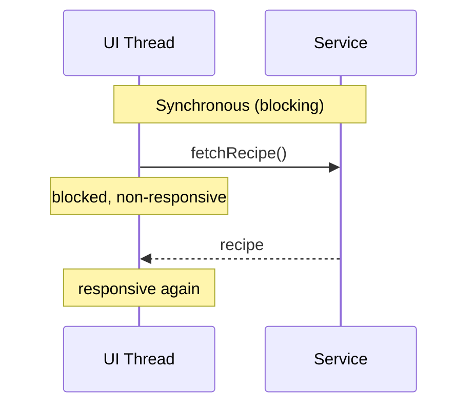
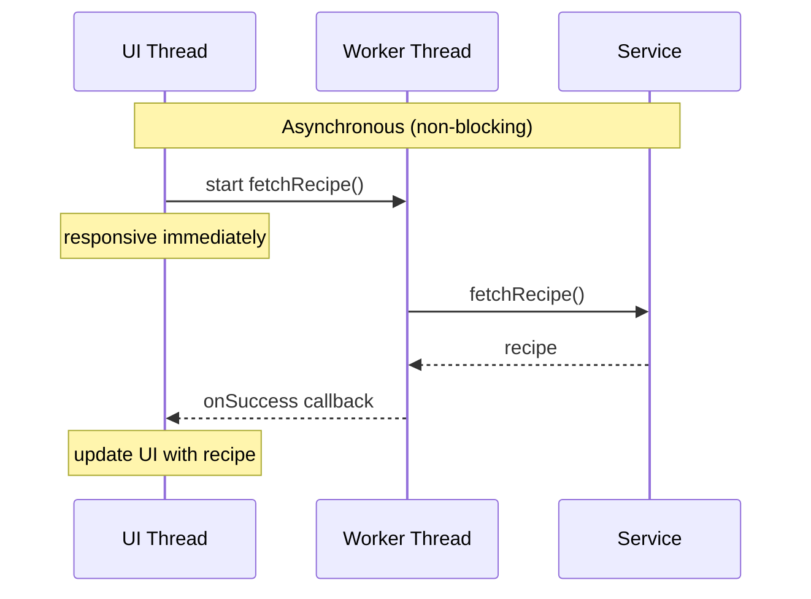

import RevealJS, { Slide } from '@site/src/components/RevealJS';
import Img from '@site/src/components/Img';
import PollSlide from '@site/src/components/PollSlide';

<RevealJS transition="slide">

{/* ============================================ */}
{/* COVER IMAGE */}
{/* ============================================ */}

<Slide>
  

<aside className="notes">
**Lecture overview:**
- **Total time:** ~55 minutes
- **Prerequisites:** L31 (Threads, Synchronization, Deadlock), L29/L30 (JavaFX, MVVM, event loop)
- **Connects to:** L33 (Event-Driven Architecture), GA1 (BackgroundTaskRunner, Platform.runLater)

**Structure:**
- Arc 1: From Threads to BackgroundTaskRunner
- Arc 2: Asynchronous Programming Pitfalls

> **Transition:** Let's start with the learning objectives...
</aside>

</Slide>

{/* ============================================ */}
{/* TITLE + LOs */}
{/* ============================================ */}

<Slide>

# CS 3100: Program Design and Implementation II

## Lecture 32: Concurrency II — Asynchronous Programming

<p style={{marginTop: '2em', fontSize: '0.8em', color: '#666'}}>
  &copy;2026 Ellen Spertus & Jonathan Bell, CC-BY-SA
</p>

<aside className="notes">
**Context from L31:** Students learned threads, shared mutable state, race conditions, synchronized, concurrent collections, and deadlock.

</aside>

</Slide>


<Slide>

## Learning Objectives

<p style={{fontSize: '0.85em', textAlign: 'left'}}>
After this lecture, you will be able to:
</p>

<ol style={{fontSize: '0.75em', textAlign: 'left'}}>
  <li>Distinguish whether an operation should run on the GUI thread or a background thread</li>
  <li>Explain what problems asynchronous programming solves</li>
  <li>Use <code>BackgroundTaskRunner</code> to divide work between GUI and background threads</li>
  <li>Identify and avoid common asynchronous programming pitfalls</li>
</ol>

<aside className="notes">
→ Let's look at the big picture
</aside>

</Slide>

<Slide>

## Big Picture

<div style={{ fontSize: '.8em' }}>
GUI apps need to stay responsive while doing slow work. The naive fix — spawning a thread — works but has costs.

Today you'll learn a cleaner approach you'll use directly in Lab 13 and GA1.

</div>

<aside className="notes">

</aside>

</Slide>

{/* ============================================ */}
{/* ARC 1: FROM THREAD TO BACKGROUNDTASKRUNNER */}
{/* ============================================ */}
<Slide>

## Cook My Books Example A

<div style={{display: 'flex', gap: '1.5rem', alignItems: 'flex-start'}}>
<div style={{flex: '0 0 45%'}}>
```java
public class CookMyBooks {
  private static final long START_TIME = System.currentTimeMillis();

  private static void log(String message) {
    long elapsed = System.currentTimeMillis() - START_TIME;
    String thread = Thread.currentThread().getName();
    System.out.printf("%4dms %s %s%n", elapsed, thread, message);
  }

  private static String fetchRecipe() {
    log("Fetching recipe...");
    try {
      Thread.sleep(2000); // simulates slow network call
    } catch (InterruptedException e) {
      // this can't happen in our program
    }
    log("Got recipe!");
    return "Cookie Recipe";
  }

  private static void updateUI(String recipe) {
    log("Updating UI: " + recipe);
  }

  // This runs in the UI thread.
  private static void handleFetchRecipeRequest() {
    log("UI thread received fetch recipe request");
    log("UI is non-responsive");
    String recipe = fetchRecipe();
    updateUI(recipe);
    log("UI is now responsive again");
  }

  public static void main(String[] args) {
    handleFetchRecipeRequest();
  }
}
```

</div>
<div className='fragment' style={{flex: '0 0 50%', fontSize: '0.8em'}}>
<pre>
<span style={{color: '#4ac'}}>    0ms main UI thread received fetch recipe request</span><br/>
<span style={{color: '#4ac'}}>   20ms main UI is non-responsive</span><br/>
<span style={{color: '#4ac'}}>   21ms main Fetching recipe...</span><br/>
<span style={{color: '#4ac'}}> 2036ms main Got recipe!</span><br/>
<span style={{color: '#4ac'}}> 2038ms main Updating UI: Cookie Recipe</span><br/>
<span style={{color: '#4ac'}}> 2038ms main UI is now responsive again</span>
</pre>
</div>
</div>

<div style={{ fontSize: '.6em' }}>
https://github.com/cs3100-spertus-s26/concurrency-examples/blob/cookmybooks-a/app/src/main/java/concurrency/CookMyBooks.java
</div>

<aside className="notes">
**Key point:** The UI thread is blocked for 2 seconds — during this time, no user interaction can be processed. In a real GUI, the window would freeze.

> **Transition:** So what's the fix?
</aside>

</Slide>

<Slide>

## Cook My Books Example B

<div style={{display: 'flex', gap: '1.5rem', alignItems: 'flex-start'}}>
<div style={{flex: '0 0 45%'}}>
```java
public class CookMyBooks {
  private static final long START_TIME = System.currentTimeMillis();

  private static void log(String message) { .. }

  private static String fetchRecipe() {
    log("Fetching recipe...");
    try {
      Thread.sleep(2000); // simulates slow network call
    } catch (InterruptedException e) { .. }
    log("Got recipe!");
    return "Cookie Recipe";
  }

  private static void updateUI(String recipe) {
    log("Updating UI: " + recipe);
  }

  // This runs in the UI thread
  private static void handleFetchRecipeRequest() {
    log("UI thread received fetch recipe request");
    log("UI is non-responsive");

    // Create a worker thread to fetch the recipe
    new Thread(CookMyBooks::fetchRecipe).start();
    log("UI is now responsive again");
    // How do we update the UI with the recipe?
  }

  public static void main(String[] args) {
    handleFetchRecipeRequest();
  }
}
```

</div>
<div className='fragment' style={{flex: '0 0 50%', fontSize: '0.65em'}}>
<pre>
<span style={{color: '#4ac'}}>    0ms main UI thread received fetch recipe request</span><br/>
<span style={{color: '#4ac'}}>   23ms main UI is non-responsive</span><br/>
<span style={{color: '#4ac'}}>   24ms main UI is now responsive again</span><br/>
<span style={{color: '#e06c75'}}>   24ms Thread-0 Fetching recipe...</span><br/>
<span style={{color: '#e06c75'}}> 2035ms Thread-0 Got recipe!</span>
</pre>

<div style={{marginTop: '0.8em'}}>

✅ UI remains responsive

❌ How does UI get updated with recipe?

</div>
</div>
</div>

<div style={{ fontSize: '.6em' }}>
https://github.com/cs3100-spertus-s26/concurrency-examples/blob/cookmybooks-b/app/src/main/java/concurrency/CookMyBooks.java
</div>

<aside className="notes">
**Key point:** The UI thread is now responsive, but we've lost the ability to hand the recipe back to the UI. The worker thread has the return value but no way to pass it back safely.

> **Transition:** BackgroundTaskRunner solves this — it runs the callable on a background thread and delivers the result back to the FX thread via the success callback.
</aside>

</Slide>

<Slide>

## Cook My Books Example C

<div style={{display: 'flex', gap: '1.5rem', alignItems: 'flex-start'}}>
<div style={{flex: '0 0 45%'}}>
```java
public class CookMyBooks {
  // ... log() unchanged

  private static void fetchRecipe() {
    log("Fetching recipe...");
    try {
      Thread.sleep(2000); // simulates slow network call
    } catch (InterruptedException e) {
      // this can't happen in our program
    }
    log("Got recipe!");
    updateUI("Cookie Recipe");
  }

  private static void updateUI(String recipe) {
    if (!Thread.currentThread().getName().equals("main")) {
      throw new IllegalStateException(
        "updateUI must be called on the main thread");
    }
    log("Updating UI: " + recipe);
  }

  // This runs in the UI thread.
  private static void handleFetchRecipeRequest() {
    log("UI thread received fetch recipe request");
    log("UI is non-responsive");
    new Thread(CookMyBooks::fetchRecipe).start();
    log("UI is now responsive again");
  }

  public static void main(String[] args) {
    handleFetchRecipeRequest();
  }
}
```

</div>
<div className='fragment' style={{flex: '0 0 50%', fontSize: '0.65em'}}>
<pre>
<span style={{color: '#4ac'}}>    0ms main UI thread received fetch recipe request</span><br/>
<span style={{color: '#4ac'}}>   16ms main UI is non-responsive</span><br/>
<span style={{color: '#4ac'}}>   19ms main UI is now responsive again</span><br/>
<span style={{color: '#e06c75'}}>   19ms Thread-0 Fetching recipe...</span><br/>
<span style={{color: '#e06c75'}}>2029ms Thread-0 Got recipe!</span><br/>
<span style={{color: '#e06c75'}}>Exception in thread "Thread-0" java.lang.IllegalStateException: <br/>updateUI must be called on the main thread</span><br/>

</pre>


</div>
</div>

<div style={{ fontSize: '.6em' }}>
https://github.com/cs3100-spertus-s26/concurrency-examples/blob/cookmybooks-c/app/src/main/java/concurrency/CookMyBooks.java
</div>

<aside className="notes">
**Key point:** The worker thread calls updateUI() directly, which throws because UI updates must happen on the main/FX thread. In a real JavaFX app, modifying an ObservableList or Property from a background thread throws a similar exception.

> **Transition:** So how do we get the result back to the UI thread? That's what BackgroundTaskRunner solves...
</aside>

</Slide>

<Slide>

## Asynchronous Programming

<div style={{fontSize: '0.8em', marginBottom: '0.8em'}}>
<strong>Asynchronous:</strong> start an operation and move on; get notified when it completes.
</div>

<div style={{display: 'flex', gap: '2rem', alignItems: 'flex-start'}}>

<div style={{flex: '0 0 45%'}}>

<div style={{ fontSize: '.7em' }}>
Original single-threaded synchronous version
</div>
</div>

<div style={{flex: '0 0 45%'}}>


</div>

</div>

<aside className="notes">
**Key point:** In the synchronous model, the UI thread is stuck waiting. In the async model, the UI thread hands off the work and stays free. The callback is the mechanism by which the result comes back to the UI thread.

**Connection to BackgroundTaskRunner:** This is exactly what BackgroundTaskRunner implements — the callable runs on the worker thread, and onSuccess is delivered back to the FX thread.

> **Transition:** Let's see how BackgroundTaskRunner implements this...
</aside>

</Slide>

<Slide>

## Asynchronous Programming: The Pattern

<div style={{fontSize: '0.8em', marginBottom: '0.8em'}}>
To run a task asynchronously, you need to specify:
</div>

<ol style={{fontSize: '0.8em'}}>
  <li>What task to run in the background</li>
  <li>What to do on success</li>
  <li>What to do on failure</li>
</ol>

<div style={{fontSize: '0.7em', marginTop: '0.8em'}} className='fragment'>

| | Java (GA1) | Java (general) | JavaScript | Python |
|--|------------|----------------|------------|--------|
| **Mechanism** | `BackgroundTaskRunner` | `CompletableFuture` | `Promise` / `async/await` | `asyncio` / `concurrent.futures` |
| **Background task** | `callable` | `supplyAsync()` | `async` function | `async def` / `submit()` |
| **On success** | `onSuccess` | `thenAccept()` | `.then()` | `await` / `add_done_callback()` |
| **On failure** | `onFailure` | `exceptionally()` | `.catch()` | `try/except` / `add_done_callback()` |

</div>

<aside className="notes">
**Key point:** The pattern is universal — every modern language has a mechanism for this. Students coming from Python or JS have already seen this, just with different syntax.

**Don't go deep on CompletableFuture** — students will use BackgroundTaskRunner in GA1. The table is just for orientation.

> **Transition:** Let's look at BackgroundTaskRunner specifically...
</aside>

</Slide>

<Slide>

## BackgroundTaskRunner Signature
```java
public static <T> Task<T> run(
    Callable<T> callable,          // () -> fetchRecipe()
    Consumer<T> onSuccess,         // (String recipe) -> updateUI(recipe)
    Consumer<Throwable> onFailure  // (Throwable error) -> showError(error)
)
```

<div style={{fontSize: '0.8em', marginTop: '0.8em'}}>

In our example, the type argument `T` is `String`.

| Type | Meaning | Example |
|------|---------|---------|
| `Callable<T>` | A lambda that takes no arguments and returns a value of type `T` | `() -> fetchRecipe()` returns `String` |
| `Consumer<T>` | A lambda that takes a value of type `T` and returns nothing | `(String recipe) -> updateUI(recipe)` |
| `Consumer<Throwable>` | A lambda that takes an exception and returns nothing | `(Throwable error) -> showError(error)` |

</div>

<aside className="notes">
**Callable vs Consumer:** Callable produces a value (the result of the background work). Consumer consumes a value (the result or the error) and does something with it, like updating the UI.

**Connection to generics:** T is inferred from the return type of the callable. If fetchRecipe() returns String, then T is String, so onSuccess receives a String.

> **Transition:** Let's see the three TA questions in action...
</aside>

</Slide>
<Slide>

## Cook My Books Example D

<div style={{display: 'flex', gap: '1.5rem', alignItems: 'flex-start'}}>
<div style={{flex: '0 0 45%'}}>
```java
public class CookMyBooks {
  // ... log(), fetchRecipe(), updateUI(), showError() unchanged

  // This runs in the UI thread.
  private static void handleFetchRecipeRequest() {
    log("UI thread received fetch recipe request");
    BackgroundTaskRunner.run(
        () -> fetchRecipe(),
        recipe -> updateUI(recipe),
        error -> showError(error));
    log("UI is now responsive again");
  }

  public static void main(String[] args) {
    Platform.startup(() -> {}); // initialize JavaFX without a GUI
    Platform.runLater(() -> handleFetchRecipeRequest());
  }
}
```

</div>
<div className='fragment' style={{flex: '0 0 50%', fontSize: '0.65em'}}>
<pre>
<span style={{color: '#d19a66'}}> 419ms JavaFX Application Thread UI thread received fetch recipe request</span><br/>
<span style={{color: '#d19a66'}}> 445ms JavaFX Application Thread UI is now responsive again</span><br/>
<span style={{color: '#e06c75'}}> 446ms Thread-2 Fetching recipe...</span><br/>
<span style={{color: '#e06c75'}}>2447ms Thread-2 Got recipe!</span><br/>
<span style={{color: '#d19a66'}}>2448ms JavaFX Application Thread Updating UI: Cookie Recipe</span>
</pre>

<div style={{marginTop: '0.8em'}}>

✅ UI remains responsive

✅ UI gets updated with recipe on FX thread

</div>
</div>
</div>

<div style={{ fontSize: '.6em' }}>
https://github.com/cs3100-spertus-s26/concurrency-examples/blob/cookmybooks-d/app/src/main/java/concurrency/CookMyBooks.java
</div>

<aside className="notes">
**Key point:** All three threads are visible: JavaFX Application Thread (UI), Thread-2 (background worker), and JavaFX Application Thread again for the callback. handleFetchRecipeRequest() now correctly runs on the FX Application Thread via Platform.runLater(), just as it would in a real JavaFX app triggered by a button click.

> **Transition:** BackgroundTaskRunner returns a Task object we can use to cancel the operation...
</aside>

</Slide>

<Slide>

## The Task Object

<div style={{fontSize: '0.8em'}}>

`BackgroundTaskRunner.run()` returns a `Task<T>` object that can be used to monitor or cancel the background operation:
```java
Task<String> task = BackgroundTaskRunner.<String>run(
    () -> fetchRecipe(),
    recipe -> updateUI(recipe),
    error -> showError(error));
```

<div style={{marginTop: '0.8em'}}>

| Method | Purpose |
|--------|---------|
| `task.cancel()` | Request cancellation of the task |
| `task.isCancelled()` | Check if the task has been cancelled — useful inside the callable to stop early |
| `task.isDone()` | Checks if the task has completed (succeeded or failed) |

</div>


</div>

<aside className="notes">
**isCancelled() inside the callable:** A long-running task can check isCancelled() periodically and return early rather than running to completion. This is especially useful for the Import feature where OCR might take several seconds.

> **Transition:** Let's see this in action...
</aside>

</Slide>
<Slide>

## Cook My Books Example E

<div style={{display: 'flex', gap: '1.5rem', alignItems: 'flex-start'}}>
<div style={{flex: '0 0 45%'}}>
```java
public class CookMyBooks {
  // ... log(), updateUI(), showError() unchanged
  private static Task<String> fetchRecipeTask = null;

  private static String fetchRecipe() {
    log("Fetching recipe...");
    try {
      Thread.sleep(2000); // simulates slow network call
    } catch (InterruptedException e) {
      log("fetchRecipe() was interrupted");
      log("isCancelled is: " + fetchRecipeTask.isCancelled());
      return null;
    }
    log("Got recipe!");
    return "Cookie Recipe";
  }

  // This runs in the UI thread
  private static void handleFetchRecipeRequest() {
    log("UI thread received fetch recipe request");
    fetchRecipeTask = BackgroundTaskRunner.run(
        () -> fetchRecipe(),
        recipe -> updateUI(recipe),
        error -> showError(error));
    log("UI is now responsive again");
  }

  // This runs in the UI thread
  private static void handleCancelFetchRecipeRequest() {
    log("UI thread received cancel request");
    if (fetchRecipeTask != null) {
      fetchRecipeTask.cancel();
    }
  }

  public static void main(String[] args) throws InterruptedException {
    Platform.startup(() -> {}); // initialize JavaFX without a GUI
    Platform.runLater(() -> handleFetchRecipeRequest());
    Thread.sleep(1000); // simulate cancel after 1 second
    handleCancelFetchRecipeRequest();
  }
}
```

</div>
<div className='fragment' style={{flex: '0 0 50%', fontSize: '0.65em'}}>
<pre>
<span style={{color: '#d19a66'}}> 434ms JavaFX Application Thread UI thread received fetch recipe request</span><br/>
<span style={{color: '#d19a66'}}> 459ms JavaFX Application Thread UI is now responsive again</span><br/>
<span style={{color: '#e06c75'}}> 459ms Thread-2 Fetching recipe...</span><br/>
<span style={{color: '#4ac'}}>1433ms main UI thread received cancel request</span><br/>
<span style={{color: '#e06c75'}}>1434ms Thread-2 fetchRecipe() was interrupted</span><br/>
<span style={{color: '#e06c75'}}>1437ms Thread-2 isCancelled is: true</span>
</pre>

<div style={{marginTop: '0.8em'}}>

✅ Task is cancelled after 1 second

✅ Worker thread is interrupted immediately

✅ `isCancelled()` returns `true` inside the callable

</div>
</div>
</div>

<div style={{ fontSize: '.6em' }}>
https://github.com/cs3100-spertus-s26/concurrency-examples/blob/cookmybooks-e/app/src/main/java/concurrency/CookMyBooks.java
</div>

<aside className="notes">
**Key point:** cancel() interrupts the blocked thread AND sets isCancelled() to true. Neither callback fires — students must handle state transitions directly in their cancel method.

**Note:** handleCancelFetchRecipeRequest() runs on the main thread here (called directly from main()) rather than the FX thread — in a real app it would be triggered by a button click on the FX thread. Example F shows the corrected version.

> **Transition:** Example F shows how to handle the state transition correctly...
</aside>

</Slide>

<Slide>

## What Goes on Which Thread?

<div style={{fontSize: '0.8em'}}>

<div style={{display: 'flex', gap: '1.5rem', marginTop: '0.8em'}}>

<div style={{flex: '0 0 47%', backgroundColor: 'rgba(0,180,180,0.15)', padding: '0.8em', borderRadius: '8px'}}>

**FX / UI thread:**
- Updating labels, lists, buttons
- Responding to user input
- Anything touching `ObservableList` or `Property`
- Short, fast operations

</div>

<div style={{flex: '0 0 47%', backgroundColor: 'rgba(209,154,102,0.15)', padding: '0.8em', borderRadius: '8px'}}>

**Background / worker thread:**
- Reading or writing files
- Network calls
- Database queries
- Heavy computation
- Anything slow

</div>

</div>

<div className='fragment' style={{backgroundColor: 'rgba(200,74,74,0.15)', padding: '0.8em', borderRadius: '8px', marginTop: '0.8em'}}>

**Why?** I/O operations can take thousands of times longer than UI operations. Blocking the FX thread on I/O freezes the entire UI — no redraws, no input handling, nothing.

</div>

</div>

<aside className="notes">
**Transition to the graphic:** Just how slow is I/O compared to what the CPU can do? Let's put it in perspective...
</aside>

</Slide>

<Slide>

## I/O Takes an Eternity (from the CPU's Perspective)


<aside className="notes">
**This should be a visceral "wow" moment.** Let students absorb the scale. A blocking thread sending a brightness command sits idle for *months* in CPU time. And we're dedicating an entire thread — with its stack memory, OS resources, context-switch overhead — to do nothing.

**The employee analogy:** "Imagine hiring an employee, giving them a desk and a computer, and their entire job is to sit there and wait for a phone call. When the call comes, they write down one number and go back to waiting. Would you hire 15 of those employees?"

> **Transition:** There must be a better way to wait. And you already understand the mental model...
</aside>

</Slide>

<Slide>

## Poll: Which should run on a background thread?

<PollSlide
  choices={[
    "Loading a list of collections from the database",
    "Updating a ListView with search results",
    "Computing optimal scene settings from sensor data",
    "Handling a button click",
    "Mining bitcoin"
  ]}
  username="espertus"/>

<aside className="notes">
**Answer:** 1, 3, and 5. Loading from the database is I/O, computing optimal scene settings is heavy computation — both belong on a background thread. Updating a ListView and handling a button click both touch the UI so they must stay on the FX thread.

- multiple answer poll
</aside>

</Slide>

{/* ============================================ */}
{/* ARC 2: THE 3 ASYNC PITFALLS */}
{/* ============================================ */}

<Slide>

## Async Pitfalls

<div style={{fontSize: '0.8em'}}>

1. Running scheduled code on the wrong thread
2. Cancelling tasks running on worker threads
3. Preventing race conditions

<div style={{backgroundColor: 'rgba(147,112,219,0.15)', padding: '0.8em', borderRadius: '8px', marginTop: '0.8em'}}>

You are required to handle all of these correctly in GA1.<br/> Let's find out how.

</div>
</div>

<aside className="notes">
> **Transition:** Let's start with timers...
</aside>

</Slide>

<Slide>

## Introducing Pitfall 1: Timer Thread Mistakes


<aside className="notes">

</aside>

</Slide>

<Slide>

## Pitfall 1: Running Scheduled Code on the Wrong Thread

<div style={{fontSize: '0.8em'}}>

In CookYourBooks, two features require running code after a delay:

<div style={{backgroundColor: 'rgba(0,180,180,0.15)', padding: '0.8em', borderRadius: '8px', marginTop: '0.8em'}}>

**Library View:** After the user deletes a collection, show an "Undo" button for 5 seconds. If the timer expires without the user clicking Undo, permanently delete the collection.

</div>

<div style={{backgroundColor: 'rgba(50,180,100,0.15)', padding: '0.8em', borderRadius: '8px', marginTop: '0.8em'}}>

**Search & Filter:** Don't fire a search on every keystroke. Wait 300ms after the user stops typing, then run the search.

</div>


</div>

<aside className="notes">
The first is really a delayed delete, not an undo.
> **Transition:** Let's see the fix...
</aside>

</Slide>

<Slide>

<div style={{fontSize: '0.8em'}}>

## PauseTransition

Waits for a specified duration, then fires a callback on the FX thread:
```java
PauseTransition timer = new PauseTransition(Duration.seconds(5));
timer.setOnFinished(e -> doSomething());  // runs on FX thread
timer.play();   // start the timer
timer.stop();   // cancel the timer (e.g., on each keystroke)
```

| Method | Purpose |
|--------|---------|
| `new PauseTransition(Duration)` | Create a timer with a specified duration |
| `setOnFinished(handler)` | Set the callback to run when the timer expires |
| `play()` | Start (or restart) the timer |
| `stop()` | Cancel the timer |

<div className='fragment' style={{marginTop: '0.8em', backgroundColor: 'rgba(147,112,219,0.15)', padding: '0.8em', borderRadius: '8px'}}>

Because `PauseTransition` is part of the JavaFX animation system, its `onFinished` handler fires on the FX Application Thread automatically.

</div>

</div>

<aside className="notes">
**Debounce pattern:** Each keystroke calls stop() then play(), resetting the timer. The callback only fires when the user pauses typing.

**Undo pattern:** Call play() after a delete. If the user clicks Undo, call stop() to cancel. If the timer expires, onFinished commits the delete.

> **Transition:** Let's look at the next pitfall...
</aside>

</Slide>

<Slide>

## Pitfall 2: Task Cancellation

<div style={{fontSize: '0.8em'}}>

<div style={{backgroundColor: 'rgba(209,154,102,0.15)', padding: '0.8em', borderRadius: '8px', marginTop: '0.8em'}}>

**Import Interface:** The user selects an image and clicks Import. OCR runs on a background thread. While it's running, a Cancel button is displayed. If the user clicks Cancel, the import should stop and the UI should return to the idle state.

</div>

<div className='fragment' style={{marginTop: '0.8em'}}>

`Task.cancel()` does two things:
- Interrupts the background thread if it is blocked
- Sets `isCancelled()` to `true`

But it does **not** trigger `onSuccess` or `onFailure`. If you rely on `onFailure` to transition your UI back to idle, nothing will happen.

</div>

<div className='fragment' style={{backgroundColor: 'rgba(200,74,74,0.15)', padding: '0.8em', borderRadius: '8px', marginTop: '0.8em'}}>

**Fix:** Handle the state transition directly in your cancel method — do not rely on the callbacks.

</div>

</div>

<aside className="notes">
**Which features need this:** Import Interface only — cancelImport() must transition back to idle directly.

> **Transition:** On to the final pitfall...
</aside>

</Slide>

<Slide>

## Cook My Books Example F

<div style={{display: 'flex', gap: '1.5rem', alignItems: 'flex-start'}}>
<div style={{flex: '0 0 45%'}}>
```java
public class CookMyBooks {
  // ... log(), fetchRecipe(), updateUI(), showError() unchanged
  private static Task<String> fetchRecipeTask = null;

  // This runs in the UI thread
  private static void handleFetchRecipeRequest() {
    log("UI thread received fetch recipe request");
    fetchRecipeTask = BackgroundTaskRunner.run(
        () -> fetchRecipe(),
        recipe -> updateUI(recipe),
        error -> showError(error));
    log("UI is now responsive again");
  }

  // This runs in the UI thread
  private static void handleCancelFetchRecipeRequest() {
    log("UI thread received cancel request");
    if (fetchRecipeTask != null) {
      fetchRecipeTask.cancel();
      updateUI("fetch recipe request cancelled");
      fetchRecipeTask = null;
    }
  }

  public static void main(String[] args) throws InterruptedException {
    Platform.startup(() -> {}); // initialize JavaFX without a GUI
    Platform.runLater(() -> handleFetchRecipeRequest());
    Thread.sleep(1000); // simulate cancel after 1 second
    Platform.runLater(() -> handleCancelFetchRecipeRequest());
  }
}
```

</div>
<div className='fragment' style={{flex: '0 0 50%', fontSize: '0.65em'}}>
<pre>
<span style={{color: '#d19a66'}}> 445ms JavaFX Application Thread UI thread received fetch recipe request</span><br/>
<span style={{color: '#d19a66'}}> 469ms JavaFX Application Thread UI is now responsive again</span><br/>
<span style={{color: '#e06c75'}}> 469ms Thread-2 Fetching recipe...</span><br/>
<span style={{color: '#d19a66'}}>1444ms JavaFX Application Thread UI thread received cancel request</span><br/>
<span style={{color: '#e06c75'}}>1448ms Thread-2 fetchRecipe() was interrupted</span><br/>
<span style={{color: '#d19a66'}}>1448ms JavaFX Application Thread Updating UI: fetch recipe request cancelled</span><br/>
<span style={{color: '#e06c75'}}>1449ms Thread-2 isCancelled is: true</span>
</pre>

<div style={{marginTop: '0.8em'}}>

✅ Both handlers run on the FX Application Thread

✅ Task is cancelled after 1 second

✅ UI is updated directly in the cancel handler — not via callback

</div>
</div>
</div>

<div style={{ fontSize: '.6em' }}>
https://github.com/cs3100-spertus-s26/concurrency-examples/blob/cookmybooks-f/app/src/main/java/concurrency/CookMyBooks.java
</div>

<aside className="notes">
**Key point:** The cancel handler updates the UI directly rather than relying on onSuccess or onFailure. This is the correct pattern for GA1's cancelImport() — handle the state transition yourself, don't wait for a callback that will never come.

</aside>

</Slide>

<Slide>

## Cook My Books Example G

<div style={{display: 'flex', gap: '1.5rem', alignItems: 'flex-start'}}>
<div style={{flex: '0 0 45%'}}>
```java
public class CookMyBooks {
  // ... log(), updateUI(), showError() unchanged
  private static Task<String> calculatePiTask = null;

  private static String calculatePi() {
    double pi = 0;
    for (int i = 0; i < 100_000_000; i++) {
        pi += Math.pow(-1, i) / (2 * i + 1);
    }
    pi *= 4;
    log("Calculated Pi: " + pi);
    return Double.toString(pi);
  }

  // This runs in the UI thread
  private static void handleCalculatePiRequest() {
    log("UI thread received calculate Pi request");
    calculatePiTask = BackgroundTaskRunner.run(
        () -> calculatePi(),
        pi -> updateUI(pi),
        error -> showError(error));
    log("UI is now responsive again");
  }

  // This runs in the UI thread
  private static void handleCancelCalculatePiRequest() {
    log("UI thread received cancel request");
    if (calculatePiTask != null) {
      calculatePiTask.cancel();
      updateUI("calculate Pi request cancelled");
      calculatePiTask = null;
    }
  }

  public static void main(String[] args) throws InterruptedException {
    Platform.startup(() -> {}); // initialize JavaFX without a GUI
    Platform.runLater(() -> handleCalculatePiRequest());
    Thread.sleep(1000); // simulate cancel after 1 second
    Platform.runLater(() -> handleCancelCalculatePiRequest());
  }
}
```

</div>
<div className='fragment' style={{flex: '0 0 50%', fontSize: '0.65em'}}>
<pre>
<span style={{color: '#d19a66'}}> 449ms JavaFX Application Thread UI thread received calculate Pi request</span><br/>
<span style={{color: '#d19a66'}}> 474ms JavaFX Application Thread UI is now responsive again</span><br/>
<span style={{color: '#d19a66'}}>1448ms JavaFX Application Thread UI thread received cancel request</span><br/>
<span style={{color: '#d19a66'}}>1454ms JavaFX Application Thread Updating UI: calculate Pi request cancelled</span><br/>
<span style={{color: '#e06c75'}}>3215ms Thread-2 Calculated Pi: 3.141592643589326</span>
</pre>

<div style={{marginTop: '0.8em'}}>

✅ UI is updated directly in the cancel handler

❌ `cancel()` does not interrupt a CPU-bound loop

❌ Result is computed but never shown — callback never fires

</div>
</div>
</div>

<div style={{ fontSize: '.6em' }}>
https://github.com/cs3100-spertus-s26/concurrency-examples/blob/cookmybooks-g/app/src/main/java/concurrency/CookMyBooks.java
</div>

<aside className="notes">
**Key point:** cancel() only interrupts blocking operations (sleep, I/O). A CPU-bound loop runs to completion regardless. The callable would need to check isCancelled() periodically to stop early.

**Contrast with Example E/F:** In those examples, cancel() interrupted Thread.sleep() immediately. Here, the loop runs for another 2 seconds after cancel() is called.

</aside>

</Slide>

<Slide>

## Cook My Books Example H

<div style={{display: 'flex', gap: '1.5rem', alignItems: 'flex-start'}}>
<div style={{flex: '0 0 48%'}}>
```java
public class CookMyBooks {
  // ... log(), updateUI(), showError() unchanged
  private static volatile Task<String> calculatePiTask = null;

  private static String calculatePi() {
    double pi = 0;
    for (int i = 0; i < 100_000_000; i++) {
        pi += Math.pow(-1, i) / (2 * i + 1);
        if (calculatePiTask != null && calculatePiTask.isCancelled()) {
          log("calculatePi was cancelled after " + i + " iterations");
          return "Cancelled";
        }
    }
    pi *= 4;
    log("Calculated Pi: " + pi);
    return Double.toString(pi);
  }
}
```

<div className='fragment' style={{fontSize: '0.75em', marginTop: '0.5em'}}>
<pre>
<span style={{color: '#d19a66'}}> 413ms JavaFX Application Thread UI thread received calculate Pi request</span><br/>
<span style={{color: '#d19a66'}}> 435ms JavaFX Application Thread UI is now responsive again</span><br/>
<span style={{color: '#d19a66'}}>1412ms JavaFX Application Thread UI thread received cancel request</span><br/>
<span style={{color: '#d19a66'}}>1414ms JavaFX Application Thread Updating UI: calculate Pi request cancelled</span><br/>
<span style={{color: '#e06c75'}}>1414ms Thread-2 calculatePi was cancelled after 36863664 iterations</span>
</pre>
</div>

</div>
<div style={{flex: '0 0 48%'}}>
```java
  // This runs in the UI thread
  private static void handleCalculatePiRequest() {
    log("UI thread received calculate Pi request");
    calculatePiTask = BackgroundTaskRunner.run(
        () -> calculatePi(),
        pi -> updateUI(pi),
        error -> showError(error));
    log("UI is now responsive again");
  }

  // This runs in the UI thread
  private static void handleCancelCalculatePiRequest() {
    log("UI thread received cancel request");
    if (calculatePiTask != null) {
      calculatePiTask.cancel();
      updateUI("calculate Pi request cancelled");
      calculatePiTask = null;
    }
  }
```

<div style={{fontSize: '0.75em', marginTop: '0.5em'}}>

✅ CPU-bound loop stops early by checking `isCancelled()`

✅ UI updated directly in cancel handler

✅ Neither callback fires

</div>
</div>
</div>

<div style={{ fontSize: '.6em' }}>
https://github.com/cs3100-spertus-s26/concurrency-examples/blob/cookmybooks-h/app/src/main/java/concurrency/CookMyBooks.java
</div>

<aside className="notes">
**Key point:** For CPU-bound work, cancel() alone isn't enough — the callable must check isCancelled() periodically to stop early. volatile ensures the background thread always sees the most recent value of calculatePiTask.

**Contrast with Example E/F:** cancel() interrupted Thread.sleep() immediately. Here, the loop ran ~37 million iterations before noticing the cancellation.

> **Transition:** Here's what the volatile keyword does...
</aside>

</Slide>

<Slide>

## The `volatile` Keyword

<div style={{fontSize: '0.8em'}}>

Recall from L31: threads can cache variable values locally, leading to visibility problems.
```java
// Without volatile: background thread may never see the update
private static Task<String> calculatePiTask = null;

// With volatile: all threads always see the most recent value
private static volatile Task<String> calculatePiTask = null;
```

<div style={{display: 'flex', gap: '1.5rem', marginTop: '0.8em'}}>

<div style={{flex: '0 0 47%', backgroundColor: 'rgba(50,180,100,0.15)', padding: '0.8em', borderRadius: '8px'}}>

**Use `volatile` when:**
- A variable is written by one thread and read by another
- You only need visibility, not atomicity

</div>

<div style={{flex: '0 0 47%', backgroundColor: 'rgba(200,74,74,0.15)', padding: '0.8em', borderRadius: '8px'}}>

**`volatile` is not enough when you need atomicity:**
- Use `AtomicInteger` for `count++`
- CookMyBooks Example H
</div>

</div>

</div>

<aside className="notes">
The bug on the previous slide was caught by CodeRabbit shortly before my AM lecture!

**In our example:** calculatePiTask is written on the FX thread and read on the background thread. volatile ensures the background thread always sees the most recent value.
</aside>

</Slide>


<Slide>

## Cook My Books Example H Revisited

<div style={{display: 'flex', gap: '1.5rem', alignItems: 'flex-start'}}>
<div style={{flex: '0 0 48%'}}>
```java
public class CookMyBooks {
  // ... log(), updateUI(), showError() unchanged
  private static volatile Task<String> calculatePiTask = null;

  private static String calculatePi() {
    double pi = 0;
    for (int i = 0; i < 100_000_000; i++) {
        pi += Math.pow(-1, i) / (2 * i + 1);
        if (calculatePiTask != null && 
            // What if calculatePiTask becomes null?
            calculatePiTask.isCancelled()) {
          log("calculatePi was cancelled after " + i + " iterations");
          return "Cancelled";
        }
    }
    pi *= 4;
    log("Calculated Pi: " + pi);
    return Double.toString(pi);
  }
}
```


</div>
<div style={{flex: '0 0 48%'}}>
```java
  // This runs in the UI thread
  private static void handleCalculatePiRequest() {
    log("UI thread received calculate Pi request");
    calculatePiTask = BackgroundTaskRunner.run(
        () -> calculatePi(),
        pi -> updateUI(pi),
        error -> showError(error));
    log("UI is now responsive again");
  }

  // This runs in the UI thread
  private static void handleCancelCalculatePiRequest() {
    log("UI thread received cancel request");
    if (calculatePiTask != null) {
      calculatePiTask.cancel();
      updateUI("calculate Pi request cancelled");
      calculatePiTask = null;
    }
  }
```
</div>
</div>

❌ Race condition could cause NullPointerException

<div style={{ fontSize: '.6em' }}>
https://github.com/cs3100-spertus-s26/concurrency-examples/blob/cookmybooks-h/app/src/main/java/concurrency/CookMyBooks.java
</div>

<aside className="notes">
**Key point:** For CPU-bound work, cancel() alone isn't enough — the callable must check isCancelled() periodically to stop early. volatile ensures the background thread always sees the most recent value of calculatePiTask.

**Contrast with Example E/F:** cancel() interrupted Thread.sleep() immediately. Here, the loop ran ~37 million iterations before noticing the cancellation.

> **Transition:** Let's see how to fix this...
</aside>

</Slide>

<Slide>

## Cook My Books Example I

<div style={{display: 'flex', gap: '1.5rem', alignItems: 'flex-start'}}>
<div style={{flex: '0 0 30%'}}>
```java
public class CookMyBooks {
  // ... log(), updateUI(), showError() unchanged
  private static volatile Task<String> calculatePiTask = null;

private static String calculatePi() {
    double pi = 0;
    for (int i = 0; i < 100_000_000; i++) {
        pi += Math.pow(-1, i) / (2 * i + 1);
        // Prevent race condition by caching calculatePiTask. 
        Task<String> task = calculatePiTask;
        if (task != null && task.isCancelled()) {
          log("calculatePi was cancelled after "
              + i + " iterations");
          return "Cancelled";
        }
    }
    pi *= 4;
    log("Calculated Pi: " + pi);
    return Double.toString(pi);
  }
}
```

<div style={{fontSize: '0.75em', marginTop: '0.5em'}}>
<pre>
<span style={{color: '#d19a66'}}> 682ms JavaFX Application Thread UI thread received calculate Pi request</span><br/>
<span style={{color: '#d19a66'}}> 713ms JavaFX Application Thread UI is now responsive again</span><br/>
<span style={{color: '#d19a66'}}>1593ms JavaFX Application Thread UI thread received cancel request</span><br/>
<span style={{color: '#d19a66'}}>1594ms JavaFX Application Thread Updating UI: calculate Pi request cancelled</span><br/>
<span style={{color: '#e06c75'}}>1595ms Thread-2 calculatePi was cancelled after 23144009 iterations</span>
</pre>
</div>

</div>
<div style={{flex: '0 0 60%'}}>


<div style={{fontSize: '0.75em', marginTop: '0.5em'}}>

✅ CPU-bound loop stops early by checking `isCancelled()`

✅ UI updated directly in cancel handler

✅ Neither callback fires

✅ No race condition

</div>
</div>
</div>

<div style={{ fontSize: '.6em' }}>
https://github.com/cs3100-spertus-s26/concurrency-examples/blob/cookmybooks-i/app/src/main/java/concurrency/CookMyBooks.java
</div>

<aside className="notes">


> **Transition:** Now let's look at the final pitfall...
</aside>

</Slide>

<Slide>

## Introducing Pitfall 3: Debounce Race Conditions


<aside className="notes">

</aside>

</Slide>


<Slide>

## Why "Debounce"?


<div style={{ fontSize: '.7em' }}><a href="https://creativecommons.org/licenses/by/4.0/deed.en">CC-BY</a> <a href="https://runtimemicro.com/planning/smart-button-debounce-fast">RuntimeMicro.com</a></div>

</Slide>

<Slide>

## Pitfall 3: Debounce Race Conditions

<div style={{fontSize: '0.8em'}}>

<div style={{backgroundColor: 'rgba(50,180,100,0.15)', padding: '0.8em', borderRadius: '8px', marginTop: '0.8em'}}>

**Search & Filter:** Results update automatically as the user types. Each keystroke waits 300ms then runs a search on a background thread via `BackgroundTaskRunner`.

</div>

<div className='fragment' style={{marginTop: '0.8em'}}>

Consider what happens when the user types quickly:

1. User types "cake" → 300ms passes → search fires on background thread
2. User types "cookies" → 300ms passes → second search fires on background thread
3. The "cookies" search finishes first and results are shown
4. The "cake" search finishes second and **overwrites the correct results**

The user typed "cookies" but sees results for "cake".

</div>

<div className='fragment' style={{backgroundColor: 'rgba(200,74,74,0.15)', padding: '0.8em', borderRadius: '8px', marginTop: '0.8em'}}>

This is a **race condition** — the result depends on which search happens to finish first, which is nondeterministic.

</div>

</div>

<aside className="notes">
**Which features need this:** Search & Filter only.

**Connection to L31:** Students saw race conditions in L31 — this is the async equivalent. Instead of threads interleaving on shared state, we have callbacks arriving in unexpected orders.

> **Transition:** How do we fix this?
</aside>

</Slide>

<Slide>

## Poll: How can you ensure the most recent search's results are shown?

<PollSlide username="espertus" />

<aside className="notes">
Open-ended poll
</aside>

</Slide>

<Slide>

## Fixing the Debounce Race Condition: Generation Counter

<div style={{fontSize: '0.8em'}}>

Each time a new search starts, increment a **generation counter**. When results arrive, discard them if the generation no longer matches.

<div style={{backgroundColor: 'rgba(147,112,219,0.15)', padding: '0.8em', borderRadius: '8px', marginTop: '0.8em', textAlign: 'center'}}>

**Shared counter:** ~~1~~ → 2

</div>

<div className='fragment' style={{display: 'flex', gap: '1rem', marginTop: '0.8em'}}>

<div style={{flex: '0 0 22%', backgroundColor: 'rgba(209,154,102,0.15)', padding: '0.8em', borderRadius: '8px', fontSize: '0.85em'}}>

**Search 1 starts**
query: "cake"
generation: **1**

</div>

<div style={{flex: '0 0 22%', backgroundColor: 'rgba(50,180,100,0.15)', padding: '0.8em', borderRadius: '8px', fontSize: '0.85em'}}>

**Search 2 starts**
query: "cookies"
generation: **2**

</div>

<div className='fragment' style={{flex: '0 0 22%', backgroundColor: 'rgba(50,180,100,0.15)', padding: '0.8em', borderRadius: '8px', fontSize: '0.85em'}}>

**"cookies" arrives**
generation: **2**
counter: **2**<br/>
2 == 2 ✅ show

</div>

<div className='fragment' style={{flex: '0 0 22%', backgroundColor: 'rgba(200,74,74,0.15)', padding: '0.8em', borderRadius: '8px', fontSize: '0.85em'}}>

**"cake" arrives**
generation: **1**
counter: **2**<br/>
1 != 2 ❌ discard

</div>

</div>

<div className='fragment' style={{backgroundColor: 'rgba(147,112,219,0.15)', padding: '0.8em', borderRadius: '8px', marginTop: '0.8em'}}>

Each search captures the counter value when it starts. When results arrive, it checks whether the counter has moved on — if so, these results are stale.

</div>

</div>

<aside className="notes">
**Key point:** The counter is shared and always increasing. Each search's generation is a private snapshot of the counter at the moment it started. Stale results are always detectable because their generation will be less than the current counter.

**Which features need this:** Search & Filter only.
</aside>

</Slide>


<Slide>

## Key Takeaways

<div style={{fontSize: '0.8em'}}>

<ol style={{lineHeight: '1.5'}}>
  <li><strong>Blocking the FX thread freezes the UI</strong> — any slow operation must run on a background thread</li>
  <li><strong><code>BackgroundTaskRunner</code> handles the thread handoff</strong> — callable on background thread, callbacks on FX thread</li>
  <li><span>Three pitfalls to watch for in GA1:</span><span style={{display:'block'}}>&nbsp;&nbsp;— Use <code>PauseTransition</code> for timers, not <code>ScheduledExecutorService</code></span><span style={{display:'block'}}>&nbsp;&nbsp;— Handle state transitions directly on cancel — <code>cancel()</code> does not trigger <code>onFailure</code></span><span style={{display:'block'}}>&nbsp;&nbsp;— Use a generation counter to discard stale search results</span></li>
</ol>

</div>

<aside className="notes">
**Wrap up:** These three concepts map directly to GA1. Students who understand them going into the assignment will avoid the most common bugs. The TA will ask about BackgroundTaskRunner specifically — make sure you can explain what thread each part runs on and what would break if the callbacks ran on the background thread.
</aside>

</Slide>

<Slide>
## Bonus Slide
<div style={{display: 'flex', gap: '1rem', justifyContent: 'center'}}>


</div>
</Slide>

</RevealJS>