import RevealJS, { Slide } from '@site/src/components/RevealJS';
import Img from '@site/src/components/Img';
import PollSlide from '@site/src/components/PollSlide';
import CodeBlock from '@theme/CodeBlock';

<style>
{`
  .reveal {
    font-size: 32px;
  }
`}
</style>

<RevealJS transition="slide">

{/* ============================================ */}
{/* TITLE + LOs */}
{/* ============================================ */}

<Slide>

# CS 3100: Program Design and Implementation II

## Lecture 36: Kotlin: A Better Java

<p style={{marginTop: '2em', fontSize: '0.8em', color: '#666'}}>
  &copy;2026 Ellen Spertus, CC-BY-SA
</p>

</Slide>


<Slide>

## Learning Objectives

<p style={{fontSize: '0.85em', textAlign: 'left'}}>
After this lecture, you will be able to explain how these Kotlin features
address Java pain points, such as:
</p>

<ul style={{fontSize: '0.75em', textAlign: 'left'}}>
  <li>Nullable types</li>
  <li>Named and default arguments</li>
  <li>Top-level functions</li>
  <li>Type inference</li>
  <li>Conditional expressions</li>
  <ul>
  <li> `if` expressions</li>
  <li> `switch` expressions</li>
  </ul>
</ul>

<aside className="notes">
→ First, I'd like to answer some questions about grades.
</aside>

</Slide>


<Slide>

## Semester Grades: Labs

<div style={{ fontSize: '.8em' }}>

| Grade | Total Points | Individual Assignments | Group Assignments | Exams | Labs | Participation |
|---|---|---|---|---|---|---|
| A | ≥900 | ≥240 (80%) | ≥160 (80%) | ≥280 (70%) | ≥11 completed | ≥40 (80%) |
| B | ≥800 | ≥210 (70%) | ≥140 (70%) | ≥220 (55%) | ≥9 completed | ≥25 (50%) |
| C | ≥700 | ≥180 (60%) | ≥120 (60%) | ≥200 (50%) | ≥7 completed | — |
| D | ≥600 | — | — | — | — | — |
| F | &lt;600 or fails to meet above minimums | | | | | |

There are 14 labs; each is worth 5 points, with the total capped at 50 points (allowing you to miss a few without penalty).

<div className='fragment'>
For example, if you attend 10 labs, you get 50 points and can earn a B (possibly a B+).
</div>

</div>

<aside className="notes">
I'm awaiting clarification on the Qualtrics participation credit.
</aside>

</Slide>

<Slide>

## Semester Grades: Attendance/Participation

<div style={{ fontSize: '.8em', display: 'flex', gap: '2em', alignItems: 'flex-start' }}>

<div>

| Missed Polls | Participation Points |
|---|---|
| 0–6 | 50 (full credit) |
| 7–11 | 42 |
| 12–17 | 32 |
| 18–23 | 20 |
| 24–29 | 10 |
| 30+ | 0 |

</div>

<div>

**Participation Grading:** You may miss up to 6 classes (or participating in 6 days'
activities) with no penalty. Beyond 6 absences, your participation score decreases
on a non-linear scale—missing a few extra classes has minimal impact, but missing many has a larger effect.

This scale is designed so that missing up to half the semester's lectures (17 classes)
still qualifies you for a B in participation. However, students who attend regularly
perform significantly better on exams, and missing all 50 participation points
means you must score higher elsewhere to reach your target grade.

</div>

</div>
If you received a 0 for attendance on a day you think you participated, check
your PollEV account, which lists all your responses. Send me a screenshot showing
if you completed at least 50% of surveys.


<aside className="notes">
Wellness Days are within these six.
</aside>

</Slide>

<Slide>

## Poll: Why do/don't you attend class/lecture when ungraded?

<PollSlide username="espertus"/>

This poll is anonymous but counts toward participation.

</Slide>

<Slide>

## Poll: What was your favorite puzzler?

<PollSlide
  username="espertus"
  choices={[
    "Time for a Change: System.out.println(2.00 - 1.10);",
    "A Change is Gonna Come: BigDecimal payment = new BigDecimal(2.00);",
    'Animal Farm: "Animals are equal: " + pig == dog',
    "Histogram Mystery: Math.abs(pair.hashCode()) % histogram.length",
    "Ping Pong: t.run()",
    "Long Division: long MICROS_PER_DAY = 24 * 60 * 60 * 1000 * 1000;",
    "It's Elementary: System.out.println(12345 + 5432l); System.out.println(01234 + 43210);",
    "Dang, I missed it.",
  ]}
/>

</Slide>

<Slide>

## Poll: What's your least favorite thing about Java?

<PollSlide username='espertus'
  choices={[]}
/>

This is a word cloud poll, so answer briefly, with hyphens separating words (e.g., `null-pointers`)

<aside className="notes">
- word cloud
</aside>

</Slide>

<Slide>
## Common Criticisms of Java

* Verbosity and boilerplate code

* Everything must be in a class

* Lack of null-safety

* Checked exceptions

</Slide>

<Slide>

## What Is Kotlin?

<ul style={{lineHeight: '1.6'}}>
  <li>Created by <strong>JetBrains</strong> (makers of IntelliJ IDEA), released 2016</li>
  <li>Designed to be <strong>fully interoperable with Java</strong> — runs on the JVM</li>
  <li>Goals: fix Java's pain points while staying familiar to Java developers</li>
  <li>In 2017, Google named it a <strong>first-class language for Android</strong></li>
  <li>Today used in Android, backend (Spring), and multiplatform development</li>
</ul>

</Slide>

<Slide>

## Java and Kotlin on the JVM


<div style={{display: 'flex', gap: '2em', marginBottom: '0.5em'}}>

<div style={{flex: '0 0 45%'}}>

**Java**
```java
static int cube(int x) {
    return x * x * x;
}
public static void main(String[] args) {
    System.out.println(cube(3));
}
```

</div>

<div style={{flex: '0 0 45%'}}>

**Kotlin**
```kotlin
fun cube(x: Int) = x * x * x

fun main() {
    println(cube(3))
}
```

</div>

</div>

<div style={{textAlign: 'center', marginBottom: '0.4em'}}>⬇️ compiler ⬇️</div>

**Byte Code**

```
static cube(I)I        public static main(Ljava/lang/String;)V
    ILOAD 0                L0
    ILOAD 0                LINENUMBER 8 L0
    IMUL                   GETSTATIC System.out : Ljava/io/PrintStream;
    ILOAD 0                ICONST_3
    IMUL                   INVOKESTATIC Main.cube (I)I
    IRETURN                INVOKEVIRTUAL java/io/PrintStream.println (I)V
```

<div style={{display: 'flex', justifyContent: 'flex-end', alignItems: 'center', gap: '0.5em', marginTop: '0.4em'}}>
  <span>JVM ➡️</span>
  <span style={{fontSize: '1.4em', fontWeight: 'bold'}}>27</span>
</div>

</Slide>

<Slide>

## A Closer Look

<div style={{display: 'flex', gap: '2em', marginBottom: '0.5em'}}>

<div style={{flex: '0 0 45%'}}>

**Java**
```java
public class MyClass {
  static int cube(int x) {
    return x * x * x;
  }

  public static void main(String[] args) {
    System.out.println(cube(3));
  }
}
```

</div>

<div style={{flex: '0 0 45%'}}>

**Kotlin**
```kotlin
fun cube(x: Int) = x * x * x

fun main() {
  println(cube(3))
}
```

<div>
* Code outside class (top-level functions)
* Visibility defaults to `public`
* `fun` keyword
* Different parameter lists
  * name followed by `:` and type
  * all types are capitalized (objects)
* A function body can be an expression
* Return type can be inferred
</div>

</div>

</div>


<aside className="notes">

</aside>

</Slide>

<Slide>

## Kotlin Koans

An interactive Kotlin tutorial

https://play.kotlinlang.org/koans/Introduction/Hello,%20world!/Task.kt

Complete Koan 1: `Hello, world!`

<aside className="notes">

</aside>

</Slide>

<Slide>
## Remember Telescoping Constructors (L17)?
<div style={{ fontSize: '.8em' }}>
```java
public class Recipe {
  // Telescoping constructors — each adds one more parameter
  Recipe(String name) { this(name, List.of(), List.of(), List.of(), null, false); }
  Recipe(String name, List<Ingredient> ingredients) { this(name, ingredients, List.of(), List.of(), null, false); }
  Recipe(String name, List<Ingredient> ingredients, List<String> instructions) { ... }
  Recipe(String name, List<Ingredient> ingredients, List<String> instructions, List<String> notes) { ... }
  Recipe(String name, List<Ingredient> ingredients, List<String> instructions, List<String> notes, String source) { ... }
  Recipe(String name, List<Ingredient> ingredients, List<String> instructions, List<String> notes, String source, boolean isVegan) { ... }
}
```
</div>

<aside className="notes">
→ This can also happen with methods...
</aside>

</Slide>


<Slide>

## Default Arguments

**Java**
```java
void greet(String name, String greeting, int times) {
    for (int i = 0; i < times; i++) {
        System.out.printf("%s, %s\n", greeting, name);
    }
}
void greet(String name, String greeting) { greet(name, greeting, 1); }
void greet(String name) { greet(name, "Hello", 1); }
```

**Kotlin**
```kotlin
fun greet(name: String, greeting: String = "Hello", times: Int = 1) {
    repeat(times) { println("$greeting, $name!") }
}
```

As in Python and JavaScript
* Parameters can have default values
* String templates are built-in

<aside className="notes">

</aside>

</Slide>


<Slide>

## Kotlin Koan: Named Arguments

<div style={{display: 'flex', gap: '2em', alignItems: 'flex-start', marginTop: '0.5em'}}>

<div style={{flex: '0 0 48%'}}>

**Java**
```java
void createUser(String firstName,
    String lastName, String email) { ... }

createUser("John", "Smith",
    "john@example.com");

// or is it:
createUser("Smith", "John",
    "john@example.com");
```

</div>

<div style={{flex: '0 0 48%'}}>

**Kotlin**
```kotlin
fun createUser(firstName: String,
    lastName: String, email: String) { ... }

createUser(
    firstName = "John",
    lastName = "Smith",
    email = "john@example.com")

// This also works:
createUser(
    lastName = "Smith",
    firstName = "John",
    email = "john@example.com")
```

</div>

</div>

</Slide>


<Slide>

## Named Arguments: `joinToString`

<div style={{ fontSize: '.8em' }}>

`joinToString` is declared with default parameter values:

```kotlin
fun joinToString(
    separator: String = ", ",
    prefix: String = "",
    postfix: String = "",
    /* ... */
): String
```

Make `joinOptions()` return JSON format (e.g. `[a, b, c]`) using only two arguments:

```kotlin
fun joinOptions(options: Collection<String>) =
    options.joinToString(TODO())
```

https://play.kotlinlang.org/koans/Introduction/Named%20arguments/Task.kt
</div>

</Slide>

<Slide>

## Kotlin Koan: Default Arguments

<div style={{ fontSize: '.8em' }}>
Replace all these Java overloads:

```java
public String foo(String name, int number, boolean toUpperCase) {
    return (toUpperCase ? name.toUpperCase() : name) + number;
}
public String foo(String name, int number) {
    return foo(name, number, false);
}
public String foo(String name, boolean toUpperCase) {
    return foo(name, 42, toUpperCase);
}
public String foo(String name) {
    return foo(name, 42);
}
```

with one Kotlin function so that `useFoo()` compiles:

```kotlin
fun useFoo() = listOf(
        foo("a"),
        foo("b", number = 1),
        foo("c", toUpperCase = true),
        foo(name = "d", number = 2, toUpperCase = true)
)
```

https://play.kotlinlang.org/koans/Introduction/Default%20arguments/Task.kt
</div>

</Slide>
<Slide>

## Nullable Types

In Java, any reference can be `null`:

```java
String name = null;
System.out.println(name.length()); // NullPointerException at runtime
```

In Kotlin, non-nullable is the default:

```kotlin
var name: String = null  // does not compile
var name: String? = null // ok — question mark indicates nullability
```

</Slide>

<Slide>

## Safe Call Operator `?.`

Kotlin won't let you call methods on a nullable type without handling the null case:

```kotlin
var name: String? = null
println(name.length)  // does not compile
```

The safe call operator returns `null` instead of throwing an exception:

```kotlin
println(name?.length)  // prints null
```

Chains short-circuit at the first `null`:

```kotlin
println(user?.address?.city)  // prints null if any part is null
```

</Slide>


<Slide>

## Kotlin Koan: Nullable Types
<div style={{ fontSize: '.8em' }}>
Rewrite this Java code so it only has one `if`:

```java
public void sendMessageToClient(
        @Nullable Client client,
        @Nullable String message,
        @NotNull Mailer mailer
) {
    if (client == null || message == null) return;
    PersonalInfo personalInfo = client.getPersonalInfo();
    if (personalInfo == null) return;
    String email = personalInfo.getEmail();
    if (email == null) return;
    mailer.sendMessage(email, message);
}
```

```kotlin
class Client(val personalInfo: PersonalInfo?)
class PersonalInfo(val email: String?)
interface Mailer {
    fun sendMessage(email: String, message: String)
}

fun sendMessageToClient(
        client: Client?, message: String?, mailer: Mailer
) {
    TODO()
}
```
https://play.kotlinlang.org/koans/Introduction/Nullable%20types/Task.kt
</div>
</Slide>


<Slide>

## `when`: Kotlin's Switch Expression

<div style={{display: 'flex', gap: '2em', alignItems: 'flex-start', marginTop: '0.5em', fontSize: '0.85em'}}>

<div style={{flex: '0 0 30%'}}>

**Java (pre-14)**
```java
String describe(int n) {
  String result;
  switch (n) {
    case 0:
      result = "zero";
      break;
    case 1:
    case 2:
      result = "small";
      break;
    default:
      result = "other";
  }
  return (n < 0 ? "negative " : "")
    + result;
}
```

</div>

<div className="fragment" style={{flex: '0 0 30%'}}>

**Java (14+, 2020)**
```java
String describe(int n) {
  String result = switch (n) {
    case 0 -> "zero";
    case 1, 2 -> "small";
    default -> "other";
  };
  return (n < 0 ? "negative " : "")
    + result;
}
```

```java
String describe(int n) {
  return (n < 0 ? "negative " : "")
    + switch (n) {
      case 0 -> "zero";
      case 1, 2 -> "small";
      default -> "other";
    };
}
```

</div>

<div className="fragment" style={{flex: '0 0 33%'}}>

**Kotlin (2016)**
```kotlin
fun describe(n: Int): String {
  val result = when (n) {
    0 -> "zero"
    1, 2 -> "small"
    else -> "other"
  }
  return (if (n < 0) "negative " else "")
    + result
}
```

```kotlin
fun describe(n: Int) =
  (if (n < 0) "negative " else "") +
  when (n) {
    0 -> "zero"
    1, 2 -> "small"
    else -> "other"
  }
```

</div>

</div>

</Slide>


<Slide>

## L5: Before Records: 30 Lines for "I Want x and y"

<div style={{fontSize: '0.75em'}}>

```java
public final class Point {           // final = can't extend
    private final int x;             // final = immutable
    private final int y;

    public Point(int x, int y) { this.x = x; this.y = y; }

    public int x() { return x; }     // accessors
    public int y() { return y; }

    @Override public boolean equals(@Nullable Object obj) {
        if (this == obj) return true;
        if (!(obj instanceof Point other)) return false;
        return x == other.x && y == other.y;
    }

    @Override public int hashCode() { return Objects.hash(x, y); }

    @Override public String toString() { return "Point[x=" + x + ", y=" + y + "]"; }
}
```

</div>

<p style={{fontSize: '0.85em', marginTop: '0.5em', color: '#e74c3c'}}>
  All of this just to say: "I have an immutable point with x and y."
</p>

<aside className="notes">

→ We showed you a better way of doing this...
</aside>

</Slide>

<Slide>

## L5: Records (Java 16, 2021): Data Classes Without Boilerplate

<p style={{fontSize: '0.9em'}}>
  A <strong>record</strong> is all 30 lines in one:
</p>

```java
public record Point(int x, int y) {}

<p style={{fontSize: '0.85em', marginTop: '0.5em'}}>
  You get automatically:
</p>

<ul style={{fontSize: '0.8em'}}>
  <li>Constructor: <code>new Point(1, 2)</code></li>
  <li>Accessors: <code>point.x()</code>, <code>point.y()</code></li>
  <li>Correct <code>equals</code>, <code>hashCode</code>, <code>toString</code></li>
  <li><strong>Immutability</strong>: all fields are <code>final</code>, class is <code>final</code></li>
</ul>

<aside className="notes">
Kotlin was introduced in 2011. Kotlin 1.0 came out in 2016.
→ Kotlin had it sooner -- and better.
</aside>

</Slide>

<Slide>

## Kotlin Data Classes

```kotlin
data class BankAccount(private val accountNumber: String, var balance: BigDecimal)
```

Kotlin data classes **predate** Java records and are more powerful.

| | Java Record | Kotlin Data Class |
|---|---|---|
| Mutability | Always `final` (immutable) | `val` (immutable) or `var` (mutable) |
| Field Visibility | Always `private` | Configurable (`private`, `public`, etc.) |
| Accessor Visibility | Always `public` | n/a |


<aside className="notes">

</aside>

</Slide>

<Slide>

## A Mob Class

<div style={{display: 'flex', gap: '2em', alignItems: 'flex-start', marginTop: '0.5em'}}>

<div style={{flex: '0 0 40%'}}>

**Java**
```java
public class Mob {
  public enum Behavior {
    Passive, Neutral, Hostile, Boss
  }
  public enum Status {
    Healthy, Injured, Dead
  }

  private final String type;
  private final int maxHearts;
  private final Behavior behavior;
  private int hearts;

  public Mob(String type, int maxHearts,
             Behavior behavior) {
    this.type = type;
    this.maxHearts = maxHearts;
    this.behavior = behavior;
    this.hearts = maxHearts;
  }

  public String getType() { return type; }
  public int getMaxHearts() { return maxHearts; }
  public Behavior getBehavior() { return behavior; }
  public int getHearts() { return hearts; }

  public Status getStatus() {
    if (hearts == maxHearts) return Status.Healthy;
    if (hearts == 0) return Status.Dead;
    return Status.Injured;
  }

  @Override
  public String toString() { return type; }
}
```

</div>

<div style={{flex: '0 0 55%'}}>

**Kotlin**
```kotlin
class Mob(val type: String, val maxHearts: Int, val behavior: Behavior) {
  enum class Behavior {
    Passive, Neutral, Hostile, Boss
  }
  enum class Status {
    Healthy, Injured, Dead
  }

  override fun toString() = type

  var hearts = maxHearts
    private set

  val status: Status
    get() = when (hearts) {
      maxHearts -> Status.Healthy
      0 -> Status.Dead
      else -> Status.Injured
    }

  fun main() {
    val zombie = Mob("zombie", 20, Mob.Behavior.Hostile)
    println("$zombie has ${zombie.hearts} hearts and is ${zombie.status}.")
    println(zombie.takeDamage(2, 5))
    println("$zombie has ${zombie.hearts} hearts and is ${zombie.status}.")
  }
}
```
https://pl.kotl.in/PcAVCiIIx

</div>

</div>

</Slide>

<Slide>

## Kotlin Koan: Smart Casts

<div style={{display: 'flex', gap: '2em', alignItems: 'flex-start', marginTop: '0.5em'}}>

<div style={{flex: '0 0 55%'}}>

```kotlin
interface Expr
class Num(val value: Int) : Expr
class Sum(val left: Expr, val right: Expr) : Expr

fun eval(expr: Expr): Int =
    when (expr) {
        is Num -> TODO()
        is Sum -> TODO()
        else -> throw IllegalArgumentException(
            "Unknown expression")
    }
```

</div>

<div style={{flex: '0 0 40%'}}>


</div>
</div>

https://play.kotlinlang.org/koans/Classes/Smart%20casts/Task.kt


<aside className="notes">
Do together.
</aside>

</Slide>

<Slide>

## Kotlin Koan: Sealed Classes

<div style={{display: 'flex', gap: '2em', alignItems: 'flex-start', marginTop: '0.5em'}}>

<div style={{flex: '0 0 55%'}}>

```kotlin
fun eval(expr: Expr): Int =
        when (expr) {
            is Num -> TODO()
            is Sum -> TODO()
        }

interface Expr
class Num(val value: Int) : TODO()
class Sum(val left: Expr, val right: Expr) : TODO()
```

</div>

<div style={{flex: '0 0 40%'}}>



</div>

</div>

```mermaid
classDiagram
    class Expr {
        <<interface>>
    }
    class Num {
        +value: Int
    }
    class Sum {
        +left: Expr
        +right: Expr
    }
    Expr <|.. Num
    Expr <|.. Sum
    style Expr fill:#2d4a5a,stroke:#4ac,stroke-width:2px,stroke-dasharray: 5 5
```

https://play.kotlinlang.org/koans/Classes/Sealed%20classes/Task.kt

<aside className="notes">
Do together.
</aside>

</Slide>

<Slide>

## Practice Using Smart Cast in When (if time)

```kotlin
// Describe a value using "when"
// Expected output:
//   42 is an Int
//   hello is a String with 5 characters
//   3.14 is a Double
//   true is something else

fun describe(value: Any): String =
    when (value) {
        TODO()
    }

fun main() {
    println(describe(42))
    println(describe("hello"))
    println(describe(3.14))
    println(describe(true))
}
```

https://pl.kotl.in/7idyhIvkJ

</Slide>

<Slide>

## Extension Functions

<div style={{ fontSize: '.8em' }}>
Can you add a new method to an existing class *whose source code you don't have*?

<div className='fragment'>
Not in Java, but in Kotlin...

```kotlin
fun String.truncate(maxLength: Int): String {
    return if (this.length <= maxLength) this else take(maxLength - 3) + "..."
}

// Hint: Use the String method reversed()
fun String.isPalindrome(): Boolean = TODO()

fun main() {
    val shortUsername = "KotlinFan42"
    val longUsername = "JetBrainsLoverForever"

    println("Short username: ${shortUsername.truncate(15)}")
    println("Long username:  ${longUsername.truncate(15)}")

    // println("wow".isPalindrome()) // true
    // println("woo".isPalindrome()) // false
}
```
</div>

https://pl.kotl.in/RWcXCXM3p

</div>

<aside className="notes">

</aside>

</Slide>

<Slide>

## Poll: Which Kotlin feature excites you most?

<PollSlide
  username="espertus"
  choices={[
    "Null safety (no more NullPointerExceptions)",
    "Default and named arguments (no more overloads)",
    "Data classes (no more boilerplate)",
    "Extension functions (add methods to existing classes)",
    "Smart casts (no more explicit casting)",
    "String templates (no more concatenation)",
    "Conditional expressions (if/when)",
    "I don't like any of them"
  ]}
/>

</Slide>

<Slide>

## Poll: How do you feel about Java?

<PollSlide username="espertus" />

</Slide>

<Slide>

## Bonus Slide


</Slide>

</RevealJS>