import RevealJS, { Slide } from '@site/src/components/RevealJS';
import Img from '@site/src/components/Img';
import PollSlide from '@site/src/components/PollSlide';
import CodeBlock from '@theme/CodeBlock';

<style>
{`
  .reveal {
    font-size: 32px;
  }
`}
</style>

<RevealJS transition="slide">

{/* ============================================ */}
{/* TITLE + LOs */}
{/* ============================================ */}

<Slide>

# CS 3100: Program Design and Implementation II

## Lecture 36: Kotlin: A Better Java

<p style={{marginTop: '2em', fontSize: '0.8em', color: '#666'}}>
  &copy;2026 Ellen Spertus, CC-BY-SA
</p>

</Slide>


<Slide>

## Learning Objectives

<p style={{fontSize: '0.85em', textAlign: 'left'}}>
After this lecture, you will be able to explain the benefits
of these Kotlin features:
</p>

<ul style={{fontSize: '0.75em', textAlign: 'left'}}>
  <li>Nullable types</li>
  <li>Named and default arguments</li>
  <li>Top-level functions</li>
  <li>Type inference</li>
  <li>Conditional expressions</li>
  <ul>
  <li> `if` expressions</li>
  <li> `switch` expressions</li>
  </ul>
</ul>

<aside className="notes">
→ First, I'd like to answer some questions about grades.
</aside>

</Slide>


<Slide>

## Semester Grades: Labs

<div style={{ fontSize: '.8em' }}>

| Grade | Total Points | Individual Assignments | Group Assignments | Exams | Labs | Participation |
|---|---|---|---|---|---|---|
| A | ≥900 | ≥240 (80%) | ≥160 (80%) | ≥280 (70%) | ≥11 completed | ≥40 (80%) |
| B | ≥800 | ≥210 (70%) | ≥140 (70%) | ≥220 (55%) | ≥9 completed | ≥25 (50%) |
| C | ≥700 | ≥180 (60%) | ≥120 (60%) | ≥200 (50%) | ≥7 completed | — |
| D | ≥600 | — | — | — | — | — |
| F | &lt;600 or fails to meet above minimums | | | | | |

There are 14 labs; each is worth 5 points, with the total capped at 50 points (allowing you to miss a few without penalty).

<div className='fragment'>
For example, if you attend 10 labs, you get 50 points and can earn a B (possibly a B+).
</div>

</div>

<aside className="notes">
I'm awaiting clarification on the Qualtrics participation credit.
</aside>

</Slide>

<Slide>

## Poll: Why do/don't you attend class/lecture when ungraded?

<PollSlide username="espertus"/>

This poll is anonymous but counts toward participation.

</Slide>

<Slide>

## Poll: What's your least favorite thing about Java?

<PollSlide username='espertus'
  choices={[]}
/>

This is a word cloud poll, so answer briefly, with hyphens separating words (e.g., `null-pointers`)

<aside className="notes">
- word cloud
</aside>

</Slide>

<Slide>
## Common Criticisms of Java

* Verbosity and boilerplate code

* Everything must be in a class

* Lack of null-safety

* Checked exceptions

</Slide>

<Slide>

## What Is Kotlin?

<ul style={{lineHeight: '1.6'}}>
  <li>Created by <strong>JetBrains</strong> (makers of IntelliJ IDEA), released 2016</li>
  <li>Designed to be <strong>fully interoperable with Java</strong> — runs on the JVM</li>
  <li>Goals: fix Java's pain points while staying familiar to Java developers</li>
  <li>In 2017, Google named it a <strong>first-class language for Android</strong></li>
  <li>Today used in Android, backend (Spring), and multiplatform development</li>
</ul>

</Slide>

<Slide>

## Java and Kotlin on the JVM


<div style={{display: 'flex', gap: '2em', marginBottom: '0.5em'}}>

<div style={{flex: '0 0 45%'}}>

**Java**
```java
static int cube(int x) {
    return x * x * x;
}
public static void main(String[] args) {
    System.out.println(cube(3));
}
```

</div>

<div style={{flex: '0 0 45%'}}>

**Kotlin**
```kotlin
fun cube(x: Int) = x * x * x

fun main() {
    println(cube(3))
}
```

</div>

</div>

<div style={{textAlign: 'center', marginBottom: '0.4em'}}>⬇️ compiler ⬇️</div>

**Byte Code**

```
static cube(I)I        public static main(Ljava/lang/String;)V
    ILOAD 0                L0
    ILOAD 0                LINENUMBER 8 L0
    IMUL                   GETSTATIC System.out : Ljava/io/PrintStream;
    ILOAD 0                ICONST_3
    IMUL                   INVOKESTATIC Main.cube (I)I
    IRETURN                INVOKEVIRTUAL java/io/PrintStream.println (I)V
```

<div style={{display: 'flex', justifyContent: 'flex-end', alignItems: 'center', gap: '0.5em', marginTop: '0.4em'}}>
  <span>JVM ➡️</span>
  <span style={{fontSize: '1.4em', fontWeight: 'bold'}}>27</span>
</div>
</Slide>

<Slide>

## What differences can you spot?

<div style={{display: 'flex', gap: '2em', marginBottom: '0.5em'}}>

<div style={{flex: '0 0 45%'}}>

**Java**
```java
public class MyClass {
  static int cube(int x) {
    return x * x * x;
  }

  public static void main(String[] args) {
    System.out.println(cube(3));
  }
}
```

</div>

<div style={{flex: '0 0 45%'}}>

**Kotlin**
```kotlin
fun cube(x: Int) = x * x * x

fun main() {
  println(cube(3))
}
```

</div>

</div>


<aside className="notes">

</aside>

</Slide>

<Slide>

## Some Differences

<div style={{display: 'flex', gap: '2em', marginBottom: '0.5em'}}>

<div style={{flex: '0 0 45%'}}>

**Java**
```java
public class MyClass {
  static int cube(int x) {
    return x * x * x;
  }

  public static void main(String[] args) {
    System.out.println(cube(3));
  }
}
```

</div>

<div style={{flex: '0 0 45%'}}>

**Kotlin**
```kotlin
fun cube(x: Int) = x * x * x

fun main() {
  println(cube(3))
}
```

<div>
* No semicolons
* Code outside class (top-level functions)
* Visibility defaults to `public`
* `fun` keyword
* Different parameter lists
  * name followed by `:` and type
  * all types are capitalized (objects)
* A function body can be an expression
* Return type can be inferred
</div>

</div>

</div>


<aside className="notes">

</aside>

</Slide>

<Slide>

## Transforming describeItems()

<div style={{display: 'flex', gap: '2em', alignItems: 'flex-start', marginTop: '0.5em'}}>

<div style={{flex: '0 0 48%'}}>

**Java**
```java
// describeItems(1, "rock") => "1 rock"
// describeItems(2, "rock") => "2 rocks"
static String describeItems(
    int quantity, String item) {
  String description = quantity + " " + item;
  if (quantity != 1) {
    return description + "s";
  } else {
    return description;
  }
}

public static void main(String[] args) {
  System.out.println(describeItems(1, "rock"));
  System.out.println(describeItems(2, "rock"));
}
```

</div>

<div style={{flex: '0 0 48%'}}>

**Kotlin**
```kotlin
// describeItems(1, "rock") => "1 rock"
// describeItems(2, "rock") => "2 rocks"
fun describeItems(
    quantity: Int, item: String): String {
  val description = quantity.toString() + " " + item
  if (quantity != 1) {
    return description + "s"
  } else {
    return description
  }
}

fun main() {
  println(describeItems(1, "rock"))
  println(describeItems(2, "rock"))
}
```

Kotlin variables are declared with
  - `val` (immutable)
  - `var` (mutable)

</div>

</div>

https://pl.kotl.in/KhDNBlWcH

</Slide>

<Slide>

### Transformation

<div style={{display: 'flex', gap: '2em', alignItems: 'flex-start', marginTop: '0.5em'}}>

<div style={{flex: '0 0 48%'}}>

```kotlin
fun describeItems(
    quantity: Int, item: String): String {
  val description =
    quantity.toString() + " " + item
  if (quantity != 1) {
    return description + "s"
  } else {
    return description
  }
}
```

</div>

<div style={{flex: '0 0 48%'}}>

```kotlin
fun describeItems(
    quantity: Int, item: String) =
  "$quantity $item" +
  if (quantity != 1) "s" else ""
```

</div>

</div>

Changes:
* String templates
* Return type omitted
* Return statement omitted
* `if`-expression value used

</Slide>

<Slide>

## You Transform 3-Argument Max

<div style={{display: 'flex', gap: '2em', alignItems: 'flex-start', marginTop: '0.5em'}}>

<div style={{flex: '0 0 48%'}}>

**Java**
```java
static int max(int a, int b, int c) {
  if (a >= b && a >= c) {
    return a;
  } else if (b >= c) {
    return b;
  } else {
    return c;
  }
}
```

</div>

<div style={{flex: '0 0 48%'}}>

**Kotlin**
```kotlin
fun max(a: Int, b: Int, c: Int): Int {
  if (a >= b && a >= c) {
    return a
  } else if (b >= c) {
    return b
  } else {
    return c
  }
}
```

</div>

</div>

https://pl.kotl.in/vbnzB1wzd

</Slide>

<Slide>

### Transformation

<div style={{display: 'flex', gap: '2em', alignItems: 'flex-start', marginTop: '0.5em'}}>

<div style={{flex: '0 0 48%'}}>

**Before**
```kotlin
fun max(a: Int, b: Int, c: Int): Int {
  if (a >= b && a >= c) {
    return a
  } else if (b >= c) {
    return b
  } else {
    return c
  }
}
```

</div>

<div style={{flex: '0 0 48%'}}>

**After**
```kotlin
fun max(a: Int, b: Int, c: Int) =
  if (a >= b && a >= c) a
  else if (b >= c) b
  else c
```

</div>

</div>

</Slide>

<Slide>

## Nullable Types

In Java, any reference can be `null`:

```java
String name = null;
System.out.println(name.length()); // NullPointerException at runtime
```

In Kotlin, non-nullable is the default:

```kotlin
var name: String = null  // does not compile
var name: String? = null // ok — question mark indicates nullability
```

</Slide>

<Slide>

## Safe Call Operator `?.`

Kotlin won't let you call methods on a nullable type without handling the null case:

```kotlin
var name: String? = null
println(name.length)  // does not compile
```

The safe call operator returns `null` instead of throwing an exception:

```kotlin
println(name?.length)  // prints null
```

Chains short-circuit at the first `null`:

```kotlin
println(user?.address?.city)  // prints null if any part is null
```

</Slide>

<Slide>

## Exercise: Nullable Types

<div style={{display: 'flex', gap: '2em', alignItems: 'flex-start', marginTop: '0.5em', fontSize: '0.8em'}}>

<div style={{flex: '0 0 48%'}}>

**Java**
```java
record Client(PersonalInfo personalInfo) {}
record PersonalInfo(String email) {}
interface Mailer {
  void sendMessage(String email, String message);
}

void sendMessageToClient(
    @Nullable Client client,
    @Nullable String message,
    @NotNull Mailer mailer) {

  // Try to extract email address
  if (client == null) return;
  PersonalInfo info = client.personalInfo();
  if (info == null) return;
  String email = info.email();

  if (email == null || message == null) return;

  mailer.sendMessage(email, message);
}
```

</div>

<div style={{flex: '0 0 48%'}}>

**Kotlin**
```kotlin
class Client(val personalInfo: PersonalInfo?)
class PersonalInfo(val email: String?)
interface Mailer {
  fun sendMessage(email: String, message: String)
}

fun sendMessageToClient(
    client: Client?,
    message: String?,
    mailer: Mailer
) {
  // Extract email address or set to null
  val email = TODO()

  // Can't send if there is no email or message
  if (email == null || message == null) {
    return
  }

  mailer.sendMessage(email, message)
}
```

</div>

</div>

https://pl.kotl.in/toXWp7eW9

</Slide>

<Slide>

### Transformation

<div style={{display: 'flex', gap: '2em', alignItems: 'flex-start', marginTop: '0.5em', fontSize: '0.8em'}}>

<div style={{flex: '0 0 48%'}}>

**Java**
```java
void sendMessageToClient(
    @Nullable Client client,
    @Nullable String message,
    @NotNull Mailer mailer) {

  // Try to extract email address
  if (client == null) return;
  PersonalInfo info = client.personalInfo();
  if (info == null) return;
  String email = info.email();

  if (email == null || message == null) return;

  mailer.sendMessage(email, message);
}
```

</div>

<div className="fragment" style={{flex: '0 0 48%'}}>

**Kotlin**
```kotlin
fun sendMessageToClient(
    client: Client?,
    message: String?,
    mailer: Mailer
) {
  val email = client?.personalInfo?.email
  if (email == null || message == null) {
    return
  }
  mailer.sendMessage(email, message)
}
```

</div>

</div>

</Slide>

<Slide>

## Kotlin Koan: Smart Casts

<div style={{display: 'flex', gap: '2em', alignItems: 'flex-start', marginTop: '0.5em'}}>

<div style={{flex: '0 0 55%'}}>

```kotlin
interface Expr
class Num(val value: Int) : Expr
class Sum(val left: Expr, val right: Expr) : Expr

fun eval(expr: Expr): Int =
    when (expr) {
        is Num -> TODO()
        is Sum -> TODO()
        else -> throw IllegalArgumentException(
            "Unknown expression")
    }
```

</div>

<div style={{flex: '0 0 40%'}}>


</div>
</div>

https://play.kotlinlang.org/koans/Classes/Smart%20casts/Task.kt


<aside className="notes">
Do together.
</aside>

</Slide>

<Slide>

## Kotlin Koan: Sealed Classes

<div style={{display: 'flex', gap: '2em', alignItems: 'flex-start', marginTop: '0.5em'}}>

<div style={{flex: '0 0 55%'}}>

```kotlin
fun eval(expr: Expr): Int =
        when (expr) {
            is Num -> TODO()
            is Sum -> TODO()
        }

interface Expr
class Num(val value: Int) : TODO()
class Sum(val left: Expr, val right: Expr) : TODO()
```

</div>

<div style={{flex: '0 0 40%'}}>



</div>

</div>

```mermaid
classDiagram
    class Expr {
        <<interface>>
    }
    class Num {
        +value: Int
    }
    class Sum {
        +left: Expr
        +right: Expr
    }
    Expr <|.. Num
    Expr <|.. Sum
    style Expr fill:#2d4a5a,stroke:#4ac,stroke-width:2px,stroke-dasharray: 5 5
```

https://play.kotlinlang.org/koans/Classes/Sealed%20classes/Task.kt

<aside className="notes">
Do together.
</aside>

</Slide>

<Slide>

## The Elvis Operator `?:`

The Elvis operator returns a default value when the left side is `null`:

```kotlin
val name: String? = null
println(name ?: "Unknown")  // Unknown

val length = name?.length ?: 0  // 0
```

This replaces the common null-check pattern:

```kotlin
// Without Elvis
val display = if (name != null) name else "Unknown"

// With Elvis
val display = name ?: "Unknown"
```

</Slide>

<Slide>

## Why "the Elvis Operator"?


</Slide>

<Slide>

## Elvis Operator: Example

<div style={{display: 'flex', gap: '2em', alignItems: 'flex-start', marginTop: '0.5em'}}>

<div style={{flex: '0 0 48%'}}>

**Java**
```java
static int add3(int a, Integer b, Integer c) {
  return a
    + (b != null ? b : 0)
    + (c != null ? c : 0);
}
```

</div>

<div style={{flex: '0 0 48%'}}>

**Kotlin**
```kotlin
fun add3(a: Int, b: Int?, c: Int?): Int {
  var result = a
  if (b != null) {
    result = result + b
  } else {
    result = result + 0
  }
  if (c != null) {
    result = result + c
  } else {
    result = result + 0
  }
  return result
}
```

</div>

</div>

https://pl.kotl.in/GpeGlDC96

</Slide>

<Slide>

### Transformation

<div style={{display: 'flex', gap: '2em', alignItems: 'flex-start', marginTop: '0.5em'}}>

<div style={{flex: '0 0 48%'}}>

**Before**
```kotlin
fun add3(a: Int, b: Int?, c: Int?): Int {
  var result = a
  if (b != null) {
    result = result + b
  } else {
    result = result + 0
  }
  if (c != null) {
    result = result + c
  } else {
    result = result + 0
  }
  return result
}
```

</div>

<div className="fragment" style={{flex: '0 0 48%'}}>

**After**
```kotlin
fun add3(a: Int, b: Int?, c: Int?) =
    a + (b ?: 0) + (c ?: 0)
```

</div>

</div>

</Slide>


<Slide>

## Extension Functions

<div style={{ fontSize: '.8em' }}>
Can you add a new method to an existing class *whose source code you don't have*?

<div className='fragment'>
Not in Java, but in Kotlin...

```kotlin
fun String.truncate(maxLength: Int): String {
    return if (this.length <= maxLength) this else take(maxLength - 3) + "..."
}

// Hint: Use the String method reversed()
fun String.isPalindrome(): Boolean = TODO()

fun main() {
    val shortUsername = "KotlinFan42"
    val longUsername = "JetBrainsLoverForever"

    println("Short username: ${shortUsername.truncate(15)}")
    println("Long username:  ${longUsername.truncate(15)}")

    // println("wow".isPalindrome()) // true
    // println("woo".isPalindrome()) // false
}
```
</div>

https://pl.kotl.in/RWcXCXM3p

</div>

<aside className="notes">

</aside>

</Slide>

<Slide>

## Poll: Which Kotlin feature excites you most?

<PollSlide
  username="espertus"
  choices={[
    "Null safety (no more NullPointerExceptions)",
    "Default and named arguments (no more overloads)",
    "Data classes (no more boilerplate)",
    "Extension functions (add methods to existing classes)",
    "Smart casts (no more explicit casting)",
    "String templates (no more concatenation)",
    "Conditional expressions (if/when)",
    "I don't like any of them"
  ]}
/>

</Slide>

<Slide>

## Poll: How do you feel about Java?

<PollSlide username="espertus" />

</Slide>

<Slide>

## Bonus Slide


</Slide>

</RevealJS>