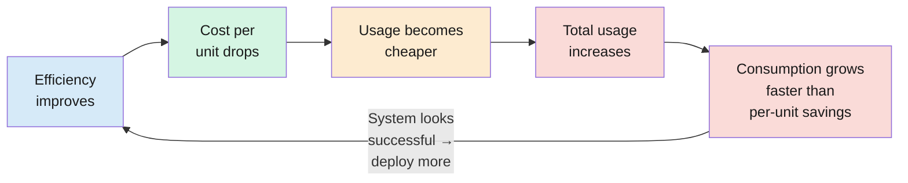

import RevealJS, { Slide } from '@site/src/components/RevealJS';
import Img from '@site/src/components/Img';
import PollSlide from '@site/src/components/PollSlide';

<RevealJS transition="slide">

{/* ============================================ */}
{/* COVER IMAGE */}
{/* ============================================ */}

<Slide>

</Slide>

{/* ============================================ */}
{/* TITLE SLIDE */}
{/* ============================================ */}

<Slide>

# CS 3100: Program Design and Implementation II

## Lecture 37: Performance, Safety, and Sustainability

  &copy;2026 Jonathan Bell & Ellen Spertus, CC-BY-SA

</Slide>

<Slide>

## Looking Ahead

* Today
  * Lecture: Highlights of skipped lectures Performance, Safety, and Sustainability
  * Practice final distributed
  * TRACE
* Tuesday
  * Lab 14: The Future of Programming
* Wednesday
  * Lecture: The Future of Programming
* Thursday
  * Lecture: Review
  * Course Survey
  * Due date: Feature Buffet
* Next Monday, 4/20
  * Due date: Final Project Report
* Next Tuesday, 4/21
  * Final exam, 10:30-12:30

<aside className="notes">

</aside>

</Slide>

{/* ============================================ */}
{/* PERFORMANCE */}
{/* ============================================ */}

<Slide>
## L34: Performance

  

</Slide>

<Slide>

## Learning Objectives

After this lecture, you will be able to:

<ol style={{fontSize: '0.75em', textAlign: 'left'}}>
  <li>Reason about algorithmic growth using Big-O notation</li>
  <li>Identify* performance bottlenecks: measure, don't guess</li>
  <li>~~Analyze the performance impact of architectural decisions~~</li>
  <li>~~Apply common patterns to improve performance~~</li>
</ol>

  

* You will know that tools exist to find performance bottlenecks.

</Slide>

<Slide>
## Big-O Describes How Code Scales, Not How Fast It Is

CC-BY-2.0 [Dunk](https://www.flickr.com/photos/dullhunk/51957970066/in/photostream/)

</Slide>

<Slide>
## Poll: Rank operations by increasing time complexity

<PollSlide username='espertus'
  choices={
    [
      "Comparing every pair of items in a list",
      "Performing binary search",
      "Retrieving a value from a key in a HashMap",
      "Searching for an item by iterating over a list",
      "Sorting a list"
    ]
  }
/>
Assume all data structures have *n* items.

</Slide>

<Slide>

## Big-O in SceneItAll

| Notation | Name | SceneItAll example |
|----------|------|--------------------|
| **O(1)** | Constant | `HashMap` lookup by device id |
| **O(log n)** | Logarithmic | Binary search sorted devices |
| **O(n)** | Linear | Iterate all devices by name |
| **O(n log n)** | Linearithmic | Sort 1,000 devices |
| **O(n²)** | Quadratic | Compare every device pair |

Linear search can be faster than binary search — when n is small. 
Big-O is about what happens for large inputs.

</Slide>

<Slide>

## Flame Graphs Show Where Time Goes

**Tools (know they exist, not details):** JFR (Java Flight Recorder, built into JDK), flame graphs, heap dumps

<aside className="notes">
**Flame graphs are the most useful profiling visualization.** The width of each box represents the proportion of CPU time spent in that method. Wider = more time = higher priority to optimize.

**The SceneItAll example concretizes the measurement principle:**
- computeOptimal() is called infrequently but is computationally expensive — it dominates the profile
- getById() is called 50,000 times per second but each call is O(1) HashMap lookup — negligible total

**Tools for reference:**
- JFR (Java Flight Recorder): Built into the JDK, low overhead, production-safe
- Flame graphs: Visual representation of where CPU time goes
- Heap dumps: Snapshot of all live objects — use when you suspect a memory leak

→ Performance has several dimensions
</aside>

</Slide>

<Slide>

## Performance Has Several Dimensions That Trade Off

| Metric | What it measures | Example |
|--------|-----------------|---------|
| **Latency** | Time for a single operation | "How long until the user sees their grade?" |
| **Throughput** | Operations per unit time | "How many submissions per minute?" |
| **Memory** | Heap/stack consumption | "How much RAM for 1,000 devices?" |
| **CPU** | Processor time consumed | "CPU-bound or I/O-bound?" (recall L32) |

Optimizing one can worsen another: <strong>caching reduces latency but increases memory.</strong>

<aside className="notes">
</aside>

</Slide>

<Slide>
## Bonus Slide

  

    

      <a href="https://xkcd.com/1691/">xkcd #1691 "Optimization"</a> by Randall Munroe, <a href="https://creativecommons.org/licenses/by-nc/2.5/">CC BY-NC 2.5</a>
    

  

  

    

      <a href="https://xkcd.com/1319/">xkcd #1319 "Automation"</a> by Randall Munroe, <a href="https://creativecommons.org/licenses/by-nc/2.5/">CC BY-NC 2.5</a>
    

  

</Slide>

{/* ============================================ */}
{/* SAFETY AND RELIABILITY */}
{/* ============================================ */}

<Slide>
  

</Slide>

<Slide>

## Learning Objectives

After this lecture, you will be able to:

<ol style={{fontSize: '0.75em', textAlign: 'left'}}>
  <li>Distinguish safety from reliability</li>
  <li>Apply the Swiss cheese model to analyze layered defenses</li>
  <li>~~Analyze blast radius and fail-safe design~~</li>
  <li>~~Recognize prior course concepts as safety mechanisms~~</li>
  <li>~~Evaluate safety trade-offs against cost, complexity, and performance, and explain why professional judgment is currently the primary safety mechanism in most software~~</li>
</ol>

<aside className="notes">
</aside>

</Slide>

<Slide>

## Reliable, Available, and Safe Are Three Different Things

**Reliable**

Does what it's supposed to do, consistently.

*Measure:* error rates, MTBF

*SceneItAll:* activates scenes correctly 99.99% of the time

**Available**

Accessible when users need it.

*Measure:* "nines" — 99.9% = 8.7 hrs downtime/yr

*GitHub:* multiple major outages Feb–Mar 2026 (auth DB overload, Actions failover failures)

**Safe**

Avoids harm, **even when it fails.**

*Measure:* incident severity — did anyone get hurt?

*Key:* a property of the **failure mode**, not the happy path

- **Reliable and unsafe:** A medical device delivers correct doses 99.99% of the time — but its failure mode is lethal. Reliable? Extremely. Safe? Not if one failure kills a patient.

- **Safe but unreliable:** Hub crashes frequently but preserves device state.

<aside className="notes">
**The critical insight is the medical device example.** Students' intuition is that reliable = safe. Keep it generic here — the Therac-25 case study comes later and will hit harder if students haven't already heard the punchline. For now, just establish the principle: reliability measures how often something works, safety measures what happens when it doesn't.

**GitHub availability (Feb–Mar 2026):** Three major outages — Feb 2, Feb 9, Mar 5. Root causes: a tenfold spike in read traffic from client apps overloaded the auth database (a cache TTL reduced from 12 to 2 hours made it worse), and Actions failover exposed latent Redis config issues. GitHub is now migrating to Azure (12.5% → 50% by July) and decomposing the monolith. Classic architectural coupling: localized failures cascaded across services.

**The hub example:** If SceneItAll's hub crashes every day but always preserves device state, keeps doors locked, and keeps lights on, it's unreliable but relatively safe. Annoying, but not dangerous.

> **Transition:** If safety isn't a feature, where does it come from?
</aside>

</Slide>

<Slide>
## Poll: How does the cost of fixing safety issues grow?

As a product moves from design through implementation, launch, and widespread use,
how does the cost of addressing safety issues grow?
<PollSlide username='espertus'
  choices={["It stays about the same", "It increases linearly", "It increases exponentially"]}
/>

A firmware update on day one is moderate effort. After a bricking incident, it's a migration <em>plus</em> legal costs, customer replacements, and reputational damage.

</Slide>

<Slide>

## The Swiss Cheese Model: Harm Requires Aligned Holes

A single layer with holes is not necessarily dangerous on its own. The problem is when someone <strong>removes a layer entirely</strong>, or when holes grow larger without anyone noticing.

</Slide>

<Slide>
## Poll: What would it take to convince you that software is bug-free?

<PollSlide username='espertus'
  choices={["100% coverage (branch and line) by tests", "expert human code review", "AI review", "all of the above", "none of the above"]}
/>

</Slide>

<Slide>

## Three Disasters, One Pattern: Removing Layers Is Removing Safety

| Aspect | Therac-25 | Boeing 737 MAX | CrowdStrike Falcon |
|--------|-----------|----------------|-------------------|
| **What was replaced?** | Hardware interlocks | Airframe redesign + pilot training | Manual security review |
| **Replaced with?** | Software safety checks | MCAS software automation | Automated content update pipeline |
| **Why?** | Cheaper, lighter | Cheaper, faster certification | Speed — security threats need rapid response |
| **Layer removed?** | Hardware interlock layer | Sensor redundancy + training | Staged rollout for content updates |
| **Critical flaw?** | Race conditions | Single point of failure | No rollback path when kernel crashes |
| **Consequences?** | People received lethal radiation | Planes crashed | 8.5M machines soft-bricked |

**Three questions to ask** when replacing hardware/human judgment with software:
1. What failure modes does **software introduce** that the original didn't have?
2. Is there **redundancy?** What happens when the single sensor/input fails?
3. Can **humans override** the automation when it's wrong?

<aside className="notes">
**This is the synthesis slide.** The three case studies span 40 years (1985-2024) and three different domains (medical devices, aviation, cybersecurity). The pattern is identical: replace a safety mechanism (hardware, human judgment, manual process) with software because it's cheaper/faster, and remove the layer without adding a compensating defense.

**The three questions** are the practical takeaway. When students encounter a design decision that replaces a safety mechanism with software, they should ask these questions. Boeing fails all three: MCAS introduced single-point-of-failure behavior the airframe didn't have, there was no redundancy on the basic configuration, and pilots couldn't override because they didn't know the system existed.

**Distributional preview:** This pattern reveals a distributional question: Boeing sold redundancy as an optional upgrade — cost savings to airlines, risk to passengers. L36 will formalize this: "who profits from a design decision, and who bears the risk?"

</aside>

</Slide>

<Slide>

## Bonus Slide

</Slide>

{/* ============================================ */}
{/* SUSTAINABILITY */}
{/* ============================================ */}

<Slide>
## Sustainability

  
  </Slide>

<Slide>

## Learning Objectives

After this lecture, you will be able to:

<ol style={{fontSize: '0.75em', textAlign: 'left'}}>
  <li>Define software sustainability as a meta-quality attribute</li>
  <li>Apply the four dimensions of sustainability to evaluate design trade-offs</li>
  <li>Recognize how efficiency gains can increase total resource consumption</li>
  <li>Evaluate who benefits and who bears risk in design trade-offs</li>
</ol>

</Slide>

<Slide>

## From Safety to Sustainability: Generalizing "Who Profits, Who Bears Risk?"

In L35, we saw Boeing sell sensor redundancy as an **optional upgrade**. Budget airlines saved money. Passengers bore the risk — without knowing it.

That distributional question — **who benefits, who pays, over what time horizon** — is the core question of sustainability.

**L1 callback:** "Software engineering is the integral of programming over time." Every lecture since has been about what that integral measures. Today we name it.

<aside className="notes">
**Bridge from L35:** Tuesday we ended with "who profits from a design decision, and who bears the risk?" — applied to safety-critical systems. Today we generalize: that question applies to every design decision, not just safety decisions.

**L1 callback:** In L1, we defined SE as "the integral of programming over time." That definition has been the through-line. Readability (L5) is readable over time. Coupling (L7) is changeable over time. Testing (L15) is correct over time. Performance (L34) is fast over time. Safety (L35) is safe over time. Today: sustainability is the name for what that integral computes.

> **Transition:** So what exactly is sustainability?
</aside>

</Slide>

<Slide>

## SceneItAll's Success Disaster

SceneItAll launches. 50 beta homes. Everything works. Fast, reliable, safe. Great reviews.

| What went right | What happened next |
|----------------|-------------------|
| Fast firmware updates | Team pushes 10x more often; total traffic doubles |
| Reliable occupancy sensing | Insurance companies want the data; users never consented |
| Accessible on modern phones | 100,000 homes; users with screen readers can't configure scenes |
| Free cloud tier covers costs | Growth past the free tier; locked into vendor pricing |
| Small team ships fast | Original devs leave; no one understands the Zigbee adapter code |

Nothing <strong>broke.</strong> The system <strong>succeeded</strong> — and the success created problems the original design never anticipated.

<aside className="notes">
**This is the "success disaster" slide.** Every row in this table is something that went RIGHT — and then created a new problem at scale. Students should feel the tension: good engineering decisions that become sustainability liabilities over time.

**Walk through 2-3 rows:** The firmware update row connects to Jevons' paradox (coming later). The occupancy row connects to social sustainability. The accessibility row connects to L28 — the system works for its original users but excludes new ones.

**Key insight:** L35 asked "what happens when this fails?" This lecture asks the harder question: "what happens when this succeeds?"

> **Transition:** Let's name what's happening here...
</aside>

</Slide>

<Slide>

## Sustainability: What Happens When This Succeeds?

**Definition (Patricia Lago et al.):** "Preservation of long-term beneficial use of software, and its appropriate evolution, in a context that continuously changes."

**The key word is "beneficial."** SceneItAll's occupancy data *is* useful — for the homeowner. It's *harmful* — for the homeowner whose data is sold. Same feature, different stakeholders, different time horizon.

Sustainability is not another quality attribute to add to the list. It is the **meta-quality attribute** — it asks whether all the other quality attributes (performance, safety, accessibility, changeability) **hold up over time, and for whom.**

Lago distinguishes two directions: **sustainable software** (inward — is the artifact itself maintainable, efficient, evolvable?) and **software for sustainability** (outward — does the software support sustainable processes in the world?). Both matter.

<aside className="notes">
**Lago et al. (2024)** formalized this in a comprehensive ACM Computing Surveys paper. The key contribution: sustainability is not one dimension. It has four dimensions that interact and sometimes conflict (next slides).

**Inward vs outward:** "Sustainable software" is about the artifact — can we maintain it, is it energy-efficient, does it resist software rot? "Software for sustainability" is about what the software enables — does Pawtograder make education more accessible? Do SceneItAll's energy-saving scenes actually reduce household energy use? A system can be inwardly sustainable (clean code, low coupling) but outwardly unsustainable (enables behaviors that harm people or the environment).

**The "beneficial" insight:** A system can be technically excellent and socially harmful. It can be economically viable and environmentally destructive. "Beneficial" forces you to ask: beneficial to whom?

**Connect to L4/L9:** Specification debt (L4) — ambiguous specs create a "hidden decision factory" where choices compound. Requirements cost escalation (L9) — fixing a requirements error costs 1x during gathering, 100x after deployment. Both are sustainability stories.

> **Transition:** Safety and sustainability look similar. What's the difference?
</aside>

</Slide>

<Slide>

## Safety vs. Sustainability: Two Different Questions

**Safety (L35)**

"What happens when this **fails?**"

- Therac-25 race condition
- Boeing single sensor
- CrowdStrike boot loop

Focus: **failure modes.** Who gets hurt when things go wrong?

**Sustainability (today)**

"What happens when this **succeeds**?"

- SceneItAll occupancy data sold
- Pawtograder narrows curriculum
- LLM subsidy reshapes labor market

Focus: **success modes.** Who bears the cost when things go right?

<aside className="notes">
**The distinction is subtle but important.** Safety is about failure — when the system breaks, who gets hurt? Sustainability is about success — when the system works exactly as designed and scales, what unintended consequences emerge?

**Both use the same distributional question** from L35: who profits, who bears risk? But safety analyzes this in the failure case, and sustainability analyzes it in the success case.

**The examples on the right are all "success disasters":** SceneItAll's occupancy sensing works perfectly — that's the problem. Pawtograder's auto-grading scales beautifully — that's the problem. LLM pricing drops — that's the problem. Each success creates new stakeholders and new risks.

> **Transition:** You've actually been building sustainability mechanisms all semester...
</aside>

</Slide>

{/* ============================================ */}
{/* ARC 2: FOUR DIMENSIONS (~10 min) */}
{/* ============================================ */}

<Slide>

## Technical Sustainability: Can the System Be Maintained and Evolved?

  

The dimension you know best. Low coupling, testability, readable code, clear contracts.

**SceneItAll:** Hexagonal architecture (L16) lets the team swap the Zigbee adapter for a Matter adapter without rewriting scene activation logic.

**The test:** Can a new developer join and make changes? Can you replace a dependency without a rewrite?

<aside className="notes">
**This is familiar territory.** Most of the semester has been about technical sustainability — writing code that other people (including your future self) can understand, modify, and extend. The four-dimensions diagram will reappear on each dimension slide with the current dimension highlighted.

**Key insight for students:** Technical sustainability is necessary but not sufficient. A system can be beautifully architected and still unsustainable if it's too expensive to run, too energy-intensive to scale, or exclusionary to certain users.

> **Transition:** The next dimension is less obvious...
</aside>

</Slide>

<Slide>

## Economic Sustainability: Is the Total Cost of Ownership Viable?

Beyond hosting costs: developer time, dependency cost, lock-in risk, support burden, opportunity cost.

**Pawtograder:** GitHub Actions free tier covers current grading volume — but growth past the free tier means GitHub's pricing, not yours. And if GitHub changes their API? Every autograder integration breaks.

**License changes are an economic hazard:** MongoDB (AGPL to SSPL), HashiCorp (MPL to BSL) — your dependency's license can change under you.

**L23 Recall:** OpenSSL secured most of the internet — maintained by a handful of volunteers until Heartbleed exposed how underfunded critical infrastructure can be. Economically unsustainable open source is a **supply chain risk** for everyone who depends on it.

<aside className="notes">
**Key insight:** Economic sustainability includes costs that don't show up on your cloud bill. Developer time to understand a dependency, cost of migrating when a vendor changes terms, support burden when users hit edge cases — these are all real costs.

**OpenSSL story (L23 callback):** Before Heartbleed in 2014, OpenSSL had essentially one full-time developer maintaining code that secured most HTTPS connections worldwide. That's economically unsustainable. After Heartbleed, the Core Infrastructure Initiative was created to fund critical open-source projects — but many similar projects remain underfunded.

> **Transition:** The third dimension is increasingly urgent...
</aside>

</Slide>

<Slide>

## Environmental Sustainability: What Resources Does the System Consume?

Direct compute costs (energy, hardware, cooling) **plus** indirect effects (does the system enable behaviors that consume more resources?).

**L20 callback:** "Every network request requires CPU cycles, network interface power, router power, server CPU, data center cooling." Batching saves energy, not just latency.

<aside className="notes">
**Brief slide — tee up Jevons.** Don't spend long here. The key point is that environmental sustainability isn't just "use less CPU." It includes the indirect effects — what behaviors does the system enable? We'll explore this in depth with Jevons' paradox in Arc 3.

> **Transition:** The fourth dimension is the most human...
</aside>

</Slide>

<Slide>

## Social Sustainability: Who Does the System Serve?

Accessibility (L28), inclusivity, fairness, privacy. **Indirect stakeholders emerge over time.**

**SceneItAll usage analytics:**
- At **50 beta homes** — occupancy data is a debugging tool
- At **100,000 homes** — the same data is a burglary-risk or insurance-discrimination vector

The system didn't change. The stakeholder population did.

<aside className="notes">
**The scale-changes-everything point:** This connects directly to L35's safety debt concept — the same holes in your Swiss cheese become more dangerous as the blast radius grows. Here the "holes" are privacy practices that were fine at small scale but harmful at large scale.

**L28 callback:** Accessibility is a social sustainability issue. If your system serves sighted users today but can't be used with a screen reader, it's socially unsustainable — the user population will grow more diverse over time, not less.

> **Transition:** These four dimensions don't operate independently...
</aside>

</Slide>

<Slide>

## The Dimensions Interact — and Conflict

<table style={{fontSize: '0.62em', tableLayout: 'fixed', width: '100%'}}>
<colgroup>
<col style={{width: '18%'}} />
<col style={{width: '20%'}} />
<col style={{width: '20%'}} />
<col style={{width: '22%'}} />
<col style={{width: '20%'}} />
</colgroup>
<thead>
<tr><th>Decision</th><th>Technical</th><th>Economic</th><th>Environmental</th><th>Social</th></tr>
</thead>
<tbody>
<tr><td>Monolith to microservices</td><td>Better: independent deployment</td><td>Worse: operational complexity</td><td>Worse: network overhead, container sprawl (L20)</td><td>Neutral</td></tr>
</tbody>
<tbody className="fragment">
<tr><td>Add WCAG accessibility</td><td>Moderate effort</td><td>Higher dev cost</td><td>Neutral</td><td>Better: inclusive (L28)</td></tr>
<tr><td>Switch to serverless</td><td>Moderate: vendor-specific APIs</td><td>Better: pay-per-use (L21)</td><td>Mixed: no idle waste but cold start overhead</td><td>Worse: vendor lock-in limits self-hosting</td></tr>
<tr><td>Keep all telemetry forever</td><td>Simpler: no retention policy</td><td>Worse: storage costs grow linearly</td><td>Worse: ~98% of data center data is "dark data" — never used (Lago)</td><td>Worse: privacy risk grows with data volume</td></tr>
</tbody>
</table>

No decision optimizes all four. Sustainability analysis makes trade-offs <strong>visible</strong> — not resolved.

<aside className="notes">
**Walk through one row in detail.** The microservices row is a good one: it improves technical sustainability (teams can deploy independently) but worsens economic (more infrastructure to manage) and environmental (more network calls, more containers, each with overhead per L20). Social is roughly neutral.

**Key takeaway:** There is no universally "sustainable" choice. The framework's value is making trade-offs explicit so decision-makers can weigh them deliberately rather than stumbling into consequences.

> **Transition:** The environmental dimension has a surprising twist. Let's look at what happens when you make software more efficient...
</aside>

</Slide>

{/* ============================================ */}
{/* ARC 3: JEVONS' PARADOX + ORDER EFFECTS (~12 min) */}
{/* ============================================ */}

<Slide>

## Discussion

In the 1860s, improvements in coal engines led to greater efficiency (less coal required for the same amount of work).

Do you think this led to **less** or **more** coal usage?

</Slide>
<Slide>

## Jevons' Paradox: Efficiency Is Not Sustainability

**1865:** More efficient coal engines led to **more** total coal consumption. Efficiency made it cheaper, expanding use faster than per-unit savings.

| Technology | Per-unit gain | Total consumption |
|-----------|--------------|-------------------|
| Cloud computing | Cheaper per hour | Total energy skyrocketed |
| Web + CDNs | Faster per byte | Pages: 100KB → 4MB |
| CI/CD | Cheaper per build | Vastly more builds |
| LLM inference | Cheaper per token | AI compute exploding |

  

Making software faster/cheaper does not automatically make it more sustainable.

<aside className="notes">
**This is the key reversal of the lecture.** Students assume that efficiency improvements reduce resource consumption. Jevons' paradox says the opposite often happens.

**Historical context:** Jevons was writing about coal in Victorian England. The same pattern appears in every technology domain: highways (more lanes = more driving), storage (bigger drives = more data kept), bandwidth (faster connections = larger media files).

> **Transition:** Let's see why this is a self-reinforcing loop...
</aside>

</Slide>

<Slide>

## The Jevons Cycle: Why Efficiency Feeds Itself

The loop is self-reinforcing. Each efficiency gain makes the next round of expansion cheaper.

<aside className="notes">
**The cycle is the key visual.** Students need to see that Jevons isn't a one-time effect — it's a feedback loop. Each round of efficiency improvement lowers the barrier, which increases usage, which justifies more investment in efficiency, which lowers the barrier further.

**Cloud computing example:** More efficient VMs → cheaper compute → more workloads migrate to cloud → total cloud energy skyrockets → invest in even more efficient VMs → cycle continues.

> **Transition:** You're living inside this cycle right now...
</aside>

</Slide>

<Slide>

## You're Living Inside Jevons' Paradox: Pawtograder

Efficient automated grading enables **unlimited submissions**. Students submit 3,000-12,000 times per day across the course.

Before: submit once, human grades. The <em>system</em> is more efficient; the <em>total resource consumption</em> is higher.

<aside className="notes">
**Make it personal.** Students are experiencing Pawtograder's Jevons' paradox right now. They submit frequently because the system makes it cheap — container spin-up, test execution, result reporting — all automated and fast. Before automated grading, they'd submit once or twice and wait for a human. The per-submission cost is tiny; the aggregate compute is significant.

**Not a moral judgment:** This isn't "students are wasteful." Unlimited submissions genuinely help learning. The point is that efficiency creates new usage patterns, and those patterns have costs.

> **Transition:** The most striking example of this pattern is happening in AI right now...
</aside>

</Slide>

<Slide>

## LLMs: Jevons' Paradox as a Business Strategy

Per-token API prices have dropped across model generations even as power and usage have surged. 

| Cost layer | Who pays | Who benefits |
|-----------|---------|-------------|
| GPU hardware + energy | Cloud providers (passed to AI companies) | Developers using the tools |
| Training data creation | Original authors (often unconsented) | AI companies + users |
| Subsidy gap (~\$200 vs ~\$5,000 estimate) | AI company investors (for now) | Individual developers |
| Environmental externality | Everyone (carbon emissions) | Direct users of the service |
| Labor displacement risk | Workers in affected roles | Companies reducing headcount |

"Who profits, who bears risk?" applied to the tools you use every day.

<aside className="notes">
**Caveats to share if asked:**
- The ~$5,000 figure is a back-of-envelope classroom estimate for a very heavy individual workflow at published list API rates for premium models. It is not an official bill or guarantee.
- Per-query energy estimates for LLMs vary widely. Early popular claims of ~10x a Google search are time-bound and scenario-dependent. Oviedo et al. (arXiv:2509.20241, Sep 2025) estimate a median ~0.34 Wh per query for large frontier models, with wide spread, and report that naive non-production extrapolations can overstate energy by ~4-20x.
- The strategic pattern still matches Jevons: subscription pricing expands usage relative to pay-as-you-go.

**The cost stack table is the key visual.** Walk through each row: who pays and who benefits are different groups. That distributional mismatch is a sustainability concern — the same pattern from Boeing selling redundancy as optional.

> **Transition:** Let's practice spotting the pattern...
</aside>

</Slide>

<Slide>

## Digital Sufficiency: Should We Build This at All?

Jevons asks whether efficiency reduces total consumption. **Sufficiency** asks a more radical question: is this technology needed in the first place?

| Efficiency question | Sufficiency question |
|-------------------|---------------------|
| How do we make this drone software more energy-efficient? | Efficient medical drones get cheap enough to become toys — negating all the efficiency gains at scale |
| How do we optimize data center storage? | Should we be storing 98% "dark data" that no one will ever read? |
| How do we make LLM inference cheaper per token? | Should you be using an LLM for this task, or would `grep` do? |
| How do we make SceneItAll updates faster? | Does every light bulb need a WiFi chip and cloud connection? |

<aside className="notes">
**This concept comes from Lago's ICSA 2025 keynote.** She distinguishes efficiency (optimize what we produce) from sufficiency (assess whether we should produce it at all). This is a harder question — and one that engineers rarely ask.

**The drone example is Lago's:** Efficient medical drones are a sustainability win. But if affordable drones become toys, all the efficiency gains are negated — you're now mass-producing drones with significant environmental impact for entertainment. That's a rebound effect driven by sufficiency failure.

**The LLM row is the most personal for students:** They've been using Claude Code all semester. Sometimes an LLM is the right tool. Sometimes `grep`, `git log`, or reading the code is faster, cheaper, and more sustainable. Sufficiency is about choosing the right tool, not just optimizing the one you have.

**The dark data statistic:** Lago cites estimates that ~98% of data managed in data centers is "dark data" — data that is stored but never accessed. That's energy consumed to maintain storage that provides no value. A sufficiency approach would ask: do we need to store this?

> **Transition:** Whether the question is efficiency or sufficiency, effects cascade...
</aside>

</Slide>

<Slide>

## First, Second, and Third-Order Effects

| | 1st-order (direct) | 2nd-order (behavioral) | 3rd-order (systemic) |
|---|---|---|---|
| **SceneItAll** | Hub uses power to run | Convenience increases total energy use; usage data reveals when you're home | Insurance pricing and surveillance reshape around smart-home data |
| **Pawtograder** | Each submission uses compute | Unlimited submissions change study habits — autograder becomes the debugger | If every course auto-grades, assignments gravitate toward what's auto-gradeable, narrowing what students learn |
| **LLM Agents** | GPU inference per prompt | Developers write more code, explore more approaches, iterate faster | Labor market restructures; codebases grow faster than teams can understand them |

"If this system is wildly successful, what behaviors does it enable, and who is affected?"

<aside className="notes">
**Walk through one system at a time, pausing at each order.** Each click reveals the next effect. The pedagogical goal is for students to *feel* the cascade — each order is less predictable than the last.

**SceneItAll (fragments 1-3):** Start here because it's familiar. First order is obvious — the hub draws power. Second order is a behavioral shift — people use more energy because automation makes it frictionless, and usage data creates an occupancy signal nobody asked for. Third order is systemic — insurance companies and surveillance systems reorganize around data that exists only because the product succeeded.

**Pawtograder (fragments 4-6):** This one is personal. First order is boring compute cost. Second order — ask students: "How many of you have submitted just to see what the autograder says?" That behavioral shift is a second-order effect of making submissions free. Third order — if autograding scales to every course, what kinds of assignments disappear? Design critiques, open-ended projects, anything that requires human judgment to evaluate.

**LLMs (fragments 7-9):** The most current. First order is GPU cost per prompt. Second order — developers produce more code (Jevons' paradox from the previous slide, applied to code volume). Third order — if codebases grow faster than teams can understand them, and junior roles contract, who maintains all that code? This connects directly to L38 (Future of Programming).

**The purple question (fragment 10)** is the design heuristic. You can't predict all second- and third-order effects. But you can ask the question early and revisit it as the system scales.

> **Transition:** So how do we reason about who benefits and who bears risk?
</aside>

</Slide>

{/* ============================================ */}
{/* ARC 4: WHO BENEFITS, WHO BEARS RISK (~13 min) */}
{/* ============================================ */}

<Slide>

## Real Decision: The Azure Outage

October 2025. Azure goes down. GitHub Actions stops running. Pawtograder can't grade submissions. Two options:

| | Option A: Self-hosted fallback | Option B: Stay GitHub-dependent |
|--|-------------------------------|-------------------------------|
| **Technical** | Complex failover logic; two systems to maintain | Simpler architecture; single system |
| **Economic** | Duplicate infrastructure costs | Leverage free tier; lower total cost |
| **Environmental** | Idle fallback resources most of the time | Shared infrastructure, higher utilization |
| **Social** | Resilient — students don't lose access during outages | Equal access for all institutions (no self-hosting expertise needed) |

No right answer. The four-dimensional analysis makes the trade-offs <strong>visible</strong>.

<aside className="notes">
**This is a real decision we faced.** When Azure went down and GitHub Actions stopped, students couldn't get grades on their submissions. The temptation was to build a self-hosted fallback. But look at the trade-offs: technical complexity doubles, economic cost doubles, environmental waste (idle resources), and social sustainability actually goes both ways — more resilient for our students, but harder for other institutions to replicate.

**The point isn't to find the "right" answer.** It's that without the four-dimensional analysis, you'd likely choose based on technical elegance or personal frustration alone, missing the social and environmental implications.

> **Transition:** Now you try — analyze a new feature request through all four dimensions...
</aside>

</Slide>

{/* ============================================ */}
{/* ARC 5: COURSE CAPSTONE (~10 min) */}
{/* ============================================ */}

<Slide>

## System Design Is Never Value-Neutral

**The Karlskrona Manifesto on Sustainability Design (2015):** foundational consensus document from ~30 software engineering researchers.

Core principle: every architecture, API, and default setting reflects assumptions about **who matters** and **what matters**.

Sustainability is the practice of making those assumptions **explicit** and revisiting them as the system and its context evolve.

<aside className="notes">
**The Karlskrona Manifesto:** Published in 2015 by about 30 prominent SE researchers. It established sustainability as a first-class concern in software engineering, not an afterthought. The core insight: design decisions are never neutral — they always encode value judgments, even when the designer doesn't realize it.

**This connects to the L35 theme:** In L35 we saw that Boeing's decision to make sensor redundancy optional was a value judgment (cost savings over safety). The Karlskrona Manifesto says ALL design decisions are like this — they just have less dramatic consequences most of the time.

> **Transition:** Let's make this concrete with the choices you've seen in this course...
</aside>

</Slide>

<Slide>

## Every Design Decision Encodes a Value Judgment

Pawtograder's choices encode values — whether we thought about them or not:

- **Unlimited submissions** values learning-by-iteration over compute efficiency
- **Requiring GitHub** values standardization over universal access
- **Auto-grading** values scale over human nuance

The question is not whether your design encodes values. It's whether you <strong>chose</strong> them deliberately.

<aside className="notes">
**The three bullet points are personal.** Students are living inside these value judgments right now. Unlimited submissions is a choice we made — it values iteration over efficiency. Requiring GitHub is a choice — it values platform consistency over universal access. Auto-grading is a choice — it values scale over the nuance a human grader provides.

**Make trade-offs visible so decision-makers understand who bears the cost.** That's the goal.

> **Transition:** Step back — what has this semester been about?
</aside>

</Slide>

<Slide>

## The Integral of Programming Over Time

L1: "Software engineering is the integral of programming over time."

**Sustainability is what that integral computes.**

Go build software that provides value over time, to the people who need it, without imposing unacceptable costs on the people who don't.

<aside className="notes">
**This is the emotional close.** L1 opened the semester with a promise: software engineering is not programming. Programming is writing code that works today. Engineering is writing code that works tomorrow, next year, and for people you haven't met.

Every lecture has been a different lens on that promise — readability, coupling, testing, architecture, safety, performance. Sustainability is the name for what they all have in common: designing software that continues to provide value over time, to the people who need it, without imposing unacceptable costs on the people who don't.

**Let the slide breathe.** Don't rush through this. Pause after reading the final line.

</aside>

</Slide>

<Slide>

## The State of CS 3100

This class has been challenging. We want to improve it.

Plans:
* Administration will carefully review TRACE feedback.
* We will offer another survey (with credit).

In the remaining time, please:
* Complete TRACE
* Suggest/upvote/downvote questions for the survey

</Slide>

</RevealJS>