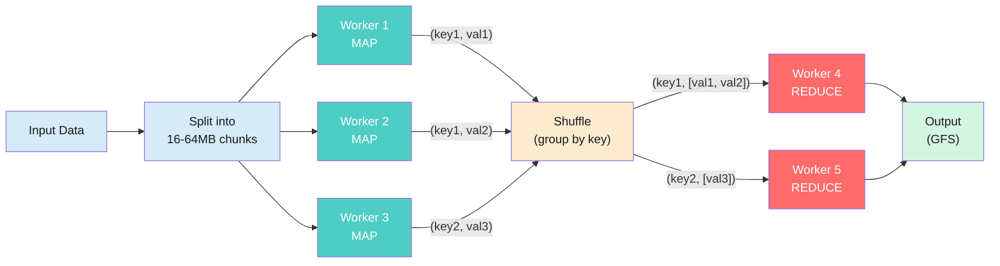
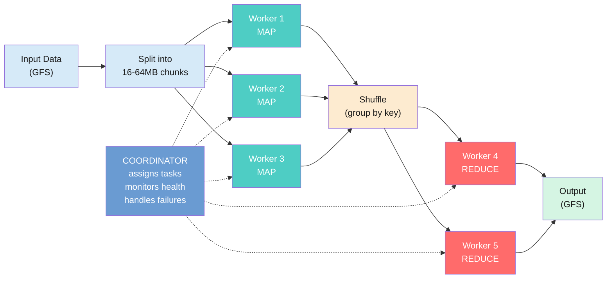
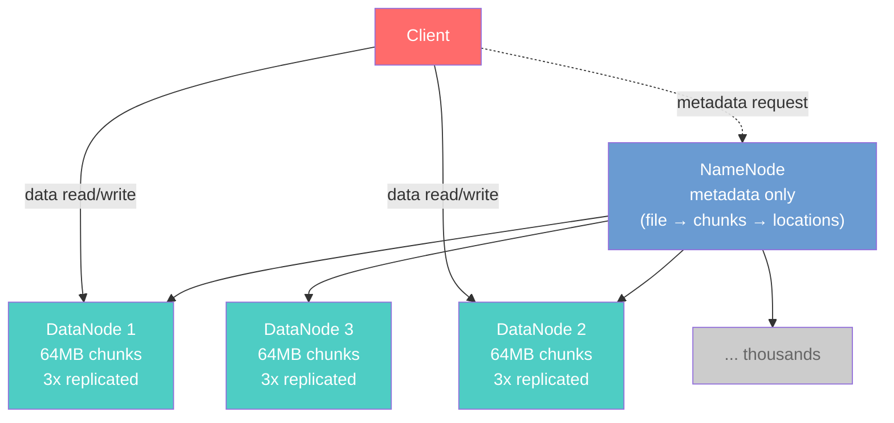

import RevealJS, { Slide } from '@site/src/components/RevealJS';
import Img from '@site/src/components/Img';
import PollSlide from '@site/src/components/PollSlide';
import QuoteSlide from '@site/src/components/QuoteSlide';

<RevealJS transition="slide">

{/* ============================================ */}
{/* COVER IMAGE */}
{/* ============================================ */}

<Slide>
  <Img
    src="/img/lectures/web/l37.png"
    prompt={"Concept: 'Design Case Study: MapReduce' (Program Design and Implementation 2). Pixel art educational illustration, 16:9 aspect ratio. A pixel art museum hallway viewed in perspective, receding from left to right. On both walls hang framed paintings in ornate gold pixel art frames, each depicting a computer science concept as a miniature pixel art scene. Left wall, six paintings from front to back: (1) plaque reads 'L6: Information Hiding' — split scene, left side is a 1972 Cold War setting: a bespectacled professor lectures at a dark green chalkboard labeled HIDDEN INTERNALS in a dim classified-feeling office with floppy disks and an SDI Star Wars poster, muted olive and amber tones. Right side is a bright 2012 Google office in cool blues and whites where a diverse group gathers around a whiteboard diagramming observable behaviors as a tangled red dependency graph, Google logo visible through the window. (2) plaque reads 'L7: Coupling and Cohesion' — dramatic split scene. Left half is a stormy dark gray tangle of twelve interconnected modules linked by chaotic wires with lightning bolts and BREAKING CHANGE warnings radiating outward from a central change, ominous grays and angry reds, 12 of 12 modules affected. Right half is a serene archipelago of isolated green islands on calm blue water, each with a tiny pixel character working independently at a desk, only 2 of 12 modules affected by the same change. (3) plaque reads 'L9: Requirements' — four-quadrant composition. Top-left BEFORE panel shows a solitary architect in a suit at a drafting table in a sterile cool-blue modernist office, designing in isolation. Top-right AFTER panel is warmer, a bearded Christopher Alexander figure in earthy tones collaborating with diverse users around a glowing blue planning board. Bottom panels: a cold institutional campus with confused question-marked figures on the left vs a warm lamp-lit communal living space full of people on the right, labeled The Oregon Experiment 1975. (4) plaque reads 'L16: Testability' — split scene. Left: a frustrated pixel character in a hard hat stands amid a tangled mass of dark brown and maroon dependency vines labeled JDBC, HTTP, FileSystem knotted around a Business Logic hub, a red progress bar reads 47 seconds FAIL. Right: the same character stands confidently beside a clean teal hexagonal Domain diagram with neatly separated adapters (StubPriceService, TestSensorAdapter, InMemoryStorage), a green progress bar reads 0.003 seconds PASS. (5) plaque reads 'L19: Architecture' — a panoramic scene with a lone character standing at a crossroads of diverging paths against a purple-mountain twilight sky. From left to right: a crumbling vine-covered shantytown labeled Big Ball of Mud, a neat three-story office for Layered Architecture, a fortified hexagonal fortress for Hexagonal Architecture, a massive gray stone castle for Monolith, a smaller walled compound for Modular Monolith, and a distant fog-shrouded dragon-guarded frontier labeled Distributed Systems Here Be Dragons. A radar chart inset maps quality attribute tradeoffs. (6) plaque reads 'L20: Networks' — split scene. Left: two relaxed pixel developers sit at desks in a warm cozy office, one types hello() and the other instantly replies Got it in 0.0001 seconds, calm amber tones. Right: the same simple call becomes The Chaotic Journey through seven numbered hazards — ocean crossing over a transatlantic cable, latency gauntlet, packet shredder, eavesdropping spies reading HTTP, a firewall rejecting malware, BGP roulette, and a toll plaza — cooler blues and grays with warning-orange accents, multiple retry arrows. Right wall, four paintings from front to back: (1) plaque reads 'L31: Concurrency' — warm amber and brown kitchen scene. Two alarmed chefs in white hats and red-trimmed uniforms stand on either side of a shared stovetop, both reaching for the same pan of boiling pasta while ingredients scatter across the counter. A glowing cyan Stove Key floats near the wall, contrasting against the warm palette. A digital clock reads 00:00. Frantic and comedic mood. (2) plaque reads 'L33: Events' — nighttime city street in deep navy with warm amber building lights. A large glass community bulletin board glows with a cool cyan border at center, displaying posted notices including Evening scene activated. Four distinct pixel characters surround the board — one posting, one crouching to read, one checking a tablet, one holding a clipboard — each reacting independently to the shared announcements. (3) plaque reads 'L34: Performance' — split scene divided by a central magnifying glass labeled PROFILE over a monitor. Left half is a tangle of warm orange and red wiring connecting frowning lightbulbs, angry monitors, slow clocks, and a crawling snail beneath a red-zoned speedometer labeled SLOW. Right half mirrors the same components in clean teal and cyan wiring with smiling faces, green checkmarks, and a speedometer in the green zone labeled FAST. (4) plaque reads 'L35: Safety' — a space scene against a deep starfield. Five upright slabs of Swiss cheese arranged in a row, each riddled with holes and labeled TESTS, REVIEWS, ROLLOUT, OVERRIDE, MONITORING. A red laser beam enters from the left and threads through aligned holes in the first three warm orange and yellow slabs, striking a skull hazard symbol at center. A green energy burst deflects it at the fourth slab, and the final two cool teal and green slabs block remaining paths. A small astronaut character stands safely on the far right. At the far end of the hallway, all the paintings converge visually into one large exhibit piece: a working MapReduce pipeline diagram glowing with teal light, showing data flowing through map workers into a shuffle stage into reduce workers. A small plaque under the exhibit reads 'Case Study: Map Reduce'. A single pixel art student walks down the hallway toward the exhibit, backpack on, seeing all the pieces come together for the first time. The museum floor is polished dark tile reflecting the teal glow. Warm amber lighting on the paintings, cool teal glow on the MapReduce exhibit at the end. Banner text: 'L37: Design Case Study: MapReduce'. Bottom tagline: 'Every Lecture Led Here.' Bottom text: 'CS 3100: Program Design and Implementation 2'. 8-bit lo-fi pixel art style, clean outlines, retro game aesthetic."}
    alt="Pixel art museum hallway with framed paintings of course concepts on both walls — Information Hiding, Coupling and Cohesion, Requirements, Architecture, Testability, Networks on the left; Concurrency, Events, Performance, Safety on the right — converging at the far end into one large glowing MapReduce pipeline exhibit. A student walks toward it. Tagline: Every Lecture Led Here."
  />

</Slide>

{/* ============================================ */}
{/* TITLE SLIDE */}
{/* ============================================ */}

<Slide>

# CS 3100: Program Design and Implementation II

## Lecture 38: MapReduce

<p style={{marginTop: '2em', fontSize: '0.8em', color: '#666'}}>
  &copy;2026 Jonathan Bell & Ellen Spertus, CC-BY-SA
</p>

<aside className="notes">
**Context from previous lectures:**
- L36: Sustainability — "what happens when this succeeds?" Four dimensions, Jevons' paradox, who benefits vs. who bears cost. Ended with: "Go build software that provides value over time."
- Today: We take every design concept from the semester and apply them to one real system — Google's MapReduce and the Google File System (GFS). This is NOT a distributed systems lecture. Students will not implement MapReduce. The goal is to use it as a lens for the entire course.

> **Transition:** Here's what you'll be able to do after today...
</aside>

</Slide>

{/* ============================================ */}
{/* LEARNING OBJECTIVES */}
{/* ============================================ */}

<Slide>

## Learning Objectives

<p style={{fontSize: '0.85em', textAlign: 'left'}}>
After this lecture, you will be able to:
</p>

<ol style={{fontSize: '0.75em', textAlign: 'left'}}>
  <li><em>Give examples of paradigm shifts</em></li>
  <li><em>Give examples of programming paradigms</em></li>
  <li>Describe the MapReduce programming model and GFS at the level needed to analyze their design decisions</li>
  <li>~~Analyze MapReduce and GFS architectural decisions using quality attributes from the course~~</li>
  <li>Identify how MapReduce and GFS apply patterns learned throughout the semester</li>
  <li>~~Evaluate sustainability and trade-off dimensions of MapReduce and GFS~~</li>
  <li><em>Describe how hasty actions can cause lasting damage</em></li>
</ol>

</Slide>

<Slide>

## Reminder: We Want Your Feedback

<div style={{ fontSize: '.8em' }}>
* Complete TRACE if you haven't
   * [AM](https://go.blueja.io/wAkVcAoleESCE1i83zREXg): 11/36 (30%)
   * [PM](https://go.blueja.io/JZT6GlIzeUCbbKvkFq6p0w): 22/38 (57%)
* Qualtrics survey will be part of assignment
* Make yourself eligible for recommendations

TRACE is anonymous, and I won't see results until after grades are in.

You can make changes through April 26.

</div>

<aside className="notes">
I am hurt that students do not complete TRACE when I give them time.
It affects how I think about NU students.
All of you are nominally polite to me, but I feel disrespected.
</aside>

</Slide>

<Slide>

## Paradigm Shifts

<div style={{ fontSize: '.8em' }}>

<div className='fragment'>
A **paradigm** is a way of viewing the world.
</div>

<div className='fragment'>
A **paradigm shift** is a change of worldview.


<p style={{fontSize: '0.6em', color: 'gray'}}>
  "Apparent retrograde motion" by{' '}
  <a href="https://en.wikipedia.org/wiki/User:Cleonis">Cleonis</a>,
  <a href="https://commons.wikimedia.org/wiki/File:Apparent_retrograde_motion.gif">Wikimedia Commons</a>,
  <a href="https://creativecommons.org/licenses/by-sa/2.5/">CC BY-SA 2.5</a>
</p>
</div>

</div>
<aside className="notes">

</aside>

</Slide>

<Slide>

## A Paradigm Shift in Information Retrieval (1990s)

<div style={{ fontSize: '.75em' }}>

<div style={{ display: 'grid', gridTemplateColumns: '1fr 1fr', gap: '1.5rem', marginTop: '1rem' }}>

<div>

**Pre-Web Era (Cathedral)**

<ul>
  <li className="fragment" data-fragment-index="1">Curated, centrally-controlled collections</li>
  <li className="fragment" data-fragment-index="2">Thousands of documents with controlled growth</li>
  <li className="fragment" data-fragment-index="3">Content signals trustworthy — no incentive to game them</li>
</ul>

</div>

<div>

**Web Era (Bazaar)**

<ul>
  <li className="fragment" data-fragment-index="1">Decentralized, chaotic — anyone can publish</li>
  <li className="fragment" data-fragment-index="2">Billions of documents with uncontrolled growth</li>
  <li className="fragment" data-fragment-index="3">Content signals easily gamed (keyword stuffing)</li>
</ul>

</div>

</div>
<div className="fragment" data-fragment-index="5">
Traditional information retrieval algorithms relied on keywords and metadata to find the best matches in flat text collections.
</div>
<div className="fragment" data-fragment-index="5">
That didn't work for web search. *What did?*
</div>
</div>

</Slide>

<Slide>

## PageRank Algorithm


<div style={{ fontSize: '0.6em' }}>

<a href="https://commons.wikimedia.org/wiki/File:PageRanks-Example.svg">en:User:345Kai, User:Stannered</a>, Public domain, via Wikimedia Commons
</div>
<aside className="notes">
I won't go into detail, because this class isn't about IR, but it's good to see examples of paradigm shifts.
→ Let's continue to set the scene...
</aside>

</Slide>

<Slide>
## Moore's Law
  

<div style={{ fontSize: '.5em' }}>
Max Roser, Hannah Ritchie, [CC BY 4.0](https://creativecommons.org/licenses/by/4.0), via [Wikimedia Commons](https://commons.wikimedia.org/wiki/File:Moore%27s_Law_Transistor_Count_1970-2020.png)
</div>
<aside className="notes">
That implies that computers become 1000x as powerful every 20 years or so.

Does that mean that software runs really fast?
</aside>
</Slide>


<Slide>

## Wirth's Law

<QuoteSlide
  quote="Software gets slower more rapidly than hardware gets faster."
  author="Niklaus Wirth"
  />

<aside className="notes">
This has been observed by other people and is also called Page's Law.
</aside>

</Slide>


<Slide>

## Setting the Scene (Early 2000s)

<div style={{fontSize: '0.65em'}}>

In 2003, Google was crawling *billions* of web pages.
</div>

<div className="fragment" style={{fontSize: '0.65em', marginTop: '0.5em'}}>

| | Per web page | Total crawl (billions of pages) |
|--|-------------|-------------------------------|
| **Raw data** | ~100 KB | **Hundreds of TB** |
| **Words to index** | ~500 unique | **Trillions of index entries** |
| **Links to follow** | ~50 outbound | **Hundreds of billions of edges** |

</div>

<div className="fragment" style={{fontSize: '0.65em'}}>
Servers had ~2 TB of storage and had ~1/1000th the power of today's computers.

*How could they store and process all of that information?*
</div>


<aside className="notes">
</aside>

</Slide>


{/* ============================================ */}
{/* ARC 1: THE PROBLEM + PROGRAMMING MODEL (~12 min) */}
{/* ============================================ */}

<Slide>

## Two Systems, One Case Study

<div style={{fontSize: '0.75em'}}>

In 2003-2004, Google published two papers that changed how the industry processes data:

</div>

<div style={{display: 'grid', gridTemplateColumns: '1fr 1fr', gap: '1em', fontSize: '0.7em', marginTop: '0.5em'}}>

<div style={{backgroundColor: 'rgba(100,149,237,0.15)', padding: '0.8em', borderRadius: '8px'}}>

**Google File System (GFS, 2003)**

Stores data across thousands of machines. A **NameNode** (GFS **master**) manages metadata (which machines hold which chunks). **DataNodes** (GFS **chunkservers**) store the actual data.

*Solved the storage problem.*

</div>

<div style={{backgroundColor: 'rgba(78,205,196,0.15)', padding: '0.8em', borderRadius: '8px'}}>

**MapReduce (2004)**

Distributes computation across thousands of machines. A **coordinator** assigns tasks and handles failures. **Workers** execute user-defined functions.

*Solved the computation problem.*

</div>

</div>

<div className="fragment" style={{fontSize: '0.75em', marginTop: '0.5em', backgroundColor: 'rgba(147,112,219,0.15)', padding: '0.8em', borderRadius: '8px'}}>

Today we use these systems as a lens to see **every concept from the semester** in one place — coupling, cohesion, information hiding, requirements, architecture, concurrency, consistency, performance, safety, and sustainability.

</div>

<aside className="notes">
**Set the stage before diving into requirements.** Students need to know what the two systems are and what role each plays before they can appreciate the requirements that shaped them.

**Terminology note:** The GFS paper names the metadata service the **master** and the chunk-storing workers **chunkservers**—matching [lecture-notes/l37-map-reduce](/lecture-notes/l37-map-reduce). **NameNode** and **DataNode** are the usual HDFS names for those same roles: **NameNode** is the analog of the **master**, and each **DataNode** is a **chunkserver**. These slides use the HDFS labels for familiarity; map them to master/chunkserver when you read the GFS paper or the notes. For MapReduce we use **coordinator/worker** throughout this lecture.

**The "lens" framing** is the key pedagogical move: this is NOT a distributed systems lecture. Students will not implement MapReduce. The goal is to see how design concepts they already know appear at scale. The museum hallway from the cover image is the metaphor — every painting (lecture) converges into this one system.

> **Transition:** Before we look at the systems, let's state what they need to do...
</aside>

</Slide>

<Slide>

## Start with Requirements: What Does This System Need to Do?

<div style={{fontSize: '0.75em'}}>

From L9 and L18: **requirements drive architecture.** Before we look at MapReduce and GFS, let's state what the system needs — using the quality scenario format.

</div>

<div style={{fontSize: '0.58em', marginTop: '0.5em'}}>

| | Source | Stimulus | Environment | Response | Measure |
|--|--------|----------|-------------|----------|---------|
| **Throughput** | Search infrastructure | Rebuild the web index from billions of crawled pages | Hundreds of TB of raw data, thousands of commodity machines | Produce inverted index, PageRank scores | Complete in hours, not weeks |
| **Fault tolerance** | Hardware | Machine crashes mid-computation | 1000+ machines; failures are routine, not exceptional | Recover and continue without restarting the job | No data loss; no human intervention |
| **Scalability** | Web growth | The web is growing exponentially | Same codebase, same programming model | Add machines, not rewrite software | Linear throughput scaling with machines added |

</div>

<div className="fragment" style={{fontSize: '0.75em', marginTop: '0.5em', backgroundColor: 'rgba(147,112,219,0.15)', padding: '0.8em', borderRadius: '8px'}}>

These three requirements — throughput, fault tolerance, scalability — shaped **every** architectural decision in MapReduce and GFS. As we walk through the system, ask: *which requirement drove this decision?*

</div>

<aside className="notes">
**This is the L9 → L18 payoff.** Students learned quality scenarios in L18 and requirements analysis in L9. Now they see the same framework applied to a real system at Google scale.

**Walk through each row briefly:**
- **Throughput:** Hundreds of TB is the scale we'll establish on the next slide. A single machine reading at ~500 MB/s would take days — Google needed results in hours.
- **Fault tolerance:** With 1000+ machines, the probability of at least one failing during a multi-hour job is nearly 100%. Failure is not an exception — it's the normal operating environment. This is the constraint that forces pure functions and re-execution.
- **Scalability:** The web keeps growing. If doubling the crawl size requires rewriting the system, that's unsustainable (L36). The architecture must scale by adding machines, not changing code.
</aside>

</Slide>

<Slide>

## Programming Paradigms

<div style={{ display: 'grid', gridTemplateColumns: '1fr 1fr', gap: '1.5rem', fontSize: '0.75em', marginTop: '1rem' }}>

<div style={{ backgroundColor: 'rgba(200,74,74,0.15)', padding: '0.8em', borderRadius: '8px', color: 'black' }}>

**Object-Oriented Programming**

<div style={{ minHeight: '3em', display: 'flex', gap: '0.5em' }}><span>•</span><span>Organize code around *objects* that bundle state and behavior</span></div>
<div style={{ minHeight: '3em', display: 'flex', gap: '0.5em' }}><span>•</span><span>State changes over time via method calls</span></div>
<div style={{ minHeight: '2.7em', display: 'flex', gap: '0.5em' }}><span>•</span><span>Model the world as interacting entities</span></div>

</div>

<div style={{ backgroundColor: 'rgba(147,112,219,0.15)', padding: '0.8em', borderRadius: '8px', color: 'black' }}>

**Functional Programming**

<div style={{ minHeight: '3em', display: 'flex', gap: '0.5em' }}><span>•</span><span>Organize code around *functions* that transform data</span></div>
<div style={{ minHeight: '3em', display: 'flex', gap: '0.5em' }}><span>•</span><span>Avoid mutable state — same input always gives same output</span></div>
<div style={{ minHeight: '2.7em', display: 'flex', gap: '0.5em' }}><span>•</span><span>Model the world as data flowing through pipelines</span></div>

</div>

</div>

<p className="fragment" style={{ fontSize: '0.7em' }}>Which is best? <em>It depends.</em><br/><br/>
Have both in your toolkit.</p>

<aside className="notes">

</aside>

</Slide>

<Slide>

## The Map and Reduce Higher-Order Functions


<div style={{ fontSize: '0.75em' }}>
`map` applies a function to every element in a list

`reduce` combines a list into a single item
</div>
<aside className="notes">
What's functional about this?
There's no external state. Each operation is independent
</aside>

</Slide>

<Slide>

## Counting Words on the Web with MapReduce


<div style={{ display: 'grid', gridTemplateColumns: '1fr 1fr', gap: '10rem', fontSize: '0.5em' }}>

<div>
```
map(key:String, document:String):Void ->
    for each w:word in document:
        emit(w, 1)
```

</div>

<div>
```
reduce(word:String, counts:List[Int]):Int ->
    return sum(counts)
```
</div>
</div>
<div style={{ fontSize: '0.5em', marginTop: '-2em' }}>
Source: https://docs.hazelcast.org/docs/3.2/manual/html/mapreduce-essentials.html
</div>


<aside className="notes">

</aside>

</Slide>

<Slide>

## Sandwich MapReduce with Shuffle


<div style={{ fontSize: '0.5em' }}>
https://web.stanford.edu/class/cs110/summer-2021/lecture-notes/lecture-17/
</div>
<aside className="notes">

</aside>

</Slide>

<Slide>

## Building an Index with MapReduce


<div style={{ display: 'grid', gridTemplateColumns: '1fr 1fr', gap: '10rem', fontSize: '0.5em' }}>

<div>
```
map(url:String, document:String):Void ->
    for each w:word in document:
        emit(w, url)
```

</div>

<div>
```
reduce(word:String, urls:List[String]):String ->
    return urls.join(prefix=word, separator=' ')
```
</div>
</div>
<div style={{ fontSize: '0.5em' }}>
https://web.stanford.edu/class/cs110/summer-2021/lecture-notes/lecture-17/
</div>


<aside className="notes">

</aside>

</Slide>


<Slide>

## Poll: What does this calculate?

<div style={{ display: 'grid', gridTemplateColumns: '1fr 1fr', gap: '10rem', fontSize: '0.5em' }}>

<div>

</div>
<div>

<p style={{ textAlign: 'center', marginTop: '1em' }}>

Text espertus to 22333 if the
URL isn't working for you.
  <a href="https://www.pollev.com/espertus">https://pollev.com/espertus</a>
</p>
</div>
</div>

<div style={{ display: 'grid', gridTemplateColumns: '1fr 1fr', gap: '10rem', fontSize: '0.7em' }}>

<div>
```
// map over edges
map(p1:Person, p2:Person):Void ->
    emit(p1, p2)
```

```
reduce(p: Person, persons:List[Person]):Int ->
    return persons.length
```
</div>

<div>
A. How many connections each person has<br/>
B. How many nodes are in the graph<br/>
C. How many edges are in the graph<br/>
D. None of the above
</div>
</div>

<aside className="notes">

</aside>

</Slide>

<Slide>

## MapReduce: How It Works

<div style={{fontSize: '0.55em'}}>



</div>

<div style={{fontSize: '0.8em', marginTop: '1.5em'}}>
1. Input is split into chunks, sent to different machines.
2. Map workers process data, producing (key, value) pairs.
3. Shufflers send data with the same key to reduce workers.
4. Reduce workers write the output to GFS.
</div>

<aside className="notes">
**Start simple.** The input is one big dataset — all of SceneItAll's device logs. The framework splits it into chunks (16-64MB each) and assigns each chunk to a map worker. Each worker runs the same map function on its chunk and emits intermediate key-value pairs.

**Key point:** The map workers are completely independent. They don't talk to each other. This is why it scales — add more workers, process more chunks in parallel.

**The shuffle is the framework's job, not yours.** This is the expensive part — moving data across the network so all values for a given key end up on the same machine.

**Example:** If the map phase emitted `("living-room", 1)` from Worker 1 and `("living-room", 1)` from Worker 3, the shuffle ensures both arrive at the same reduce worker. That reduce worker then sums them: `("living-room", 2)`.

> **Transition:** But who orchestrates all of this? Who assigns tasks, tracks failures, restarts crashed workers?
</aside>

</Slide>


<Slide>

## What Happens Behind the Scenes

<div style={{fontSize: '0.55em'}}>



</div>

<div style={{fontSize: '0.72em', marginTop: '0.3em'}}>

The **coordinator** assigns tasks, monitors workers, and restarts failed ones — transparent to the programmer.

</div>

<aside className="notes">
**Now the full picture.** Students have seen the data flow (map → shuffle → reduce) across the previous two slides. This slide adds the master — the orchestrator.

**The master is the single point of coordination, not computation.** It keeps track of which chunks have been processed, which workers are alive, and which tasks need retrying. If a map worker crashes, the master reassigns its chunks to another worker. The programmer's code doesn't change.

**Hexagonal architecture callback (L16):** The programmer writes two pure functions (map and reduce). The framework handles all infrastructure: splitting, distribution, shuffling, fault tolerance, storage. This is the same separation of domain logic from infrastructure that we've been teaching all semester — just at Google scale.

**Scale:** Google ran this on thousands of machines. The same architecture handles 10 workers or 10,000 workers.

> **Transition:** Where does the data live?
</aside>

</Slide>

<Slide>

## Your Laptop's File System Was Designed for a Different Workload

<div style={{fontSize: '0.68em'}}>
Most file systems are designed for open-edit-save workflows, of mostly small files.
</div>

<div className="fragment" style={{fontSize: '0.6em', marginTop: '0.5em'}}>

| Your laptop's file system | Data processing workload |
|--------------------------|------------------------|
| Small files (KB-MB) | **Huge files** (GB-TB) — a single crawl output can be terabytes |
| Random reads and writes | **Append-only writes**, **sequential reads** — scan start to finish |
| Open, edit, save, close | Write once, read many times, never modify |
| Permissions, directories, timestamps | Irrelevant at batch scale |
| 4KB blocks | Wasteful — 50GB file = 13 million blocks of bookkeeping |

</div>

<aside className="notes">
**Students have never thought about file systems as a design choice.** They just save files and they work. The point is to make the invisible visible: the file system on your laptop embodies design decisions optimized for a specific workload. Those decisions are brilliant for that workload — and terrible for data processing.

**The append-then-scan pattern shows up everywhere:**
- **Apache Kafka:** append-only message log, consumers read sequentially
- **Database write-ahead logs (WAL):** append-only for crash recovery
- **Git object store:** content-addressed blobs, append-only, garbage collected
- **Cloud storage (S3):** write-once objects, read sequentially — S3 literally does not support editing a byte in the middle of a file

**If a student asks "what's it called?":** POSIX (Portable Operating System Interface) — a standard from the 1980s. macOS, Linux, and (mostly) Windows all follow it. You'll learn about it in CS 3650 (Systems).

**The L6 connection:** Your laptop's file system and GFS are both *interfaces* that hide how data is stored. Same information hiding principle — but the abstraction boundary is in a different place because the requirements are different.

> **Transition:** So what does a file system designed for this workload look like? Let's start with why the blocks need to be bigger...
</aside>

</Slide>

<Slide>

## Performance at Scale: Bigger Chunks and Data Locality

<div style={{fontSize: '0.78em'}}>

Why does GFS use larger chunks?
</div>

<div style={{fontSize: '0.62em', marginTop: '0.5em'}}>

| Fixed cost per chunk | With 4KB blocks (100 TB) | With 64MB chunks (100 TB) | Reduction |
|---------------------|--------------------------|--------------------------|-----------|
| **Metadata entry** in NameNode RAM | 26 billion entries | 1.6 million entries | **16,000x** |
| **Replication coordination** (3 copies each) | 78 billion replica records | 4.8 million replica records | **16,000x** |
| **I/O round trips** per read (NameNode lookup + DataNode setup) | 26 billion round trips | 1.6 million round trips | **16,000x** |

</div>

<p className="fragment" style={{fontSize: '0.75em'}}>We've seen this before: Batching and Locality (L34)</p>

<aside className="notes">
**This is L34's batching pattern at infrastructure scale.** In L34 we showed that batching database queries (N+1 → 1 query with JOIN) and batching network calls (N API calls → 1 batch endpoint) amortize fixed per-invocation costs. GFS applies the same principle to storage.

**Walk through each row:**
- **Metadata (scalability):** The NameNode keeps every chunk's location in RAM. 26 billion entries would require enormous memory; 1.6 million is manageable. Bigger chunks mean the NameNode can track a bigger file system without running out of RAM. You need a directory of pages either way — make each entry cover more data.
- **Replication (redundancy):** Each chunk is replicated to 3 DataNodes. Replication has a fixed coordination cost per chunk — the NameNode must track locations, detect failures, schedule re-replication. Fewer chunks = less coordination overhead. The redundancy itself (3 copies) costs the same per byte, but the coordination cost per byte drops dramatically.
- **I/O (throughput):** Each read requires a round trip to the NameNode ("where is this chunk?") plus a TCP handshake with the DataNode. With 4KB blocks, these fixed costs dominate — most time is spent on overhead, not reading data. With 64MB chunks, one round trip yields a sustained sequential read where overhead is negligible. Bigger pages means fewer calls to the underlying layers per byte of data.

**The insight is general:** When fixed costs dominate variable costs, make the batch bigger. This applies to database queries, network calls, and file system blocks. The difference at GFS scale is that the fixed costs are high and the data is massive — so the optimal batch size is enormous.

**Locality (also L34):** MapReduce exploits the data-center memory hierarchy. Local disk: microseconds. Same-rack network: ~1ms. Cross-datacenter: ~100ms. The coordinator knows (from the NameNode) which DataNodes hold each chunk and assigns map tasks to workers on the same machine — the data-center equivalent of cache-friendly access. Combined with 64MB chunks, map workers mostly read from local disk, keeping network bandwidth free for the shuffle phase.

**Pooling (also L34):** Worker thread pools are reused across tasks, avoiding per-task startup costs. Three L34 patterns — batching, locality, pooling — all visible in one system.

**If a student asks "why not even bigger?":** Good question. Larger chunks mean more wasted space for small files (internal fragmentation) and longer recovery times when a chunk is lost (must re-replicate more data). 64MB was Google's empirical sweet spot for their workload.

> **Transition:** Now let's see the full GFS architecture...
</aside>

</Slide>

<Slide>

## GFS Stores Data Across Thousands of Machines with Built-In Redundancy

<div style={{fontSize: '0.55em'}}>



</div>

<div className="fragment" style={{fontSize: '0.75em', backgroundColor: 'rgba(147,112,219,0.15)', padding: '0.8em', borderRadius: '8px', marginTop: '0.3em'}}>

Together, MapReduce + GFS = programmers write simple sequential functions, and the framework distributes execution across thousands of machines, handles failures, and manages storage transparently.

</div>

<aside className="notes">
**The key insight for GFS:** The master is out of the data path. Clients ask the master "where is my data?" and then talk directly to chunkservers. This keeps the master small and fast — it handles metadata lookups, not bulk data transfers. We'll analyze this as information hiding (L6) at the system level.

**3x replication:** Every chunk exists on 3 different machines. If one dies, 2 copies survive. The master detects under-replication and schedules a new copy. This is redundancy from L35.

> **Transition:** Now that we understand the system, let's analyze the design decisions. Every one of them connects to something we've studied this semester...
</aside>

</Slide>

{/* ============================================ */}
{/* ARC 2: DESIGN DECISIONS (~15 min) */}
{/* ============================================ */}


<Slide>

## Pure Functions Make Re-Execution Safe — and Fault Tolerance Trivial


<div style={{fontSize: '0.7em', marginTop: '0.5em'}}>

| Failure | Detection | Recovery | Why it works |
|---------|-----------|----------|-------------|
| **Map worker dies** | Coordinator pings periodically | Reassign task to another worker | Pure function (L5) → re-execution produces same output |
| **Reduce worker dies** | Coordinator pings periodically | Reassign reduce task | Idempotent (L33) → re-execution is safe |
| **DataNode dies** | NameNode detects missing heartbeat | Read from surviving replica (2 of 3 remain) | Redundancy (L35) → no single point of failure for data |

</div>

<aside className="notes">
**Two concepts, one argument.** The pure-function constraint (L5, L7, L31) is what enables fault tolerance. Students should see that the design decision that eliminates race conditions is the SAME decision that makes crash recovery safe. This is the overlapping-lenses theme of the lecture.

**L7 vocabulary:** Map workers have the best possible coupling: NONE. Zero shared state. The only coupling is through the shuffle — data coupling (primitive key-value pairs). The trade-off is real: you cannot compare two homes in one map function; you must emit both under the same key and compare in reduce. This deliberate constraint buys safe parallelism AND safe recovery.

**GFS replication pays off too:** When a chunkserver dies, the input data is still available on 2 other chunkservers. The new worker reads from a surviving replica. Redundancy from L35.

**The key insight:** Fault tolerance is not an add-on. It emerges from the pure function constraint (L5) and the replication strategy (L35). Every prior design decision contributes.

> **Transition:** Let's apply the Swiss cheese model to a specific failure scenario...
</aside>

</Slide>

{/* ============================================ */}
{/* ARC 4: SUSTAINABILITY + WHAT CAME AFTER (~10 min) */}
{/* ============================================ */}

<Slide>

## MapReduce Made Data Processing Cheap — So Total Consumption Exploded

<div style={{fontSize: '0.78em'}}>

Before MapReduce (early 2000s): processing the web index was a bespoke engineering effort — custom code, manual failure handling, weeks per pipeline.

</div>

<div className="fragment" style={{fontSize: '0.78em', marginTop: '0.5em'}}>

MapReduce made it cheap: **write two functions, submit a job, get results.**

</div>

<div className="fragment" style={{fontSize: '0.75em', marginTop: '0.5em', backgroundColor: 'rgba(200,74,74,0.15)', padding: '0.8em', borderRadius: '8px'}}>

**What happened:** Per-job engineering cost dropped dramatically. Google ran **thousands** of MapReduce jobs daily by 2004. The efficiency gain per job was overwhelmed by the increase in total jobs. MapReduce consumed a significant fraction of Google's total compute.

</div>

<div className="fragment" style={{fontSize: '0.75em', marginTop: '0.5em', backgroundColor: 'rgba(147,112,219,0.15)', padding: '0.8em', borderRadius: '8px'}}>

**L36 (Jevons' Paradox):** Same pattern as Pawtograder — per-submission grading cost dropped, but unlimited submissions dramatically increased total compute. Efficiency is not sustainability.

</div>

<aside className="notes">
**This is Jevons' paradox from L36 applied to MapReduce.** The per-job cost dropped. Total consumption exploded. The same pattern as cloud computing, CI/CD, LLM inference.

**SceneItAll connection:** If the analytics team builds an efficient MapReduce pipeline for daily energy reports, the product team will immediately want hourly reports, per-room breakdowns, anomaly detection, recommendation engines, and A/B test analysis. Each job is efficient. The total compute grows with each new use case.

> **Transition:** Who benefits from these trade-offs, and who bears the cost?
</aside>

</Slide>

<Slide>

## MapReduce's Strengths Became Its Limitations as Context Changed

<div style={{fontSize: '0.78em'}}>

MapReduce's limitations drove Google to build successors:

</div>

<div style={{fontSize: '0.7em', marginTop: '0.5em'}}>

| Limitation | Successor | What changed |
|-----------|-----------|-------------|
| **Batch-only** — cannot serve interactive queries | **Dremel** (interactive SQL) → BigQuery | Users needed answers in seconds, not hours |
| **Two-function model** — too restrictive for iterative algorithms | Systems supporting **iterative computation** (ML requires multiple passes over data) | Machine learning became a dominant workload |
| **GFS single NameNode** — metadata bottleneck at scale | **Colossus** — distributes metadata across multiple servers | File system grew beyond one NameNode's capacity |

</div>

<aside className="notes">
**The sustainability theme from L36 is concrete here:** MapReduce succeeded so well that it created workloads it couldn't serve. Interactive queries needed sub-second latency, not batch processing. Machine learning needed iterative computation, not single-pass map/reduce. The single GFS master couldn't scale with the file system.

**The positive sustainability note:** Because MapReduce's programming model was clean (low coupling, information hiding), many jobs could be migrated to successors without rewriting the map and reduce functions. Good architecture buys you time — even when the system eventually needs replacement.

> **Transition:** Google replaced MapReduce internally. But the bigger story happened outside Google...
</aside>

</Slide>

<Slide>

## Open Source Made MapReduce Sustainable Beyond Google

<div style={{fontSize: '0.8em'}}>

Google published the MapReduce (2004) and GFS (2003) **papers** — but kept the code proprietary. Doug Cutting and Mike Cafarella read the papers and built **Apache Hadoop**: an open source implementation.

</div>

<div className="fragment" style={{fontSize: '0.72em', marginTop: '0.5em'}}>

| What happened | Sustainability dimension |
|--------------|------------------------|
| Yahoo, Facebook, and hundreds of companies adopted Hadoop | **Economic** — shared infrastructure cost, no single-vendor lock-in |
| Entire ecosystem grew: Spark, Hive, HBase, Kafka | **Technical** — clean programming model enabled open source reimplementation |
| Google's proprietary system was replaced internally — but the *ideas* live on in open source | **Social** — any organization can process data at scale, not just Google |
| Same pattern: Google's **Borg** → open source **Kubernetes** (container orchestration for everyone) | **Technical** — clean abstractions enable reimplementation; Borg's ideas power every cloud provider |
| Hadoop and K8s clusters consume enormous energy worldwide | **Environmental** — Jevons' paradox again, now at industry scale |

</div>

</Slide>

<Slide>
## The Inventors of MapReduce

<div style={{ display: 'grid', gridTemplateColumns: '1fr 1fr', gap: '10rem' }}>
<div>

</div>

<div style={{ fontSize: '0.8em' }}>
"DEC was one of the first companies to build a successful web search engine — AltaVista,
which came out of the Western Research Lab — and at least in the beginning, the entire
thing ran on a single DEC machine. But Google eclipsed AltaVista in large part because
it turned this model on its head. Rather than using big, beefy machines to run its
search engine, it broke its software into pieces and spread them across an army
of small, cheap machines. This is the fundamental idea behind GFS, MapReduce, and BigTable
 — and so many other Google technologies that would overturn the status quo."

</div>
</div>
</Slide>

<Slide>
## Jeff Dean Facts

<div style={{ fontSize: '.8em' }}>
<div className='fragment'>
* The rate at which Jeff Dean produces code jumped by a factor of 40  in late 2000 when he upgraded his keyboard to USB 2.0.
</div>
<div className='fragment'>
* Jeff Dean once failed a Turing test when he correctly identified the 203rd Fibonacci number in less than a second.
</div>
<div className='fragment'>
* Google search went down for a few hours in 2002, and Jeff Dean started handling queries by hand. Search Quality doubled.
</div>
<div className='fragment'>
* Jeff Dean's infinite loops run in 5 seconds.
</div>
</div>

<br/>
<br/>
<div style={{ fontSize: '.7em' }}>
http://www.quora.com/Jeff-Dean/What-are-all-the-Jeff-Dean-facts
</div>

</Slide>

<Slide>
## Jeff Dean (2020)


<div style={{ fontSize: '0.5em' }}>
https://bloomberg.com/news/articles/2020-12-04/google-scientist-s-abrupt-exit-exposes-rift-in-prominent-ai-unit
</div>
</Slide>

<Slide>
## Reputations

<QuoteSlide
  quote="It takes 20 years to build a reputation and five minutes to ruin it. If you think about that, you'll do things differently."
  author="Warren Buffett"
  imageSrc="/img/lectures/web/l38-warren-buffett.jpg"
  imageAlt="Photo of old man in suit, Warren Buffett"
  credit="CC-BY 2.0 Marco Verch"
/>

</Slide>

<Slide>

<div style={{ display: 'grid', gridTemplateColumns: '1fr 1fr', gap: '1.5rem', marginTop: '1rem' }}>

<div>

</div>
<div>

</div>
</div>

<aside className="notes">
More than half a million downloads
</aside>
</Slide>

<Slide>
## Lessons

<div style={{ fontSize: '.8em' }}>
<div className='fragment'>
* Keep an eye out for paradigm shifts. Don't solve today's problems with yesterday's tools.
</div>
<div className='fragment'>
* Software architecture comes out of requirements.
</div>
<div className='fragment'>
* "Luck is what happens when preparation meets opportunity." — Seneca
</div>
<div className='fragment'>
* Act in accordance with your values.
</div>
</div>

</Slide>

<Slide>

# Bonus Slide

 [hamburger, fries, drumstick, popcorn]
  filter([hamburger, fries, drumstick, popcorn], isVegetarian) => [fries, popcorn]
  reduce([hamburger, fries, drumstick, popcorn], eat) => poop
  "
/>

</Slide>

</RevealJS>