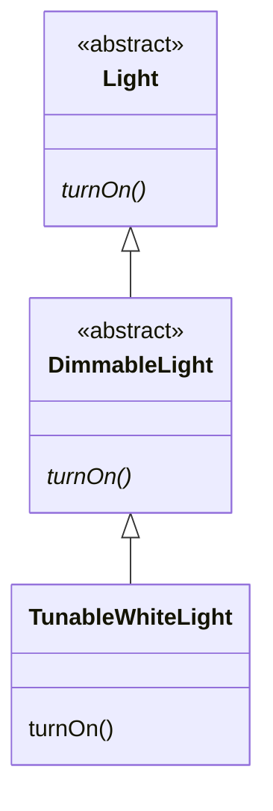
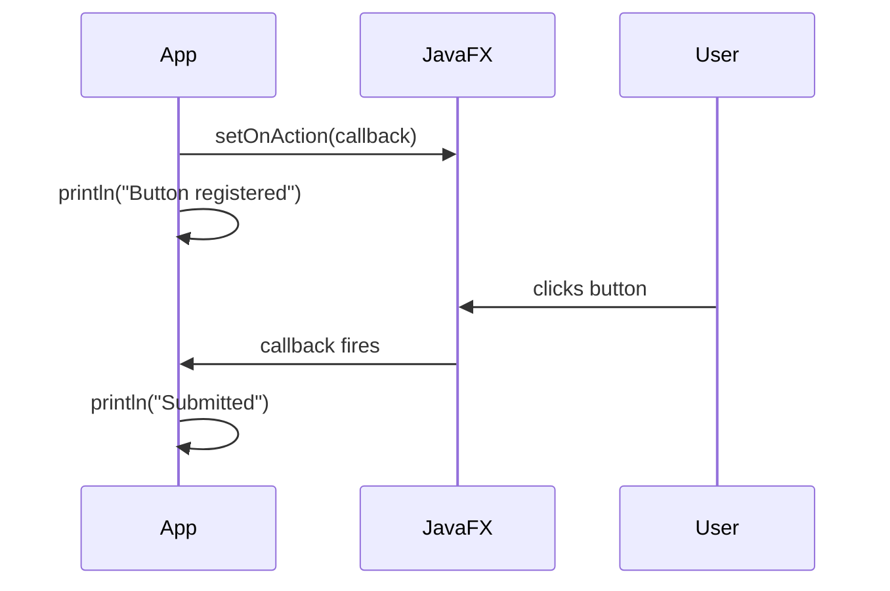
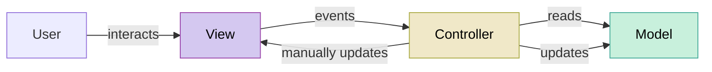
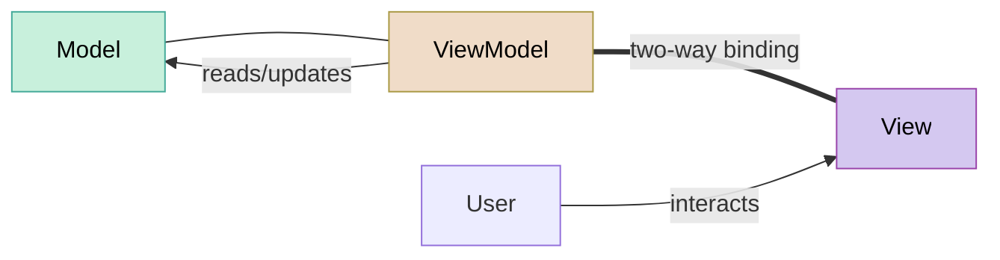
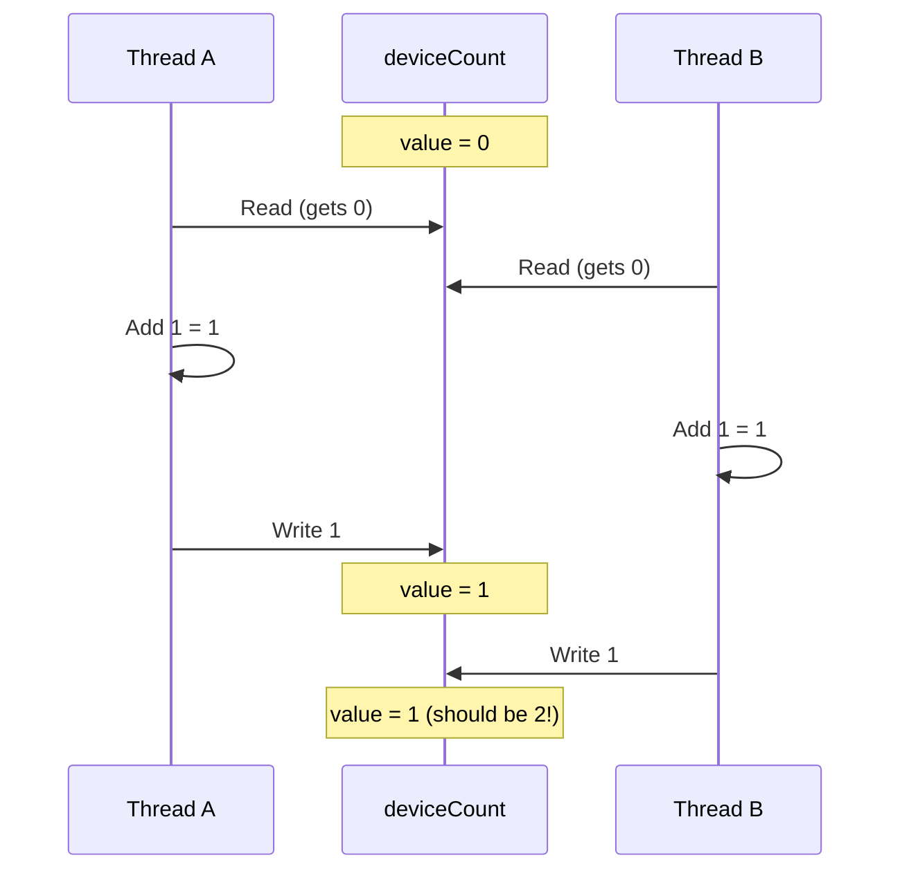

import RevealJS, { Slide } from '@site/src/components/RevealJS';
import Img from '@site/src/components/Img';
import PollSlide from '@site/src/components/PollSlide';
import QuoteSlide from '@site/src/components/QuoteSlide';
import QuizSlide from '@site/src/components/QuizSlide';

<style>
{`
  .reveal {
    font-size: 32px;
  }
`}
</style>

<RevealJS transition="slide">

<Slide>

# CS 3100: Program Design and Implementation II

## Final Review

<p style={{marginTop: '0em', fontSize: '0.7em', color: '#666'}}>
  ©2026 Ellen Spertus, CC-BY-SA
</p>
</Slide>

<Slide>

## Poll: How much of the practice final did you do?

<PollSlide username="espertus" choices=
  {["None yet", "I've skimmed it", "A few problems", "Many problems", "All problems"]}
/>
</Slide>

<Slide>

## Poll: How prepared do you feel for the multiple-choice questions?

<PollSlide username="espertus" image="/img/lectures/poll-ev/pollev-smiles.png"
/>
<p>
Click below the faces if you haven't tried them yet.
</p>
</Slide>


<Slide>
## Poll: How prepared do you feel about the case studies?

<PollSlide username="espertus" image="/img/lectures/poll-ev/pollev-smiles.png"
/>
<p>
Click below the faces if you haven't tried them yet.
</p>

Note: You can leave after completing the survey and still get participation credit if you want to complete the practice final before seeing solutions (which will be recorded).
</Slide>

<Slide>

## Question 1

The SceneItAll IoT hierarchy from lecture is:

```
IoTDevice              <<interface>>
└── BaseIoTDevice      <<abstract>>
    ├── Fan
    └── Light          <<abstract>>
        ├── SwitchedLight
        └── DimmableLight
            └── TunableWhiteLight
```

Consider this code:

```java
Light light = new TunableWhiteLight("living-room", 2700, 100);
((DimmableLight) light).turnOn();
```

`TunableWhiteLight` overrides `turnOn()`. Which version of `turnOn()` is called?


</Slide>

<Slide>
### Draw a Picture Before Viewing Choices

<div style={{display: 'flex', gap: '2em', justifyContent: 'center'}}>
  <div>

</div>

<div className='fragment' style={{ fontSize: '.8em' }}>
Which version of `turnOn()` is called?

A. DimmableLight's turnOn(), because the cast changes the runtime type of light to DimmableLight

B. Light's turnOn(), because Light is the declared type of light and static dispatch resolves to it

C. A compilation error occurs because you cannot cast a Light reference to a DimmableLight subtype

D. TunableWhiteLight's turnOn(), because dynamic dispatch resolves calls using the object's runtime type


<div className='fragment' style={{backgroundColor: '#fde8e8', borderRadius: '6px', padding: '0.5em 1em'}}>
Java uses *dynamic dispatch*, so the dynamic (run-time) type is used.
</div>

</div>

</div>
```java
Light light = new TunableWhiteLight("living-room", 2700, 100);
((DimmableLight) light).turnOn();
```

<div className='fragment'>
Answer is D. Review Lab 6.5 if needed.
</div>

</Slide>

<Slide>

## Question 2

```java
public class Example {
    int x = 10;

    public static void printX() {
        System.out.println(x);
    }
}
```

<div className='fragment' style={{ fontSize: '.8em' }}>

What is wrong with this code?

A. `x` should be `public` for a static method to access it

B. Static methods cannot reference instance variables directly

C. `println` cannot print an `int`

D. `x` must be declared `final` before a static method can use it

<div className='fragment' style={{backgroundColor: '#fde8e8', borderRadius: '6px', padding: '0.5em 1em'}}>

`x` is an *instance variable*. It belongs to instances of `Example`.

`printX()` is `static`, so it has no `this` reference and cannot access instance variable `x`.

</div>

<div className='fragment'>
Answer is B. Review Lab 6.5 if needed.
</div>

</div>

</Slide>
<Slide>

## Question 3

Two versions of SceneItAll store controlled devices differently:

- **Version A:** `List<Device>` — membership tested with a for-each loop
- **Version B:** `HashSet<Device>` — membership tested with `contains()`

What is the Big-O performance of each?

<div className='fragment' >

A. Both are O(n)

B. Version A is O(n) and Version B is O(1)

C. Version A is O(n) and Version B is O(log n)

D. Both are O(1) because Java's JIT compiler optimizes small-collection lookups to run in constant time regardless of data structure

<div className='fragment' style={{backgroundColor: '#fde8e8', borderRadius: '6px', padding: '0.5em 1em'}}>

A for-each scan is O(n); `HashSet.contains()` uses hashing to find the element in O(1) time.

</div>

</div>

<div className='fragment'>
Answer is B. See [L37 Performance: Big-O in SceneItAll](https://neu-pdi.github.io/CS3100-Spring-2026/lecture-slides-spertus/l37-recent-topics#/7) for complexities you should know.
</div>

</Slide>

<Slide>
### Hashtables


<div className='fragment'>
(But use `HashMap`, not `Hashtable`.)
</div>
</Slide>

<Slide>

## Question 4
<div style={{ fontSize: '.8em' }}>

In a `@NullMarked` package, a developer writes the following method:

```java
public String formatIngredient(@Nullable String prefix, String name) {
    if (prefix == null) {
        return name;
    }
    return prefix + " " + name;
}
```
Which statement about this signature is correct?
<div className='fragment'>

A. `name` is assumed non-null because the package is `@NullMarked`; passing `null` for `name` would produce a compile-time warning or error

B. The `@Nullable` annotation on `prefix` is redundant because all parameters are nullable by default in Java

C. `@Nullable` on `prefix` means the nullness checker will throw a `NullPointerException` automatically if `null` is passed

D. Both `prefix` and `name` are treated as nullable because `@Nullable` anywhere in a method signature marks all parameters as nullable

</div>
<div className='fragment' style={{backgroundColor: '#fde8e8', borderRadius: '6px', padding: '0.5em 1em'}}>
As the name `@NullMarked` suggests, any types that can have null values are marked `@Nullable`. Answer is A.
</div>

</div>
</Slide>

<Slide>

## Question 5


Why can you use HashMap in your programs without reading its 2000-line implementation?
<div style={{ fontSize: '.8em' }}>
A. The Java compiler inlines HashMap's implementation at compile time, so you never need to read it

B. HashMap's specification tells you exactly what each method does, letting you treat it as a single mental chunk without understanding its internals

C. HashMap's implementation is hidden using private fields, so the compiler prevents you from accessing it

D. You don't need to read HashMap because you know it implements the Map interface and all Map implementations behave identically
</div>
<div className='fragment' style={{backgroundColor: '#fde8e8', borderRadius: '6px', padding: '0.5em 1em'}}>
We can read specifications instead of source code. Answer B is correct.
</div>

<div className='fragment'>
🦨 Answer D is close to true.
</div>

</Slide>

<Slide>

## Question 6

```java
List lights = new ArrayList<>(List.of(
    new DimmableLight("bedroom", 80),
    new DimmableLight("kitchen", 30),
    new DimmableLight("bedroom", 50)
));

lights.sort(Comparator.comparing(DimmableLight::getId)
                      .thenComparingInt(DimmableLight::getBrightness));

System.out.println(lights);
```

Assuming `toString()` returns just the id and brightness (e.g., `"bedroom/80"` ), what is
printed?

<div className='fragment' style={{ fontSize: '.8em' }}>

A. `[bedroom/50, bedroom/80, kitchen/30]` — sorted by id first, then brightness ascending within the same id

B. `[bedroom/80, bedroom/50, kitchen/30]` — sorted by id first, preserving original order within ties

C. `[kitchen/30, bedroom/50, bedroom/80]` — sorted by brightness ascending

D. `[bedroom/80, kitchen/30, bedroom/50]` — original order, unchanged

<div className='fragment' style={{backgroundColor: '#fde8e8', fontSize: '.95em', borderRadius: '6px', padding: '0.3em 0.3em'}}>

`Comparator.comparing()` sorts by [increasing] id first; `thenComparingInt()` breaks ties by [increasing] brightness.
Answer is A.

</div>

</div>

</Slide>
<Slide>

## Question 7
A developer writes this filter:

```java
devices.stream()
    .filter(d -> d.isConnected() && d.getBattery() < 20
                 && !d.getType().equals("wired")
                 && d.getLastSeen().isBefore(cutoff))
    .collect(Collectors.toList());
```

What refactoring would most increase testability?

<div className='fragment' style={{backgroundColor: '#fde8e8', fontSize: '.95em', borderRadius: '6px', padding: '0.3em 0.3em'}}>

Pay close attention to the wording! This is asking about *testability*.
</div>

<div className='fragment'>
A. Extracting the lambda body into a named method
</div>

<div className='fragment' style={{display: 'flex', gap: '2em', justifyContent: 'center'}}>
  <div>
```java
devices.stream()
    .filter(this::isLowBatteryWireless)
    .collect(Collectors.toList());
```
</div>
<div>
```
boolean isLowBatteryWireless(Device d) {
    return d.isConnected()
        && d.getBattery() < 20
        && !d.getType().equals("wired")
        && d.getLastSeen().isBefore(cutoff);
}
```
</div>
</div>

</Slide>


<Slide>

### Question 7 Answers
A developer writes this filter:

```java
devices.stream()
    .filter(d -> d.isConnected() && d.getBattery() < 20
                 && !d.getType().equals("wired")
                 && d.getLastSeen().isBefore(cutoff))
    .collect(Collectors.toList());
```

What refactoring would most increase testability?

<div style={{ fontSize: '.8em' }}>

A. Extracting the lambda body into a named method

B. Replacing `Collectors.toList()` with `Collectors.toUnmodifiableList()` so the result cannot be accidentally mutated by callers

C. Splitting the filter into multiple chained `.filter()` calls, one condition per call

D. Converting the lambda body into an anonymous class

<div className='fragment' style={{backgroundColor: '#fde8e8', borderRadius: '6px', padding: '0.5em 1em'}}>

Complex lambda logic should be extracted into a named method for readability, documentation, and independent testability. Answer is A.

</div>

</div>

</Slide>

<Slide>

## Question 8

A developer writes `LoggingList`, a subclass of `ArrayList` that counts how many elements have been added:

<div style={{display: 'flex', gap: '2em', justifyContent: 'center'}}>
  <div>
```java
public class LoggingList<E> extends ArrayList<E> {
  private int addCount = 0;

  @Override
  public boolean add(E e) {
    addCount++;
    return super.add(e);
  }

  @Override
  public boolean addAll(Collection<? extends E> c) {
    addCount += c.size();
    return super.addAll(c);
  }

  /**
   * Gets the count of items added to this list
   * (whether or not they are subsequently removed).
   *
   * @return the number of items added to the list
   */
  public int getAddCount() { return addCount; }
}
```
  </div>
  <div className='fragment'>
Both of these JUnit tests pass:

```java
@Test
void countsTwoDirectAdds() {
  LoggingList<String> list = new LoggingList<>();
  list.add("A");
  list.add("B");
  assertEquals(2, list.getAddCount());
}

@Test
void countsAddAll() {
  LoggingList<String> list = new LoggingList<>();
  list.addAll(Arrays.asList("A", "B", "C"));
  assertEquals(3, list.getAddCount());
}
```
  </div>
</div>
<div className='fragment'>
What is the problem with `LoggingList`?
</div>
</Slide>

<Slide>

### Question 8 Answers
<div style={{ fontSize: '.8em' }}>

A developer writes `LoggingList`, a subclass of `ArrayList` that counts how many elements have been added:

```java
public class LoggingList<E> extends ArrayList<E> {
  private int addCount = 0;

  @Override
  public boolean add(E e) { .. }

  @Override
  public boolean addAll(Collection<? extends E> c) { .. }

  public int getAddCount() { return addCount; }
}
```
What is the problem with `LoggingList`?

A. `addCount` should be `static` so it is shared across all `LoggingList` instances<br/>
B. The class might no longer satisfy its specification if the implementation of `ArrayList` changes<br/>
C. Overriding both `add()` and `addAll()` violates the Interface Segregation Principle because the two methods should be in separate interfaces<br/>
D. The class violates the Liskov Substitution Principle because `LoggingList` cannot be used anywhere an `ArrayList` is expected<br/>

<div className='fragment' style={{backgroundColor: '#fde8e8', borderRadius: '6px', padding: '0.5em 1em'}}>
Implementation assumes `super.addAll()` does not call `add()`. Answer is B.
</div>

</div>

</Slide>

<Slide>

## Question 9

```java
@Test
public void activatesHeatingWhenBelowTarget() {
    TemperatureSensor mockSensor = mock(TemperatureSensor.class);
    HVACService mockHVAC = mock(HVACService.class);
    when(mockSensor.readTemperature("livingRoom")).thenReturn(65.0);

    ThermostatController controller = new ThermostatController(mockSensor, mockHVAC);
    controller.adjustToTargetTemperature(72.0, "livingRoom");

    verify(mockHVAC).activate("livingRoom");
}
```

What does `verify(mockHVAC).activate("livingRoom")` do?


</Slide>


<Slide>

### Make Sure We Understand Code

```java
@Test
// This tests whether the heater is turned on when we want to heat room.
public void activatesHeatingWhenBelowTarget() {
  // Create a test double for the TemperatureSensor.
  TemperatureSensor mockSensor = mock(TemperatureSensor.class);

  // Create a test double for the HVACService.
  HVACService mockHVAC = mock(HVACService.class);

  // Simulate a living room temperature of 65.0.
  when(mockSensor.readTemperature("livingRoom")).thenReturn(65.0);

  // Create a real ThermostatController using the doubles.
  ThermostatController controller = new ThermostatController(mockSensor, mockHVAC);

  // Test what happens when we tell a ThermostatController to increase LR temperature.
  controller.adjustToTargetTemperature(72.0, "livingRoom");
  // Make sure the HVACService's activate() method was called with argument "livingRoom".
  verify(mockHVAC).activate("livingRoom");
}
```

What does `verify(mockHVAC).activate("livingRoom")` do?


</Slide>

<Slide>

### Question 9 Answers

What does `verify(mockHVAC).activate("livingRoom")` do?

<div style={{ fontSize: '.8em' }}>

A. It asserts that `activate` was called exactly once with `"livingRoom"` as the argument

B. It configures the mock to return a specific value the next time `activate` is called

C. It checks that `mockHVAC` was originally constructed using `"livingRoom"` as a parameter

D. It registers a callback so that a real HVAC system is contacted if `activate` is called

<div className='fragment' style={{backgroundColor: '#fde8e8', borderRadius: '6px', padding: '0.5em 1em'}}>

`verify` asserts the method was called exactly once with the specified argument. Answer is A.

</div>

<div className='fragment'>
🦨 You shouldn't be expected to remember "exactly once".
</div>

</div>

</Slide>

<Slide>

## Question 10

```java
public class ScheduledTask {
    public void runIfDue() {
        if (TimeUtils.isBusinessHours()) {
            doWork();
        }
    }
    private void doWork() { /* ... */ }
}
```

A developer wants to test that `doWork()` is NOT called outside business hours. What is the fundamental testing problem that prevents the developer from even *setting up* the test scenario?

<div className='fragment' style={{ fontSize: '1.0em' }}>

A. `doWork()` is private, so neither JUnit nor Mockito can invoke it directly within a test

B. `TimeUtils.isBusinessHours()` is a static call and cannot be replaced with a test double

C. The class has no explicit constructor, so Mockito cannot create a mock of `ScheduledTask`

D. `runIfDue()` returns `void`, so there is no return value to assert on in the test

<div className='fragment' style={{backgroundColor: '#fde8e8', borderRadius: '2px', padding: '0.2em .2em'}}>

The question is about what happens outside business hours, but we can't control what time `runIfDue()` detects.
Answer is B.
</div>

<div className='fragment'>
Review [L16: Designing for Testability](https://neu-pdi.github.io/CS3100-Spring-2026/lecture-slides-spertus/l16-testability), specifically Controllability.
(Observability is also important.)
</div>

</div>


</Slide>

<Slide>

## Question 11

<div style={{ fontSize: '.8em' }}>
A team adopts a modular monolith where the Submissions module and Grading module communicate only through each module's public API, never querying each other's tables directly. What is the primary benefit compared to an unstructured monolith?

A. It eliminates network latency between modules and allows each module's schema to evolve independently<br/>
B. It guarantees independent deployment cycles so each module can be released on its own schedule<br/>
C. It preserves clean boundaries that make it easier to extract a module into a separate service later<br/>
D. It prevents any single bug from crashing the entire application by running modules in separate processes


<div className='fragment' style={{backgroundColor: '#fde8e8', borderRadius: '2px', padding: '0.2em .2em'}}>
Monoliths run on a single computer in a single process. Modular monoliths use good abstraction with clean boundaries.
The answer is C.
</div>

<div className='fragment'>
🐒 You haven't explicitly applied this, although CYB is a modular monolith, which you should know.
</div>
</div>
</Slide>

<Slide>

## Question 12

Pawtograder's Grading Action batches all 100 test results into a single `submitFeedback()` call instead of one call per result. Which fallacy of distributed computing most directly motivates this?

<div className='fragment' style={{ fontSize: '.8em' }}>

A. "Latency is zero" — making 100 sequential network round-trips would add significant cumulative delay that a single batch avoids

B. "There is one administrator" — separate calls per result may each be subject to different rate limits or firewall policies

C. "The network is secure" — sending results individually exposes more data at each trust boundary crossing

D. "The network is homogeneous" — individual calls may take different paths and behave inconsistently across network segments
</div>

<div className='fragment' style={{backgroundColor: '#fde8e8', borderRadius: '6px', padding: '0.5em 1em'}}>

Each network call incurs latency; 100 sequential round-trips multiply that cost, which batching eliminates. Answer is A.

</div>

<div className='fragment'>
🐒 You haven't explicitly applied this, but we need a way to test you on network fallacies, and we've talked
a lot about this.
</div>
</Slide>

<Slide>

## Question 13

When using a Functions as a Service (FaaS) platform instead of managing your own server, which of the following does the **programmer** still control?

<div className='fragment' style={{ fontSize: '.8em' }}>

A. The operating system configuration

B. The algorithm used within the function

C. The physical server hardware the function runs on

D. How the server scales under load

<div className='fragment' style={{backgroundColor: '#fde8e8', borderRadius: '6px', padding: '0.5em 1em'}}>

The FaaS platform manages infrastructure, scaling, and the OS — the programmer controls only the function's logic.
Answer is B.

</div>

</div>

<div className='fragment'>
🐒 You haven't explicitly applied this, but this was the major point of [L21: Serverless Architecture](https://neu-pdi.github.io/CS3100-Spring-2026/lecture-slides-spertus/l21-serverless#/1).
</div>

</Slide>

<Slide>

### The Cloud Deployment Spectrum


</Slide>

<Slide>

## Question 14

A startup evaluates two open-source libraries for a **desktop application it distributes to customers**. Library A uses the MIT license. Library B uses GPL v3. A senior engineer points out that the GPL is more restrictive than the MIT license. Which accurately describes the licensing risk of choosing Library B?

<div className='fragment' style={{ fontSize: '.8em' }}>

A. The startup must credit Library B authors in all marketing materials but can otherwise keep its source code proprietary

B. The startup may use Library B freely for internal tools but must pay a licensing fee before any commercial distribution

C. Library B is prohibited from use in any commercial product regardless of whether source code is made available

D. Distributing software that includes Library B requires the startup to release its own source code under the GPL

<div className='fragment' style={{backgroundColor: '#fde8e8', borderRadius: '6px', padding: '0.5em 1em'}}>
The GPL requires that any software incorporating GPL-licensed code and distributed to others must itself be released under the GPL.
Answer is D.

</div>

<div className='fragment'>
🦨 This is important to know when creating projects but is heavy on memorization.
</div>

</div>

</Slide>
<Slide>

## Question 15

In one version of CookYourBooks, to scale a recipe to a target number of servings,
users must type the target serving count but are not shown the original serving size —
they must remember it from the previous screen. Which Nielsen heuristic is violated?

<div className='fragment'>


</div>

</Slide>

<Slide>

### Question 15 Answers

In one version of CookYourBooks, to scale a recipe to a target number of servings,
<mark>users must type the target serving count but are not shown the original serving size —
they must remember it from the previous screen</mark>. Which Nielsen heuristic is violated?

A. H6 (Recognition Rather Than Recall) — display the original serving size on the scaling screen

B. H3 (User Control and Freedom) — add an Undo button

C. H5 (Error Prevention) — validate that the target is a positive integer

D. H2 (Match Between System and the Real World) — replace the number field with natural language

<div className='fragment' style={{backgroundColor: '#fde8e8', borderRadius: '6px', padding: '0.5em 1em'}}>
Users should not have to remember information from a previous screen — the system should display it for them.
Answer is A.

</div>

</Slide>

<Slide>

## Question 16

In another version of CookYourBooks, recipe difficulty is displayed using colored dots (green/yellow/red) with no text labels or shapes. Which POUR principle is violated?

<div className='fragment' style={{ fontSize: '.8em' }}>

A. Operable, because users with motor impairments are unable to reliably interact with an indicator that provides no keyboard-accessible target

B. Robust, because the colored dots use a non-standard HTML element that will render differently across Chrome, Safari, and Firefox

C. Perceivable, because colorblind users cannot distinguish the levels if color is the only differentiating attribute

D. Understandable, because the green/yellow/red color metaphor carries different cultural meanings in different regions and contexts

<div className='fragment' style={{backgroundColor: '#fde8e8', borderRadius: '6px', padding: '0.5em 1em'}}>

Color alone is insufficient — there should be a secondary cue such as shape or text for colorblind users. Answer is C.

</div>

</div>

<div className='fragment'>
❌ D is also valid, and B could be true. This question is broken.
</div>

</Slide>


<Slide>

## Question 17

<div style={{ fontSize: '.8em' }}>
```java
submitButton.setOnAction(event -> {
    System.out.println("Submitted");
});
System.out.println("Button registered");
```

In what order do `"Button registered"` and `"Submitted"` appear in the console?

<div className='fragment'>


</div>
</div>

</Slide>


<Slide>

### Question 17 Answers
```java
submitButton.setOnAction(event -> {
    System.out.println("Submitted");
});
System.out.println("Button registered");
```

In what order do `"Button registered"` and `"Submitted"` appear in the console?

<div style={{ fontSize: '.8em' }}>
<div className='fragment'>

A. `"Button registered"` first, then `"Submitted"` when the user clicks — the callback is invoked by the event loop

B. `"Submitted"` first — the callback runs immediately when `setOnAction` is called, before registration returns

C. Both run simultaneously on separate threads because JavaFX uses a background event dispatcher

D. `"Button registered"` first, then `"Submitted"` immediately after on the same call stack, without waiting for user input
<br/>

<div className='fragment' style={{backgroundColor: '#fde8e8', borderRadius: '6px', padding: '0.5em 1em'}}>

Answer is A. `setOnAction` registers the callback but does not invoke it — the callback fires later when the user clicks the button.

</div>

</div>
</div>

</Slide>

<Slide>

## Question 18

Compare two versions of a CookYourBooks recipe scaling feature:

- **Version A:** button handler manually iterates over ingredients and calls `ing.scale(factor)`
- **Version B:** button handler calls `model.scale(servings)` and then updates the view

Which better follows MVC?
<div className='fragment'>
* Model
* View
* Controller
</div>
</Slide>


<Slide>

### Review of MVC (L29)

<p style={{fontSize: '0.85em'}}>
In <a href="/lecture-notes/l16-testing2">L16</a> we learned to separate domain logic from infrastructure so code is testable. MVC applies that principle to GUIs:
</p>



<p style={{fontSize: '0.8em', color: '#9370DB'}}>
The Model is cleanly domain-side — no UI imports, fully testable. But the Controller does <em>everything else</em>:
it reads from the Model, makes decisions, AND manually pushes updates to View widgets.
</p>

<div style={{display: 'grid', gridTemplateColumns: '1fr 1fr 1fr', gap: '1em', fontSize: '0.75em', marginTop: '0.5em'}}>

<div style={{backgroundColor: 'rgba(74,153,153,0.15)', padding: '0.6em', borderRadius: '8px'}}>

**Model**

Data + business logic. Knows nothing about the UI.

</div>

<div style={{backgroundColor: 'rgba(148,74,170,0.15)', padding: '0.6em', borderRadius: '8px'}}>

**View**

What the user sees. Widgets, layout, styling. No business logic.

</div>

<div style={{backgroundColor: 'rgba(169,148,74,0.15)', padding: '0.6em', borderRadius: '8px'}}>

**Controller**

Translates user actions into model updates. The thin middleman.

</div>

</div>


</Slide>

<Slide>

### Question 18 Answers

<div style={{ fontSize: '.9em' }}>

Compare two versions of a CookYourBooks recipe scaling feature:

- **Version A:** button handler manually iterates over ingredients and calls `ing.scale(factor)`
- **Version B:** button handler calls `model.scale(servings)` and then updates the view

Which better follows MVC?


<div style={{ fontSize: '.9em' }}>

A. Version A, because it gives the Controller direct control over scaling each ingredient

B. Version B, because scaling logic belongs in the Model; the Controller should delegate

C. Version A, because the Controller should perform all computation to keep the Model simple

D. Version B, because bidirectional data binding between Model and View ensures the ingredient list updates automatically

<div className='fragment' style={{backgroundColor: '#fde8e8', borderRadius: '6px', padding: '0.5em 1em'}}>

The button handler is part of the View; scaling logic is business logic and belongs in the Model; the Controller's job is to delegate to the Model, not perform computation itself.
Answer is B.

</div>

</div>
</div>

</Slide>

<Slide>

## Question 19

In MVVM, a test sets a property on the ViewModel and verifies the result without simulating a button click or starting a UI. Why does this work?

</Slide>


<Slide>

### What's MVVM? [L30]



<div style={{display: 'grid', gridTemplateColumns: '1fr 1fr 1fr', gap: '1em', fontSize: '0.75em', marginTop: '0.5em'}}>

<div style={{backgroundColor: 'rgba(74,153,153,0.15)', padding: '0.6em', borderRadius: '8px'}}>

**Model**

Same as MVC. Business logic, no UI.

</div>

<div style={{backgroundColor: 'rgba(169,148,74,0.15)', padding: '0.6em', borderRadius: '8px'}}>

**ViewModel** *(new)*

UI state as bindable properties. No reference to the View. Fully testable.

</div>

<div style={{backgroundColor: 'rgba(148,74,170,0.15)', padding: '0.6em', borderRadius: '8px'}}>

**View**

Declaratively binds to ViewModel properties. Contains no logic.

</div>

</div>

<p style={{fontSize: '0.8em', marginTop: '0.8em'}}>
MVVM simplifies View updates and is more testable than MVC.

It's what you've been using in the CYB.
</p>

</Slide>

<Slide>

### Question 19 Answers

In MVVM, a test sets a property on the ViewModel and verifies the result without simulating a button click or starting a UI. Why does this work?

<div style={{ fontSize: '.8em' }}>

A. TestFX automatically intercepts ViewModel property changes and triggers bound assertions without requiring explicit verification calls

B. The test bypasses the ViewModel entirely and calls `Recipe.scale()` directly on the Model, so no UI component is needed

C. JavaFX property bindings are evaluated lazily, so the test assertion runs before the UI thread has processed the update

D. The ViewModel exposes observable properties settable in tests, because it holds no reference to the View

<div className='fragment' style={{backgroundColor: '#fde8e8', borderRadius: '6px', padding: '0.5em 1em'}}>

The ViewModel holds no reference to the View, so its observable properties can be set and read directly in tests without any UI involvement. Answer is D.

</div>

<div className='fragment'>
You should have CYB experience with this. See also [Lab 12](https://neu-pdi.github.io/CS3100-Spring-2026/labs/lab12-gui) and [Lecture 30: GUI Patterns and Testing](https://neu-pdi.github.io/CS3100-Spring-2026/lecture-slides-spertus/l30-gui2#/21).
</div>

</div>

</Slide>

<Slide>

## Question 20

A `DeviceRegistry` has `private int deviceCount = 0` and `registerDevice()` does `deviceCount++`.
Ten threads each call `registerDevice()` once. Why might `getDeviceCount()` return less than 10?

</Slide>

<Slide>

### You Can't Trust deviceCount++ [L31]



</Slide>

<Slide>

### Question 20 Answers

A `DeviceRegistry` has `private int deviceCount = 0` and `registerDevice()` does `deviceCount++`. Ten threads each call `registerDevice()` once. Why might `getDeviceCount()` return less than 10?

<div style={{ fontSize: '.8em' }}>

A. `int` is not valid for shared mutable fields; only `long` or `AtomicInteger` support safe multi-threaded reads

B. Java guarantees `int` reads are atomic, so the problem must be a visibility issue from CPU cache coherence delays

C. The JVM silently rounds down concurrent increments for performance, discarding some writes when contention is high

D. `deviceCount++` is not atomic — it reads, increments, and writes in three steps, so two threads may read the same stale value

<div className='fragment' style={{backgroundColor: '#fde8e8', borderRadius: '6px', padding: '0.5em 1em'}}>

`deviceCount++` is three separate operations (read, increment, write), so two threads can read the same value simultaneously and one increment is lost.
Answer is D.

</div>

</div>

</Slide>

<Slide>

## Question 21

`activateScene()` synchronizes on `room` then `device`. `firmwareUpdate()` synchronizes on `device` then `room`. Thread A runs `activateScene()` while Thread B runs `firmwareUpdate()`. What happens?

</Slide>

<Slide>

### Parsing Question 21

<mark style={{backgroundColor: '#bde0f7'}}>activateScene()</mark> synchronizes on <mark style={{backgroundColor: '#e0bdf7'}}>room</mark> then <mark style={{backgroundColor: '#fff59d'}}>device</mark>.

<mark style={{backgroundColor: '#fad9b0'}}>firmwareUpdate()</mark> synchronizes on <mark style={{backgroundColor: '#fff59d'}}>device</mark> then <mark style={{backgroundColor: '#e0bdf7'}}>room</mark>.

Thread A runs <mark style={{backgroundColor: '#bde0f7'}}>activateScene()</mark> while Thread B runs <mark style={{backgroundColor: '#fad9b0'}}>firmwareUpdate()</mark>. What happens?

<div className='fragment'>
-------------

<mark style={{backgroundColor: '#bde0f7'}}>eatLasagna()</mark> synchronizes on <mark style={{backgroundColor: '#e0bdf7'}}>fork</mark> then <mark style={{backgroundColor: '#fff59d'}}>knife</mark>.

<mark style={{backgroundColor: '#fad9b0'}}>eatTorte()</mark> synchronizes on <mark style={{backgroundColor: '#fff59d'}}>knife</mark> then <mark style={{backgroundColor: '#e0bdf7'}}>fork</mark>.

Roommate A runs <mark style={{backgroundColor: '#bde0f7'}}>eatLasagna()</mark> while Roommate B runs <mark style={{backgroundColor: '#fad9b0 '}}>eatTorte()</mark> . What happens?

</div>

</Slide>

<Slide>
### Deadlock

<div style={{textAlign: 'center'}}>
  
One roommate has the fork and wants the knife; the other has the knife and wants the fork.
</div>
</Slide>

<Slide>

### Question 21 Answers

`activateScene()` synchronizes on `room` then `device`. `firmwareUpdate()` synchronizes on `device` then `room`. Thread A runs `activateScene()` while Thread B runs `firmwareUpdate()`. What happens?

<div style={{ fontSize: '.8em' }}>

A. Thread B completes first because it acquires fewer locks and thus encounters less contention

B. Both proceed normally because `synchronized` blocks on different object instances never interact

C. A deadlock can occur: Thread A holds `room` and waits for `device`; Thread B holds `device` and waits for `room`

D. A race condition corrupts device state because `synchronized` only protects accesses to primitive fields

<div className='fragment' style={{backgroundColor: '#fde8e8', borderRadius: '6px', padding: '0.5em 1em'}}>

Inconsistent lock ordering across two threads creates a circular wait — the classic condition for deadlock. Answer is C.

This can be solved by agreeing on the order in which locks must be acquired.

</div>

</div>

</Slide>

<Slide>

## Question 22

In a CookYourBooks JavaFX app, a button click triggers a database search that takes 2 seconds. A student puts the database call directly in the button's action handler. What happens?

<div className='fragment' style={{ fontSize: '.8em' }}>

A. The search runs in parallel with the UI on a separate thread automatically created by JavaFX

B. The UI freezes for 2 seconds because the FX thread is blocked waiting for the database

C. JavaFX detects the slow operation and moves it to a background thread automatically

D. The search completes immediately because JavaFX caches database results

<div className='fragment' style={{backgroundColor: '#fde8e8', borderRadius: '6px', padding: '0.5em 1em'}}>

The FX Application Thread handles both UI events and rendering — blocking it with a slow database call freezes the entire UI until the call returns. Answer is B.

Instead, the FX thread should start a background thread, ideally with `BackgroundTaskRunner.run()`.

</div>

</div>

</Slide>
<Slide>

## Question 23

In `BackgroundTaskRunner`, the `onSuccess` callback always runs on the FX Application
Thread rather than on the background thread that produced the result. Why?

</Slide>


<Slide>

### BackgroundTaskRunner Signature [L32]
```java
public static <T> Task<T> run(
    Callable<T> callable,          // () -> fetchRecipe()
    Consumer<T> onSuccess,         // (String recipe) -> updateUI(recipe)
    Consumer<Throwable> onFailure  // (Throwable error) -> showError(error)
)
```

<div style={{fontSize: '0.8em', marginTop: '0.8em'}}>

In our example, the type argument `T` is `String`.

| Type | Meaning | Thread | Example |
|------|---------|--------| -------|
| `Callable<T>` | A lambda with no arguments that returns a value of type `T` | background |  `() -> fetchRecipe()` returns `String` |
| `Consumer<T>` | A lambda that takes a value of type `T` and returns nothing | JavaFX | `(String recipe) -> updateUI(recipe)` |
| `Consumer<Throwable>` | A lambda that takes an exception and returns nothing | JavaFX | `(Throwable error) -> showError(error)` |

</div>

</Slide>

<Slide>

### Question 23 Answers

In `BackgroundTaskRunner`, the `onSuccess` callback always runs on the FX Application
Thread rather than on the background thread that produced the result. Why?

<div style={{ fontSize: '.8em' }}>

A. The FX thread is faster than background threads for processing data

B. Background threads are terminated immediately after the callable returns, so they cannot run callbacks

C. Running `onSuccess` on the FX thread enables the callback to update the UI

D. Running `onSuccess` on the FX thread prevents the callable from being cancelled mid-execution

<div className='fragment' style={{backgroundColor: '#fde8e8', borderRadius: '6px', padding: '0.5em 1em'}}>

JavaFX requires that all UI updates happen on the FX Application Thread — running `onSuccess` there ensures the callback can safely update the UI.
Answer is C.

</div>

</div>

</Slide>

<Slide>

## Question 24

```java
BackgroundTaskRunner.run(
    () -> loadRecipes(),       // takes 2 seconds
    recipes -> showRecipes(recipes),
    error -> showError(error)
);
log("Ready");
```

Assuming `loadRecipes()` succeeds, in what order do these events occur?

<div className='fragment' style={{ fontSize: '.8em' }}>

A. `loadRecipes()` runs, then `showRecipes()` runs, then `"Ready"` is logged — all on the FX thread in sequence

B. `"Ready"` is logged on the FX thread, then `loadRecipes()` runs on a background thread, then `showRecipes()` runs on the FX thread

C. `loadRecipes()` and `log("Ready")` run simultaneously on separate threads, then `showRecipes()` runs

D. `"Ready"` is logged, then `loadRecipes()` runs, then `showRecipes()` runs — all on the background thread

<div className='fragment' style={{backgroundColor: '#fde8e8', borderRadius: '6px', padding: '0.5em 1em'}}>

`BackgroundTaskRunner.run()` returns immediately, so `log("Ready")` runs on the FX thread right away;
`loadRecipes()` runs on a background thread, and `showRecipes()` is called on the FX thread via `onSuccess`.
Answer is B.

</div>

<div className='fragment'>
❌ C is possible. This question is broken.
</div>

</div>

</Slide>

<Slide>

## Question 25

A developer wants to build a responsive JavaFX application. Which of these operations can be done equally well on either the FX Application Thread or a background thread?

<div className='fragment' style={{ fontSize: '.8em' }}>

A. Changing the GUI display between dark mode and light mode

B. Cutting power to all devices

C. Calling the Java library routine `LocalDateTime.now()` to get the time of day

D. Backing up all data to a server

<div className='fragment' style={{backgroundColor: '#fde8e8', borderRadius: '6px', padding: '0.5em 1em'}}>

Answer is C. `LocalDateTime.now()` is a fast, non-UI operation with no side effects — it can safely run on either thread. The others must run on a specific thread: A must be on the FX thread; B and D should be on a background thread.

</div>

</div>

</Slide>


<Slide>

## Some Other Possible Topics

<div style={{fontSize: '0.8em'}}>

* Java, especially subtyping, exceptions
* Specifications (restrictiveness, generality, clarity; javadoc) [L4]
* Minimizing coupling/maximizing abstraction through clear boundaries
* All 5 SOLID principles
* Requirements (stakeholders, values, interests; how to elicit)
* Domain modeling (use domain-related names)
* Reading UML static class diagrams
* Debugging
* Test doubles (spies, mocks, stubs)
* Testability and dependency injection
* Design patterns (static factory methods and builders (EJ 1-2), facade, observer)
* Creating service boundaries
* Architectures (hexagonal, monolithic, microservices, serverless)
* Teams (HRT, accountability)
* Open source (supply chain risk, different licenses)
* Usability (stakeholders, accessibility, Nielsen's heuristics)
* User-centered design
* Concurrency (Lab 13)

</div>

</Slide>


<Slide>
## Principles
<div style={{fontSize: '0.8em'}}>
* Prioritize readability, changeability, maintainability, etc., over cleverness and micro-optimizations
* You cannot prove a nontrivial program bug-free
  * Validate as much as possible
  * Minimize harm from errors
* Software architecture/design is full of trade-offs
* Use but verify AI; you are responsible for code you submit
* Finding and fixing problems gets more expensive over time
</div>

</Slide>

<Slide>

## Poll: Would you come to office hours tomorrow?

I could go over grades and answer questions about material.

<PollSlide username="espertus" image="/img/lectures/web/l39-office-hour-poll.png"
/>

Click on the left edge if you would not go.

</Slide>


<Slide>
## Announcement: STEM Lunch and Panel


</Slide>

<Slide>
## Bonus Slide


</Slide>


</RevealJS>