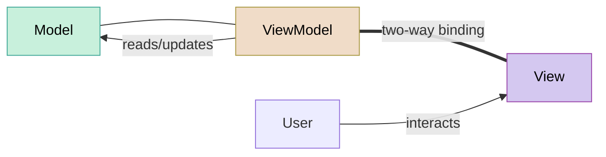

import RevealJS, { Slide } from '@site/src/components/RevealJS';
import Img from '@site/src/components/Img';

<RevealJS transition="slide">

{/* ============================================ */}
{/* COVER IMAGE */}
{/* ============================================ */}

<Slide>
  

<aside className="notes">
**Lecture overview:**
- **Total time:** ~55 minutes
- **Prerequisites:** L29 (GUIs in Java, MVC), L16 (Testing, Hexagonal Architecture), L28 (Accessibility)
- **Connects to:** GA1 (Core Features — students implement ViewModels), L31-32 (Concurrency)

**Structure (~23 slides):**
- Arc 1: The Problem with MVC (~8 min) — manual sync bugs, untestable controllers
- Arc 2: MVVM (~15 min) — ViewModel, data binding, ObservableList, MVC vs MVVM comparison
- Arc 3: Testing the ViewModel (~12 min) — unit tests, hexagonal architecture connection, what to test
- Arc 4: E2E Testing with TestFX (~12 min) — testing pyramid, locators, accessibility labels as locators
- Arc 5: Putting It All Together (~5 min) — GA1 strategy, takeaways

**Running example:** SceneItAll area dashboard from L29, refactored from MVC to MVVM, then tested at both ViewModel and E2E levels.

> **Transition:** Let's start with the learning objectives...
</aside>

</Slide>

{/* ============================================ */}
{/* TITLE SLIDE */}
{/* ============================================ */}

<Slide>

# CS 3100: Program Design and Implementation II

## Lecture 30: GUI Patterns and Testing

<p style={{marginTop: '2em', fontSize: '0.8em', color: '#666'}}>
  &copy;2026 Jonathan Bell, CC-BY-SA
</p>

<aside className="notes">
**Context from previous lectures:**
- L29: Built a SceneItAll area dashboard with MVC — Model, View (FXML), Controller. Also introduced JavaFX properties/binding and the component lifecycle (start → load → inject → initialize → event loop)
- L16: Testing pyramid, observability/controllability, hexagonal architecture
- L28: Accessibility — standard components, accessible text
- Today: we fix MVC's limitations with MVVM, then test everything. Students already saw basic binding in L29 — today we formalize it as a pattern and go deeper (ObservableList, ViewModel as testable unit)

> **Transition:** Here's what you'll be able to do after today...
</aside>

</Slide>

{/* ============================================ */}
{/* LEARNING OBJECTIVES */}
{/* ============================================ */}

<Slide>

## Learning Objectives

<p style={{fontSize: '0.85em', textAlign: 'left'}}>
After this lecture, you will be able to:
</p>

<ol style={{fontSize: '0.75em', textAlign: 'left'}}>
  <li>Explain the limitations of MVC that motivated MVVM</li>
  <li>Implement the Model-View-ViewModel pattern with JavaFX properties and data binding</li>
  <li>Compare MVC and MVVM in terms of coupling, synchronization, and testability</li>
  <li>Write unit tests for a ViewModel without starting the JavaFX runtime</li>
  <li>Write end-to-end GUI tests using TestFX with accessibility-based locators</li>
</ol>

<aside className="notes">
**Time allocation:**
- Objective 1: MVC limitations (~8 min)
- Objective 2-3: MVVM pattern and comparison (~15 min)
- Objective 4: ViewModel testing (~12 min)
- Objective 5: TestFX and E2E tests (~12 min)

**Connection to GA1:** Students will implement ViewModel interfaces for their core features. Today teaches them the pattern and how to test it.

> **Transition:** Let's start by revisiting what we built last time...
</aside>

</Slide>

{/* ============================================ */}
{/* ARC 1: THE PROBLEM WITH MVC (~8 min) */}
{/* ============================================ */}

<Slide>

## Last Lecture We Built an MVC App — Now Let's Break It

<p style={{fontSize: '0.85em'}}>
Our SceneItAll area dashboard from L29. Spot the bug:
</p>

```java
// Controller from L29
@FXML private void initialize() {
    brightnessSlider.valueProperty().addListener((obs, old, val) -> {
        int level = val.intValue();
        brightnessValueLabel.setText(level + "%");
        model.setAllLightsBrightness(level);
        updateDeviceList();  // ✅ remembered to update
    });
}

@FXML private void handleActivateScene() {
    String scene = sceneSelector.getValue();
    if (scene != null) {
        model.activateScene(scene);
        // ❌ BUG: forgot to call updateDeviceList()!
        // User activates "Evening" but the device list still shows old values
    }
}
```

<p style={{fontSize: '0.8em', marginTop: '0.5em', color: '#9370DB'}}>
Every time the Model changes, you must <strong>remember</strong> to update the View. Forget once → stale UI. This doesn't scale.
</p>

<aside className="notes">
**This is a real bug pattern.** As the app grows, the number of places where "update the view" must be called grows linearly. Miss one and the UI shows stale data. Students will hit this immediately in GA1 if they use pure MVC.

**Ask students:** "How many places in your Controller call `updateDeviceList()`?" In a real app, the answer might be 10-15. Every single one is a potential bug.

> **Transition:** This is one of two problems. The other is testability...
</aside>

</Slide>

<Slide>

## MVC's Two Problems: Manual Sync and Untestable Controllers

<div style={{display: 'grid', gridTemplateColumns: '1fr 1fr', gap: '1.5em', fontSize: '0.8em'}}>

<div style={{backgroundColor: 'rgba(200,74,74,0.15)', padding: '0.8em', borderRadius: '8px'}}>

**Problem 1: Manual synchronization**

Every Model change requires a manual View update. Forget one → stale UI.

As the app grows, the number of sync points grows linearly. Each one is a potential bug.

</div>

<div style={{backgroundColor: 'rgba(200,74,74,0.15)', padding: '0.8em', borderRadius: '8px'}}>

**Problem 2: Untestable Controller**

```java
public class AreaDashboardController {
    @FXML private Slider brightnessSlider;
    @FXML private ListView<String> deviceList;
    // ...
}
```

To test `handleActivateScene()`, you need to start the JavaFX runtime, load FXML, create widgets, and simulate clicks.

That's an integration test, not a unit test.

</div>

</div>

<p style={{fontSize: '0.85em', marginTop: '0.8em'}}>
Recall from <a href="/lecture-notes/l16-testing2">L16</a>: testable code has high <strong>observability</strong> (can inspect state) and high <strong>controllability</strong> (can set state directly). MVC Controllers have neither.
</p>

<aside className="notes">
**Connect to L16 explicitly:** "In L16 we said the key to testable code is separating domain logic from infrastructure. The Controller mixes both — it contains decision-making logic (what to do when the user clicks) AND infrastructure dependencies (JavaFX widgets). MVVM separates these."

> **Transition:** MVVM solves both problems with one idea...
</aside>

</Slide>

{/* ============================================ */}
{/* ARC 2: MVVM (~15 min) */}
{/* ============================================ */}

<Slide>

## MVVM Adds One Layer to Solve Both Problems



<div style={{display: 'grid', gridTemplateColumns: '1fr 1fr 1fr', gap: '1em', fontSize: '0.75em', marginTop: '0.5em'}}>

<div style={{backgroundColor: 'rgba(74,153,153,0.15)', padding: '0.6em', borderRadius: '8px'}}>

**Model**

Same as MVC. Business logic, no UI.

</div>

<div style={{backgroundColor: 'rgba(169,148,74,0.15)', padding: '0.6em', borderRadius: '8px'}}>

**ViewModel** *(new)*

UI state as bindable properties. No reference to the View. Fully testable.

</div>

<div style={{backgroundColor: 'rgba(148,74,170,0.15)', padding: '0.6em', borderRadius: '8px'}}>

**View**

Declaratively binds to ViewModel properties. Contains no logic.

</div>

</div>

<p style={{fontSize: '0.8em', marginTop: '0.8em'}}>

**The key innovation:** The ViewModel exposes everything the View needs as <strong>observable properties</strong>. The View binds to them. When a property changes, the View updates automatically. No manual sync. No forgotten <code>updateDeviceList()</code> calls.

</p>

<aside className="notes">
**The double-line arrow (===) is data binding** — automatic, two-way synchronization. This is what makes MVVM different from MVC. In MVC, the Controller manually pushes data to the View. In MVVM, the View *pulls* data from the ViewModel via binding, and pushes user changes back the same way.

**The ViewModel has no reference to the View.** It doesn't know if it's being displayed in a GUI, a CLI, or a test harness. This is what makes it testable.

**History:** MVVM was developed at Microsoft in 2005 for Windows Presentation Foundation (WPF). The pattern has since spread to React (hooks/state), SwiftUI (@State/@Binding), Flutter (ChangeNotifier), and Angular (two-way binding). The names differ; the idea is the same.

> **Transition:** Let's see what a ViewModel looks like in code...
</aside>

</Slide>

<Slide>

## The ViewModel: UI State Without the UI

<p style={{fontSize: '0.7em', color: '#888', fontStyle: 'italic'}}>
Note: Code examples in these slides omit import statements and some boilerplate for clarity. See the lecture notes for complete versions.
</p>

```java
// ViewModel: AreaDashboardViewModel.java
// Note: ZERO imports from javafx.scene — no widgets, no FXML
public class AreaDashboardViewModel {
    private final StringProperty areaName = new SimpleStringProperty();
    private final IntegerProperty brightness = new SimpleIntegerProperty();
    private final ObservableList<String> deviceStatuses =
        FXCollections.observableArrayList();
    private final ObservableList<String> sceneNames =
        FXCollections.observableArrayList();

    private Area model;

    public void setModel(Area model) {
        this.model = model;
        areaName.set(model.getName());
        brightness.set(model.getAverageBrightness());
        sceneNames.setAll(model.getSceneNames());
        refreshDeviceStatuses();

        // When brightness changes, update the model automatically
        brightness.addListener((obs, oldVal, newVal) -> {
            model.setAllLightsBrightness(newVal.intValue());
            refreshDeviceStatuses();
        });
    }

    public void activateScene(String sceneName) {
        model.activateScene(sceneName);
        brightness.set(model.getAverageBrightness());
        refreshDeviceStatuses();
    }

    private void refreshDeviceStatuses() {
        deviceStatuses.setAll(
            model.getDevices().stream()
                .map(SmartDevice::getStatus).toList());
    }

    // Property accessors for binding
    public StringProperty areaNameProperty() { return areaName; }
    public IntegerProperty brightnessProperty() { return brightness; }
    public ObservableList<String> getDeviceStatuses() { return deviceStatuses; }
    public ObservableList<String> getSceneNames() { return sceneNames; }
}
```

<aside className="notes">
**Point out what's NOT here:** No `@FXML`. No `Slider`. No `Label`. No `ListView`. The ViewModel has no idea what widgets display its data. It just exposes properties.

**Point out what IS here:** `StringProperty`, `IntegerProperty`, `ObservableList` — these are JavaFX *property* types, but they live in `javafx.beans` and `javafx.collections`, not `javafx.scene`. They're observable values, not UI widgets.

**The `activateScene` method:** This is the command that the button will trigger. In MVC, this logic lived in the Controller mixed with `@FXML` references. Here it's a plain method on a plain class.

> **Transition:** Now the View just wires up bindings...
</aside>

</Slide>

<Slide>

## The View Just Binds — No Logic

<p style={{fontSize: '0.85em'}}>
The Controller becomes a thin wiring layer — it connects widgets to ViewModel properties and that's it:
</p>

```java
// Controller: now just wiring, no logic
public class AreaDashboardController {
    @FXML private Label areaNameLabel;
    @FXML private Slider brightnessSlider;
    @FXML private Label brightnessValueLabel;
    @FXML private ListView<String> deviceList;
    @FXML private ComboBox<String> sceneSelector;

    private AreaDashboardViewModel viewModel;

    public void setViewModel(AreaDashboardViewModel viewModel) {
        this.viewModel = viewModel;

        // Bind widgets to ViewModel properties — done once, never again
        areaNameLabel.textProperty().bind(viewModel.areaNameProperty());
        brightnessSlider.valueProperty().bindBidirectional(
            viewModel.brightnessProperty());
        brightnessValueLabel.textProperty().bind(
            viewModel.brightnessProperty().asString("%d%%"));
        deviceList.setItems(viewModel.getDeviceStatuses());
        sceneSelector.setItems(viewModel.getSceneNames());
    }

    @FXML private void handleActivateScene() {
        String scene = sceneSelector.getValue();
        if (scene != null) {
            viewModel.activateScene(scene);
            // No updateDeviceList() needed — binding handles it!
        }
    }
}
```

<aside className="notes">
**The "aha" moment:** `handleActivateScene()` is now 3 lines — validate input, call ViewModel, done. No manual view updates. The binding takes care of everything.

**Compare to L29's MVC Controller:** The MVC version had `updateDeviceList()` called in multiple places. This version calls it zero times in the Controller.

**Where did the logic go?** Into the ViewModel. The Controller's job is now purely mechanical: wire up bindings in `setViewModel()` and forward user actions to the ViewModel. A student could almost generate this code automatically from the ViewModel's property list.

**If a student asks "why not drop the Controller entirely?":** Great question. Some frameworks do — React hooks and SwiftUI wire views directly to state with no controller class. In JavaFX, we can't quite get there because: (1) FXML expression binding is limited to simple one-way binding — bidirectional binding and ObservableList wiring require Java code, (2) `onAction` handlers in FXML must point to a method on a Java class — that's the Controller, and (3) if we put those handlers on the ViewModel, it would need to accept `ActionEvent` or read widget values, reintroducing the widget dependency we just eliminated. So the Controller survives, but it's just plumbing — no decisions, no state.

> **Transition:** Let's see the magic in action...
</aside>

</Slide>

<Slide>

## Data Binding in Action: Change the Model, Watch the UI Update


<p style={{fontSize: '0.85em'}}>
In L29 you wrote <code>updateDeviceList()</code> calls after every Model change. With MVVM, the Controller calls <strong>one method</strong>. Binding updates every widget automatically.
</p>

<aside className="notes">
**Walk through the diagram left to right.** User clicks → Controller calls `viewModel.activateScene("Evening")` → ViewModel sets `brightness.set(30)` and `deviceStatuses.setAll(...)` → properties fire change events → bound widgets react automatically.

**The slider physically moves.** This is the moment that impresses students. The slider isn't being dragged by the user — it moves because the `brightness` property changed and it's bound bidirectionally.

**Connection to L29:** "You already saw basic binding in L29 — `brightnessSlider.valueProperty().bindBidirectional(...)`. The difference now is that the ViewModel *centralizes* all bindable state. The Controller doesn't manage any state — it just wires the bindings once."

> **Transition:** What about collections of data?
</aside>

</Slide>

<Slide>

## ObservableList: When Your Data Is a Collection

<p style={{fontSize: '0.85em'}}>
Individual properties work for single values. But what about the device list?
</p>

```java
// In the ViewModel
private final ObservableList<String> deviceStatuses =
    FXCollections.observableArrayList();

// Adding a device → ListView updates automatically
deviceStatuses.add("New Light: 100%");

// Removing a device → ListView updates automatically
deviceStatuses.remove(0);

// Replacing all items → ListView updates automatically
deviceStatuses.setAll("Ceiling Light: 30%", "Shades: 80%", "Fan: Off");
```

```java
// In the Controller — bind once
deviceList.setItems(viewModel.getDeviceStatuses());
// Never touch deviceList again. Ever.
```

<div style={{fontSize: '0.8em', marginTop: '0.5em'}}>

<p><code>ObservableList</code> fires change events on add, remove, and replace. The ListView updates automatically.</p>

<p style={{color: '#9370DB'}}>
<strong>Gotcha:</strong> ObservableList fires when items are added or removed — but NOT when a property <em>inside</em> an existing item changes. If a Light's brightness changes from 70% to 30%, the list doesn't know.
</p>

</div>

<aside className="notes">
**This gotcha is critical.** Students will hit this in GA1. The list notices `add()`, `remove()`, and `setAll()`, but if you mutate an object that's already in the list, nothing fires.

**Two solutions:**

1. **Use `setAll()` to refresh** — replace the entire list contents whenever the underlying data changes. Simple, slightly wasteful, but reliable. This is what our `refreshDeviceStatuses()` does in the ViewModel:
```java
private void refreshDeviceStatuses() {
    deviceStatuses.setAll(
        model.getDevices().stream()
            .map(SmartDevice::getStatus).toList());
}
```

2. **Use an extractor** — `FXCollections.observableArrayList(item -> new Observable[] { item.statusProperty() })` creates a list that fires change events when specified properties of its items change. More elegant but harder to understand.

For GA1, recommend solution 1. It's simpler and students can reason about when it runs.

**Key method: `setItems()`** — this binds the ListView to the ObservableList. After this call, the ListView is permanently synchronized. You modify the ObservableList in the ViewModel; the ListView reflects the change.

> **Transition:** Let's compare the two patterns directly...
</aside>

</Slide>

<Slide>

## MVC vs. MVVM: Same Feature, Two Architectures

<p style={{fontSize: '0.85em'}}>
The same "Activate Scene" feature. Look at what each class <strong>depends on</strong>:
</p>

<div style={{display: 'grid', gridTemplateColumns: '1fr 1fr', gap: '1em', fontSize: '0.68em'}}>

<div style={{backgroundColor: 'rgba(200,74,74,0.15)', padding: '0.8em', borderRadius: '8px'}}>

**MVC — logic lives in the Controller**

```java
public class AreaDashboardController {
    // Depends on View widgets ↓
    @FXML private Slider brightnessSlider;
    @FXML private Label brightnessValueLabel;
    @FXML private ListView<String> deviceList;
    @FXML private ComboBox<String> sceneSelector;

    // AND depends on the Model ↓
    private Area model;

    @FXML private void handleActivateScene() {
        model.activateScene(sceneSelector.getValue());
        // Must know about EVERY widget to update
        brightnessSlider.setValue(model.getAvgBrightness());
        brightnessValueLabel.setText(model.getAvgBrightness() + "%");
        deviceList.getItems().setAll(/* ... */);
    }
}
```

**Depends on:** Model + Slider + Label + ListView + ComboBox

**To test:** need JavaFX runtime, FXML, all widgets instantiated

</div>

<div style={{backgroundColor: 'rgba(74,153,74,0.15)', padding: '0.8em', borderRadius: '8px'}}>

**MVVM — logic lives in the ViewModel**

```java
public class AreaDashboardViewModel {
    // Depends on the Model only ↓
    private Area model;

    // Exposes observable properties (no widgets!)
    private final IntegerProperty brightness = ...;
    private final ObservableList<String> statuses = ...;

    public void activateScene(String name) {
        model.activateScene(name);
        brightness.set(model.getAvgBrightness());
        statuses.setAll(/* ... */);
        // View updates automatically via binding
    }
}
```

**Depends on:** Model only

**To test:** `new AreaDashboardViewModel()` — no UI needed

</div>

</div>

<p style={{fontSize: '0.8em', marginTop: '0.5em', color: '#9370DB'}}>
Same logic. But the MVC Controller <strong>depends on the View</strong> — it names specific widgets. The ViewModel depends on <strong>nothing but the Model</strong>. That's why one is testable and the other isn't.
</p>

<aside className="notes">
**The punchline is the dependency arrows.** MVC Controller depends on both Model AND View widgets. ViewModel depends on Model only. That's the entire difference — and it's what makes one testable and the other not.

**Draw it on the board if you can:**
- MVC: Controller → Model, Controller → View (two dependencies, one is infrastructure)
- MVVM: ViewModel → Model (one dependency, pure domain). Controller → ViewModel + View (thin wiring, infrastructure side)

**When is MVC still fine?** For trivial UIs with 2-3 widgets where testability of the controller isn't a concern.

**When does MVVM pay for itself?** When you need to test UI logic — which is always in a production app. GA1 features are in this category.

> **Transition:** Now let's see why testability is the biggest payoff...
</aside>

</Slide>

{/* ============================================ */}
{/* ARC 3: TESTING THE VIEWMODEL (~12 min) */}
{/* ============================================ */}

<Slide>

## The Whole Point: You Can Unit Test a ViewModel

<div style={{display: 'grid', gridTemplateColumns: '1fr 1fr', gap: '1em', fontSize: '0.7em'}}>

<div style={{backgroundColor: 'rgba(74,153,74,0.15)', padding: '0.8em', borderRadius: '8px'}}>

**ViewModel test — pure Java, no UI**

```java
@Test
void activateScene_updatesDeviceStatuses() {
    // Arrange
    AreaDashboardViewModel vm =
        new AreaDashboardViewModel();
    Area area = new Area("Living Room");
    area.addDevice(new Light("Ceiling", 100));
    area.addDevice(new Fan("Floor Fan", true));
    area.addScene("Evening",
        Map.of("Ceiling", 30));
    vm.setModel(area);

    // Act
    vm.activateScene("Evening");

    // Assert
    assertEquals(30, vm.brightnessProperty().get());
    assertTrue(vm.getDeviceStatuses()
        .contains("Ceiling: 30%"));
}
```

**Runs in: ~5 ms**

</div>

<div style={{backgroundColor: 'rgba(200,74,74,0.15)', padding: '0.8em', borderRadius: '8px'}}>

**MVC Controller test — needs full UI**

```java
@Test
void activateScene_updatesDeviceStatuses() {
    // Arrange — need JavaFX runtime!
    Platform.startup(() -> {});
    FXMLLoader loader = new FXMLLoader(
        getClass().getResource(
            "/area-dashboard.fxml"));
    Parent root = loader.load();
    Stage stage = new Stage();
    stage.setScene(new Scene(root));
    stage.show();
    // ... set up model, find widgets ...

    // Act — simulate button click
    clickOn("#sceneButton");

    // Assert — inspect widget state
    ListView list = lookup("#deviceList")
        .query();
    // ... check list items ...
}
```

**Runs in: ~2000 ms** (if it doesn't flake)

</div>

</div>

<aside className="notes">
**The contrast speaks for itself.** Left: 10 lines, runs in milliseconds, deterministic. Right: 15+ lines of setup, needs a display, takes 2 seconds, may fail on CI servers without a display.

**The ViewModel test has high observability:** you can directly inspect `brightnessProperty().get()` and `getDeviceStatuses()`. You don't need to parse widget text or scrape a ListView.

**The ViewModel test has high controllability:** you call `activateScene("Evening")` directly. You don't need to find a ComboBox, select an item, then click a button.

**The hexagonal architecture story across the arc:**
- L16: "Separate domain from infrastructure for testability"
- L29: "MVC does this, but the Controller leaks — it depends on both Model and View widgets"
- L30: "MVVM fixes the leak — the ViewModel depends on Model only, the Controller shrinks to thin infrastructure"

**To be precise about imports:** The ViewModel does import from JavaFX — `javafx.beans` for properties and `javafx.collections` for ObservableList. But it never imports `javafx.scene` — no widgets, no FXML, no rendering. The practical test: can you `new AreaDashboardViewModel()` in a plain JUnit test without starting the JavaFX Application Thread? Yes. Can you do that with the MVC Controller? No.

> **Transition:** So what should ViewModel tests actually check?
</aside>

</Slide>

<Slide>

## What ViewModel Tests Should Cover

```java
// 1. State initialization
@Test
void setModel_populatesAreaName() {
    vm.setModel(new Area("Kitchen"));
    assertEquals("Kitchen", vm.areaNameProperty().get());
}

// 2. User action → model update
@Test
void changeBrightness_updatesAllLights() {
    vm.setModel(areaWithLights);
    vm.brightnessProperty().set(50);
    assertEquals(50, areaWithLights.getLight("Ceiling").getBrightness());
}

// 3. Model change → UI property update
@Test
void activateScene_updatesBrightnessProperty() {
    vm.setModel(areaWithEveningScene);
    vm.activateScene("Evening");
    assertEquals(30, vm.brightnessProperty().get());
}

// 4. Edge cases
@Test
void activateScene_withNullName_doesNothing() {
    vm.setModel(areaWithLights);
    vm.activateScene(null);
    // no exception, state unchanged
    assertEquals(100, vm.brightnessProperty().get());
}
```

<aside className="notes">
**Four categories of ViewModel tests:**

1. **State initialization** — when you set the model, do all properties reflect the model's state?
2. **User action → model** — when a property changes (simulating user input), does the model update correctly?
3. **Model → properties** — when the model changes (via a command), do the properties reflect the new state?
4. **Edge cases** — null inputs, empty lists, boundary values, error states

**Rule of thumb for GA1:** If your ViewModel has N properties and M commands, you should have at least N initialization tests, M command tests, and a handful of edge case tests. That's usually 10-20 tests per ViewModel.

> **Transition:** And what should they NOT cover?
</aside>

</Slide>

<Slide>

## What ViewModel Tests Should NOT Cover

<div style={{fontSize: '0.8em'}}>

<div style={{backgroundColor: 'rgba(200,74,74,0.15)', padding: '0.8em', borderRadius: '8px', marginBottom: '1em'}}>

**Don't test View concerns in ViewModel tests:**

- Pixel positions or layout dimensions
- CSS styling or colors
- Animation timing or transitions
- Which specific widget type displays a property
- Focus order or tab behavior

These are View responsibilities. Test them in E2E tests (sparingly) or manual testing.

</div>

<div style={{backgroundColor: 'rgba(74,153,74,0.15)', padding: '0.8em', borderRadius: '8px'}}>

**Do test ViewModel logic:**

- Does setting brightness to 150 clamp to 100?
- Does activating a scene update the correct properties?
- Does an empty area show an empty device list?
- Does a null scene name get handled gracefully?

These are decisions the ViewModel makes, independent of how the View displays them.

</div>

</div>

<p style={{fontSize: '0.8em', marginTop: '0.3em', color: '#9370DB'}}>
If your test imports <code>javafx.scene</code>, it's probably testing the wrong layer.
</p>

<aside className="notes">
**The litmus test:** "Could this test pass even if the View didn't exist?" If yes, it's a good ViewModel test. If no, it belongs in an E2E test.

**Common mistake:** Testing that a property value appears in a specific label at a specific pixel position. That's a View concern — the ViewModel doesn't know labels exist.

> **Transition:** Let's check your understanding before we move to E2E testing...
</aside>

</Slide>

{/* ============================================ */}
{/* COMPREHENSION CHECK */}
{/* ============================================ */}

<Slide>

## Comprehension Check

<p style={{fontSize: '1.1em', textAlign: 'center', marginTop: '2em'}}>
Open <strong>Poll Everywhere</strong> and answer the next 4 questions.
</p>

<aside className="notes">
**Run 4 multiple-choice questions on Poll Everywhere. Give ~60 seconds per question, then briefly discuss the answer.**

---

**Question 1: MVC vs MVVM dependencies**

In our MVVM implementation, what does the ViewModel depend on?

- A. The Model and the View (FXML widgets)
- B. The Model only ✅
- C. The View only (it reads widget values directly)
- D. Nothing — it's completely standalone

*Discussion:* This is the core insight of the lecture. The MVC Controller depends on Model + View widgets. The ViewModel depends on Model only — it exposes observable properties but has no reference to any widget. D is tempting but wrong — the ViewModel does read from and update the Model. If students picked A, revisit the comparison slide: that's the MVC Controller, not the ViewModel.

---

**Question 2: ObservableList behavior**

You have an `ObservableList<String>` of device statuses bound to a ListView. A Light in your Model changes brightness from 70% to 30%. What happens to the ListView?

- A. It updates automatically — ObservableList detects the brightness change
- B. Nothing — ObservableList only fires on add/remove/replace, not on changes inside existing items ✅
- C. It throws a ConcurrentModificationException
- D. The ListView goes blank because the binding is broken

*Discussion:* This is the gotcha we covered. ObservableList fires when you `add()`, `remove()`, or `setAll()` — but it does NOT fire when a property inside an existing item changes. The fix: call `setAll()` in the ViewModel to replace the entire list contents after the model changes. Students who got this wrong should revisit the ObservableList slide.

---

**Question 3: What to test where**

You want to verify that activating the "Evening" scene sets brightness to 30%. Where should this test live?

- A. ViewModel unit test — call `viewModel.activateScene("Evening")` and assert `brightnessProperty().get() == 30` ✅
- B. E2E test with TestFX — click the Activate button and check the slider position
- C. Model unit test — call `area.activateScene("Evening")` and check device brightness
- D. Both A and C are correct, but not B

*Discussion:* A is the best answer — it tests the ViewModel's responsibility (translating model state into UI-ready properties) without starting the UI. C tests the Model's logic but not the ViewModel's property update. B works but is slow and brittle — save E2E tests for critical user journeys that span the full stack. D is a reasonable argument (both A and C test valuable things) but A is the most direct test of the behavior described.

---

**Question 4: E2E test locators**

You're writing a TestFX E2E test. You need to click the "Activate" button. Which locator strategy is most resilient to UI refactoring?

- A. `clickOn("#activateButton")` — find by fx:id
- B. `clickOn(".button")` — find by CSS class
- C. `clickOn("Activate")` — find by visible text
- D. `clickOn(hasAccessibleText("Activate scene"))` — find by accessibility label ✅

*Discussion:* A breaks when a developer renames the fx:id. B matches every button on screen. C breaks when the label text changes (e.g., "Activate" → "Apply Scene") and may match other text on the page. D uses the accessibility label, which describes what the element *does* — that doesn't change when you refactor. Bonus: this is the same `accessibleText` you added in L28 for screen reader users. Your accessibility work makes your tests more stable — they reinforce each other.
</aside>

</Slide>

{/* ============================================ */}
{/* ARC 4: E2E TESTING WITH TESTFX (~12 min) */}
{/* ============================================ */}

<Slide>

## ViewModel Tests Cover Logic — But Who Tests the Wiring?

<p style={{fontSize: '0.85em'}}>
Your ViewModel is perfect. Your tests all pass. But:
</p>

<ul style={{fontSize: '0.8em'}}>
  <li>What if the FXML binds to the <strong>wrong property</strong>?</li>
  <li>What if the Controller wires <strong>one-way</strong> instead of <strong>bidirectional</strong>?</li>
  <li>What if the button's <code>onAction</code> references a method that <strong>doesn't exist</strong>?</li>
  <li>What if two features <strong>work individually</strong> but break when integrated?</li>
</ul>

<p style={{fontSize: '0.85em', marginTop: '0.8em'}}>
You need <em>some</em> tests that exercise the full stack: View → Controller → ViewModel → Model. That's what <strong>end-to-end (E2E) tests</strong> are for.
</p>

<p style={{fontSize: '0.8em', color: '#9370DB'}}>
But E2E tests are expensive. Use them sparingly — only for critical user journeys.
</p>

<aside className="notes">
**Set the expectation:** E2E tests are not the primary testing strategy. ViewModel tests are. E2E tests are the safety net that catches wiring mistakes the ViewModel tests can't see.

**Analogy:** ViewModel tests are like testing each instrument in isolation — does the trumpet play the right notes? E2E tests are like a dress rehearsal — do all the instruments play together?

> **Transition:** This is where the testing pyramid comes back...
</aside>

</Slide>

<Slide>

## The Testing Pyramid, Revisited


<aside className="notes">
**Recall from L16:** The testing pyramid is the same principle. Bottom = fast, cheap, reliable tests. Top = slow, expensive, flaky tests. Push tests down whenever possible.

**For GA1, this means:**
- **Many** Model unit tests (you've been writing these all semester)
- **Many** ViewModel unit tests (new this assignment — this is the primary new testing skill)
- **Few** E2E tests (1-2 per feature, covering the critical user journey)

**The bottom two layers don't need JavaFX running.** Only the E2E tests at the top need the full UI. This is why MVVM matters — it lets you test 90% of your logic without touching the UI framework.

> **Transition:** Let's set up TestFX...
</aside>

</Slide>

<Slide>

## TestFX: Simulating a Real User

<p style={{fontSize: '0.85em'}}>
TestFX launches your real JavaFX application and simulates clicks, typing, and navigation:
</p>

```java
import org.testfx.framework.junit5.ApplicationTest;

public class AreaDashboardE2ETest extends ApplicationTest {

    private Area testArea;

    @Override
    public void start(Stage stage) throws Exception {
        // Load the real FXML, create real widgets
        FXMLLoader loader = new FXMLLoader(
            getClass().getResource("/area-dashboard.fxml"));
        stage.setScene(new Scene(loader.load()));

        // Set up test data
        testArea = new Area("Living Room");
        testArea.addDevice(new Light("Ceiling", 100));
        testArea.addScene("Evening", Map.of("Ceiling", 30));

        AreaDashboardViewModel vm = new AreaDashboardViewModel();
        vm.setModel(testArea);
        loader.<AreaDashboardController>getController().setViewModel(vm);

        stage.show();
    }

    // Tests go here — next slides...
}
```

<aside className="notes">
**`extends ApplicationTest`** is the key. TestFX provides a base class that manages the JavaFX lifecycle — starting the runtime, creating a stage, and cleaning up between tests.

**`start(Stage stage)`** is where you set up your application. This runs before each test. You load real FXML, create real ViewModels with test data, and show the stage.

**This is a real application.** TestFX doesn't mock anything — it creates actual widgets and renders them. That's why it's slow but high-confidence.

> **Transition:** The hardest part of E2E testing is finding the right element to interact with...
</aside>

</Slide>

<Slide>

## The Locator Problem: How Do You Find a Button?

<div style={{fontSize: '0.8em'}}>

| Strategy | Code | Problem |
|----------|------|---------|
| **By fx:id** | `clickOn("#sceneButton")` | Breaks if developer renames the ID |
| **By CSS class** | `clickOn(".button")` | Matches ALL buttons — which one? |
| **By position** | `lookup(".button").nth(2)` | Breaks if layout changes |
| **By text** | `clickOn("Activate")` | Breaks if label text changes; non-unique |

</div>

<p style={{fontSize: '0.85em', marginTop: '0.8em'}}>
All of these describe <em>how the element is implemented</em>, not <em>what it does</em>. Refactor the UI → tests break.
</p>

<p style={{fontSize: '0.85em', marginTop: '0.5em', fontWeight: 'bold', color: '#9370DB'}}>
Is there an identifier that describes what an element <em>does</em> rather than how it's built?
</p>

<aside className="notes">
**Let students think about this.** They've seen the answer — in L28. The accessibility label describes what an element *is for*, not how it's implemented.

> **Transition:** You already have the answer...
</aside>

</Slide>

<Slide>

## The Solution: Locate by Accessibility Label

<p style={{fontSize: '0.85em'}}>
The <code>accessibleText</code> you added in L28 and L29 describes <strong>what the element does</strong> — not how it's implemented:
</p>

```java
// Helper: find elements by accessible text
private <T extends Node> T findByAccessibleText(String text) {
    return lookup(node ->
        text.equals(node.getAccessibleText())
    ).query();
}

// Test uses purpose-based locators
@Test
void userCanActivateScene() {
    clickOn(findByAccessibleText("Choose a scene"));
    clickOn("Evening");  // select from dropdown
    clickOn(findByAccessibleText("Activate scene"));

    // Verify the model updated
    assertEquals(30, testArea.getLight("Ceiling").getBrightness());
}
```

<div style={{fontSize: '0.8em', marginTop: '0.5em'}}>

| Refactoring | ID-based test | Accessibility-based test |
|-------------|---------------|--------------------------|
| Rename `fx:id` from `sceneButton` to `activateBtn` | **Breaks** ❌ | **Still passes** ✅ |
| Change button text from "Activate" to "Apply Scene" | **Breaks** ❌ | **Still passes** ✅ |
| Move button from bottom to top of layout | **Breaks** (position) ❌ | **Still passes** ✅ |

</div>

<p style={{fontSize: '0.8em', marginTop: '0.5em', color: '#9370DB'}}>
Your accessibility work from L28 makes your tests more stable. Accessibility and testability reinforce each other.
</p>

<aside className="notes">
**THIS IS THE PAYOFF.** Students might have wondered why we spent time on accessible text. Now they see: it's not just for screen readers — it's the most stable way to locate elements in tests.

**Why it works:** The accessibility label describes the element's *purpose*. Purposes don't change when you refactor. IDs, classes, positions, and label text all change during normal development.

**The virtuous cycle:** Writing accessible UIs makes tests more stable. Writing stable tests incentivizes accessible UIs. You get better code AND better accessibility from the same practice.

> **Transition:** Let's see a complete E2E test...
</aside>

</Slide>

<Slide>

## Full E2E Test: Activating a Scene in SceneItAll

```java
@Test
void userCanActivateEveningScene() {
    // 1. Select "Evening" from the scene dropdown
    clickOn(findByAccessibleText("Choose a scene"));
    clickOn("Evening");

    // 2. Click Activate
    clickOn(findByAccessibleText("Activate scene"));

    // 3. Verify: brightness slider moved to 30
    Slider slider = findByAccessibleText("Living room brightness");
    assertEquals(30, (int) slider.getValue());

    // 4. Verify: device list shows dimmed lights
    ListView<String> devices = findByAccessibleText("Device status list");
    assertTrue(devices.getItems().contains("Ceiling: 30%"));
}

@Test
void brightnessSliderUpdatesDeviceList() {
    // 1. Drag brightness slider to 50%
    Slider slider = findByAccessibleText("Living room brightness");
    // TestFX can interact with sliders via keyboard
    clickOn(slider);
    press(KeyCode.HOME);            // go to 0
    for (int i = 0; i < 50; i++) {
        press(KeyCode.RIGHT);       // increment to 50
    }

    // 2. Verify device list reflects new brightness
    ListView<String> devices = findByAccessibleText("Device status list");
    assertTrue(devices.getItems().contains("Ceiling: 50%"));
}
```

<aside className="notes">
**Walk through the first test:** It reads like a user story. "User selects Evening from the dropdown, clicks Activate, and sees the brightness at 30% and the device list updated." That's exactly the critical user journey.

**The slider test** shows keyboard interaction — which is also an accessibility win. We're testing the keyboard path, not just the mouse path.

**What's NOT tested here:** CSS colors, exact pixel positions, animation timing, internal method calls. These tests verify *user-visible behavior*. If the user can activate a scene and see the result, the test passes.

**For GA1:** Write 1-2 E2E tests per feature covering the critical user journey. Example: "User can import a recipe" or "User can search for a recipe by ingredient."

> **Transition:** Let's put this all together for GA1...
</aside>

</Slide>

{/* ============================================ */}
{/* ARC 5: PUTTING IT ALL TOGETHER (~5 min) */}
{/* ============================================ */}

<Slide>

## Your GA1 Testing Strategy

<div style={{fontSize: '0.8em'}}>

| Layer | What you test | How many | Speed |
|-------|--------------|----------|-------|
| **Model unit tests** | Business logic (scaling, conversion, search) | Many (10-20) | ~5 ms each |
| **ViewModel unit tests** | UI state, commands, property updates | Many (10-20) | ~5 ms each |
| **E2E tests (TestFX)** | Critical user journey, end-to-end wiring | Few (1-2) | ~2 sec each |

</div>

<p style={{fontSize: '0.85em', marginTop: '0.8em'}}>
In GA1 you'll apply these patterns to CookYourBooks. The ViewModel interfaces we provide are your testing contract:
</p>

```java
// GA1 provides this interface
public interface LibraryViewModel {
    StringProperty selectedCookbookProperty();
    ObservableList<String> getRecipeNames();
    void selectCookbook(String name);
    void deleteRecipe(String name);
}

// You implement it — and test it
@Test
void selectCookbook_populatesRecipeNames() {
    viewModel.selectCookbook("Italian Favorites");
    assertFalse(viewModel.getRecipeNames().isEmpty());
    assertTrue(viewModel.getRecipeNames().contains("Pasta Carbonara"));
}
```

<aside className="notes">
**The ViewModel interface IS the spec.** Students implement the interface, write tests against it, and build a View that binds to its properties. The TA evaluates the ViewModel implementation — it's individually graded.

**The three layers mirror the semester arc:**
- Model tests: they've been writing these since HW1
- ViewModel tests: the new skill from this lecture
- E2E tests: the capstone — full integration

> **Transition:** Key takeaways...
</aside>

</Slide>

<Slide>

## Key Takeaways

<ol style={{fontSize: '0.8em'}}>
  <li><strong>MVC's limitation: manual sync is error-prone.</strong> Every Model change requires a manual View update. Forget one → stale UI.</li>
  <li><strong>MVVM solves this with data binding.</strong> The ViewModel exposes observable properties. The View binds to them. Sync is automatic.</li>
  <li><strong>The ViewModel has no View reference.</strong> It's a plain Java class with properties and commands. Fully unit-testable without starting the UI.</li>
  <li><strong>Push tests down the pyramid.</strong> ViewModel tests are fast and reliable. E2E tests are slow and flaky. Use E2E only for critical user journeys.</li>
  <li><strong>Accessibility labels make the best test locators.</strong> They describe what an element does, not how it's built. Refactor-proof.</li>
  <li><strong>Accessibility and testability reinforce each other.</strong> The same practices that help screen reader users also make your tests more stable.</li>
</ol>

<aside className="notes">
**Takeaway #6 is the theme of the lecture arc.** L28 taught accessibility. L29 taught building GUIs with standard components. L30 shows that accessible components are also testable components. It's not three separate concerns — it's one coherent practice.

> **Transition:** Looking ahead...
</aside>

</Slide>

<Slide>

## Looking Ahead

<div style={{fontSize: '0.85em'}}>

**Lab 12 (next Monday): Hands-on GUI practice**
- Build SceneItAll GUI components using MVC and MVVM patterns from L29 and L30
- Practice ViewModel testing and FXML binding
- Bring your laptop with Scene Builder installed

**Next up: Concurrency (L31-32)**
- What happens when your event handler needs to talk to a network or database?
- If it blocks, the UI freezes (remember the event loop from L29)
- Background threads, `Platform.runLater()`, `Task` and `Service` classes
- How to keep the UI responsive during long-running operations

**Your group project:**
- GA1 (due Apr 9): Implement your feature's ViewModel, View, and tests — in GA1 you'll apply these patterns to **CookYourBooks**
- Write ViewModel unit tests — these are individually graded
- Write 1-2 E2E tests for your feature's critical user journey
- Use accessibility labels on all interactive widgets — it helps your users AND your tests

</div>

<p style={{fontSize: '0.85em', marginTop: '1em', color: '#9370DB'}}>
Today you learned to separate what the UI shows from how it works, and to test both. Next, you learn to keep the UI alive while doing heavy work.
</p>

<aside className="notes">
**Concurrency preview:** In L29 we mentioned that long-running handlers freeze the UI. L31-32 solves this — students will learn to run background tasks and update the UI safely from another thread. This is essential for GA1 features that import data, search, or make network calls.

**AI policy reminder:** AI is encouraged for GA1 — great for generating ViewModel boilerplate, property bindings, and test scaffolding. Students must understand the code for code walks.

> That's it for today. Questions?
</aside>

</Slide>

</RevealJS>
