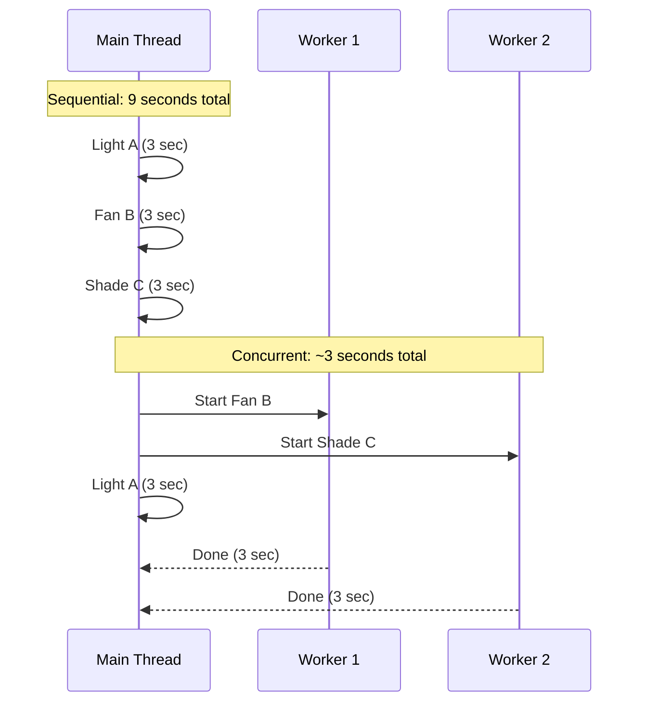
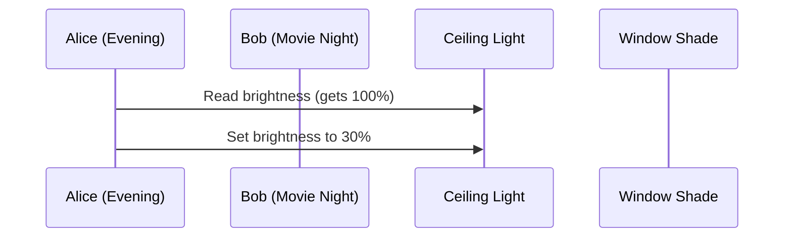
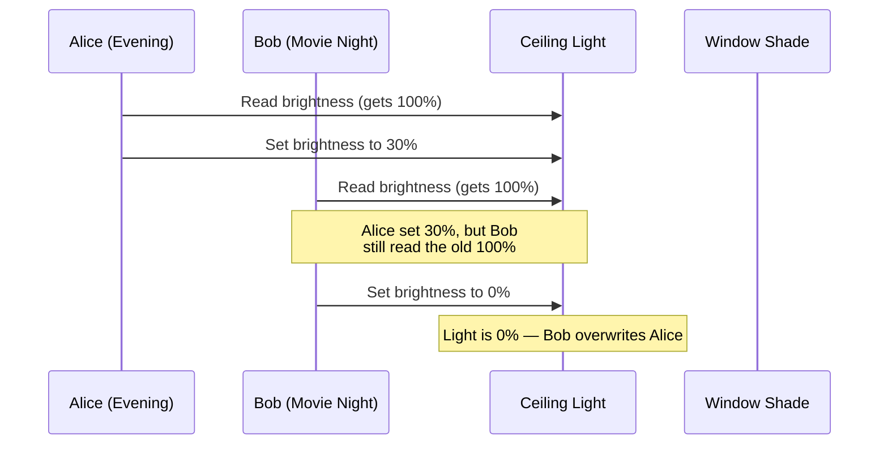
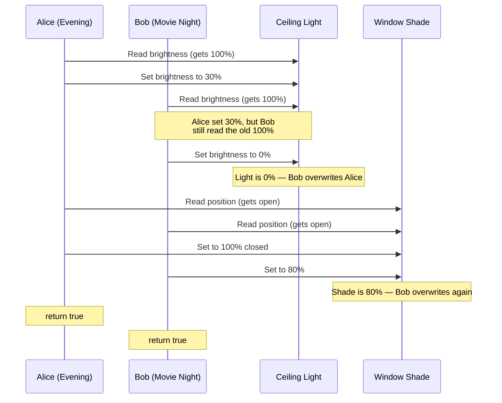
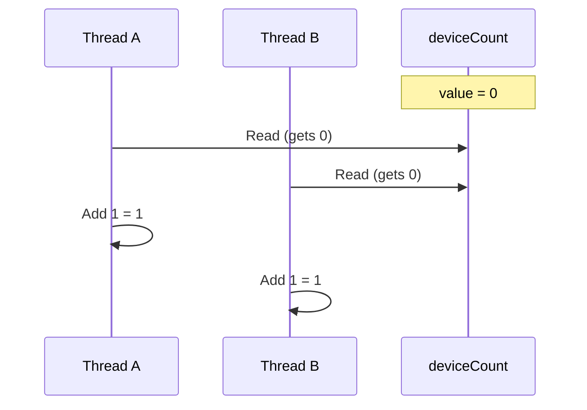
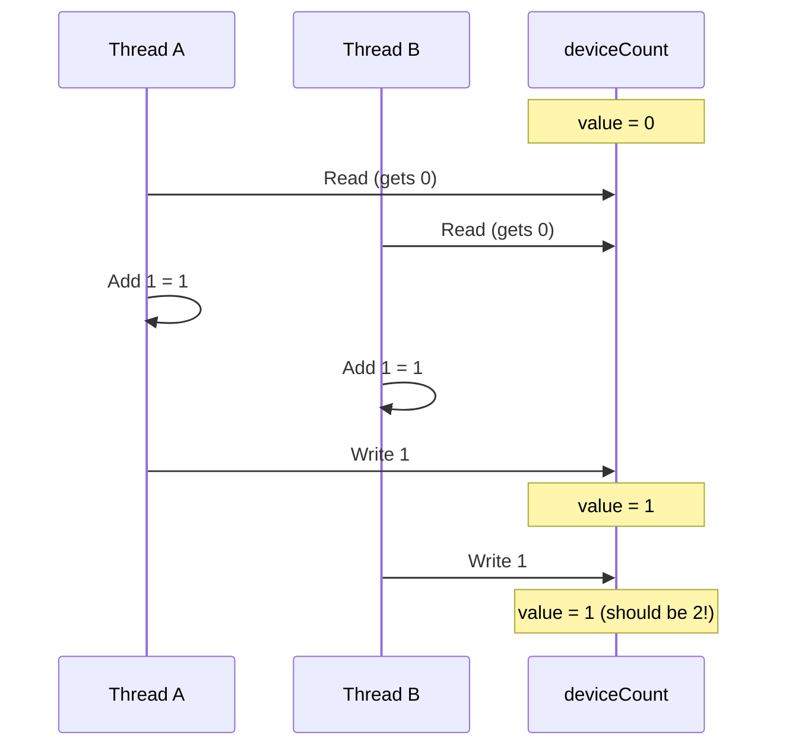
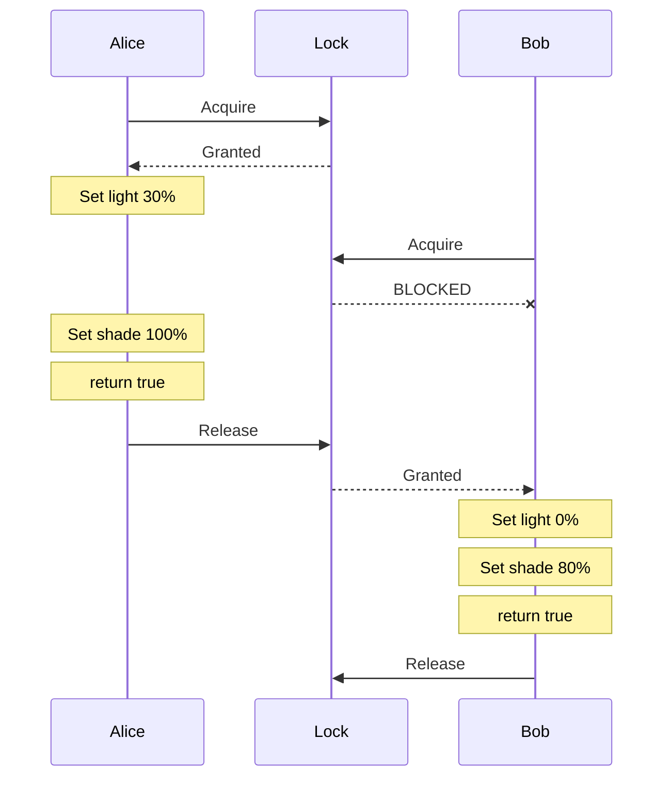
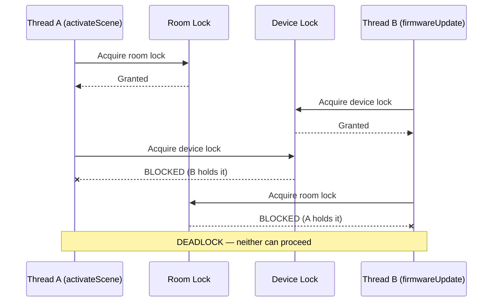

import RevealJS, { Slide } from '@site/src/components/RevealJS';
import Img from '@site/src/components/Img';

<RevealJS transition="slide">

{/* ============================================ */}
{/* COVER IMAGE */}
{/* ============================================ */}

<Slide>
  

<aside className="notes">
**Lecture overview:**
- **Total time:** ~55 minutes
- **Prerequisites:** L29 (GUIs in Java, event loop), L30 (MVVM, property binding), L12 (Domain Modeling)
- **Connects to:** L32 (Async/CompletableFuture), L33 (Event-Driven Architecture), GA1 (BackgroundTaskRunner)

**Structure (~22 slides):**
- Arc 1: Why Concurrency? + Week Roadmap (~10 min) — motivating scenario, three-lecture overview, concurrency vs parallelism
- Arc 2: Threads (~12 min) — creating threads, thread pools, interrupts
- Arc 3: The Problem — Shared Mutable State (~12 min) — race conditions, atomicity, Java Memory Model
- Arc 4: Solving It — Synchronization (~12 min) — synchronized, fine-grained locking, concurrent collections
- Arc 5: Deadlock (~8 min) — deadlock scenario, Coffman conditions, prevention
- Arc 6: Wrap-Up (~5 min) — comprehension check, takeaways, looking ahead

**Running example:** SceneItAll — the IoT/smarthome platform students know from L2, L13, L29, L30, Labs 11-12. IoT is a natural fit for concurrency: many devices, many users, many network calls, real-time state that must stay consistent.

> **Transition:** Let's start with the learning objectives...
</aside>

</Slide>

{/* ============================================ */}
{/* TITLE SLIDE */}
{/* ============================================ */}

<Slide>

# CS 3100: Program Design and Implementation II

## Lecture 31: Concurrency I — Threads and Synchronization

<p style={{marginTop: '2em', fontSize: '0.8em', color: '#666'}}>
  &copy;2026 Jonathan Bell, CC-BY-SA
</p>

<aside className="notes">
**Context from previous lectures:**
- L29: Built a SceneItAll area dashboard — introduced the event loop. "Long handlers freeze the UI."
- L30: MVVM, property binding, ObservableList, ViewModel testing. Students are deep in the SceneItAll domain.
- L12: Domain modeling — competing actions on the same domain objects. Today we see the technical version of that problem.
- Today: why concurrency matters, how threads work, what goes wrong with shared state, and how to fix it.

> **Transition:** Here's what you'll be able to do after today...
</aside>

</Slide>

{/* ============================================ */}
{/* LEARNING OBJECTIVES */}
{/* ============================================ */}

<Slide>

## Learning Objectives

<p style={{fontSize: '0.85em', textAlign: 'left'}}>
After this lecture, you will be able to:
</p>

<ol style={{fontSize: '0.75em', textAlign: 'left'}}>
  <li>Describe threads as a concurrency mechanism</li>
  <li>Recognize the need for synchronization and atomicity</li>
  <li>Utilize locks and concurrent collections to implement basic thread-safe code</li>
  <li>Understand deadlocks and race conditions</li>
</ol>

<aside className="notes">
**Time allocation:**
- Objective 1: Threads and thread pools (~12 min)
- Objective 2: Shared mutable state, race conditions, atomicity (~12 min)
- Objective 3: synchronized, concurrent collections (~12 min)
- Objective 4: Deadlock scenarios and prevention (~8 min)
- Wrap-up: comprehension check, takeaways (~5 min)

**Connection to GA1:** The GA1 handout provides `BackgroundTaskRunner` — students need to understand what it does internally. Today's concepts are the foundation.

> **Transition:** Let me set the scene...
</aside>

</Slide>

{/* ============================================ */}
{/* ARC 1: WHY CONCURRENCY? + WEEK ROADMAP (~10 min) */}
{/* ============================================ */}

<Slide>

## 50 Devices, 3 Users, 1 Hub

<div style={{fontSize: '0.8em'}}>

SceneItAll's hub manages **50 smart devices** — lights, fans, shades, thermostats — across a whole house.

Three family members walk in and activate scenes **simultaneously** from different rooms:

| User | Scene | Devices | Sequential time |
|------|-------|---------|----------------|
| Alice | "Evening" | 15 devices (dim lights, close shades) | ~5 sec |
| Bob | "Movie Night" | 8 devices (lights off, shades closed) | ~3 sec |
| Carol | "Study" | 6 devices (desk lamp on, overhead dim) | ~2 sec |

</div>

<p style={{fontSize: '0.85em', marginTop: '0.8em'}}>
<strong>Sequential:</strong> 10 seconds of delay — Alice waits, Bob waits longer, Carol waits longest.<br/>
<strong>Concurrent:</strong> All three scenes activate within ~5 seconds.
</p>

<p style={{fontSize: '0.8em', color: '#9370DB', marginTop: '0.5em'}}>
Remember L29: "long handlers freeze the UI." Same problem — now the hub <em>is</em> the UI.
</p>

<aside className="notes">
**The hook:** Students know SceneItAll well from L29/L30 and Labs 11-12. The motivating scenario is concrete: three people arrive home, tap their phones, and expect instant responses. Sequential processing means Carol waits 10 seconds for her desk lamp.

**L29 callback:** In L29 we said if an event handler takes too long, the whole UI freezes. The hub has the same problem — if it processes commands one at a time, every user waits for every other user.

> **Transition:** This week we solve this problem in three steps...
</aside>

</Slide>

<Slide>

## The Concurrency Roadmap: This Week and GA1

<div style={{fontSize: '0.75em'}}>

| Lecture | Topic | The question it answers |
|---------|-------|------------------------|
| **L31 (today)** | Threads, shared state, synchronization, deadlock | *"Why does my GUI freeze when I load data?"* |
| **L32 (Wed)** | Async programming, CompletableFuture, `Platform.runLater()` | *"How do I load data in the background and update my GUI when it's ready?"* |
| **L33 (Thu)** | Event-driven architecture, consistency, resilience | *"What happens when the service I depend on is slow or down?"* |

</div>

<div style={{fontSize: '0.8em', backgroundColor: 'rgba(147,112,219,0.15)', padding: '0.8em', borderRadius: '8px', marginTop: '0.8em'}}>

**GA1 connection:** These concepts are the foundation for GA1's `BackgroundTaskRunner` — more in the Looking Ahead slide.

</div>

<aside className="notes">
**The three-lecture arc:** L31 builds the mental model (threads, shared state, locks). L32 gives the practical tool (CompletableFuture, Platform.runLater). L33 zooms out to system-level coordination (events, consistency).

**BackgroundTaskRunner:** This is provided in the GA1 handout code. It wraps javafx.concurrent.Task with daemon threads and FX-thread callbacks. Students call `BackgroundTaskRunner.run(() -> loadData(), data -> updateUI(data), ex -> showError(ex))`. They don't write the threading code, but TAs will ask what happens under the hood during code walks.

**GA1 connection:** The concepts from this week directly address the "Handling asynchronous operations in a GUI context" learning outcome in GA1.

> **Transition:** Before we dive in, let's clarify two terms people often confuse...
</aside>

</Slide>

<Slide>

## Concurrency Is Not Parallelism

<div style={{display: 'grid', gridTemplateColumns: '1fr 1fr', gap: '1em', fontSize: '0.7em'}}>

<div style={{backgroundColor: 'rgba(100,149,237,0.15)', padding: '0.5em 0.7em', borderRadius: '8px'}}>

**Concurrency** = managing overlapping tasks (*structure*)

</div>

<div style={{backgroundColor: 'rgba(50,205,50,0.15)', padding: '0.5em 0.7em', borderRadius: '8px'}}>

**Parallelism** = executing simultaneously (*execution*)

</div>

</div>


<p style={{fontSize: '0.8em', color: '#9370DB'}}>
Your laptop has ~8 cores but hundreds of threads running right now. You get <strong>both</strong>: parallelism across cores, concurrency within each core. The bugs we'll see today apply to all of it.
</p>

<aside className="notes">
**Key distinction:** Concurrency is about *structure* — designing your program to handle multiple things. Parallelism is about *execution* — actually running things at the same time on multiple cores.

**The real world is row 3.** A modern laptop has 8-16 cores, but the OS is running hundreds of threads. Each core time-slices between many threads. You get parallelism (multiple cores) AND concurrency (many threads per core). This is why concurrency bugs are so hard to reproduce — the exact interleaving depends on how the OS schedules threads across cores, which varies every time.

**Analogy:** A single chef (1 core) can manage 3 dishes concurrently by switching between them. Three chefs (3 cores) can work on all three dishes in parallel. A real restaurant kitchen (8 cores, 50 orders) has both — chefs switch between dishes AND work in parallel. If two chefs grab the same pan, you have a problem regardless.

> **Transition:** Let's look at the mechanism Java gives us for concurrency...
</aside>

</Slide>

{/* ============================================ */}
{/* ARC 2: THREADS (~12 min) */}
{/* ============================================ */}

<Slide>

## A Thread Is an Independent Path of Execution

<p style={{fontSize: '0.85em'}}>
Every Java program has a <strong>main thread</strong>. You can create additional threads that run simultaneously. Threads share the <strong>heap</strong> (device state, scene definitions) but have their <strong>own stack</strong> (local variables).
</p>



<aside className="notes">
**Shared heap, separate stacks:** This is the key mental model. The heap is where objects live — Device objects, Scene objects, the ConcurrentHashMap of registered devices. Every thread can see and modify these. The stack is local — each thread's method call frames, local variables, parameters. This is private to each thread.

**The shared heap is what makes concurrency dangerous.** If threads only used their own stacks, there would be no concurrency bugs. The problems start when two threads read and write the same heap objects.

**Full imports for the code in this section (if students ask):**
```java
import java.util.concurrent.ExecutorService;
import java.util.concurrent.Executors;
import java.util.concurrent.Future;
import java.util.concurrent.TimeUnit;
import java.util.concurrent.TimeoutException;
import java.time.Duration;
```

> **Transition:** Let's see the three ways to create threads in Java...
</aside>

</Slide>

<Slide>

## Creating Threads in Java

<div style={{fontSize: '0.7em'}}>

```java
// Option 1: Extend Thread (not recommended — limits inheritance)
public class DeviceCommandSender extends Thread {
    private final DeviceCommand command;
    public DeviceCommandSender(DeviceCommand command) { this.command = command; }

    @Override
    public void run() {
        DeviceResponse response = sendViaZigbee(command);
        log.info("Command sent: " + response.getStatus());
    }
}
new DeviceCommandSender(command).start();

// Option 2: Implement Runnable (preferred — doesn't burn your one superclass)
Thread thread = new Thread(new DeviceCommandTask(command));
thread.start();

// Option 3: Lambda (most concise — use for simple tasks)
new Thread(() -> {
    DeviceResponse response = sendViaZigbee(command);
    log.info("Light dimmed: " + response.getStatus());
}).start();
```

</div>

<p style={{fontSize: '0.85em', marginTop: '0.8em'}}>
Prefer <code>Runnable</code> / lambda. Java has single inheritance — extending <code>Thread</code> means you can't extend anything else.
</p>

<aside className="notes">
**Option 3 (lambda) is what students will actually use.** But they need to know Options 1-2 to read legacy code and understand what's happening under the hood.

**Common misconception:** Calling `run()` directly does NOT start a new thread — it executes on the current thread. You must call `start()`. This is a classic exam question.

**But don't do any of these in production.** Next slide: thread pools. Creating raw threads is like opening raw sockets — you can, but you almost never should.

> **Transition:** But creating a thread per device command has problems...
</aside>

</Slide>

<Slide>

## Thread Pools: Don't Create a Thread Per Device

<div style={{fontSize: '0.75em'}}>

```java
public class HubCommandService {
    // A pool of 10 command worker threads
    private final ExecutorService executor = Executors.newFixedThreadPool(10);

    public void activateScene(Scene scene, Area room) {
        for (Device device : room.getDevices()) {
            executor.submit(() -> {
                DeviceState target = scene.getTargetState(device);
                DeviceResponse response = sendViaZigbee(
                    new DeviceCommand(device, target)
                );
                device.updateStatus(parseResponse(response));
            });
        }
    }

    public void shutdown() {
        executor.shutdown();
    }
}
```

</div>

<p style={{fontSize: '0.8em', marginTop: '0.5em'}}>
"Evening" scene sends 15 device commands. Pool processes 10 at once, 5 queue up. Like a kitchen with fixed staff — orders go on a queue, cooks grab the next one when they're free.
</p>

<aside className="notes">
**Why not one thread per command?** Each thread costs 512KB-1MB of stack memory. For 15 commands, that's fine. But a hub with 200 devices, 10 users, and concurrent scene activations could spawn hundreds of threads — eating memory and causing excessive context switching.

**Thread pool benefits:**
- Reuses threads (no creation/destruction overhead per task)
- Bounds resource usage (at most 10 threads active)
- Queues excess work automatically
- Clean shutdown via `executor.shutdown()`

**The kitchen analogy:** A restaurant doesn't hire a new cook for every order. It has a fixed staff (the pool) and orders queue up on the pass. Same idea.

**Full imports:**
```java
import java.util.concurrent.ExecutorService;
import java.util.concurrent.Executors;
```

> **Transition:** What if a device stops responding?
</aside>

</Slide>

<Slide>

## Interrupts: What If a Device Stops Responding?

<div style={{fontSize: '0.72em'}}>

```java
public class TimedCommandSender {
    private final ExecutorService executor = Executors.newSingleThreadExecutor();

    public DeviceResponse sendWithTimeout(DeviceCommand command,
                                           Duration timeout) {
        Future<DeviceResponse> future = executor.submit(
            () -> sendViaZigbee(command)
        );
        try {
            return future.get(timeout.toMillis(), TimeUnit.MILLISECONDS);
        } catch (TimeoutException e) {
            future.cancel(true);  // Interrupts the worker thread
            return DeviceResponse.timeout(
                "Device exceeded " + timeout.toSeconds() + "s"
            );
        } catch (InterruptedException | ExecutionException e) {
            future.cancel(true);  // Clean up if still running
            return DeviceResponse.error("Command failed: " + e.getMessage());
        }
    }
}
```

</div>

<div style={{fontSize: '0.72em'}}>

```java
// The other side: the worker must CHECK for interrupts
public void applyFirmwareChunks(Device device, List<byte[]> chunks) {
    for (byte[] chunk : chunks) {
        if (Thread.currentThread().isInterrupted()) { return; }  // cooperative!
        device.writeChunk(chunk);
    }
}
```

</div>

<p style={{fontSize: '0.8em', marginTop: '0.3em'}}>
Interrupts are <strong>cooperative</strong> — <code>cancel(true)</code> sets the interrupt flag and interrupts blocking calls (like <code>Thread.sleep()</code> or I/O), but the worker must check it or handle the exception. <code>Thread.stop()</code> was deprecated in 1997 — forcibly killing threads corrupts shared state.
</p>

<aside className="notes">
**The scenario:** A smart bulb hangs during a firmware update. The command thread blocks on `sendViaZigbee()` forever. Without intervention, that thread is gone from the pool permanently.

**What `future.get(timeout, unit)` can throw (three different situations):**
- **`TimeoutException`** — The wait ended before the task produced a result. The hub thread calling `sendWithTimeout` is fine; the worker may still be stuck in `sendViaZigbee`. `future.cancel(true)` asks that worker to stop; you return `DeviceResponse.timeout(...)` to the caller.
- **`InterruptedException`** — The *calling* thread was interrupted while blocked inside `get` (e.g. shutdown, higher-level cancellation). You must end the wait cooperatively: `future.cancel(true)`, then `Thread.currentThread().interrupt()` so callers up the stack still see the interrupt, and return `DeviceResponse.error(...)` (or similar) instead of swallowing it silently.
- **`ExecutionException`** — The task finished but threw. The failure from `sendViaZigbee` is wrapped in `ExecutionException`; use `getCause()` for the real `Throwable` and fold its message into `DeviceResponse.error(...)`. Cancel is unnecessary—the task already completed unsuccessfully.

**Disambiguation for students:** `InterruptedException` on `get` means *this* thread (whoever called `sendWithTimeout`) was interrupted while waiting. That is different from the worker thread blocking in `sendViaZigbee`: after a **timeout**, `cancel(true)` tries to interrupt *that* worker so it can unwind cooperatively—the paragraph below is about *that* side.

**`cancel(true)`** calls `Thread.interrupt()` on the worker thread, which both sets the interrupt flag AND wakes threads blocked in interruptible operations (like `Thread.sleep()`, `BlockingQueue.take()`, I/O) by throwing `InterruptedException`. The thread can then clean up and exit.

**Why not `Thread.stop()`?** Imagine stopping a thread halfway through updating a device's firmware. The device is now in an unknown state — partially updated firmware. The method was deprecated in Java 1.1 (1997) because forcible termination corrupts shared state.

**Full imports:**
```java
import java.util.concurrent.ExecutionException;
import java.util.concurrent.ExecutorService;
import java.util.concurrent.Executors;
import java.util.concurrent.Future;
import java.util.concurrent.TimeUnit;
import java.util.concurrent.TimeoutException;
import java.time.Duration;
```

> **Transition:** Now we know how to create and manage threads. But there's a problem lurking...
</aside>

</Slide>

{/* ============================================ */}
{/* ARC 3: THE PROBLEM — SHARED MUTABLE STATE (~12 min) */}
{/* ============================================ */}

<Slide>

## Two Users Activate Different Scenes at the Same Time

<p style={{fontSize: '0.85em'}}>
Alice activates "Evening" (lights to 30%, shades closed). Bob activates "Movie Night" (lights off, shades to 80%). Same room, same instant. This code handles it:
</p>

<div style={{fontSize: '0.72em'}}>

```java
public class SceneService {
    public boolean activateScene(Scene scene, Area room) {
        for (Device device : room.getDevices()) {
            DeviceState targetState = scene.getTargetState(device);
            if (targetState != null) {
                device.setState(targetState);  // sets brightness, shadePosition, etc.
            }
        }
        return true;
    }
}
```

</div>

<p style={{fontSize: '0.8em', color: '#9370DB'}}>
Looks correct. What could go wrong?
</p>

<aside className="notes">
**Pause here and ask students.** The code is simple — iterate through devices, set each one's state. What could possibly go wrong? Let them think about it before showing the next slide.

> **Transition:** Let's trace what happens when two threads run this simultaneously...
</aside>

</Slide>

<Slide>

## The Interleaving (1/3): Alice Goes First



<p style={{fontSize: '0.85em'}}>
Alice reads the light at 100%, sets it to 30%. So far so good...
</p>

<aside className="notes">
**Pause here.** "Nothing wrong yet. Alice reads 100%, sets 30%. Normal. What happens if Bob arrives right now?"
</aside>

</Slide>

<Slide>

## The Interleaving (2/3): Bob Reads Stale Data



<p style={{fontSize: '0.85em', color: '#e06c75'}}>
Bob reads <strong>100%</strong> — not Alice's 30%. His write overwrites hers. The light is now 0%.
</p>

<aside className="notes">
**This is the key moment.** Bob read the light's brightness *before* Alice's write was visible to him (or between Alice's reads of different devices). His `setBrightness(0)` overwrites Alice's `setBrightness(30)`. Alice's change to the light is silently lost.

"And the same thing is about to happen with the shades..."
</aside>

</Slide>

<Slide>

## The Interleaving (3/3): Nobody Got What They Wanted



<p style={{fontSize: '0.8em', color: '#e06c75', marginTop: '0.3em'}}>
Light = 0% (Bob wins). Shades = 80% (Bob wins). Both got <code>true</code>. <strong>Neither scene actually applied.</strong>
</p>

<aside className="notes">
**The scary part:** Both methods return `true`. No exception. No crash. The room is silently in a mixed state. Alice thinks "Evening" is active. Bob thinks "Movie Night" is active. Neither is correct.

**Key question to ask:** "How would you even know this happened? No error was thrown. The only way to discover it is to look at the room and notice the lights and shades don't match any scene."

**Connect to L12:** In L12 (Domain Modeling) we discussed competing actions on shared domain objects. That was a modeling challenge. Here's the technical manifestation — even with a correct domain model, concurrent access corrupts state.

> **Transition:** This has a name...
</aside>

</Slide>

<Slide>

## Race Conditions: When Correctness Depends on Luck

<div style={{fontSize: '0.8em'}}>

A **race condition** occurs when the program's behavior depends on the relative timing of operations, which is unpredictable. The core issue: operations that need to be **atomic** (indivisible — no other thread can see them mid-execution) are actually multiple steps that can be interleaved.

</div>

<div style={{fontSize: '0.75em'}}>

Common patterns:

| Pattern | Example | Why it's dangerous |
|---------|---------|-------------------|
| **Check-then-act** | `if (!scenes.containsKey(name)) scenes.put(name, scene)` | Another thread puts first |
| **Read-modify-write** | `deviceCount++` | Two threads read same value |
| **Compound action** | Read state + write new state across multiple devices | Interleaving between reads and writes |

</div>

<p style={{fontSize: '0.85em', marginTop: '0.8em', color: '#e06c75'}}>
"These bugs are timing-dependent — your tests pass 99 times, fail once, and you can't reproduce it."
</p>

<aside className="notes">
**Why race conditions are terrifying:**
- They don't throw exceptions
- They don't crash the program
- They produce silently wrong results
- They depend on timing, so they might never appear in testing
- They appear in production under load, when timing changes

**The check-then-act pattern** is extremely common. Students will write `if (!map.containsKey(key)) map.put(key, value)` and think it's safe. It's not — another thread can insert between the check and the put.

**Note:** Check-then-act and compound action are named here as a taxonomy. Students haven't seen code for these yet — read-modify-write is the one we'll drill next with `deviceCount++`. Check-then-act gets its fix on the concurrent collections slide (`putIfAbsent`).

> **Transition:** Let's look at the simplest possible race condition...
</aside>

</Slide>

<Slide>

## You Can't Even Trust deviceCount++ (1/2)

<p style={{fontSize: '0.85em'}}>
<code>deviceCount++</code> is <strong>three operations</strong>: read, add, write. Two threads registering devices simultaneously:
</p>



<p style={{fontSize: '0.85em'}}>
Both threads read 0. Both compute 1. What happens when they write?
</p>

<aside className="notes">
**Pause here.** "Both threads read the same value — 0. Both independently add 1. What value does each one write?" Students will say "1." "And what should the final value be?" "2." "But both are about to write 1..."
</aside>

</Slide>

<Slide>

## You Can't Even Trust deviceCount++ (2/2)



<p style={{fontSize: '0.85em', color: '#e06c75', marginTop: '0.3em'}}>
<strong>Lost update:</strong> Thread A writes 1. Thread B writes 1 — overwrites A's result with the same stale computation. One increment is silently lost. If you can't trust <code>deviceCount++</code>, how do you trust anything?
</p>

<aside className="notes">
**This is the "aha" moment.** Students think `deviceCount++` is a single operation because it's a single line of code. It's not — the JVM compiles it into read, add, write. Two threads can interleave between any of those steps.

**Expected result:** 2 (two devices registered). **Actual result:** 1 (one registration lost). No error, no exception — just silently wrong.

> **Transition:** And it gets worse...
</aside>

</Slide>

<Slide>

## The Java Memory Model: It Gets Worse

<p style={{fontSize: '0.85em'}}>
Beyond interleaving, there's a <strong>visibility</strong> problem. Modern CPUs have caches — writes by one thread may not be visible to another thread, even in the same process.
</p>


<p style={{fontSize: '0.8em', color: '#e06c75'}}>
Thread A writes <code>brightness = 30</code>. Thread B reads <code>brightness</code> — and gets <code>0</code>. Same object, same heap. Different CPU caches.
</p>

<aside className="notes">
**This is counterintuitive.** Students expect that if Thread A writes `brightness = 30`, Thread B will eventually see 30. But the JVM and CPU are allowed to cache writes, reorder instructions, and delay flushing to main memory — all for performance.

**Spend time on the diagram.** Core 1 has the updated values in its cache. Core 2's cache is stale. Main memory might or might not be updated yet — the JVM doesn't guarantee when writes flush. This is a real hardware effect, not a JVM quirk.

> **Transition:** Let's see what this looks like in code...
</aside>

</Slide>

<Slide>

## Visibility in Code

<div style={{fontSize: '0.72em'}}>

```java
public class DeviceStateHolder {
    private boolean ready = false;
    private int brightness = 0;

    // Thread A (scene activation worker) writes:
    public void updateBrightness() {
        brightness = 30;
        ready = true;
    }

    // Thread B (UI refresh worker) reads:
    public void checkBrightness() {
        while (!ready) { /* spin-wait — burns CPU; real code uses wait/notify */ }
        System.out.println(brightness);  // Might print 0!
    }
}
```

</div>

<div style={{fontSize: '0.8em'}}>

**Three things that can go wrong without synchronization:**
1. Thread B **never sees** `ready = true` — spins forever (write cached, never flushed)
2. Thread B sees `ready = true` but `brightness = 0` — **CPU may execute the write to `ready` before the write to `brightness` reaches memory**
3. Thread B sees both correctly — works today, **breaks tomorrow** on different hardware

</div>

<p style={{fontSize: '0.8em', color: '#9370DB'}}>
The fix: <code>synchronized</code>, <code>volatile</code>, or atomic classes — all establish a "happens-before" relationship that guarantees visibility.
</p>

<p style={{fontSize: '0.8em', color: '#e06c75'}}>
Caution: <code>volatile</code> fixes visibility but does NOT fix compound operations — <code>volatile int count; count++</code> is still a race condition.
</p>

<aside className="notes">
**All three outcomes are legal** under the Java Memory Model without synchronization. The JVM is free to reorder writes and delay cache flushes for performance. This is why "it works on my machine" is so dangerous with concurrency — different hardware has different cache behavior.

**Option 3 is the scariest** — the code appears to work during development and testing, then breaks in production on a machine with a different CPU architecture or more cores.

> **Transition:** So how do we fix all of this?
</aside>

</Slide>

{/* ============================================ */}
{/* ARC 4: SOLVING IT — SYNCHRONIZATION (~12 min) */}
{/* ============================================ */}

<Slide>

## synchronized: One Scene at a Time

<div style={{display: 'grid', gridTemplateColumns: '1fr 1.2fr', gap: '0.5em'}}>

<div style={{fontSize: '0.62em'}}>

```java
public class SceneService {
    public synchronized boolean
        activateScene(
            Scene scene, Area room) {
        // Only one thread at a time
        for (Device d : room.getDevices()) {
            DeviceState target =
                scene.getTargetState(d);
            if (target != null) {
                d.setState(target);
            }
        }
        return true;
    }
}
```

</div>

<div>



</div>

</div>

<p style={{fontSize: '0.85em', marginTop: '0.3em'}}>
Now the scene activation is <strong>atomic</strong>. The room goes "Evening" then "Movie Night", never a mix.
</p>

<aside className="notes">
**This is the fix for slide 9's bug.** Adding `synchronized` to the method means the JVM acquires a lock (monitor) on the `SceneService` instance before entering the method. If another thread already holds the lock, the caller blocks until it's released.

**Bob's thread waits.** It doesn't crash, doesn't get an exception — it simply waits until Alice's scene finishes applying. Then Bob's scene applies cleanly. The room transitions from "Evening" to "Movie Night" in sequence, never a mix.

> **Transition:** What exactly does synchronized guarantee?
</aside>

</Slide>

<Slide>

## What synchronized Actually Does

<div style={{fontSize: '0.8em'}}>

`synchronized` provides **two guarantees:**

</div>

<div style={{display: 'grid', gridTemplateColumns: '1fr 1fr', gap: '1.5em', fontSize: '0.8em'}}>

<div style={{backgroundColor: 'rgba(100,149,237,0.15)', padding: '0.8em', borderRadius: '8px'}}>

**1. Mutual Exclusion**

Only one thread can execute the synchronized block at a time. Bob's scene activation waits until Alice's finishes.

Fixes the **race condition** from slide 9.

</div>

<div style={{backgroundColor: 'rgba(50,205,50,0.15)', padding: '0.8em', borderRadius: '8px'}}>

**2. Visibility**

When a thread releases a lock, all its writes are flushed to main memory. When another thread acquires the same lock, it sees all those writes.

Fixes the **memory visibility** problem from slide 12.

</div>

</div>

<p style={{fontSize: '0.85em', marginTop: '1em'}}>
<code>synchronized</code> fixes <em>both</em> the interleaving problem and the caching problem. That's why it's the fundamental building block.
</p>

<aside className="notes">
**Two bugs, one fix.** Students often think `synchronized` is only about mutual exclusion. The visibility guarantee is equally important — it's what ensures Thread B sees Thread A's brightness changes after acquiring the lock.

**The "happens-before" relationship:** Releasing a lock "happens-before" acquiring the same lock. This means all writes before the release are visible after the acquire. This is formalized in the Java Language Specification.

> **Transition:** But locking the whole service is too coarse...
</aside>

</Slide>

<Slide>

## Fine-Grained Locking: Don't Lock the Whole House

<div style={{fontSize: '0.72em'}}>

```java
public class SceneService {
    // One lock per room (ConcurrentHashMap because multiple threads may add rooms simultaneously)
    private final Map<String, Object> roomLocks = new ConcurrentHashMap<>();

    public boolean activateScene(Scene scene, Area room) {
        Object roomLock = roomLocks.computeIfAbsent(
            room.getId(), k -> new Object()  // lock objects just serve as monitors
        );
        synchronized (roomLock) {
            for (Device device : room.getDevices()) {
                DeviceState targetState = scene.getTargetState(device);
                if (targetState != null) {
                    device.setState(targetState);
                }
            }
            return true;
        }
    }
}
```

</div>

<p style={{fontSize: '0.85em', marginTop: '0.5em'}}>
Alice activates "Evening" in the <strong>living room</strong>, Bob activates "Movie Night" in the <strong>bedroom</strong> — both proceed in parallel because they lock <strong>different rooms</strong>.
</p>

<p style={{fontSize: '0.8em', color: '#9370DB'}}>
Use dedicated lock objects: <code>synchronized(roomLock)</code> not <code>synchronized(this)</code>.
</p>

<aside className="notes">
**Why fine-grained?** With `synchronized` on the whole method, Alice's living room scene blocks Bob's bedroom scene — even though they don't share any devices. Fine-grained locking (one lock per room) lets independent operations proceed in parallel.

**Dedicated lock objects:** Using `synchronized(this)` exposes the lock to external code — anyone with a reference to the object can synchronize on it, potentially causing unexpected blocking. A private lock object keeps locking internal.

**Tradeoff:** More locks = more parallelism but more complexity. Fewer locks = simpler but less parallelism. For SceneItAll, per-room locking is a good balance.

> **Transition:** Java also provides ready-made thread-safe collections...
</aside>

</Slide>

<Slide>

## Concurrent Collections and AtomicInteger

<div style={{fontSize: '0.72em'}}>

```java
public class DeviceRegistry {
    // Thread-safe map — no external synchronization needed
    private final ConcurrentHashMap<String, Device> devices =
        new ConcurrentHashMap<>();

    // Thread-safe counter — fixes the deviceCount++ bug
    private final AtomicInteger deviceCount = new AtomicInteger(0);

    public void registerDevice(Device device) {
        // putIfAbsent: atomic check-and-put — fixes the check-then-act race from earlier
        Device existing = devices.putIfAbsent(device.getId(), device);
        if (existing == null) {
            deviceCount.incrementAndGet();  // Atomic increment
        }
    }

    public int getDeviceCount() {
        return deviceCount.get();
    }
}
```

</div>

<div style={{fontSize: '0.75em', marginTop: '0.5em'}}>

| Collection | Use case |
|-----------|----------|
| `ConcurrentHashMap` | Device registry — many readers, occasional writers |
| `AtomicInteger` | Counters — `deviceCount`, `commandsSent` |
| `BlockingQueue` | Command queue — producers (users) and consumers (workers) |
| `CopyOnWriteArrayList` | Listener lists — read-heavy, rarely modified |

</div>

<p style={{fontSize: '0.8em', color: '#9370DB', marginTop: '0.3em'}}>
Use these — the experts already debugged them.
</p>

<aside className="notes">
**This fixes the slide 11 bug.** `AtomicInteger.incrementAndGet()` uses hardware-level compare-and-swap (CAS) to atomically read, add, and write. No lock needed, no lost updates.

**`putIfAbsent`** is the atomic version of the check-then-act pattern: `if (!map.containsKey(key)) map.put(key, value)`. One atomic operation instead of two separate ones.

**Full imports:**
```java
import java.util.concurrent.ConcurrentHashMap;
import java.util.concurrent.atomic.AtomicInteger;
import java.util.concurrent.BlockingQueue;
import java.util.concurrent.CopyOnWriteArrayList;
```

**Design principle:** Don't roll your own thread-safe data structures. Use `java.util.concurrent`. Doug Lea and team spent years getting these right.

> **Transition:** Synchronization solves race conditions, but it introduces a new problem...
</aside>

</Slide>

{/* ============================================ */}
{/* ARC 5: DEADLOCK (~8 min) */}
{/* ============================================ */}

<Slide>

## Deadlock: When Everyone Waits Forever (1/2)

<p style={{fontSize: '0.85em'}}>
Two methods, opposite lock ordering. What happens when they run simultaneously?
</p>

<div style={{fontSize: '0.72em'}}>

```java
public class SmartHomeService {
    public void activateScene(Scene scene, Area room) {
        synchronized (room) {                    // Lock room FIRST
            for (Device device : room.getDevices()) {
                synchronized (device) {          // Then lock device
                    device.setState(scene.getTargetState(device));
                }
            }
        }
    }

    public void firmwareUpdate(Device device, Area room,
                                FirmwarePackage firmware) {
        synchronized (device) {                  // Lock device FIRST
            synchronized (room) {                // Then lock room
                device.applyFirmware(firmware);
                room.updateDeviceManifest(device);  // update firmware version in room's manifest
            }
        }
    }
}
```

</div>

<p style={{fontSize: '0.8em', color: '#9370DB', marginTop: '0.5em'}}>
Two threads. Opposite lock orders. What happens next?
</p>

<aside className="notes">
**Point out the lock ordering.** `activateScene` goes room → device. `firmwareUpdate` goes device → room. Ask students: "What happens if both run at the same time?"

Let them think. Some will see it. Then advance to the next slide.
</aside>

</Slide>

<Slide>

## Deadlock: When Everyone Waits Forever (2/2)



<p style={{fontSize: '0.85em', color: '#e06c75'}}>
Both threads are stuck. The living room lights are frozen at 100%. <strong>Forever.</strong> Unlike a race condition (wrong results), deadlock produces <strong>no results</strong>. No error. No exception. The system just hangs.
</p>

<aside className="notes">
**Walk through the diagram step by step:**
1. Thread A gets the room lock. Fine.
2. Thread B gets the device lock. Also fine.
3. Thread A tries to get the device lock — blocked, B has it.
4. Thread B tries to get the room lock — blocked, A has it.
5. Neither can release what they hold because they're both stuck waiting.

**"Forever" is literal.** The user taps "activate scene" and nothing happens. No error message. No log entry. Just silence. That's worse than a crash — at least a crash tells you something went wrong.

> **Transition:** How do we prevent this?
</aside>

</Slide>

<Slide>

## Preventing Deadlock: Break the Cycle

<p style={{fontSize: '0.85em'}}>
Deadlock happens because of a <strong>circular wait</strong>: Thread A holds lock X and waits for lock Y, while Thread B holds lock Y and waits for lock X. Neither can proceed.
</p>

<p style={{fontSize: '0.85em'}}>
The simplest fix: <strong>always acquire locks in the same order.</strong>
</p>

<div style={{display: 'grid', gridTemplateColumns: '1fr 1fr', gap: '1em', fontSize: '0.68em'}}>

<div style={{backgroundColor: 'rgba(200,74,74,0.15)', padding: '0.8em', borderRadius: '8px'}}>

**Before (deadlock possible)**

```java
// activateScene: room → device
synchronized (room) {
    synchronized (device) { ... }
}

// firmwareUpdate: device → room
synchronized (device) {
    synchronized (room) { ... }
}
```

Different order → circular wait → deadlock

</div>

<div style={{backgroundColor: 'rgba(50,205,50,0.15)', padding: '0.8em', borderRadius: '8px'}}>

**After (deadlock impossible)**

```java
// activateScene: room → device
synchronized (room) {
    synchronized (device) { ... }
}

// firmwareUpdate: room → device
synchronized (room) {
    synchronized (device) { ... }
}
```

Same order → no cycle → no deadlock

</div>

</div>

<aside className="notes">
**Consistent lock ordering is a convention, not a mechanism.** The language doesn't enforce it — you enforce it through code review and documentation. "In this codebase, we always lock rooms before devices." Simple rule, prevents an entire class of bugs.

**If students ask about other approaches:** You can also use `tryLock()` with a timeout (back off if you can't get the lock), or reduce lock scope (release one lock before acquiring another). But consistent ordering is the go-to strategy — it's the simplest and most reliable.

> **Transition:** Before we wrap up, let's talk about why these bugs are so hard to catch...
</aside>

</Slide>

{/* ============================================ */}
{/* ARC 6: WRAP-UP (~5 min) */}
{/* ============================================ */}

<Slide>

## Concurrency Bugs Are the Hardest Bugs

<div style={{fontSize: '0.8em'}}>

Why they're hard:

- **Timing-dependent** — the bug only appears under specific interleavings
- **Non-reproducible** — run the same test twice, get different results
- **Load-dependent** — works fine with 5 devices, glitches with 50

</div>

<p style={{fontSize: '0.85em', marginTop: '0.8em'}}>
The family's lights work fine with 5 devices. Add a 6th and scenes start glitching. Add a firmware update and the hub deadlocks. These bugs grow with scale.
</p>

<div style={{fontSize: '0.8em', marginTop: '0.8em'}}>

**Detection strategies:**
1. **Code review** — look for shared mutable state accessed without synchronization
2. **Static analysis** — tools like SpotBugs detect common patterns
3. **Stress testing** — activate 10 scenes simultaneously, verify device states
4. **Design** — prefer immutable objects, concurrent collections, minimal shared state

</div>

<p style={{fontSize: '0.85em', color: '#9370DB', marginTop: '0.5em'}}>
"The best concurrency bug is the one you avoid by not sharing mutable state."
</p>

<aside className="notes">
**This is a mindset slide.** The takeaway isn't "memorize these four strategies" — it's "concurrency bugs are qualitatively different from the bugs you've encountered so far."

**Normal bugs** are deterministic — same input, same output, every time. You can set a breakpoint and step through.

**Concurrency bugs** are nondeterministic — they depend on scheduling, CPU speed, cache behavior, load, and phase of the moon. Your test might pass 999 times and fail once. Adding a print statement changes the timing enough to make the bug disappear (a "Heisenbug").

**The best defense is design:** don't share mutable state in the first place. Use immutable records, concurrent collections, and message passing. When you must share state, use synchronization.

> **Transition:** Let's check your understanding...
</aside>

</Slide>

<Slide>

## Comprehension Check

<p style={{fontSize: '0.85em'}}>
Open Poll Everywhere and answer the three questions.
</p>

<aside className="notes">
**Quick verbal check before the poll (LO1):** "What's the difference between calling `thread.run()` and `thread.start()`?" (`run()` executes on the current thread; `start()` creates a new thread). This is the most common misconception from Arc 2.

**Poll Q1:** Two threads call `registerDevice()` simultaneously. The method does `if (!devices.containsKey(id)) devices.put(id, device); deviceCount++`. Neither method is synchronized. What can happen?
- A. One device is registered, the other is rejected cleanly
- B. Both devices are registered but `deviceCount` only increments once [CORRECT — lost update]
- C. ConcurrentModificationException
- D. Both devices and both increments succeed correctly

*Discussion: B is the scary answer — the check-then-act on `containsKey`/`put` and the read-modify-write on `deviceCount++` are both race conditions. Students must transfer what they learned from the scene activation and `deviceCount++` examples to a new scenario.*

**Poll Q2:** Thread A is executing `synchronized(livingRoomLock) { ... }`. Thread B tries to execute `synchronized(livingRoomLock) { ... }` on the same lock. Thread C tries to execute `synchronized(bedroomLock) { ... }`. What happens?
- A. B and C both block until A finishes
- B. B blocks; C executes immediately (different lock) [CORRECT]
- C. All three execute — synchronized doesn't actually block
- D. B throws an exception

*Discussion: This is the fine-grained locking payoff. Different rooms use different locks, so they can be controlled in parallel.*

**Poll Q3:** `activateScene()` locks room then device. `firmwareUpdate()` locks device then room. Which prevents deadlock?
- A. Both always lock room first, then device [CORRECT]
- B. Remove synchronized from both methods
- C. Use one global lock for the entire hub [Works but kills parallelism]
- D. Both A and C prevent deadlock, but A is better [CORRECT]

*Discussion: D is the most complete answer. A single global lock prevents deadlock but serializes everything — no parallelism between rooms. Consistent ordering (A) preserves fine-grained parallelism while preventing deadlock.*
</aside>

</Slide>

<Slide>

## Key Takeaways

<ol style={{fontSize: '0.8em'}}>
  <li><strong>Threads enable concurrency</strong> — multiple paths of execution sharing the same heap. Use thread pools, not raw threads.</li>
  <li><strong>Shared mutable state is dangerous.</strong> Race conditions produce silently wrong results. <code>deviceCount++</code> is not atomic.</li>
  <li><strong><code>synchronized</code> provides atomicity + visibility.</strong> Mutual exclusion prevents interleaving. Memory visibility ensures threads see each other's writes.</li>
  <li><strong>Use concurrent collections</strong> — <code>ConcurrentHashMap</code>, <code>AtomicInteger</code>, <code>BlockingQueue</code>. The experts already debugged them.</li>
  <li><strong>Fine-grained locking increases parallelism</strong> — lock per room, not per hub. But more locks = more deadlock risk.</li>
  <li><strong>Prevent deadlock with consistent lock ordering.</strong> Always acquire locks in the same order across all code paths.</li>
</ol>

<aside className="notes">
**Recap the arc:** We started with the motivating problem (50 devices, 3 users, 1 hub). We learned how threads work (creating, pooling, interrupting). We saw what goes wrong (race conditions, lost updates, stale data). We fixed it (synchronized, concurrent collections). And we saw the new problem synchronization creates (deadlock).

**Connection to GA1:** Students won't write raw thread code in GA1 — they'll use `BackgroundTaskRunner`. But they need to understand what it does internally, and they need to recognize when shared state is being accessed concurrently.

> **Transition:** What's coming next...
</aside>

</Slide>

<Slide>

## Looking Ahead

<div style={{fontSize: '0.85em'}}>

**L32 (Wednesday): Asynchronous Programming**
- Activating "Evening" means sending commands to 15 devices — each one a 200ms network call
- Threads are expensive for all that waiting
- `CompletableFuture` and `allOf` for fan-out patterns
- `Platform.runLater()` for updating your GA1 GUI from a background thread

**Lab 12 runs Monday** — GUI pair programming with Scene Builder

**Your group project:**
- GA1 (due Apr 9): `BackgroundTaskRunner` wraps the threading concepts from today
- Your TA will ask what happens under the hood — be ready to explain threads, shared state, and synchronization

</div>

<p style={{fontSize: '0.85em', marginTop: '1em', color: '#9370DB'}}>
Today: why shared state is dangerous and how locks protect it. Wednesday: how to avoid blocking threads entirely.
</p>

<aside className="notes">
**L32 preview:** Today we learned that threads can run work concurrently. But sending 15 device commands means 15 threads sitting around waiting for Zigbee responses. Each thread costs memory. L32 introduces async programming — instead of blocking a thread waiting for a response, you register a callback and move on. CompletableFuture makes this composable.

**Lab 12:** Students build SceneItAll GUI components using Scene Builder and MVVM patterns from L29-30. This is pair programming — they'll practice binding, property listeners, and FXML layout.

**GA1 connection:** Next slide dives into the specifics.

> **Transition:** Let's connect this to your group project...
</aside>

</Slide>

<Slide>

## GA1: Where This Shows Up in CookYourBooks

<div style={{fontSize: '0.75em'}}>

Every core feature has **one async operation** that uses `BackgroundTaskRunner`:

| Feature | Async Operation | What today's lecture explains |
|---------|----------------|------------------------------|
| **Library View** | `refresh()` loads collections | Background thread does I/O; FX thread updates `ObservableList` |
| **Recipe Editor** | `save()` persists edits | Save button disabled while saving — what if two saves race? |
| **Import** | OCR extraction from image | State machine (idle → processing → review) — each transition is a thread handoff |
| **Search & Filter** | Debounced search query | What if a slow search returns *after* a newer one? (race condition!) |

</div>

<div style={{fontSize: '0.8em'}}>

```java
BackgroundTaskRunner.run(
    () -> librarianService.listCollections(),   // background thread (I/O)
    collections -> { /* FX thread (update UI) */ },
    error -> { /* FX thread (show error) */ }
);
```

</div>

<p style={{fontSize: '0.85em', color: '#9370DB', marginTop: '0.3em'}}>
Your TA will ask: what thread does the callable run on? What thread do the callbacks run on? What breaks if you skip <code>Platform.runLater()</code>?
</p>

<aside className="notes">
**This is the GA1 payoff slide.** Students don't write raw thread code in GA1 — they use `BackgroundTaskRunner`. But they must understand what it does internally.

**Under the hood:** `BackgroundTaskRunner.run()` creates a `javafx.concurrent.Task`, runs it on a daemon thread, and uses `Platform.runLater()` to call `onSuccess`/`onFailure` on the FX thread. The callable (first arg) runs on the background thread. The callbacks (second and third args) run on the FX thread.

**Why this matters for each feature:**
- **Library View:** `refresh()` fetches collections on a background thread. The `loading` property is true while fetching. If you update `ObservableList` from the background thread, JavaFX throws `IllegalStateException`.
- **Recipe Editor:** `save()` runs persistence on a background thread. While saving, edit controls are disabled. If the save fails, you stay in edit mode with dirty state preserved — the user doesn't lose their work.
- **Import:** The OCR call can take seconds. The state machine (idle → processing → review/error) maps directly to thread handoffs — start OCR on background thread, transition to review/error on FX thread when it completes.
- **Search & Filter:** Debounced search has a subtle race condition: if the user types "cake", a search fires, then they type "cookies" and a second search fires — the first search might return *after* the second. Blindly accepting results shows "cake" results for "cookies". This is exactly the kind of concurrency bug we discussed today.

**TA code walk questions:**
- What thread does the callable run on? (Background/daemon thread)
- What thread do the callbacks run on? (FX Application Thread, via `Platform.runLater()`)
- What would break if the callbacks ran on the background thread? (`IllegalStateException` — can't modify JavaFX nodes from non-FX thread)
- How does `BackgroundTaskRunner` relate to `synchronized`? (Different mechanism, same goal — ensuring shared state is accessed safely. `BackgroundTaskRunner` separates work by thread rather than locking shared state.)

> That's it for today. Questions?
</aside>

</Slide>

</RevealJS>
