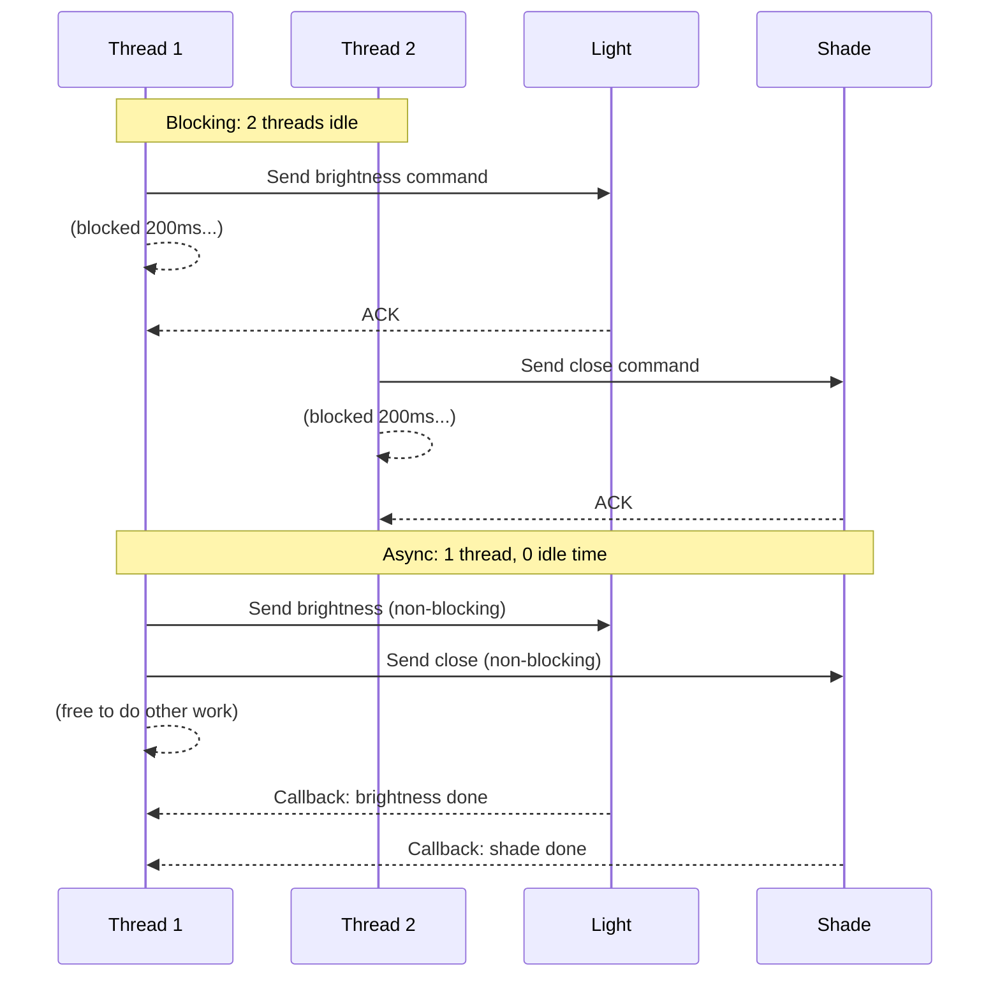
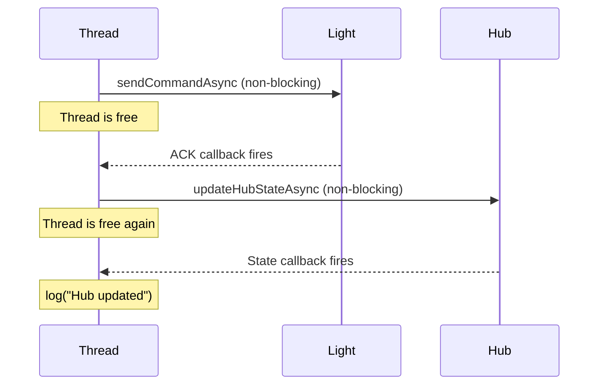
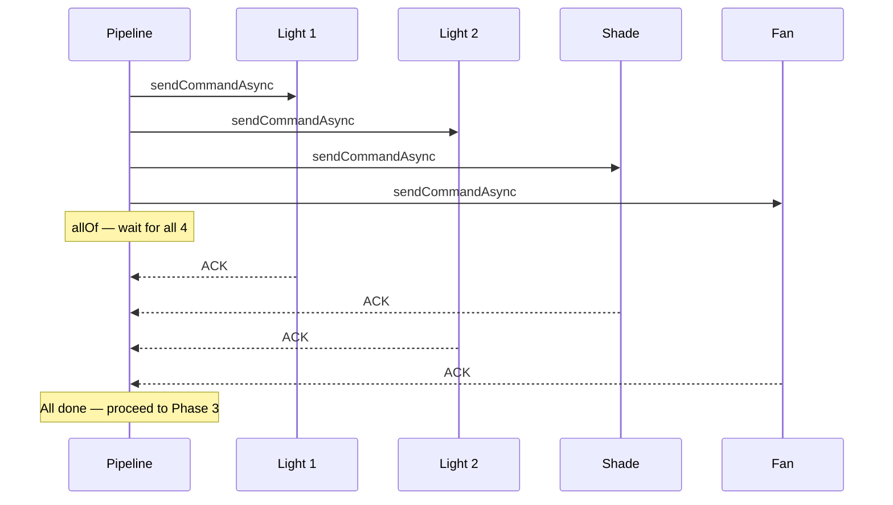
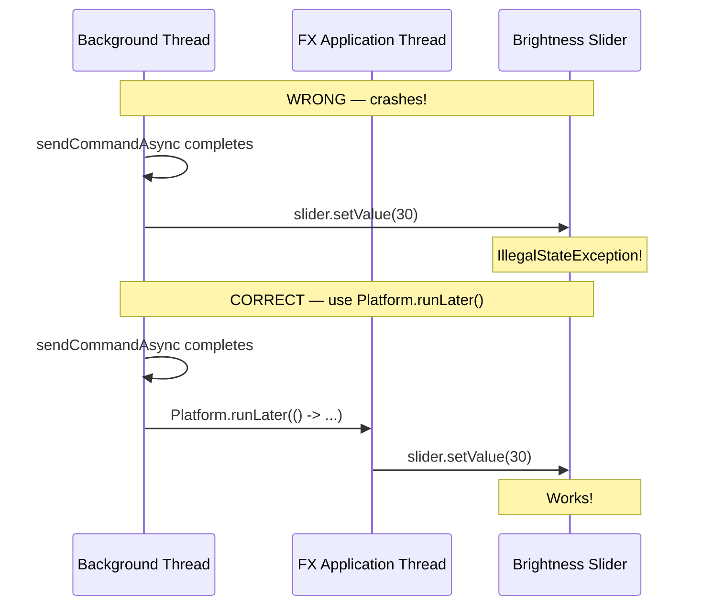

import RevealJS, { Slide } from '@site/src/components/RevealJS';
import Img from '@site/src/components/Img';

<RevealJS transition="slide">

{/* ============================================ */}
{/* COVER IMAGE */}
{/* ============================================ */}

<Slide>
  

<aside className="notes">
**Lecture overview:**
- **Total time:** ~55 minutes
- **Prerequisites:** L31 (Threads, Synchronization, Deadlock), L29/L30 (JavaFX, MVVM, event loop)
- **Connects to:** L33 (Event-Driven Architecture), GA1 (BackgroundTaskRunner, Platform.runLater)

**Structure (~27 slides):**
- Arc 0: L31 Bridge (~3 min)
- Arc 1: The Problem with Threads for I/O (~8 min)
- Arc 2: The Async Model + Restaurant Analogy (~10 min)
- Arc 3: Futures and CompletableFuture (~18 min) — progressive reveal pipeline
- Arc 4: Async Safety (~12 min) — ordering bugs, thread confinement, Platform.runLater
- Arc 5: Wrap-up (~5 min)

**Running example:** SceneItAll — activating "Evening" scene sends commands to 15 devices.

> **Transition:** Let's start with the learning objectives...
</aside>

</Slide>

{/* ============================================ */}
{/* TITLE + LOs */}
{/* ============================================ */}

<Slide>

# CS 3100: Program Design and Implementation II

## Lecture 32: Concurrency II — Asynchronous Programming

<p style={{marginTop: '2em', fontSize: '0.8em', color: '#666'}}>
  &copy;2026 Jonathan Bell, CC-BY-SA
</p>

<aside className="notes">
**Context from L31:** Students learned threads, shared mutable state, race conditions, synchronized, concurrent collections, and deadlock. Bell ended L31 with: "Wednesday we'll look at a different programming model — how we minimize mutable state and minimize having to worry about locks."

Today picks up that promise directly.
</aside>

</Slide>

<Slide>

## Learning Objectives

<p style={{fontSize: '0.85em', textAlign: 'left'}}>
After this lecture, you will be able to:
</p>

<ol style={{fontSize: '0.75em', textAlign: 'left'}}>
  <li>Compare threads and asynchronous programming for I/O-bound work</li>
  <li>Understand blocking vs non-blocking operations</li>
  <li>Use CompletableFuture to compose asynchronous workflows</li>
  <li>Evaluate the safety of asynchronous code (ordering, errors, shared state)</li>
  <li>Use <code>Platform.runLater()</code> to safely update GUIs from async callbacks</li>
</ol>

<aside className="notes">
**LO5 is new** — elevated from a sub-topic to a first-class objective because every GA1 feature needs it. Students will use `BackgroundTaskRunner` (which wraps `Platform.runLater()`) and TAs will ask them to explain what it does internally.

**Time allocation:**
- LO1-2: Arcs 0-2 (~18 min)
- LO3: Arc 3 (~18 min)
- LO4-5: Arc 4 (~12 min)
- Wrap-up: ~5 min

> **Transition:** Let's start by remembering what *hurt* about threads on Monday...
</aside>

</Slide>

{/* ============================================ */}
{/* ARC 0: L31 BRIDGE (~3 min) */}
{/* ============================================ */}

<Slide>

## Threads Gave Us Concurrency — at a Price

<div style={{fontSize: '0.8em'}}>

On Monday we learned to orchestrate threads. It was painful:

- **Shared state** → race conditions (two scenes interleave, room ends up in a mix of both)
- **Locks** → deadlocks (two threads each hold what the other needs — frozen forever)
- **Every thread** → costs memory, OS resources, and context-switch overhead
- **Testing** → timing-dependent bugs that pass 99 times, fail once, can't reproduce

</div>

<p style={{fontSize: '0.85em', marginTop: '0.5em'}}>
But here's the thing: <strong>most of what our software needs concurrency for isn't computing — it's waiting.</strong> Waiting for a device to respond. Waiting for a file to load. Waiting for a network call to return. We're paying the full cost of threads just to sit idle.
</p>

<p style={{fontSize: '0.85em', color: '#9370DB'}}>
What if we could have concurrency <strong>without</strong> threads fighting over shared state? What if one thread could manage many concurrent operations by dispatching work and getting notified when results arrive?
</p>

<aside className="notes">
**This slide does two things:** (1) reminds students of the pain from L31, and (2) reframes the problem. The pain wasn't that threads *exist* — it's that we used threads for the wrong kind of work. Computing needs threads. Waiting doesn't.

**The key reframe:** "Most concurrency needs are about I/O, not CPU. For I/O, there's a simpler model that avoids shared state entirely."

**Bell's closing from L31:** "Wednesday we'll look at a different programming model — how we minimize mutable state and minimize having to worry about locks." This slide delivers on that promise.

> **Transition:** Let's see a concrete example of what "mostly waiting" looks like...
</aside>

</Slide>

{/* ============================================ */}
{/* ARC 1: THE PROBLEM WITH THREADS FOR I/O (~8 min) */}
{/* ============================================ */}

<Slide>

## Activating "Evening" Means Talking to 15 Devices — and Waiting 14 Times

<div style={{fontSize: '0.8em'}}>

"Evening" scene: dim 5 lights, close 4 shades, turn off 3 fans, set 3 color temperatures. Each command is a network call to a device over Zigbee — **~200ms round trip**.

| Approach | Threads | Time | Problem |
|----------|---------|------|---------|
| **Sequential** | 1 | 15 × 200ms = **3 seconds** | UI frozen the entire time |
| **Thread per device** | 15 | ~200ms | 14 threads doing nothing but waiting |

</div>

<p style={{fontSize: '0.8em', marginTop: '0.5em', color: '#9370DB'}}>
Sequential is too slow. Thread-per-device works, but 14 of those threads are just... sitting there. Doing nothing. Waiting for a response.
</p>

<aside className="notes">
**Connect to L29:** "Remember the event loop from L29? If your button handler takes 3 seconds, the entire UI freezes. Same problem here — 15 sequential Zigbee commands = 3 seconds of frozen UI."

**The key insight:** The threads aren't computing. They're *waiting*. That's an expensive way to wait.

> **Transition:** How expensive? Let's put it in perspective...
</aside>

</Slide>

<Slide>

## I/O Takes an Eternity (from the CPU's Perspective)


<aside className="notes">
**This should be a visceral "wow" moment.** Let students absorb the scale. A blocking thread sending a brightness command sits idle for *months* in CPU time. And we're dedicating an entire thread — with its stack memory, OS resources, context-switch overhead — to do nothing.

**The employee analogy:** "Imagine hiring an employee, giving them a desk and a computer, and their entire job is to sit there and wait for a phone call. When the call comes, they write down one number and go back to waiting. Would you hire 15 of those employees?"

> **Transition:** There must be a better way to wait. And you already understand the mental model...
</aside>

</Slide>

{/* ============================================ */}
{/* ARC 2: THE ASYNC MODEL (~10 min) */}
{/* ============================================ */}

<Slide>

## Blocking Wastes Threads; Non-Blocking Frees Them

<p style={{fontSize: '0.85em'}}>
A <strong>blocking</strong> operation halts the thread until it completes. A <strong>non-blocking</strong> operation returns immediately.
</p>



<aside className="notes">
**Walk through both halves.** Top: two threads, each blocking for 200ms. Bottom: one thread dispatches both commands immediately, handles callbacks when they arrive.

**The key visual:** In the top half, Thread 1 and Thread 2 are both doing nothing — just waiting. In the bottom half, one thread dispatches both and is free immediately. The savings multiply as you add more devices.

> **Transition:** Here's an analogy that makes this concrete...
</aside>

</Slide>

<Slide>

## The Restaurant Analogy: Don't Wait at the Kitchen Door


<aside className="notes">
**This analogy maps precisely to the API:**

| Restaurant | Java |
|-----------|------|
| Place an order | `executor.submit(() -> sendCommand(...))` |
| Get a receipt with a number | `Future<DeviceAck>` |
| Stand at the kitchen door | `future.get()` — blocks! |
| Sit down and read your book | Do other work while waiting |
| Kitchen calls your number | **Callback** — `thenAccept()` |

The insight of CompletableFuture: what if the kitchen *texts you* when the food is ready, instead of making you check?

> **Transition:** Let's see this in code...
</aside>

</Slide>

<Slide>

## One Line of Code, Two Completely Different Behaviors

<div style={{display: 'grid', gridTemplateColumns: '1fr 1fr', gap: '1em', fontSize: '0.68em'}}>

<div style={{backgroundColor: 'rgba(200,74,74,0.15)', padding: '0.8em', borderRadius: '8px'}}>

**Blocking**

```java
// Thread blocks here for ~200ms
DeviceAck ack = zigbee.sendCommand(
    light, new BrightnessCommand(30)
);
// Can't do anything else until ACK
updateStatus(light, ack);
```

Standing at the kitchen door.

</div>

<div style={{backgroundColor: 'rgba(74,153,74,0.15)', padding: '0.8em', borderRadius: '8px'}}>

**Non-blocking (async)**

```java
// Returns immediately — thread is free
zigbee.sendCommandAsync(
    light, new BrightnessCommand(30)
).thenAccept(ack -> {
    // Runs later, when ACK arrives
    updateStatus(light, ack);
});
// Thread continues immediately
```

Sitting down with your receipt.

</div>

</div>

<aside className="notes">
**Walk through the LEFT side first.** The thread calls `sendCommand`, blocks for 200ms, can't do anything. Then show the RIGHT side: `sendCommandAsync` returns immediately. The `thenAccept` callback runs later when the ACK arrives. The thread is free to dispatch more commands.

**Key question:** "What does `sendCommandAsync` return?" It returns a `Future` — a receipt. Let's look at what that means...

> **Transition:** One command was easy. But "Evening" has 15 devices...
</aside>

</Slide>

<Slide>

## Async Scales: Dispatch Many, Wait for All

<p style={{fontSize: '0.85em'}}>
With blocking, 15 devices = 15 idle threads. With async, one thread dispatches all 15:
</p>

```java
// Dispatch 15 commands — thread never blocks
List<Future<DeviceAck>> receipts = new ArrayList<>();
for (DeviceCommand cmd : scene.getCommands()) {
    receipts.add(zigbee.sendCommandAsync(cmd));  // returns immediately
}
// All 15 are in flight simultaneously
// Thread is free to update the UI, process other events, etc.
```

<p style={{fontSize: '0.8em', marginTop: '0.5em', color: '#9370DB'}}>
15 commands dispatched in microseconds. All 15 devices processing in parallel. One thread. Zero idle waiting. We'll see how to collect all the results with <code>CompletableFuture.allOf()</code> later.
</p>

<aside className="notes">
**This is the "multiply by 15" moment.** The code slide showed one async call. This slide shows the pattern at scale — loop through all commands, dispatch each one async, and the thread is free immediately.

**Preview:** "We dispatched them all. But how do we know when they're all done? How do we collect the results? That's where CompletableFuture comes in — later this lecture."

> **Transition:** So when should you reach for each model?
</aside>

</Slide>

<Slide>

## Use Threads When the CPU Is Busy; Async When It's Idle

<div style={{fontSize: '0.8em'}}>

| | **Threads** | **Async** |
|---|---|---|
| **Best for** | CPU-bound work (computing) | I/O-bound work (waiting) |
| **Resource usage** | Higher (thread per task) | Lower (callbacks) |
| **Programming model** | Familiar (sequential code) | Less familiar (callbacks/futures) |
| **SceneItAll** | Computing optimal scene settings | Sending Zigbee device commands |
| **In GA1** | Running business logic | Loading data, `BackgroundTaskRunner` |

</div>

<p style={{fontSize: '0.8em', marginTop: '0.5em', color: '#9370DB'}}>
Use threads when the CPU is busy. Use async when the CPU is idle and waiting. And the async model isn't even new to you...
</p>

<aside className="notes">
**The GA1 row is important.** Students' CookYourBooks features need async for loading recipes, running OCR imports, searching. `BackgroundTaskRunner` wraps this — we'll see it at the end of the lecture.

> **Transition:** You've actually seen this model before — since L29...
</aside>

</Slide>

<Slide>

## You Already Know This Model — From L29's Event Loop

<p style={{fontSize: '0.85em'}}>
Remember the event loop from <a href="/lecture-notes/l29-gui1">L29</a>?
</p>

```java
// The GUI event loop (from L29)
while (applicationIsRunning) {
    Event event = waitForNextEvent();     // button click, key press...
    EventHandler handler = findHandler(event);
    handler.handle(event);
}
```

<p style={{fontSize: '0.85em', marginTop: '0.5em'}}>
Async I/O uses the <strong>same model</strong> — but the events are I/O completions instead of button clicks:
</p>

```java
// An I/O event loop (conceptually)
while (running) {
    IOEvent event = waitForIOCompletion(); // device ACK, network response...
    Callback callback = findCallback(event);
    callback.run();
}
```

<p style={{fontSize: '0.8em', color: '#9370DB'}}>
You already understand this model. Now we're applying it to I/O instead of UI.
</p>

<aside className="notes">
**This connection is powerful.** Students have been using the event loop since L29. Button clicks and device ACKs are structurally identical — both are "something happened, call the registered handler."

**Java's approach:** Java's `CompletableFuture` uses thread pools internally rather than a pure single-threaded event loop. But the programming model is the same: don't block, register a callback, get notified.

> **Transition:** Now let's look at the Java API for this...
</aside>

</Slide>

{/* ============================================ */}
{/* ARC 3: FUTURES AND COMPLETABLEFUTURE (~18 min) */}
{/* ============================================ */}

<Slide>

## Future: The Basic Receipt

<p style={{fontSize: '0.85em'}}>
A <code>Future&lt;T&gt;</code> is a placeholder for a result that will be available later — the receipt from our restaurant:
</p>

<div style={{fontSize: '0.72em'}}>

```java
ExecutorService executor = Executors.newFixedThreadPool(10);

// Place the order — returns a receipt immediately
Future<SceneSettings> receipt = executor.submit(
    () -> settingsEngine.computeOptimal(scene, sensors)
);

// Do other work while the kitchen cooks...

// Go to the counter and wait for your number
SceneSettings settings = receipt.get();  // BLOCKS until done
```

</div>

<p style={{fontSize: '0.8em', marginTop: '0.3em', color: '#e06c75'}}>
But <code>get()</code> blocks. You're back to standing at the kitchen door. What if the kitchen could <strong>call your number</strong> instead?
</p>

<aside className="notes">
**The analogy annotations are the key teaching tool:**
- `executor.submit(...)` = place the order
- `Future<SceneSettings>` = your receipt
- `receipt.get()` = go to the counter and wait

**The problem:** `get()` blocks the calling thread. If you call `get()` on the JavaFX Application Thread, you freeze the UI — exactly the L29 problem.

**Bridge to CompletableFuture:** "What if the kitchen could text you when the food is ready?"

> **Transition:** That's exactly what CompletableFuture does...
</aside>

</Slide>

<Slide>

## Future Blocks; CompletableFuture Calls You Back

<div style={{fontSize: '0.8em'}}>

<div style={{display: 'grid', gridTemplateColumns: '1fr 1fr', gap: '1em'}}>

<div style={{backgroundColor: 'rgba(200,74,74,0.15)', padding: '0.8em', borderRadius: '8px'}}>

**Future&lt;T&gt;** (2004, Java 5)

The basic receipt.

- `T get()` — wait for result (blocks!)
- `boolean isDone()` — is it ready yet?
- `boolean cancel(boolean)` — cancel the order

*You have to check or wait.*

</div>

<div style={{backgroundColor: 'rgba(74,153,74,0.15)', padding: '0.8em', borderRadius: '8px'}}>

**CompletableFuture&lt;T&gt;** (2014, Java 8)

The receipt that calls your number.

- `CF<U> thenApply(fn)` — transform result
- `CF<Void> thenAccept(fn)` — use result, return nothing
- `CF<U> thenCompose(fn)` — chain another async op
- `CF<V> thenCombine(other, fn)` — join two results
- `CF<Void> allOf(...)` — wait for all
- `CF<T> exceptionally(fn)` — handle errors

*The kitchen calls you.*

</div>

</div>

</div>

<p style={{fontSize: '0.8em', marginTop: '0.5em', color: '#9370DB'}}>
Future is the receipt. CompletableFuture is the receipt <strong>plus</strong> a way to say "when it's ready, do this next thing automatically."
</p>

<aside className="notes">
**Don't make students memorize this table.** It's a reference. The important distinction is conceptual: Future makes you poll or block. CompletableFuture lets you register what should happen next.

**Note:** Students won't write `CompletableFuture` chains directly in GA1 — they use `BackgroundTaskRunner` which wraps `javafx.concurrent.Task` and `Platform.runLater()`. But they need to understand the *concepts* (async dispatch, callbacks, thread confinement) because TAs will ask them to explain what `BackgroundTaskRunner` does under the hood. The CompletableFuture API is the industry-standard version they'll encounter after this course.

**If students ask about other languages — the same idea exists everywhere:**

| Year | Language | Concept |
|------|----------|---------|
| 2004 | **Java 5** | `Future<T>` — blocking `get()` only |
| 2011 | **C# 5.0** | `Task<T>` + `async`/`await` keywords — compiler rewrites sequential-looking code into callbacks. First mainstream language with async/await. |
| 2012 | **JavaScript** | Promises (via libraries like Q, Bluebird) — `.then()` chains, same idea as `thenApply` |
| 2014 | **Java 8** | `CompletableFuture<T>` — Java catches up to C# and JS with composable futures |
| 2015 | **ECMAScript 2015 (ES6)** | `Promise` standardized in the language — `.then()`, `.catch()`, `Promise.all()` |
| 2017 | **ECMAScript 2017 (ES8)** | `async`/`await` — syntactic sugar over Promises, inspired by C# |
| 2021 | **Java 19 (preview)** | Virtual threads (Project Loom) — lightweight threads that make blocking cheap again, potentially reducing the need for CompletableFuture |

**The arc:** Blocking futures (2004) → composable futures/promises (2011-2015) → async/await syntactic sugar (2011-2017) → virtual threads trying to make blocking OK again (2021+). Java arrived late to composable futures (2014, a decade after C#) and still doesn't have async/await syntax. If students have used JavaScript or Python, Promises and `async`/`await` will feel familiar — `CompletableFuture` is Java's version, just more verbose.

> **Transition:** Let's see the simplest possible example...
</aside>

</Slide>

<Slide>

## CompletableFuture: The Kitchen Calls Your Number

<p style={{fontSize: '0.85em'}}>
The simplest CompletableFuture chain — one async operation, one callback:
</p>

```java
CompletableFuture
    .supplyAsync(() -> settingsEngine.computeOptimal(scene, sensors))
    .thenAccept(settings -> applyToDevices(settings));

// Thread continues immediately — no blocking
// applyToDevices runs later, when computation finishes
```

<div style={{fontSize: '0.8em', marginTop: '1em'}}>

| Restaurant | Java |
|-----------|------|
| Place the order | `supplyAsync(() -> ...)` |
| Kitchen calls your number | `thenAccept(result -> ...)` |
| You never stand at the door | Thread is free immediately |

</div>

<aside className="notes">
**This is the minimal mental model.** One async operation, one callback. Students need to absorb this before seeing pipelines.

**Key point:** `supplyAsync` returns a `CompletableFuture` immediately. The lambda inside runs on a background thread. When it finishes, `thenAccept` runs with the result. The calling thread never blocks.

**If students ask "which thread does thenAccept run on?"** — by default, whichever thread completes the async operation. We'll see how to control this with `Platform.runLater()` later.

> **Transition:** What if you need to do two async things in sequence?
</aside>

</Slide>

<Slide>

## thenCompose: Sequential Dependencies Without Blocking

<p style={{fontSize: '0.85em'}}>
<code>thenCompose</code> chains async operations that depend on each other:
</p>

```java
sendCommandAsync(light, new BrightnessCommand(30))
    .thenCompose(ack -> updateHubStateAsync(light, ack))
    .thenAccept(state -> log("Hub updated: " + state));
```



<p style={{fontSize: '0.8em', color: '#9370DB'}}>
Each step depends on the previous result, but no thread ever blocks. <code>thenCompose</code> = "when the first thing finishes, start the second thing."
</p>

<aside className="notes">
**Walk through the mermaid step by step.** The thread dispatches the command, becomes free immediately. When the ACK arrives, it dispatches the hub update, becomes free again. When the hub confirms, it logs. Three async operations, zero blocking.

**Compare to blocking:** Without async, this would be three sequential blocking calls — 600ms of idle thread time. With async, the thread does useful work between callbacks.

**`thenCompose` vs `thenApply`:** `thenCompose` is for when the callback itself returns a `CompletableFuture` (another async op). `thenApply` is for synchronous transformations. If students ask, point them to the API reference slide.

> **Transition:** Before we build the full pipeline, let's see what the old way looked like...
</aside>

</Slide>

<Slide>

## CompletableFuture Flattens the Pyramid of Doom

<p style={{fontSize: '0.8em', fontStyle: 'italic', color: '#888'}}>
Before CompletableFuture existed, async code looked like this:
</p>

<div style={{display: 'grid', gridTemplateColumns: '1fr 1fr', gap: '1em', fontSize: '0.62em'}}>

<div style={{backgroundColor: 'rgba(200,74,74,0.15)', padding: '0.8em', borderRadius: '8px'}}>

**Nested callbacks (the old way)**

```java
sendCommand(light, brightness, lightAck -> {
  if (lightAck.isError()) {
    handleError(lightAck);
  } else {
    sendCommand(shade, close, shadeAck -> {
      if (shadeAck.isError()) {
        handleError(shadeAck);
      } else {
        updateHub(state, hubResult -> {
          if (hubResult.isError()) {
            handleError(hubResult);
          } else {
            log("All done");
          }
        });
      }
    });
  }
});
```

</div>

<div style={{backgroundColor: 'rgba(74,153,74,0.15)', padding: '0.8em', borderRadius: '8px'}}>

**CompletableFuture (flat chain)**

```java
sendCommandAsync(light, brightness)
  .thenCompose(ack ->
    sendCommandAsync(shade, close))
  .thenCompose(ack ->
    updateHubAsync(state))
  .thenAccept(result ->
    log("All done"))
  .exceptionally(error -> {
    handleError(error);
    return null;
  });
```

Same logic. Flat. Readable. One error handler for the whole chain.

</div>

</div>

<aside className="notes">
**Walk through the LEFT side first.** Let students feel the pyramid of doom. Three levels of nesting, error handling at each level, deeply indented. "This is what async code looked like before CompletableFuture."

**Then reveal the RIGHT side.** Same logic, flat chain, one error handler at the end. This is why CompletableFuture was added in Java 8.

> **Transition:** Now let's build a real pipeline...
</aside>

</Slide>

<Slide>

## Three Ways to Activate a Scene

<div style={{display: 'grid', gridTemplateColumns: '1fr 1fr 1fr', gap: '0.5em', fontSize: '0.6em'}}>

<div style={{backgroundColor: 'rgba(200,74,74,0.15)', padding: '0.6em', borderRadius: '8px'}}>

**Raw Threads (L31)**

```java
for (DeviceCommand cmd : commands) {
    new Thread(() ->
        sendCommand(cmd)  // blocks
    ).start();
}
// How do we know when
// they're all done? join()
// each one — blocks again.
```

15 threads. 14 idle. 15MB stacks.

</div>

<div style={{backgroundColor: 'rgba(169,148,74,0.15)', padding: '0.6em', borderRadius: '8px'}}>

**Thread Pool (L31)**

```java
for (DeviceCommand cmd : commands) {
    Future<Ack> f = executor
        .submit(() ->
            sendCommand(cmd));
    futures.add(f);
}
// f.get() to collect — but
// get() blocks the caller!
```

10 threads (reused). Still blocks to collect.

</div>

<div style={{backgroundColor: 'rgba(74,153,74,0.15)', padding: '0.6em', borderRadius: '8px'}}>

**Async (today)**

```java
List<CF<Ack>> futures = commands
    .stream()
    .map(cmd ->
        sendCommandAsync(cmd))
    .toList();
CompletableFuture.allOf(
    futures.toArray(new CF[0]));
// No blocking. No idle threads.
```

1 thread. 0 idle. Scales to 1000.

</div>

</div>

<p style={{fontSize: '0.8em', marginTop: '0.3em', color: '#9370DB'}}>
The punchline: async lets you fire all 15 requests <strong>without paying for a thread to sit and wait for each response.</strong> This is also a <strong>coupling reduction</strong> (L7): your code no longer depends on thread lifecycles, shared locks, or execution timing — it just dispatches work and reacts to results.
</p>

<aside className="notes">
**Walk left to right:** "Monday's raw threads: one thread per device, all sitting idle waiting for I/O. Thread pool: better (reuses threads), but `Future.get()` still blocks the caller. Today's async: one thread dispatches everything, `allOf` collects results without blocking anyone."

**The L7 coupling connection:** With raw threads, your `activateScene` code is coupled to thread creation, starting, joining, exception handling — it manages the *mechanism* of concurrency, not just the *intent*. With thread pools, you're still coupled to `Future.get()` — you have to know when and where to block. With async CompletableFuture, your code says *what* should happen (send command, then update hub, then push to apps) and is completely decoupled from *how* and *when* it executes. The calling code doesn't create threads, doesn't manage lifecycles, doesn't block. That's information hiding applied to execution — same principle as L7.

**Scaling comparison:**
- Raw threads: 1000 devices = 1000 threads = 1GB of stacks. Not viable.
- Thread pool: 1000 devices, 10 threads — the pool queue grows enormous, `get()` calls pile up.
- Async: 1000 devices, 1 thread, 1000 lightweight callbacks. Fine.

**Error handling comparison:**
- Raw threads: try/catch inside each thread, easy to miss, errors silently swallowed
- Thread pool: `Future.get()` throws, but only when you call it — delayed discovery
- Async: `.exceptionally()` at the end of the chain — explicit and composable

> **Transition:** Now let's build the full async pipeline...
</aside>

</Slide>

<Slide>

## The Full Pipeline: Four Phases, Zero Blocking


<p style={{fontSize: '0.8em', color: '#9370DB'}}>
Four phases. Phases run sequentially (each depends on the previous). Within Phase 2, device commands run in <strong>parallel</strong>.
</p>

<aside className="notes">
**This diagram is the reference for the next three slides.** Each slide implements one phase. Point at the diagram as you walk through the code.

> **Transition:** Let's implement this phase by phase...
</aside>

</Slide>

<Slide>

## Phase 1: supplyAsync Starts the Computation


```java
// Phase 1: CPU-bound — compute optimal settings from sensors
CompletableFuture<SceneSettings> settingsFuture =
    CompletableFuture.supplyAsync(
        () -> settingsEngine.computeOptimal(scene, sensors)
    );
```

<p style={{fontSize: '0.8em'}}>
<code>supplyAsync</code> runs the computation on a background thread from the common pool. Returns a <code>CompletableFuture</code> immediately. The calling thread is free.
</p>


<aside className="notes">
**This is the simplest phase.** One async operation, one result. `supplyAsync` is the "place the order" step.

**Highlight each phase while pointing at the pipeline diagram.**

> **Transition:** Phase 2 is where it gets interesting — fan-out to 15 devices...
</aside>

</Slide>

<Slide>

## Phase 2: allOf Dispatches 15 Commands in Parallel

<p style={{fontSize: '0.8em', fontStyle: 'italic'}}>
Phase 2: fan out to all devices, wait for all to complete.
</p>

```java
// Phase 2: Fan out — send commands to all devices in parallel
CompletableFuture<List<DeviceAck>> devicesFuture = settingsFuture
    .thenCompose(settings -> {
        List<CompletableFuture<DeviceAck>> commands = settings.getCommands()
            .stream()
            .map(cmd -> sendCommandAsync(cmd))  // each returns a Future
            .toList();

        return CompletableFuture.allOf(commands.toArray(new CompletableFuture[0]))
            .thenApply(v -> commands.stream()
                .map(CompletableFuture::join).toList());
    });
```



<aside className="notes">
**This is the key pattern.** Fan-out: dispatch N async operations in parallel. Fan-in: `allOf` waits for all N to complete. One thread dispatches all commands, no thread blocks.

**The mermaid shows 4 devices for readability** (not all 15). The ACKs arrive in arbitrary order — `allOf` handles waiting for all of them.

**Highlight each phase while pointing at the pipeline diagram.**

> **Transition:** Phases 3-4 are simpler...
</aside>

</Slide>

<Slide>

## Phases 3-4: Fan In, Then Push to All Apps


```java
// Phase 3: Update hub state with all device results
CompletableFuture<HubState> hubFuture = devicesFuture
    .thenCompose(acks -> hub.updateStateAsync(scene, acks));

// Phase 4: Push updated state to all connected mobile apps
CompletableFuture<Void> pushFuture = hubFuture
    .thenCompose(state -> {
        CompletableFuture<Void> pushToApps = pushService.notifyAllAsync(state);
        CompletableFuture<Void> logActivation = logger.logAsync(scene, state);
        return CompletableFuture.allOf(pushToApps, logActivation);
    });
```


<p style={{fontSize: '0.8em', marginTop: '0.3em', color: '#9370DB'}}>
The entire pipeline — compute, fan-out to 15 devices, update hub, push to apps — runs without a single blocking call. One thread dispatches everything.
</p>

<aside className="notes">
**Phase 3 is a single thenCompose** — sequential dependency (need all ACKs before updating hub).

**Phase 4 fans out again** — push to apps and log activation can happen in parallel, so we use `allOf` again.

**Recap the pipeline:** "We dispatched 15+ async operations, composed them into a pipeline with sequential and parallel phases, and never blocked a single thread."

> **Transition:** But what if the kitchen never calls your number? What if a device doesn't respond?
</aside>

</Slide>

<Slide>

## Async Errors Are Silent by Default

<div style={{display: 'grid', gridTemplateColumns: '1fr 1fr', gap: '1em', fontSize: '0.7em'}}>

<div style={{backgroundColor: 'rgba(200,74,74,0.15)', padding: '0.8em', borderRadius: '8px'}}>

**Bad: silent failure**

```java
sendCommandAsync(light, brightness)
    .thenAccept(ack -> updateUI(ack));
// If sendCommand fails...
// nothing happens. No error. Silence.
// Light stays at old brightness.
// User has no idea.
```

</div>

<div style={{backgroundColor: 'rgba(74,153,74,0.15)', padding: '0.8em', borderRadius: '8px'}}>

**Good: explicit error handling**

```java
sendCommandAsync(light, brightness)
    .thenAccept(ack -> updateUI(ack))
    .exceptionally(error -> {
        showError("Light unreachable");
        return null;
    })
    .orTimeout(5, TimeUnit.SECONDS);
```

</div>

</div>

<p style={{fontSize: '0.85em', marginTop: '0.5em', color: '#e06c75'}}>
Async errors are <strong>silent by default</strong>. If you don't add <code>.exceptionally()</code>, errors vanish. The user sees nothing — the device just doesn't change.
</p>

<aside className="notes">
**Restaurant analogy:** "You placed an order and the kitchen never calls your number. You wait forever. That's what happens without `.exceptionally()` — no error, no callback, just silence."

**`orTimeout`** adds a deadline — "if my food isn't ready in 5 minutes, come tell me it failed." If the device doesn't respond in 5 seconds, the Future completes with a `TimeoutException`, which `.exceptionally()` catches.

> **Transition:** Let's bookmark all the methods we've learned...
</aside>

</Slide>

<Slide>

## Your CompletableFuture Reference Card

<div style={{fontSize: '0.75em'}}>

| Method | What it does | When to use |
|--------|-------------|-------------|
| `allOf(f1, f2, f3...)` | Wait for all to complete | Fan-out / fan-in |
| `supplyAsync(() -> ...)` | Start async work, return Future | "Place the order" |
| `thenApply(result -> ...)` | Transform result (sync) | Change the type: `String` → `int` |
| `orTimeout(n, SECONDS)` | Fail if not done in time | Device not responding |
| `thenAccept(result -> ...)` | Use result, return nothing | Final step: log, update UI |
| `thenCompose(result -> ...)` | Chain another async op | Sequential dependency |
| `thenCombine(other, (a,b) -> ...)` | Join two Futures | Combine independent results |
| `thenAcceptAsync(fn, executor)` | Run callback on specific thread | **Platform.runLater()** for GUI |
| `exceptionally(error -> ...)` | Handle errors in the chain | Error recovery / fallback |

</div>

<aside className="notes">
**Now that students have seen all these methods in context** (pipeline + error handling), this table serves as a summary/reference rather than an introduction. Don't read through it — tell students to bookmark it.

The `thenCombine` example: combining a sensor reading with a time-of-day calculation:
```java
CompletableFuture<Integer> sensorBrightness = readSensorAsync();
CompletableFuture<Integer> timeBrightness = computeTimeBasedAsync();
sensorBrightness.thenCombine(timeBrightness, Math::min);
```

> **Transition:** Error handling catches failures. But even when every operation *succeeds*, async can produce wrong results in more subtle ways...
</aside>

</Slide>

{/* ============================================ */}
{/* ARC 4: ASYNC SAFETY (~12 min) */}
{/* ============================================ */}

<Slide>

## Async Doesn't Eliminate Concurrency Bugs — It Changes Their Shape

<p style={{fontSize: '0.85em'}}>
Even when every operation succeeds, async can produce wrong results:
</p>

<div style={{display: 'grid', gridTemplateColumns: '1fr 1fr', gap: '1em', fontSize: '0.7em'}}>

<div style={{backgroundColor: 'rgba(200,100,74,0.15)', padding: '0.8em', borderRadius: '8px'}}>

**Ordering bug**

You ordered steak first, then salad. Salad arrives first — because it's simpler.

```java
setBrightnessAsync(light, 30); // sent first
setBrightnessAsync(light, 10); // sent second
// 10 might arrive before 30!
// Light ends up at 30% — wrong
```

**Fix:** `thenCompose` for sequential dependency

</div>

<div style={{backgroundColor: 'rgba(200,100,74,0.15)', padding: '0.8em', borderRadius: '8px'}}>

**Shared state race**

Same `deviceCount++` bug from L31 — now in callbacks:

```java
sendCommandAsync(light, brightness)
    .thenAccept(ack -> {
        totalCommands++;  // RACE!
    });
sendCommandAsync(shade, close)
    .thenAccept(ack -> {
        totalCommands++;  // RACE!
    });
```

**Fix:** `AtomicInteger.incrementAndGet()`

</div>

</div>

<p style={{fontSize: '0.8em', color: '#9370DB', marginTop: '0.3em'}}>
Async doesn't eliminate concurrency bugs — it changes their shape. Instead of threads interleaving, callbacks execute in unpredictable order.
</p>

<aside className="notes">
**Two bugs, one slide.** The ordering bug is the async version of L31's race condition — operations arrive in the wrong order. The shared state bug is literally `deviceCount++` from L31 happening inside callbacks.

**Restaurant analogy for ordering:** "You ordered steak first, then salad. But the kitchen delivers the salad first because it's simpler. If order matters, you have to say so — that's `thenCompose`."

**Keep this slide moving** — these are setup for the main event (thread confinement). Spend ~2 min total, not 4.

> **Transition:** There's one more critical async safety issue — and it's the one you'll hit in GA1...
</aside>

</Slide>

<Slide>

## Callbacks Run on the Wrong Thread — And Your GUI Crashes

<p style={{fontSize: '0.85em'}}>
Async callbacks run on background threads. But GUI updates must happen on the <strong>JavaFX Application Thread</strong>.
</p>



<aside className="notes">
**This is the single most GA1-relevant slide.** Every student will hit this bug — an async operation completes on a background thread and tries to update a JavaFX widget. It either crashes with `IllegalStateException` or corrupts the UI silently.

**Walk through both paths in the mermaid.**
- WRONG: Background thread directly touches the slider → crash
- CORRECT: Background thread hands the update to the FX thread via `Platform.runLater()` → works

**Connection to L29:** "Remember from L29: all UI updates must happen on the JavaFX Application Thread. Async callbacks don't run on that thread."

> **Transition:** Here's the fix in code...
</aside>

</Slide>

<Slide>

## Platform.runLater() Bridges Background Threads to the GUI

<div style={{fontSize: '0.72em'}}>

```java
// WRONG: callback runs on background thread
sendCommandAsync(light, brightness)
    .thenAccept(ack -> slider.setValue(ack.getBrightness()));  // CRASH!

// CORRECT: push the UI update to the FX thread
sendCommandAsync(light, brightness)
    .thenAcceptAsync(
        ack -> slider.setValue(ack.getBrightness()),
        Platform::runLater  // runs callback on FX thread
    );
```

</div>

<div style={{backgroundColor: 'rgba(147,112,219,0.15)', padding: '0.8em', borderRadius: '8px', fontSize: '0.72em', marginTop: '0.5em'}}>

**In GA1, use `BackgroundTaskRunner`** — it wraps this pattern:

```java
BackgroundTaskRunner.run(
    () -> librarianService.listCollections(),   // runs on background thread
    collections -> {                             // runs on FX thread (success)
        this.collections.setAll(/* ... */);
    },
    error -> showError(error.getMessage())       // runs on FX thread (failure)
);
```

</div>

<p style={{fontSize: '0.8em', color: '#9370DB', marginTop: '0.3em'}}>
Every GA1 feature needs this. Your TAs will ask you to explain what <code>BackgroundTaskRunner</code> does internally.
</p>

<aside className="notes">
**This is the slide students will come back to most.** The `BackgroundTaskRunner.run()` pattern is what they'll actually write in GA1.

**Under the hood:** `BackgroundTaskRunner` creates a `javafx.concurrent.Task`, runs it on a daemon thread, and uses `Platform.runLater()` to call `onSuccess`/`onFailure` on the FX thread. During code walks, TAs will ask students to explain this.

**GA1 example:** "When CookYourBooks loads the recipe list, `listCollections()` runs on a background thread. When it finishes, `setAll()` runs on the FX thread to update the ObservableList. The ListView updates automatically via binding."

> **Transition:** That pattern will save you hours of debugging. Here are four more rules to keep you safe...
</aside>

</Slide>

{/* ============================================ */}
{/* ARC 5: WRAP-UP (~5 min) */}
{/* ============================================ */}

<Slide>

## Comprehension Check

<p style={{fontSize: '1.1em', textAlign: 'center', marginTop: '2em'}}>
Open <strong>Poll Everywhere</strong> and answer the next 4 questions.
</p>

<aside className="notes">
**Run 4 multiple-choice questions. Give ~60 seconds per question, then briefly discuss.**

---

**Q1: Threads vs async**

SceneItAll needs to (1) compute optimal brightness from sensor data [CPU-heavy, 2 sec] and (2) send the brightness command to a light [Zigbee I/O, 200ms]. Best approach?

- A. One thread does both sequentially
- B. Two threads — one computes, one sends
- C. Thread for computation (CPU-bound), async for device command (I/O-bound) ✅
- D. Both async with CompletableFuture

*Discussion: C is most precise. Computation genuinely uses the CPU; the device command is pure waiting. D is arguable since `supplyAsync` uses a thread pool for CPU work too, but the conceptual distinction matters.*

---

**Q2: Platform.runLater**

What's wrong with this code?
```java
sendCommandAsync(light, 30)
    .thenAccept(ack -> brightnessSlider.setValue(30));
```

- A. Nothing — it's correct
- B. `brightnessSlider.setValue()` might run on a background thread, crashing the GUI ✅
- C. `thenAccept` doesn't return a value, so the ACK is lost
- D. `sendCommandAsync` should be synchronous for UI operations

*Discussion: The callback runs on whatever thread completed the async operation — likely a pool thread, not the FX thread. Fix: `thenAcceptAsync(ack -> slider.setValue(30), Platform::runLater)`.*

---

**Q3: allOf**

"Evening" scene sends commands to 15 devices. We want all 15 to complete before updating the hub. Which CompletableFuture method?

- A. `thenCompose()` — chain them sequentially
- B. `thenCombine()` — combine two at a time
- C. `allOf()` — wait for all to complete ✅
- D. `anyOf()` — wait for the first to complete

---

**Q4: Platform.runLater**

What's wrong with this code?
```java
sendCommandAsync(light, 30)
    .thenAccept(ack -> brightnessSlider.setValue(30));
```

- A. Nothing — it's correct
- B. `brightnessSlider.setValue()` might run on a background thread, crashing the GUI ✅
- C. `thenAccept` doesn't return a value, so the ACK is lost
- D. `sendCommandAsync` should be synchronous for UI operations

*Discussion: The callback runs on whatever thread completed the async operation — likely a pool thread, not the FX thread. Fix: `thenAcceptAsync(ack -> slider.setValue(30), Platform::runLater)`.*

---

**Q4: Forward-looking**

The Zigbee hub goes offline. SceneItAll keeps sending device commands, but they all fail. What should happen?

- A. Keep retrying immediately until the hub comes back
- B. Retry a few times with increasing delays, then stop trying for a while ✅
- C. Crash the app and show an error screen
- D. Silently drop the commands

*Discussion: B is the real-world answer. L33 will formalize this as retry with exponential backoff and the circuit breaker pattern.*
</aside>

</Slide>

<Slide>

## Five Best Practices for Async Safety

<ol style={{fontSize: '0.8em'}}>
  <li><strong>Prefer immutability.</strong> Pass records between async stages — don't share mutable objects between callbacks.</li>
  <li><strong>Chain properly.</strong> Use <code>thenCompose</code> for sequential dependencies. Don't fire-and-forget operations that depend on each other.</li>
  <li><strong>Handle errors at the end.</strong> Every chain needs <code>.exceptionally()</code> or <code>.handle()</code> — async errors are silent by default.</li>
  <li><strong>Use timeouts.</strong> <code>.orTimeout(5, SECONDS)</code> — devices go offline, networks fail. Don't wait forever.</li>
  <li><strong>Confine UI updates.</strong> Use <code>Platform.runLater()</code> or <code>BackgroundTaskRunner</code> — never touch JavaFX widgets from a background thread.</li>
</ol>

<aside className="notes">
**Rules 2, 3, and 5 are the most important for GA1:**
- Rule 2: Students will chain `loadRecipes().thenCompose(recipes -> updateUI(recipes))` — if they fire both independently, the UI might update before recipes are loaded.
- Rule 3: Without `.exceptionally()`, a failed OCR import silently does nothing.
- Rule 5: Every `BackgroundTaskRunner.run()` call handles this automatically.

> **Transition:** Key takeaways...
</aside>

</Slide>

<Slide>

## Key Takeaways

<ol style={{fontSize: '0.8em'}}>
  <li><strong>Threads wait expensively.</strong> A blocking thread uses memory and OS resources to do nothing. Async lets one thread manage many concurrent I/O operations.</li>
  <li><strong>Future = receipt. CompletableFuture = receipt that calls your number.</strong> <code>supplyAsync</code>, <code>thenCompose</code>, <code>allOf</code> compose workflows without blocking.</li>
  <li><strong>Async doesn't eliminate concurrency bugs — it changes their shape.</strong> Ordering bugs, silent errors, and shared mutable state are still dangerous.</li>
  <li><strong>GUI updates must run on the FX thread.</strong> Use <code>Platform.runLater()</code> or <code>BackgroundTaskRunner</code> — never touch widgets from a callback.</li>
  <li><strong>Always handle errors.</strong> <code>.exceptionally()</code> at the end of every chain. Async errors are silent by default.</li>
</ol>

<aside className="notes">
**Takeaway #4 is the one students will use this week.** Every GA1 feature needs `BackgroundTaskRunner`. TAs will ask what it does internally during code walks.

> **Transition:** Looking ahead...
</aside>

</Slide>

<Slide>

## Looking Ahead

<div style={{fontSize: '0.85em'}}>

**Tomorrow: Event-Driven Architecture (L33)**
- Today's async model works inside one process. But SceneItAll has a hub, a mobile app, a cloud service, and device firmware — on different machines, different networks. How do they coordinate?
- The answer: **events**. Instead of services calling each other directly (fragile), they publish facts to a broker and react independently. Same decoupling as Observer/MVVM, but across the network.

**Async beyond Java:**
- Modern languages make async even cleaner with `async`/`await` syntax — C# (2011), JavaScript (2017), Python, Kotlin, Rust. Same concepts as today's `CompletableFuture`, but the compiler rewrites sequential-looking code into callbacks for you.

**Your group project:**
- GA1 (due Apr 9): `BackgroundTaskRunner` wraps today's concepts — every feature needs it
- TAs will ask you to explain what it does internally during code walks

</div>

<p style={{fontSize: '0.85em', marginTop: '1em', color: '#9370DB'}}>
Today you learned to stop waiting and start getting called back. Tomorrow, we scale that idea across an entire system.
</p>

<aside className="notes">
**L33 foreshadow:** "Today everything was inside one JVM. Tomorrow we zoom out. SceneItAll isn't one program — it's a hub, a mobile app, a cloud service, and device firmware. They can't share memory. They can't use synchronized. They need a coordination model that works across networks. That model is events — and it's the Observer pattern you've known since L29, scaled to distributed systems."

**Why EDA matters at scale:** "Think about how many services Netflix, Uber, or Slack coordinate. Hundreds of microservices, each doing one thing. They don't call each other directly — they publish events to brokers. It's the only way to keep the system loosely coupled at that scale."

**Async/await:** "Java's CompletableFuture is verbose compared to other languages. In JavaScript, C#, Python, and Kotlin, you can write `await sendCommandAsync(light, 30)` — it looks like blocking code but the compiler transforms it into callbacks. Same concepts, nicer syntax. Java has been exploring this with virtual threads (Project Loom) — making blocking cheap again instead of requiring explicit async APIs."

> That's it for today. Questions?
</aside>

</Slide>

</RevealJS>
