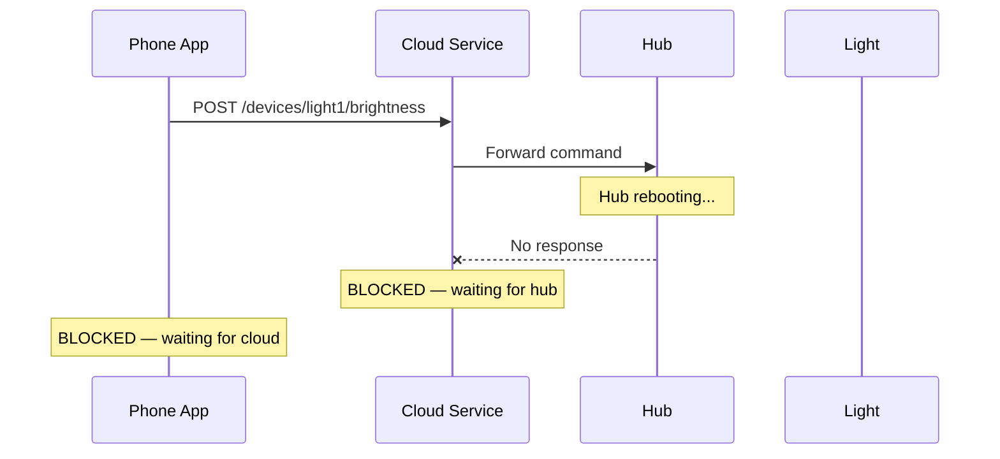
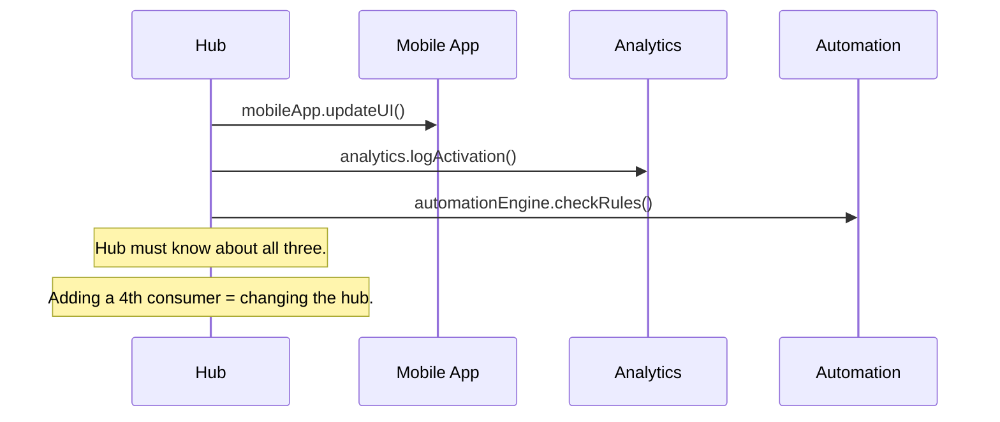
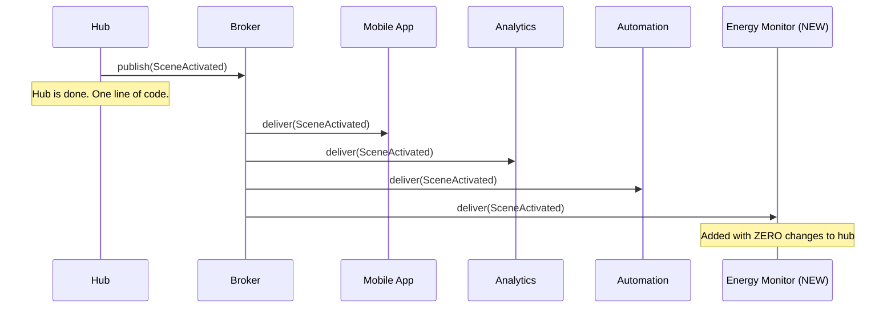
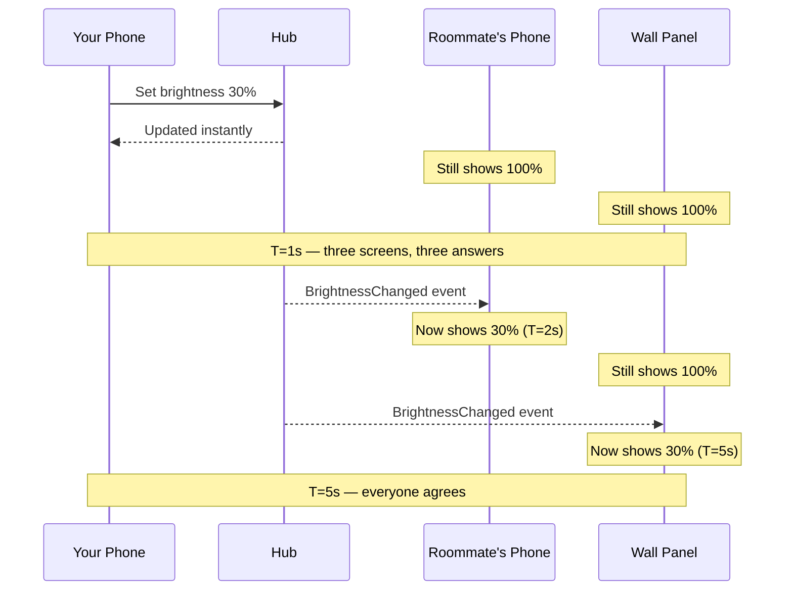
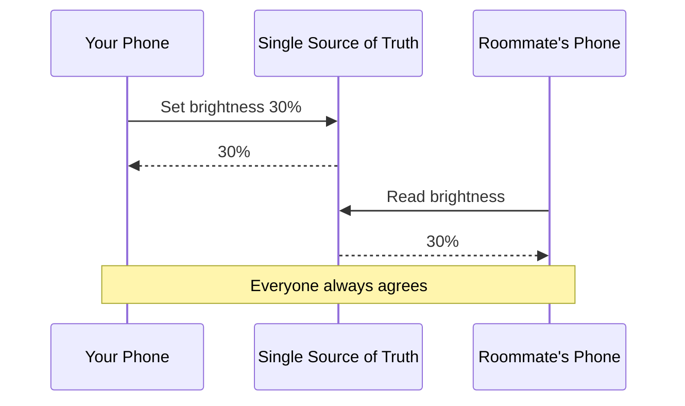
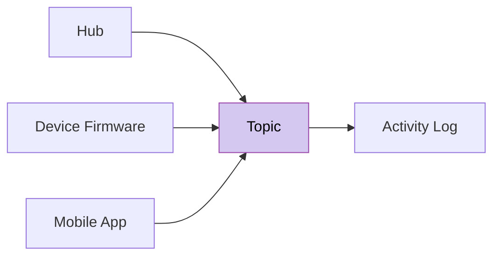
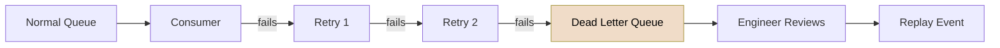

import RevealJS, { Slide } from '@site/src/components/RevealJS';
import Img from '@site/src/components/Img';

<RevealJS transition="slide">

{/* ============================================ */}
{/* COVER IMAGE */}
{/* ============================================ */}

<Slide>
  

<aside className="notes">
**Lecture overview:**
- **Total time:** ~55 minutes
- **Prerequisites:** L29 (GUIs, event handlers), L30 (MVVM, property binding, ObservableList), L31 (Threads, synchronization), L32 (Async, CompletableFuture), L20 (Networks, fallacies, resilience), L21 (Serverless, message queues), L7 (Coupling and cohesion)
- **Connects to:** GA1 (error handling patterns, BackgroundTaskRunner), CS 3700, CS 4730, CS 6620

**Structure (~23 slides):**
- Arc 1: Observer to Event-Driven Architecture (~17 min) — name the Observer pattern, zoom out to the distributed problem, events as facts, decoupling payoff
- Arc 2: Brokers and Delivery Guarantees (~8 min) — broker role, delivery levels, idempotency
- Arc 3: Consistency Models (~10 min) — strong vs eventual, choosing
- Arc 4: Broker Patterns (~8 min) — resilience recap, work queue, pub-sub, fan-in, DLQ
- Arc 5: Wrap-Up (~5 min) — comprehension check, takeaways, looking ahead

**Running example:** SceneItAll full system — hub, mobile app, cloud service, device firmware — expanding from the single-hub model of L31-32.

**Key shift:** L31-32 were about concurrency *within* the SceneItAll hub. L33 zooms out to the whole system.

> **Transition:** Let's start with the learning objectives...
</aside>

</Slide>

{/* ============================================ */}
{/* TITLE SLIDE */}
{/* ============================================ */}

<Slide>

# CS 3100: Program Design and Implementation II

## Lecture 33: Event-Driven Architecture

<p style={{marginTop: '2em', fontSize: '0.8em', color: '#666'}}>
  &copy;2026 Jonathan Bell, CC-BY-SA
</p>

<aside className="notes">
**Context from previous lectures:**
- L31-32: Concurrency within a single program — threads, locks, async, CompletableFuture
- L29-30: GUI event handlers, property binding, ObservableList, MVVM
- L20: Networks, fallacies of distributed computing, resilience patterns (retry, circuit breaker, rate limiting)
- L21: Serverless, message queues (Bottlenose grading queue, Pawtograder pgmq)
- L7: Coupling and cohesion — high coupling makes code hard to change

Today: we zoom out from the single hub to the full SceneItAll system. Observer pattern (familiar from L29/L30) scales to event-driven architecture across networks.

> **Transition:** Here's what you'll be able to do after today...
</aside>

</Slide>

{/* ============================================ */}
{/* LEARNING OBJECTIVES */}
{/* ============================================ */}

<Slide>

## Learning Objectives

<p style={{fontSize: '0.85em', textAlign: 'left'}}>
After this lecture, you will be able to:
</p>

<ol style={{fontSize: '0.75em', textAlign: 'left'}}>
  <li>Describe the Observer pattern and how it reduces coupling</li>
  <li>Define event-driven architecture and the role of event brokers</li>
  <li>Evaluate delivery guarantees and explain why idempotency matters</li>
  <li>Understand consistency models (strong vs eventual)</li>
  <li>Describe common broker patterns (work queue, pub-sub, fan-in, DLQ)</li>
</ol>

<aside className="notes">
**Time allocation:**
- Objective 1: Observer pattern + distributed problem + decoupling payoff (~17 min)
- Objective 2-3: Brokers and delivery guarantees (~8 min)
- Objective 4: Consistency models (~10 min)
- Objective 5: Broker patterns (~8 min)
- Wrap-up: comprehension check + takeaways (~5 min)

**Connection to GA1:** Error handling patterns from today apply to async operations in CookYourBooks. BackgroundTaskRunner handles the threading, but students must handle failures gracefully.

> **Transition:** Let's start by remembering what we learned this week — and why we need to go further...
</aside>

</Slide>

{/* ============================================ */}
{/* ARC 0: L32 BRIDGE */}
{/* ============================================ */}

<Slide>

## Async Solved Waiting — Inside One Process

<div style={{fontSize: '0.8em'}}>

Yesterday's key insight: **fire all the requests, don't pay for a thread to wait for each response.**

- `sendCommandAsync(light)` — returns immediately, callback fires when the light ACKs
- `CompletableFuture.allOf(...)` — 15 commands in flight, zero idle threads
- `Platform.runLater()` — safely push results back to the GUI thread

This works beautifully when everything is in **one JVM** — one hub dispatching commands to devices.

</div>

<p style={{fontSize: '0.85em', marginTop: '0.5em', color: '#9370DB'}}>
But SceneItAll isn't one JVM. The hub, the mobile app, the cloud service, and device firmware run on <strong>different machines, different networks, different timelines</strong>. They can't share a thread pool. They can't call each other's methods. When the hub activates a scene, how does the mobile app find out?
</p>

<aside className="notes">
**Build directly on L32's punchline.** "Yesterday we learned to fire requests and not pay for threads to wait. That's great inside one process. But now think bigger: the hub fires a brightness command. The mobile app needs to update its UI. The analytics service needs to log it. The automation engine needs to check rules. These aren't threads in the same JVM — they're separate programs on separate machines. You can't call `mobileApp.updateUI()` from the hub. You can't pass a callback across the network."

**The question that drives the lecture:** "How do you get the 'fire and don't wait' model to work when the components are on different machines?"

**The answer (preview):** Events + brokers = the distributed version of async callbacks. Instead of `thenAccept(callback)`, you publish an event to a broker, and subscribers react. Same principle, different mechanism.

> **Transition:** Before we go distributed, let's name a pattern that connects all of this...
</aside>

</Slide>

{/* ============================================ */}
{/* ARC 1: OBSERVER → EVENT-DRIVEN ARCHITECTURE (~17 min) */}
{/* ============================================ */}

<Slide>

## You Already Know This Pattern — Now We Name It

<p style={{fontSize: '0.85em'}}>
The <strong>Observer pattern</strong>: a subject notifies its observers when state changes. The subject doesn't know who they are.
</p>

<div style={{display: 'grid', gridTemplateColumns: '1fr 1fr', gap: '1em', fontSize: '0.7em'}}>

<div style={{backgroundColor: 'rgba(74,153,153,0.15)', padding: '0.8em', borderRadius: '8px'}}>

**The pattern in 8 lines:**

```java
public class Subject<T> {
    private final List<Consumer<T>>
        observers = new ArrayList<>();

    public void addObserver(Consumer<T> o) {
        observers.add(o);
    }
    public void setValue(T val) {
        for (var o : observers)
            o.accept(val);  // notify all
    }
}
```

</div>

<div style={{backgroundColor: 'rgba(148,74,170,0.15)', padding: '0.8em', borderRadius: '8px'}}>

**You've used this since L29:**

| Where | Subject | Observer |
|-------|---------|----------|
| **L29** | Button | `onAction` handler |
| **L30** | `IntegerProperty` | Bound Slider |
| **L30** | `ObservableList` | Bound ListView |
| **L32** | `CompletableFuture` | `thenAccept` callback |

</div>

</div>

<p style={{fontSize: '0.8em', marginTop: '0.5em'}}>
In every case, the subject <strong>doesn't depend on any specific observer</strong>. Adding or removing an observer = zero changes to the subject. That's <strong>data coupling</strong> at most (L7).
</p>

<p style={{fontSize: '0.8em', color: '#9370DB'}}>
Observer works beautifully inside one program. But what happens when the components are on different machines?
</p>

<aside className="notes">
**This is the naming moment.** Students have been using Observer since L29 without calling it that. The code on the left is the essence — a subject holds a list, notifies on change. JavaFX's `addListener`, `setOnAction`, and `bind` are all implementations of this.

**Key point:** The subject never imports, references, or depends on any observer class. The only shared thing is the notification type (the `T`). This is why it reduces coupling — recall L7's definition: high coupling = a change in one module forces changes in another. Here, you can add/remove observers with zero changes to the subject.

**Do NOT mention thread interrupts** — that's not Observer, it's a different mechanism.

> **Transition:** So Observer works great inside one program. But SceneItAll isn't one program...
</aside>

</Slide>

<Slide>

## SceneItAll Is Four Programs on Four Machines


<aside className="notes">
**Set the stage:** "For the last two lectures, everything was inside one JVM. Threads shared heap memory. Locks worked because everyone was in the same process. Now we zoom out — these four components run on completely different machines."

- **Hub:** Dedicated device, runs on the local network, talks Zigbee to devices
- **Mobile app:** Runs on the user's phone, communicates over WiFi or cellular
- **Cloud service:** Runs in a data center, enables remote access and analytics
- **Device firmware:** Runs on each individual bulb, fan, shade — extremely constrained

They can't share memory. They can't use `synchronized`. They need a different coordination model.

> **Transition:** The simplest approach is just to call each other directly...
</aside>

</Slide>

<Slide>

## Direct Calls Create a Chain of Fragility



<p style={{fontSize: '0.8em', marginTop: '0.5em'}}>
Hub reboots during a firmware update &rarr; Cloud blocks &rarr; App hangs. One slow or failed component makes <strong>everything</strong> slow or failed.
</p>

<p style={{fontSize: '0.75em', color: '#9370DB'}}>
This is exactly what the <a href="/lecture-notes/l20-networks#the-fallacies-of-distributed-computing">Fallacies of Distributed Computing</a> (L20) warned us about.
</p>

<aside className="notes">
**Walk through the failure scenario:** "The phone app sends a brightness command. It goes to the cloud, then the hub, then the device. Every link in this chain is a blocking call. If the hub is rebooting for a firmware update, the cloud service blocks waiting for it. If many users send commands, threads pile up on the cloud service. The cloud itself becomes slow, and ALL functionality degrades — not just commands to the offline hub."

**Connect to L20:** "Remember the fallacies? 'The network is reliable.' 'Latency is zero.' Every arrow in this diagram is a place where those assumptions break."

This is synchronous, tightly coupled communication. The phone app depends on the cloud, which depends on the hub, which depends on the device. A chain of dependencies.

> **Transition:** Event-driven architecture takes a different approach...
</aside>

</Slide>

<Slide>

## Events: Publish Facts, Don't Send Commands

<div style={{display: 'grid', gridTemplateColumns: '1fr 1fr', gap: '1.5em', fontSize: '0.75em'}}>

<div>

```java
// An event is a fact in the past tense
public record BrightnessChanged(
    String eventId,
    Instant timestamp,
    String source,       // "hub-01"
    String deviceId,
    int previousBrightness,
    int newBrightness
) {}
```

<p style={{marginTop: '0.5em'}}>
<code>BrightnessChanged</code>, not <code>ChangeBrightness</code>. Events are <strong>immutable facts about the past</strong> — pinning a note to the bulletin board. The receiver decides how to react.
</p>

</div>

<div>

**SceneItAll events:**

| Event | What happened |
|-------|---------------|
| `DeviceDiscovered` | New device on Zigbee network |
| `SceneActivated` | User activated a scene |
| `DeviceOffline` | Device stopped responding |
| `FirmwareUpdateAvailable` | New firmware ready |

<p style={{marginTop: '0.5em'}}>
Each event is <strong>immutable</strong> and <strong>timestamped</strong>. No one can change the fact that the brightness changed at 10:32:05 AM.
</p>

</div>

</div>

<aside className="notes">
**Emphasize the naming convention:** Past tense is the key signal. "BrightnessChanged" is a fact — it already happened. "ChangeBrightness" is a command — it implies the sender expects the receiver to do something. Events decouple because the publisher just states what happened; consumers decide independently whether and how to react.

**The record structure matters:**
- `eventId` — needed for deduplication (we'll see why soon)
- `timestamp` — when it happened, not when it was received
- `source` — which component published it
- Domain fields — what actually changed

> **Transition:** This gives us the same decoupling we had with Observer, but across the network...
</aside>

</Slide>

<Slide>

## Without EDA: Adding a Consumer Means Changing the Hub



<p style={{fontSize: '0.8em', color: '#e06c75'}}>
The hub is coupled to every downstream system. Adding a new consumer means modifying the hub's code.
</p>

<aside className="notes">
**Show this slide first.** The hub directly calls three services. It must know their APIs, their addresses, their availability. Ask: "What happens if we want to add an energy monitoring service?" Answer: change the hub. Every new consumer = a change to the publisher. That's high coupling (L7).

> **Transition:** Now watch what happens with events...
</aside>

</Slide>

<Slide>

## With EDA: Zero Changes to the Hub When You Add a Consumer



<p style={{fontSize: '0.8em'}}>
<strong>Observer</strong> (L29) &rarr; <strong>Async</strong> (L32) &rarr; <strong>MVVM</strong> (L30) &rarr; <strong>EDA</strong> (today) = the same decoupling pattern at increasing scale.
</p>

<p style={{fontSize: '0.75em', color: '#9370DB'}}>
L7: high coupling = a change in one module forces changes in others. Each step reduces what the caller needs to know — from thread lifecycles, to execution timing, to which consumers exist. EDA is information hiding applied to an entire system.
</p>

<aside className="notes">
**This is the "aha" moment — L33's equivalent of L31's race condition reveal.** The Energy Monitor appears with zero changes to the hub. The hub published one event. The broker delivered it to four consumers. The hub doesn't know the Energy Monitor exists.

**Four scales, same L7 principle — each reduces coupling further:**
1. **Observer (L29):** A button doesn't know what its handler does. Adding a second handler = zero changes to the button. *Decoupled from: what the observer does.*
2. **Async (L32):** `sendCommandAsync` doesn't know which thread runs the work or when it finishes. The caller just registers a callback. *Decoupled from: execution mechanism and timing.*
3. **MVVM (L30):** ViewModel exposes properties, doesn't know the View exists. Swap the View = zero changes. *Decoupled from: how data is displayed.*
4. **EDA (today):** Hub publishes `SceneActivated`, doesn't know who's listening. Add energy monitor = zero changes to the hub. *Decoupled from: which consumers exist, where they run, whether they're online.*

**The L7 thread through the whole course:** Coupling started as "does this class import that class?" (L7). By today it's "does this service even know that service exists?" The principle scales from methods to classes to processes to distributed systems.

**The coupling is identical at all three scales.** The mechanism changes (method call → binding → broker), but the L7 design principle is the same.

> **Transition:** But how do events get from the hub to the mobile app reliably — especially if the app is temporarily offline?
</aside>

</Slide>

{/* ============================================ */}
{/* ARC 2: BROKERS AND DELIVERY GUARANTEES (~8 min) */}
{/* ============================================ */}

<Slide>

## Brokers Store Events So Offline Consumers Don't Miss Them


<p style={{fontSize: '0.85em'}}>
Events flow through a <strong>broker</strong> — it stores events durably and delivers them to subscribers. Offline consumer? Events queue until it reconnects. The broker is the bulletin board from our cover image — one place where facts are posted, many people who read and react independently.
</p>

<p style={{fontSize: '0.75em', color: '#9370DB'}}>
Recall L21: <a href="/lecture-notes/l21-serverless#message-queues-asynchronous-communication">message queues</a> decouple submission from processing (Bottlenose grading, Pawtograder repo creation). A broker generalizes that — many producers, many consumers, managed subscriptions. Kafka handles millions of events/sec at Netflix; Zigbee mesh routes events between your hub and a light bulb. L20's resilience patterns — retry with backoff, circuit breakers, rate limiting — compose naturally with brokers and idempotent consumers.
</p>

<aside className="notes">
**Connect to L21:** "In L21 we saw message queues as an infrastructure building block. Bottlenose uses a queue to decouple submission receipt from grading. Pawtograder uses pgmq to rate-limit GitHub repo creation. An event broker generalizes that concept — many producers and many consumers sharing an event bus, with the broker managing subscriptions and delivery."

**Why not direct delivery?** Without a broker, if the mobile app is offline when the hub publishes `SceneActivated`, the app misses it. With a broker, the event is stored and delivered when the app reconnects. This is the durable delivery guarantee.

**Brokers exist at every scale:** Apache Kafka handles millions of events per second. Zigbee mesh networks route device events between the hub and individual lights. Same concept, vastly different scale.

> **Transition:** But how do we know the consumer actually processed the event?
</aside>

</Slide>

<Slide>

## Exactly-Once Is Nearly Impossible — At-Least-Once Is Practical

<div style={{fontSize: '0.8em'}}>

| Guarantee | How it works | Risk | Use case |
|-----------|-------------|------|----------|
| **At-most-once** | Fire and forget | Lost events | Analytics pings |
| **At-least-once** | Retry until ACK | Duplicate events | Most operations |
| **Exactly-once** | Process + ACK atomic | Extremely hard to achieve | Everyone wants this |

</div>

<p style={{fontSize: '0.85em', marginTop: '0.8em'}}>
The practical answer: <strong>at-least-once delivery + idempotent consumers</strong>.
</p>

<p style={{fontSize: '0.8em'}}>
Accept that duplicates will happen. Design your handlers so processing the same event twice produces the same result as processing it once.
</p>

<aside className="notes">
**Walk through the scenario:** "The broker delivers `BrightnessChanged` to the mobile app. The app processes it and sends an ACK. But the ACK is lost on the network. The broker thinks the app never got it, so it retries. Now the app processes the event twice."

**At-most-once:** Send and forget. If it's lost, it's lost. Fine for analytics where a dropped sample doesn't matter.

**At-least-once:** Retry until the consumer ACKs. Guaranteed delivery, but you might get duplicates when the ACK is lost.

**Exactly-once:** Everyone wants this. It requires the consumer's processing and its ACK to be atomic — a single indivisible operation. This is extremely hard in distributed systems because the consumer and the broker are on different machines.

**The practical answer:** Use at-least-once (the broker handles retries) and make your consumers idempotent (you handle duplicates).

> **Transition:** So what does "idempotent" actually mean?
</aside>

</Slide>

<Slide>

## Design Handlers So Processing the Same Event Twice Is Safe

<div style={{fontSize: '0.85em'}}>

An operation is **idempotent** if applying it *N* times has the same effect as applying it once:

</div>

<div style={{fontSize: '0.8em'}}>

| Operation | Idempotent? | Why? |
|-----------|:-----------:|------|
| `light.setBrightness(30)` | Yes | Setting to 30 twice = setting to 30 once |
| `light.togglePower()` | No | Toggling twice reverts to original state |
| `counter.increment()` | No | Incrementing twice adds 2 instead of 1 |
| `database.upsert(id, record)` | Yes | Upserting same record twice = one record |

</div>

<p style={{fontSize: '0.85em', marginTop: '0.8em', backgroundColor: 'rgba(74,153,153,0.15)', padding: '0.6em', borderRadius: '8px'}}>
Design rule: <strong>prefer "set to X" over "change by Y."</strong> If someone pins the same note to the bulletin board twice, readers who check the note's ID can ignore the duplicate.
</p>

<div style={{fontSize: '0.72em'}}>

```java
// Idempotent handler — safe to process the same event twice
void handle(BrightnessChanged event) {
    light.setBrightness(event.newBrightness());  // set to X, not change by Y
}
```

</div>

<p style={{fontSize: '0.1em'}}>
</p>

<aside className="notes">
**The design rule is simple:** `setBrightness(30)` is safe to retry. `adjustBrightness(-70)` is not. If you receive a duplicate `BrightnessChanged` event and your handler sets the brightness to the value in the event, nothing bad happens. If your handler increments a counter, you get the wrong count.

**Event IDs enable deduplication:** Each event has a unique `eventId`. If a consumer tracks which IDs it has processed, it can detect and skip duplicates. But idempotent design is the first line of defense — deduplication is a backup.

**Ask students:** "Is HTTP PUT idempotent? Is HTTP POST?" (PUT yes, POST no — same principle.)

> **Transition:** Even with reliable delivery and idempotent consumers, there's still a hard problem — when does everyone agree on the state?
</aside>

</Slide>

{/* ============================================ */}
{/* ARC 3: CONSISTENCY MODELS (~10 min) */}
{/* ============================================ */}

<Slide>

## Three Screens Show Three Different Answers — Is That a Bug?



<p style={{fontSize: '0.85em'}}>
You set 30%. Your phone sees it instantly. Roommate's phone sees 100% for 2 seconds. Wall panel sees 100% for 5 seconds. <strong>Is the system broken?</strong>
</p>

<aside className="notes">
**Make this concrete:** "You're sitting on the couch. You set the living room to 30% from your phone. Your phone shows 30% immediately. Your roommate walks in, checks their phone — it says 100%. They look at the wall panel — it also says 100%. Five seconds later, everything agrees. During those 5 seconds, if someone asked 'what brightness is the living room?' the answer depends on who you ask."

**Pause and ask:** "Is this a bug?" Let students debate briefly. Some will say yes, some will say it depends. That's exactly the right answer — it depends on the **consistency model** you've chosen. Take 30-60 seconds of hands ("Is this a bug?"), then move on. Don't let this become a 3-minute debate.

> **Transition:** Let's formalize the two models...
</aside>

</Slide>

<Slide>

## Sequential Consistency: One Truth, Everywhere, Always

<p style={{fontSize: '0.85em'}}>
<strong>Sequential consistency</strong> means all observers see the same operations in the same order — as if there were one CPU processing everything.
</p>

<p style={{fontSize: '0.8em'}}>
Mental model: <strong>a single-threaded program.</strong> When you write <code>brightness = 30</code>, every subsequent read returns 30. There's only one copy of the truth.
</p>



<p style={{fontSize: '0.8em', color: '#9370DB'}}>
Like a group text where nobody can send a new message until everyone has read the last one. Simple. Safe. But how do you achieve this across multiple machines?
</p>

<aside className="notes">
**"Sequential" because it behaves as if operations happen in a single sequence** — the order everyone agrees on. In a single-threaded program, you get this for free. In a distributed system, you have to *enforce* it — and that's expensive.

**Do NOT use database transaction language.** The group text analogy is the right level.

> **Transition:** What does it cost to enforce this across a distributed system?
</aside>

</Slide>

<Slide>

## Sequential Consistency Is Expensive to Enforce

<p style={{fontSize: '0.85em'}}>
To make every observer see the same state at the same time, you need <strong>coordination</strong>:
</p>

<div style={{fontSize: '0.8em'}}>

- **Wait for the slowest.** You set brightness to 30%. The hub can't confirm until your phone, your roommate's phone, AND the wall panel all acknowledge. The wall panel is on a slow Zigbee link — everyone waits.
- **One failure blocks everyone.** Your roommate's phone is in airplane mode. Now nobody can change the brightness until their phone reconnects. The whole system is held hostage by the least reliable participant.
- **It doesn't scale.** 3 consumers = manageable. 50 consumers = every operation waits for 50 acknowledgments. 1000 consumers = unusable.

</div>

<p style={{fontSize: '0.8em', marginTop: '0.5em', color: '#9370DB'}}>
Sequential consistency is the right choice for <strong>safety-critical operations</strong> (door locks, alarms) where the cost of disagreement is someone getting hurt. For everything else, there's a cheaper model.
</p>

<aside className="notes">
**Make the cost visceral.** "Imagine you're standing in your living room. You tap 'dim to 30%' on your phone. Nothing happens for 3 seconds because the system is waiting for the wall panel in the hallway to acknowledge. The wall panel is on a slow Zigbee link. Your phone shows a spinner. Your roommate's phone shows a spinner. Everyone is stuck waiting for one slow device."

**Then:** "Now imagine the wall panel is unplugged. You literally cannot change the brightness of your own lights until someone plugs it back in. Is that acceptable? For brightness — absolutely not. For a door lock — maybe."

> **Transition:** Most systems can't afford this. There's a cheaper model...
</aside>

</Slide>

<Slide>

## Eventual Consistency: Everyone Agrees — Eventually

<p style={{fontSize: '0.85em'}}>
<strong>Eventual consistency</strong> means: if you stop making changes and wait long enough, all observers will converge to the same state. But at any given moment, they may disagree.
</p>

<p style={{fontSize: '0.8em'}}>
Mental model: <strong>a durable message queue.</strong> Every event gets delivered to every subscriber — eventually. Some subscribers are faster than others. But no event is lost, and given time, everyone catches up.
</p>

<div style={{fontSize: '0.8em', marginTop: '0.5em'}}>

- **Fast:** The operation completes as soon as the hub applies it — no waiting for acknowledgments
- **Resilient:** If a consumer is offline, events queue in the broker until it reconnects
- **Scalable:** Adding consumers doesn't slow down the producer

</div>

<p style={{fontSize: '0.8em', marginTop: '0.5em', color: '#9370DB'}}>
Like posting on social media — you see it, your friend sees it 10 seconds later, everyone converges. The bulletin board model: people wander by and read notes at their own pace.
</p>

<aside className="notes">
**The message queue mental model is key.** "Events go into the broker. Every subscriber will eventually receive every event. Some get it in milliseconds, some in seconds, some in minutes (if they were offline). But nothing is lost. Given enough time with no new events, all subscribers have the same state."

**This is the default model of the internet.** Browser caches, CDN caches, your phone's cached copy of anything — all eventually consistent. Students have been living with this model their entire internet-using lives. L21's caching discussion was an eventual consistency question — we just didn't have the name for it.

> **Transition:** So when do you choose which?
</aside>

</Slide>

<Slide>

## Use Strong When Someone Could Get Hurt; Eventual for Everything Else

<div style={{fontSize: '0.8em'}}>

The question: **what is the cost of a user seeing stale data for N seconds?**

| Scenario | Cost of staleness | Model |
|----------|-------------------|-------|
| **Door lock state** | Someone enters who shouldn't | **Sequential** |
| **Security alarm** | Alarm doesn't trigger | **Sequential** |
| **Brightness display** | Roommate sees old value for 5 sec | **Eventual** |
| **Scene history log** | Last scene shown is 10 sec behind | **Eventual** |
| **Energy dashboard** | Power numbers lag by 30 sec | **Eventual** |

</div>

<p style={{fontSize: '0.85em', marginTop: '0.5em', backgroundColor: 'rgba(74,153,153,0.15)', padding: '0.6em', borderRadius: '8px'}}>
L21 callback: CDN caches and browser caches are eventually consistent — they have been all along. Eventual consistency is the default model of the internet. Sequential consistency is the expensive special case.
</p>

<aside className="notes">
**Walk through the table:** "Door lock — if the lock shows 'locked' on your phone but it's actually unlocked, someone could walk in. Safety issue. Sequential consistency is worth the cost. Brightness display — your roommate sees 100% for 5 seconds. Annoying? Maybe. Dangerous? No. Eventual consistency is fine."

**Connect to L21:** "In L21 we talked about CDN caches and asked 'what happens when the cache and the origin disagree?' That was an eventual consistency question — we just didn't have the name for it."

**The insight:** Eventual consistency is the *default* state of distributed information. Sequential consistency requires extra work, extra latency, and extra failure modes. Use it only when the cost of staleness is truly dangerous.

> **Transition:** This isn't hypothetical — you use a system built this way every day...
</aside>

</Slide>

<Slide>

## You Use This Architecture Every Day: Pawtograder

<div style={{fontSize: '0.8em'}}>

Pawtograder uses **both** consistency models — chosen per use case:

<div style={{display: 'grid', gridTemplateColumns: '1fr 1fr', gap: '1em', marginTop: '0.5em'}}>

<div style={{backgroundColor: 'rgba(200,74,74,0.15)', padding: '0.6em', borderRadius: '8px'}}>

**Sequential (via the database)**

Grades, submissions, enrollment records. When a TA enters a grade, the database guarantees every subsequent read sees that grade. One source of truth.

</div>

<div style={{backgroundColor: 'rgba(74,153,74,0.15)', padding: '0.6em', borderRadius: '8px'}}>

**Eventual (via event queues)**

**Outbound:** GitHub repo creation, Discord notifications, autograder job dispatch. **Inbound:** GitHub webhooks (pushes, issues, PR events), Discord interactions (slash commands, reactions). Queues define the boundary in both directions.

</div>

</div>

</div>

<p style={{fontSize: '0.8em', marginTop: '0.5em', color: '#9370DB'}}>
This is the architecture from L18-L21 in action: the database is the sequentially consistent core (hexagonal architecture, L16). Event queues are the ports to external systems — outbound to GitHub, Discord, and the autograder; inbound from GitHub webhooks and Discord interactions. Each queue defines an in/out interface (L7: low coupling).
</p>

<aside className="notes">
**Make this concrete with systems students know:**
- "When you submit an assignment, the submission is saved to the database — sequential consistency. Your grade is immediately visible to you and your TA."
- "But creating your GitHub repo? That goes through a queue (pgmq). Pawtograder publishes a 'create repo' event. A background worker picks it up and calls the GitHub API. If GitHub is slow, the queue buffers. If it fails, it retries. Your submission isn't blocked by GitHub being down."
- "Same for Discord: when a regrade request is filed, an event goes to a queue, a worker sends the Discord notification. The regrade is recorded immediately (sequential); the Discord ping arrives eventually."

**Architecture callback:** "In L18 we talked about where to put boundaries. In L16 we talked about hexagonal architecture — domain core surrounded by ports and adapters. The database IS the domain core (sequential). The queues ARE the ports to external infrastructure (eventual). This is exactly that architecture, running in production, serving 1500 of you every week."

> **Transition:** Now let's look at the broker patterns that make this work...
</aside>

</Slide>

{/* ============================================ */}
{/* ARC 4: BROKER PATTERNS (~8 min) */}
{/* ============================================ */}

<Slide>

## Work Queues: Each Event Goes to Exactly One Worker


<p style={{fontSize: '0.85em'}}>
Each event goes to <strong>exactly one</strong> consumer. The broker distributes events among workers.
</p>

<p style={{fontSize: '0.8em'}}>
SceneItAll: 50 device status updates/sec &rarr; pool of 5 workers pull from a shared queue. Use for <strong>parallelizing work</strong>.
</p>

<aside className="notes">
**This is the simplest pattern.** "The hub receives 50 device status updates per second. One worker can't keep up. So we spin up 5 workers that all pull from the same queue. The broker ensures each update goes to exactly one worker — no duplicates, no missed updates."

**Connect to L31:** "This is the same thread pool concept from L31, but across processes instead of threads. The queue is the shared work source."

> **Transition:** What if multiple services all need to see the same event?
</aside>

</Slide>

<Slide>

## Pub-Sub: Every Subscriber Gets Every Event


<p style={{fontSize: '0.85em'}}>
Each event goes to <strong>every subscriber</strong>. The broker copies the event to each consumer's subscription.
</p>

<p style={{fontSize: '0.8em'}}>
SceneItAll: <code>SceneActivated</code> &rarr; mobile app updates UI, analytics logs it, automation checks rules. Use for <strong>broadcasting events</strong>.
</p>

<p style={{fontSize: '0.8em'}}>
Compare to work queue: there, each event goes to ONE consumer (like a ticket counter). Here, each event goes to EVERY subscriber (like a radio broadcast).
</p>

<aside className="notes">
**This is the EDA pattern from slide 7 made concrete.** "When the hub publishes `SceneActivated`, every subscriber gets a copy. The mobile app updates its UI. The analytics service logs the activation. The automation engine checks if any rules should trigger. The hub doesn't know any of them exist."

**Adding a consumer:** "Want to add an energy monitoring service? Subscribe it to the topic. Zero changes to the hub, zero changes to existing consumers."

> **Transition:** Two more patterns to complete the toolkit...
</aside>

</Slide>

<Slide>

## Fan-In: Many Producers, One Consumer

<div style={{backgroundColor: 'rgba(74,153,153,0.15)', padding: '0.8em', borderRadius: '8px', fontSize: '0.75em'}}>

Many producers, one consumer.



SceneItAll: cloud service aggregates events from **all sources** into a single activity log.

Use for **centralized logging, monitoring, analytics**.

</div>

<aside className="notes">
**Fan-in:** "The opposite of pub-sub. Many producers, one consumer. Every component in SceneItAll — hub, app, firmware, cloud — publishes events. The cloud service subscribes to all of them and writes a unified activity log. One place to see everything that happened."

> **Transition:** What happens when a consumer can't process an event?
</aside>

</Slide>

<Slide>

## Dead Letter Queues Catch What Your Code Can't Handle Yet

<div style={{backgroundColor: 'rgba(200,153,74,0.15)', padding: '0.8em', borderRadius: '8px', fontSize: '0.8em'}}>

Failed events go to a holding queue — not silently dropped.



A firmware update event for a discontinued device fails 5 times &rarr; lands in the DLQ. An engineer adds support and **replays** the event.

Use for **catching failures** that need human review.

</div>

<div style={{fontSize: '0.75em', marginTop: '0.8em'}}>

| Pattern | When to use | SceneItAll example |
|---------|------------|-------------------|
| **Work queue** | Parallelize processing | Status updates across worker pool |
| **Pub-sub** | Multiple services react to same event | Scene activation notifies app, analytics, automation |
| **Fan-in** | Aggregate from many sources | Cloud collects activity from all components |
| **DLQ** | Don't lose unprocessable events | Failed firmware updates queued for review |

</div>

<aside className="notes">
**DLQ:** "What happens when a consumer can't process an event? Maybe it's a firmware update for a device type the system doesn't recognize yet. After 5 retries, the broker gives up — but instead of dropping the event, it moves it to a dead letter queue. An engineer can inspect the DLQ, figure out the problem, fix it, and replay the event. Without a DLQ, that event is silently lost."

**These patterns compose.** A real system uses pub-sub for broadcasting, work queues for parallelizing, fan-in for aggregation, and DLQs for resilience — all running through the same broker infrastructure.

> **Transition:** Let's check your understanding...
</aside>

</Slide>

{/* ============================================ */}
{/* ARC 5: WRAP-UP (~5 min) */}
{/* ============================================ */}

<Slide>

## Comprehension Check

<p style={{fontSize: '0.85em'}}>
Open Poll Everywhere and answer the questions.
</p>

<aside className="notes">
**5 poll questions — run all five, discuss after each.**

**Q1:** The SceneItAll hub publishes a `SceneActivated` event. Which is a benefit over the hub directly calling the mobile app?
- A. The hub doesn't need to know the mobile app exists (CORRECT)
- B. The mobile app updates instantly with zero latency
- C. The hub and mobile app are always perfectly in sync
- D. Events are faster than direct HTTP calls

*Discussion: A is the decoupling payoff. B is wrong — there IS latency (eventual consistency). C is wrong — they may temporarily disagree. D is wrong — events may actually be slower for a single request, but the system is more resilient.*

**Q2:** The broker delivers `BrightnessChanged` to the mobile app, but the ACK is lost. The broker retries. The handler is `light.setBrightness(30)`. What happens?
- A. The light flickers because the command runs twice
- B. Nothing bad — `setBrightness(30)` is idempotent (CORRECT)
- C. The app crashes on the duplicate event
- D. The broker detects the duplicate and doesn't redeliver

*Discussion: B is correct. Ask: "what if the handler was `toggleLight()` instead?" That would be a problem — toggle is not idempotent.*

**Q3:** You set brightness to 30%. Your roommate checks 3 seconds later and sees 100%. They check again at 10 seconds and see 30%. What consistency model?
- A. Strong consistency
- B. Eventual consistency (CORRECT)
- C. No consistency — the system is broken
- D. Causal consistency

*Discussion: B. The roommate eventually sees the correct value. The system is working as designed — it just takes time for the event to propagate. If it were strong consistency, the roommate would have seen 30% immediately (or the system would have blocked until everyone agreed).*

**Q4:** SceneItAll sends a "lock front door" command. The hub confirms the lock engaged. But the wall panel still shows "unlocked" for 3 seconds. A guest arrives and sees "unlocked." Which is correct?
- A. The system is broken — this should never happen
- B. The system uses eventual consistency, which is appropriate for door locks
- C. The system uses eventual consistency, which is NOT appropriate for door locks — lock state needs strong consistency (CORRECT)
- D. The wall panel's cache needs to be cleared

*Discussion: C. This is the "cost of staleness" reasoning from the choosing slide. Door locks are safety-critical — a guest seeing "unlocked" could enter when they shouldn't. Brightness display can be eventually consistent (annoying but harmless). Door lock state cannot (someone could get hurt). Trap distractor: B sounds plausible if students think "eventual consistency is always fine."*

**Q5:** SceneItAll's hub publishes `SceneActivated`. The mobile app, analytics service, and automation engine all need to process it independently. Which broker pattern?
- A. Work queue — each event goes to one consumer
- B. Pub-sub — each event goes to every subscriber (CORRECT)
- C. Fan-in — many producers, one consumer
- D. Dead letter queue — failed events stored for review

*Discussion: A would mean only ONE of the three services processes each event. B is correct — all three need the same event. C is the opposite direction (many producers, not many consumers). D is for error handling, not routing.*
</aside>

</Slide>

<Slide>

## Key Takeaways

<div style={{fontSize: '0.8em'}}>

1. **Observer** reduces coupling in-process; **EDA** reduces it across networks — same principle at different scales

2. **Events are facts** (past tense, immutable) — publishers don't know or care who's listening

3. **Brokers** store and deliver events durably — offline consumers don't miss events

4. **At-least-once + idempotent consumers** = practical exactly-once. Prefer "set to X" over "change by Y"

5. **Eventual consistency** is the default — strong consistency is the expensive special case, reserved for safety-critical operations

6. **Broker patterns**: work queues parallelize, pub-sub broadcasts, fan-in aggregates, DLQs catch failures

</div>

<aside className="notes">
**Quick recap — one sentence per point:**
1. Observer, MVVM, EDA — same decoupling pattern at increasing scale
2. BrightnessChanged, not ChangeBrightness — the naming convention tells you everything
3. Without a broker, offline = missed events. With a broker, events queue
4. Duplicates will happen. Design for them. setBrightness(30) is safe; togglePower() is not
5. Your browser cache is eventually consistent with the server. You've been living with this model forever
6. These patterns compose — real systems use all four

> **Transition:** Let's zoom out and see the full arc of this week...
</aside>

</Slide>

<Slide>

## Same Challenge, Increasing Scale: Threads → Async → Events

<div style={{display: 'flex', justifyContent: 'center', gap: '0.5em', fontSize: '0.85em', marginBottom: '1em'}}>
  <div style={{backgroundColor: 'rgba(200,74,74,0.15)', padding: '0.5em 1em', borderRadius: '8px', textAlign: 'center'}}>
    <strong>L31: Threads</strong><br/>In-process
  </div>
  <div style={{fontSize: '1.5em', alignSelf: 'center'}}>&rarr;</div>
  <div style={{backgroundColor: 'rgba(169,148,74,0.15)', padding: '0.5em 1em', borderRadius: '8px', textAlign: 'center'}}>
    <strong>L32: Async</strong><br/>I/O within process
  </div>
  <div style={{fontSize: '1.5em', alignSelf: 'center'}}>&rarr;</div>
  <div style={{backgroundColor: 'rgba(74,153,74,0.15)', padding: '0.5em 1em', borderRadius: '8px', textAlign: 'center'}}>
    <strong>L33: EDA</strong><br/>Across networks
  </div>
</div>

<div style={{fontSize: '0.75em'}}>

| | L31: Threads | L32: Async | L33: EDA |
|--|-------------|-----------|---------|
| **Problem** | Shared mutable state | Threads waste resources waiting | Services coupled synchronously |
| **Solution** | Locks, concurrent collections | CompletableFuture, `allOf` | Events, brokers, eventual consistency |
| **Bug category** | Race conditions, deadlock | Ordering bugs, swallowed errors | Stale state, cascading failures |

</div>

<p style={{fontSize: '0.85em', marginTop: '0.5em'}}>
Same challenge — managing concurrent operations safely — at <strong>increasing scale</strong>. This is how every large system works: Netflix, Uber, Slack — and yes, GitHub.
</p>

<aside className="notes">
**Connect the week:** "Monday we were inside one JVM worrying about two threads stomping on each other's brightness values. Wednesday we were still inside one JVM but now worried about 15 network calls blocking 15 threads. Today we zoomed out to four different programs on four different machines, coordinating through events and brokers."

**GitHub callback from L31:** "Remember Monday when we talked about GitHub struggling with availability? GitHub is a Ruby on Rails monolith — one process handling everything. As AI coding assistants doubled their traffic, that monolith couldn't keep up. The patterns we learned today — event queues, eventual consistency, decoupled services — are exactly what you'd use to break a monolith apart and handle that scale. GitHub's outages are a case study in what happens when you DON'T use these patterns."

**Pawtograder is already doing this right:** "Pawtograder is much smaller than GitHub, but it uses the same architectural patterns: database for sequential consistency on grades, event queues for GitHub repo creation, Discord notifications, and autograder job dispatch. You've been a user of event-driven architecture all semester."

> **Transition:** What's next...
</aside>

</Slide>

<Slide>

## EDA vs Monolith: Quality Attributes Revisited (L18)

<div style={{fontSize: '0.72em'}}>

| Quality Attribute | Monolith | Event-Driven Architecture |
|-------------------|----------|--------------------------|
| **Scalability** | Scale the whole app, even if only one part is overloaded | Scale individual consumers independently — add workers to the bottleneck |
| **Deployability** | Deploy everything at once — one bad change takes down the whole system | Deploy services independently — the broker isolates them |
| **Testability** | Must test the whole system together; hard to isolate | Each consumer is independently testable — feed it events, assert on results |
| **Modifiability** | Adding a feature may touch many modules | Add a new consumer with zero changes to the publisher (L7) |
| **Availability** | One component crash = entire system down | One consumer crash = that consumer's work queues; everything else continues |
| **Debuggability** | Stack traces, logs in one place — straightforward | Events scattered across services — need correlation IDs and distributed tracing |

</div>

<p style={{fontSize: '0.8em', marginTop: '0.3em', color: '#9370DB'}}>
EDA wins on most attributes. The trade-off: <strong>debuggability</strong>. "The lights changed — which service did that?" requires observability tooling that monoliths don't need.
</p>

<aside className="notes">
**Callback to L18/L19:** "In L18 we introduced quality attributes as the lens for evaluating architecture. In L19 we compared monolith vs microservices. Now we can evaluate EDA against those same attributes."

**Walk through the table row by row.** The key insight: EDA trades debuggability for everything else. In a monolith, you can grep one log file. In EDA, you need distributed tracing, correlation IDs, and event logs to follow an operation across services.

**GitHub again:** "GitHub is a monolith. It scores well on debuggability — one Rails app, one log. But it scores poorly on scalability, deployability, and availability — which is why it's been struggling. Breaking it into event-driven services would improve those attributes, but they'd need to invest in observability tooling."

> **Transition:** How does EDA fit with the other architectural styles we've studied?
</aside>

</Slide>

<Slide>

## EDA Is the Glue Between Unreliable Services

<p style={{fontSize: '0.85em'}}>
In a microservice or serverless architecture (L21), each service is small and independently deployable. But services fail, restart, and scale independently. <strong>Events + brokers</strong> provide the reliable interface between unreliable services:
</p>

<div style={{fontSize: '0.8em'}}>

- **Deployability:** Deploy a new version of the analytics service. The broker queues events while it restarts. Zero downtime for the hub or the mobile app.
- **Fault isolation:** The Discord bot crashes. Regrade notifications queue in the broker. When the bot restarts, it processes the backlog. No regrade requests are lost.
- **Independent scaling:** Autograder is overloaded at deadline time. Spin up more workers pulling from the grading queue. The submission service doesn't change.
- **Debugging:** Every event has an ID, a timestamp, and a source. The broker is the audit trail — you can replay events, inspect the DLQ, trace the full lifecycle of a submission.

</div>

<p style={{fontSize: '0.8em', color: '#9370DB'}}>
Events are the contract between services. The broker is the postal service. Each service is free to crash, restart, and evolve — as long as it speaks the same event language.
</p>

<aside className="notes">
**Connect to L21 serverless:** "In L21 we saw serverless functions triggered by events — S3 uploads trigger image processing, API Gateway triggers Lambda. That's EDA at the infrastructure level. The cloud provider IS the broker."

**Connect to L19 microservices:** "In L19 we discussed breaking a monolith into microservices. But microservices that call each other via HTTP are just a distributed monolith — one failure cascades. Events + brokers give you TRUE decoupling — each service publishes facts and subscribes to facts, with no direct dependencies."

**The key insight for students:** "You don't need to be building Netflix to use these patterns. Pawtograder uses them. Your future employer's backend almost certainly uses them. The broker queue is the most underappreciated piece of infrastructure in modern software."

> **Transition:** Looking ahead...
</aside>

</Slide>

<Slide>

## Looking Ahead

<div style={{fontSize: '0.8em'}}>

### GA1 — Due April 9

Your CookYourBooks app uses `BackgroundTaskRunner` — a utility wrapping `javafx.concurrent.Task`, daemon threads, and FX-thread callbacks into `run(callable, onSuccess, onFailure)`. You don't write threading boilerplate, but you **must understand what it does** (your TA will ask).

The error handling patterns from today (idempotency, retry, graceful failure) apply to every async operation in your app.

### Want to go deeper?

- **CS 3700: Networks and Distributed Systems** — protocols, distributed coordination
- **CS 4730: Distributed Systems** — formal consistency models, CAP theorem, Paxos/Raft consensus
- **CS 6620: Fundamentals of Cloud Computing** — cloud-native event systems at scale (Kafka, SQS, EventBridge)

</div>

<aside className="notes">
**GA1 connection:** "BackgroundTaskRunner handles the threading plumbing for you — it creates a daemon thread, runs your callable, and calls your onSuccess or onFailure callback on the JavaFX Application Thread via Platform.runLater(). You don't need to write that code, but your TA will ask you to explain what it does internally. The concepts from this week — threads, async, Platform.runLater(), error handling — are exactly what you need to understand."

**Course pointers:** These are for students who are excited about this material and want to go further. CS 3700 covers the networking foundations. CS 4730 covers the formal theory (CAP theorem, consensus algorithms). CS 6620 covers cloud-native implementations at scale.

**End of lecture.**
</aside>

</Slide>

</RevealJS>
