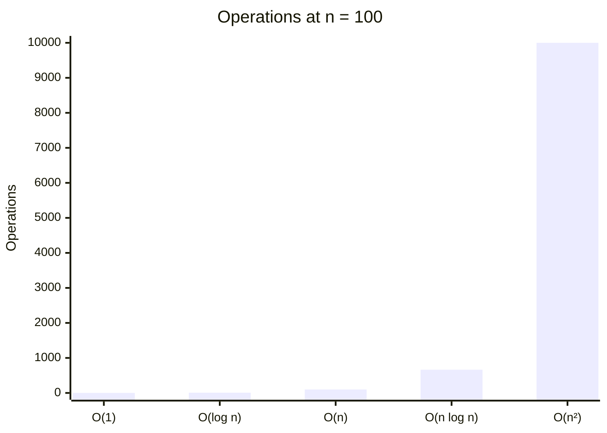
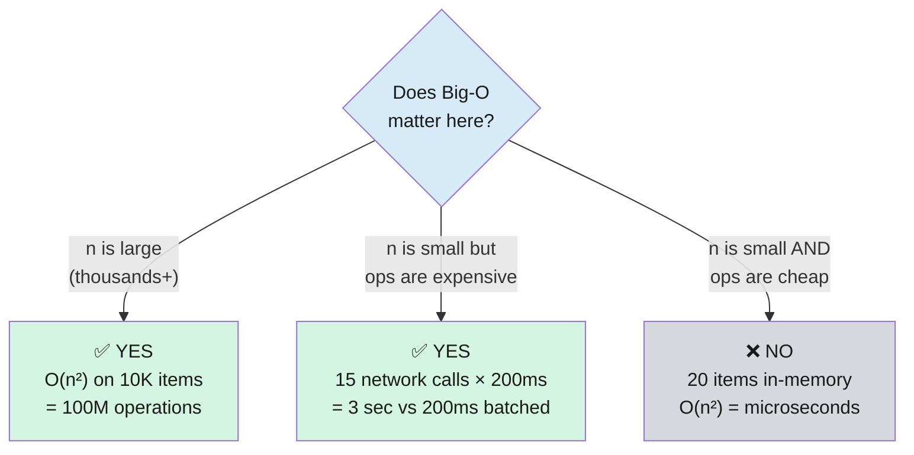
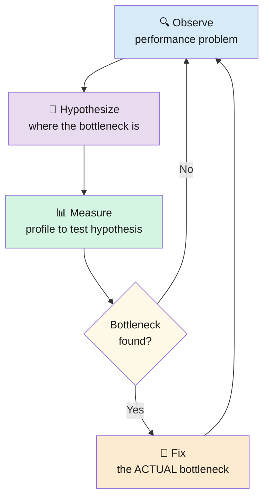
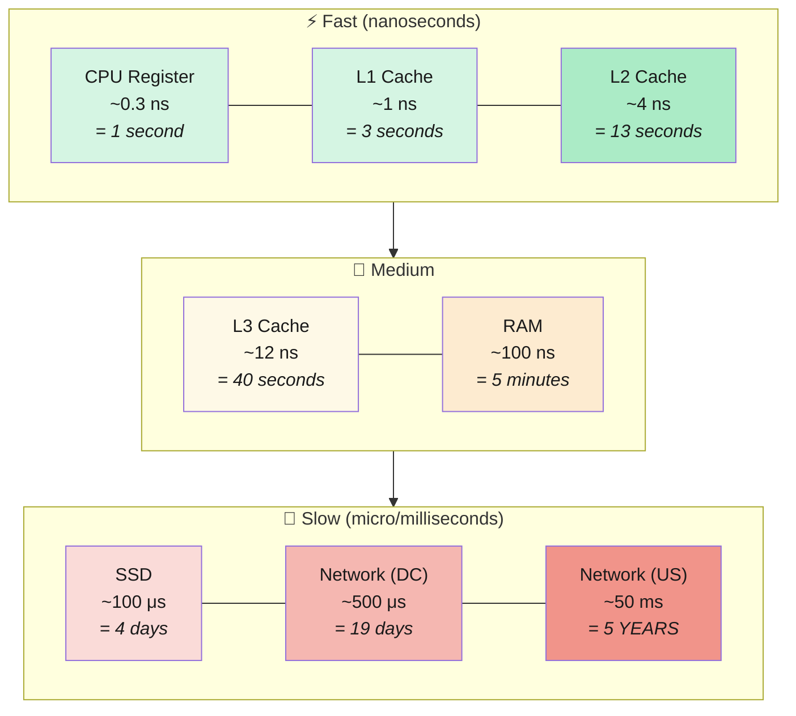
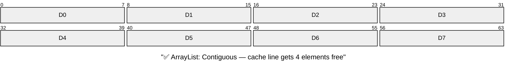
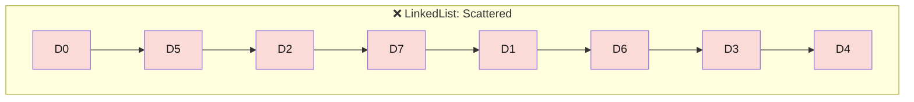
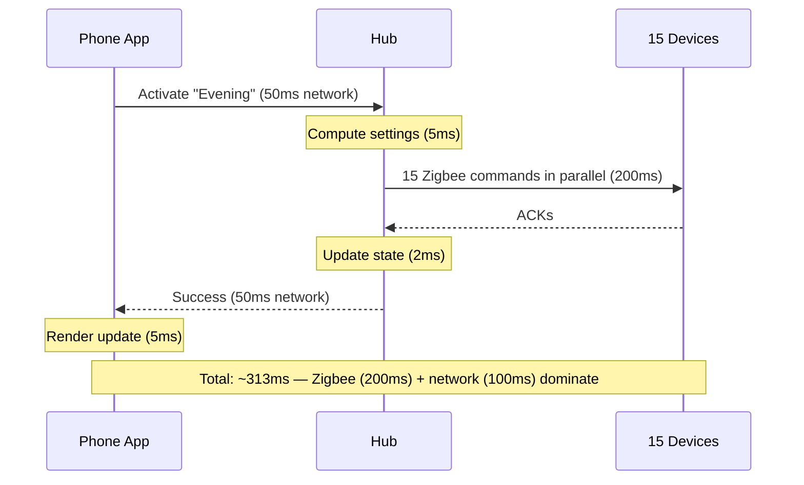
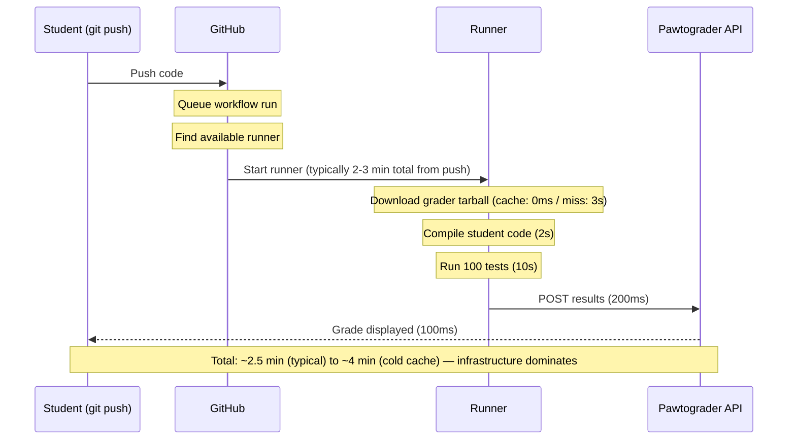
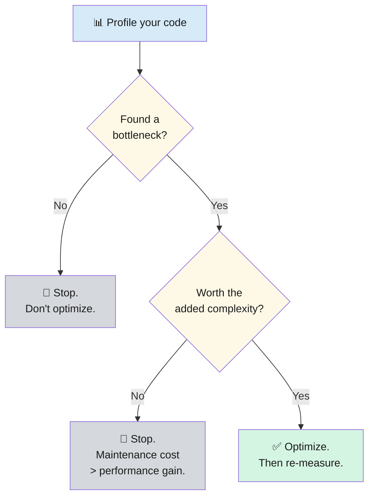
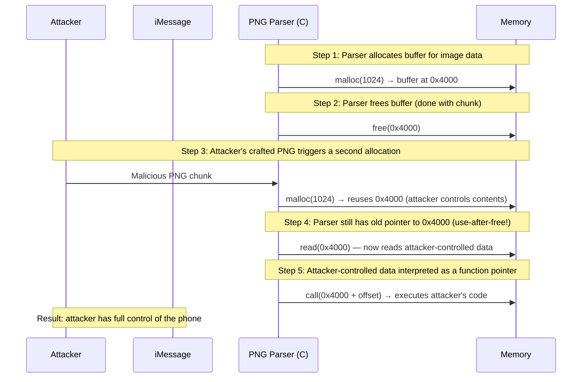

import RevealJS, { Slide } from '@site/src/components/RevealJS';
import Img from '@site/src/components/Img';

<RevealJS transition="slide">

{/* ============================================ */}
{/* COVER IMAGE */}
{/* ============================================ */}

<Slide>
  

<aside className="notes">
**Lecture overview:**
- **Total time:** ~55 minutes
- **Prerequisites:** L3 (ArrayList vs LinkedList), L14 (Debugging/Scientific Method), L20 (Networks), L31 (Threads), L32 (Async), L33 (Event Architecture)
- **Connects to:** L35 (Safety and Reliability), L36 (Sustainability), GA1 (CookYourBooks performance)

**Structure (~23 slides):**
- Arc 1: Big-O Notation (~10 min) — growth rates, recognizing complexity, constants
- Arc 2: Measure, Don't Guess (~7 min) — profiling, flame graphs, performance dimensions
- Arc 3: Architectural Decisions (~15 min) — memory hierarchy, latency budgets, architecture constraints
- Arc 4: Performance Patterns (~10 min) — caching, batching, pooling, premature optimization
- Arc 5: Garbage Collection (~8 min) — safety-performance trade-off, GC everywhere
- Arc 6: Wrap-Up (~5 min) — comprehension check, sustainability, looking ahead

**Running examples:** SceneItAll (IoT hub performance) and Pawtograder (grading pipeline latency). These are systems students know and have experienced directly.

**GA1 due Apr 9** — students are finishing CookYourBooks features. Performance is directly relevant: why their GUI freezes, why network calls are slow, why batching matters.

> **Transition:** Let's start with the learning objectives...
</aside>

</Slide>

{/* ============================================ */}
{/* TITLE SLIDE */}
{/* ============================================ */}

<Slide>

# CS 3100: Program Design and Implementation II

## Lecture 34: Performance

<p style={{marginTop: '2em', fontSize: '0.8em', color: '#666'}}>
  &copy;2026 Jonathan Bell, CC-BY-SA
</p>

<aside className="notes">
**Context from previous lectures:**
- L3: ArrayList vs LinkedList — "use ArrayList by default" (we finally explain why today)
- L14: Debugging and the scientific method — observe, hypothesize, measure, iterate
- L20: Network latency, caching, Fallacy 2 ("latency is zero")
- L31: Thread overhead, thread pools
- L32: Async I/O, the scaled-time table for I/O latency
- L33: Rate limiting, eventual consistency

Today we bring all of those threads together into a coherent approach to performance engineering.

> **Transition:** Here's what you'll be able to do after today...
</aside>

</Slide>

{/* ============================================ */}
{/* LEARNING OBJECTIVES */}
{/* ============================================ */}

<Slide>

## Learning Objectives

<p style={{fontSize: '0.85em', textAlign: 'left'}}>
After this lecture, you will be able to:
</p>

<ol style={{fontSize: '0.75em', textAlign: 'left'}}>
  <li>Reason about algorithmic growth using Big-O notation</li>
  <li>Identify performance bottlenecks: measure, don't guess</li>
  <li>Analyze the performance impact of architectural decisions</li>
  <li>Apply common patterns to improve performance</li>
</ol>

<aside className="notes">
**Time allocation:**
- Objective 1: Big-O notation (~10 min)
- Objective 2: Profiling, flame graphs, performance dimensions (~7 min)
- Objective 3: Memory hierarchy, latency budgets, architectural constraints (~15 min)
- Objective 4: Caching, batching, pooling, premature optimization (~10 min)
- Plus: Garbage collection (~8 min) and wrap-up (~5 min)

> **Transition:** Let's start by connecting performance to everything we've already learned...
</aside>

</Slide>

{/* ============================================ */}
{/* ARC 1: BIG-O NOTATION (~10 min) */}
{/* ============================================ */}

<Slide>

## Performance Touches Everything We've Learned — But Performance for Whom?

<div style={{fontSize: '0.75em'}}>

| Lecture | Performance concept |
|---------|-------------------|
| **L3** (Java Collections) | ArrayList vs LinkedList |
| **L20** (Networks) | Network latency, caching |
| **L31** (Concurrency I) | Thread overhead |
| **L32** (Concurrency II) | I/O scaled-time table |
| **L33** (Event Architecture) | Rate limiting |

</div>

<p style={{fontSize: '0.85em', marginTop: '0.8em'}}>
Today we bring those threads together. Core principle: <strong>measure, don't guess.</strong>
</p>

<p style={{fontSize: '0.8em', color: '#9370DB'}}>
L14's scientific method applies here too — hypothesize, measure, iterate.
</p>

<aside className="notes">
**Bridge slide.** Students have encountered performance in passing throughout the semester. Today we formalize it.

**Core principle: measure, don't guess.** Developers have notoriously bad intuitions about where their code spends time. The scientific method from L14 (Debugging) applies directly — observe a performance problem, hypothesize the bottleneck, measure to test your hypothesis, fix the actual bottleneck.

**Framing question for the week:** "Pawtograder grading optimization assumes everyone has high-speed internet. SceneItAll hub optimization assumes modern hardware. Performance for *whom*?" This primes the distributional question that L36 will formalize.

> **Transition:** Before we can profile code, we need a language for describing how fast things grow...
</aside>

</Slide>

<Slide>

## Big-O Describes How Code Scales, Not How Fast It Is

<div style={{display: 'grid', gridTemplateColumns: '1.2fr 1fr', gap: '0.8em'}}>

<div style={{fontSize: '0.6em'}}>



</div>

<div style={{fontSize: '0.65em'}}>

| Notation | Name | SceneItAll example |
|----------|------|--------------------|
| **O(1)** | Constant | `HashMap` lookup by ID |
| **O(log n)** | Logarithmic | Binary search sorted devices |
| **O(n)** | Linear | Iterate all devices by name |
| **O(n log n)** | Linearithmic | Sort 1,000 devices |
| **O(n²)** | Quadratic | Compare every device pair |

</div>

</div>

<aside className="notes">
**What Big-O measures:** How the runtime (or memory usage) of an algorithm scales as the input size n grows. When n gets large enough, the shape dominates everything else — constants become irrelevant.

**SceneItAll examples make this concrete:**
- O(1): `deviceMap.get(deviceId)` — HashMap lookup, same speed for 10 or 10,000 devices
- O(log n): Binary search through a sorted device list
- O(n): Scanning every device to find one by name
- O(n log n): `Collections.sort()` — Java's TimSort
- O(n^2): Nested loop comparing every pair of devices

> **Transition:** Let's see how to recognize these patterns in actual code...
</aside>

</Slide>

<Slide>

## Recognize Complexity in Code Without Proofs

<div style={{fontSize: '0.65em'}}>

```java
// O(1) — constant: one operation regardless of collection size
Device device = deviceMap.get(deviceId);

// O(n) — linear: one loop through the collection
for (Device d : devices) {
    if (d.getName().equals(name)) return d;
}

// O(n²) — quadratic: nested loops over the same collection
for (Device a : devices) {
    for (Device b : devices) {
        if (a != b && a.getRoom().equals(b.getRoom())) {
            // compare every pair — grows with n²
        }
    }
}

// O(n log n) — sorting
Collections.sort(devices, Comparator.comparing(Device::getBrightness));
```

</div>

<p style={{fontSize: '0.85em', marginTop: '0.5em'}}>
<strong>The practical test:</strong> "If I double the input, how much slower?" O(n) = 2x. O(n²) = 4x.
</p>

<aside className="notes">
**You don't need formal proofs.** Learn to recognize common patterns:
- One loop = O(n)
- Nested loops over the same collection = O(n^2)
- HashMap get/put = O(1)
- Sorting = O(n log n)

**The doubling test is the key intuition.** If you double the input size:
- O(n): 2x slower
- O(n^2): 4x slower
- O(n log n): slightly more than 2x slower

This is how you predict whether your code will survive scaling from 10 devices to 10,000.

> **Transition:** But Big-O hides something important...
</aside>

</Slide>

<Slide>

## Constants Don't Matter — Until They Do

<div style={{fontSize: '0.72em'}}>

```java
// O(n) total: each ArrayList.get(i) is O(1)
for (int i = 0; i < arrayList.size(); i++) {
    process(arrayList.get(i));   // ~1 ns per element (cache-friendly)
}
// O(n²) total: each LinkedList.get(i) walks up to O(n) nodes
for (int i = 0; i < linkedList.size(); i++) {
    process(linkedList.get(i));  // pointer chasing; cache-unfriendly
}
```

</div>

<p style={{fontSize: '0.85em', marginTop: '0.5em'}}>
Walking the whole list with an iterator is <strong>O(n) for both</strong>. But ArrayList is 10-100x faster due to cache locality.
</p>

<p style={{fontSize: '0.85em', color: '#e06c75'}}>
"Big-O says they're the same. Your users disagree."
</p>

<aside className="notes">
**L3 callback:** We said "use ArrayList by default" back in L3 but deferred the explanation. The indexed loop on LinkedList is actually O(n^2) total because each `get(i)` traverses from the head. But even when asymptotic complexity matches (iterator-based traversal, O(n) for both), ArrayList is 10-100x faster because of CPU cache behavior.

**We'll explain *why* when we reach the memory hierarchy** in a few slides — contiguous memory, cache lines, and why the CPU loves ArrayList.

**Key teaching point:** Big-O is necessary but not sufficient. It tells you the shape of growth, but the constant factor matters to real users. This is why we still need profiling.

> **Transition:** So when does Big-O actually matter?
</aside>

</Slide>

<Slide>

## Big-O Matters When n Is Large — or When Each Operation Is Expensive

<div style={{fontSize: '0.6em'}}>



</div>

<p style={{fontSize: '0.85em', color: '#9370DB', marginTop: '0.3em'}}>
Big-O doesn't tell you about constant factors or GC pressure. "This is why we still need profiling."
</p>

<aside className="notes">
**Two cases where Big-O matters:**

1. **Large n:** 10,000 devices — O(n²) means 100 million operations. Algorithmic choice dominates.
2. **Small n, expensive per-operation cost:** Even 15 devices — if each operation is a 200ms network call, O(n) vs O(1) is the difference between 3 seconds and 200ms. This is exactly the batching pattern we'll see later (Arc 4). Big-O tells you how many times you pay the fixed cost.

Students often think Big-O only matters for huge datasets. The network call example reframes it: Big-O matters whenever the per-operation cost is non-trivial, even for small n. This directly connects to the latency budget analysis in Arc 3.

> **Transition:** Which brings us to the single most important lesson in performance engineering...
</aside>

</Slide>

{/* ============================================ */}
{/* ARC 2: MEASURE, DON'T GUESS (~7 min) */}
{/* ============================================ */}

<Slide>

## You Cannot Trust Your Intuition About Where Time Is Spent

<div style={{display: 'grid', gridTemplateColumns: '1fr 1fr', gap: '0.8em'}}>

<div style={{fontSize: '0.75em'}}>

Code that **looks slow** may be irrelevant to overall runtime.

Code that **looks fast** may be called millions of times and dominate the profile.

<p style={{color: '#e06c75', marginTop: '0.5em'}}>
<strong>"Is this method inherently expensive, or is it being called too many times?"</strong>
</p>

- Inherently expensive → optimize the algorithm
- Called too many times → cache or batch

</div>

<div style={{fontSize: '0.55em'}}>



</div>

</div>

<aside className="notes">
**This is the core message of the entire lecture.** Everything else — Big-O, profiling tools, patterns — serves this principle.

**The key question matters because it determines the fix:**
- If a method is inherently expensive: optimize the algorithm
- If a method is called too many times: cache results or batch calls to reduce call frequency

Students will be tempted to optimize the code that "looks slow" — a complex algorithm, a nested loop. But the profiler might show that 90% of time is spent in network I/O. Optimizing the algorithm saves microseconds; fixing the I/O pattern saves seconds.

> **Transition:** Let's see what a profiling tool actually shows you...
</aside>

</Slide>

<Slide>

## Flame Graphs Show Where Time Goes


<div style={{fontSize: '0.75em', marginTop: '0.5em'}}>

**Tools (know they exist, not details):** JFR (Java Flight Recorder, built into JDK), flame graphs, heap dumps

</div>

<aside className="notes">
**Flame graphs are the most useful profiling visualization.** The width of each box represents the proportion of CPU time spent in that method. Wider = more time = higher priority to optimize.

**The SceneItAll example concretizes the measurement principle:**
- computeOptimal() is called infrequently but is computationally expensive — it dominates the profile
- getById() is called 50,000 times per second but each call is O(1) HashMap lookup — negligible total

**This primes Poll Question Q2** where students must apply this reasoning.

**Tools for reference:**
- JFR (Java Flight Recorder): Built into the JDK, low overhead, production-safe
- Flame graphs: Visual representation of where CPU time goes
- Heap dumps: Snapshot of all live objects — use when you suspect a memory leak

> **Transition:** Performance isn't just about CPU time...
</aside>

</Slide>

<Slide>

## Performance Has Several Dimensions That Trade Off

<div style={{fontSize: '0.78em'}}>

| Metric | What it measures | Example |
|--------|-----------------|---------|
| **Latency** | Time for a single operation | "How long until the user sees their grade?" |
| **Throughput** | Operations per unit time | "How many submissions per minute?" |
| **Memory** | Heap/stack consumption | "How much RAM for 1,000 devices?" |
| **CPU** | Processor time consumed | "CPU-bound or I/O-bound?" (recall L32) |

</div>

<p style={{fontSize: '0.85em', marginTop: '1em'}}>
Optimizing one can worsen another: <strong>caching reduces latency but increases memory.</strong>
</p>

<aside className="notes">
**The trade-off is the key insight.** Students tend to think of performance as one-dimensional ("make it faster"). But every optimization has a cost:
- Caching reduces latency (no recomputation) but increases memory (stored results)
- Batching improves throughput (amortized cost) but increases latency (individual items wait)
- Thread pools bound memory but limit throughput
- Async I/O improves throughput but adds code complexity

**Connection to testing (L15):** Just as unit tests catch correctness regressions, performance benchmark tests catch performance regressions. Teams add these to CI pipelines so that a change making a critical path 2x slower fails the build before reaching production.

> **Transition:** Now let's see how architectural decisions determine where your performance ceiling is...
</aside>

</Slide>

{/* ============================================ */}
{/* ARC 3: ARCHITECTURAL DECISIONS (~15 min) */}
{/* ============================================ */}

<Slide>

## Data Location Determines Performance

<div style={{fontSize: '0.6em'}}>



</div>

<p style={{fontSize: '0.85em', marginTop: '0.3em'}}>
Architecture determines where data lives. Monolith = RAM (5 min). Microservices = network (<strong>5 years</strong>).
</p>

<aside className="notes">
**Students have seen this table before** in L32 where it motivated async programming. The lesson there was: I/O is slow, don't block threads waiting for it.

**Today's lesson is different:** Your architectural decisions determine *where* data lives in this hierarchy, and that determines your performance ceiling. A monolith keeps data in RAM (nanoseconds). A microservice puts data across the network (milliseconds). That's a 1,000,000x difference.

**The scaled-time column makes this visceral.** If a CPU cycle is one second, reading from RAM is 5 minutes. Reading from an SSD is 4 days. A cross-country network call is 5 years. Students can feel why network calls dominate latency budgets.

> **Transition:** This table explains something we've been saying since L3...
</aside>

</Slide>

<Slide>

## ArrayList Wins Because of Cache Lines, Not Algorithms

<div style={{fontSize: '0.8em'}}>

<div style={{backgroundColor: 'rgba(147,112,219,0.15)', padding: '0.8em', borderRadius: '8px'}}>

**Recall L3:** "Use ArrayList by default." Now we explain *why*.

</div>

</div>





<p style={{fontSize: '0.85em', marginTop: '0.3em'}}>
Both are O(n) to iterate. ArrayList is 10-100x faster because of <strong>cache locality</strong>.
</p>

<aside className="notes">
**This is the L3 payoff.** Back in L3 we said "use ArrayList by default" as a rule. Now students understand *why*: it's not about algorithmic complexity (both are O(n) for iteration), it's about hardware.

**Cache lines:** When the CPU reads one element of an ArrayList, it loads a 64-byte cache line — that's 16 ints or 8 references. The next several elements are already in L1 cache (3 seconds in scaled time). LinkedList scatters nodes across the heap, so every `.next` pointer is a cache miss that goes back to RAM (5 minutes in scaled time).

**The diagram mental model:** ArrayList is a row of houses on the same street — walk to the next one. LinkedList is houses scattered across the city — drive to each one.

> **Transition:** Cache locality explains individual operations. But what about the whole system?
</aside>

</Slide>

<Slide>

## Latency Budgets: Where Does the Time Actually Go?

<div style={{fontSize: '0.65em'}}>



</div>

<div style={{fontSize: '0.78em', marginTop: '0.3em'}}>

Optimizing the 5ms computation to 1ms saves **4ms** — irrelevant. Batching Zigbee saves **100ms+** — significant.

</div>

<p style={{fontSize: '0.75em', color: '#9370DB'}}>
Hub runs great on Pi 5 — but 80% of deployed hubs are Pi 3s. Optimizing for modern hardware excludes existing users.
</p>

<aside className="notes">
**A latency budget allocates time across every step in the path.** If your target is 500ms, the budget shows you that Zigbee commands and network round trips dominate. Optimizing computation is a rounding error.

**The Pi 3 vs Pi 5 point foreshadows L36:** Performance constraints aren't just about speed — they're about which users your software includes or excludes. The hub runs great on a $80 Pi 5, but most deployed hubs are $35 Pi 3s with less RAM and slower CPUs. Optimizing for the Pi 5 and ignoring the Pi 3 excludes existing users.

> **Transition:** You've lived inside a latency budget too...
</aside>

</Slide>

<Slide>

## You've Lived Inside This Latency Budget

<div style={{fontSize: '0.65em'}}>



</div>

<div style={{fontSize: '0.78em', marginTop: '0.3em'}}>

Infrastructure **dominates everything.** It typically takes **2-3 minutes** just to go from push to running tests. Optimizing test execution from 10s to 8s saves 2s — irrelevant compared to the infrastructure overhead.

Amazon found every **100ms** of added latency cost them **1% of sales.** L20 Fallacy 2: latency is not zero.

</div>

<aside className="notes">
**Students have experienced this latency every time they submit.** The infrastructure overhead — queuing the workflow, finding an available runner, provisioning the environment — takes 2-3 minutes. That's where the time goes. The grader tarball caching by SHA connects to L20's caching discussion.

**Brief reference: architectural decisions that set the performance ceiling:**
- Monolith vs microservices: method calls (ns) vs network calls (ms) — L19
- Synchronous vs async: blocking threads vs event-driven I/O — L32
- Thread-per-request vs pool: memory scales with connections vs bounded — L31
- Serverless vs always-on: cold start latency vs idle resource cost — L21

**GitHub monolith note:** GitHub is a Ruby on Rails monolith serving 100M+ developers. As AI-generated traffic doubled request volume, they optimized within the monolith — aggressive caching, database read replicas, request-level performance budgets — rather than rewriting as microservices. Sometimes the right move is to optimize within your architecture rather than change it.

**L18 callback:** Architecture determines the ceiling. You can optimize code within an architecture, but you can't exceed its fundamental limits.

> **Transition:** Now that we know where time goes, how do we fix it?
</aside>

</Slide>

{/* ============================================ */}
{/* ARC 4: PERFORMANCE PATTERNS (~10 min) */}
{/* ============================================ */}

<Slide>

## Caching: The Fastest Operation Is the One That Doesn't Happen

<div style={{display: 'grid', gridTemplateColumns: '1fr 1fr', gap: '0.5em', fontSize: '0.6em'}}>

<div style={{backgroundColor: 'rgba(200,74,74,0.12)', padding: '0.6em', borderRadius: '8px'}}>

**Before:** compute every time

```java
public SceneSettings getSettings(
    Scene scene, SensorData sensors) {
  // 50ms each time
  return settingsEngine
    .computeOptimal(scene, sensors);
}
```

</div>

<div style={{backgroundColor: 'rgba(50,205,50,0.12)', padding: '0.6em', borderRadius: '8px'}}>

**After:** cache by inputs — **O(f(n)) → O(1)**

```java
private final Map<CacheKey, SceneSettings>
    cache = new ConcurrentHashMap<>();

public SceneSettings getSettings(
    Scene scene, SensorData sensors) {
  return cache.computeIfAbsent(
    new CacheKey(scene.getId(),
      sensors.hash()),
    k -> settingsEngine
      .computeOptimal(scene, sensors));
}
```

</div>

</div>

<p style={{fontSize: '0.8em', marginTop: '0.3em'}}>
**Cache when:** same inputs, staleness acceptable. **Don't cache:** inputs always change, or staleness is unsafe (L33).
</p>

<aside className="notes">
**L20 + L33 callback:** In L20 we discussed caching as a network optimization — Pawtograder caches grader tarballs by SHA hash. In L33 we formalized this: a cache is an eventually consistent copy of the source of truth. The cache invalidation problem ("when does the cache expire?") is the consistency question in disguise.

**Teaching point:** Caching is the single most effective optimization pattern. It turns an O(f(n)) computation into O(1) for cache hits — you skip the computation entirely. With a 95% hit rate, you've effectively turned an expensive operation into a near-constant-time one.

**ConcurrentHashMap.computeIfAbsent** is the idiomatic Java way to implement a cache — it's thread-safe and only computes the value if the key isn't present.

> **Transition:** Caching avoids redundant work. What about unavoidable work that has a high fixed cost?
</aside>

</Slide>

<Slide>

## Batching: Amortize the Fixed Cost Across Many Items

<div style={{display: 'grid', gridTemplateColumns: '1fr 1fr', gap: '0.5em', fontSize: '0.65em'}}>

<div style={{backgroundColor: 'rgba(200,74,74,0.12)', padding: '0.6em', borderRadius: '8px'}}>

**Before:** 15 calls × 200ms = **3 seconds**

```java
for (Device device : devices) {
    zigbee.sendCommand(device, command);
}
```

</div>

<div style={{backgroundColor: 'rgba(50,205,50,0.12)', padding: '0.6em', borderRadius: '8px'}}>

**After:** 1 batch call = **200ms**

```java
zigbee.sendBatch(devices, command);
```

</div>

</div>

<div style={{fontSize: '0.75em', marginTop: '0.5em'}}>

| Where | The problem | The fix |
|-------|------------|---------|
| **Database** | N queries for N records (N+1 problem) | One query with JOIN |
| **Network** | N API calls | Batch endpoint |
| **File I/O** | Write one byte at a time | Buffered writer |

</div>

<aside className="notes">
**Batching amortizes the fixed per-invocation cost.** The fixed cost C (network round-trip, TCP handshake, database connection setup) is paid once instead of N times.

**The N+1 query problem** is the classic example: loading 100 users and their profiles with one query per profile = 101 database queries. Batching into a single query with a JOIN = 1 query. The algorithmic work is the same, but the fixed cost drops from 101 x C to 1 x C.

**Connection to the latency budget:** In the SceneItAll example, batching Zigbee commands could save 100ms+. That's more than any algorithmic optimization could achieve.

> **Transition:** Another pattern for expensive resources...
</aside>

</Slide>

<Slide>

## Pooling: Reuse Expensive Resources

<div style={{fontSize: '0.78em'}}>

```java
// Thread pool: reuse threads instead of creating new ones per task
ExecutorService pool = Executors.newFixedThreadPool(10);
```

</div>

<div style={{fontSize: '0.8em', marginTop: '0.8em'}}>

You've already used this pattern — `ExecutorService` in L31 is a **thread pool**.

| Resource | Pool type | Why it matters |
|----------|----------|----------------|
| **Threads** | Thread pool (L31) | Each thread costs 512KB-1MB of stack |
| **DB connections** | Connection pool | Opening a connection: ~10ms TCP + auth |
| **HTTP connections** | HTTP keep-alive | Reuse TCP connections across requests |

</div>

<p style={{fontSize: '0.85em', color: '#9370DB', marginTop: '0.5em'}}>
Creating the resource once and reusing it is always faster than creating and destroying per use.
</p>

<aside className="notes">
**L31 callback:** Students already know this pattern from ExecutorService. The thread pool creates 10 threads once and reuses them for every task, rather than creating and destroying a thread per device command.

**The same principle applies everywhere:**
- Database connection pools: opening a PostgreSQL connection involves TCP handshake, SSL negotiation, and authentication — 10ms+ each time. A pool of 20 connections, reused across requests, eliminates that overhead.
- HTTP keep-alive: reuse the same TCP connection for multiple HTTP requests instead of opening a new connection each time.

**Pooling trades memory for latency.** The pool holds resources in memory even when they're idle. But the creation cost saved per use is enormous.

> **Transition:** These patterns are powerful, but there's a danger...
</aside>

</Slide>

<Slide>

## Premature Optimization Is the Root of All Evil

<div style={{display: 'grid', gridTemplateColumns: '1fr 1fr', gap: '0.8em'}}>

<div style={{fontSize: '0.75em'}}>

> *"Premature optimization is the root of all evil."* — Donald Knuth

Every optimization **increases coupling** (L7): cached values must be invalidated, batched operations add complexity, pooled resources must be managed.

<p style={{color: '#9370DB', marginTop: '0.8em'}}>
Caching, batching, and pooling all create objects on the heap. Who cleans them up?
</p>

</div>

<div style={{fontSize: '0.55em'}}>



</div>

</div>

<aside className="notes">
**Connect to L7's coupling analysis:** An optimization that makes code 10% faster but introduces stamp coupling between two modules may not be worth it. The maintenance cost over the lifetime of the software may exceed the performance benefit.

**The rule in practice:** If your profiler shows that 90% of time is spent in network I/O, optimizing a sorting algorithm that takes 0.1% of the time is wasted effort — and it makes the sorting code harder to maintain.

**The transition question** sets up the next arc: caching, batching, and pooling all allocate objects. Those objects must eventually be freed. In C, you free them manually (and risk use-after-free). In Java, the garbage collector frees them automatically (but at a cost).

> **Transition:** Let's talk about what happens to all those objects...
</aside>

</Slide>

{/* ============================================ */}
{/* ARC 5: GARBAGE COLLECTION (~8 min) */}
{/* ============================================ */}

<Slide>

## Automatic Memory Management Trades Performance for Safety

<div style={{display: 'grid', gridTemplateColumns: '1fr 1fr', gap: '1em', fontSize: '0.72em'}}>

<div style={{backgroundColor: 'rgba(200,74,74,0.15)', padding: '0.8em', borderRadius: '8px'}}>

**C/C++ (manual)**

Full control over when memory is freed.

But: use-after-free, double-free, memory leaks. Among the most dangerous bugs in software engineering.

</div>

<div style={{backgroundColor: 'rgba(50,205,50,0.15)', padding: '0.8em', borderRadius: '8px'}}>

**Java/Python/JS (automatic)**

Garbage collector decides when to free.

You *cannot* use-after-free in Java. Trade-off: GC may pause your application at inconvenient times.

</div>

</div>

<p style={{fontSize: '0.85em', marginTop: '0.8em'}}>
Automatic memory management is overwhelmingly the right default — the bugs it prevents are far more costly than the performance it sacrifices.
</p>

<aside className="notes">
**This is a design decision at the language level.** It reflects the same safety-vs-performance trade-off we've seen throughout the course. Java's garbage collector eliminates entire categories of bugs — use-after-free, double-free, dangling pointers — at the cost of occasional GC pauses.

**High allocation rate = more GC pauses:** Caching, batching, and pooling all create objects. Those objects eventually become garbage. A high allocation rate means the GC runs more frequently, causing more pauses.

**Pawtograder example:** During deadline submission spikes, thousands of grading jobs allocate large data structures simultaneously. This creates heap pressure, triggers GC pauses, and can delay grade display — the same spike that stresses the system also stresses the garbage collector.

> **Transition:** "But how dangerous are these manual memory bugs, really? Let me show you..."
</aside>

</Slide>

<Slide>

## Use-After-Free: How a PNG Can Root Your Phone

<div style={{fontSize: '0.58em'}}>



</div>

<p style={{fontSize: '0.8em', marginTop: '0.3em'}}>
This is <strong>not hypothetical</strong> — Apple's <a href="https://googleprojectzero.blogspot.com/2021/12/a-deep-dive-into-nso-zero-click.html">FORCEDENTRY</a> (2021) used exactly this pattern. NSO Group exploited a bug in Apple's image parser to install Pegasus spyware. <strong>No user interaction required.</strong>
</p>

<aside className="notes">
**This is the "why should I care?" slide for GC.** Students might think use-after-free is an academic concern. FORCEDENTRY proves it's not.

**The attack chain, simplified:**
1. iMessage automatically renders image previews — no user tap needed
2. Apple's image parsing code (CoreGraphics) is written in C for performance
3. A bug in the JBIG2 decoder freed a buffer but kept a pointer to it (use-after-free)
4. The attacker crafted a PNG/PDF that caused a new allocation at the same address
5. The attacker controlled the contents of that new allocation
6. When the parser read through the stale pointer, it executed attacker-controlled data
7. The attacker used this to bootstrap a full exploit chain → root access → Pegasus spyware installed

**Why C?** Image parsers are written in C for performance — they process millions of pixels and need to be fast. The trade-off: C gives you speed but no safety net. Java's GC makes this attack **impossible** — you cannot use-after-free because the GC won't free an object you still have a reference to.

**The L35 connection:** This is the safety-performance trade-off made concrete. Apple chose C for image parsing performance. That choice created an attack surface that compromised journalists, activists, and heads of state. Same pattern as Therac-25: remove a safety mechanism for performance, pay the price later.

**Teaching point:** "In Java, this entire class of attack is impossible. The garbage collector is not just a convenience — it's a security boundary."

> **Transition:** GC isn't just a JVM concept...
</aside>

</Slide>

<Slide>

## GC Is Everywhere, Not Just the JVM

<div style={{fontSize: '0.7em'}}>

| System | What it manages | How it reclaims | Performance cost |
|--------|----------------|----------------|-----------------|
| **JVM GC** | Heap objects | Mark-and-sweep: trace from roots, free unreachable | GC pauses (ms to seconds) |
| **PostgreSQL** | Table rows | VACUUM: find dead rows from old transactions, reclaim space | VACUUM pauses, table bloat |
| **File system** | Disk blocks | Reference counting + periodic GC of orphaned blocks | Background I/O |
| **Kafka** | Log segments | Retention policy: delete segments older than N days | Disk cleanup spikes |

</div>

<p style={{fontSize: '0.85em', marginTop: '0.5em'}}>
Same pattern at every level: <strong>automatic reclamation of unused resources, background cost.</strong>
</p>

<p style={{fontSize: '0.8em', color: '#9370DB', marginTop: '0.3em'}}>
"A database is a big list with well-maintained indexes — and its own garbage collector."
</p>

<aside className="notes">
**The pattern is universal.** When you DELETE a row in PostgreSQL, the row isn't immediately removed — it's marked as dead. A background process called VACUUM periodically scans for dead rows and reclaims the space, just like a JVM garbage collector scans for unreachable objects.

**This is largely desirable from a safety perspective.** You don't want application code manually managing database storage, just as you don't want application code manually freeing heap memory.

**Java memory leaks still possible** — not in the C sense (forgotten free()), but in the sense of unintended references keeping objects alive:
- Static collections that grow forever
- Listener registration without removal
- Unbounded caches without eviction
- The database equivalent: a query that opens a transaction and never commits — dead rows accumulate forever

**Practical takeaway:** In performance-critical code, reduce unnecessary object allocation. Reuse objects where possible (pooling). But don't sacrifice readability — only optimize allocation in code the profiler identifies as a hot spot.

> **Transition:** Let's check your understanding...
</aside>

</Slide>

{/* ============================================ */}
{/* ARC 6: WRAP-UP (~5 min) */}
{/* ============================================ */}

<Slide>

## Comprehension Check

<p style={{fontSize: '0.85em'}}>
Open Poll Everywhere and answer the three questions.
</p>

<aside className="notes">
**Q1:** SceneItAll's `findDeviceByName()` iterates all devices in a `List<Device>`. The hub has 10,000 devices. A user activates a scene referencing 15 devices. What's the Big-O of finding all 15?
- A. O(15)
- B. O(10,000)
- C. **O(15 x 10,000) = O(n x m)** [CORRECT]
- D. O(10,000^2)

*Teaching point: nested iteration — "for each device in scene, scan all devices" is O(n x m), not O(n). The outer loop is 15, the inner loop is 10,000. Students need to see that two different collections produce O(n x m), not O(n^2).*

**Q2:** A flame graph shows `SceneEngine.computeOptimal()` is the widest box (40% of CPU time). It's called once per scene activation. `DeviceRegistry.getById()` is narrow (2% of CPU) but called 50,000 times per second. Which do you optimize first?
- A. **computeOptimal — it's 40% of CPU** [CORRECT]
- B. getById — it's called more often
- C. Both equally
- D. Neither — need more data

*Teaching point: flame graphs show WHERE time goes, not just call count. 40% of CPU in one method is the bottleneck. Students who pick B are falling into the "called more often = more important" trap — exactly the intuition we said not to trust.*

**Q3:** You add a HashMap cache to `computeOptimal()`. Cache hit rate is 95%. What's the effective complexity?
- A. O(1) always
- B. **O(1) 95% of the time, O(f(n)) 5% — amortized near O(1)** [CORRECT]
- C. O(f(n)) always — cache doesn't change complexity
- D. O(n) — cache lookup is O(n)

*Teaching point: caching doesn't change worst-case complexity but dramatically changes amortized/expected complexity. Students who pick A forget about cache misses. Students who pick C are being too theoretical — the practical effect is near-O(1).*
</aside>

</Slide>

<Slide>

## Performance Trade-offs Aren't Neutral — They Distribute Costs

<div style={{fontSize: '0.8em'}}>

Performance trade-offs distribute **benefits and costs** across users:

- **Accessibility + Inclusivity:** Poor performance on constrained devices = **exclusion**
- **Environmental Sustainability:** 10% efficiency in code running billions of times matters
- **SceneItAll:** Hub runs great on Pi 5, but most deployed hubs are Pi 3s

</div>

<div style={{fontSize: '0.8em', marginTop: '0.8em', backgroundColor: 'rgba(147,112,219,0.15)', padding: '0.8em', borderRadius: '8px'}}>

Same safety-vs-performance trade-off at every level:
- Strong consistency is slower but safer
- Error handling adds complexity but prevents silent failure
- Staged rollouts are slower but limit blast radius

</div>

<p style={{fontSize: '0.8em', color: '#9370DB', marginTop: '0.5em'}}>
Forward to L36: Jevons' paradox — efficiency enables more usage, not less total consumption.
</p>

<aside className="notes">
**Performance optimization is not value-neutral.** When you optimize for high-end devices, you're making a choice about who your software includes and excludes. This connects to L28's accessibility framework — when software performs poorly on constrained devices or slow networks, it excludes users just as surely as missing alt text excludes screen reader users.

**Green software engineering** is emerging as a discipline. Organizations like the Green Software Foundation are developing standards for measuring and reducing the carbon footprint of software. A 10% efficiency improvement in code that runs billions of times per day adds up.

**L36 preview:** Jevons' paradox — making something more efficient often leads to *more* total consumption, not less. More efficient cloud computing led to more total cloud usage. More efficient grading led to more submissions. This is the sustainability question.

> **Transition:** Let's look ahead to Wednesday...
</aside>

</Slide>

<Slide>

## Looking Ahead: L35

<div style={{fontSize: '0.85em'}}>

**Wednesday: Safety and Reliability**

We've been treating performance as "making things faster." But what happens when the safety mechanism you removed for performance is the one that would have prevented harm?

- **Therac-25:** Replaced hardware interlocks with software for speed — killed six patients
- **Boeing 737 MAX:** Single sensor, no pilot training — 346 killed
- **CrowdStrike Falcon:** Skipped staged rollout — 8.5 million machines bricked

</div>

<p style={{fontSize: '0.85em', marginTop: '1em', color: '#9370DB'}}>
Today: where does time go, and how do we spend it wisely?<br/>
Wednesday: what happens when the system fails, and who gets hurt?
</p>

<aside className="notes">
**The L34-L35-L36 arc:**
- L34 (today): Where does time go? Performance engineering.
- L35 (Wednesday): What happens when it fails? Safety and reliability.
- L36 (Thursday): Who benefits, who bears cost? Sustainability.

**The Therac-25 connection** was planted in the GC section: removing safety mechanisms for performance gains can have catastrophic consequences. L35 will develop this fully with three case studies.

**GA1 connection:** GA1 is due April 9. Performance is directly relevant — why their GUI freezes when loading data, why network calls are slow, why batching API calls matters for responsiveness.

> That's it for today. Questions?
</aside>

</Slide>

</RevealJS>
