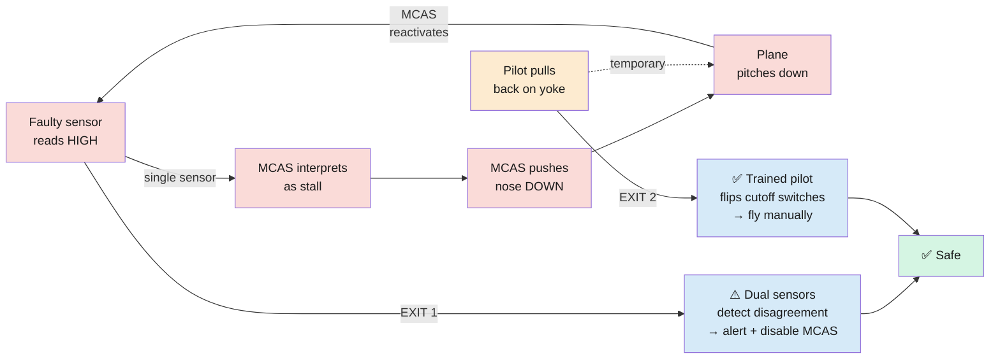
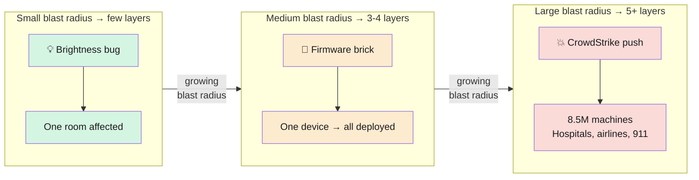
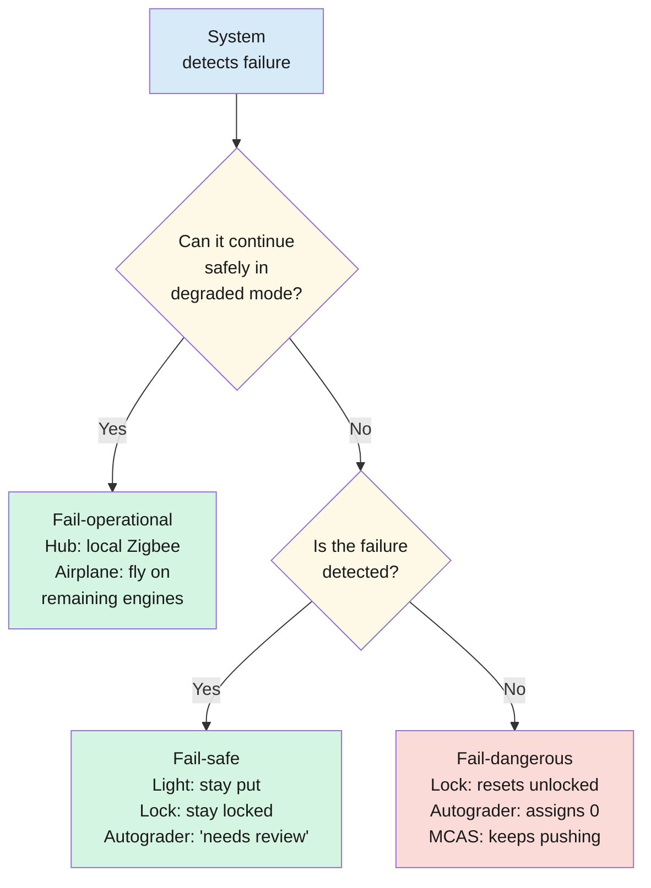
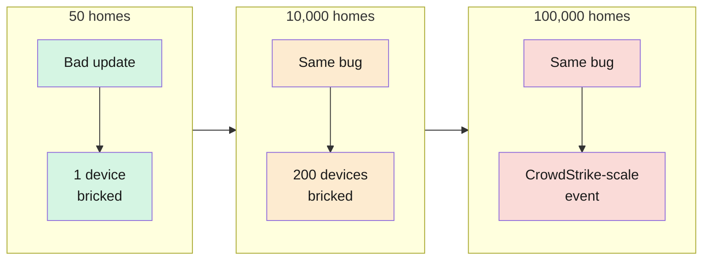

import RevealJS, { Slide } from '@site/src/components/RevealJS';
import Img from '@site/src/components/Img';

<RevealJS transition="slide">

{/* ============================================ */}
{/* COVER IMAGE */}
{/* ============================================ */}

<Slide>
  

<aside className="notes">
**Lecture overview:**
- **Total time:** ~55 minutes
- **Prerequisites:** L31 (Threads, race conditions), L32 (Async, error handling), L33 (Event architecture, consistency), L34 (Performance)
- **Connects to:** L36 (Sustainability), GA1 (error handling, async patterns)

**Structure (~24 slides):**
- Arc 1: Safety vs Reliability (~10 min) — definitions, emergence, indirect safety
- Arc 2: Swiss Cheese Model + Case Studies (~15 min) — Therac-25, Boeing 737 MAX, CrowdStrike, comparison table
- Arc 3: Blast Radius + Fail-Safe (~10 min) — blast radius, Citicorp Tower, fail-safe vs fail-operational, defense budget
- Arc 4: Apply the Model (~8 min) — firmware, door lock, autograder scenarios
- Arc 5: Course Concepts as Safety + Looking Ahead (~12 min) — comprehension check, reframing table, safety debt, who profits, looking ahead

**Running example:** SceneItAll + Pawtograder. IoT safety scenarios (door locks, firmware updates) and autograder failure modes students live inside daily.

> **Transition:** Let's start with the learning objectives...
</aside>

</Slide>

{/* ============================================ */}
{/* TITLE SLIDE */}
{/* ============================================ */}

<Slide>

# CS 3100: Program Design and Implementation II

## Lecture 35: Safety and Reliability

  &copy;2026 Jonathan Bell, CC-BY-SA

<aside className="notes">
**Context from previous lectures:**
- L31: Race conditions and synchronization — the exact bug that killed Therac-25 patients.
- L32: Async error handling — `.exceptionally()` and `.orTimeout()` are safety mechanisms.
- L33: Consistency models, idempotency — safety-critical for door locks, firmware updates.
- L34: Performance — GC as a safety-performance tradeoff. "Therac-25 replaced hardware interlocks for the same reason."
- Today: reframe everything students have learned as safety mechanisms, then analyze what happens when layers are removed.

> **Transition:** Here's what you'll be able to do after today...
</aside>

</Slide>

{/* ============================================ */}
{/* LEARNING OBJECTIVES */}
{/* ============================================ */}

<Slide>

## Learning Objectives

After this lecture, you will be able to:

<ol style={{fontSize: '0.75em', textAlign: 'left'}}>
  <li>Distinguish safety from reliability</li>
  <li>Apply the Swiss cheese model to analyze layered defenses</li>
  <li>Analyze blast radius and fail-safe design</li>
  <li>Recognize prior course concepts as safety mechanisms</li>
  <li>Evaluate safety trade-offs against cost, complexity, and performance, and explain why professional judgment is currently the primary safety mechanism in most software</li>
</ol>

<aside className="notes">
**Time allocation:**
- Objective 1: Safety vs reliability definitions, emergence, indirect effects (~10 min)
- Objective 2: Swiss cheese model + three case studies (~15 min)
- Objective 3: Blast radius, Citicorp Tower, fail-safe vs fail-operational (~10 min)
- Objective 4: Scenarios, reframing table, safety debt (~15 min)
- Objective 5: Safety trade-offs, Citicorp → Parnas regulation argument, professional responsibility (~5 min)

**Key pedagogical goal:** Students should leave understanding that every tool they've learned this semester (synchronized, .exceptionally(), circuit breakers, staged rollouts) is a safety mechanism — and that safety always costs something (performance, complexity, money, time). The question is not "can we afford safety?" but "can we afford the consequences of not having it?" And until software is regulated like bridges, they are the last line of defense.

> **Transition:** Let's bridge from L34...
</aside>

</Slide>

{/* ============================================ */}
{/* ARC 1: SAFETY ≠ RELIABILITY (~10 min) */}
{/* ============================================ */}

<Slide>

## What Happens When Your Software Doesn't Work — and Who Gets Hurt?

You've built software that's correct, testable, maintainable, performant.

**New question:** what happens when it **fails?**

| Concept | Where you learned it | Its safety role |
|---------|---------------------|----------------|
| Race condition prevention | L31 | Prevents state corruption |
| Async error handling | L32 | Makes failures visible |
| Consistency models | L33 | Prevents stale-data operations |
| Profiling + GC | L34 | Safety-performance tradeoff |

These aren't just performance or reliability tools. They are <strong>safety mechanisms.</strong>

<aside className="notes">
**Bridge from L34:** Monday we talked about performance — where time goes, how to measure, how architectural decisions set the ceiling. We ended with GC: automatic memory management trades performance for safety. Today we pull that thread: what happens when the safety mechanism you removed for performance is the one that would have prevented harm?

**The shift:** All semester we've asked "does it work?" Today: "what happens when it doesn't, and who gets hurt?" This reframes every tool they've learned.

> **Transition:** Let's define our terms precisely...
</aside>

</Slide>

<Slide>

## Reliable, Available, and Safe Are Three Different Things

**Reliable**

Does what it's supposed to do, consistently.

*Measure:* error rates, MTBF

*SceneItAll:* activates scenes correctly 99.99% of the time

**Available**

Accessible when users need it.

*Measure:* "nines" — 99.9% = 8.7 hrs downtime/yr

*GitHub:* multiple major outages Feb–Mar 2026 (auth DB overload, Actions failover failures)

**Safe**

Avoids harm, **even when it fails.**

*Measure:* incident severity — did anyone get hurt?

*Key:* a property of the **failure mode**, not the happy path

- **Reliable and unsafe:** A medical device delivers correct doses 99.99% of the time — but its failure mode is lethal. Reliable? Extremely. Safe? Not if one failure kills a patient.
- **Safe but unreliable:** Hub crashes frequently but preserves device state and fails to safe defaults.

<aside className="notes">
**The critical insight is the medical device example.** Students' intuition is that reliable = safe. Keep it generic here — the Therac-25 case study comes later and will hit harder if students haven't already heard the punchline. For now, just establish the principle: reliability measures how often something works, safety measures what happens when it doesn't.

**GitHub availability (Feb–Mar 2026):** Three major outages — Feb 2, Feb 9, Mar 5. Root causes: a tenfold spike in read traffic from client apps overloaded the auth database (a cache TTL reduced from 12 to 2 hours made it worse), and Actions failover exposed latent Redis config issues. GitHub is now migrating to Azure (12.5% → 50% by July) and decomposing the monolith. Classic architectural coupling: localized failures cascaded across services.

**The hub example:** If SceneItAll's hub crashes every day but always preserves device state, keeps doors locked, and keeps lights on, it's unreliable but relatively safe. Annoying, but not dangerous.

> **Transition:** If safety isn't a feature, where does it come from?
</aside>

</Slide>

<Slide>

## Safety Emerges from Design — You Can't Add It Later

| Stage | What happens | SceneItAll example | Cost of fixing |
|-------|-------------|-------------------|----------------|
| **Launch** | Happy paths work; few users | 50 beta homes, manual firmware pushes | Moderate |
| **Growth** | Untested interactions surface | 10,000 homes; scene activations during firmware updates | Migration |
| **Scale** | Edge cases hit production | Firmware bug bricks 200 devices in one push | Migration + legal + replacements |
| **Maturity** | Regulatory requirements change | UL/CE requires hardware watchdog timer | All of the above + certification |

The cost of addressing safety grows <strong>exponentially</strong> at each stage. An atomic firmware write on day one is moderate effort. After a bricking incident, it's a migration <em>plus</em> legal costs, customer replacements, and reputational damage.

<aside className="notes">
**L18 callback:** In L18 (Thinking Architecturally) we introduced quality attributes as architectural drivers. Safety is a quality attribute — like performance, scalability, and changeability. It doesn't get added as a feature; it emerges from (or fails to emerge from) architectural decisions made early and maintained throughout.

**The exponential cost curve is the key takeaway here.** Students tend to think "we'll add safety later" — this slide shows why that's prohibitively expensive. The same atomic write mechanism that costs a few days of engineering at launch costs months of migration at scale.

> **Transition:** Safety also shows up in places you don't expect...
</aside>

</Slide>

<Slide>

## Software Affects Safety in Ways You Don't Expect

**Direct safety**

Door lock bug lets an unauthorized person enter. Software controls a physical actuator; failure causes immediate harm.

Medical devices, autonomous vehicles, industrial control systems.

**Indirect safety**

Usage analytics reveal when a home is occupied. Not a safety concern at 50 homes — a burglary risk at 100,000.

Recommendation algorithms optimize for engagement, select for outrage. Missing-stakeholder problem (L9).

**AI connection:** You use Claude Code to generate a door lock controller. If you paste it without careful review, you've removed a Swiss cheese layer — **human code review**. Replacing human judgment with automation is cheaper and faster, but if the automation has bugs that the human would have caught, you've traded a defense for a vulnerability. **You are responsible for the output.**

<aside className="notes">
**The indirect safety examples are the ones students don't see coming.** Direct safety is intuitive — bugs in medical devices cause harm. Indirect safety requires thinking about stakeholders who aren't your direct users.

**L9 callback:** In L9 (Requirements) we discussed three dimensions of requirements risk. Indirect safety hazards are what happens when the understanding dimension fails — when we don't understand who our stakeholders are or how our system affects them.

**L24 callback:** In L24 (Usability) we introduced slips, lapses, and mistakes. The same error types apply at larger scale — the slip that makes a user click the wrong button can make a developer deploy untested code to production (Knight Capital's $440M software error).

**AI safety point:** This is not abstract. Students use Claude Code daily. If they generate safety-critical code and can't evaluate the output, they've removed the human review layer. The Parnas quote later in the lecture formalizes this: the people who use AI tools have a duty to understand the specification and verify the output.

> **Transition:** Let's practice the distinction before we move on...
</aside>

</Slide>

<Slide>

## Classify This System: Safe, Reliable, or Both?

| System | Reliable? | Safe? | Why? |
|--------|-----------|-------|------|
| Recommendation algorithm delivers consistent suggestions 99.99% of the time — but optimizes for outrage, harming mental health at scale | ✅ | ❓ | |
| Password manager crashes randomly, losing sessions — but on crash, locks all stored passwords until restart | ❓ | ❓ | |
| CrowdStrike Falcon worked correctly 99.999% of the time — but its failure mode bricked 8.5M machines simultaneously | ❓ | ❓ | |
| SceneItAll hub crashes daily — but always preserves device state and keeps doors locked | ❓ | ❓ | |

Discuss with a neighbor. Then we'll share answers.

<aside className="notes">
**This is a think-pair-share exercise.** Give students 90 seconds to classify, then cold-call or ask for volunteers.

**Answers:**
1. **Reliable but unsafe.** It works consistently (reliable) but causes harm at scale (unsafe). The harm is indirect — missing-stakeholder problem from L9.
2. **Unreliable but safe.** It crashes (unreliable) but its failure mode protects user data (safe). Fail-safe design.
3. **Reliable but unsafe.** It worked 99.999% of the time (extremely reliable) but its failure mode was catastrophic (unsafe). This is the Therac-25 pattern.
4. **Unreliable but safe.** It crashes daily (unreliable) but preserves state and fails to safe defaults (safe). Annoying but not dangerous.

**Key teaching moment:** Students who get these right understand LO1. Students who struggle — especially on #1 (indirect safety) — need the indirect safety examples from the previous slide reinforced.

> **Transition:** Now let's name the framework for analyzing these layered defenses...
</aside>

</Slide>

{/* ============================================ */}
{/* ARC 2: SWISS CHEESE MODEL + CASE STUDIES (~15 min) */}
{/* ============================================ */}

<Slide>

## The Swiss Cheese Model: Harm Requires Aligned Holes

**Recall:** You've been building Swiss cheese layers all semester:

| Layer | Where |
|-------|-------|
| Preconditions reject bad inputs | L4 (Contracts) |
| Tests catch bugs before deployment | L15 (Testing) |
| Hex architecture isolates domain from infrastructure | L16 (Testing II) |
| Resilience patterns handle network failures | L20 (Networks) |
| Idempotent consumers handle duplicates | L33 (Event Architecture) |

A single layer with holes is not dangerous on its own. The problem is when someone <strong>removes a layer entirely</strong>, or when holes grow larger without anyone noticing.

<aside className="notes">
**James Reason's Swiss cheese model** is the most useful framework for thinking about safety in complex systems. It comes from aviation and healthcare safety research.

**The key insight for students:** They have been building Swiss cheese layers all semester without knowing it. Preconditions (L4), tests (L15), hex architecture (L16), resilience patterns (L20), idempotent consumers (L33) — each one is a defensive layer with its own holes. The system is safe as long as holes don't align.

**What makes holes align:** Removing a layer entirely (Therac-25 removed hardware interlocks). Weakening a layer (Boeing minimized pilot training). Adding a new hole without adding a compensating layer (CrowdStrike bypassed staged rollout for content updates).

> **Transition:** Let's see what happens when layers are removed. First case study: a race condition killed six patients...
</aside>

</Slide>

<Slide>

## Therac-25: A Race Condition Killed Six Patients

**1985-1987.** Earlier model (Therac-20) had **hardware interlocks** — physical mechanisms preventing lethal doses regardless of software. Therac-25 replaced them with software. The software had **race conditions** (L31).

| Layer | Defense | Hole |
|-------|---------|------|
| **Hardware interlocks** | Physical mechanism prevents lethal dose | **Removed entirely** in Therac-25 |
| **Software safety checks** | Software validates beam energy before firing | Race condition allowed high-energy beam in electron mode, masked in prior machines by hardware interlock |
| **Operator training** | Operators trained to recognize error codes | Operators learned to dismiss frequent, cryptic messages |
| **Incident reporting** | Operators report anomalies to manufacturer | Manufacturer dismissed reports: "software is thoroughly tested" |

All remaining holes aligned. Lethal radiation reached patients.

<aside className="notes">
**This is the most important case study in software safety.** The Therac-25 killed at least six patients and seriously injured others. The root cause was a race condition — the exact same kind of bug from L31.

**LO4 callback:** The hardware interlock is the mechanical equivalent of L31's `synchronized` — a primitive that prevents dangerous interleaving. Removing it is like removing the lock from SceneItAll's door controller. The software replacement was faster, cheaper, lighter — and it introduced race conditions the hardware couldn't have.

**The operator training hole is subtle:** Operators saw cryptic error messages so frequently that they learned to dismiss them. This is the same usability failure from L24 — when error messages are meaningless, users learn to ignore them. In this case, ignoring them was lethal.

**The manufacturer's response** is the incident reporting hole: "the software is thoroughly tested" was their answer to every report. They had removed the hardware layer AND refused to acknowledge the software layer had holes.

> **Transition:** Same pattern, different decade...
</aside>

</Slide>

<Slide>

## Boeing 737 MAX: A Single Sensor, No Pilot Training

**2018-2019. 346 killed.** New engines changed the plane's aerodynamics. Instead of redesigning the airframe, Boeing added **MCAS** — software to push the nose down. MCAS relied on a **single** angle-of-attack sensor.

| Layer | Defense | Hole |
|-------|---------|------|
| **Airframe design** | Aerodynamic stability without software | **Replaced** — MCAS compensates in software |
| **Sensor redundancy** | Dual sensors with disagree indicator | **Optional upgrade** — not on crashed aircraft |
| **Pilot training** | Pilots trained to recognize and override MCAS | **Minimized** — Boeing marketed "no retraining needed" |
| **Pilot override** | Pilots can disable automation and fly manually | Pilots didn't know MCAS existed; couldn't diagnose failure |

All holes aligned. MCAS pushed the nose down; pilots couldn't override; planes crashed.

<aside className="notes">
**The crucial detail:** Boeing offered dual-sensor configuration as an **optional upgrade**. Airlines that paid extra got redundancy. Airlines that didn't got a single point of failure. Both crashed aircraft — Lion Air Flight 610 and Ethiopian Airlines Flight 302 — had the basic single-sensor configuration.

**LO4 callback:** MCAS failed to implement a circuit breaker (L20). A proper circuit breaker would have stopped pushing the nose down once sensor data was inconsistent — "if the angle-of-attack reading disagrees with other instruments, stop trusting it." Instead, MCAS kept firing.

**The marketing angle matters:** Boeing marketed "no retraining needed" as a feature, not a risk. Airlines could upgrade from 737 NG to 737 MAX without expensive pilot retraining. This removed the pilot training Swiss cheese layer — pilots literally didn't know the system existed.

**This is safety as a premium feature.** We'll come back to the distributional question — who profits, who bears risk — in the wrap-up.

> **Transition:** Let's see why pilots couldn't escape...
</aside>

</Slide>

<Slide>

## The MCAS Feedback Loop: Where Are the Exits?

Two exits existed. Boeing made **Exit 1** an optional upgrade and **Exit 2** unnecessary by marketing "no retraining needed." Both crashed aircraft had neither exit.

<aside className="notes">
**The exits are the key teaching point.** The loop IS escapable — trained pilots on the 737 NG knew how to disable the trim system (cutoff switches on the center pedestal). But Boeing marketed "no retraining needed" for the MAX, so pilots didn't know MCAS existed, let alone how to disable it.

**Exit 1 (dual sensors):** If both angle-of-attack sensors are installed and they disagree, the system alerts the pilot and disables MCAS. This was an optional upgrade. Airlines that paid got the exit; airlines that didn't were stuck in the loop.

**Exit 2 (pilot training):** A trained pilot recognizes the nose-down behavior as a trim runaway, reaches for the cutoff switches, and flies manually. This requires knowing MCAS exists. Boeing's "no retraining" marketing removed this exit.

**L20 callback:** Exit 1 is a circuit breaker. Exit 2 is a human override. Both are Swiss cheese layers. Both were available. Both were removed for cost/marketing reasons. The loop is not inherently unescapable — it became unescapable because two exits were sold away.

> **Transition:** One more case study — this one from July 2024...
</aside>

</Slide>

<Slide>

## CrowdStrike Falcon: 8.5 Million Machines, No Rollback

**July 19, 2024.** Kernel driver update with null pointer read caused a boot loop on **8.5 million Windows machines** simultaneously. Airlines, hospitals, 911 systems went down. **$5B+ in losses.**

**Key failure:** "Content updates" bypassed the staged rollout required for "sensor updates." The update went to all 8.5M machines at once. Machines couldn't boot to receive a rollback.

| Layer | Defense | Hole |
|-------|---------|------|
| **Content validation** | Automated testing before distribution | Did not catch the null pointer read |
| **Staged rollout** | Push to 1% first, monitor, expand | **Not used** for "content updates" |
| **Automatic rollback** | Revert if failures spike | Machines couldn't boot to receive rollback |
| **Fail-safe boot** | If driver crashes, boot without it | Driver loads too early — crash prevents recovery |

<aside className="notes">
**Keep this to ~2 minutes.** Students are likely familiar with the CrowdStrike incident. Hit the key points quickly: kernel-level driver, boot loop, no staged rollout for content updates, machines couldn't boot to receive the fix.

**LO4 callback:** Missing staged rollout = missing L33 idempotent-consumer thinking. No atomic write (L31), no circuit breaker (L20). The fix required physically accessing each machine, booting into Safe Mode, and deleting the offending file — manual intervention for every one of 8.5 million computers.

**The scale is the lesson:** This is the SceneItAll firmware update scenario from the lecture notes — but at planetary scale. The blast radius of skipping staged rollout was not "1000 devices" but "every Windows machine in every hospital, airline, and emergency dispatch center running CrowdStrike Falcon."

> **Transition:** Let's put all three side by side...
</aside>

</Slide>

<Slide>

## Three Disasters, One Pattern: Removing Layers Is Removing Safety

| Aspect | Therac-25 | Boeing 737 MAX | CrowdStrike Falcon |
|--------|-----------|----------------|-------------------|
| **What was replaced?** | Hardware interlocks | Airframe redesign + pilot training | Manual security review |
| **Replaced with?** | Software safety checks | MCAS software automation | Automated content update pipeline |
| **Why?** | Cheaper, lighter | Cheaper, faster certification | Speed — security threats need rapid response |
| **Layer removed?** | Hardware interlock layer | Sensor redundancy + training | Staged rollout for content updates |
| **Critical flaw?** | Race conditions | Single point of failure | No rollback path when kernel crashes |
| **Could system recover?** | Yes — operators could restart | No — planes crashed | No — boot loop, manual access required |

**Three questions to ask** when replacing hardware/human judgment with software:
1. What failure modes does **software introduce** that the original didn't have?
2. Is there **redundancy?** What happens when the single sensor/input fails?
3. Can **humans override** the automation when it's wrong?

<aside className="notes">
**This is the synthesis slide.** The three case studies span 40 years (1985-2024) and three different domains (medical devices, aviation, cybersecurity). The pattern is identical: replace a safety mechanism (hardware, human judgment, manual process) with software because it's cheaper/faster, and remove the layer without adding a compensating defense.

**The three questions** are the practical takeaway. When students encounter a design decision that replaces a safety mechanism with software, they should ask these questions. Boeing fails all three: MCAS introduced single-point-of-failure behavior the airframe didn't have, there was no redundancy on the basic configuration, and pilots couldn't override because they didn't know the system existed.

**Distributional preview:** This pattern reveals a distributional question: Boeing sold redundancy as an optional upgrade — cost savings to airlines, risk to passengers. L36 will formalize this: "who profits from a design decision, and who bears the risk?"

> **Transition:** Now let's talk about how much damage a failure can cause...
</aside>

</Slide>

{/* ============================================ */}
{/* ARC 3: BLAST RADIUS + FAIL-SAFE (~10 min) */}
{/* ============================================ */}

<Slide>

## Blast Radius: How Much Breaks When Something Fails?

**Blast radius** = how much is affected when a component fails. L19: monolith = maximum blast radius. L7: low coupling limits it. **Blast radius determines how many Swiss cheese layers you need.**

<aside className="notes">
**Blast radius is the concept that connects everything.** It determines how many Swiss cheese layers a system needs, which consistency model to use, whether you need staged rollouts, whether a human-in-the-loop is required.

**L19 callback:** In L19 (Monoliths) we said monolith deployment is all-or-nothing — a bug in one feature can take down everything. That's blast radius language. Microservices limit blast radius by isolating failures.

**L7 callback:** Low coupling (L7) is a blast radius reducer. When modules are loosely coupled, a failure in authentication doesn't crash the gradebook. High coupling means one bug propagates everywhere.

> **Transition:** What happens when the blast radius is an entire city block?
</aside>

</Slide>

<Slide>

## The Citicorp Tower: When Every Layer Had a Hole

Photo: Andrew Moore, CC BY 4.0

**1978.** A student's question about the unusual column placement prompts structural engineer LeMessurier to investigate quartering winds — **winds hitting the corner at 45°**, which the NYC building code didn't require analyzing. He discovers the building could collapse in a 16-year storm. Hurricane season is approaching.

| Layer | Defense | Hole |
|-------|---------|------|
| **Engineer's design** | Original spec: welded joints | Contractor switched to bolted — cheaper, but weaker in tension |
| **Code compliance** | NYC building code review | Code only required perpendicular wind analysis, not quartering winds |
| **Change review** | Joint substitution should trigger re-analysis | No one recalculated with bolted joints under quartering winds |
| **Professional review** | Peers and inspectors review the design | Nobody questioned the substitution; the student's professor dismissed the column concern entirely |

**Blast radius: a skyscraper in midtown Manhattan.** LeMessurier didn't fix it in secret — he brought in **every stakeholder**: the architect, Citicorp's CEO, an independent structural consultant, NYC's Building Commissioner, the Red Cross, police, the Mayor's Office of Emergency Management. He told the city the whole truth: *"the failure of his own office to perceive and communicate the danger."* City officials **commended him.** Nobody was hurt.

<aside className="notes">
**Source:** Joe Morgenstern, "The Fifty-Nine-Story Crisis," *The New Yorker*, May 29, 1995.

**The student's role:** An unnamed male engineering student in New Jersey called LeMessurier because his professor claimed the columns were in the wrong place (they're at the center of each side, not the corners). LeMessurier explained the design rationale and dismissed the professor's concern. But the conversation stuck — LeMessurier later used the quartering wind question for his Harvard class and realized the building had a serious problem.

**The joint substitution:** The original spec called for *welded* joints on the chevron braces. Bethlehem Steel proposed switching to *bolted* joints, which were cheaper. LeMessurier's New York office (the Ruderman joint venture) approved the change on August 1, 1974. Welded joints make two members "as strong as one"; bolted joints transfer loads differently and are weaker in tension. Nobody recalculated the bolted joints for quartering winds because the code only required perpendicular wind analysis.

**The 40% figure:** Quartering winds increased the strain on the chevron braces by 40% compared to perpendicular winds. Due to leverage effects, this translated to a 160% increase in force on the bolts. Combined with the weaker bolted joints, the building could fail in a 16-year storm.

**The stakeholder chain — emphasize this:** LeMessurier didn't just quietly fix it. He involved:
- His own liability insurers (Northbrook Insurance) — first call
- Lawyers — who initially wondered "if he was nutty"
- Leslie Robertson — independent structural consultant (World Trade Center), who insisted on evacuation planning
- Hugh Stubbins — the architect ("He winced... but he's a man of enormous resilience")
- Citicorp executives John Reed and Walter Wriston — who immediately committed resources
- Karl Koch Erecting — contractor, had steel plate on hand
- MTS Systems — 24/7 maintenance of the tuned mass damper
- Arthur Nusbaum / HRH Construction — original contractor, provided welding drawings
- NYC Acting Building Commissioner + 9 senior city officials — LeMessurier told "the whole truth" for over an hour
- American Red Cross — planned to mobilize 1,200-2,000 workers for possible evacuation
- Police + Mayor's Office of Emergency Management — evacuation plans for the building and surrounding area
- Brookhaven National Laboratory + independent weather forecasters — wind predictions 4x daily

City officials "commended LeMessurier for his courage and candor." As project manager Nusbaum put it: "It started with a guy who stood up and said, 'I got a problem, I made the problem, let's fix the problem.' If you're gonna kill a guy like LeMessurier, why should anybody ever talk?"

**Contrast with Boeing:** Boeing minimized pilot training, made sensor redundancy optional, and didn't tell pilots MCAS existed. LeMessurier told everyone — including the people whose building he'd endangered. The blast radius demanded it, and the response proved that disclosure is more effective than concealment.

**Newspaper strike:** Emergency welding was completed in October 1978, several weeks before most NYC newspapers resumed publication. No stories appeared about the crisis. The building was rebuilt to withstand a 700-year storm — "one of the safest structures ever built and rebuilt by the hand of man."

**The Parnas connection:** David Parnas (who invented information hiding from L6) said at ICSE 2025: "It's not the AI that's liable. It's either the people who made it or the people who use it or both." Same L4 contracts framework applied to professional accountability.

> **Transition:** LeMessurier was a licensed professional engineer. What about us?
</aside>

</Slide>

<Slide>

## From Citicorp to Code: Who Regulates Software?

LeMessurier was a **licensed professional engineer.** Building codes. Inspections. Liability. Professional boards that can revoke your license.

**Most software has none of that.** Avionics (DO-178C) and medical devices (FDA) are regulated. Everything else — banking software, social media, autograders, smart home hubs — is governed by... your personal judgment.

> "It's not the AI that's liable. It's either the people who made it or the people who use it or both."
>
> — David Parnas, ICSE 2025 Keynote

Parnas argues we should **regulate critical software the same way we regulate bridges** — licensed engineers, accredited education, independent testing, required specifications. Not because it's "AI" or "not AI," but because **the amount of regulation should depend on how important the answer is.**

Until that happens, the last Swiss cheese layer is **you.** Your professional judgment. Your willingness to say *"I got a problem, I made the problem, let's fix the problem."*

<aside className="notes">
**The gap:** LeMessurier operated in a regulated profession — building codes, inspections, professional licensing, liability insurance. When he disclosed the Citicorp flaw, city officials had authority to review his work, commend or sanction him, and require specific remediation. Software engineers have almost none of this infrastructure.

**What IS regulated:** Avionics software must comply with DO-178C (certification levels A-E based on criticality). Medical device software must go through FDA 510(k) or PMA review. These are the exceptions, not the rule.

**What is NOT regulated:** Banking software, social media algorithms, autonomous vehicle software (in most states), smart home firmware, autograders, hiring algorithms. There are no professional licensing requirements for writing software that controls door locks, manages student grades, or recommends content to billions of users.

**Parnas's argument (ICSE 2025):** Don't regulate "AI" — nobody can define what AI is, so anyone can say "I'm not doing AI, I'm just doing engineering." Instead, regulate *critical software* — any software where the answer matters. The amount of regulation should scale with how important the answer is, not with what technique was used to build it.

Key Parnas quotes:
- "It's not the AI that's liable. It's either the people who made it or the people who use it or both."
- "The people who made it have a duty to have a specification for it and to make sure it meets that specification."
- "We should be regulating who can write critical software. When it comes to building bridges, you have to be a licensed engineer."
- "If the answers a system gives don't matter, then we don't need to regulate it. But if it does matter, then we must regulate it."
- "The amount of regulation doesn't depend on what we call it or how it's built. It depends on how important the answer is."

**The personal responsibility framing:** Until software is regulated like other engineering disciplines, the only safety mechanism is individual professional judgment. Will you sleep OK at night? Will you get fired? Those aren't great safety mechanisms — they depend on the individual developer's conscience and their employer's culture. That's why Parnas argues for regulation: personal virtue is not a scalable safety mechanism. But right now, it's what we have.

**Connection to the course:** This is why we teach specifications (L4), testing (L15), safety analysis (today), and sustainability (L36). Not because a regulator requires it, but because the blast radius of your software demands it — and right now, you are the only person who will enforce those standards.

> **Transition:** Let's formalize the relationship between blast radius and defense layers...
</aside>

</Slide>

<Slide>

## Blast Radius Determines Your Defense Budget

| System | Blast radius | Layers needed |
|--------|-------------|---------------|
| SceneItAll brightness control | One room's lights are wrong | Error handling + UI feedback |
| SceneItAll door lock | Unauthorized entry | Strong consistency (L33) + redundant sensors + human override |

Same IoT hub, same codebase, same protocol — but the <strong>blast radius</strong> demands different engineering.

<aside className="notes">
**Start small.** Brightness control: if it's wrong, one room has the wrong light level. Annoying but harmless. Error handling and UI feedback ("shade didn't respond") are sufficient.

Door lock: if it's wrong, someone can enter your home. Same hub, same code — but now you need strong consistency (L33), redundant sensors, AND a physical key override. The blast radius jumped from "annoyance" to "unauthorized entry."

> **Transition:** Now let's expand the table...
</aside>

</Slide>

<Slide>

## Blast Radius Determines Your Defense Budget

| System | Blast radius | Layers needed |
|--------|-------------|---------------|
| SceneItAll brightness control | One room's lights are wrong | Error handling + UI feedback |
| SceneItAll door lock | Unauthorized entry | Strong consistency (L33) + redundant sensors + human override |
| SceneItAll firmware update | Device bricked, needs replacement | Rollback + staged rollout + integrity verification |
| Pawtograder gradebook | Every student's GPA in the course | Audit trails + human-in-the-loop + fail-safe defaults |

Firmware bricking is expensive. Gradebook corruption affects <strong>every student's GPA.</strong> More blast radius → more layers.

<aside className="notes">
**Add firmware and Pawtograder.** Firmware update: bricking a device means a physical replacement. That's expensive but bounded to one device (unless you skip staged rollout — then it's CrowdStrike). Needs rollback, staged rollout, and integrity checks.

Pawtograder gradebook: the blast radius is every student's GPA for the course. That's why we have audit trails (just saw this with the accidental overwrite), human-in-the-loop (TAs can override), and fail-safe defaults ("internal error" not "zero").

> **Transition:** And at the extreme end...
</aside>

</Slide>

<Slide>

## Blast Radius Determines Your Defense Budget

| System | Blast radius | Layers needed |
|--------|-------------|---------------|
| SceneItAll brightness control | One room's lights are wrong | Error handling + UI feedback |
| SceneItAll door lock | Unauthorized entry | Strong consistency + redundant sensors + human override |
| SceneItAll firmware update | Device bricked, needs replacement | Rollback + staged rollout + integrity verification |
| Pawtograder gradebook | Every student's GPA in the course | Audit trails + human-in-the-loop + fail-safe defaults |
| Citicorp Tower | 10 blocks of Manhattan | Physical redundancy + independent verification + immediate remediation |
| Boeing 737 MAX MCAS | Everyone on the aircraft | Sensor redundancy + pilot training + override capability |

From "one room" to "everyone on the aircraft" — the <strong>engineering investment scales with the blast radius.</strong>

<aside className="notes">
**Full table revealed.** Walk through the bottom two rows — students have already seen these case studies, so the layers needed should feel familiar.

**Citicorp Tower:** Blast radius = 10 blocks of Manhattan. LeMessurier's disclosure was proportional to the blast radius — you don't quietly fix a skyscraper that could fall.

**Boeing MCAS:** Blast radius = every passenger. The layers needed (redundancy + training + override) are exactly the layers Boeing removed or made optional. The table makes the mismatch visible — Boeing's actual defense budget was far below what the blast radius demanded.

**The key takeaway:** The brightness control and MCAS are on opposite ends of this table, but the principle is the same. Blast radius determines how many Swiss cheese layers you need.

> **Transition:** What should a system do when it fails?
</aside>

</Slide>

<Slide>

## Fail-Safe vs. Fail-Operational vs. Fail-Dangerous

| Failure | Fail-safe | Fail-dangerous |
|---------|----------|---------------|
| Firmware mid-write | Roll back | Partial write (bricked) |
| Autograder crash | "Needs review" | Assign zero |
| Door lock disconnect | Stay locked | Reset unlocked |
| Scene: 1/15 fails | "14/15 updated" | "Success!" |

Boeing MCAS was <strong>fail-dangerous</strong> — it kept pushing the nose down.

<aside className="notes">
**The decision tree makes the three modes visual.** Walk through it: system detects failure → can it continue safely? (fail-operational) → if not, was the failure detected? (fail-safe vs fail-dangerous).

**Fail-safe = when in doubt, do nothing harmful.** The light stays where it is. The firmware rolls back. The autograder reports "internal error."

**Fail-operational = continue in degraded mode.** Reserved for systems that cannot afford to stop — airplanes, pacemakers, nuclear reactor cooling.

**Fail-dangerous = the worst case.** MCAS didn't stop (not fail-safe), didn't alert pilots (not fail-operational) — it kept pushing the nose down.

> **Transition:** Now let's practice — you design the fail-safe behavior...
</aside>

</Slide>

<Slide>

## Design the Recovery: What Should This System Do When It Fails?

For each scenario, decide: **fail-safe or fail-operational?** Then design the specific behavior.

| Scenario | Fail-safe would be... | Fail-operational would be... | Which is right? |
|----------|----------------------|----------------------------|----------------|
| Smart thermostat loses internet mid-winter | | | |
| Autograder container runs out of memory | | | |
| Door lock loses Zigbee connection | | | |
| Scene activation: one shade doesn't respond | | | |

Think about the <strong>blast radius</strong> of each. That determines which mode you need.

<aside className="notes">
**Exercise: 2 minutes, then discuss.**

**Expected answers:**
1. **Thermostat loses internet:** Fail-operational — continue with last known settings locally. You can't "do nothing" in winter (pipes freeze). Fail-safe would be "heat to safe minimum." Fail-dangerous would be "turn off heat."
2. **Autograder OOM:** Fail-safe — report "internal error, needs review." Cannot continue grading with corrupted state. Fail-dangerous is assigning zero.
3. **Door lock loses connection:** Fail-safe — stay in current state (locked or unlocked). The physical key is the override layer. Fail-dangerous would be unlocking.
4. **Scene shade:** Fail-operational — apply 14/15 and report the failure. One unresponsive shade isn't worth aborting the whole scene. Fail-dangerous is reporting "success."

**Key insight:** The thermostat is the tricky one. Most systems should be fail-safe, but systems where "do nothing" IS dangerous (heating in winter, airplane engines, hospital ventilators) need fail-operational design. Blast radius drives the choice.

> **Transition:** Now let's apply the full model to systems you're building...
</aside>

</Slide>

{/* ============================================ */}
{/* ARC 4: APPLY THE MODEL (~8 min) */}
{/* ============================================ */}

<Slide>

## Scenario: Firmware Update Bricks a Device

SceneItAll pushes a firmware update to a smart light. Halfway through, the Zigbee connection drops.

| Layer | Defense | Hole? |
|-------|---------|-------|
| **Integrity check** | Verify firmware checksum before applying | Catches corrupt downloads |
| **Atomic write** | Write to staging partition, swap after verification | Prevents partial writes from bricking |
| **Rollback** | If new firmware fails to boot, revert to previous | Catches bad firmware that passes checksum |
| **Staged rollout** | Update 10% first, monitor, then expand | Limits blast radius to 10% |
| **Dead letter queue** | Failed updates queue for human review (L33) | Nothing silently lost |

Remove atomic write AND rollback? <strong>Bricked.</strong> Skip staged rollout and push to all 1,000 devices? <strong>CrowdStrike at home scale.</strong>

<aside className="notes">
**Transition to this arc:** "The case studies are historical. Now let's analyze systems you're building."

**Walk through the table:** Each layer catches a different failure. Integrity check catches corrupt data. Atomic write prevents the half-written state. Rollback recovers from bad firmware. Staged rollout limits blast radius. Dead letter queue ensures nothing is silently lost.

**The key exercise:** Remove any one layer and the failure mode gets worse, but the system survives. Remove two adjacent layers (atomic write + rollback) and the device is bricked. Skip staged rollout and the blast radius goes from one device to every device.

**CrowdStrike connection:** This is exactly the CrowdStrike incident at home scale. CrowdStrike skipped staged rollout for "content updates" and 8.5 million machines entered boot loops simultaneously.

> **Transition:** Now a safety-critical scenario...
</aside>

</Slide>

<Slide>

## Scenario: Race Condition on a Door Lock

Two users send conflicting commands to the same smart lock simultaneously — one locks, one unlocks. Same L31 race condition, but with **safety-critical consequences.**

| Layer | Defense | Hole? |
|-------|---------|-------|
| **Sequential consistency** | Lock commands use strong consistency (L33) | Prevents stale lock state |
| **Atomic operations** | `synchronized` on the lock device — no interleaving | Prevents mixed state |
| **Audit trail** | Every lock/unlock logged with timestamp and user | Accountability after the fact |
| **Physical override** | Physical key always works regardless of software | Human can always recover |

Eventual consistency is fine for brightness — a roommate seeing 100% for 5 seconds is harmless. For a door lock, it's not. <strong>Blast radius drives the consistency model choice.</strong>

<aside className="notes">
**This scenario connects directly to L31 and L33.** In L31, Alice and Bob activated different scenes simultaneously — the room ended up in a mixed state. Annoying but harmless. Here the same race condition has safety consequences: the lock might show "locked" when it's actually unlocked.

**The consistency model choice is driven by blast radius.** For brightness controls, eventual consistency is fine — a roommate seeing 100% brightness for 5 seconds before it updates to 30% is harmless. For a door lock, stale data means someone thinks the door is locked when it isn't. That's unauthorized entry.

**Physical override is the non-software layer.** The physical key always works regardless of software state. This is analogous to Therac-25's hardware interlocks — a layer that software bugs cannot compromise.

> **Transition:** One more scenario — the one closest to your daily experience...
</aside>

</Slide>

<Slide>

## Scenario: Pawtograder Autograder Crashes Mid-Run

The autograder crashes mid-run — out of memory, network timeout, or a bug in the grading script. What grade does the student see?

| Layer | Defense | Hole? |
|-------|---------|-------|
| **Error classification** | Distinguish "student tests failed" from "grader crashed" | If both produce exit code 1, they're conflated |
| **Fail-safe default** | Infrastructure failure = "internal error, needs review" | Only works if failure is classified correctly |
| **Retry** | Automatically retry infrastructure failures once | Helps transient failures; not deterministic crashes |
| **Audit trail** | Log every run with exit code, stderr, timing | Enables after-the-fact investigation |
| **Student notification** | "Your submission is being re-graded" vs "0/100" | "0/100" with no explanation is fail-dangerous |

"Internal error, needs manual review" is <strong>fail-safe.</strong> Silently assigning zero is <strong>fail-dangerous.</strong>

<aside className="notes">
**This is the closest scenario to students' daily experience.** They use Pawtograder every day. They've seen autograder failures. The question is: when the grader crashes, does the system harm the student or protect them?

**The error classification layer is subtle but critical.** If "student's tests failed" and "grader infrastructure crashed" both produce exit code 1, the system can't distinguish them. A fail-safe default only works if the system knows it's in a failure state. If the classification is wrong, the fail-safe never triggers.

**Blast radius:** One student's grade in the best case. Every student's grade if the bug is systematic (e.g., a dependency update breaks the grading container, and every submission that day gets a 0).

> **Transition:** That was a machine error. But not every safety incident is a software bug...
</aside>

</Slide>

<Slide>

## Pawtograder Gradebook: Audit Trails Catch Human Errors Too

A staff member accidentally updates the wrong gradebook column — **35 students' participation bonus scores overwritten with zeros.** Initial report: "looks like a software bug — grades changed without any submission."

| Layer | What it caught |
|-------|---------------|
| **Audit table** | Logged the exact staff member, timestamp, old values, new values |
| **Student visibility** | Student noticed grade drop within hours, not weeks |
| **Flag mechanism** | Student flagged concern → triggered investigation |
| **Professor audit view** | Confirmed: single bulk update by one staff member, not a software bug |
| **Reversibility** | Old values in audit table → all 200 grades restored in minutes |

L24 callback: this was a **slip** — right intention, wrong column. The audit trail doesn't prevent the slip, but it makes it **detectable, attributable, and reversible.**

<aside className="notes">
**This actually happened.** The initial report looked exactly like a software bug. Without the audit trail, the investigation would have gone into the codebase — wasting hours looking for a bug that didn't exist. The audit trail immediately showed it was a human action, not a software failure.

**The key teaching point:** Audit trails are a Swiss cheese layer that catches BOTH machine errors (autograder crash from the previous slide) AND human errors (accidental overwrite). The previous scenario showed machine failure → fail-safe default. This scenario shows human error → detection + attribution + reversal.

**L24 connection:** In L24 we introduced slips, lapses, and mistakes. This was a slip — the staff member intended to update one column but selected the wrong one. Good usability might have prevented the slip (confirmation dialog, undo). But the audit trail is the safety net regardless.

**Blast radius comparison:** Without audit trail: 200 students' grades wrong, potentially discovered only at end of semester when final grades don't match expectations. With audit trail: same 200 grades affected, detected in hours, reversed in minutes. Same hole in the Swiss cheese, but the audit layer prevented it from becoming harm.

> **Transition:** The gradebook incident was caught because a student knew the flag mechanism existed. What if they hadn't?
</aside>

</Slide>

<Slide>

## The Meta-Slice: Knowing the Defense System Exists

Every Swiss cheese layer assumes someone **knows it's there.** A defense you don't know about is a defense you can't use, maintain, or trigger.

| Case | Who knew the layers? | Outcome |
|------|---------------------|---------|
| **Boeing 737 MAX** | Pilots didn't know MCAS existed | Could not diagnose or override — 346 killed |
| **Citicorp Tower** | LeMessurier told every stakeholder | Each person knew their role — building saved |
| **Pawtograder** (alone) | Student sees 0/100, assumes "I failed" | Never triggers flag mechanism |
| **Pawtograder** (compares notes) | Student discovers classmates also got 0 | Reclassifies as systemic — flags it, triggers investigation |
| **Pawtograder** (grade finalization) | Multiple instructors review all grades before submission | Catches systematic errors even if no student flags them |

**Practical rule:** When you see a surprising result — a 0/100, a mysterious crash, a grade that doesn't match your work — **compare notes before assuming you're the problem.** You might be the person who activates the next defense layer.

<aside className="notes">
**This slide names what's been implicit: knowledge of the defense system is itself a defense layer.**

**The table makes the pattern explicit across three scales:**
- **Boeing:** Pilots were the last human layer, but "no retraining needed" meant they didn't know MCAS existed. You can't override a system you don't know is there.
- **Citicorp:** LeMessurier didn't just fix the building — he told the architect, the CEO, the Building Commissioner, the Red Cross, police, and weather forecasters. Every stakeholder knew what the defenses were and what their role was.
- **Pawtograder (individual vs. collective):** The same 0/100 produces two completely different outcomes depending on whether the student knows they're part of a larger defense system. A student who debugs alone for hours may never discover the autograder crashed. A student who compares notes discovers "everyone got a zero" — that reclassification activates the flag mechanism, the staff investigation, and the fix.
- **Pawtograder (grade finalization):** Even if no student flags an issue, multiple instructors manually review all grades before finalization. This is another meta-slice layer that students may not know about — course staff don't just trust the automated output. But knowing this layer exists doesn't mean students should stay quiet; the earlier a problem is caught, the easier it is to fix.

**Connection to the gradebook scenario (previous slide):** The gradebook incident was caught because a student knew the flag mechanism existed and used it. If they'd assumed "grades are always correct, I must have done something wrong," the overwrite would have gone undetected until the instructor review — costing weeks of unnecessary anxiety.

**This is ~2 minutes.** Show the table, make the Pawtograder point concrete, move on.

> **Transition:** Let's step back and see how everything we've learned this semester connects to safety...
</aside>

</Slide>

{/* ============================================ */}
{/* ARC 5: COURSE CONCEPTS AS SAFETY + LOOKING AHEAD (~12 min) */}
{/* ============================================ */}

<Slide>

## Comprehension Check

Open Poll Everywhere and answer the three questions.

<aside className="notes">
**Poll Q1:** SceneItAll adds a new smart lock feature. The team skips unit tests for the lock controller because "we need to ship by Friday." Which Swiss cheese layer did they remove?
- A. Hardware interlock
- B. **Testing** [CORRECT]
- C. Staged rollout
- D. Fail-safe default

*Discussion: Testing is a Swiss cheese layer. Removing it for schedule pressure is exactly the pattern from the case studies — replacing a safety mechanism because of cost/time pressure.*

**Poll Q2:** A firmware update is pushed to all 5,000 SceneItAll hubs simultaneously. The update has a bug that causes hubs to reboot in a loop. What failed?
- A. The firmware code
- B. The testing process
- C. **The staged rollout — should have pushed to 1% first** [CORRECT]
- D. The user for accepting the update

*Discussion: Blast radius. The code bug is one hole; the missing staged rollout means the blast radius was every hub simultaneously. Both are holes, but the staged rollout would have limited the damage to 50 hubs instead of 5,000.*

**Poll Q3:** Pawtograder's autograder crashes due to an out-of-memory error. The system assigns a grade of 0. This is:
- A. Fail-safe
- B. Fail-operational
- C. **Fail-dangerous** [CORRECT]
- D. A correct result — the student's code caused the crash

*Discussion: Fail-safe would be "internal error, needs review." Assigning 0 for an infrastructure failure is fail-dangerous — the system caused harm instead of stopping safely. The student's code didn't cause the out-of-memory error; the grading infrastructure did.*

*If time permits after Q3 debrief: "In the Pawtograder scenario, what's the difference between one student seeing 0/100 and the whole class seeing 0/100? That's the meta-slice — knowing you're part of a defense system changes how you respond to failure."*

> **Transition:** Now let's connect everything...
</aside>

</Slide>

<Slide>

## You Already Know How to Prevent These Failures

| Safety pattern | Where you learned it | What it prevents |
|---------------|---------------------|-----------------|
| **Contracts & validation** | L4: Specifications | Bad inputs propagating through the system |
| **Information hiding** | L6: Changeability | Unintended dependencies that break silently |
| **Low coupling** | L7: Coupling & Cohesion | Failures cascading across module boundaries |
| **Testing at every scope** | L15-L16: Testing | Bugs reaching production undetected |
| **Timeouts & circuit breakers** | L20: Networks | One slow service taking down the whole system |
| **`synchronized` & atomicity** | L31: Concurrency | Race conditions corrupting shared state |
| **`.exceptionally()` & `.orTimeout()`** | L32: Async | Silent failures hiding unsafe states |
| **Idempotency & staged rollout** | L33: Events | Duplicates causing harm; blast radius of bad deploys |

These aren't exotic safety tools. They're <strong>the patterns you already use</strong> — applied where the blast radius includes human safety.

<aside className="notes">
**This is the LO4 payoff slide — the capstone reframing.** Students have just seen case studies, blast radius, fail-safe design, and applied the model to their own systems. Now the big reveal: you already know these patterns. Every row in this table is something they've practiced in assignments.

**Key insight:** None of these were taught as "safety tools." They were taught for correctness, reliability, and maintainability. But each one is also a Swiss cheese layer. The engineering is identical — what changes is the stakes.

**Engagement:** Cold-call: "Which of these patterns, if applied, would have helped in the Boeing case?" Accept multiple answers — there's no single right one. Contracts (validate sensor consistency), circuit breakers (stop trusting divergent data), testing (test with single-sensor config). The point is that multiple layers would have helped.

**Students should feel empowered, not overwhelmed.** They already know these tools. They've already been doing safety engineering. Today just names what they've been doing and raises the stakes.

> **Transition:** But what happens as a system grows?
</aside>

</Slide>

<Slide>

## Safety Debt Compounds: Same Code, Growing Blast Radius

The **code didn't change.** The **blast radius** did. Safety debt is not the code getting worse — it's the **consequences getting larger** while the same holes remain open.

<aside className="notes">
**Safety debt vs technical debt:** Technical debt is code that becomes harder to maintain over time. Safety debt is different — the code stays the same, but the blast radius grows. The same missing staged rollout that was "fine" at 50 homes is catastrophic at 100,000.

**This is the compound interest of safety failures.** Every day you don't add the staged rollout, the potential blast radius grows. The odds of hitting the hole don't change much, but the consequences do.

**Students building GA1:** Their CookYourBooks app has a small blast radius today (class project, a few users). But the engineering patterns they choose now — error handling, fail-safe defaults, input validation — are the habits they'll carry to systems with real blast radius.

> **Transition:** There's a harder question lurking behind all these case studies...
</aside>

</Slide>

<Slide>

## Who Profits, Who Bears the Risk?

Boeing sold sensor redundancy as an **optional upgrade.** Airlines serving price-sensitive passengers flew with less redundancy.

**Cost savings accrued to Boeing and airlines. Risk fell on passengers who didn't know.**

The same pattern appears in every safety-performance tradeoff:

| Trade-off | Cost of safety | Cost of not having it |
|-----------|---------------|----------------------|
| Strong consistency (slower) | Performance overhead | Lock shows "locked" when unlocked |
| Error handling (more complex) | Code complexity | Silent failures hide unsafe states |
| Staged rollouts (slower) | Deployment speed | CrowdStrike-scale blast radius |
| Redundant sensors (more expensive) | Hardware cost | Single point of failure |

Not "can we afford safety?" but <strong>"can we afford the consequences of not having it?"</strong>

<aside className="notes">
**This slide bridges to L36.** The distributional question — who profits from a design decision, and who bears the risk? — is the core question of sustainability that L36 will formalize.

**L28 connection:** The people who decide not to invest in accessibility are rarely the people excluded by that decision. Same pattern: the people who decide to skip the staged rollout or sell redundancy as optional aren't the ones who suffer when the failure occurs.

**L34 connection:** In L34 we discussed GC as a safety-performance tradeoff. Automatic memory management trades performance (GC pauses) for safety (no use-after-free bugs). The same tradeoff pattern appears throughout: strong consistency is slower but safer, error handling adds complexity but prevents silent failures, staged rollouts are slower but limit blast radius.

**The question to leave students with:** In every case, safety costs something — performance, complexity, money, or time. The question is not "can we afford safety?" but "can we afford the consequences of not having it?" The answer depends on the blast radius.

> **Transition:** Let's look ahead to Thursday...
</aside>

</Slide>

<Slide>

## Looking Ahead

**L36 (Thursday): Sustainability**

We asked "who profits and who bears the risk?" for safety decisions. Thursday we generalize: **sustainability** — the meta-quality attribute that asks whether ALL your quality attributes hold up over time, and for whom.

**GA1 due April 9** — think about error handling in your async chains. What happens when a network call fails? Does your app fail safely or fail dangerously?

Today: what happens when your software fails, and who gets hurt. Thursday: who benefits from your design decisions, who bears the cost, and over what time horizon.

<aside className="notes">
**L36 preview:** Today we asked the safety question — what happens when it fails? Thursday we generalize to the sustainability question — who benefits from your design decisions, who bears the cost, and over what time horizon? Boeing selling redundancy as optional is both a safety failure and a sustainability failure.

**GA1 connection:** Students are finishing CookYourBooks features. The safety concepts from today are directly relevant: error handling in async chains (L32), fail-safe defaults when operations fail, and user notification when something goes wrong.

**The course arc:** L34 (performance) asked "where does time go?" L35 (today) asked "what happens when it fails?" L36 asks "who benefits, who bears cost?" — each lecture widens the lens from technical to human to societal.

> That's it for today. Questions?
</aside>

</Slide>

</RevealJS>
