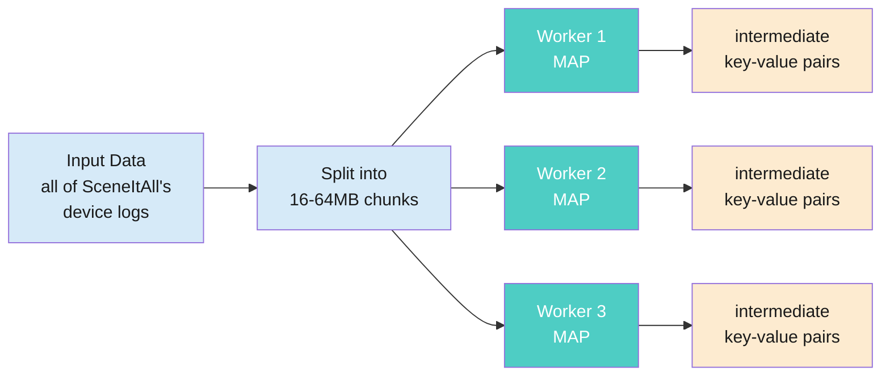
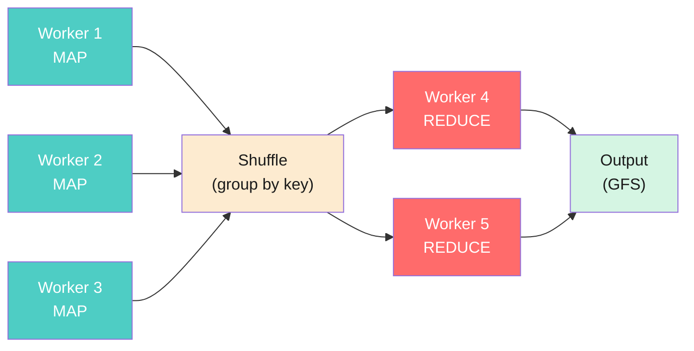
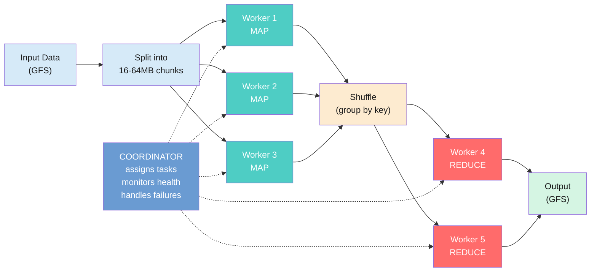
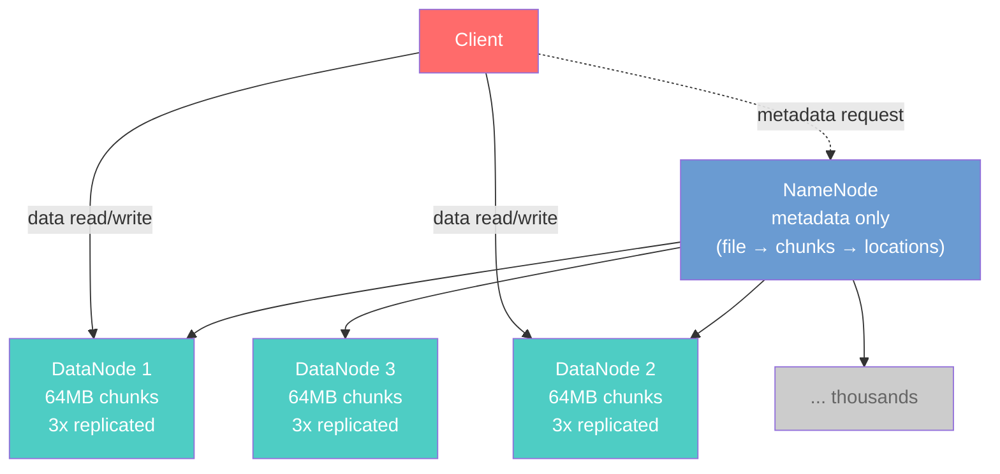

import RevealJS, { Slide } from '@site/src/components/RevealJS';
import Img from '@site/src/components/Img';

<RevealJS transition="slide">

{/* ============================================ */}
{/* COVER IMAGE */}
{/* ============================================ */}

<Slide>
  <Img
    src="/img/lectures/web/l37.png"
    prompt={"Concept: 'Design Case Study: MapReduce' (Program Design and Implementation 2). Pixel art educational illustration, 16:9 aspect ratio. A pixel art museum hallway viewed in perspective, receding from left to right. On both walls hang framed paintings in ornate gold pixel art frames, each depicting a computer science concept as a miniature pixel art scene. Left wall, six paintings from front to back: (1) plaque reads 'L6: Information Hiding' — split scene, left side is a 1972 Cold War setting: a bespectacled professor lectures at a dark green chalkboard labeled HIDDEN INTERNALS in a dim classified-feeling office with floppy disks and an SDI Star Wars poster, muted olive and amber tones. Right side is a bright 2012 Google office in cool blues and whites where a diverse group gathers around a whiteboard diagramming observable behaviors as a tangled red dependency graph, Google logo visible through the window. (2) plaque reads 'L7: Coupling and Cohesion' — dramatic split scene. Left half is a stormy dark gray tangle of twelve interconnected modules linked by chaotic wires with lightning bolts and BREAKING CHANGE warnings radiating outward from a central change, ominous grays and angry reds, 12 of 12 modules affected. Right half is a serene archipelago of isolated green islands on calm blue water, each with a tiny pixel character working independently at a desk, only 2 of 12 modules affected by the same change. (3) plaque reads 'L9: Requirements' — four-quadrant composition. Top-left BEFORE panel shows a solitary architect in a suit at a drafting table in a sterile cool-blue modernist office, designing in isolation. Top-right AFTER panel is warmer, a bearded Christopher Alexander figure in earthy tones collaborating with diverse users around a glowing blue planning board. Bottom panels: a cold institutional campus with confused question-marked figures on the left vs a warm lamp-lit communal living space full of people on the right, labeled The Oregon Experiment 1975. (4) plaque reads 'L16: Testability' — split scene. Left: a frustrated pixel character in a hard hat stands amid a tangled mass of dark brown and maroon dependency vines labeled JDBC, HTTP, FileSystem knotted around a Business Logic hub, a red progress bar reads 47 seconds FAIL. Right: the same character stands confidently beside a clean teal hexagonal Domain diagram with neatly separated adapters (StubPriceService, TestSensorAdapter, InMemoryStorage), a green progress bar reads 0.003 seconds PASS. (5) plaque reads 'L19: Architecture' — a panoramic scene with a lone character standing at a crossroads of diverging paths against a purple-mountain twilight sky. From left to right: a crumbling vine-covered shantytown labeled Big Ball of Mud, a neat three-story office for Layered Architecture, a fortified hexagonal fortress for Hexagonal Architecture, a massive gray stone castle for Monolith, a smaller walled compound for Modular Monolith, and a distant fog-shrouded dragon-guarded frontier labeled Distributed Systems Here Be Dragons. A radar chart inset maps quality attribute tradeoffs. (6) plaque reads 'L20: Networks' — split scene. Left: two relaxed pixel developers sit at desks in a warm cozy office, one types hello() and the other instantly replies Got it in 0.0001 seconds, calm amber tones. Right: the same simple call becomes The Chaotic Journey through seven numbered hazards — ocean crossing over a transatlantic cable, latency gauntlet, packet shredder, eavesdropping spies reading HTTP, a firewall rejecting malware, BGP roulette, and a toll plaza — cooler blues and grays with warning-orange accents, multiple retry arrows. Right wall, four paintings from front to back: (1) plaque reads 'L31: Concurrency' — warm amber and brown kitchen scene. Two alarmed chefs in white hats and red-trimmed uniforms stand on either side of a shared stovetop, both reaching for the same pan of boiling pasta while ingredients scatter across the counter. A glowing cyan Stove Key floats near the wall, contrasting against the warm palette. A digital clock reads 00:00. Frantic and comedic mood. (2) plaque reads 'L33: Events' — nighttime city street in deep navy with warm amber building lights. A large glass community bulletin board glows with a cool cyan border at center, displaying posted notices including Evening scene activated. Four distinct pixel characters surround the board — one posting, one crouching to read, one checking a tablet, one holding a clipboard — each reacting independently to the shared announcements. (3) plaque reads 'L34: Performance' — split scene divided by a central magnifying glass labeled PROFILE over a monitor. Left half is a tangle of warm orange and red wiring connecting frowning lightbulbs, angry monitors, slow clocks, and a crawling snail beneath a red-zoned speedometer labeled SLOW. Right half mirrors the same components in clean teal and cyan wiring with smiling faces, green checkmarks, and a speedometer in the green zone labeled FAST. (4) plaque reads 'L35: Safety' — a space scene against a deep starfield. Five upright slabs of Swiss cheese arranged in a row, each riddled with holes and labeled TESTS, REVIEWS, ROLLOUT, OVERRIDE, MONITORING. A red laser beam enters from the left and threads through aligned holes in the first three warm orange and yellow slabs, striking a skull hazard symbol at center. A green energy burst deflects it at the fourth slab, and the final two cool teal and green slabs block remaining paths. A small astronaut character stands safely on the far right. At the far end of the hallway, all the paintings converge visually into one large exhibit piece: a working MapReduce pipeline diagram glowing with teal light, showing data flowing through map workers into a shuffle stage into reduce workers. A small plaque under the exhibit reads 'Case Study: Map Reduce'. A single pixel art student walks down the hallway toward the exhibit, backpack on, seeing all the pieces come together for the first time. The museum floor is polished dark tile reflecting the teal glow. Warm amber lighting on the paintings, cool teal glow on the MapReduce exhibit at the end. Banner text: 'L37: Design Case Study: MapReduce'. Bottom tagline: 'Every Lecture Led Here.' Bottom text: 'CS 3100: Program Design and Implementation 2'. 8-bit lo-fi pixel art style, clean outlines, retro game aesthetic."}
    alt="Pixel art museum hallway with framed paintings of course concepts on both walls — Information Hiding, Coupling and Cohesion, Requirements, Architecture, Testability, Networks on the left; Concurrency, Events, Performance, Safety on the right — converging at the far end into one large glowing MapReduce pipeline exhibit. A student walks toward it. Tagline: Every Lecture Led Here."
  />

<aside className="notes">
**Lecture overview:**
- **Total time:** ~50 minutes
- **Prerequisites:** L5 (Pure functions), L6 (Information hiding), L7 (Coupling/cohesion), L9 (Requirements), L16 (Hex arch/testability), L20 (Networks), L31 (Concurrency), L33 (Event architecture), L34 (Performance), L35 (Safety/reliability), L36 (Sustainability)
- **Connects to:** L38 (Future of Programming), GA2 (due Thu Apr 16)

**Structure (~25 slides):**
- Arc 1: The Problem + Programming Model (~12 min) — Google's requirements, data/computation scale, file system workload, batching + locality, GFS, MapReduce model (pivot to SceneItAll) + execution
- Arc 2: Design Decisions (~12 min) — single NameNode trade-off, fault tolerance via pure functions (merged), Swiss cheese
- Arc 3: Blast Radius (~8 min) — blast radius analysis by failure type
- Arc 4: Sustainability + What Came After (~12 min) — four dimensions, Jevons, who benefits, successors, open source, constraints → architecture synthesis, course arc table
- Comprehension check + Looking Ahead (2 slides)

**Running example:** Google's actual use cases — web indexing, PageRank, log processing — as described in the original papers.

> **Transition:** Let's start with the learning objectives...
</aside>

</Slide>

{/* ============================================ */}
{/* TITLE SLIDE */}
{/* ============================================ */}

<Slide>

# CS 3100: Program Design and Implementation II

## Lecture 37: Design Case Study — MapReduce

<p style={{marginTop: '2em', fontSize: '0.8em', color: '#666'}}>
  &copy;2026 Jonathan Bell, CC-BY-SA
</p>

<aside className="notes">
**Context from previous lectures:**
- L36: Sustainability — "what happens when this succeeds?" Four dimensions, Jevons' paradox, who benefits vs. who bears cost. Ended with: "Go build software that provides value over time."
- Today: We take every design concept from the semester and apply them to one real system — Google's MapReduce and the Google File System (GFS). This is NOT a distributed systems lecture. Students will not implement MapReduce. The goal is to use it as a lens for the entire course.

> **Transition:** Here's what you'll be able to do after today...
</aside>

</Slide>

{/* ============================================ */}
{/* LEARNING OBJECTIVES */}
{/* ============================================ */}

<Slide>

## Learning Objectives

<p style={{fontSize: '0.85em', textAlign: 'left'}}>
After this lecture, you will be able to:
</p>

<ol style={{fontSize: '0.75em', textAlign: 'left'}}>
  <li>Describe the MapReduce programming model and GFS at the level needed to analyze their design decisions</li>
  <li>Analyze MapReduce and GFS architectural decisions using quality attributes from the course</li>
  <li>Identify how MapReduce and GFS apply patterns learned throughout the semester</li>
  <li>Evaluate sustainability and trade-off dimensions of MapReduce and GFS</li>
</ol>

<aside className="notes">
**Time allocation:**
- Objective 1: Intro, requirements, storage/computation problem, file system, GFS, MapReduce model (~12 min)
- Objective 2: Pure functions + coupling, constraints → architecture, single NameNode trade-off, fault tolerance, locality (~12 min)
- Objective 3: Unified design decisions table, blast radius analysis (~10 min)
- Objective 4: Sustainability, Jevons, who benefits, successors, open source (~12 min)
- Comprehension check + closing (~4 min)

**Key pedagogical goal:** Students should leave understanding that every concept from the semester is visible in one real system. The concepts are not separate tools — they are overlapping lenses.

> **Transition:** Let's start with a problem you know...
</aside>

</Slide>

{/* ============================================ */}
{/* ARC 1: THE PROBLEM + PROGRAMMING MODEL (~12 min) */}
{/* ============================================ */}

<Slide>

## Two Systems, One Case Study

<div style={{fontSize: '0.75em'}}>

In 2003-2004, Google published two papers that changed how the industry processes data:

</div>

<div style={{display: 'grid', gridTemplateColumns: '1fr 1fr', gap: '1em', fontSize: '0.7em', marginTop: '0.5em'}}>

<div style={{backgroundColor: 'rgba(100,149,237,0.15)', padding: '0.8em', borderRadius: '8px'}}>

**Google File System (GFS, 2003)**

Stores data across thousands of machines. A **NameNode** (GFS **master**) manages metadata (which machines hold which chunks). **DataNodes** (GFS **chunkservers**) store the actual data.

*Solved the storage problem.*

</div>

<div style={{backgroundColor: 'rgba(78,205,196,0.15)', padding: '0.8em', borderRadius: '8px'}}>

**MapReduce (2004)**

Distributes computation across thousands of machines. A **coordinator** assigns tasks and handles failures. **Workers** execute user-defined functions.

*Solved the computation problem.*

</div>

</div>

<div className="fragment" style={{fontSize: '0.75em', marginTop: '0.5em', backgroundColor: 'rgba(147,112,219,0.15)', padding: '0.8em', borderRadius: '8px'}}>

Today we use these systems as a lens to see **every concept from the semester** in one place — coupling, cohesion, information hiding, requirements, architecture, concurrency, consistency, performance, safety, and sustainability.

</div>

<aside className="notes">
**Set the stage before diving into requirements.** Students need to know what the two systems are and what role each plays before they can appreciate the requirements that shaped them.

**Terminology note:** The GFS paper names the metadata service the **master** and the chunk-storing workers **chunkservers**—matching [lecture-notes/l37-map-reduce](/lecture-notes/l37-map-reduce). **NameNode** and **DataNode** are the usual HDFS names for those same roles: **NameNode** is the analog of the **master**, and each **DataNode** is a **chunkserver**. These slides use the HDFS labels for familiarity; map them to master/chunkserver when you read the GFS paper or the notes. For MapReduce we use **coordinator/worker** throughout this lecture.

**The "lens" framing** is the key pedagogical move: this is NOT a distributed systems lecture. Students will not implement MapReduce. The goal is to see how design concepts they already know appear at scale. The museum hallway from the cover image is the metaphor — every painting (lecture) converges into this one system.

> **Transition:** Before we look at the systems, let's state what they need to do...
</aside>

</Slide>

<Slide>

## Start with Requirements: What Does This System Need to Do?

<div style={{fontSize: '0.75em'}}>

From L9 and L18: **requirements drive architecture.** Before we look at MapReduce and GFS, let's state what the system needs — using the quality scenario format.

</div>

<div style={{fontSize: '0.58em', marginTop: '0.5em'}}>

| | Source | Stimulus | Environment | Response | Measure |
|--|--------|----------|-------------|----------|---------|
| **Throughput** | Search infrastructure | Rebuild the web index from billions of crawled pages | Hundreds of TB of raw data, thousands of commodity machines | Produce inverted index, PageRank scores | Complete in hours, not weeks |
| **Fault tolerance** | Hardware | Machine crashes mid-computation | 1000+ machines; failures are routine, not exceptional | Recover and continue without restarting the job | No data loss; no human intervention |
| **Scalability** | Web growth | The web is growing exponentially | Same codebase, same programming model | Add machines, not rewrite software | Linear throughput scaling with machines added |

</div>

<div className="fragment" style={{fontSize: '0.75em', marginTop: '0.5em', backgroundColor: 'rgba(147,112,219,0.15)', padding: '0.8em', borderRadius: '8px'}}>

These three requirements — throughput, fault tolerance, scalability — shaped **every** architectural decision in MapReduce and GFS. As we walk through the system, ask: *which requirement drove this decision?*

</div>

<aside className="notes">
**This is the L9 → L18 payoff.** Students learned quality scenarios in L18 and requirements analysis in L9. Now they see the same framework applied to a real system at Google scale.

**Walk through each row briefly:**
- **Throughput:** Hundreds of TB is the scale we'll establish on the next slide. A single machine reading at ~500 MB/s would take days — Google needed results in hours.
- **Fault tolerance:** With 1000+ machines, the probability of at least one failing during a multi-hour job is nearly 100%. Failure is not an exception — it's the normal operating environment. This is the constraint that forces pure functions and re-execution.
- **Scalability:** The web keeps growing. If doubling the crawl size requires rewriting the system, that's unsustainable (L36). The architecture must scale by adding machines, not changing code.

**The question to plant:** "As we go through each design decision, I'll ask: which of these three requirements drove it?" This gives students an analytical lens for the rest of the lecture.

**L19 connection:** "There's no universally best architecture — only architectures that are better or worse fits for particular constraints and priorities." These three requirements ARE the constraints that shaped MapReduce.

> **Transition:** Let's see where these requirements come from — starting with the data...
</aside>

</Slide>

<Slide>

## Google's Data Problem Started with Storage

<div style={{fontSize: '0.75em'}}>

By 2003, Google had crawled **billions of web pages.** Each page: ~100KB of HTML, metadata, and outbound links.

</div>

<div className="fragment" style={{fontSize: '0.65em', marginTop: '0.5em'}}>

| | Per web page | Total crawl (billions of pages) |
|--|-------------|-------------------------------|
| **Raw data** | ~100 KB | **Hundreds of TB** |
| **Words to index** | ~500 unique | **Trillions of index entries** |
| **Links to follow** | ~50 outbound | **Hundreds of billions of edges** |

</div>

<div className="fragment" style={{fontSize: '0.75em', marginTop: '0.5em', backgroundColor: 'rgba(200,74,74,0.15)', padding: '0.8em', borderRadius: '8px'}}>

**Hundreds of TB don't fit on one machine.** A large server in 2003 had ~2 TB of disk. You need **hundreds of machines just to store the raw crawl** — and the web keeps growing.

</div>

<div className="fragment" style={{fontSize: '0.72em', marginTop: '0.5em'}}>

And Google doesn't just store it — they need to **process all of it** to build the products people use: web search requires an inverted index, relevant ranking requires PageRank, and the crawl itself must be kept current as the web changes.

</div>

<aside className="notes">
**Bridge from L36:** Last lecture we closed with sustainability — "the integral of programming over time." Today we take every concept from the semester and apply it to one real system: Google's MapReduce and the Google File System. This is not a distributed systems lecture. Students will not implement MapReduce. The goal is to use it as a lens for the entire course.

**Start with storage, not computation.** Students often think "big data" means "slow computation." But the first problem is simpler: where do you put it? A single machine can't even hold the data, let alone process it.

**Walk through the math.** Billions of pages × ~100KB each = hundreds of TB. A 2003 server had maybe 2 TB of disk. Let students feel the scale building from per-page (familiar) to total crawl (staggering). The trillions-of-index-entries number should land hard.

**The numbers are approximate but realistic.** The exact size of Google's 2003 crawl is not public. The point is the order of magnitude — the conclusion (doesn't fit on one machine) holds even if numbers are 2-3x off. The GFS paper describes clusters with "hundreds of terabytes across hundreds of machines."

**If a student asks "why not just keep the latest crawl?":** You can't — you need the full crawl to build the index, and the web keeps changing, so you're continuously re-crawling and re-processing. The steady-state data volume only grows as the web grows.

> **Transition:** So storage is the first problem. But what do you actually want to DO with all this data?
</aside>

</Slide>

<Slide>

## Then It's a Computation Problem

<div style={{fontSize: '0.75em'}}>

Google needs to build an **inverted index** (which pages contain each word — this IS Google Search), compute **PageRank** (how pages link to each other — this is what makes results relevant), and process **web server logs** (billions of requests per day). That means **reading and processing hundreds of TB regularly.**

</div>

<div className="fragment" style={{fontSize: '0.75em', marginTop: '0.8em', backgroundColor: 'rgba(200,74,74,0.15)', padding: '0.8em', borderRadius: '8px'}}>

**The math:** One machine reads from disk at ~500 MB/s. Reading hundreds of TB takes **days** — for an index that needs to stay current as the web changes.

</div>

<div className="fragment" style={{fontSize: '0.75em', marginTop: '0.5em'}}>

Hundreds of machines reading in parallel: **hours.** That's feasible — but now you have two new problems:

</div>

<div className="fragment" style={{fontSize: '0.72em', marginTop: '0.5em'}}>

1. **Coordination:** How do you split the work, route results, and combine them?
2. **Failure:** If one machine crashes mid-computation (and at 100+ machines, something *will* crash), what happens to its work?

</div>

<div className="fragment" style={{fontSize: '0.75em', marginTop: '0.5em', backgroundColor: 'rgba(147,112,219,0.15)', padding: '0.8em', borderRadius: '8px'}}>

Google's answer: build a **file system** that stores data across thousands of machines (GFS), and a **programming model** that distributes computation automatically (MapReduce).

</div>

<aside className="notes">
**The two-slide setup:** Slide 1 established that storage is the first problem — the data doesn't fit on one machine. This slide establishes that computation is the second problem — you can't process it fast enough on one machine either.

**The "days" number is the hook.** Hundreds of TB ÷ 500 MB/s = hundreds of thousands of seconds = days. Students can estimate this in their heads. The gap between "days" and "need a current index" makes the problem visceral.

**Quality scenario (L18 format):** If you want to formalize this on the board:
- **Source:** Search infrastructure team
- **Stimulus:** Rebuild inverted index from latest crawl
- **Environment:** Hundreds of TB of crawled pages, commodity hardware (machines fail regularly)
- **Artifact:** Data processing pipeline
- **Response:** Produce inverted index mapping every word to every page containing it
- **Measure:** Completes in hours, not days; tolerates machine failures without restarting

This is exactly the quality scenario template from L18 — and these constraints shape the architecture.

**Name the three products:** Inverted index = Google Search (look up which pages contain a word). PageRank = what makes results relevant (analyze the link graph). Web server logs = understand traffic patterns. All three require reading the full dataset.

**Name the architectural style:** This is **batch processing** — all input is processed in one large batch on a fixed schedule, rather than stream processing (events processed as they arrive). Batch processing trades latency for throughput and simplicity.

> **Transition:** Before we look at the solutions, let's understand what kind of data access this workload actually needs...
</aside>

</Slide>

<Slide>

## MapReduce Hides Distributed Complexity Behind Two Functions

<div style={{fontSize: '0.78em'}}>

Google built MapReduce for web indexing — but the programming model is **general.** Any data processing task with the same requirements (massive data, parallel processing, fault tolerance) can use the same two functions. SceneItAll's analytics pipeline has exactly those requirements:

</div>

<div style={{display: 'grid', gridTemplateColumns: '1fr 1fr', gap: '1em', fontSize: '0.7em', marginTop: '0.5em'}}>

<div style={{backgroundColor: 'rgba(78,205,196,0.15)', padding: '0.8em', borderRadius: '8px'}}>

**Map:** Takes a key-value pair, emits zero or more intermediate pairs.

```
map(homeId, telemetryData) →
  emit("high-energy", {homeId, 45kWh})
  emit("normal", {homeId, 12kWh})
```

One home's telemetry in, classification out.

</div>

<div style={{backgroundColor: 'rgba(255,107,107,0.15)', padding: '0.8em', borderRadius: '8px'}}>

**Reduce:** Takes a key + all its values, combines into final result.

```
reduce("high-energy", [
  {home1, 45kWh}, {home2, 52kWh}, ...
]) →
  emit("high-energy",
    {count: 12400, avgKWh: 48.3})
```

All high-energy homes in, aggregate out.

</div>

</div>

<div className="fragment" style={{fontSize: '0.78em', marginTop: '0.5em', backgroundColor: 'rgba(147,112,219,0.15)', padding: '0.8em', borderRadius: '8px'}}>

Between map and reduce, the framework performs a **shuffle** — groups intermediate values by key and routes them to the appropriate reducer. The programmer writes only map and reduce; the framework handles **everything else.**

</div>

<aside className="notes">
**The pivot to SceneItAll is deliberate.** We told Google's story to motivate WHY MapReduce exists. Now we use SceneItAll to show the model is GENERAL — the same two-function abstraction works for any data processing task with the same requirements (large data, parallel processing, fault tolerance). The map function processes one home; the reduce function aggregates across homes. The shuffle is the framework's job — the programmer never sees it.

**Name the architectural style:** This is a **pipelined architecture** (L19) — data flows through sequential stages: input → map → shuffle → reduce → output. Same pattern as Pawtograder's grading pipeline (submission → build → test → parse → grade → feedback), but at data-center scale.

**Name the information hiding:** The "everything else" that the framework handles — distribution, parallelism, fault tolerance, data routing — is **information hiding (L6)** at system scale. The programmer depends on the interface (write two functions), not the implementation (thousands of machines, network failures, replication). Thousands of Google engineers wrote MapReduce jobs without understanding any of the distributed infrastructure.

> **Transition:** What does the execution look like under the hood?
</aside>

</Slide>

<Slide>

## Step 1: Split the Input, Run Map in Parallel

<div style={{fontSize: '0.55em'}}>



</div>

<div style={{fontSize: '0.75em', marginTop: '0.5em'}}>

Input is split into chunks. Each chunk is assigned to a **map worker** running your `map()` function. Workers run in parallel on different machines — they don't communicate with each other.

</div>

<aside className="notes">
**Start simple.** The input is one big dataset — all of SceneItAll's device logs. The framework splits it into chunks (16-64MB each) and assigns each chunk to a map worker. Each worker runs the same map function on its chunk and emits intermediate key-value pairs.

**Key point:** The map workers are completely independent. They don't talk to each other. This is why it scales — add more workers, process more chunks in parallel. This is the same thread pool pattern from L31, but across machines instead of threads.

**Don't rush to the next slide.** Make sure students understand this phase before adding shuffle and reduce.

> **Transition:** Now we have thousands of intermediate key-value pairs scattered across all the map workers. How do we get them to the right reduce worker?
</aside>

</Slide>

<Slide>

## Step 2: Shuffle Groups by Key, Reduce Aggregates

<div style={{fontSize: '0.55em'}}>



</div>

<div style={{fontSize: '0.75em', marginTop: '0.5em'}}>

The **shuffle** collects all intermediate pairs with the same key and routes them to the same reduce worker. Then each **reduce worker** runs your `reduce()` function on all values for its assigned keys.

</div>

<aside className="notes">
**The shuffle is the framework's job, not yours.** This is the expensive part — moving data across the network so all values for a given key end up on the same machine. The programmer doesn't write shuffle code. The framework handles it.

**Example:** If the map phase emitted `("living-room", 1)` from Worker 1 and `("living-room", 1)` from Worker 3, the shuffle ensures both arrive at the same reduce worker. That reduce worker then sums them: `("living-room", 2)`.

**Reduce workers are also independent.** Each handles a different set of keys. Like map workers, they don't communicate with each other.

> **Transition:** But who orchestrates all of this? Who assigns tasks, tracks failures, restarts crashed workers?
</aside>

</Slide>

<Slide>

## Step 3: A Coordinator Orchestrates Everything

<div style={{fontSize: '0.55em'}}>



</div>

<div style={{fontSize: '0.72em', marginTop: '0.3em'}}>

The **coordinator** does NOT process data. It assigns tasks, monitors workers, and restarts failed ones. Workers that crash mid-task have their chunk reassigned to another worker — transparent to the programmer.

</div>

<aside className="notes">
**Now the full picture.** Students have seen the data flow (map → shuffle → reduce) across the previous two slides. This slide adds the master — the orchestrator.

**The master is the single point of coordination, not computation.** It keeps track of which chunks have been processed, which workers are alive, and which tasks need retrying. If a map worker crashes, the master reassigns its chunks to another worker. The programmer's code doesn't change.

**Hexagonal architecture callback (L16):** The programmer writes two pure functions (map and reduce). The framework handles all infrastructure: splitting, distribution, shuffling, fault tolerance, storage. This is the same separation of domain logic from infrastructure that we've been teaching all semester — just at Google scale.

**Scale:** Google ran this on thousands of machines. The same architecture handles 10 workers or 10,000 workers.

> **Transition:** Where does the data live?
</aside>

</Slide>

<Slide>

## Your Laptop's File System Was Designed for a Different Workload

<div style={{fontSize: '0.68em'}}>

Every file system you've used assumes: small files, random reads and writes, open-edit-save workflows, 4KB blocks. These are great for editing documents and compiling code. Google's workload is the opposite:

</div>

<div className="fragment" style={{fontSize: '0.6em', marginTop: '0.5em'}}>

| Your laptop's file system | Data processing workload |
|--------------------------|------------------------|
| Small files (KB-MB) | **Huge files** (GB-TB) — a single crawl output can be terabytes |
| Random reads and writes | **Append-only writes**, **sequential reads** — scan start to finish |
| Open, edit, save, close | Write once, read many times, never modify |
| Permissions, directories, timestamps | Irrelevant at batch scale |
| 4KB blocks | Wasteful — 50GB file = 13 million blocks of bookkeeping |

</div>

<div className="fragment" style={{fontSize: '0.75em', marginTop: '0.5em', backgroundColor: 'rgba(147,112,219,0.15)', padding: '0.8em', borderRadius: '8px'}}>

**L9 → L6:** Different requirements demand different abstractions. A file system designed for editing 50KB documents is the wrong tool for scanning 50GB logs. Google built GFS with **64MB chunks** instead of 4KB blocks — 16,000x fewer allocations. The simplification IS the performance gain.

</div>

<aside className="notes">
**Students have never thought about file systems as a design choice.** They just save files and they work. The point is to make the invisible visible: the file system on your laptop embodies design decisions optimized for a specific workload. Those decisions are brilliant for that workload — and terrible for data processing.

**The append-then-scan pattern shows up everywhere:**
- **Apache Kafka:** append-only message log, consumers read sequentially
- **Database write-ahead logs (WAL):** append-only for crash recovery
- **Git object store:** content-addressed blobs, append-only, garbage collected
- **Cloud storage (S3):** write-once objects, read sequentially — S3 literally does not support editing a byte in the middle of a file

**If a student asks "what's it called?":** POSIX (Portable Operating System Interface) — a standard from the 1980s. macOS, Linux, and (mostly) Windows all follow it. You'll learn about it in CS 3650 (Systems).

**The L6 connection:** Your laptop's file system and GFS are both *interfaces* that hide how data is stored. Same information hiding principle — but the abstraction boundary is in a different place because the requirements are different.

> **Transition:** So what does a file system designed for this workload look like? Let's start with why the blocks need to be bigger...
</aside>

</Slide>

<Slide>

## Performance at Scale: Bigger Chunks and Data Locality

<div style={{fontSize: '0.78em'}}>

GFS uses **64MB chunks** instead of your laptop's 4KB blocks — that's **16,000x bigger.** Why? Every chunk has fixed costs that don't scale with chunk size:

</div>

<div style={{fontSize: '0.62em', marginTop: '0.5em'}}>

| Fixed cost per chunk | With 4KB blocks (100 TB) | With 64MB chunks (100 TB) | Reduction |
|---------------------|--------------------------|--------------------------|-----------|
| **Metadata entry** in NameNode RAM | 26 billion entries | 1.6 million entries | **16,000x** |
| **Replication coordination** (3 copies each) | 78 billion replica records | 4.8 million replica records | **16,000x** |
| **I/O round trips** per read (NameNode lookup + DataNode setup) | 26 billion round trips | 1.6 million round trips | **16,000x** |

</div>

<div className="fragment" style={{fontSize: '0.75em', marginTop: '0.5em', backgroundColor: 'rgba(147,112,219,0.15)', padding: '0.8em', borderRadius: '8px'}}>

**L34 (Batching):** Same principle — amortize fixed costs across more work. Batching database queries avoids per-query overhead. Batching I/O into 64MB chunks avoids per-block metadata, replication, and round-trip overhead. **When fixed costs dominate, make the units bigger.**

</div>

<div className="fragment" style={{fontSize: '0.75em', marginTop: '0.5em', backgroundColor: 'rgba(100,149,237,0.15)', padding: '0.8em', borderRadius: '8px'}}>

**L34 (Locality):** MapReduce also moves **computation to data** — the coordinator assigns map tasks to workers **on the same machine** as the data chunk. Local disk reads (microseconds) vs. network reads (milliseconds). Batching and locality together minimize network transfer.

</div>

<aside className="notes">
**This is L34's batching pattern at infrastructure scale.** In L34 we showed that batching database queries (N+1 → 1 query with JOIN) and batching network calls (N API calls → 1 batch endpoint) amortize fixed per-invocation costs. GFS applies the same principle to storage.

**Walk through each row:**
- **Metadata (scalability):** The NameNode keeps every chunk's location in RAM. 26 billion entries would require enormous memory; 1.6 million is manageable. Bigger chunks mean the NameNode can track a bigger file system without running out of RAM. You need a directory of pages either way — make each entry cover more data.
- **Replication (redundancy):** Each chunk is replicated to 3 DataNodes. Replication has a fixed coordination cost per chunk — the NameNode must track locations, detect failures, schedule re-replication. Fewer chunks = less coordination overhead. The redundancy itself (3 copies) costs the same per byte, but the coordination cost per byte drops dramatically.
- **I/O (throughput):** Each read requires a round trip to the NameNode ("where is this chunk?") plus a TCP handshake with the DataNode. With 4KB blocks, these fixed costs dominate — most time is spent on overhead, not reading data. With 64MB chunks, one round trip yields a sustained sequential read where overhead is negligible. Bigger pages means fewer calls to the underlying layers per byte of data.

**The insight is general:** When fixed costs dominate variable costs, make the batch bigger. This applies to database queries, network calls, and file system blocks. The difference at GFS scale is that the fixed costs are high and the data is massive — so the optimal batch size is enormous.

**Locality (also L34):** MapReduce exploits the data-center memory hierarchy. Local disk: microseconds. Same-rack network: ~1ms. Cross-datacenter: ~100ms. The coordinator knows (from the NameNode) which DataNodes hold each chunk and assigns map tasks to workers on the same machine — the data-center equivalent of cache-friendly access. Combined with 64MB chunks, map workers mostly read from local disk, keeping network bandwidth free for the shuffle phase.

**Pooling (also L34):** Worker thread pools are reused across tasks, avoiding per-task startup costs. Three L34 patterns — batching, locality, pooling — all visible in one system.

**If a student asks "why not even bigger?":** Good question. Larger chunks mean more wasted space for small files (internal fragmentation) and longer recovery times when a chunk is lost (must re-replicate more data). 64MB was Google's empirical sweet spot for their workload.

> **Transition:** Now let's see the full GFS architecture...
</aside>

</Slide>

<Slide>

## GFS Stores Data Across Thousands of Machines with Built-In Redundancy

<div style={{fontSize: '0.55em'}}>



</div>

<div style={{fontSize: '0.72em', marginTop: '0.3em'}}>

- **Single NameNode:** Maintains metadata — which chunks belong to which file, where each chunk is stored. Does **not** store file data.
- **Many DataNodes:** Store the actual data. Files divided into 64MB chunks, each replicated across **3 DataNodes.**
- **Clients:** Contact the NameNode for metadata, then communicate **directly** with DataNodes for data.

</div>

<div className="fragment" style={{fontSize: '0.75em', backgroundColor: 'rgba(147,112,219,0.15)', padding: '0.8em', borderRadius: '8px', marginTop: '0.3em'}}>

Together, MapReduce + GFS = programmers write simple sequential functions, and the framework distributes execution across thousands of machines, handles failures, and manages storage transparently.

</div>

<aside className="notes">
**The key insight for GFS:** The master is out of the data path. Clients ask the master "where is my data?" and then talk directly to chunkservers. This keeps the master small and fast — it handles metadata lookups, not bulk data transfers. We'll analyze this as information hiding (L6) at the system level.

**3x replication:** Every chunk exists on 3 different machines. If one dies, 2 copies survive. The master detects under-replication and schedules a new copy. This is redundancy from L35.

> **Transition:** Now that we understand the system, let's analyze the design decisions. Every one of them connects to something we've studied this semester...
</aside>

</Slide>

{/* ============================================ */}
{/* ARC 2: DESIGN DECISIONS (~15 min) */}
{/* ============================================ */}

<Slide>

## A Single NameNode Trades Simplicity for a Dangerous Single Point of Failure

<div style={{fontSize: '0.78em'}}>

GFS uses a **single NameNode** for all metadata operations. Every client contacts the NameNode to learn which DataNodes hold the data it needs.

</div>

<div style={{display: 'grid', gridTemplateColumns: '1fr 1fr', gap: '1em', fontSize: '0.7em', marginTop: '0.5em'}}>

<div style={{backgroundColor: 'rgba(50,205,50,0.15)', padding: '0.8em', borderRadius: '8px'}}>

**Benefits:**
- **Simplicity:** No distributed consensus, no conflicting views
- **Functional cohesion (L7):** All metadata logic in one place — one responsibility
- **Global optimization:** NameNode makes optimal placement decisions

</div>

<div style={{backgroundColor: 'rgba(200,74,74,0.15)', padding: '0.8em', borderRadius: '8px'}}>

**Costs:**
- **High coupling (L7):** Every client depends on the NameNode — stamp coupling via metadata types
- **Single point of failure (L35):** NameNode down = entire file system unavailable
- **Blast radius (L35):** NameNode failure affects **every** client and **every** DataNode

</div>

</div>

<div className="fragment" style={{fontSize: '0.75em', marginTop: '0.5em', backgroundColor: 'rgba(147,112,219,0.15)', padding: '0.8em', borderRadius: '8px'}}>

**Mitigation — separation of concerns (L6, L19):** The NameNode handles one concern (metadata: "where is the data?"), DataNodes handle another (I/O: "give me the data"). Clients ask the NameNode for metadata, then read **directly** from DataNodes. The NameNode stays out of the data path.

</div>

<aside className="notes">
**L7 callback:** In L7 we defined coupling as how much one module is affected by changes in another. The GFS master has high coupling to every client — if the master is slow, everything is slow. But it also has high cohesion — all metadata logic in one place, which is functionally cohesive.

**The mitigation is elegant:** By keeping the master out of the data path, GFS limits the master's load to metadata lookups (small, fast) while chunkservers handle the heavy lifting (large data transfers). This is information hiding at the system level — the master hides the mapping from files to chunks, and clients never need to know the physical layout of data.

**Foreshadowing:** This single-master decision eventually drove Google to replace GFS with Colossus, which distributes metadata. We'll cover that in Arc 4.

> **Transition:** With thousands of machines, failures are guaranteed. How does MapReduce handle them?
</aside>

</Slide>

<Slide>

## Pure Functions Make Re-Execution Safe — and Fault Tolerance Trivial

<div style={{display: 'grid', gridTemplateColumns: '1fr 1fr', gap: '1em', fontSize: '0.7em'}}>

<div style={{backgroundColor: 'rgba(78,205,196,0.15)', padding: '0.8em', borderRadius: '8px'}}>

**The design decision:** Map functions are **pure** (L5) — same input → same output, no side effects. Workers have **zero coupling** (L7) — no shared mutable state (L31). Each map task has **functional cohesion** — one responsibility: process this chunk.

</div>

<div style={{backgroundColor: 'rgba(200,74,74,0.15)', padding: '0.8em', borderRadius: '8px'}}>

**The consequence:** With thousands of workers, failures are **nearly certain.** But purity makes recovery trivial — re-execute the failed task on another machine. Same input, same output, guaranteed.

</div>

</div>

<div style={{fontSize: '0.7em', marginTop: '0.5em'}}>

| Failure | Detection | Recovery | Why it works |
|---------|-----------|----------|-------------|
| **Map worker dies** | Coordinator pings periodically | Reassign task to another worker | Pure function (L5) → re-execution produces same output |
| **Reduce worker dies** | Coordinator pings periodically | Reassign reduce task | Idempotent (L33) → re-execution is safe |
| **DataNode dies** | NameNode detects missing heartbeat | Read from surviving replica (2 of 3 remain) | Redundancy (L35) → no single point of failure for data |

</div>

<div className="fragment" style={{fontSize: '0.75em', marginTop: '0.5em', backgroundColor: 'rgba(147,112,219,0.15)', padding: '0.8em', borderRadius: '8px'}}>

**L20 (Networks) + L33 (Event Architecture):** Retry with exponential backoff is a resilience pattern. MapReduce applies it at the task level — if a task fails, retry on a different machine. This is safe because map functions are **idempotent** (L33): executing the same function on the same input produces the same output, whether executed once or a hundred times.

</div>

<aside className="notes">
**Two concepts, one argument.** The pure-function constraint (L5, L7, L31) is what enables fault tolerance. Students should see that the design decision that eliminates race conditions is the SAME decision that makes crash recovery safe. This is the overlapping-lenses theme of the lecture.

**L7 vocabulary:** Map workers have the best possible coupling: NONE. Zero shared state. The only coupling is through the shuffle — data coupling (primitive key-value pairs). The trade-off is real: you cannot compare two homes in one map function; you must emit both under the same key and compare in reduce. This deliberate constraint buys safe parallelism AND safe recovery.

**GFS replication pays off too:** When a chunkserver dies, the input data is still available on 2 other chunkservers. The new worker reads from a surviving replica. Redundancy from L35.

**The key insight:** Fault tolerance is not an add-on. It emerges from the pure function constraint (L5) and the replication strategy (L35). Every prior design decision contributes.

> **Transition:** Let's apply the Swiss cheese model to a specific failure scenario...
</aside>

</Slide>

<Slide>

## Swiss Cheese Analysis: A Chunkserver Fails Mid-Write

<div style={{fontSize: '0.78em'}}>

A MapReduce worker is writing results to a GFS file. One of three DataNodes crashes during the write.

</div>

<div style={{fontSize: '0.62em', marginTop: '0.5em'}}>

| Layer | Defense | Hole? |
|-------|---------|-------|
| <span className="fragment">**Chunk replication**</span> | <span className="fragment">Data written to 3 DataNodes; 2 survive</span> | <span className="fragment">Catches single-server failure</span> |
| <span className="fragment">**Write protocol**</span> | <span className="fragment">Primary replica forwards to secondaries; ack only when all confirm</span> | <span className="fragment">Primary detects secondary failure</span> |
| <span className="fragment">**NameNode re-replication**</span> | <span className="fragment">NameNode detects under-replicated chunk, schedules new copy</span> | <span className="fragment">Restores redundancy, but not instant</span> |
| <span className="fragment">**Client retry**</span> | <span className="fragment">If write fails, client retries with new replicas</span> | <span className="fragment">Catches transient network failures</span> |
| <span className="fragment">**Append semantics**</span> | <span className="fragment">GFS guarantees at-least-once append</span> | <span className="fragment">Retried append may produce a **duplicate record**</span> |

</div>

<div className="fragment" style={{fontSize: '0.68em', marginTop: '0.3em'}}>

The bottom layer reveals the trade-off: **at-least-once delivery means duplicates.** For the search index, a duplicate page entry is harmless — the reducer deduplicates. For ad click billing, a duplicate charge means overcharging an advertiser. **Blast radius of inconsistency determines the consistency model (L33).**

</div>

<aside className="notes">
**L35 callback:** This is exactly the Swiss cheese model from L35. Each layer has a defense and a hole. The system is safe as long as the holes don't align — and here they mostly don't.

**Walk through progressively.** Each row appears on click. Build the tension — the first four layers seem solid. Then the fifth layer reveals the trade-off: at-least-once semantics means consumers must handle duplicates. This connects directly to L33's idempotency discussion.

**The ad billing contrast:** The same system that tolerates duplicate search index entries would be dangerous for ad click billing. Students studied this trade-off in L33 — this is the concrete application at GFS scale. Don't linger here; one sentence is enough because they already know the concept.

**Which requirement does this serve?** Fault tolerance. The system sacrifices strong consistency to gain the ability to retry without coordination overhead.

> **Transition:** Let's step back and see blast radius across different failure types...
</aside>

</Slide>

{/* ============================================ */}
{/* ARC 3: BLAST RADIUS (~10 min) */}
{/* ============================================ */}


<Slide>

## Blast Radius Varies by Orders of Magnitude Depending on What Fails

<table style={{fontSize: '0.58em', tableLayout: 'fixed', width: '100%'}}>
<colgroup>
<col style={{width: '20%'}} />
<col style={{width: '22%'}} />
<col style={{width: '30%'}} />
<col style={{width: '28%'}} />
</colgroup>
<thead>
<tr><th>Failure</th><th>Blast Radius</th><th>Mitigation</th><th>Course Concept</th></tr>
</thead>
<tbody>
<tr className="fragment"><td>One map worker dies</td><td>One task delayed</td><td>Coordinator reassigns to another worker</td><td>L35: redundancy limits blast radius</td></tr>
<tr className="fragment"><td>One DataNode dies</td><td>Data temporarily under-replicated</td><td>3x replication; NameNode schedules re-replication</td><td>L35: Swiss cheese model</td></tr>
<tr className="fragment"><td>Network partition isolates a rack</td><td>Workers unreachable; tasks reassigned</td><td>Stale outputs discarded; tasks re-executed</td><td>L20: network is not reliable</td></tr>
</tbody>
<tbody className="fragment">
<tr style={{backgroundColor: 'rgba(200,74,74,0.1)'}}><td><strong>MapReduce coordinator dies</strong></td><td><strong>Entire job fails</strong></td><td>Job restarted from scratch (original); later versions: checkpointing</td><td>L35: single point of failure</td></tr>
<tr style={{backgroundColor: 'rgba(200,74,74,0.1)'}}><td><strong>NameNode dies</strong></td><td><strong>Entire file system unavailable</strong></td><td>Shadow NameNodes for read-only; state checkpointed</td><td>L35: blast radius determines layers needed</td></tr>
</tbody>
</table>

<p className="fragment" style={{fontSize: '0.78em', color: '#e06c75', marginTop: '0.5em'}}>
Worker failure costs **minutes.** Coordinator/NameNode failure costs the **entire job** or **entire file system.** This blast radius difference drove Google to eventually distribute the metadata role.
</p>

<aside className="notes">
**L35 callback:** "Blast radius determines how many Swiss cheese layers you need." Workers have small blast radius (one task), so one layer of defense (re-execution) suffices. The master has enormous blast radius (entire job or file system), so it needs more layers: checkpointing, shadow copies, and eventually, architectural redesign.

**The red rows are the teaching moment.** The centralization that makes the system simple (single master = no consensus, no conflicting views) also creates the largest blast radius. This is the fundamental trade-off of centralization — and it's the same coupling analysis from L7.

**Foreshadowing:** This blast radius problem is why Google built Colossus (distributed metadata) to replace GFS. We'll cover that in Arc 4.

> **Transition:** Let's look at the requirements that drove these decisions...
</aside>

</Slide>


{/* ============================================ */}
{/* ARC 4: SUSTAINABILITY + WHAT CAME AFTER (~10 min) */}
{/* ============================================ */}

<Slide>

## MapReduce Scores Well on Technical and Economic Sustainability — But the Full Picture Is Mixed

<table style={{fontSize: '0.62em', tableLayout: 'fixed', width: '100%'}}>
<colgroup>
<col style={{width: '18%'}} />
<col style={{width: '52%'}} />
<col style={{width: '30%'}} />
</colgroup>
<thead>
<tr><th>Dimension</th><th>Assessment</th><th>Key Tension</th></tr>
</thead>
<tbody>
<tr><td><strong>Technical</strong></td><td>High — simple model, pure functions, small user code, framework handles complexity</td><td>Batch-only model could not evolve to support interactive queries</td></tr>
<tr className="fragment"><td><strong>Economic</strong></td><td>High — commodity hardware instead of expensive fault-tolerant servers; framework absorbs failures so you don't pay for reliable machines</td><td>Internally: Google lock-in. Open source (Hadoop) mitigated this for everyone else</td></tr>
<tr className="fragment"><td><strong>Environmental</strong></td><td>Mixed — locality reduces network energy, but enabled processing at unprecedented scale</td><td>Total resource consumption exploded</td></tr>
<tr className="fragment"><td><strong>Social</strong></td><td>Mixed — democratized data processing within Google, but enabled mass-scale data collection</td><td>Web index contains data about everyone</td></tr>
</tbody>
</table>

<p className="fragment" style={{fontSize: '0.78em', color: '#9370DB', marginTop: '0.5em'}}>
Same four-dimensional analysis from L36. Same pattern: no decision optimizes all four.
</p>

<aside className="notes">
**L36 callback:** Apply the same four-dimensional framework from Tuesday. Technical sustainability is high — the simple programming model meant thousands of engineers could write jobs without distributed systems expertise. Economic sustainability was high initially but decreased as the batch-only model couldn't serve new workloads. Environmental and social are mixed.

**The social dimension is important:** MapReduce processed the web index — data about everyone, often collected without explicit consent. The same technology that "democratized data processing" enabled surveillance at scale. This is the same distributional question from L36: who benefits, who bears the cost?

> **Transition:** The environmental dimension has a familiar twist...
</aside>

</Slide>

<Slide>

## MapReduce Made Data Processing Cheap — So Total Consumption Exploded

<div style={{fontSize: '0.78em'}}>

Before MapReduce (early 2000s): processing the web index was a bespoke engineering effort — custom code, manual failure handling, weeks per pipeline.

</div>

<div className="fragment" style={{fontSize: '0.78em', marginTop: '0.5em'}}>

MapReduce made it cheap: **write two functions, submit a job, get results.**

</div>

<div className="fragment" style={{fontSize: '0.75em', marginTop: '0.5em', backgroundColor: 'rgba(200,74,74,0.15)', padding: '0.8em', borderRadius: '8px'}}>

**What happened:** Per-job engineering cost dropped dramatically. Google ran **thousands** of MapReduce jobs daily by 2004. The efficiency gain per job was overwhelmed by the increase in total jobs. MapReduce consumed a significant fraction of Google's total compute.

</div>

<div className="fragment" style={{fontSize: '0.75em', marginTop: '0.5em', backgroundColor: 'rgba(147,112,219,0.15)', padding: '0.8em', borderRadius: '8px'}}>

**L36 (Jevons' Paradox):** Same pattern as Pawtograder — per-submission grading cost dropped, but unlimited submissions dramatically increased total compute. Efficiency is not sustainability.

</div>

<aside className="notes">
**This is Jevons' paradox from L36 applied to MapReduce.** The per-job cost dropped. Total consumption exploded. The same pattern as cloud computing, CI/CD, LLM inference.

**SceneItAll connection:** If the analytics team builds an efficient MapReduce pipeline for daily energy reports, the product team will immediately want hourly reports, per-room breakdowns, anomaly detection, recommendation engines, and A/B test analysis. Each job is efficient. The total compute grows with each new use case.

> **Transition:** Who benefits from these trade-offs, and who bears the cost?
</aside>

</Slide>

<Slide>

## The People Making Design Decisions Are Not Always the Ones Bearing the Consequences

<div style={{fontSize: '0.62em'}}>

| Decision | Who benefits | Who bears the cost |
|----------|-------------|-------------------|
| <span className="fragment">Simple programming model</span> | <span className="fragment">Thousands of Google engineers</span> | <span className="fragment">Infrastructure team maintaining massive clusters</span> |
| <span className="fragment">Commodity hardware (cheap, unreliable)</span> | <span className="fragment">Google's budget (lower capital cost)</span> | <span className="fragment">Environment (more machines, more energy, more e-waste)</span> |
| <span className="fragment">Process the entire web index</span> | <span className="fragment">Google's search quality, ad targeting</span> | <span className="fragment">Everyone whose data is in the index (often without consent)</span> |
| <span className="fragment">Batch-only model (high throughput, high latency)</span> | <span className="fragment">Large-scale analytics workloads</span> | <span className="fragment">Teams needing real-time queries (forced to build separate systems)</span> |

</div>

<p className="fragment" style={{fontSize: '0.78em', color: '#9370DB', marginTop: '0.5em'}}>
Same distributional analysis from L35 and L36: the people making the design decision are not always the people bearing the consequences.
</p>

<aside className="notes">
**L35/L36 callback:** This is the "who profits, who bears risk?" question from L35 (Boeing selling sensor redundancy as optional) and L36 (Pawtograder's unlimited submissions). The same framework applies to infrastructure design decisions.

**The third row is the most important for discussion:** Processing the web index benefits Google's search quality and ad targeting. The cost is borne by everyone whose data is in the index — often without explicit consent. This is the same indirect safety concern from L35, applied to data processing at scale.

> **Transition:** MapReduce's limitations eventually drove Google to build successors...
</aside>

</Slide>

<Slide>

## MapReduce's Strengths Became Its Limitations as Context Changed

<div style={{fontSize: '0.78em'}}>

MapReduce's limitations drove Google to build successors:

</div>

<div style={{fontSize: '0.7em', marginTop: '0.5em'}}>

| Limitation | Successor | What changed |
|-----------|-----------|-------------|
| **Batch-only** — cannot serve interactive queries | **Dremel** (interactive SQL) → BigQuery | Users needed answers in seconds, not hours |
| **Two-function model** — too restrictive for iterative algorithms | Systems supporting **iterative computation** (ML requires multiple passes over data) | Machine learning became a dominant workload |
| **GFS single NameNode** — metadata bottleneck at scale | **Colossus** — distributes metadata across multiple servers | File system grew beyond one NameNode's capacity |

</div>

<div className="fragment" style={{fontSize: '0.75em', marginTop: '0.5em', backgroundColor: 'rgba(147,112,219,0.15)', padding: '0.8em', borderRadius: '8px'}}>

**L36 (Sustainability):** The same design decisions that enable initial success can become obstacles as context changes. MapReduce's simplicity was its greatest strength (massive adoption) and its greatest weakness (could not evolve for new workloads). Low coupling and information hiding (L6, L7) delayed this reckoning — many jobs migrated to successors without rewriting their map and reduce functions.

</div>

<aside className="notes">
**The sustainability theme from L36 is concrete here:** MapReduce succeeded so well that it created workloads it couldn't serve. Interactive queries needed sub-second latency, not batch processing. Machine learning needed iterative computation, not single-pass map/reduce. The single GFS master couldn't scale with the file system.

**The positive sustainability note:** Because MapReduce's programming model was clean (low coupling, information hiding), many jobs could be migrated to successors without rewriting the map and reduce functions. Good architecture buys you time — even when the system eventually needs replacement.

> **Transition:** Google replaced MapReduce internally. But the bigger story happened outside Google...
</aside>

</Slide>

<Slide>

## Open Source Made MapReduce Sustainable Beyond Google

<div style={{fontSize: '0.8em'}}>

Google published the MapReduce (2004) and GFS (2003) **papers** — but kept the code proprietary. Doug Cutting and Mike Cafarella read the papers and built **Apache Hadoop**: an open source implementation.

</div>

<div className="fragment" style={{fontSize: '0.72em', marginTop: '0.5em'}}>

| What happened | Sustainability dimension |
|--------------|------------------------|
| Yahoo, Facebook, and hundreds of companies adopted Hadoop | **Economic** — shared infrastructure cost, no single-vendor lock-in |
| Entire ecosystem grew: Spark, Hive, HBase, Kafka | **Technical** — clean programming model enabled open source reimplementation |
| Google's proprietary system was replaced internally — but the *ideas* live on in open source | **Social** — any organization can process data at scale, not just Google |
| Same pattern: Google's **Borg** → open source **Kubernetes** (container orchestration for everyone) | **Technical** — clean abstractions enable reimplementation; Borg's ideas power every cloud provider |
| Hadoop and K8s clusters consume enormous energy worldwide | **Environmental** — Jevons' paradox again, now at industry scale |

</div>

<p className="fragment" style={{fontSize: '0.85em', color: '#9370DB', marginTop: '0.5em'}}>
The design outlived the implementation. That's sustainability.
</p>

<aside className="notes">
**L23 callback:** In L23 (Open Source) we discussed how "infrastructure code gravitates toward open source." MapReduce is the textbook case. Google kept the implementation but published the ideas. The open source community built Hadoop, and an entire ecosystem grew around it.

**Why this matters:** Google has since replaced MapReduce internally with systems like Flume and Cloud Dataflow. But the *programming model* — map, shuffle, reduce — lives on in Spark, Flink, and every cloud provider's data processing service. The information hiding and low coupling that made MapReduce's API simple (L6, L7) is exactly what made it reimplementable. A tightly-coupled, implementation-specific API could not have been cloned from a paper.

**Borg → Kubernetes:** The same pattern repeated with Google's cluster management system Borg. Google published the Borg paper (2015), and Kubernetes was built as an open source reimplementation. Today K8s powers container orchestration at every major cloud provider. Again: proprietary ideas → open source implementation → industry standard. Clean abstractions (pods, services, deployments) enabled reimplementation, just as map/reduce did.

**Pawtograder parallel:** Pawtograder follows the same model — GPL, open source, any institution can adopt and extend it. The design (hexagonal architecture, GitHub Actions integration) is documented; the implementation is open. If we stop maintaining it, someone else can fork it.

**Jevons' note:** Hadoop and K8s democratized infrastructure. Total global compute has grown enormously as a result. Every cluster is a Jevons' paradox instance — per-job cost dropped, total jobs exploded.

> **Transition:** We've seen the evolution and impact. Let's zoom out — why did every decision take this shape?
</aside>

</Slide>

<Slide>

## Architecture Emerges from Constraints

<div style={{fontSize: '0.75em'}}>

We've analyzed MapReduce's design decisions one by one — pure functions, single NameNode, replication, re-execution, locality, sustainability. From L18: *"Architecture is the shape that emerges when you apply your constraints."* Every decision traces back to four constraints:

</div>

<div style={{fontSize: '0.6em', marginTop: '0.5em'}}>

| Constraint | Implication | Decisions it shaped |
|-----------|-------------|---------------------|
| Commodity hardware **fails constantly** | Re-execution must be safe | Pure functions, idempotent retry, 3x replication |
| Data is **too big to move** across the network | Move computation to data | Locality optimization, 64MB chunks, NameNode metadata |
| Network bandwidth is **scarce and shared** | Minimize data transfer | Batching (64MB), shuffle as the only cross-network phase |
| Jobs run for **hours** on **thousands of machines** | Detect and recover from failures automatically | Coordinator heartbeats, task reassignment, checkpointing |

</div>

<div className="fragment" style={{fontSize: '0.75em', marginTop: '0.5em', backgroundColor: 'rgba(147,112,219,0.15)', padding: '0.8em', borderRadius: '8px'}}>

These constraints shaped two architectural styles: a **pipelined architecture** (L19) for the data flow (input → map → shuffle → reduce → output) and a **coordinator/worker** style for orchestration. Stateless workers + pipelined stages = **linear scalability** — add more machines, get proportionally more throughput, no code changes.

</div>

<aside className="notes">
**This slide is the synthesis moment.** Students have now seen every individual design decision, the blast radius analysis, the sustainability trade-offs, and the evolution of the system. Now they see that every decision traces back to the same four constraints. The third column ("Decisions it shaped") ties the abstract constraints to the specific decisions students analyzed over the past 20+ minutes.

**This is the L18 payoff.** In L18 we taught "just enough architecture" — decide what's hard to change, defer what's cheap to change. MapReduce's hard-to-change decisions are the programming model (two pure functions), the master/worker coordination, and the pipelined data flow. Everything else — number of workers, chunk size, replication factor — is configurable.

**Pipelined architecture (L19):** Students saw this with Pawtograder's grading pipeline (submission → build → test → parse → grade → feedback). MapReduce is the same pattern: input → map → shuffle → reduce → output. Data flows through sequential stages; each stage transforms input to output.

**Testability consequence:** Because the pipeline's domain logic (map/reduce functions) is separated from infrastructure (distribution, fault tolerance), you can test map and reduce on your laptop with a small file. This is L16's testability principle — separate what you want to test from the infrastructure around it.

> **Transition:** Now let's see every semester concept in this one system...
</aside>

</Slide>

<Slide>

## Every Semester Concept Is Visible in One System

<div style={{fontSize: '0.55em'}}>

| Semester Concept | Where It Appears in MapReduce/GFS |
|-----------------|-----------------------------------|
| Information hiding (L6) | Framework hides distributed complexity behind two functions |
| Coupling and cohesion (L7) | Single NameNode: functional cohesion, high coupling — explicit trade-off |
| Requirements (L9) | Designed for sequential reads, commodity hardware, non-expert programmers |
| Testability (L16) | Test map/reduce locally with small files — domain logic separated from infrastructure |
| Architecture (L19, L20) | Pipelined architecture; distributed because no single machine could hold the data |
| Concurrency (L31) | Pure map functions eliminate shared mutable state — no locks needed |
| Event-driven patterns (L33) | Idempotent re-execution, eventual consistency, at-least-once delivery |
| Performance (L34) | Locality optimization, batching, pooling workers |
| Safety and reliability (L35) | Swiss cheese layers: replication, re-execution, checkpointing; blast radius analysis |
| Sustainability (L36) | Jevons' paradox; who benefits vs. who bears cost; technical sustainability through simple APIs |

</div>

<p style={{fontSize: '0.78em', color: '#9370DB', marginTop: '0.3em'}}>
The concepts are not separate tools — they are **overlapping lenses** that illuminate different aspects of the same design.
</p>

<aside className="notes">
**This is the capstone table.** Let this slide breathe. Students should see the full table and feel the coherence — every lecture was preparation for reading a system like this.

**The closing insight:** A well-designed system is one where the lenses align: information hiding supports testability, which supports sustainability. A poorly-designed system is one where the lenses conflict: performance optimizations that increase coupling, which undermines changeability, which erodes sustainability.

**L1 callback:** "Software engineering is the integral of programming over time." MapReduce and GFS embody every term in that integral.

> **Transition:** Let's check your understanding...
</aside>

</Slide>

{/* ============================================ */}
{/* COMPREHENSION CHECK + LOOKING AHEAD */}
{/* ============================================ */}

<Slide>

## Comprehension Check

<p style={{fontSize: '0.85em'}}>
Open Poll Everywhere and answer the three questions.
</p>

<aside className="notes">
**Poll Q1:** A programmer writes a MapReduce job, and it runs on 1,000 machines. The programmer's code never mentions machines, network calls, or failure handling. Which course concept BEST explains why?
- A. Low coupling (L7) — the map and reduce functions are loosely coupled
- B. **Information hiding (L6) — the framework hides all distributed infrastructure behind a two-function interface** [CORRECT]
- C. Pure functions (L5) — side-effect-free code doesn't need to know about machines
- D. Pipelined architecture (L19) — the stages are independent

*Teaching point: All four answers describe real properties of MapReduce, but the BEST explanation is information hiding. The programmer depends on the interface (write map and reduce), not the implementation (thousands of machines, network shuffles, failure recovery). Thousands of Google engineers used MapReduce without understanding any of the distributed infrastructure. This is L6 at system scale.*

**Poll Q2:** GFS uses a single NameNode to manage all file metadata. If the NameNode crashes, the entire file system is unavailable. Why did Google accept this single point of failure?
- A. They didn't realize it was a risk — it was a design oversight
- B. Replicating the NameNode would have violated information hiding
- C. **A single NameNode is simpler to build correctly, and the blast radius was an acceptable trade-off given how rarely it fails** [CORRECT]
- D. The NameNode can't crash because it doesn't store actual file data

*Teaching point: This is a deliberate architectural trade-off, not an oversight. A single NameNode is much simpler to keep consistent — and simplicity itself is a safety mechanism (fewer things to go wrong). Google decided the blast radius (temporary metadata unavailability, no data loss) was acceptable compared to the complexity of replication. Every architecture involves trade-offs; the goal is to make them conscious.*

**Poll Q3:** A MapReduce map worker crashes halfway through processing its chunk. The coordinator reassigns the chunk to a new worker. Why does this recovery work correctly?
- A. The coordinator saved a checkpoint of the worker's progress
- B. GFS replicated the worker's partial output to other machines
- C. **The map function is pure — rerunning it on the same input produces the same output, so no state was lost** [CORRECT]
- D. The shuffle stage buffers intermediate results and replays them

*Teaching point: Pure functions make fault tolerance almost trivial. Because map has no side effects and no shared state, you can re-execute any failed task by giving the same input to a different worker. Nothing to checkpoint, no state to recover, no partial results to reconcile. L5's pure functions provide L35's fault tolerance — the design decision that eliminates race conditions also makes crash recovery a one-line operation.*

> **Transition:** Let's look ahead...
</aside>

</Slide>

<Slide>

## Looking Ahead

<div style={{fontSize: '0.85em'}}>

**L38 (Wednesday): The Future of Programming** — where does software engineering go from here? How do the tools and principles from this semester apply to what comes next?

**L39 (Thursday): Review** — exam preparation.

</div>

<div style={{fontSize: '0.8em', marginTop: '1em', backgroundColor: 'rgba(200,74,74,0.15)', padding: '0.8em', borderRadius: '8px'}}>

**GA2: Feature Buffet due Thursday April 16.** Process over product — a well-documented partial feature scores higher than a complete feature with no documentation.

</div>

<div style={{fontSize: '0.8em', marginTop: '0.8em', backgroundColor: 'rgba(147,112,219,0.15)', padding: '0.8em', borderRadius: '8px'}}>

**Want to go deeper?** The original papers are readable:
- Dean and Ghemawat, "MapReduce: Simplified Data Processing on Large Clusters" (2004)
- Ghemawat, Gobioff, and Leung, "The Google File System" (2003)

Follow-up courses: CS 4730 (Distributed Systems), CS 6620 (Cloud Computing)

</div>

<aside className="notes">
**L38 preview:** Wednesday is the final content lecture. Where is software engineering heading? How do the tools and principles from this semester apply to what comes next?

**GA2 reminder:** Feature Buffet is due next Thursday, April 16. Emphasize process over product — a well-documented partial feature with design evolution, meaningful PRs, and thoughtful reflection scores higher than a complete feature with no documentation.

**Paper recommendations:** Both papers are well-written and accessible. Students have the background to understand all of the MapReduce paper after today's lecture. For GFS, focus on Sections 2 (Design Overview) and 5 (Fault Tolerance).

> Questions?
</aside>

</Slide>

</RevealJS>