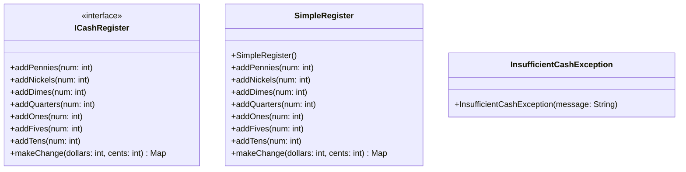
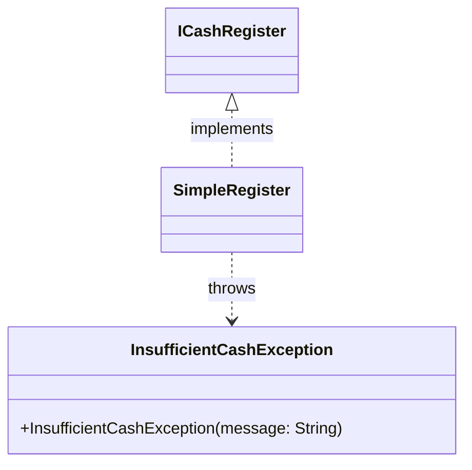

# CS 3100 Quiz 2 Practice

**Time Limit:** 80 minutes
**Format:** Multiple Choice (16 questions) + 1 free-response question

# Questions
---

## Part I: Multiple Choice (16 questions)

Select the single best answer for each question.

---


### Question 1

Consider this test for a `ThermostatController`:

```java
@Test
public void activatesHeatingWhenBelowTarget() {
    TemperatureSensor mockSensor = mock(TemperatureSensor.class);
    HVACService mockHVAC = mock(HVACService.class);
    NotificationService mockNotifier = mock(NotificationService.class);

    when(mockSensor.readTemperature("livingRoom")).thenReturn(65.0);

    ThermostatController controller = new ThermostatController(
        mockSensor, mockHVAC, mockNotifier);

    controller.adjustToTargetTemperature(72.0, "livingRoom");

    verify(mockHVAC).setMode(HVACMode.HEATING, "livingRoom");
    verify(mockHVAC).activate("livingRoom");
}
```

In this test, `mockHVAC` is acting as a:

- a) Stub — it returns a pre-configured value without real behavior
- b) Mock object verified with `verify()` — its primary role here is to assert method calls
- c) Integration test fixture — it connects to real hardware
- d) Spy — it records method calls for later verification

---

### Question 2

The SceneItAll IoT hierarchy from lecture is:

```
IoTDevice              <<interface>>
└── BaseIoTDevice      <<abstract>>
    ├── Fan
    └── Light          <<abstract>>
        ├── SwitchedLight
        └── DimmableLight
            └── TunableWhiteLight
```

Consider this code:

```java
Light light = new TunableWhiteLight("living-room", 2700, 100);
((DimmableLight) light).turnOn();
```

`TunableWhiteLight` overrides `turnOn()`. Which version of `turnOn()` is called?

- a) `DimmableLight`'s `turnOn()`, because the cast changes the runtime type of `light` to `DimmableLight`
- b) `Light`'s `turnOn()`, because `Light` is the declared type of `light` and static dispatch resolves to it
- c) A compilation error occurs because you cannot cast a `Light` reference to a `DimmableLight` subtype
- d) `TunableWhiteLight`'s `turnOn()`, because dynamic dispatch resolves calls using the object's runtime type

---

### Question 3
In the IoTDevices domain model, there is a need for an operation `changeAll(...)` that extracts the ids of all existing thermostats, iterates through them and changes their temperatures by the specified amount. Which responsibility assignment pattern is most useful to determine where this method should be added?

- a) Information Expert — `SmarthomeServiceImpl` has the data needed to implement this operation
- b) Creator — the command object is where a thermostat object is created
- c) Singleton — a separate, new class 
- d) Controller — handles the actual user instruction that requests this operation

---

### Question 4
Consider this domain model:

```java
// Version A: Technical-focused
public class SubmissionManager {
    private Map<String, List<byte[]>> fileStorage = new HashMap<>();
    private Map<String, Integer> versionCounters = new HashMap<>();
    private Map<String, Map<String, Object>> gradeData = new HashMap<>();
}

// Version B: Domain-aligned
public class Submission {
    private final Student student;
    private final Assignment assignment;
    private final List<SourceFile> files;
    private GradingSession activeGradingSession;
}
```

What is the primary advantage of Version B over Version A?

- a) Version B uses less memory because it has fewer fields
- b) Version B has a smaller representational gap — its structure mirrors how stakeholders think about the domain
- c) Version B compiles faster because it avoids generic types
- d) Version B is required by the Java language specification for domain objects, which mandates named types over raw collections in business logic

---

### Question 5
A developer uses an AI programming agent to generate a complete authentication module without reviewing the generated code or understanding how it works. Which of the following options best captures this particular use of AI:

- a) Effective use of AI to maximize productivity
- b) Pair programming with an AI partner
- c) The "vibe coding" trap — accepting AI output without applying domain knowledge to evaluate it
- d) The recommended approach for boilerplate code

---

### Question 6
When debugging, a developer notices that a `Recipe` object has an unexpected `null` value for its `instructions` field. They form the hypothesis: "The `instructions` field is set to `null` in the constructor." They then set a breakpoint in the constructor and run the program. This approach is an example of:

- a) Rubber duck debugging (explaining the code line by line)
- b) Trial-and-error debugging
- c) Print-statement debugging
- d) The scientific method applied to debugging — observe, hypothesize, predict, test

---

### Question 7
Consider this test for a `ThermostatController`:

```java
@Test
public void activatesHeatingWhenBelowTarget() {
    TemperatureSensor mockSensor = mock(TemperatureSensor.class);
    HVACService mockHVAC = mock(HVACService.class);
    NotificationService mockNotifier = mock(NotificationService.class);

    when(mockSensor.readTemperature("livingRoom")).thenReturn(65.0);

    ThermostatController controller = new ThermostatController(
        mockSensor, mockHVAC, mockNotifier);

    controller.adjustToTargetTemperature(72.0, "livingRoom");

    verify(mockHVAC).setMode(HVACMode.HEATING, "livingRoom");
    verify(mockHVAC).activate("livingRoom");
}
```

In this test, `mockSensor` is acting as a:

- a) Stub — it returns a pre-configured value without real behavior
- b) Mock object verified with `verify()` — its primary role here is to assert method calls
- c) Integration test fixture — it connects to real hardware
- d) Spy — it records method calls for later verification

---

### Question 8
What is the primary risk of relying exclusively on test doubles (mocks and stubs) for all testing?

- a) Test doubles are slower than real implementations
- b) Test doubles violate the Open/Closed Principle
- c) Test doubles are not supported by modern testing frameworks, which require real object instances to correctly measure code coverage
- d) Test doubles can give false confidence — tests pass even when real components don't integrate correctly

---

### Question 9
Consider the IoT `EnergyOptimizer` class:

```java
public class EnergyOptimizer {
    private final EnergyPricePort priceService;
    private final DeviceControlPort deviceControl;
    private final UserPreferencesPort preferences;

    public EnergyOptimizer(EnergyPricePort priceService,
                           DeviceControlPort deviceControl,
                           UserPreferencesPort preferences) {
        this.priceService = priceService;
        this.deviceControl = deviceControl;
        this.preferences = preferences;
    }
}
```

In Hexagonal Architecture, `EnergyPricePort` is a **port** and `GridPriceApiAdapter` (which calls a real pricing API) is an **adapter**. What is the main benefit of this separation?

- a) Adapters are faster than direct method calls
- b) The application core can be tested and reused without depending on any specific external system
- c) Ports can be named in a manner that makes code readable whereas adapters have to be given more specific names.
- d) The Java compiler requires interfaces for external dependencies involving I/O

---

### Question 10
Which of the following makes code difficult to test?

- a) Accepting dependencies through the constructor
- b) Defining behavior behind interfaces
- c) Using `new` to directly instantiate collaborators inside a method, hiding the dependency
- d) Separating domain logic from infrastructure code

---

### Question 11
Consider this code:

```java
public class ImportService {
    public void importRecipe(Path file) {
        Recipe recipe = parseRecipe(file);
        LibraryService.getInstance().addRecipe(recipe);
    }
}
```

What problem does the `LibraryService.getInstance()` call introduce?

- a) It makes `ImportService` slower by calling a static method
- b) It causes a `NullPointerException` at runtime
- c) It creates a hidden dependency that cannot be replaced for testing or reuse
- d) It violates the Single Responsibility Principle because `ImportService` now manages library instances

---

### Question 12
A developer refactors the code above to:

```java
public class ImportService {
    private final LibraryService library;

    public ImportService(LibraryService library) {
        this.library = library;
    }

    public void importRecipe(Path file) {
        Recipe recipe = parseRecipe(file);
        library.addRecipe(recipe);
    }
}
```

What is the most accurate description of this refactoring?

- a) Composition
- b) Dependency Injection
- c) Code reuse
- d) Command Pattern

---

### Question 13

In a `@NullMarked` package, a developer writes the following method:

```java
public String formatIngredient(@Nullable String prefix, String name) {
    if (prefix == null) {
        return name;
    }
    return prefix + " " + name;
}
```

Which of the following statements about this signature is correct?

- a) `name` is assumed non-null because the package is `@NullMarked`; passing `null` for `name` would produce a compile-time warning or error
- b) The `@Nullable` annotation on `prefix` is redundant because all parameters are nullable by default in Java
- c) `@Nullable` on `prefix` means the nullness checker will throw a `NullPointerException` automatically if `null` is passed
- d) Both `prefix` and `name` are treated as nullable because `@Nullable` anywhere in a method signature marks all parameters as nullable

---

### Question 14

Consider this Mockito test:

```java
@Test
public void activatesHeatingWhenBelowTarget() {
    TemperatureSensor mockSensor = mock(TemperatureSensor.class);
    HVACService mockHVAC = mock(HVACService.class);
    when(mockSensor.readTemperature("livingRoom")).thenReturn(65.0);

    ThermostatController controller = new ThermostatController(mockSensor, mockHVAC);
    controller.adjustToTargetTemperature(72.0, "livingRoom");

    verify(mockHVAC).activate("livingRoom");
}
```

What does the `verify(mockHVAC).activate("livingRoom")` line do?

- a) It asserts that `activate` was called exactly once with `"livingRoom"` as the argument
- b) It configures the mock to return a specific value the next time `activate` is called
- c) It checks that `mockHVAC` was originally constructed using `"livingRoom"` as a parameter
- d) It registers a callback so that a real HVAC system is contacted if `activate` is called

---

### Question 15

Consider the following JavaFX code:

```java
submitButton.setOnAction(event -> {
    System.out.println("Submitted!");
});
System.out.println("Button registered.");
```

In what order do `"Button registered."` and `"Submitted!"` appear in the console?

- a) "Button registered." first, then "Submitted!" when the user clicks -- the callback is invoked by the event loop
- b) "Submitted!" first -- the callback runs immediately when `setOnAction` is called, before registration returns
- c) Both execute simultaneously on separate threads because JavaFX uses a background event dispatcher
- d) "Button registered." first, then "Submitted!" immediately after on the same call stack, without waiting for user input

---

### Question 16

Compare two versions of a CookYourBooks recipe scaling feature. Version A's button handler manually iterates over ingredients and calls `ing.scale(factor)`. Version B's handler calls `model.scale(servings)` and then updates the view. Which better follows MVC?

- a) Version A, because it gives the Controller direct control over scaling each ingredient
- b) Version B, because scaling logic belongs in the Model; the Controller should delegate
- c) Version A, because the Controller should perform all computation to keep the Model simple
- d) Version B, because bidirectional data binding between Model and View ensures the ingredient list updates automatically

---

## Part II: Open-Ended Case Studies (1 question)

Answer each sub-part in a few sentences. Point values are shown next to each subpart.

---

### Case Study 1

You are given the following design. Specifically the `ICashRegister` interface represents all operations for a cash register that stores US coins and notes. It offers a method to make change for the specified amount. The `SimpleRegister` class implements this interface. The `makeChange` method throws an `InsufficientCashException` if it cannot make change, and each one of the `addXXX` methods throws an `IllegalArgumentException` if the amount provided to it is negative.





This class has been tested and works correctly. The problem is that this design is too coupled with the US currency system: it references specific denominations as as pennies, nickels, etc. However the logic of making change remains the same irrespective of the currency system. In this problem, you will redesign this so that a single object of a cash register represents one specific currency, and supports all of the above operations on it (i.e. being able to add various denominations and make change).

**(a)** [20 points] Write the code for an interface that would represent such a general-purpose cash register. This interface should enable the same kinds of operations that the above one does: ability to add coins and notes, as well as make change.<!-- space: 3.5in --> 

Your answer should contain the Java code for this interface (no implementation). No comments/documentation is necessary, but be sure to name each method in a way that it is easy to understand. 

**(b)** [10 points] Provide a snippet of code that illustrates how your design can be used to store Euros (similar to dollars and cents in the US currency system, there are euros and cents in that system). Your code should include an example that creates a cash register object capable of storing euros, and adding at least two denominations to it. You need not call `makeChange`. By looking at your code, a reader should be able to understand how your design works.<!-- space: 3.5in -->

**(c)** [20 points] Assuming this code works, your objective is now to "phase out" the provided `SimpleRegister` class. To do so, you must provide an implementation of the existing `ICashRegister` class that uses your design from above to provide a cash register implementation specifically for US currency. Assume that you have an implementation of the interface you designed (you likely used it in part (b)). Your implementation should be such that it can replace each instance of `SimpleRegister` objects in any current code without any further changes.<!-- space: 3.5in -->

Provide a point-wise answer of which interfaces and classes you will write, and how you will implement them. While no code is necessary, a student should be able to read your answer and be able to write the code correctly. A correct answer in paragraph form will lose points!

---


# Answers

## Part I: Multiple Choice (16 questions)

| Q | Answer | Topic |
|---|--------|-------|
| 1 | B | |
| 2 | D | |
| 3 | A | |
| 4 | B | |
| 5 | C | |
| 6 | D | |
| 7 | A | |
| 8 | D | |
| 9 | B | |
| 10 | C | |
| 11 | C | |
| 12 | B | |
| 13 | A | |
| 14 | A | |
| 15 | A | |
| 16 | B | |

## Part II: Open-Ended Case Studies (1 question)

### a. (20 points)

5 points: interface has a reasonable name
5 points: interface provides methods to add coins/notes of multiple denominations
5 points: method names are not specified to US or any other specific currency
5 points: interface provides methods to make change

### b. (10 points)

4 points: code shows how to create an object and what arguments to provide
3 points: code adds coins/notes of 1 denomination
3 points: code adds coins/notes of one more denomination


### c. (20 points)

5 points: new class implements ICashRegister
5 points: if they used inheritance to reuse implementation of their interface
OR
10 points: they used composition 
5 points: they used dependency injection to insert implementation of their interface